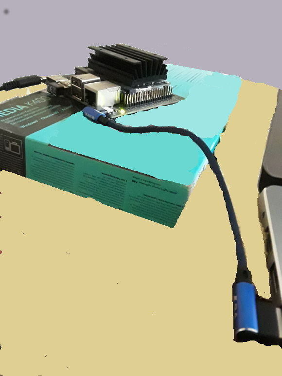

# NVidia Jetson Nano Wifi

GPU geliştirmesi için Jetson Nano ürünü var, Türkiye'de 100 dolar
civarı fiyatla satılıyor. Altta görülen Nano 2GB Wifi ürünü. Güç
kaynağı bu pakete dahil değil, 5 Volt, 3 Amperlik bir adaptor almak
lazım. Raspberry Pi uyumlu bu tür adaptörler var.

Ya da Nano güç kablosunun ucu standard USB olduğu için eğer buna bir
mikro USB adaptoru bağlarsak bir akıllı telefon, ya da tablet ile ona
güç verebiliriz. Böyle adaptörler mevcut, bendeki ürün
[PNY Android OTG](usbadaptor.jpg). Adaptor Android şekilli yapılmış,
android kafası çevrilince mikro USB görülüyor, alt bölümde ise standard
USB girişi var.

Ayrı güç kaynağı powerbank kullanmak isteyenler amper çıkışı uygun
olan bir ürün alabilir, mesela [şuradaki
ürün](https://www.amazon.com.tr/S8000-8000mAh-Ta%C5%9F%C4%B1nabilir-Cihaz%C4%B1-Beyaz/dp/B07FM2GBYJ)
işliyor.

Paketten iki tane ek kablo çıkacak, bunlardan birinin ucunda bir ufak
"dongle" var, üzerinde CE yazıyor, bu Wifi özelliği sağlıyor (dongle
kabloya bağlı geliyor, o çıkartıldıktan sonra kabloya gerek yok),
alttaki resimde devrenin sol altında. Diğer kablonun bir ucu
dizüstüne, diğeri Nano'ya takılacak, nihai resim



İşletim sistemi mikro SD kart üzerinden, en az 64 GB iyi olur,
işlemler aynen [Raspberry Pi](../07/raspberrypi.html) durumunda olduğu
gibi. Orada olduğu gibi yine işletim sistemi indirilecek, ve SD'ye
"yakılacak". Mikro SD de pakete dahil değil ayrıca alınması lazım.

https://developer.nvidia.com/jetson-nano-2gb-sd-card-image

Şöyle bir komutla indirebilir,

```
wget --continue https://developer.download.nvidia.com/assets/embedded/downloads/jetson-nano-2gb-jp441-sd-card-image/jetson-nano-2gb-jp441-sd-card-image.zip
```

Büyük bir dosya dikkat. İndirildikten sonra yakmak için Etcher adlı
bir program kullanılır,

Etcher

https://www.balena.io/etcher/

https://phoenixnap.com/kb/etcher-ubuntu

Zip indirilir, açılır, içinde bir işler program var, tıklanır, görsel
programla yakma yapılır (Nano imajı seçilir, hedef seçilir, yak
denilir).

Yakma işlemi bitince kart Nano'ya sokulur, bağlantılar yapılır, ve
sistem başlayınca HDMI üzerinden monitöre bağlanılıp, fare, klavye
Nano'ya bağlanılıp oradan kuruluma devam edilir. Burada isim,
kullanıcı ismi, şifre, coğrafi yer vs sorulacak, bu bilgileri
gireriz. Wifi bağlantısı orada görülecek, Wifi şifresi girilince
bağlantı kurulacaktır. Wifi bağlantısı Nano'nun dışarıdan program
indirmesi için faydalı, ama Nano'ya bizim girmemiz için şart değil.

Aradaki o mavi kablo üzerinden seri bağlantıya dikkat, dizüstündeki
Ubuntu üzerinde

```
$ dmesg | grep --color 'tty'
[106921.687362] cdc_acm 1-2:1.2: ttyACM0: USB ACM device
```

deyince üsttekini görebilmek lazım.  Ya da `ls /dev/tty*` ile bakarsak
orada bir `/dev/ttyACM0` olmalı. 

Şimdi 


```
sudo screen /dev/ttyACM0 115200
```

seri bağlantı üzerinden ile sisteme girebiliriz, bunu bir kere /
gerektiğinde yapmak yeterli, IP adresini almak için. Nano sistemi o
seri bağlantı üzerinden bir yerel Ethernet bazlı bir ağ yaratıyor,
Ubuntu tarafında bu ağın görülmüş olması lazım. `NVidia Ethernet
Connection` ve `Wired Connection` gibi ifadelerin ağ listesinde
görülüyordur herhalde. Ethernet'i seçmek, aktif hale getirmek gerekir.

Neyse bir kerelik seri bağlantından girince `ifconfig -a` ile sistemin
IP adresini alırız, bende `l4tbr0` birimine bağlı olan IP'yi aldım,
ardından ben tüm ek işlemleri `ssh kullanıcı@IP` ile Nano'ya `ssh`
girerek ayrı bir ekranda yapıyorum.

Yeni sistemimizi kontrol edelim. `ssh` ile girip,

```
sudo nvpmodel -q

NVPM WARN: fan mode is not set!
NV Power Mode: MAXN
0
```

görülebilir, bu GPU durumunu raporladı. CUDA ekleri olan C++
derleyicisi için `nvcc` erişimi lazım,


```
vim ~/.bashrc
```

Ve dosya sonuna

```
export PATH=${PATH}:/usr/local/cuda/bin
export LD_LIBRARY_PATH=${LD_LIBRARY_PATH}:/usr/local/cuda/lib64
```

ekleriz, kaydederiz, ve komut satırına dönüp,

```
source ~/.bashrc
```

işletiriz, şimdi 

```
nvcc --version
```

```
nvcc: NVIDIA (R) Cuda compiler driver
Copyright (c) 2005-2019 NVIDIA Corporation
Built on Wed_Oct_23_21:14:42_PDT_2019
Cuda compilation tools, release 10.2, V10.2.89
```

göstermeli.

Not

Kurulum işlemini tamamen seri bağlantı üzerinden text bazlı da yapmak
mümkün, alttaki video'da anlatılıyor, macera isteyenler bunu
seçebilir, o zaman monitör vs bağlantısına gerek kalmaz.

PyCuda

Alttaki komutları yine Nano komut satırında işletiyoruz,


```
sudo apt install python3-pip

pip3 install cython

pip3 install pycuda
```

Acaba dizüstünde geliştirip Nano'ya işletmek için sürekli gönderme
yapabilir miyiz? Evet. Hatta uzaktaki bir dizini `sshfs` ile
monteleyebiliriz, bkz [şuradaki](../../2005/10/bir-makinaya-ssh-ile-sifresiz-giris.html) `ssh`
yazı. Sonra [PyCuda](gpu-cuda-pycuda.html) yazısındaki herhangi bir örneği alırız,
GPU tipini gösteren örnek mesela, onu `tst.py` diye dizüstünde
kaydedelim, sonra mesela tüm kodların Nano üzerinde
`/home/user/Documents` dizininde olacak şekilde

```bash
ssh burak@nano1 "/bin/bash /home/user/Documents/pygpu.sh $1"
```

Nano üzerinde `/home/user/Documents/pygpu.sh` dosyası lazım, uzaktan o
çağrılıyor (direk `python3` çağırmak ise yaramayabilir çünkü bazı
çevre değişkenlerinin set edilmesi lazım), onun içeriği

```bash
export PATH=${PATH}:/usr/local/cuda/bin
export LD_LIBRARY_PATH=${LD_LIBRARY_PATH}:/usr/local/cuda/lib64
/usr/bin/python3 /home/user/Documents/$1
```

Script'i `run.sh` olarak kaydetsek, `sh run.sh tst.py` ile cağrınca bu
uzaktan `ssh` ile o dosya üzerinde `python3` işletilmesini
sağlar.

Tabii tüm bu numaralar bir yana Nano'ya login edip komutu direk orada
da işletebiliriz. O komut satırının ayrı durması için o pencereye
farklı bir renk vermek iyi olur, benim Nano `.bashrc` de şu satır ekli,

```
PS1='${debian_chroot:+($debian_chroot)}\[\033[01;35m\]\u\[\033[01;30m\]@\[\033[01;32m\]\h\[\033[00m\]:\[\033[01;34m\]\w\[\033[00m\]\$ '
```

Eğer mesela `matplotlib` kurmak istersek, 

```
sudo apt install libfreetype6-dev

pip3 install matplotlib==2.0
```

gerekli. En son matplotlib hata verdi. Kod icinde goruntusuz isletmek icin

```
import matplotlib; matplotlib.use('Agg')
```

gerekebilir.

Devam edelim, `tst.py` işletince bizde

```
Device 0: NVIDIA Tegra X1
         Compute Capability: 5.3
         Total Memory: 1979 megabytes
```

sonucu geldi. PyCuda işliyor demektir.

Bir kere arada `ssh` bağlantısı kurulunca daha ilginç şeyler de
yapılabilir, `ssh` üzerinden görsel X tünellemesi mesela, Nano
üzerinde görsel program işletip sonucu kendi makinamızda görebiliriz,
ya da Jupyter servisi işletip dizüstü tarayıcısı ile ona
bağlanabiliriz, vs. Ben kendi açımdan Nano üzerindeki yükü az tutmaya
uğraşıyorum.

Test olarak alttaki kodu islettik,

```python
import numpy as np
import pycuda.autoinit
from pycuda import gpuarray
from time import time
from pycuda.elementwise import ElementwiseKernel

host_data = np.float32( np.random.random(10**7) )

gpu_2x_ker = ElementwiseKernel(
"float *in, float *out",
"out[i] = 2*in[i];",
"gpu_2x_ker")


# hizlandirma icin onceden ufak veri uzerinde islet
host_data_small = np.float32( np.random.random(10) )
device_data_small = gpuarray.to_gpu(host_data_small)
device_data_2x_small = gpuarray.empty_like(device_data_small)
gpu_2x_ker(device_data_small, device_data_2x_small)

t1 = time()
host_data_2x =  host_data * np.float32(2)
t2 = time()

print ('CPU: %f' % (t2 - t1))
device_data = gpuarray.to_gpu(host_data)
device_data_2x = gpuarray.empty_like(device_data)

t1 = time()
gpu_2x_ker(device_data, device_data_2x)
t2 = time()

from_device = device_data_2x.get()
print ('GPU: %f' % (t2 - t1))
```

```
CPU: 0.031684
GPU: 0.000274
```

GPU'nun 115 kat daha hızlı olduğunu görüyoruz. İlginç Nano üzerindeki
çekirdek sayısı da 128 değil mi?

### Tensorflow

Jetson üzerinde Tensorflow kurulumu için hangi Jetpack geliştirme ortamına
sahip olduğumuza bakalım,

```
sudo apt-cache show nvidia-jetpack
```

Ben gördüğüm versiyona göre [10]'a danıştım, ve gerekli wheel `.whl`
dosyasını indirdim,

```
wget https://developer.download.nvidia.com/compute/redist/jp/v44/tensorflow/tensorflow-2.2.0+nv20.7-cp36-cp36m-linux_aarch64.whl
```

Sonra bu dosyayı ayrı bir virtualenv içinde

```
pip3 install tensorflow-2.2.0+nv20.7-cp36-cp36m-linux_aarch64.whl
```

ile kurduk. 

### Bağlanmak

Komut Satırı

`ssh` ya da X programlarını kendi ekranımızda görmek için `ssh
user@host -X` kullanabiliriz. Pür metin bazlı kullanım hızlıdır; daha
da hızlandırmak için `sudo init 3` işletirsek [11] Nano'nun masaüstü
idarecisini tamamen kapatmış oluruz, böylece makina sanki bir servis
makinasıymış gibi işler. Eğer her başlangıçta masaüstü iptal olsun
istiyorsak `sudo systemctl set-default multi-user.target` işletiriz,
eski duruma dönmek için `sudo systemctl set-default graphical.target`.

Pek cok program Unix uzerinde komut pur terminal bazli calisabilir,
`emacs` bunlardan biri. `emacs -nw` ile text bazli editor
baslatabiliriz.

VNC

`ssh -X` ile bağlanınca Nano'da X programlarının çıktısını direk
bağlandığımız diğer bir makinaya aktarabiliriz, fakat ne yazık ki
OpenGL görüntüleri bu şekilde aktarılamıyor. Acaip hatalar
görüyorsunuz (alttaki paragrafta bir uyarı daha var), fakat monitörle
Nano'ya bağlanınca herşey iyi işliyor. Burada çözüm VNC kullanmak.

Not: OpenGL içeren kodları arka plandaki çıktısını `ssh` üzerinden
görmek istersek, ve `ssh -X` ile girdiysek grafik çağrıları
patlar. Grafik çağrıların yok sayılmasını sağlamak için (ki böylece
`cout` ile eklenen log mesajlarını görebilelim) pür `ssh` ile girmek
lazım. 

VNC programlarını kullanmışızdır, bu programlar ile bir bilgisayarın
tüm masaüstünü kendi makinamızda görebiliriz. Nano'da bunu yapmak için
birkaç adımı uygulamak lazım, [6,7,8] kaynaklarına bakabiliriz. Yanlız
dikkat, sadece [8] yöntemi vino servisi eğer monitör bağlı değilse
işlemiyor (VNC'nin tüm faydaları sıfırlanmış oluyor yani). VNC düzgün
işlemesi için Nano Unix kullanıcınızın otomatik olarak sistem
başlayınca login olmasını sağlamak lazım, bkz [6,7]. Ubuntu `User
Accounts` penceresinden `Automatic Login` aktif edilmeli. Tabii bu
ekrana gelebilmek için de masaüstü idarecisi Unity olmalı, diğer
idarecilerle buraya ulaşamadık. Eğer o değilse Unity'ye geçmek için
monitorle bağlandığımız Nano Ubuntu'dan kullanıcı çıkışı (logout)
yaparız, sonra tekrar giriş sırasında şifre girilen kutunun yanında
ayak izi ikonu var, ona tıklayınca orada idareci seçenekleri çıkacak,
burada Unity seçeriz, ve sisteme böyle gireriz. Servis tarafı böyle
ayarlanır.

Nihayet müşteri tarafı bağlanmasına geldik, dizüstü bilgisayarında
benim Ubuntu 18'de `remmina` programı var, bu programa İP adresini
verip bağlanma metotu olarak VNC seçersek, artık Nano'ya görsel olarak
bağlanabiliriz.

Bir diğer seçenek, aynen Raspberry Pi durumunda olduğu gibi, ufak bir
elle tutulan HDMI monitör ve dongle'li klavye/mouse donanımı almak, bu
ikisini direk Nano'ya bağlayınca her şeyi, hiç dizüstünden geçmeden,
Nano üzerinde yapabiliriz. Nano tek başına oldukca kuvvetli bir
bilgisayar, eh kendi Ubuntu'su var, tam tekmilli bir bilgisayar olarak
kullanılabilir.

### Ornekle

Örnek Cuda Kodları

C++ üzerinden CUDA kodlamak için Nano üzerinde bolca örnek var. Bu
örnekler SD yakma işlemi sırasında Nano'ya tranfer edilmiş oldu,
örnekler `/usr/local/cuda-[versiyon]/samples` altında
bulunabilir. Derlemek için bu dizini tamamen kopyalayıp `user` için
mesela `/home/user` altında bir yerlere koymak en iyisi, yoksa
`/usr/local` için izin hataları verilebilir.

Bu kopyada `make` uygularız, o komut tüm örnekleri derler. `nvcc`
ayarlarını üstte anlattık, derleme işlemi onu kullanıyor. Tüm derleme
işlemi biraz uzun sürecek, ama bitince her örnek işletilir halde hazır
olacaktır. Mesela `samples/5_Simulations/oceanFFT` altında
`./oceanFFT` örneğini işletebiliriz, Nano monitöründen ya da VNC
üzerinden görebiliriz, su simulasyonu gayet güzel görülüyor.

Particles

Bu örnek kodlardan partıcles adlı projenin görsel kodları mümkün
olduğu kadar çıkartılmış hali altta bulunabilir,

[Makefile](particles/Makefile),
[particles.cpp](particles/particles.cpp)
[particles_kernel.cuh](particles/particles_kernel.cuh),
[particles_kernel_impl.cuh](particles/particles_kernel_impl.cuh),
[particleSystem.cpp](particles/particleSystem.cpp),
[particleSystem_cuda.cu](particles/particleSystem_cuda.cu),
[particleSystem.cuh](particles/particleSystem.cuh),
[particleSystem.h](particles/particleSystem.h),
[view.py](particles/view.py)

Kaynaklar

[1] https://imadelhanafi.com/posts/jetson_nano_setup/

[2] https://developer.nvidia.com/embedded/learn/get-started-jetson-nano-2gb-devkit

[3] https://developer.nvidia.com/embedded/learn/get-started-jetson-nano-devkit#setup

[4] https://developer.nvidia.com/embedded/learn/get-started-jetson-nano-2gb-devkit#write

[5] https://youtu.be/Ch1NKfER0oM

[6] https://medium.com/@bharathsudharsan023/jetson-nano-remote-vnc-access-d1e71c82492b

[7] https://www.hackster.io/SaadTiwana/embedded-diaries-simple-remote-desktop-access-for-jetson-c1300a

[8] https://developer.nvidia.com/embedded/learn/tutorials/vnc-setup

[9] https://www.youtube.com/watch?v=KROP46Wte4Q

[10] [Forum](https://forums.developer.nvidia.com/t/correct-version-of-tensorflow-for-jetpack-4-4/149310/3)

[11] https://www.forecr.io/blogs/bsp-development/how-to-disable-desktop-gui-on-jetson-modules

