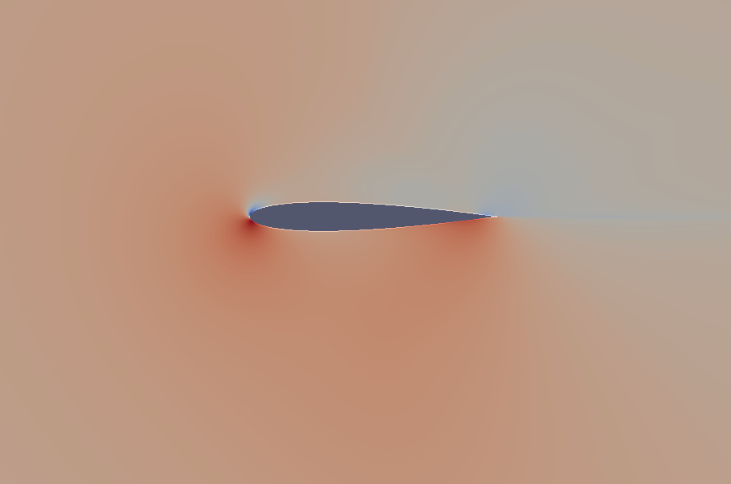

# SU2

ŞU2 aerodinamik simülasyonları için açık kaynak bir programdır.

[[Kaynak]](https://github.com/su2code/SU2/releases/tag/v7.0.2)

Kaynak kodu indirelim, açalım. İşler program `/usr/local/bin` altına
gidece şekilde kurmak için, dizine girip

```
./meson.py build --prefix=/usr/local

./ninja -C build install
```

Meson ve ninja yeni bir derleme sistemi (daha önce `make` ile yapılan işleri
yapıyor), hızlı işliyor. Derleme sonunda `.başhrç` içine koymanız tavsiye
edilen bazı ayarlar var,

```
export SU2_RUN=/usr/local/bin
export SU2_HOME=/home/user1/vs/vs/SU2-7.0.2
export PATH=$PATH:$SU2_RUN
export PYTHONPATH=$PYTHONPATH:$SU2_RUN
```

gibi olabilir. Bunları `.bashrc` içine koyalım, komut satırı kapatıp
tekrar açalım.

Örnek olarak alttaki ufak dersi takip edebiliriz. Derste gösterilen
ayar dosyası (configuration file) ve hesapsal izgarayı tanımlayan
dosya (mesh file) indirilir, 

https://su2code.github.io/tutorials/Inc_Turbulent_NACA0012/

Bu ders türbülanslı bir ortamda bir uçak kanadı kesidinin (airfoil)
hava akışına nasıl tepki vereceğini simüle ediyor. Hava kesidin
üzerinden soldan sağa doğru 52 m/s hızı civarında akıyor. Kesitlerin
tasarımı öyledir ki tasarıma göre bu akış alttan itiş (lift) ve hava
direnci (drag) oluşturur, eğer itiş yeterince büyükse uçak uçar.

Artık

```
SU2_CFD turb_naca0012.cfg
```

ile hesabi isletebiliriz. Dongu sayisi biraz fazla tanimlanmis olabilir,
onu mesela `ITER= 100` daha az hale getirebiliriz.

İşlem bitince `surface_flow.vtk`, `flow.vtk`, dosyaları üretilmiş olacak.
Bu dosyalar sonuç verilerini içeriyor, onlara görsel şekilde bakmak mümkün,
`paraview` programı bunun için.

```
apt-get update

apt-get install paraview

sudo apt install libcanberra-gtk-module libcanberra-gtk3-module
```

Simdi

`paraview` ile işletiriz, önce `surface_flow.vtk` açarız, `Apply` düğmesine tıklarız.
Sonra `flow.vtk` açarız, tekrar `Apply`. Bu alttaki görüntüyü çıkartmalı,



Bu basinc haritasini gosteriyor, maviye yakin renkler alcak basinc, kirmiziya
yakin olanlar yuksek basinc.


