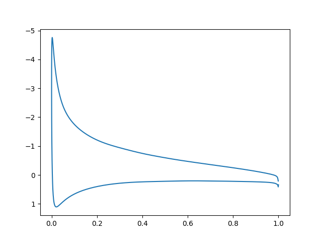

# SU2

SU2 aerodinamik simülasyonları için açık kaynak bir programdır. Sıfırdan
derleyip kullanmak için alttaki tarifi takip edebiliriz.

[Kaynak](https://github.com/su2code/SU2/releases/tag/v7.0.2)

Kaynak kodu indirelim, açalım. İşler program `/usr/local/bin` altına
gidecek şekilde kurmak için, dizine girip

```
./meson.py build --prefix=/usr/local

./ninja -C build install
```

Meson ve ninja yeni bir derleme sistemi (daha önce `make` ile yapılan işleri
yapıyor), hızlı işliyor. Derleme sonunda `.bashrc` içine koymanız tavsiye
edilen bazı ayarlar var,

```
export SU2_RUN=/usr/local/bin
export SU2_HOME=/home/user1/vs/vs/SU2-7.0.2
export PATH=$PATH:$SU2_RUN
export PYTHONPATH=$PYTHONPATH:$SU2_RUN
```

gibi olabilir. Bunları `.bashrc` içine koyalım, komut satırı kapatıp
tekrar açalım.

Programı kullanmak için bir örnek takip edelim, mesela alttaki [1]
dersi takip edebiliriz.

Derste gösterilen ayar dosyası (configuration file) ve hesapsal
izgarayı tanımlayan dosya (mesh file) indirilir. Bu ders türbülanslı
bir ortamda bir uçak kanadı kesidinin (airfoil) hava akışına nasıl
tepki vereceğini simüle ediyor. Hava kesidin üzerinden soldan sağa
doğru 52 m/s hızı civarında akıyor, kesit yere göre 10 derece açıyla
duruyor (angle of attack -AOA-). Kesitlerin tasarımı öyledir ki
tasarıma göre bu akış alttan itiş (lift) ve hava direnci (drag)
oluşturur, eğer itiş yeterince büyükse uçak uçar.

Artık

```
SU2_CFD turb_naca0012.cfg
```

ile hesabı işletiriz. Döngü sayısı fazlaysa, onu mesela `ITER=500`
azaltırız. İşlem bitince `surface_flow.vtk`, `flow.vtk`, dosyaları
üretilmiş olacak.  Bu dosyalar sonuç verilerini içeriyor, onlara
görsel şekilde bakmak mümkün, `paraview` programı bunun için.

```
apt-get update

apt-get install paraview

sudo apt install libcanberra-gtk-module libcanberra-gtk3-module
```

Simdi `paraview` ile işletiriz, önce `surface_flow.vtk` açarız,
`Apply` düğmesine tıklarız.  Sonra `flow.vtk` açarız, tekrar
`Apply`. Bu alttaki görüntüyü çıkartmalı,


Bu basınç haritasını gösteriyor, maviye yakın renkler alçak basınç, kırmızıya
yakın olanlar yüksek basınç. Basınç tabii ki bir itiş kuvvetidir, eğer altta
daha fazla yüksek basınç varsa kanat kesidi uçmaya daha elverişlidir.

Simülasyonda kullanılan NACA 0012 kanat kesidi standart bir şekli,
testlerde sürekli kullanılır. Üstte görülen simülasyon iki boyutta,
istikrarlı (steady) ve türbülansı ortalamayla basitleştirmeye uğraşan
RANS yaklaşımını kullanmıştır (spesifik olarak Spalart-Allmaras
türbülans modeli).  Diğer teknik parametreler orijinal ders sayfasında
bulunabilir.

Basınç Katsayısı (Pressure Coefficient)

Ders [1]'de gösterilen grafik için (10 derece AOA için olan) SU2'ye
bazı ek veri dosyaları ürettirmek lazım, ayar dosyasında,

```
OUTPUT_FILES= (RESTART, TECPLOT_ASCII, SURFACE_TECPLOT_ASCII)
```

tanımı bize içinde metinsel çıktı olan `surface_flow.dat` dosyasını
verecek. Bu veride 7'inci kolon basınç katsayısı Cp'yi içeriyor, x
ekseninde 0'inci kolondaki `x` verisi. Alttaki kodla grafikleyebiliriz.

```python
import pandas as pd

df = pd.read_csv('surface_flow.dat',skiprows=3,sep='\t',header=None)
plt.gca().invert_yaxis()
plt.plot(df[0], df[6])
plt.savefig('su2_02.png')
```



Y ekseninin tersine çevirilmesinin sebebi kesidin üst tarafını
grafiğin üst kısmında görebilmek, ve bakıyoruz ki orada değerler eksi,
ki Cp tanımına göre alçak basınç orada. Grafik aynı x değeri için iki
y değeri gösteriyor normal olarak çünkü kesidin alt kısmı ve üst kısmı
var.

Paralel isletmek icin

```
parallel_computation.py -f turb_naca0012.cfg -n 4
```

Kaynaklar

[1] https://su2code.github.io/tutorials/Inc_Turbulent_NACA0012/


