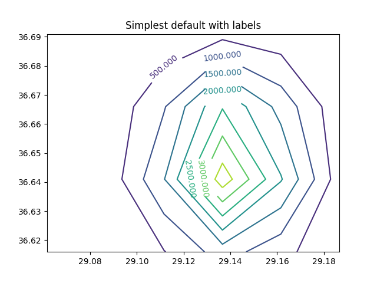
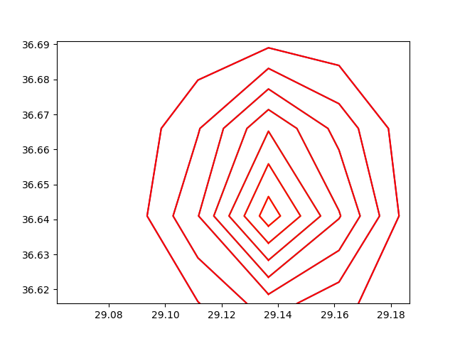

# Yükseklik Verisini Kontur olarak Folium Haritasında Göstermek

Matplotlib'de `contour` komutu `x,y` ızgarasında üç boyutta yükseklik
olarak kabul edilebilecek `z` verisini "kuşbakışı" olarak
gösterebilen, kesit seviyelerini, bir nevi topografik haritayı
hesaplabilen bir komuttur. Peki bu seviyeleri alıp Matplotlib ile
direk bağlantısı olmayan Folium [3] haritalarına taşımak istesek bunu
nasıl yaparız? Üç boyutlu yükseklik verisini iki boyutlu kesit
seviyelerine dönüştürmek kolay değil, `contour` içindeki kodu bu iş
için kullansak tekrar yazmaya gerek kalmazdı. Bunu yapmak mümkün,
çünkü `contour` bize seviyeleri temsil eden parçaları dondürebiliyor.

Örnek üzerinde görelim. Belli `x,y` değerleri arasında bir ızgara
yaratalım (bu değerler TR haritasında özel bir yere tekabül edecek
şekilde seçildi, ki sonra Folium'da gösterim yapabilelim), ve ızgaraya
bir tane "tepe" koyalım, bunu iki degiskenli (bivariate, ve üç
boyutlu) Gaussian fonksiyonu ile yapabiliyoruz, ve kesit seviyelerini
gösterelim,


```python
import matplotlib
import numpy as np
import matplotlib.cm as cm
import matplotlib.mlab as mlab
import matplotlib.pyplot as plt

matplotlib.rcParams['xtick.direction'] = 'out'
matplotlib.rcParams['ytick.direction'] = 'out'

def bivariate_normal(X, Y, sigmax=1.0, sigmay=1.0,
                 mux=0.0, muy=0.0, sigmaxy=0.0):
    Xmu = X-mux
    Ymu = Y-muy
    rho = sigmaxy/(sigmax*sigmay)
    z = Xmu**2/sigmax**2 + Ymu**2/sigmay**2 - 2*rho*Xmu*Ymu/(sigmax*sigmay)
    denom = 2*np.pi*sigmax*sigmay*np.sqrt(1-rho**2)
    return np.exp(-z/(2*(1-rho**2))) / denom

delta = 0.025
x = np.arange(29.06161, 29.20870, delta)
y = np.arange(36.61599, 36.70624, delta)
X, Y = np.meshgrid(x, y)
Z = 10*bivariate_normal(X, Y, 0.02, 0.02, 29.13920, 36.64653)

plt.figure()
CS = plt.contour(X, Y, Z )
plt.clabel(CS, inline=1, fontsize=10)
plt.savefig('elev1.png')
```



Sanki bir "dağa" üstten bakıyoruz, dağın eteklerinde 500 metre
yükseklik var, sonra giderek yükseliyor, ve en tepede 3000 metreye
ulaşıyoruz.

Üstteki grafiği oluşturan ham bilgilere erişmek mümkün. Gördüğümüz
gibi çağrıyı `CS = plt.contour` ile yaptık, döndürülen `CS` içinde
gerekli bilgiler var. Bu bilgiler bölümler (segments) olarak
tutulmuş, mesela

```python
print (CS.levels)
```

```text
[   0.  500. 1000. 1500. 2000. 2500. 3000. 3500. 4000.]
```

```python
print (len(CS.allsegs))
```

```text
9
```

sonucunu verir. 1'inci bölümdeki 0'ıncı alt bölümde,

```python
CS.allsegs[1][0]
```

```text
Out[1]: 
array([[29.16850299, 36.61599   ],
       [29.18289603, 36.64099   ],
       [29.17913935, 36.66599   ],
       [29.16161   , 36.68398265],
       [29.13661   , 36.68902999],
       [29.11161   , 36.67980347],
       [29.0986095 , 36.66599   ],
       [29.09359308, 36.64099   ],
       [29.11161   , 36.61651895],
       [29.11231435, 36.61599   ]])
```

görülüyor. İşte bu noktalar kesit seviyelerini oluşturan çizgilerin baş
ve son noktaları. Eğer o çizgileri ayrı ayrı kendimiz çizmek istesek,


```python
plt.figure()
CS = plt.contour(X, Y, Z)
for i in range(len(CS.allsegs)):
    for li in range(len(CS.allsegs[i])):
        x = CS.allsegs[i][li][:,0]
        y = CS.allsegs[i][li][:,1]
        plt.plot(x,y,'r-')
plt.savefig('elev3.png')
```



Aynı grafiği Folium ile yapmak için,

```python
import folium

clat,clon=36.64653, 29.13920

m = folium.Map(location=[clat, clon], zoom_start=11, tiles="Stamen Terrain")
for i in range(len(CS.allsegs)):
    for li in range(len(CS.allsegs[i])):
        points = []
        x = CS.allsegs[i][li][:,0]
        y = CS.allsegs[i][li][:,1]
        for lon,lat in zip(x,y): points.append([lat,lon])
        folium.PolyLine(points, color='red', weight=1.0, opacity=1).add_to(m)

m.save('elev.html')
```

Sonuçlar [şurada](elev.html) görülebilir.

Yükseklik verilerini alma tekniklerini [4]'te göstermiştik; bir
bölgedeki yükseklik verisini, sonra o veriyi kullanıp daha yüksek
çözünürlü yükseklik verisini aradeğerleme ile hesaplama teknikleri o
yazıda bulunabilir.

Kaynaklar

[1] [Tutorialspoint](https://www.tutorialspoint.com/how-to-get-coordinates-from-the-contour-in-matplotlib)

[2] [Stackoverflow](https://stackoverflow.com/questions/19418901/get-coordinates-from-the-contour-in-matplotlib)

[3] [Haritalamak](../../2020/02/haritalamak.html)

[4] [Yükseklik (Elevation) Verileri](../../2019/04/elevation.html)


