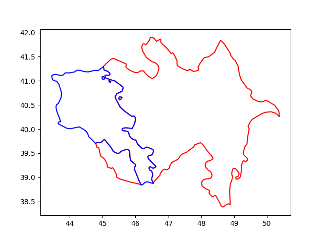

# Haritalama, Ülke Sınırları, SHP Shapefile, PySHP

```python
import shapefile
sf = shapefile.Reader("TM_WORLD_BORDERS-0.3.shp", encoding = "ISO8859-1")
```

```python
r = sf.records()
countries = sf.shapes()
print (len(countries))
idx = 2
country = countries[idx]
name = r[idx]
print (len(country.points))
print (country.parts)
print (name)
```

```text
246
871
[0, 108, 118, 131, 859]
Record #2: ['AJ', 'AZ', 'AZE', 31, 'Azerbaijan', 8260, 8352021, 142, 145, 47.395, 40.43]
```


```python
import shapefile
sf = shapefile.Reader("TM_WORLD_BORDERS-0.3.shp", encoding = "ISO8859-1")
r = sf.records()
countries = sf.shapes()

def plot_country(idx,color='r'):
   country = countries[idx]
   name = r[idx]
   print (name)
   bounds = list(country.parts) + [len(country.points)]
   print (bounds)
   for previous, current in zip(bounds, bounds[1:]):    
       geo = [[x[0],x[1]] for x in country.points[previous:current]]
       if len(geo) < 1: continue
       geo = np.array(geo)
       if geo.shape[0] > 0:
           plt.plot(geo[:,0],geo[:,1],color)

plot_country(2,'r')
plot_country(4,'b')

plt.savefig('harita-az-arm.png')
```

```text
Record #2: ['AJ', 'AZ', 'AZE', 31, 'Azerbaijan', 8260, 8352021, 142, 145, 47.395, 40.43]
[0, 108, 118, 131, 859, 871]
Record #4: ['AM', 'AM', 'ARM', 51, 'Armenia', 2820, 3017661, 142, 145, 44.563, 40.534]
[0, 12, 395, 408, 418]
```




Kaynaklar

[1] https://thematicmapping.org/downloads/world_borders.php

[2] Sileika, Pro Python System Administration


