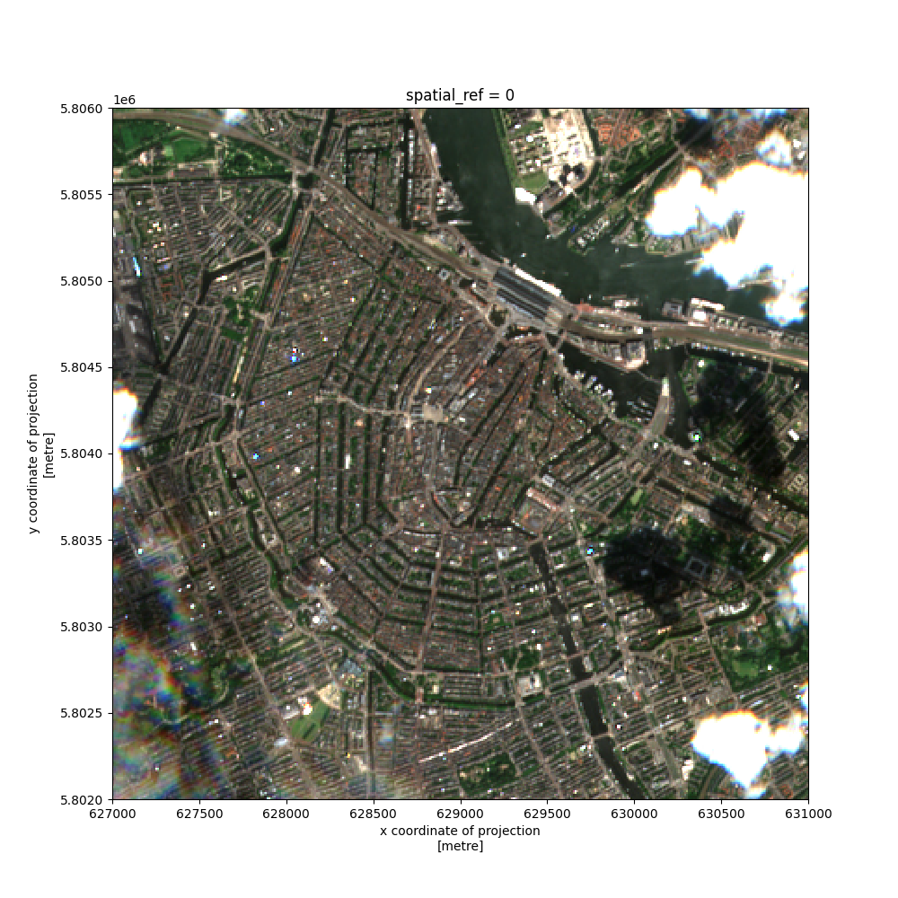

# Uydu Fotoğrafları Erişimi

Sık güncellenen uydu fotoğraflarına erişmek için `pystac_client`,`rioxarray`;
`pip` ile kurulur. Örnek enlem, boylam için,


```python
from pystac_client import Client
import matplotlib.pyplot as plt
import pandas as pd, numpy as np
import rioxarray

api_url = "https://earth-search.aws.element84.com/v0"
client = Client.open(api_url)

collection = "sentinel-s2-l2a-cogs"

lat, lon = 52.37, 4.90
geometry = {"type": "Point", "coordinates": (lon, lat)}

mysearch = client.search(
    collections=[collection],
    intersects=geometry,
    max_items=10,
)

for item in mysearch.items():
   print (item)
   print(item.assets["thumbnail"].href)
   visual_href = item.assets["visual"].href
   break # ilk sonucu kullan
```

```text
<Item id=S2A_31UFU_20220629_0_L2A>
https://roda.sentinel-hub.com/sentinel-s2-l1c/tiles/31/U/FU/2022/6/29/0/preview.jpg
```

Sonuçta bir `preview.jpg` görülüyor. Bu ufak bir dosya, erişilip
bakılabilir, kabaca görüntünün nasıl olduğunu anlamak için iyi
olabilir. Öteki bilgiler,

```python
print(item.datetime)
print(item.geometry)
print(item.properties)
```

```text
2022-06-29 10:56:35+00:00
{'type': 'Polygon', 'coordinates': [[[6.071664488869862, 52.22257539160586], [4.464995307918359, 52.25346561204129], [4.498475093400055, 53.24019917467795], [6.1417542968794585, 53.20819279121764], [6.071664488869862, 52.22257539160586]]]}
{'datetime': '2022-06-29T10:56:35Z', 'platform': 'sentinel-2a', 'constellation': 'sentinel-2', 'instruments': ['msi'], 'gsd': 10, 'view:off_nadir': 0, 'proj:epsg': 32631, 'sentinel:utm_zone': 31, 'sentinel:latitude_band': 'U', 'sentinel:grid_square': 'FU', 'sentinel:sequence': '0', 'sentinel:product_id': 'S2A_MSIL2A_20220629T104631_N0400_R051_T31UFU_20220629T170417', 'sentinel:data_coverage': 100, 'eo:cloud_cover': 22.69, 'sentinel:valid_cloud_cover': True, 'sentinel:processing_baseline': '04.00', 'sentinel:boa_offset_applied': True, 'created': '2022-06-29T19:43:11.806Z', 'updated': '2022-06-29T19:43:11.806Z'}
```

Zaman damgasına bakıyoruz 29/6 diyor, kodu 30/6'da işlettik, fena
değil. Birkaç günlük gecikme ile yeryüzünde pek çok noktanın
görüntüsüne erişmek mümkün demek ki.

Esas detaylı görüntü dosyası altta,

```python
print (visual_href)
```

```text
https://sentinel-cogs.s3.us-west-2.amazonaws.com/sentinel-s2-l2a-cogs/31/U/FU/2022/6/S2A_31UFU_20220629_0_L2A/TCI.tif
```

Fakat bu dosya 100 MB'tan fazla olabilir, bu sebeple çoğunlukla
yapılan dosyanın parçalarını indirmek, `rioxarray` bu işlemi
gerçekleştirebilir, x,y için minimum, maksimum noktalar verip bir ufak kutu
yaratabiliyoruz, ve sadece bu ufak kutudaki detaylı imaj parçası geri
döndürülüyor.


```python
visual = rioxarray.open_rasterio(visual_href)
print(visual)
visual_clip = visual.rio.clip_box(
    minx=627000,
    maxx=631000,
    miny=5802000,
    maxy=5806000
)
visual_clip.plot.imshow(figsize=(10,10))
plt.savefig('uydu_01.png')
```

```text
<xarray.DataArray (band: 3, y: 10980, x: 10980)>
[361681200 values with dtype=uint8]
Coordinates:
  * band         (band) int64 1 2 3
  * y            (y) float64 5.9e+06 5.9e+06 5.9e+06 ... 5.79e+06 5.79e+06
  * x            (x) float64 6e+05 6e+05 6e+05 ... 7.098e+05 7.098e+05 7.098e+05
    spatial_ref  int64 0
Attributes:
    _FillValue:    0.0
    scale_factor:  1.0
    add_offset:    0.0
    grid_mapping:  spatial_ref
```



Detaylar net gözüküyor.. 

Kaynaklar

[1] [The Carpentries Incubator](https://carpentries-incubator.github.io/geospatial-python/19-access-data/index.html)

