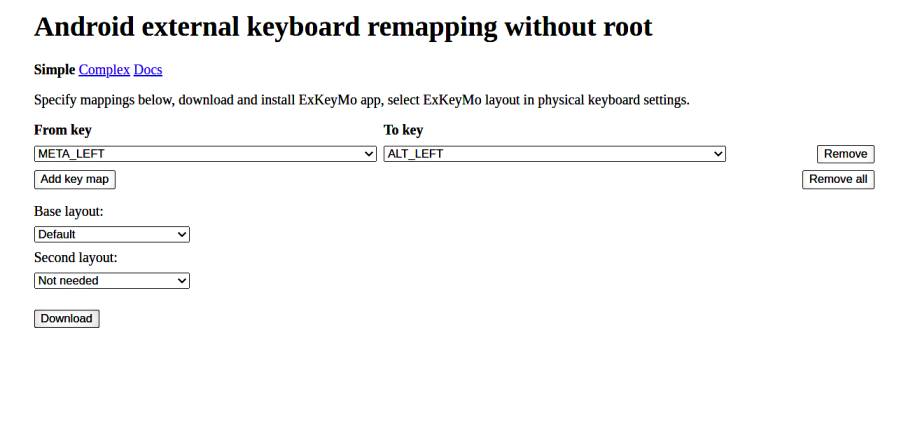

# Android, Raspberry Pi Geliştirme Ortamı

Rahat taşınabilir geliştirme ortamı için Bluetooth klavye, Android
Tablet, SSH, RPi üzerinde Ubuntu olabilir. Çoğu işi editörde metin
girerek kodlama yapıyorsak (görsel çıktılar RPi mikro web servisi
üzerinden, ya da X server ile alınabilir) bu işler. Powerbank RPi
çalıştırır. Tablet ile Android üzerinde yazıyoruz, Android hotspot
üzerinden Raspberry'ye DHCP IP adresi verdiriyoruz (192.168.43.x gibi
bir adres bunu `ifconfig -a` ile RPi uzerinden ögrenebiliriz, RPi
üzerinde WiFi aktif hale getirmek lazım). Ardından tablet üzerinden
Termux [7] `ssh` ile RPi'a bağlanırız. Tüm girdi metin bazlı
yapılır. Kuruluş böyle.

[Resim](tablrpi1.jpg)

Assistant

Bizim tablet Lenovo M8, Eğer editör kullanacaksak, üstte görülen
tablet üzerinden, Windows tuşunu iptal etmek iyi fikir [2].

Adım 1: `Device Settings` açılır, sonra `Apps/Application Manager`.

Adım 2: `Default apps` tıklanır, sonra `Assist & voice input`.

Adım 3: `Assist app` seçeneği seçilir. Sonraki ekranda `Assist app`
için `Google` gösteren bir app listesi görüyoruz. Biz `home` düğmesi
için `None` seçiyoruz, böylece Assistant artık çıkmıyor.

Tuş Değişimi

Control tuşu Trust Bluetooth klavyelerinde rahat erişilen yerde değil,
Vim, Emacs kullanıcıları bu tuşu çok kullanır, CAPS tuşunu CTRL
yapabiliriz, ek olarak benim tercihim SPACE yanındaki Command yazan
tuşu Left Alt yapmak. Bunun için Android seviyesinde değişiklik
lazım. Şu [1] uygulama ile web üzerinde isteğe göre üretilen bir .apk
bu değişimi yapabiliyor. APK üretimi arka planda derleme ile
üretiliyor muhakkak, bu .apk indirilip kurulunca (Android uyarılarını
dikkate almayız) tuş değişimi olur.

Web sitede tanımları liste bazlı seçebiliriz, bahsettiğim Command (ki
sisteme Meta Left olarak gözüküyor) Alt Left bağlantısı yapmak alttaki
şekilde.



Bu tanım daha sonra yaratılacak .apk içine koyulacak, Download tuşuna
tıklayınca apk alınır. Uygulamaya güvenmeyenler aynı sayfadaki
bağlantıdan kaynak koduna gidip Android kodunu derleyebilir.

Apk kurulduktan sonra tabii klavye seçiminin yeni programı görmesi
lazım; Android'de System | Languages & İnput | Physical keyboard (mesela bir
bluetooth klavye) seçtikten sonra Physical Keyboard altında bir layout seçimi
var, buraya girip listeden "ExKeyMo Layout" seçmek lazım.

SSH

Termux `ssh` ile RPİ'a bağlandık, fakat ikidebir bağlantı
kopuyor.. Tamir için Termux üzerinde `nano .ssh/config` dosyasına
gidilir,

```
Host *
    ServerAliveInterval 240
```

yazılır, artık `ssh` komut satırında 4 dakika hiçbir işlem olmasa bile
bağlantı koparılmayacaktır.

Not: Alternatif Android SSH programı Juice SSH.

Yerel Ağ Baglantısı

Test ettik, Tablet -> RPi arasındaki bağlantı eğer dış İnternet
bağlantısı olmasa bile işliyor. DHCP sonuçta yerel ağlarda işleyen bir
teknolojidir, dış İnternet olmasa da Android Wifi hotspot bir IP
adresi (çoğunlukla hep aynı) üretip Raspberry Pi'a
verecektir. Alternatif arayanlar mesela direk kablo ile USB-USB ile
bağlantı kurmak isteyenler [3,4,5] yazılarına bakabilir. [3] yazısı
için her iki ucun mikro USB olması lazım, genelde kablolar USB->mikro
USB, bir ucu mikro USB yapan adaptörler var. [5] için iki ucun
Ethernet olması lazım, RPi üzerinde zaten Ethernet var, bu durumda
tablet için Ethernet->mikro USB adaptörü gerekir. Mikro USB-Mikro USB
bağlantısının bir avantajı tableti artık RPi için güç kaynağı olarak
kullanabilmektir.

Bu Sistemle Neler Yapılabilir?

Servis tarafindaki RPi tam tekmilli bir Linux (Ubuntu) oldugu icin
servis tarafinda yapılamayacak sey yok. `sudo apt install` ile her
türlü program kurulabilir. Mesela flask kurulup herhangi bir html
sayfasını servis edebiliriz, bu sayfalari tablet tarayıcısı ile tablet
üzerinde görebiliriz. Bende markdown -> HTML üretebilen ufak bir
python script var,

```python
import markdown, sys, os
head = '''
<html>
<head>
<script type="text/x-mathjax-config">MathJax.Hub.Config({  tex2jax: {inlineMath: [["$","$"]  ]}});</script>
<script type="text/javascript" src="https://cdnjs.cloudflare.com/ajax/libs/mathjax/2.7.5/MathJax.js?config=TeX-AMS_HTML-full">
</script>
<meta charset='utf-8'>
</head>
<body>
'''
content=open(sys.argv[1]).read()
print (head)
print (markdown.markdown(content, extensions=['fenced_code','tables']))
print ("""
</body>
</html>
""")
```

Tablet->SSH->Emacs ile RPİ'da (içinde matematik sembolleri bile olan)
içerik yazıp, üstteki script ile HTML üretiliyor, onu Flask ile
gösteriyoruz. Diyelim Flask `/home/user1/app4` altında başlatılmışsa,
Flask o dizindeki `static` dizinini olduğu gibi servis etmek için
hazırdır, o dizin altına Unix sembolik link koyarak istediğimiz
dizindeki içeriği servis edebiliriz.

VNC

RPI masaüstünü tablet üzerinde görmek istiyenler varsa, direk kablo
ile hızlı bir bağlantı kuruldu belki (Wifi üzerinden yavaş olur), o
zaman RPi üzerinde VNC aktif edilebilir [6], ve Android üzerinde VNC
ile bağlantı yapılır.

X11

Android üzerinde işleyen, sağlam bir X istemcisi bulunabilirse, RPi
servis tarafı zaten X11 servisi yapmak için hazırdır, bu durumda tüm
masaüstü yerine tek bir grafik program görsel olarak Android üzerinde
işletilebilir. Bir ihtimal Termux üzerinden bu yapılabilirdi, ne yazık
ki o proje şu anda sakat durumda. Ama işleyen uygulama bulabilenler
için teorik olarak bu bir seçenektir. 90'li yıllarda Solaris Unix
makinasına X ile bağlanıp Emacs ile C++ programı geliştiriyordum; X
hızlı işler.

Kaynaklar

[1] [exkeymo](https://exkeymo.herokuapp.com/)

[2] [Windows Button / Assist Disable](https://www.guidingtech.com/remove-google-assistant-home-button/)

[3] [Reddit](https://www.reddit.com/r/raspberry_pi/comments/3bpw4g/connecting_to_the_raspberry_pi_from_your_android/)

[4] [Circuit Basics](https://www.circuitbasics.com/how-to-connect-to-a-raspberry-pi-directly-with-an-ethernet-cable/)

[5] [elinux](https://elinux.org/How_to_use_an_Android_tablet_as_a_Raspberry_Pi_console_terminal_and_internet_router)

[6] [Raspberry Pi](../../2020/07/raspberrypi.html)

[7] [Android Uzerinde Linux - Termux](../../2018/09/android-uzerinde-linux-termux.html)
