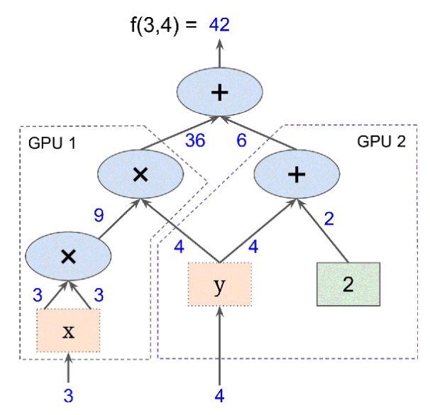

# Tensorflow

Google'ın yazdığı ve açık yazılım haline getirdiği paket TF çoğunlukla
yapay öğrenim bağlamında gündeme geliyor, fakat TF aslında genel
kullanımı olan bir yazılım. TF bir sayısal hesap kütüphanesi, daha
spesifik olarak, ona çizit olarak verilen hesapları yapabilen bir
sayısal hesap paketi.

TF ile hesap yapmak için hesabı temsil eden bir çizit kurulur, mesela
f(x,y) = x^2 y + y + 2 için


Bu hesap ağacında görülen sayılar tek sayı olabilir, çok boyutlu
vektör, matris, ya da çok boyutlu matris olabilir. Matematikte bu
objelere genel olarak "tensor" ismi veriliyor, paketin ismi de buradan
geliyor, tensorlar hesap çiziti içinde bir hesaptan diğerine
"akıyorlar" (flow). Hesabı çizit olarak belirtmenin bazı avantajları
var, en önemlisi çizit üzerinde direk otomatik türev alınabilir, bkz
[4] yazısı, ve bu şekilde gradyan hesapları kolay bir şekilde
yapılabiliyor. Bir diğeri çizitin paralelleştirme için doğal bir yapı
olması; çiziti istediğimiz şekilde bölerek parçaları farklı
mikroişlemci (CPU), ya da grafik işlemci (GPU) üzerinde paralel bir
şekilde işletebiliriz, mesela üstteki f için f(3,4) hesabı,



şeklinde iki parçaya bölünebilir. 3 girilen soldaki parça kendi başına
hesabını yaparken aynı anda 4 girilen diğer parça işlemine devam
edebilir. Ayrıca Google TPU adı verilen tensor işlemci üniteleri üzerinden
artık CPU, GPU yerine direk TF için optimize edilmiş yeni işlemciler
üzerinden paralelizasyon yapılabiliyor.

### Tensorflow 1

TF kodlaması nasıl olur? Üstteki örnek için

```python
import tensorflow as tf
print (tf.__version__)

x = tf.Variable(3., name="x")
y = tf.Variable(4., name="y")
f = x * x * y + y + 2
```

İçinde x,y,f düğümleri (node) olan bir çizit yaratıldı. Bu kadar!
Fakat anlamamız gereken önemli bir nokta var, üstteki kodu işletince
halen bir hesap yapmış olmuyoruz, sadece üzerinden hesabın
yapılabileceği çizit yapısını yaratmış oluyoruz. Hesabın kendisi için
bir TF oturumu (session) açmak lazım, bu oturum üzerinden değişkenler
başlangıç değerlerlerine eşitlenir, ve sonra f hesabı
tetiklenir. Esas hesap bu şekilde ortaya çıkar.

```python
result_f = f.numpy() 
print(f"Result of f: {result_f}")
```

```
42
```

\verb!with! kullanımı ile blok dışına çıkılınca kapatma işlemi otomatik
olarak yapılıyor. Nihai hesap için \verb!eval! çağrısı yapıldığını gördük,
bu çağrı aslında herhangi bir düğümün hesaplanmasını tetikleyebilir. Bu
tetikleme sonrasında TF bir düğümün hangi diğer düğümlere bağlı olduğuna
bakarak çizitte önce o düğümlerin hesabını yapacaktır, ve o çıktıları
çizite göre birleştirerek nihai sonucu bulacaktır. Mesela

```python
w = tf.constant(3)
x_const = w + 2
y_const = x_const + 5
z_const = x_const * 3

print(f"y_const = {y_const.numpy()}")
print(f"z_const = {z_const.numpy()}")
```

```
y = 10
z = 15
```

TF otomatik olarak y'nin w'ye, onun da x'e bağlı olduğunu gördü, önce
w'yi işletti, sonra y'yi, ve onu da z hesabı için kullandı. Dikkat, TF
önbellekleme yapmaz, yani üstteki kod w,x hesabını iki kere
yapar. Hesap çağrısı sonrası değişken değerleri muhafaza edilir (çünkü
onlar çizitin parçası) fakat düğüm değerleri yokolur.

TF bir anlamda numpy kütüphanesinin çizitli, çok işlemcili versiyonu olarak
görülebilir. Bir numpy matrisi üzerinde yapılan pek çok işlem TF ile de
yapılabilir. Mesela bir matrisin tümü, herhangi bir ekseni bazındaki toplam
alttaki gibi alınabiliyor,

```python
x_sum = tf.constant([[1., 1., 1.], [1., 1., 1.]])
c1_total = tf.reduce_sum(x_sum)
print(f"Total sum (c1_total): {c1_total.numpy()}")
c1_axis0 = tf.reduce_sum(x_sum, 0) 
print(f"Toplam, eksen 0 (c1_axis0): {c1_axis0.numpy()}")
c2_axis1 = tf.reduce_sum(x_sum, 1) 
print(f"Toplam eksen 1 (c2_axis1): {c2_axis1.numpy()}")
```

```
6.0
[ 2.  2.  2.]
[ 3.  3.]
```

Boyutları tekrar düzenlemek için `reshape` var, alışık olunan numpy
versiyonu gibi işliyor. `-1` değerinin özel bir önemi var, sadece bir
tane `-1` kullanılabilir, ve bu durumda o boyutta "ne olduğu önemli
değil" mesajı verilmiş olur.

```python
x1_reshape = tf.constant([1, 2, 3, 4, 5, 6, 7, 8, 9])
x2_reshape = tf.constant([[[1, 1, 1], [2, 2, 2]],
                          [[3, 3, 3], [4, 4, 4]],
                          [[5, 5, 5], [6, 6, 6]]])

res1 = tf.reshape(x1_reshape, [3, 3])
print(f"Reshaped x1 to [3, 3]:\n{res1.numpy()}")

res2 = tf.reshape(x2_reshape, [2, -1])
print(f"Reshaped x2 to [2, -1]:\n{res2.numpy()}")
```

```
[[1 2 3]
 [4 5 6]
 [7 8 9]]
[[1 1 1 2 2 2 3 3 3]
 [4 4 4 5 5 5 6 6 6]]
```

Dışarıdan Okunan Veriyi Çizite Vermek

Bunu yapmanın en basit yolu yer tutucu düğüm (placeholder node)
kullanmak. Bu düğümler özel düğümler, hiç bir iş yapmıyorlar, içlerinde
veri yok, sadece onlara dışarıdan verdiğimiz veriyi çizit içine taşıyorlar,
yani çizitin akışına dahil ediyorlar. Eğer işleyiş anında onlara dışarıdan
veri verilmezse TF bir hata mesajı verecektir.

Yer tutucuları tanımlarken onların önceden tipini tanımlayabiliriz,
şart degil ama bir büyüklük te tanımlanabilir, `None` ile burayı boş
bırakmak ta mümkün. Şimdi yer tutucu `A` tanımlayalım, `B` ona bağlı
olsun, sonra `B` değerini hesaplamak için `eval` çağrırken yer
tutucunun içini o anda dolduralım, ve sonuca bakalım,

```python
A_input = tf.constant([[1., 2., 3.]], dtype=tf.float32)
B_output = A_input + 5
print(f"Result of A_input + 5: {B_output.numpy()}")
```

```
[[ 6.  7.  8.]]
```

```python
# If you need a function that takes input, you'd use tf.function
@tf.function
def add_five(input_tensor):
    return input_tensor + 5

A_dynamic_input = tf.constant([[10., 20., 30.]], dtype=tf.float32)
B_dynamic_output = add_five(A_dynamic_input)
print(f"Result of add_five function with new input: {B_dynamic_output.numpy()}")
```

Basit bir çarpma örneği,

```python
a = tf.constant([1, 2, 3, 4], dtype=tf.float32)  # Changed to 4 elements
a = tf.reshape(a, [2, 2])
b = tf.constant([7, 8, 9, 10], dtype=tf.float32) # Changed to 4 elements
b = tf.reshape(b, [2, 2])
c = tf.matmul(a, b)

print("a:\n", a.numpy())
print("b:\n", b.numpy())
print("c (a @ b):\n", c.numpy())
```

```
<tf.Tensor: shape=(2, 2), dtype=int32, numpy=
array([[ 58,  64],
       [139, 154]], dtype=int32)>
```

Hız Kontrolü

Tensorflow basit matris çarpımlarını ne kadar hızlandırıyor? Kontrol edelim,

```python
import numpy as np
N = 3000
A = np.random.randn(N,N)
B = np.random.randn(N,N)

from timeit import default_timer as timer
from datetime import timedelta

start = timer()
C = np.dot(A,B)
end = timer()
print('elapsed time', timedelta(seconds=end-start))
```

```
elapsed time 0:00:01.292723
```

Şimdi TF ile çarpım,

```python
TA = tf.random.normal([N,N], 0, 1, tf.float32)
TB = tf.random.normal([N,N], 0, 1, tf.float32)

start = timer()
TC = tf.matmul(TA, TB)
print("b:\n", TC.numpy())
end = timer()
print('random matmul elapsed time', timedelta(seconds=end-start))
```

```
elapsed time 0:00:00.043483
```

Kod Google Collab üzerinde işletildi, ve bu örnek için çarpım 30 kat
daha hızlı yapıldı. Yanlız GPU'ya veri kopyalama durumuna dikkat, eğer
Numpy matrisleri A, B'yi alıp Tensorflow'a `constant` ile verseydim,
TF çarpmımı ilk seferinde daha hızlı olmazdı (2'inci, 3'üncü hızlı,
herhalde önbellekleme var) çünkü kopyalarken zaman kaybetmiş
olurdum. Fonksiyon `tf.random.normal` ile matrisi GPU üzerinde
yaratılmasını zorlamış olduğumuz için, GPU çarpım işlem farkı hemen
gözüküyor.

### Kurulum

Tensorflow kullanımı ve gelişimi GPU [1] gelişimi ile kol kola
gitmiştir, zannederim bu sebeple CPU üzerinde kurulum gözardı edilmeye
başlandı. Bazı versiyonlar ve işletim sistemlerinde CPU kullanımı
yapılamıyor. Bu sebeple Google Collab [2] denenebilir, İnternet
sayfası üzerinden kodlama yani, ya da spesifik bir GPU donanımı
alınabilir, mesela NVidia Jetson [3]. Jetson üzerinde kurulum o yazıda
var.

Kaynaklar

[1] [GPU](../../2020/12/gpu-cuda-pycuda.html)

[2] [Google Collab](../../2018/11/gpu-tpu-saglayan-not-defter-ortami.html).

[3] [Jetson Nano](../../2020/12/nvidia-jetson-nano-2GB-wifi.html)
