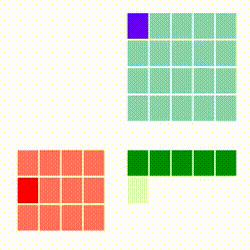
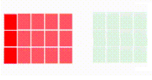

# Paralel Lineer Cebir

Lineer cebirdeki pek çok işlemi paralel şekilde işletmek mümkün. Altta
bazı örnekler üzerinde göreceğiz. Paralelleştirme yolunda kullanılacak
ana yaklaşım [4]'teki olacak - veri, burada matris verisi, satır satır
işlenecek (her işlem tek bir satırı hafızaya getirecek) ve tüm
satırlar parçalar halinde farklı çekirdeklerde (ya da makinalarda)
paylaştırılacak.

### Matris Çarpımı

Standart matris çarpımını azar azar (incremental) şekilde paralelize
etmek zordur. Bize bir matrisi satır satır işlememizi sağlayacak bir
yaklaşım gerekiyor. [3]'e danışırsak oradaki "satır kombinasyon bakış
açısı" bize uygun gözüküyor, çünkü bu yöntemle A çarpı B deki A'yı
azar azar işlemek mümkündür, her A satırı için bir sonuç satırı
üretilebilecektir. Çarpım yöntemleri [1]'de yazıda da ve animasyonları
ile işlenmiş, bizim istediğimiz alttakidir. Kırmızı matris A, mavi
olan B, sonuç C ise yeşil matris içindedir.



Gittikçe kararan yeşil hücreleri oraya yapılan toplam sebebiyle.

A'yı satır satır aldık bu tamam. Fakat B'ye olacak? Ne yazık ki her A
satırı için B'nin tamamı baştan sona gezilmeli. Bundan kaçış yok,
zaten matris çarpımı O(N^3) çetrefilliğindeki bir operasyondur,
standart kodlama üç tane iç içe döngü içerir, bunun sonucu olarak her
satırda B'nin başa sarılması gerekecektir.

Şimdi B için de satır gezme yaklaşımı düşünmeden önce, problemde bir
basitleştirme yapalım; A, B matrisleri sırasıyla M x D ve D x N
boyutlarında diyelim, ve farzedelim ki "çok olan" büyüklük M, D
nispeten büyük ama fazla değil, N ise potansiyel olarak D'den küçük.

Bu tür verileri mesela Büyük Veri problemlerine sürekli görüyoruz, M
sayısı milyarlarca (satır) olabilir, veri noktaları bunlardır, verinin
değişken boyutu ise D, yaş, boy, kilo gibi mesela özellikler
(features) bu değişkenlerde, çok sayıda olabilirler ama milyarlarca
değil, N ise daha ufak bir boyut. Örnek uygulama rasgele matris
çarpımı ile boyut küçültme olabilir, milyarlarca satır binlerce kolon
olabilecek A'yı bir D x N boyutundaki B ile çarpıyoruz, mesela eğer
N=100 ise çarpım sonucu A x N kolon boyutu azalmış hale geliyor.

Basitleştirme şurada; üstteki türden bir kullanım için B matrisinin
tamamını, her çekirdek için, hafızaya alabiliriz. Eğer B matrisi
milyarlarca satır / kolon içeriyor olsaydı bu olamazdı ama faraziyeye
göre B'nin binlerce satırı ve çok az kolonu olacak. 

B hafızaya alınabilirse artık bazı `numpy` özelliklerinden
faydalanabiliriz. Mesela, animasyonda da görüyoruz, bir A satırının
her hücresi gezilirken oradaki değer alınıp bir B satırı ile
çarpılıyordu. Bu çarpımı işlenen tüm A satırı ve tüm B matrisi için
bir kerede yapabiliriz. Alttaki kod örneğine bakalım,

```python
a = np.array([[1,2,3]]).T
B = np.array([[3,4,5],[1,1,1],[2,2,2]])
print (a); print (B)
print (a*B)
print ((a*B).sum(axis=0))
```

```text
[[1]
 [2]
 [3]]
[[3 4 5]
 [1 1 1]
 [2 2 2]]
[[3 4 5]
 [2 2 2]
 [6 6 6]]
[11 12 13]
```

Dikkat `*` kullanıldı, `numpy.dot` değil. Çarpım sonucu elde edilen
matrisin tüm satırlarının toplamı yine `numpy` üzerinden, basit bir
`sum(axis=0)` ile hesaplanabilir.

Tabii eklemek gerekir ki üstte tarif edilenler aslında `numpy.dot` işleminin
ta kendisidir,

```python
print (np.dot(a.T,B))
```

```text
[[11 12 13]]
```

Olan işlemleri teker teker göstermek için detaylı bir anlatıma girdik, ama
B'nin hafızada olduğu durum için klasik matris çarpımı da işleyecektir.

Şimdi örnek veriyi üretelim. Bunlar rasgele matrisler olacak. 

```python
M = 1*1000*1000; D = 100; N = 30
A = np.random.rand(M,D)*10
np.savetxt('/tmp/A.csv', A, delimiter=';',fmt='%1.6f')
B = np.random.rand(D,N)*10
np.savetxt('/tmp/B.csv', B, delimiter=';',fmt='%1.6f')
```

Pür `numpy` ile A çarpı B işlemini yapalım, bu işlem hafızada olacaktır.

```python
from datetime import timedelta
from timeit import default_timer as timer

start = timer()
A = np.loadtxt("/tmp/A.csv",delimiter=';')
B = np.loadtxt("/tmp/B.csv",delimiter=';')
C = np.dot(A,B)
np.savetxt('/tmp/C2.csv', C, delimiter=';',fmt='%1.6f')
end = timer()
print('elapsed time', timedelta(seconds=end-start))
```

```
elapsed time 0:01:24.053847
```

Bir milyon satır ve 100 kolonun 100 satır ve 30 kolon içeren B ile
çarpılması 1 dakika 24 saniye aldı.

Aynı işlemi paralel, ve satır satır yaklaşımı ile yapalım, alttaki kod
[4]'teki altyapıyı kullanmıştır,

```python
class MultJob:
    def __init__(self,ci,bfile):
        self.afile = ""
        self.B = np.loadtxt(bfile,delimiter=';')
        self.ci = ci
        cname = "%s/C-%d.csv" % (os.path.dirname(afile), self.ci)
        self.outfile = open(cname, "w")        
    def exec(self,line):        
        vec = np.array([np.float(x) for x in line.strip().split(";")])
        vec = np.reshape(vec, (len(vec),1))
        res = (vec * self.B).sum(axis=0).tolist()  
        res = ";".join(map(str, res))
        self.outfile.write(res)
        self.outfile.write("\n")
        self.outfile.flush()
    def post(self):
        self.outfile.close()
                
dir = '/tmp'
afile = dir + "/" + "A.csv"
bfile = dir + "/" + "B.csv"

start = timer()
   
N = 4 # kac paralel islem var
ps = [Process(target=process,args=(afile, N, MultJob(i,bfile))) for i in range(N)]
for p in ps: p.start()
for p in ps: p.join()
end = timer()
print('elapsed time', timedelta(seconds=end-start))    
```

```
elapsed time 0:00:55.157166
```

```python
cat /tmp/C-*.csv > /tmp/C3.csv
```

Bizim yaklaşım daha hızlı işledi. Acaba sonuçlar birbirine yakın mı?

```python
dir = "/tmp"
C2 = np.loadtxt(dir + "/C2.csv",delimiter=';')
print (C2.shape)
C3 = np.loadtxt(dir + "/C3.csv",delimiter=';')
print (C3.shape)

mdiff = C2.mean()-C3.mean()
sdiff = C2.sum()-C3.sum()
print (mdiff, sdiff)
```

```
(1000000, 30)
(1000000, 30)
6.320988177321851e-11 0.00189208984375
```

Oldukça yakın. Farklılıklar ufak yuvarlama farklılıkları, ya da
verinin her iki yöntem için de okunup yazılırkenki kaybedilebilecek
noktadan sonraki bazı değerleri sebebiyle olabilir.

Pür bellek durumunda çarpım `numpy` ile yapılırken çekirdekleri
gözledik, tüm çekirdekler kullanılıyordu, kullanıcı yorumlarına
bakılırsa bazı Python ve `numpy` versiyonlarında paralellik
vardır. Demek ki bizim eşzamanlı kodlama `numpy` eşzamanlı kodlamasını
geçti.

Fakat bir diğer önemli ilerleme şuradadır; Eğer A satır sayısını bir
milyondan iki milyona çıkartacak olsak pür hafıza kullanan yaklaşım
kullanılmaz hale gelir çünkü artık A matrisi tamamen bellege sığmaz.
Kıyasla azar azar alıp işleyen üstteki yaklaşım banamısın demez, çünkü
A büyüklüğü ne olursa olsun her seferinde onun sadece tek satırını
işliyoruz, eh zaten B'yi belleğe sığar kabul ettik, o zaman veri ne
kadar büyürse büyüsün bizim işlem yapmamız mümkündür. İşte Büyük Veri
bu tür yaklaşımlar sayesinde başedilebilir hale gelmiştir.

### Rasgele Matris Çarpımı

Bir matrisin boyutlarını azaltmak için bir teknik onu sıfır merkezli
ve 1 varyanslı Gaussian dağılımından gelen rasgele sayılarla dolu bir
matris ile çarpmaktır. A matrisi m x n ise bir rasgele matris Omega
yaratabiliriz, n x k boyutunda, ve Y = A Omega sonucundaki m x k
matrisinin satırlararası mesafeleri muhafaza edilmiş olur. Ornegi
[6]'da goruluyor.

Paralel işlem bağlamında, ve üstteki çarpım tekniğinden devam etmek
gerekirse, bir kolaylaştırma amaçlı olarak B hafızaya alınabilir
demiştik. Şimdi işleri biraz zorlaştıralım, rasgele izdüşümü yapacağız
ama diyelim n o kadar büyük ki bir n x k matrisi bile *hafızada tutulamıyor*.

Burada rasgele matris çarpımlarının avantajlı bir tarafı bize yardım
eder, rasgele matris üretici kodları hep yarı-rasgele sayı üretici
(pseudonumber) kullanırlar, bu üreticilerin bir algoritmasi var, bu
algoritma basit toplama, mod, gibi işlemler kullanır bu sebeple sabit
zamanda O(1) hızında çalışır. O zaman doğru yaklaşımla rasgele matrisi
satır satır anında yaratabiliriz.

Tabii dikkat etmek lazım, rasgele B matrisi dedik ama bu matris tabii
ki her A satırı için *aynı* rasgele matris olmalı. O zaman her A
satırı ile işimiz bittiğinde rasgele sayı üreticini,
`np.random.seed()` ile tohumunu biz dışardan tanımlarsak, o zaman aynı
rasgele sayıların B için satır satır tekrar baştan yaratılmasını
sağlayabiliriz. Böylece

- Tüm B matrisini hafızada tutmaya gerek yok

- Her seferinde aynı rasgele B satırını aynı şekilde elde etmemiz
  mümkün çünkü B üretmeden önce tohumu başa döndürüyoruz.

Ufak örnek bir kod üzerinde görelim, ufak bir A kullandık fakat onun
üzerinde satır satır gezerek, büyük ölçekte olanları gösterebiliriz.

```python
A = np.array(range(0,20)).reshape(5,4)
k = 3
res = []
for i in range(A.shape[0]):
    s = np.zeros(k)
    row = (A[i, :])
    np.random.seed(0)
    for elem in row: s += elem*np.random.normal(0,1,k) # B satirlari
    res.append(s)
Y = np.array(res)
print (Y)
```

```text
[[ 5.37286554  1.99697429  3.17910494]
 [26.8353954  11.03858053  8.58916398]
 [48.29792526 20.08018678 13.99922301]
 [69.76045512 29.12179302 19.40928205]
 [91.22298497 38.16339927 24.81934109]]
```

İzdüşümü yapılmış yeni matris budur. Paralel kodu yazalım,

```python
import os, numpy as np, util

class RandomProjJob:
    def __init__(self,ci):
        self.ci = ci
        self.k = 7
        self.outfile = open("/tmp/Y-%d.csv" % self.ci, "w")        
    def exec(self,line):
        s = np.zeros(self.k)
        toks = line.strip().split(';')
        row = np.array([np.float(x) for x in toks[1:]])
        np.random.seed(0) 
        for elem in row: s += elem*np.random.normal(0,1,self.k) 
        s = ";".join(map(str, s))
        self.outfile.write(s)
        self.outfile.write("\n")
        self.outfile.flush()
        
    def post(self):
        self.outfile.close()

infile = '../../../linear/linear_app10rndsvd/w1.dat'
util.process(file_name=infile, N=2, hookobj = RandomProjJob(0))
util.process(file_name=infile, N=2, hookobj = RandomProjJob(1))
```

```python
! cat /tmp/Y-* > /tmp/Y.csv
```

```python
Y = np.loadtxt("/tmp/Y.csv",delimiter=';')
print (Y.shape)
```

```text
(71, 7)
```

Orijinal veriye bakarsak,

```python
import pandas as pd
df = pd.read_csv(infile,sep=';',header=None)
A = np.array(df)[:,1:]
print (A.shape)
```

```text
(71, 30)
```

Üstteki kodun tüm B'yi hafızada tutmasına gerek yok, bir döngü içinde
her seferinde sadece k boyutlu bir vektörü hafızada yaratıyor.

Satırlararası mesafeler,

```python
from scipy.spatial.distance import cdist

d1 = cdist(A,A,metric='euclid')
d1 = d1 / np.sum(d1)
d2 = cdist(Y,Y,metric='euclid')
d2 = d2 / np.sum(d2)
print (np.mean(d1),d1.shape)
print (np.mean(d2),d2.shape)
print (np.mean(np.abs(d1-d2)))
```

```text
0.00019837333862328903 (71, 71)
0.00019837333862328903 (71, 71)
4.013403527124087e-06
```

Mesafeler muhafaza edilmişe benziyor.

### A Devriği Çarpı A

A'A çarpımı lineer cebir, istatistikte faydalı olabilecek bir işlem;
özellikle "uzun boylu, zayıf" A matrisleri için, yani çok sayıda
satırı ama az sayıda kolonu olan matrislerde bu çarpım ufak bir
matrisi hesaplar. Mesela A boyutları M x D ise, D x M ve M x D matris
çarpımı bize D x D boyutunda bir kare matris verecektir, D ufak ise D
x D sonucu da ufaktır.

Paralel işletmek için üstteki çarpımı biraz değiştirmek
gerekli. Unutmayalım, paralel işlemde her zaman çok fazla satırı azar
azar işlemek istiyoruz, o zaman A matrisini işlemek lazım. Fakat A'yı
gezerken A devriğinin kolonlarını gezdiğimiz bilgisiyle gerekli
işlemleri yapmak lazım.

Önceki animasyona bakarsak soldaki matriste bir satırda soldan sağa
doğru gidiliyordu. Fakat yeni durumda A satırlarını gezerken, bir
bakıma A' kolonlarını geziyoruz. Ayrıca her kolona geldigimizde o
kolonun tüm öğelerine sahibiz.

Her kolonun bir ögesini tüm kolon ile çarpınca bize sonucun bir satırı
verilir. Bunu tüm öğeler için yaparsak tüm bir matris elde
ederiz. Tabii ki bu matris sonuçlarına ekler olmalıdır, bir sonraki A'
kolonundan gelen yeni bir matris ilk toplama eklenir. Böyle devam
eder, ta ki tüm A satırları (A' kolonları) bitene kadar.



Üstteki resimde ilk A' kolonu işlendikten sonraki sonucu görüyoruz.
İlk kolonun tamamını kullanıyoruz bu sebeple tüm kolon koyu kırmızı,
ve oradan gelen sonuçlar tam bir matris veriyor, bu sebeple sonuç açık
yeşil (tüm hücrelerde biraz toplam yapılmış). A' matrisinde bir
sonraki kolona geçilince oradan yeni bir matris elde edilecek, sağdaki
yeşil matris biraz daha koyu yeşil hale gelecek.

Bu işlemi paralelleştirmek mümkün, çünkü toplam sırabağımsız bir
işlem, elde N tane parça var ise her birinden bir alt toplam D x D
matrisi olarak gelir, N tane toplam matrisi birbiriyle toplanır ve
nihai sonuç elde edilir.

Her A' kolonu için matris sonucu nasıl elde edilir? Bir defasında tüm
A' satırlarına sahibiz demiştik, orada her hücre tüm A' satırı ile
teker teker çarpılır, bu çarpımlar birbirine yapıştırılarak matris
elde edilir. Fakat sonuçta çarpılan ve çarpan hep aynı vektör içinde.
Bu bize bir lineer cebir demirbaş işlemini hatırlatabilir: dış çarpım
(outer product). Kütüphane `numpy.outer` ile her A' kolonu için
gereken matrisi tek bir çağrıda elde edebiliriz. Altta ufak bir örnek
üzerinde görüyoruz. Bu örnek gezme ve dış çarpım işlemlerini göstermek
için yazıldı, hala paralel, veriyi dosyadan teker teker okuma
özelliklerine sahip değil, fakat gereken işlemlerin sırasını görmek
için faydalı olabilir.

```python
A = [[1,2,3],
     [3,4,5],
     [4,5,6],
     [6,7,8]]
A = np.array(A)

s = np.zeros((3,3))
for i in range(4):
  s = s + np.outer(A[i,:],A[i,:])
print (s)    
```

```text
[[ 62.  76.  90.]
 [ 76.  94. 112.]
 [ 90. 112. 134.]]
```

Aynı işlemi direk yapalım,

```python
print (np.dot(A.transpose(),A))
```

```text
[[ 62  76  90]
 [ 76  94 112]
 [ 90 112 134]]
```

Aynı sonucu aldık.

Paralel versiyon üstteki kodun ruhunu takip edecek, her eşzamanlı
süreç yine (kendi parçası içinde) satırları gezecek, her satır kendisi
ile dış çarpıma tabi tutulacak, sonuç matrisleri her eşzamanlı süreç
içinde toplanacak. Paralel durumda ayrıca ek olarak tüm süreçler
işlemini bitirdikten sonra her sürecin toplam matrisi alınıp bir daha
birbiri ile toplanacak, ve nihai matrisi elde edilecek.

Kodlamaya gelirsek, veri yaratalım,

```python
import numpy as np

M = 3000; D = 20
A = np.random.rand(M,D)*10
np.savetxt('/tmp/A.csv', A, delimiter=';',fmt='%1.6f')

C = np.dot(A.transpose(),A)
np.savetxt('/tmp/Cf-1.csv', C, delimiter=';',fmt='%1.6f')
```

Paralel kodlar için yine [4]'teki gibi bir `process` kodu
kullanıyoruz, kod bu dizin içindeki `util.py` dosyasında da
bulunabilir,

```python
import os, numpy as np, util

class ATAJob:
    def __init__(self,D,ci):
        self.C = np.zeros((D,D))
        self.ci = ci
    def exec(self,line):
        tok = line.split(';')
        vec = np.array([float(x) for x in tok])
        self.C = self.C + np.outer(vec, vec)
    def post(self):
        outfile = "/tmp/C-%d.csv" % self.ci
        np.savetxt(outfile, self.C, delimiter=';',fmt='%1.6f')
        
util.process(file_name='/tmp/A.csv', ci=0, N=2, hookobj = ATAJob(20,ci=0))
util.process(file_name='/tmp/A.csv', ci=1, N=2, hookobj = ATAJob(20,ci=1))

C0 = np.loadtxt("/tmp/C-0.csv",delimiter=';')
C1 = np.loadtxt("/tmp/C-1.csv",delimiter=';')

C = C0 + C1

np.savetxt("/tmp/Cf-2.csv", C, delimiter=';',fmt='%1.6f')
```

Bu sefer ayrı süreçler yaratmadık, fonksiyonu iki kere çağırdık, fakat
artık paralellik için yapılacakları biliyoruz. Şimdi pür hafıza ve bizim
yöntemin sonuçlarını karşılaştıralım,

```python
import numpy as np
Cf1 = np.loadtxt("/tmp/Cf-1.csv",delimiter=';')
Cf2 = np.loadtxt("/tmp/Cf-2.csv",delimiter=';')
print ((Cf1-Cf2).mean())
print ((Cf1-Cf2).sum())
```

```text
-1.8024999735644087e-06
-0.0007209999894257635
```

İki matris birbirine çok yakın; demek ki satırsal paralel yöntem
işledi.

### Eşsiz Değerler Ayrıştırması (Singular Value Decomposition, SVD)

Üstteki parçalar kodlanmışsa onları kullanarak SVD hesaplamak
kolaydır.  Önce bir A matrisi alındığında A'A hesaplanır, ardından
[5]'teki matematiği kullanarak V vektörünü elde ederiz, ve onu A ile
çarparak U elde ederiz. A büyük bir matris, matris çarpımlarını başta
işledik.

Ya eğer A matrisi uzun ama zayıf değilse? Belki elimizde uzun ve
"şişman" bir matris var, yani aşırı sayıda kolon. Bu durumda,
uygulamanın gerekliliklerine göre hala bir kolon, boyut küçültme
(dimensionality reduction) yapılabilir, mesela uzaklık bağlamında bir
matrisi rasgele (random) ve daha ufak boyutlu bir başka matrisle
çarpmak sonucun mesafe ölçütlerini değiştirmez diye bir teori vardır,
o zaman yine baştaki matris çarpımı teknikleri ile rasgele matris ile
bir çarpım yaparız, ve ufaltılmış boyuttaki yeni sonuçla işleme devam
ederiz.


Kaynaklar

[1] https://www.adityaagrawal.net/blog/architecture/matrix_multiplication

[2] [GeeksforGeeks](https://www.geeksforgeeks.org/strassens-matrix-multiplication/)

[3] Bayramlı, [Lineer Cebir Ders 1](https://burakbayramli.github.io/dersblog/linear/linear_01/ders_1.html)

[4] Bayramlı, [Paralel, Satır Bazlı Dosya İşlemek](../../2016/02/toptan-islemler-paralelizasyon.html)

[5] Bayramlı, [Paralel Lineer Cebir Temeli](https://burakbayramli.github.io/dersblog/linear/linear_app30parlinalg/paralel_lineer_cebir_temeli.html)

[6] Bayramlı, [Rasgele İzdüşümü (Random Projection)](https://burakbayramli.github.io/dersblog/linear/linear_app10rndsvd/rasgele_izdusumu__random_projection__.html)

[7] Bayramlı, [SVD Factorization for Tall-and-Fat Matrices on Parallel Architectures](https://arxiv.org/abs/1310.4664)

