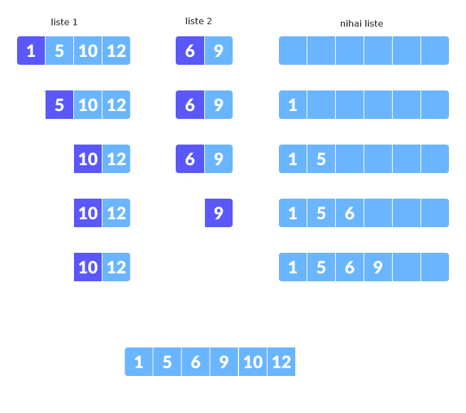
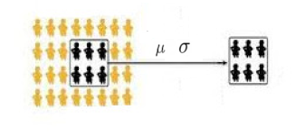

# Paralel Veri Analizi, İstatistik

Eşzamanlı olarak veri işleme, analizi tekniklerinin temel yaklaşımını
[2]'de gördük, orada ve bu yazıda kullanacağımız ana yapı şöyle;
İşlenecek çok büyük bir CSV dosyası var, her çekirdek (birden fazla
ise) her makina veri dosyasına direk erişebilir, paralel işlemler bu
dosyanın farklı kısımlarını aynı anda işleyebilmek üzerinden
gerçekleşecektir. Tercihimiz her zaman satır satır mesafe katedebilen
algoritmalardır, yani verinin tek bir satırına bakarak bir bir
katmadeğer elde edebilen, sonuca daha yaklaşabilen algoritmalar.

### Sıralama (Sorting)

Yöntem 1

- B tane kutu yaratırız, ve hangi kolon bazında sıralama yapıyorsak,
  mesela bir kimlik (id) diyelim, o kimliklerin büyüklük olarak 1,2,3,
  kutusuna düşmesini sağlarız. Eğer maksimum 1000 kimliği var ise, ve
  N=4 için, kimliklerden 0 ile 250 arası 1'inci kutuya, 251 ile 500
  arası 2'inci kutuya vb gibi gitmeli.

- İlk tarama örnek 4 paralel süreç, 4 kutu üzerinden 16 tane dosya
  yaratır. Yani her süreç tüm kutulara düşen verileri bulmak
  zorundadır.

- Ardından paralel olarak yine her kutu için, o kutuya ait olan tüm
  parçaları alırız, hafızada birleştiriz, hafızada sıralarız, ve o
  kutu için diske yazarız.

- Bu bitince sıralanmış tüm kutuların dosyalarını alt alta ekleriz /
  yapıştırırız (basit Unix `cat` ile), ve sıralanmış nihai dosya elde
  edilir. Bu işler çünkü kutuları kendi aralarında 1,2,3,.. diye
  sıralıyoruz, biliyoruz ki 1'inci kutu içindeki id 2'inci kutudakilerden
  muhakkak daha küçük. Eh her kutu içindeki öğelerde sıralı olduğuna göre
  yapıştırılmış nihai sonuç ta kendiliğinden sıralanmış halde olacaktır.

Disk bazlı işlemleri göstermek için sentetik veri üretelim, sadece bir
kimlik (id) kolonu, iki tane isim, adres için metinsel iki kolon.

```python
import util
util.create_sort_synthetic(1000000)
```

```python
! head -5 /tmp/input.csv
```

```text
83473,nnnnnnnnnnnnnnnnnnnn,nnnnnnnnnnnnnnnnnnnn
46657,nnnnnnnnnnnnnnnnnnnn,nnnnnnnnnnnnnnnnnnnn
98157,HHHHHHHHHHHHHHHHHHHH,HHHHHHHHHHHHHHHHHHHH
111152,CCCCCCCCCCCCCCCCCCCC,CCCCCCCCCCCCCCCCCCCC
```

1 milyon satırlık bir veri oldu.

```python
import pandas as pd
df = pd.read_csv("/tmp/input.csv",index_col=0)
```

```python
print (df.index.min(), df.index.max(), np.mean(df.index))
```

```text
0 474390 79792.60683260683
```

Alttaki kodda bu rakamlara bakarak bazı sınırları deneme/yanilma ile
tanımladık, fakat profosyonel ortamda bu sınırları bulmak ta ayrı bir
paralel süreç olabilirdi.

Şimdi ilk paralel kod, her kutuya düşen satırları paralel olarak bul, kendi
dosyasına yaz.


```python
import os, numpy as np, util

class BucketJob:
    def __init__(self,B,ci):
        self.B = B
        self.ci = ci
        self.bins = np.array([0, 50000, 80000, 130000, 474391])
        print (self.B,self.ci)
        self.fout = open("/tmp/B-%d-%d.csv" % (self.B,self.ci), "w")
    def bucket(self, id): # id hangi kutuya ait?
        return np.argmax(self.bins > id)-1        
    def exec(self,line):
        toks = line.strip().split(',')
        if self.bucket(float(toks[0])) == self.B:
           self.fout.write(line)
    def post(self):
        # diske yaz
        self.fout.close()

# altta seri islem var ama her kutu icin 4 paralel surec baslatilabilir
for B in range(4):
    util.process(file_name='/tmp/input.csv', N=4, hookobj = BucketJob(B,0))
    util.process(file_name='/tmp/input.csv', N=4, hookobj = BucketJob(B,1))
    util.process(file_name='/tmp/input.csv', N=4, hookobj = BucketJob(B,2))
    util.process(file_name='/tmp/input.csv', N=4, hookobj = BucketJob(B,3))        
```

Şimdi her kutu için parçaları hafızaya getir, Pandas üzerinden hafızada sırala,

```python
import pandas as pd, glob
import os, numpy as np, util

# seri islem gosterdik yine fakat her kutu icin paralel bir islem yaratilabilir
for B in range(4):
    dfs = [pd.read_csv('/tmp/B-%d-%d.csv' % (B,i),header=None) for i in range(4)]
    df = pd.concat(dfs,axis=0)
    df = df.sort_values(by=0)
    df.to_csv("/tmp/B-%d-sorted.csv" % B, header=None,index=None)
```

Ve nihai olarak tum kutu parcalarini birlestir,

```
! cat /tmp/B-*-sorted.csv > /tmp/B-final.csv
```

Kutu parçalarını basit alt alta yapıştırma ile birleştirmek işliyor
çünkü her kutu içindeki kimlikler belli bir kutuya gitmiş durumda,
mesela id=1000 kimliği B=0 içinde, id=72000 kimliği ikinci kutu içinde,
ve eğer her kutunun dosyası kendi içinde sıralanmış ise, yapıştırılmış
yeni dosyanin kendiliğinden sıralanmış hale geleceği garantidir.

Tek pürüz şurada ortaya çıkabilir; her kutu için üstteki örnekte dört
tane parçayı hafızaya getirdik, ve orada sıraladık. Ya bu sıralama
için hafıza yeterli olmazsa?

Bu durumda az hafıza ile diskteki dosyaları satır satır birleştirmenin
bir yolu alttadır.

Yöntem 2

Bu yöntem bize daha az hafıza ile daha büyük dosyaları tek makinada
sıralama şansı veriyor. Paralellik hala olabilir, fakat son
birleştirme aşaması her ne kadar disk yoğunluklu olsa da tek bir
makinada yapılmalı.

2'inci yöntem ile dosyanın ufak parçalarını yine hafızada sıralarız,
diske yazarız, sonra bir süreç o parçaları disk bazlı (satır satır)
okuyarak birleştirir. Sıralanmış parçaların birleşmiş ve hala sıralı
halde olmasını nasıl garantileriz? Alttaki algoritma ile;

* Her iki parçanın başına git

* Bir döngü içinde her ikisinin sıradaki en küçük parçasına bak (zaten
  sıralanmış dosyalar için bu en üstteki satır)

* Bu iki öğe arasından en ufak olanını al, yeni listeye ekle, öğesi alınan dosyanın sonraki satırına geç, tekrarla

* Listeler farklı boylarda olabilir, bir liste öncekinden önce biterse
  önemli değil, kalan listeyi olduğu gibi yeni listeye ekle.

Altta bu işlemleri gösteren bir örnek görüyoruz.



Listeden bir öğe alındığında o öğeyi "çıkartılmış" gibi gösterdik,
fakat kodlama bağlamında yapılan bir indisin ilerletilmesinden ibaret.

Tarif edilen birleştirmenin işlediğini alttaki ufak kodda
görebiliriz. İki tane rasgele veri içeren liste yarattık, onları önce
hafızada sıraladık, sonra teker teker her birinden en ufak öğeyi
alarak yeni listeyi oluşturduk, ve yeni liste otomatik olarak
sıralanmış hale geldi.

```python
import numpy as np, random, util

def chunkmerge():
    N1 = 5; N2 = N1*2
    
    # rasgele sayilarla iki liste uret
    arr1 = [random.randint(0,100) for i in range(N1)]
    arr2 = [random.randint(0,100) for i in range(N2)]
    
    arr1 = sorted(arr1) # parcayi hafizada sirala
    arr2 = sorted(arr2) # parcayi hafizada sirala
    print ('liste 1',arr1)
    print ('liste 2',arr2)

    res = [] # sonuclar
    
    i=0; j=0 # her iki listenin farkli indisi var
    while i<N1 and j<N2:
        # her iki listenin islenmemis en kucuk degerine bak, arr1[i], arr2[j]
        # kucuk olanini al
        if arr1[i] < arr2[j]:
            res.append(arr1[i])
            i = i + 1
        else:
            res.append(arr2[j])
            j = j + 1
            
    # kalan ogeleri direk transfer et
    while i<N1:
        res.append(arr1[i])
        i = i + 1
    while j<N2:
        res.append(arr2[j])
        j = j + 1
    print ('siralanmis liste',res)
    # iki listeyi birlestirip klasik sekilde sirala
    arrsorted = sorted(arr1 + arr2)
    # ayni sonuc mu
    print ('Siralama isledi mi?',arrsorted == res)

chunkmerge()   
```

```text
liste 1 [2, 33, 43, 49, 83]
liste 2 [5, 29, 32, 48, 52, 59, 60, 73, 81, 93]
siralanmis liste [2, 5, 29, 32, 33, 43, 48, 49, 52, 59, 60, 73, 81, 83, 93]
Siralama isledi mi? True
```

Disk bazlı kod üstteki mantığı dosya satırları için yapar, her iki
dosya açılır, satırlar bu dosyalardan teker teker alınır, döngü içinde
kimlikleri birbiri ile karşılaştırır, hangi dosyadan gelen kimlik daha
küçük ise onun satırı, o dönüşte, çıktıya yazılır, o dosya üzerinde
`readline` çağırılır böylece bir sonraki satıra geçilir. Dosyalardan
biri bitene kadar bu devam eder, sonra kalan dosyanın satırları direk
çıktıya yazılır.

Kod üzerinde görelim. Önce örnek veri yaratılır, 

```python
import util
util.create_two_sorted_synthetic(1000,1000)
```

Bu çağrı 1000 satırlık `L1.csv` ve `L1.csv` adında iki tane dosya
yarattı, bu dosyalar sıralanması yapılmış halde. Alttaki kod bu dosyaları
okuyarak birleştirecek,

```python
def merge_sorted(file1,file2,outfile):
    fout = open(outfile, "w")

    f1 = open(file1, 'r'); f2 = open(file2, 'r')
    s1 = int(os.path.getsize(file1)); s2 = int(os.path.getsize(file2))
    print (s1,s2)
        
    # her iki dosyadan ilk satirlari al
    l1 = f1.readline(); toks1 = l1.strip().split(',')
    l2 = f2.readline(); toks2 = l2.strip().split(',')

    # her iki dosya icin arada bir yigit tabakasi kullanmak iyi
    # olur, 'dosya bitisi' algilanmasi problemli, en iyisi yigit
    # bitisine bakmak
    stack1 = []; stack2 = []
    stack1.append((l1,toks1)); stack2.append((l2,toks2))

    # yigitlardan herhangi biri bitene kadar dongu
    while len(stack1)>0 and len(stack2)>0:
        # iki yigitin ilk ogelerine bak
        l1,toks1 = stack1[-1]; l2,toks2 = stack2[-1]
        # hangisi daha ufaksa onu yaz
        if int(toks1[0]) < int(toks2[0]):
            fout.write(l1)
            stack1.pop()
            if f1.tell() < s1:
                l1 = f1.readline(); toks1 = l1.strip().split(',')
                stack1.append((l1,toks1))
        else:            
            fout.write(l2)
            stack2.pop()
            if f2.tell() < s2:
                l2 = f2.readline(); toks2 = l2.strip().split(',')
                stack2.append((l2,toks2))

    # yigitlari bosalt
    if len(stack1)>0:
        l1,toks1 = stack1[-1]
        fout.write(l1)
    if len(stack2)>0:
        l2,toks2 = stack2[-1]
        fout.write(l2)

    # bitmeyen dosyayi oldugu gibi ciktiya yaz
    while f1.tell() < s1:
        fout.write(f1.readline())
        fout.flush()
    while f2.tell() < s2:
        fout.write(f2.readline())
        fout.flush()        
                           
    fout.close()
```

```python
merge_sorted("/tmp/L1.csv","/tmp/L2.csv","/tmp/L-merged.csv")
```

Sonuç `/tmp/L-merged.csv` dosyasında bu dosya 2000 satırlık ve
sıralanmış halde olacaktır.

Dört tane sıralanmış parçayı nasıl sıralardık? 1 ile 2 birleştirilip A
yaratılabilir, 3 ve 4 ile B. Sonra A ve B birleştirilir, C elde
edilir.

Not: İlk yöntemde kutulama ile her kutu için dört dosya elde ediyoruz
demiştik, ve üstteki algoritma ile her kutu için parçaları ikişer
ikişer birleştirebiliyoruz. Acaba dört parçanın dosyasını aynı anda
açıp her seferinde sıradaki dört değerden minimum olanı almak yine
sıralanmış bir sonuç yaratır mı? Bu durumda dört dosya bir kerede
satır satır okunarak birleştirilebilir. Bu da okuyucuya ödev olsun.

### İstatistik

Bir dosyanın parçaları üzerinde ortalama ve varyans hesabını da
paralel şekilde satırsal, parça parça yapabiliriz. Bu tür paralelliğin
işleyebilmesi için önce satırsal, artımsal şekilde ortalama, ve
varyans hesaplayabilen bir matematik lazım. O matematiği [7]'de
işledik. Oradaki örnekte çok ufak veri gösterildi, alttaki örnekte
dosya bazlı, daha büyük verileri işleyebilmeyi göreceğiz.



Örnek veri yaratalım, insanların boyunu kaydettiğimizi farzediyoruz,
veri 150 cm ve 190 cm arası rasgele sayılardan seçildi, ortalamanın da
o aralığa düşmesini bekleriz. 

```python
import random, pandas as pd
N = 10000
height = [int(random.uniform(150,190)) for i in range(N)]
d = {"id": range(N), "height": height}
df = pd.DataFrame(d)
df.to_csv('/tmp/height.csv',index=None,header=None)
print ('ortalama', np.round(df.height.mean(),2))
print ('varyans', np.round(df.height.var(ddof=0),2))
```

```text
ortalama 169.5
varyans 133.29
```

Verinin tamamı `/tmp/height.csv` içinde, şimdi bu veriyi parçalara
ayırıp her grup için ortalama ve varyansı artımsal
hesaplattıracağız. Yine [2] altyapısını kullanarak,


```python
import os, numpy as np, util, json

class StatJob:
    def __init__(self,ci):
        self.n = 0
        self.ci = ci
        self.ai = 0 # grup ortalamasi
        self.vi = 0 # grup varyansi
    def exec(self,line):
        toks = line.strip().split(',')
        xn = float(toks[1])
        aiprev = self.ai
        self.ai = self.ai + (xn - self.ai) / (self.n+1)
        self.vi = self.vi + (xn - self.ai)*(xn-aiprev)
        self.n = self.n + 1
	
    def post(self):
        # diske yaz
        res = {"N": self.n, "ai": self.ai, "vi": self.vi / self.n}
        fout = open("/tmp/height-%d.txt" % self.ci, "w")
        fout.write(json.dumps(res, indent=4))
        fout.close()

util.process(file_name='/tmp/height.csv', N=2, hookobj = StatJob(0))
util.process(file_name='/tmp/height.csv', N=2, hookobj = StatJob(1))
```

Bu noktada iki tane dosya üretilmiş olmalı,

```python
! ls /tmp/height-*
```

```text
/tmp/height-0.txt
/tmp/height-1.txt
```

Sonuç dosyaları içinde parçalar hakkında gerekli veriler var,

```python
h1 = json.loads(open("/tmp/height-0.txt").read())
h2 = json.loads(open("/tmp/height-1.txt").read())
print (h1)
print (h2)
```

```text
{'N': 5062, 'ai': 169.48143026471752, 'vi': 132.43021620799738}
{'N': 4938, 'ai': 169.52632644795497, 'vi': 134.17721295297002}
```

Şimdi bu parçaları birleştirmeye, ve nihai bir ortalama ve varyans
oluşturmaya gelelim.

Birleştirme için de ayrı bir matematik gerekiyor, [6] yazısında o
konuyu işledik,


```python
n1,n2 = h1['N'], h2['N']
m1,m2 = h1['ai'], h2['ai']
v1,v2 = h1['vi'], h2['vi']
ap = (n1*m1 + n2*m2) / (n1+n2) 
mean_of_var = (n1*v1 + n2*v2) / (n1+n2) 
var_of_means = (n1*(m1-ap)**2 + n2*(m2-ap)**2 ) / (n1+n2)
df = pd.read_csv("/tmp/height.csv",header=None,names=['id','height'])
print ('grup 1',df.head(n1).height.mean(), df.head(n1).height.var(ddof=0))
print ('grup 2',df.tail(n2).height.mean(), df.tail(n2).height.var(ddof=0))
print ('ortalama',ap)
print ('varyans', mean_of_var + var_of_means)
```

```text
grup 1 169.48143026471752 132.43021620799752
grup 2 169.52632644795463 134.17721295297002
ortalama 169.50360000000018
varyans 133.29338703999994
```

Birleştirilmiş değerlerin ilk başta bulunan toplam ortalama ve
varyans ile aynı olduğunu görüyoruz. 

### Kümeleme (KMeans)

K-Means algoritma detayları [7]'de. Daha önce [1] yazısında bu işi
eşle/indirge, Hadoop ortamında nasıl yapacağımızı gördük. Eğer
[2]'deki yöntemi kullanmak istiyorsak, yani altyapı bir veriyi
herhangi bir kritere göre (çoğunlukla basit bloklar üzerinden) bölmek
ve her bölüm üzerinde ayrı bir süreç işletmek istiyorsak (indirgeme
mimarisi kullanmadan), paralel KMeans algoritması şöyle
kodlanabilir. [2]'de bahsettiğimiz gibi takip ettiğimiz yaklaşım
hiçbir şey paylaşma (share nothing) yaklaşımı. Süreç işe başladığında
kendi veri parçasını bilir, ve diğer süreçlerle iletişimde bulunmaz.

Fakat unutmayalım, KMeans özyineli (recursive) bir algoritmadir,
verinin üzerinden tek bir geçiş (single pass) yeterli değildir. Veri
birkaç kere baştan sonra taranmalıdır.

Bir algoritma şöyle olabilir;

- Her geçişte, döngüde, verinin başına gidilir, ve küme merkezlerinin
  en son ne olduğu `centers.txt` dosyasından tüm süreçler tarafından
  okunur (başta rasgele olabilir). Bu çok ufak bir veridir, anında
  okunabilir.

- Her süreç elindeki verinin her noktasının hangi merkeze yakın
  olduğunu saptar. Bu sonuçlar yeni bir dosyaya yazılabilir, bu dosya
  her süreç tarafından okunabilmelidir).

- Ardından başa dönülür, biraz önce yapılan üyelik atamasına göre yeni
  küme merkezleri hesaplanır. Bu yeni merkezler `C-0-0`, `C-0-1` gibi
  bir dosyaya yazılır, ki `C-0-1` 0'inci kümenin 1'inci süreç
  tarafından hesaplanmış merkezidir.

- Bu merkezler tabii ki tamamlanmış değildir, bir süreçten gelen
  hesaplardır bunlar, ana takip edici script tüm süreçlerin o
  geçişteki işi bitince, her küme için yarım hesaplanmış merkezleri
  alır, ortalamasını hesaplayıp yeni `centers.txt` dosyasını oluşturur.

- Üstteki adımlar tekrarlanır, ta ki belli bir geçiş sayısı ya da
  "stabiliteye erişim" durumu oluncaya kadar, stabilite derken mesela
  eğer küme merkezlerinde her geçiş sonrası artık büyük değişimler
  olmuyor ise, iş bitmiş kabul edilebilir.


Önemli noktaları vurgulayalım, veri satırsal şekilde paylaştırılır,
her sürecin işlediği parçada her kümeden değer olabilir. Her geçişte
işlem paralel olur, fakat bir takip edici script o geçiş bitince bir
sonraki geçişi hazırlamakla sorumludur, her süreçten gelen merkezlerin
ortalaması, bir sonraki geçişin başlatılması bir script'in
sorumluluğundadır. Ortalama, bekleme, birleştirme işlemleri ağır
işlemler değildir, bu sebeple seri işlemelerinde problem yoktur.

Kaynaklar

[1] [Paralel KMeans, Hadoop](../../2013/10/paralel-kmeans-hadoop.html)

[2] Bayramlı, [Paralel, Satır Bazlı Dosya İşlemek](../../2016/02/toptan-islemler-paralelizasyon.html)

[3] Wikipedia, [External Sorting](https://en.wikipedia.org/wiki/External_sorting)

[4] https://en.wikipedia.org/wiki/K-way_merge_algorithm

[5] [Stackoverflow](https://stackoverflow.com/questions/29494594/sorting-data-with-space-contrainsts)

[7] [Azar Azar İstatistik (Incremental Statistics) Temeli](https://burakbayramli.github.io/dersblog/stat/stat_176_app1inc/azar_azar_istatistik__incremental_statistics_.html)

[6] [Grupların Ortalamalarını ve Varyanslarını Birleştirmek](https://burakbayramli.github.io/dersblog/stat/stat_010_cov_corr/beklenti_varyans_kovaryans_ve_korelasyon.html#group)

[7] [K-Means Kümeleme Metodu](https://burakbayramli.github.io/dersblog/algs/algs_080_kmeans/kmeans_kumeleme_metodu.html)


