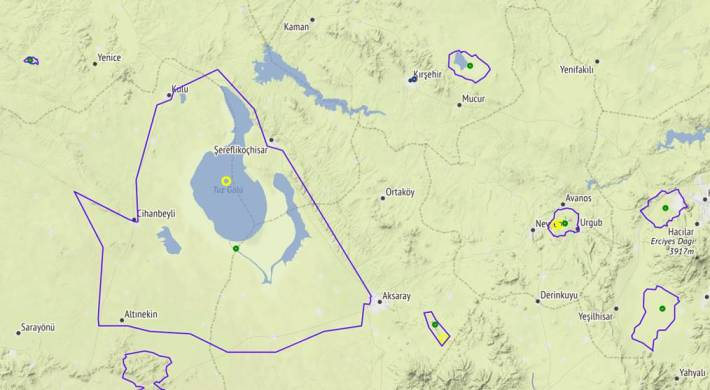

# Yerel Coğrafi Veriler

Şehir kordinatlar, kamp yerleri, milli park verilerini içeren bazı
coğrafi veriler [1]'de bulunabilir. Sıkıştırılmış dosya açılmış hali
`/opt/Downloads/trgeo` diye farzedelim,

```python
from pygeodesy.sphericalNvector import LatLon
import pandas as pd, numpy as np, json, glob
pd.set_option('display.max_columns', None)
base = '/opt/Downloads/trgeo'
```

Önce şehir kordinatlarına bakalım,

```python
df = pd.read_csv(base + '/sehirler.csv')
print (df[['plaka','il_adi','lat','lon']])
```

```text
    plaka          il_adi        lat        lon
0       1           ADANA  37.000000  35.321333
1       2        ADIYAMAN  37.764167  38.276167
2       3  AFYONKARAHİSAR  38.763760  30.540340
3       4            AĞRI  39.721667  43.056667
4       5          AMASYA  40.650000  35.833333
..    ...             ...        ...        ...
76     77          YALOVA  40.650000  29.266667
77     78         KARABÜK  41.200000  32.633333
78     79           KİLİS  36.718399  37.121220
79     80        OSMANİYE  37.068050  36.261589
80     81           DÜZCE  40.843849  31.156540

[81 rows x 4 columns]
```

Diğer veriler

```python
df.columns
```

```text
Out[1]: 
Index(['plaka', 'il_adi', 'lat', 'lon', 'northeast_lat', 'northeast_lon',
       'southwest_lat', 'southwest_lon'],
      dtype='object')
```

`northeast_`, `southwest_` diye giden kolonlar il merkezini tanımlayan
bir kutunun uçlarını gösteriyor olmalı, kontrol etmedik belki bazıları
için faydalı olabilir.

Kamp yerlerini gösteren iki tane dosya var, `kamp/kampyerleri.csv` ve
`kamp/trkamp.csv`. Daha büyük olan birinci dosya. Tek bir satıra
bakalım,


```python
df = pd.read_csv(base + '/kamp/kampyerleri.csv',sep=';')
df1 = df[df.name == 'Davraz Tepe']
lat,lon = df1['location'].to_string(index=False).strip().split(",")
print (lat,lon)
print ("\n",df1['description'])
```

```text
30.871582 38.0275405

 12    Egirdir Golu, Isparta ili sinirlarinda yer ala...
Name: description, dtype: object
```

Tabiat Alanlari, Milli Parklar

Bu kategori altinda birkac tane dosya var, 

```python
glob.glob(base + "/millipark/*.json")
```

```text
Out[1]: 
['/opt/Downloads/trgeo/millipark/milli_parklar.json',
 '/opt/Downloads/trgeo/millipark/ozel_cevre_koruma_alanlari.json',
 '/opt/Downloads/trgeo/millipark/sulak_alanlar.json',
 '/opt/Downloads/trgeo/millipark/tabiat_anitlari.json',
 '/opt/Downloads/trgeo/millipark/tabiat_parklari.json',
 '/opt/Downloads/trgeo/millipark/yaban_hayati_gelistirme_sahalari.json',
 '/opt/Downloads/trgeo/millipark/tabiati_koruma_alanlari.json']
```

Veriler kml formatında [3] makalesi yazarından geliyor; onları json
formatına çevirmek için zip içinde `conv.py` kodu var. Biz bu çevrimi
yaptık, dosyalar aynı zip içinde. JSON veri dosyaları okunduktan sonra
basit Python sözlüğüne erişir gibi erişebiliyoruz, buradaki önemli
veri park, korunma alanın sınırlarını tanımlayan enlem, boylam
listesi,

```python
f = base + "/millipark/tabiat_parklari.json"
with open(f, encoding='utf-8') as fh:
    data = json.load(fh)
print (list(data.keys())[:10])
```

```text
['ABANT GÖLÜ TP', 'GÜVERCİNLİK TP', 'ÇİÇEKLİ TP', 'EFEOĞLU TP', 'BORÇKA KARAGÖL TP', 'KARGALI GÖLCÜK TP', 'DELMECE YAYLASI TP', 'KÜÇÜKELMALI TP', 'SUUÇTU TP', 'AYVALIK ADALARI TP']
```

Bunlardan birini seçelim, mesela `DELMECE YAYLASI TP`

```python
dy = data['DELMECE YAYLASI TP']
dy = np.array([[float(x[0]),float(x[1])] for x in dy])
print (dy[:5])
```

```text
[[40.69293056 31.77253616]
 [40.69254208 31.77262633]
 [40.691463   31.7727743 ]
 [40.6902973  31.77253936]
 [40.68959222 31.77169046]]
```

Bu şekilde alanı tanımlayan poligonun köşe noktalarını elde ettik. Bu
noktaları direk grafikleyebiliriz, favori coğrafi paketi burada
kullanılır, şurada [4] anlatılan Folium olabilir mesela, ya da basemap..

Eğer noktaların ortasını bulmak istiyorsak [5] şu kod,

```python
def mid(coords):
    b = (LatLon(lat,lon) for lat,lon in coords)
    nvecs = np.array([a.toNvector() for a in b])
    mid = nvecs.mean().toLatLon()
    return mid.lat,mid.lon

mid(dy)
```

```text
Out[1]: (40.69422873080869, 31.779313871773233)
```

Üstteki tüm verileri kullanan bir kod [2]'de, çıktısı veriyi içeren
aynı zip içinde, `trgeo.html`.



Kaynaklar

[1] [Veriler](https://drive.google.com/uc?export=view&id=1qM0KPCZz8JlTWoJJ1-FjYYrNzCDGtoGD)

[2] [Haritalama Kodu](trgeo.py)

[3] Örücü, Analysis of the Border Change in Beyşehir Lake and Kizildağ
    National Parks in Terms of Land Cover and Land Use,
    [Link](https://dergipark.org.tr/tr/download/article-file/939738)

[4] [Haritalamak](../../2020/02/haritalamak.html)

[5] [Genel Coğrafi Kordinat Kodları](../../2018/06/genel-gps-html5-javascript-python.html)

