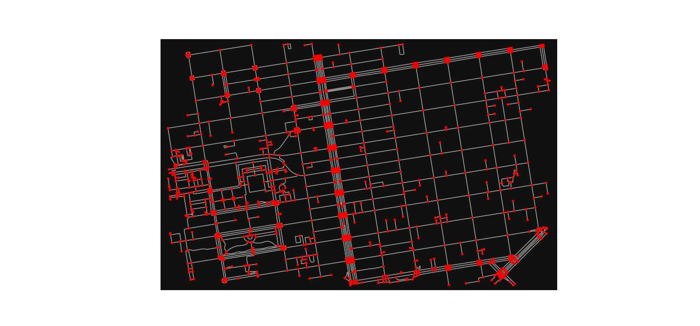

# En Kısa Yol Algoritması, Yol Ağı, OSMNX

OpenStreetMap verisi tüm dünya coğrafi verilerini kapsayan açık
kaynak, herkesin bilgi ekleyebildiği devasa bir veri deposudur, bedava
olarak paylaşılır. İçinde yollar, restoranlar, dükkanlar, önemli
yerler gibi pek çok coğrafi bilgileri içerir. Fakat veriyi işlemek
bazıları için zor olabilir.

Bu verinin daha rahat işlenmesini sağlayan bir paket OSMNX. Özellikle
yol ağ yapısını rahat şekilde indirilmesini ve çizit (graph) olarak
doğru şekilde gelmesini sağlıyor. Çizitler bilindiği gibi matematiğin
bir dalı, bize düğüm-bağlantı yapılarını işleyen algoritmalar sağlar,
tabii ki bir yol ağı çizit teorisinin en bariz uygulama alanıdır,
düğümler duraklar, köşe başları vs olabilir bağlantılar onlar
arasındaki yollar olacaktır.

OSMNX kullanıcının tanımladığı bölgeler içindeki yol yapısını döndürme
kabiliyetine sahiptir, ve bu veriyi diskte önbellekleme yaparak
saklayabilir, böylece aynı bölge için sonraki yükleme çağrılarının
OSM'e bağlanması gerekmez. Eğer veride çizit yapısına uymayan yerler
varsa bunlar döndürülmeden önce tamir edilir.


Kurmak icin Ubuntu uzerinde `gdal-bin`, `libgdal-dev`, `libspatialindex-dev`
`apt install` ile kurulmali. Sonra `pip install`
ile `scikit-learn` ve `osmnx`.

Örnek olarak [1]'deki yere bakalım,

```python
import matplotlib.pyplot as plt
import osmnx as ox

ox.config(use_cache=True, cache_folder='/tmp/osmnx')

north, south, east, west = 37.79, 37.78, -122.41, -122.43

G = ox.graph_from_bbox(north, south, east, west, network_type="walk")
```

```python
fig, ax = ox.plot_graph(G, node_color="r",show=False, figsize=(15,7))
plt.savefig('osmnx-01.jpg',quality=50)
```




`cache_folder` ile önbellek dosyalarının yazılacağı yer tanımlandı. Üstteki çağrı
için baktık `30 520ecdb05972a5893b8a541266157cd0b30a6381.json` diye bir dosya
oraya yazılmış, büyüklüğü 1.8 MB.

`graph_from_bbox` ile belli kuzey, güney, doğu, batı uç noktalarının
oluşturduğu kutunun içine düşen yol ağını aldık, fakat tek bir nokta
verip ona belli uzaklıktaki tüm yol ağını da alabilirdik, mesela
`graph_from_point((37.79, -122.41), dist=750` ile verili noktanın 750
metre çevresindeki ağ alınabilir.

```python
import osmnx as ox

ox.config(use_cache=True, cache_folder='/tmp/osmnx')

G = ox.graph_from_point((37.79, -122.41), dist=750, network_type="walk")
```

Network tipi `network_type` ile tanımlanıyor, `walk`, `drive`, `bike`
değerleri geçilebiliyor, bu değerler sırasıyla arabaların geçebildiği, ya da
bisiklet, ya da yürünebilen yol yapılarını döndürür. Uygulamanın
ihtiyacına göre farklı ağ yapıları gerekebilir (arabaların geçebildiği her
yol bisiklete uygun olmayabilir mesela), bu sebeple bu seçenek gerekli.

Çağrı yapıldı, ve artık geri döndürülen `G` değişkeni içinde yol yapısı var,
buna düğümlerden oluşan bir liste olarak erişilebilir, mesela 0'inci
ve 20'inci düğümler


```python
print (list(G)[0])
print (list(G)[20])
```

```text
65281835
65295291
```

İlk 10 düğüm

```python
print (list(G)[:10])
```

```text
[65281835, 65281838, 65287183, 65287185, 65290169, 65290173, 65290750, 65290756, 65291738, 65291741]
```

Kısa yol bulmaya gelelim; ilk önce eldeki başlangıç ve bitiş coğrafi
kordinatlarına en yakın çizit düğümlerini bulmak lazım,

```python
origin = (37.784825495166544, -122.40208526405367)
destination = (37.79584463577157, -122.40724290129684)
origin_res = ox.get_nearest_node(G, origin,method='euclidean',return_dist=True)
destination_res = ox.get_nearest_node(G, destination,method='euclidean',return_dist=True)
print (origin_res)
print (destination_res)
```

```text
(5554084244, 5.332404779362496)
(7233579607, 15.949918872077847)
```

Sonuçlar bir Python tüpü (tuple) olarak verildi, birinci değer düğüm
kimliği, ikincisi bizim verdiğimiz kordinata olan metre olarak yakınlık.
Şimdi bu ID'ler ile yine OSMNX içinde mevcut olan en kısa yol algoritmasını
işletiyoruz,

```python
route = ox.shortest_path(G, origin_res[0], destination_res[0])
route[:10]
```

```text
Out[1]: 
[5554084244,
 5554084275,
 5554084256,
 5554084269,
 995847660,
 5554084309,
 1270745639,
 275431510,
 5554083274,
 1332541752]
```

Geçilecek yolun ilk 10 düğümü listeledik, en kısa yol bu noktalardan
oluşuyor. Noktalar hakkında daha detaylı bilgiyi `G` çizit objesinden
alabiliriz, mesela enlem, boylam değerleri bu objeye sorulabiliyor,
ilk noktayı soralım,

```python
G.nodes[route[0]]
```

```text
Out[1]: {'y': 37.7848105, 'x': -122.4021429, 'street_count': 3}
```

Tüm noktaları enlem/boylam listesine çevirelim,

```python
coords = [[G.nodes[r]['y'],G.nodes[r]['x']] for r in route]
print (coords)
```

```text
[[37.7848105, -122.4021429], [37.7845016, -122.4030429], [37.7846474, -122.4031738], [37.7847412, -122.4032112], [37.784882, -122.403207], [37.7850366, -122.4034089], [37.7850702, -122.4034505], [37.7851231, -122.4035159], [37.7851702, -122.4035743], [37.7855328, -122.40403], [37.7862746, -122.4049529], [37.7864463, -122.404735], [37.7865865, -122.4048136], [37.7867459, -122.4048752], [37.7868265, -122.4049267], [37.7868355, -122.4048551], [37.7869147, -122.404873], [37.7877685, -122.4050568], [37.788237, -122.4051523], [37.7887033, -122.4052473], [37.7891462, -122.4053364], [37.7892111, -122.4053494], [37.7893261, -122.4053725], [37.7896352, -122.4054347], [37.7901017, -122.4055285], [37.7905698, -122.4055991], [37.7915047, -122.4057597], [37.7917761, -122.4058148], [37.7923696, -122.4059355], [37.7924582, -122.4059535], [37.7925624, -122.4059745], [37.7933866, -122.4061403], [37.793828, -122.4062291], [37.7942666, -122.4063174], [37.7950988, -122.4064848], [37.7951483, -122.4064948], [37.7952034, -122.4065059], [37.7959786, -122.4066619], [37.7959709, -122.4067263], [37.7959246, -122.4070922]]
```

Kordinatları bir Folium haritasında gösterebiliriz artık,


```python
import folium
map = folium.Map(location=origin,zoom_start=16,control_scale=True)
folium.Marker(origin, popup="Park").add_to(map)
folium.Marker(destination, popup="Çin Mahallesi").add_to(map)
folium.PolyLine(locations=coords, color="red").add_to(map)
map.save('direction1.html')
```

[Tarif](direction1.html)

Haritada görülen kırmızı çizgiler yürünüş için en kısa yolu gösteriyor.

Ham OSM Dosyaları, Format Değişimi

Eger bir OSM dosyasini indirip direk kendi yerel diskimizden okutmak istiyorsak
`graph_from_xml` cagrisi var. [7]'den mesela ufak bir dosya Seychelles indirelim,
`.osm.bz2` dosyasi

```python
import osmnx as ox

G = ox.graph_from_xml("seychelles-latest.osm.bz2")
```

ile okuyabiliriz. Eğer bu çiziti başka bir formatta yazmak istiyorsak,
mesela her satır "düğüm1 - düğüm2 - değerler" olacak şekilde, yani
1'inci düğümün bağlı olduğu 2'inci düğüm ve aralarındaki kenar
ağırlığı her satıra yazılacak, bunu

```python
import networkx as nx

nx.write_edgelist(G, "test.edgelist.gz",data=["oneway","length"])
```

ile yapabiliriz. Her düğümün coğrafi kordinatını .osm dosyasını direk
tarayarak yapabiliriz, okunabilir bir dosya bu, ve `lat`, `lon` değerleri
her düğüm için var.

### Dezavantajlar

Bu paketin hafıza idare problemi var. Eğer .osm dosyası çok büyük ise
`graph_from_xml` için yerel bilgisayarın hafızası yetmeyebilir, mesela
Lüksemburg gibi ufak bir harita için bile 4 GB yeterli olmadı.

Bölge tanımlayıp o bölge için gerekli OSM bilgilerini indirmek, aynı
anda onu işleyip başka bir formata döndürmek teoride iyi fakat
pratikte network yavaşlığı, kesilmesi gibi envai türden problemde bizi
yolda bırakabilir. Bazı kavramları öğrenmek için bu paket faydalı olsa
da nihai bir uygulama için eksikler olacaktır. 

Kaynaklar

[1] <a href="https://geoffboeing.com/2016/11/osmnx-python-street-networks/">Geoff Boeing</a>

[2] <a href="../../2016/11/yol-tarifi-harita-bilgisi-osrm-backend.html">OSRM Yol Tarifi</a>

[3] <a href="https://networkx.org/documentation/stable/reference/classes/multidigraph.html">NetworkX Multidigraph</a>

[4] <a href="https://github.com/gboeing/osmnx-examples/blob/main/notebooks/01-overview-osmnx.ipynb">OSMNX Belge 1</a>

[5] <a href="https://github.com/bryanvallejo16/shortest-path-osm/blob/main/shortest_path_osm_updated_example.ipynb">OSMNX Belge 2</a>

[6] <a href="https://github.com/gboeing/osmnx-examples/blob/main/notebooks/02-routing-speed-time.ipynb">OSMNX Belge 3</a>

[7] http://download.geofabrik.de