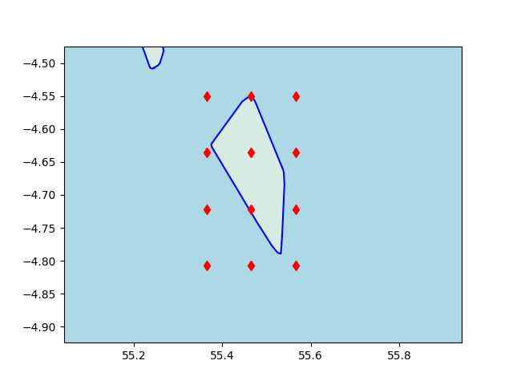
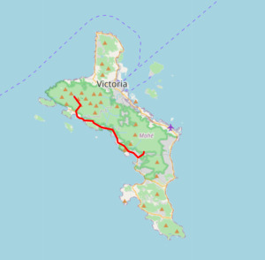

# OSM Haritaları, PBF Dosyaları, En Kısa Yol, Djikstra  

Yol ağını içeren OSM haritasını kendimiz işleyip erişimi hızlı
istediğimiz formata çevirmek istersek bu mümkündür, OSM dosyaları [1]
sitesinde bedava paylaşılıyor, ve çevrimin ilk aşaması OSM -> düz text
CSV bazlı dönüşüm Rust [5] ile yazılmış `osm4routing` kodunda var. Bu
yazıda amaç iki nokta arasında kısa yol algoritması bulan algoritma
yazmak olacak.

`osm4routing` kurmak için

```
cargo install osm4routing
```

Örnek olarak Şeysel (Seychelles) adalarına bakalım, ufak bir dosya
olduğu için örnekleri göstermek işletmek hızlı olur. Haritası Afrika
dizini altında, oradaki osm.pbf dosyası indirilir.  `$HOME/Downloads`
altında olduğunu farzedelim,

```
osm4routing $HOME/Downloads/seychelles-latest.osm.pbf
```

Program oldukça hızlı işler, bitince iki tane dosya, `edges.csv` ve
`nodes.csv` üretilmiş olmalı. İçeriklerine bakalım (ilk birkaç satır),

```python
! head -10 nodes.csv
```

```text
id,lon,lat
5766693114,55.2028362,-3.7270749
2737905006,55.694301599999996,-4.3259219
2710742974,55.4645328,-4.6004604
6808483052,55.462411599999996,-4.632185799999999
8979383052,55.518222699999995,-4.716342399999999
9144642426,55.4628521,-4.5883534
6407473046,55.4584707,-4.6071178999999995
8979071049,55.4408661,-4.624990299999999
3789265673,55.401677899999996,-4.6558733
```

```python
! head -3 edges.csv
```

```text
id,osm_id,source,target,length,foot,car_forward,car_backward,bike_forward,bike_backward,train,wkt
26771422-0,26771422,293645412,1159221829,113.98597980501721,Allowed,Secondary,Secondary,Allowed,Allowed,Forbidden,"LINESTRING(55.7601390 -4.3462977, 55.7602171 -4.3463866, 55.7602852 -4.3464620, 55.7603906 -4.3466138, 55.7604949 -4.3467581, 55.7605343 -4.3468123, 55.7605801 -4.3468621, 55.7606248 -4.3468929, 55.7606791 -4.3469152, 55.7607355 -4.3469237, 55.7608292 -4.3469269, 55.7608735 -4.3469255)"
26771422-1,26771422,1159221829,2330448860,71.52456370873085,Allowed,Secondary,Secondary,Allowed,Allowed,Forbidden,"LINESTRING(55.7608735 -4.3469255, 55.7613600 -4.3469271, 55.7614284 -4.3469290, 55.7614753 -4.3469333, 55.7615168 -4.3469417)"
```

Çizit (graph) teorisi açısından bakarsak üstte bir ağ / çizit yapısı
var, ilk dosyadakiler düğümler (nodes) ikincidekiler ise kenarlar
(edges). Düğümler yeryüzünde bazı noktalar, bir durak olabilir, yol
ağzı olabilir, ya da yol üzerindeki bir nokta. Her düğümün bir `id`
kimliği var, ve bu `id` ile o noktanın kordinat değerlerine enlem
boylam üzerinden erişebiliyoruz. Kenarlar bir düğümü bir diğerine
bağlayan yollar gibi görülebilir, bağlantı parçaları. Her kenarın da
bir kimliği var, ve ayrıca çıkış noktası `source` bitiş noktası
`target` bilgisini taşıyor. Bu iki kolon tabii ki düğüm verisindeki
`id` değerlerine tekabül ediyor, kenar bir düğümden çıkıp diğerinde
bitiyor.

Kenarların, yani yolların taşıdığı bazı ek önemli bilgiler var; mesela
bir yolun yürümeye elverişli olup olmadığı (`foot` kolonunda `Allowed`
değeri var ise), aynı şekilde araba, bisiklet kullanımına uygun olup
olmadığı ve nihai olarak ne kadar uzun olduğu (`length`) yol bilgisi
içinde mevcut.

### Düğüm Veri Yapısı, Yakın Nokta Bulmak

Kısa yol algoritması işletmek için bize neler lazım? Yol tarifi
isterken bir başlangıç ve bitiş noktası enlem/boylam olarak verilir,
bu iki noktanın OSM düğüm noktalarına eşlenmesi gerekiyor, aynen [3]
yazısında olduğu gibi önce verilen kordinatlara en yakın OSM noktası
bulunmalı, ve oradan sonra düğüm, kenar, sonraki düğüm vs diye yol
arama algoritması işleyebilir.

Fakat bir liste içinden bir noktaya en yakın veri noktasını bulmak
performans açısından o kadar kolay bir iş değil; örnek olarak burada
ufak veri kullandık ama mesela TR boyutunda bir haritada milyonlarca
nokta ve onların arasında bağlantılar olacaktır. Milyonlarca satır
içinden en yakın olanını bulmak eğer tüm verilere teker teker
bakılıyorsa uzun sürebilir. Bize bir tür indeksleme (indexing)
mekanizması gerekiyor.

İlk akla gelebilecek çözümler QuadTree, KDTree gibi seçenekler, fakat
bu çözümlerin çoğu bellek bazlı işler; etrafta bulunabilecek mevcut
kodlar milyonlarca veri noktasını alıp bir indislenmiş ağaç yapısı
oluşturabilir ama bunu veri yapısını hafıza tutarak yapar. İdeal
olarak nokta bulmak, kısa yol hesaplama algoritmasının ufak bilgisayar
üzerinde işleyebilmesi tercihimiz (bir ağaç yapısını hafızaya diskten
geri aldığımızda gigabayt seviyesinde olmamalı). Eğer ağır işlem
bedeli ödenecekse onun baştan, veri hazırlığı evresinde ödenmesi daha
iyi olacaktır.

Şöyle bir çözüm olabilir, harita üzerinde bir ızgara (grid)
oluştururum, 4 x 4, ya da 3 x 4 boyutunda olabilir, bu bana 12 ızgara
noktası verir, sonra veriyi baştan sonra işlerken elimdeki her düğüm
için onun en yakın olduğu iki ızgara noktasını bulurum ve yeni bir
tabanda kaydederim. Bu yeni dosyayı bir SQL tabanına yazarım, her
satırda yakın ızgara noktaları mesela kolonlar `c1` ve `c2` olabilir
ve yeni tabloyu bu kolonlar bazlı indekslerim, böylece `c1` ve `c2`
bazlı filtreleme işlemi hızlanır.

Referans ızgara noktalarını (3 x 4 için 12 tane zaten) bir `pickle`
içinde kaydedebilirim, böylece sonradan isteyen yükleyebilir, ve artık
herhangi bir nokta için aynı yakınlık hesabı işletilir, mesela `c1=3`,
`c2=5` bulundu diyelim ve SQL tabanından ya 3 ya da 5 değerine sahip
olan düğümleri `SELECT` ile alırım, ve bu noktalar üzerinde detaylı
yakınlık hesabı işletirim. Böylece gerçek mesafe hesabı yapacağım veri
miktarını azaltmış oldum.  Bu mantıklı olmalı, haritayı bölgelere
ayırıyorum bir bakıma, eğer elimde Karadeniz bölgesinden bir nokta
varsa Akdeniz bölgesindeki noktalara bakmaya ne gerek var?

Burada seçilen teknolojilerin özelliklerine, kuvvetlerine dikkat;
ızgara noktası bazlı filtreleme için SQL kullandık çünkü tam sayı
bazlı filtreleme işlerini hem disk bazlı (herşeyi hafızaya almadan) ve
çok hızlı yapar. Izgara ataması yaparken `nodes.csv` satır satır
işlenecek, ve o sırada satır satır SQL tabanına yazım yapılacak, bu da
hızlı, mesafe hesabı yapılıyor ama sadece 12 ızgara noktası için
yapıldığı için çok performans kaybı yok.

```python
import csv, numpy as np, re, os, shutil, pickle, sqlite3
from pygeodesy.sphericalNvector import LatLon
from scipy.spatial.distance import cdist
import pandas as pd

dbfile = "nodes.db"

def grid_assign_centers(corner1,corner2):
    
    p1 = LatLon(corner1[0],corner1[1])
    p2 = LatLon(corner2[0],corner2[1])

    lowlat = np.min([p1.lat,p2.lat])
    lowlon = np.min([p1.lon,p2.lon])
    hilat = np.max([p1.lat,p2.lat])
    hilon = np.max([p1.lon,p2.lon])

    x = np.linspace(lowlon,hilon,3)
    y = np.linspace(lowlat,hilat,4)

    xx,yy = np.meshgrid(x,y)
    mids = []
    for x,y in zip(xx.flatten(), yy.flatten()):
        mids.append([x,y])       
    mids = np.array(mids)
        
    pickle.dump(mids, open('centers.pkl', 'wb'))        

    if os.path.exists(dbfile): os.remove(dbfile)    
    db = sqlite3.connect(dbfile)
    cursor = db.cursor()
    cursor.execute('''CREATE TABLE osm_nodes(id INTEGER PRIMARY KEY, 
                      lat NUMERIC, lon NUMERIC, c1 INTEGER, c2 INTEGER)
                      ''')
    db.commit()
    
    cursor = db.cursor()
    with open('nodes.csv') as csvfile:
        rd = csv.reader(csvfile,delimiter=',')
        headers = {k: v for v, k in enumerate(next(rd))}
        for i,row in enumerate(rd):        
            id,lat,lon = row[headers['id']],row[headers['lat']],row[headers['lon']]
            ds = cdist(mids,np.array([[lon,lat]]))
            res = list(np.argsort(ds,axis=0).T[0][:2])
            cursor.execute('''INSERT INTO osm_nodes(id, lat, lon, c1, c2)
                      VALUES(?,?,?,?,?)''', (id,lat[:8],lon[:8],int(res[0]),int(res[1])))            
            if i % 1000 == 0:
                print ('satir',i)
                db.commit()

    cursor = db.cursor()
    cmd = "CREATE INDEX index1 ON osm_nodes(c1)"
    cursor.execute(cmd)
    cmd = "CREATE INDEX index2 ON osm_nodes(c2)"
    cursor.execute(cmd)
    db.commit()

# iki tane kose noktasini haritadan elle sectik
grid_assign_centers((-4.807419070202981, 55.364345234773644),
                    (-4.549969190633921, 55.566362543604434))

```

```text
satir 0
satir 1000
satir 2000
satir 3000
satir 4000
satir 5000
satir 6000
```

Tablo `osm_nodes` yaratıldı. Dikkat, `c1` ve `c2` üzerindeki indeksler
tüm satırlar eklendikten *sonra* yaratıldı. Eğer boş tablo üzerinde bu
indeksleri yaratmış olsak `INSERT` işlemleri yavaşlardı. Toptan
`INSERT` yaparken indekslere ihtiyaç yok çünkü bir toptan veri
hareketi işlemi bu, indeksler sonradan lazım olacak. Bu tipik bir
mühendislik kar/zarar denge hesabı (trade-off).

Seçilen köşe ve hesaplanan ızgara noktaları altta grafikleniyor,



Şimdi bu ızgara noktalarını kullanarak bize "kordinata en yakın olan
OSM id'sini bul" mantığını kodlayabiliriz.

```python
def find_closest_node(lat,lon):
    mids = pickle.load(open("centers.pkl","rb"))

    conn = sqlite3.connect(dbfile)

    frvec = np.array([lon,lat]).reshape(1,2)
    ds = cdist(mids,frvec)
    fr_closest_mid = list(np.argsort(ds,axis=0).T[0][:2])
    frres = []
    sql = "select id,lat,lon from osm_nodes where c1==? or c1==? or c2==? or c2==?"
    c = conn.cursor()
    rows = c.execute(sql,(int(fr_closest_mid[0]),
                          int(fr_closest_mid[1]),
                          int(fr_closest_mid[0]),
                          int(fr_closest_mid[1])))
    for row in rows: frres.append(row)

    df = pd.DataFrame(frres); df.columns = ['id','lat','lon']

    frres = cdist(df[['lon','lat']], frvec)
    res = df.iloc[np.argmin(frres)][['id','lat','lon']]
    return list(res)
```

Altta iki nokta seçtik, bunları birazdan yol hesabı için başlangıç
bitiş noktaları olarak kullanacağız, 

```python
fr=(-4.699287820423064, 55.49185927728346)
to=(-4.6364140603708925, 55.406975784999176)

find_closest_node(fr[0],fr[1])
```

```text
Out[1]: [5241652028.0, -4.70279, 55.48997]
```

```python
find_closest_node(to[0],to[1])
```

```text
Out[1]: [8059195265.0, -4.63801, 55.40781]
```

Bu noktalar hakikaten de benim seçtiğim yerlere yakın. Demek ki
verilen OSM kimliğini (listedeki üç sayıdan ilki) kullanabilirim.

### Bağlantılar

İkinci teknoloji seçimine gelelim, bu bir önceki konu kadar önemli,
yolları temsil eden çiziti, düğümler ve aralarındaki bağlantıları
nasıl temsil edeceğiz? Bu seçimi yaparken aklımda bazı tercihler ve
bilgiler var. Mesela [7] yazısında anlatılan kısa yol algoritmasının
Python sözlüğü bazlı çalıştığını biliyorum, çiziti bir "sözlük içinde
sözlük" yapısında olmasını bekliyor, yani çizit `G` ise mesela
`G['a']` ile `G` sözlüğünden ikinci bir sözlük elde ediyoruz, bu
sözlükte hedef düğümü geçiyoruz, bu bize yolun ağırlığını / uzaklığını
veriyor, `G['a']['b']` ile `a` düğümünün `b` düğümüne uzaklığını elde
ediyorum.

İkinci tercih daha önceki durumda olduğu gibi herşeyi hafızaya
almaktan kaçınmak. Mümkün olduğu kadar herşeyi disk bazlı yapmak.  Bu
bizi nihai teknoloji tercihine götürüyor - disk bazlı bir sözlük!
Daha önceki bir yazıda [6] bunu görmüştük, `diskdict` hızlı çalışan
bir paket. O zaman kenar verilerini bir `diskdict` sözlüğüne ekleyerek
ikinci veri yapısını elde edebilirim.

Algoritmayı yazalım, `edges.csv` dosyasını satır satır gezerken her
çıkış düğümü `source` ile bitiş noktası `target` arasında `length`
uzaklığını sözlük içindeki sözlüğe ekliyoruz. Not: Çizitimizi yürüyüş
için hazırlayacağız, yani `car`, `bike` gibi seçenekleri olan ama
yürüyüşe izin vermeyen yollar alınmayacak.


```python
from diskdict import DiskDict
import os, csv, shutil

dictdir = "walkdict"

def diskdict():

    if os.path.exists(dictdir): shutil.rmtree(dictdir)
    print ('bos hucreleri yarat')
    dd = DiskDict(dictdir)
    with open('edges.csv') as csvfile:
        rd = csv.reader(csvfile,delimiter=',')
        headers = {k: v for v, k in enumerate(next(rd))}
        for i,row in enumerate(rd):        
            if i % 1000 == 0: print ('satir', i)
            if row[headers['foot']] == 'Allowed':
                dd[row[headers['source']]] = {}
                dd[row[headers['target']]] = {}

    dd.close()

    print ('baglantilari ekle')
    dd = DiskDict(dictdir)
    with open('edges.csv') as csvfile:
        rd = csv.reader(csvfile,delimiter=',')
        headers = {k: v for v, k in enumerate(next(rd))}
        for i,row in enumerate(rd):        
            if i % 1000 == 0: print ('satir',i)
            if row[headers['foot']] == 'Allowed':

                tmp = dd[row[headers['source']]]
                tmp[row[headers['target']]] = row[headers['length']]
                dd[row[headers['source']]] = tmp

                tmp = dd[row[headers['target']]]
                tmp[row[headers['source']]] = row[headers['length']]
                dd[row[headers['target']]] = tmp

    dd.close()

diskdict()
```

```text
bos hucreleri yarat
satir 0
satir 1000
satir 2000
satir 3000
satir 4000
satir 5000
satir 6000
satir 7000
baglantilari ekle
satir 0
satir 1000
satir 2000
satir 3000
satir 4000
satir 5000
satir 6000
satir 7000
```

Oldu mu acaba? Biraz önce yukarıda bulduğumuz iki OSM id için kontrol edebilirim,

```python
dd = DiskDict(dictdir)
print (dd['5241652028'])
print (dd['5241649212'])
dd.close()
```

```text
{'5241649212': '457.3817484566977'}
{'4777625846': '53.01967846005421', '4777625831': '290.6337430695447', '5241652028': '457.3817484566977'}
```

İşliyor gibi gözüküyor. Şimdi kısa yol algoritmasina gelelim, bu algoritmayi [7]'de
işledik ve bu yazıdaki formu direk [8] bağlantısından aldık. 

```python
from priodict import priorityDictionary

def Dijkstra(G, start, end=None):
    D = {}  
    P = {}  
    Q = priorityDictionary()  
    Q[start] = 0

    for v in Q:
        D[v] = Q[v]
        if v == end:
            break

        for w in G[v]:
            vwLength = D[v] + float(G[v][w])
            if w in D:
                if vwLength < D[w]:
                    raise ValueError("Dijkstra: found better path to already-final vertex")
            elif w not in Q or vwLength < Q[w]:
                Q[w] = vwLength
                P[w] = v

    return (D, P)

def shortestPath(G, start, end):

    D, P = Dijkstra(G, start, end)
    Path = []
    while 1:
        Path.append(end)
        if end == start:
            break
        end = P[end]
    Path.reverse()
    return Path
```

Şimdi başlangıç ve bitiş noktası olarak önceden bulduğumuz değerleri geçelim,

```python
dd = DiskDict(dictdir)
path = shortestPath(dd,'5241652028','8059195265')
print (path)
dd.close()
```

```text
['5241652028', '5241649212', '4777625846', '405266842', '3802966016', '405266742', '405266728', '6431706479', '305690088', '305690096', '305690111', '3802965784', '3802965685', '305690121', '2354805430', '1614295880', '1864118317', '305691481', '3802965494', '305691485', '3802965479', '305691491', '1417297967', '305691500', '305691521', '2802777348', '305691544', '7382949169', '7382949164', '305691549', '6437197545', '305691560', '305691563', '2802805342', '305691567', '439186462', '305691570', '305691582', '305691586', '6437232101', '305691589', '6437232098', '2573268555', '1864118244', '1864118235', '8918610006', '9225502574', '305691605', '2802788703', '6437269807', '6437269803', '305691623', '305691629', '305691642', '306655753', '306655762', '3049391257', '306655819', '9926906798', '2379086156', '6437318872', '395271770', '3190260407', '398384289', '6437348771', '2008248197', '5517625607', '9233918566', '398384449', '1198102870', '1198102890', '1198114558', '1198114523', '8059195265']
```

Bir yol bulundu gibi duruyor. Yol tabii ki osm id bazında listelendi, bu düğüm
noktalarının kordinat değerlerini bulup grafiklersek yolu göstermiş oluruz.
ID kullanıp enlem/boylam almak için bir fonksiyon yazalım, ve çevrimi yapalım,

```python
import sqlite3

def get_osm_info(osmid):
    conn = sqlite3.connect(dbfile)
    sql = "select lat,lon from osm_nodes where id==?"
    c = conn.cursor()
    rows = list(c.execute(sql,(osmid,)))
    if (len(rows)==1): return rows[0]
    else: return None

coords = [get_osm_info(x) for x in path]

print (coords)
```

```text
[(-4.70279, 55.48997), (-4.70551, 55.48911), (-4.70569, 55.48953), (-4.70713, 55.48649), (-4.70891, 55.48444), (-4.709, 55.48432), (-4.70993, 55.48329), (-4.71002, 55.48308), (-4.71015, 55.4822), (-4.7085, 55.48134), (-4.7061, 55.47901), (-4.70493, 55.47804), (-4.70463, 55.4777), (-4.70448, 55.47744), (-4.70366, 55.47573), (-4.70364, 55.47552), (-4.70336, 55.47385), (-4.70314, 55.47369), (-4.70277, 55.47336), (-4.70254, 55.47284), (-4.70254, 55.47236), (-4.70209, 55.47161), (-4.70093, 55.47065), (-4.70084, 55.47013), (-4.69627, 55.46672), (-4.69475, 55.46378), (-4.69253, 55.45959), (-4.69241, 55.4595), (-4.69203, 55.45931), (-4.68996, 55.45863), (-4.68702, 55.45828), (-4.68583, 55.45778), (-4.68453, 55.45697), (-4.68374, 55.45639), (-4.6831, 55.45592), (-4.68242, 55.45582), (-4.68233, 55.45581), (-4.67872, 55.45434), (-4.67745, 55.45379), (-4.67726, 55.45357), (-4.67709, 55.4533), (-4.67696, 55.45289), (-4.67691, 55.45276), (-4.67621, 55.45166), (-4.67587, 55.44956), (-4.67601, 55.44818), (-4.6759, 55.44788), (-4.67579, 55.44757), (-4.67471, 55.44478), (-4.6757, 55.44405), (-4.67501, 55.44215), (-4.67492, 55.44157), (-4.67399, 55.43991), (-4.67281, 55.4375), (-4.67236, 55.43661), (-4.67216, 55.43551), (-4.66865, 55.43009), (-4.66709, 55.42912), (-4.66642, 55.41922), (-4.666, 55.41862), (-4.66509, 55.41826), (-4.66414, 55.41694), (-4.66352, 55.4152), (-4.66316, 55.41373), (-4.6613, 55.41093), (-4.65905, 55.4105), (-4.65834, 55.41054), (-4.65791, 55.41036), (-4.65772, 55.41026), (-4.65711, 55.40959), (-4.65512, 55.40988), (-4.6484, 55.41474), (-4.63796, 55.40797), (-4.63801, 55.40781)]
```

Artık bu kordinatları bir haritada gösterebiliriz,

```python
import folium
m = folium.Map(location=fr, zoom_start=12)
folium.PolyLine(locations=coords, color="red").add_to(m)
m.save("seychelles-route.html")
```

[Sonuç](seychelles-route.html)



Yol üstteki haritada gösteriliyor. Kısa bir yol. Google yol tarifi
algoritmasının bulduğu sonuç [şurada](osm2.jpg). İkisi de kullanışlı
duruyor. 

Gösterilen teknolojiler, tasarım seçimleri sayesinde açık kaynak
verisi OSM ile hızlı bir şekilde ürettiğimiz SQL tabanı ve `diskdict`
sözlüğü ile direk disk bazlı hızlı kısa yol hesabı yapabiliyoruz. İşin
en iyi tarafı Djikstra kısa yol algoritması üzerinde hiçbir değişiklik
yapmadan onu olduğu gibi işletebilmemiz, çünkü onun farzettiği sözlük
yapısına uygun bir kod sağladık ve algoritma direk çalıştı. Kodlar az
hafıza gerektiriyor çünkü veri erişimini çoğu yerde noktasal atış,
direk kimlik bazlı erişime indirgedik. Üstteki tabanları daha büyük
haritalar üzerine işletince çıktının çok yer tutmadığını görebiliriz,
mesela TR için `diskdict` tabanı 300 MB'dan daha az. Ayrıca erişim
disk bazlı olduğu için tüm taban hafızaya taşınmayacak, gerekli
yerlerine erişim yapılacak.

Not: Yolu sadece bir düğümler serisi olarak gösterdik; nihai bir ürün
için yol parça kordinatlarını kenar objelerinin kendisinden almak daha
iyi olur, bu bilgi `nodes.csv` içinde her kenar için mevcut zaten, bir
`LINESTRING` olarak belirtiliyor. Bu bilgi veri hazırlama evresinde
`length` ile beraber `diskdict` içine yazılabilir, ya da ayrı bir veri
tabanında tutulup `id` ile sorgulanabilir. İşin bu kısmını okuyucuya
bırakıyoruz.

Not: Mesafe hesabı olarak `cdist` kullanımı var, bu hesap bilindiği
gibi Öklitsel mesafe hesaplar, yani $\sqrt{\Delta x^2 - \Delta y^2}$.
Muhakkak enlem, boylam açısal değerlerdir, tam anlamıyla iki boyutlu
bir düzlem üzerindeki x,y değerleri değillerdir, fakat kısa
mesafelerde, aynen boylam=x ve enlem=y deyip kabaca bir grafikleme
yapabildiğimiz gibi, burada da sınırlı bir alan içinde benzer bir
yaklaşıksal hesap yapabiliyoruz. Ayrıca dikkat, hiçbir yerde `cdist`
sonucunu gerçek bir mesafe ile karşılaştırmıyoruz, "acaba 10 km'den
küçük mü büyük mü" gibi, onu sadece belli bir liste içindeki
noktalardan en yakınını bulmak için kullandık. 

Kaynaklar

[1] <a href="http://download.geofabrik.de/index.html">GEOFabrik</a>

[2] <a href="../../2016/11/yol-tarifi-harita-bilgisi-osrm-backend.html">Yol Tarifi, Harita Bilgisi: osrm-backend</a>

[3] <a href="../../2023/04/yol-bolmak-osm-osmnx.html">En Kısa Yol Algoritması, Yol Ağı, OSMNX</a>

[4] https://github.com/Tristramg/osm4routing2

[5] <a href="../../2023/01/rust.html">Rust</a>

[6] <a href="../../2023/05/python-sozluk-dictionary.html">Python Sözlük (Dictionary) Veri Yapısı</a>

[7] <a href="https://burakbayramli.github.io/dersblog/algs/algs_035_dijks/dijkstra_algoritmasi_ile_en_kisa_yol.html">Dijkstra Algoritması ile En Kısa Yol</a>

[8] <a href="https://www.ics.uci.edu/~eppstein/161/python/">University of California Bilgisayar Bilim Kodları</a>

