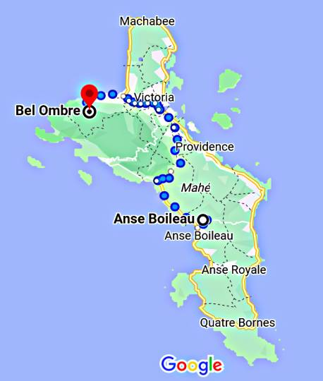

# OSM Haritaları, PBF Dosyaları, En Kısa Yol, Djikstra  

Eğer yollar ağını içeren OSM haritasını kendimiz işleyip çıktı
dosyalarını rahat okunabilir düz CSV formatında tutmak istersek bu
mümkündür. Sonuçta OSM dosyaları [1] sitesinde bedava paylaşılıyor, ve
bahsedilen işlemi yapabilecek bir kod Rust [5] ile yazılmış
`osm4routing` kodudur. Amacımız iki nokta arasında bir kısa yol
algoritması yazmak olacak.

`osm4routing` kurmak için

```
cargo install osm4routing
```

Örnek olarak Şeysel (Seychelles) adalarına bakalım, ufak bir dosya
olduğu için örnekleri göstermek işletmek hızlı olur. Haritası Afrika
dizini altında, oradaki osm.pbf dosyası indirilir.  `$HOME/Downloads`
altında olduğunu farzedelim,

```
osm4routing $HOME/Downloads/seychelles-latest.osm.pbf
```

Program oldukça hızlı işler, bitince iki tane dosya, `edges.csv` ve
`nodes.csv` üretilmiş olmalı. İçeriklerine bakalım (ilk birkaç satır),

```python
! head -10 nodes.csv
```

```text
id,lon,lat
5766693114,55.2028362,-3.7270749
2737905006,55.694301599999996,-4.3259219
2710742974,55.4645328,-4.6004604
6808483052,55.462411599999996,-4.632185799999999
8979383052,55.518222699999995,-4.716342399999999
9144642426,55.4628521,-4.5883534
6407473046,55.4584707,-4.6071178999999995
8979071049,55.4408661,-4.624990299999999
3789265673,55.401677899999996,-4.6558733
```

```python
! head -3 edges.csv
```

```text
id,osm_id,source,target,length,foot,car_forward,car_backward,bike_forward,bike_backward,train,wkt
26771422-0,26771422,293645412,1159221829,113.98597980501721,Allowed,Secondary,Secondary,Allowed,Allowed,Forbidden,"LINESTRING(55.7601390 -4.3462977, 55.7602171 -4.3463866, 55.7602852 -4.3464620, 55.7603906 -4.3466138, 55.7604949 -4.3467581, 55.7605343 -4.3468123, 55.7605801 -4.3468621, 55.7606248 -4.3468929, 55.7606791 -4.3469152, 55.7607355 -4.3469237, 55.7608292 -4.3469269, 55.7608735 -4.3469255)"
26771422-1,26771422,1159221829,2330448860,71.52456370873085,Allowed,Secondary,Secondary,Allowed,Allowed,Forbidden,"LINESTRING(55.7608735 -4.3469255, 55.7613600 -4.3469271, 55.7614284 -4.3469290, 55.7614753 -4.3469333, 55.7615168 -4.3469417)"
```

Çizit (graph) teorisi açısından bakarsak üstte veri bir ağ / çizit
yapısı var, ilk dosyadakiler düğümler (nodes) ikincidekiler ise
kenarlar (edges). Düğümler yeryüzünde bazı noktalar, bir durak
olabilir, yol ağzı olabilir, ya da yol üzerindeki bir nokta. Her
düğümün bir `id` kimliği var, ve bu `id` ile o noktanın kordinat
değerlerine enlem boylam üzerinden erişebiliyoruz. Kenarlar bir düğümü
bir diğerine bağlayan yollar gibi görülebilir, bağlantı parçaları. Her
kenarın da bir kimliği var, ve ayrıca çıkış noktası `source` bitiş
noktası `target` bilgisini taşıyor. Bu iki kolon tabii ki düğüm
verisindeki `id` değerlerine tekabül ediyor, kenar bir düğümden çıkıp
diğerinde bitiyor.

Kenarların, yani yolların taşıdığı bazı ek önemli bilgiler var; mesela
bir yolun yürümeye elverişli olup olmadığı (`foot` kolonunda `Allowed`
değeri var ise), aynı şekilde araba, bisiklet kullanımına uygun olup
olmadığı yol bilgisi içinde mevcut. 

### Veri Yapısı, Tasarımı

Kısa yol algoritması işletmek için bize neler lazım? Yol tarifi isterken bir
başlangıç ve bitiş noktası enlem/boylam olarak verilir, bu iki noktanın
OSM düğüm noktalarına eşlenmesi gerekiyor, aynen [3] yazısında olduğu gibi
önce verilen kordinatlara en yakın OSM noktası bulunur, ve oradan sonra
düğüm, kenar, sonraki düğüm vs diye yol arama algoritması işleyebilir.

Fakat "en yakın nokta bulmak" performans açısından o kadar kolay bir
iş değil; örnek olarak burada ufak veri kullandık ama mesela TR
boyutunda bir haritada milyonlarca nokta ve onların arasında bağlantı
olacaktır. Milyonlarca satır içinden en yakın olanını bulmak eğer tüm
verilere teker teker bakılıyorsa uzun sürebilir. Bize bir tür
indeksleme (indexing) mekanizması gerekiyor.

İlk akla gelebilecek çözümler QuadTree, KDTree gibi seçenekler, fakat
bu çözümlerin çoğu bellek bazlı işler; etrafta bulunabilecek mevcut
kodlar milyonlarca veri noktasını alıp bir indislenmiş ağaç yapısı
oluşturabilir ama bunu veri yapısını hafıza tuturak yapar. İdeal
olarak nokta bulmak, kısa yol hesaplama algoritmasının ufak bilgisayar
üzerinde işleyebilmesi tercihimiz (bir ağaç yapısını hafızaya diskten
geri aldığımızda gigabayt seviyesinde olmamalı). Eğer ağır işlem
bedeli ödenecekse onun baştan, veri hazırlığı evresinde ödenmesi daha
iyi olacaktır.

Şöyle bir çözüm olabilir, harita üzerinde bir izgara oluştururum, 4 x
4, ya da 3 x 4 boyutunda olabilir, bu bana 12 izgara noktası verir,
sonra veriyi baştan sonra işlerken elimdeki her düğüm için onun en
yakın olduğu iki izgara noktasını bulurum ve yeni bir tabanda
kaydederim. Bu yeni dosyayı bir SQL tabanına yazarım, her satırda
yakın izgara noktaları mesela kolonlar `ç1` ve `c2` olabilir ve yeni
tabloyu bu kolonlar bazlı indekslerim, böylece `c1` ve `c2` bazlı
filtreleme işlemi hızlanır.

Izgara noktalarını bir pickle içinde kaydederim, böylece sonradan
isteyen yükleyebilir, ve artık herhangi bir nokta için aynı izgara
yakınlığı işletilir, mesela `c1=3`, `c2=5` bulundu diyelim ve SQL
tabanından ya 3 ya da 5 değerine sahip olan düğümleri `SELECT` ile
alırım, ve bu noktalar üzerinde detaylı yakınlık hesabı
işletirim. Böylece gerçek mesafe hesabı yapacağım veri miktarını
azaltmış oldum.  Bu mantıklı olmalı, haritayı bölgelere ayırmış oldum,
eğer elimde Karadeniz bölgesinden bir nokta varsa Akdeniz bölgesindeki
noktalara bakmaya ne gerek var?

Burada seçilen teknolojilerin özelliklerine, kuvvetlerine dikkat;
ızgara noktası bazlı filtreleme için SQL kullandık çünkü tam sayı
bazlı filtreleme işlerini hem disk bazlı (herşeyi hafızaya almadan) ve
çok hızlı yapar. Izgara ataması yaparken `nodes.csv` satır satır
işlenecek, ve o sırada satır satır SQL tabanına yazım yapılacak, bu da
hızlı, mesafe hesabı yapılıyor ama sadece 12 ızgara noktası için
yapıldığı için çok performans kaybı yok.

```python
import csv, numpy as np, re, os, shutil, pickle, sqlite3
from pygeodesy.sphericalNvector import LatLon
from scipy.spatial.distance import cdist
import pandas as pd

dbfile = "nodes.db"

def grid_assign_centers(corner1,corner2):
    
    p1 = LatLon(corner1[0],corner1[1])
    p2 = LatLon(corner2[0],corner2[1])

    lowlat = np.min([p1.lat,p2.lat])
    lowlon = np.min([p1.lon,p2.lon])
    hilat = np.max([p1.lat,p2.lat])
    hilon = np.max([p1.lon,p2.lon])

    x = np.linspace(lowlon,hilon,3)
    y = np.linspace(lowlat,hilat,4)

    xx,yy = np.meshgrid(x,y)
    mids = []
    for x,y in zip(xx.flatten(), yy.flatten()):
        mids.append([x,y])       
    mids = np.array(mids)
        
    pickle.dump(mids, open('centers.pkl', 'wb'))        

    if os.path.exists(dbfile): os.remove(dbfile)    
    db = sqlite3.connect(dbfile)
    cursor = db.cursor()
    cursor.execute('''CREATE TABLE osm_nodes(id INTEGER PRIMARY KEY, 
                      lat NUMERIC, lon NUMERIC, c1 INTEGER, c2 INTEGER)
                      ''')
    db.commit()
    
    cursor = db.cursor()
    with open('nodes.csv') as csvfile:
        rd = csv.reader(csvfile,delimiter=',')
        headers = {k: v for v, k in enumerate(next(rd))}
        for i,row in enumerate(rd):        
            id,lat,lon = row[headers['id']],row[headers['lat']],row[headers['lon']]
            ds = cdist(mids,np.array([[lon,lat]]))
            res = list(np.argsort(ds,axis=0).T[0][:2])
            cursor.execute('''INSERT INTO osm_nodes(id, lat, lon, c1, c2)
                      VALUES(?,?,?,?,?)''', (id,lat[:8],lon[:8],int(res[0]),int(res[1])))            
            if i % 1000 == 0:
                print ('satir',i)
                db.commit()

    cursor = db.cursor()
    cmd = "CREATE INDEX index1 ON osm_nodes(c1)"
    cursor.execute(cmd)
    cmd = "CREATE INDEX index2 ON osm_nodes(c2)"
    cursor.execute(cmd)
    db.commit()

# iki tane kose noktasini haritadan elle sectik
grid_assign_centers((-4.807419070202981, 55.364345234773644),
                    (-4.549969190633921, 55.566362543604434))

```

```text
satir 0
satir 1000
satir 2000
satir 3000
satir 4000
satir 5000
satir 6000
```

Tablo `osm_nodes` yaratıldı. Dikkat, indeksler tüm satırlar eklendikten
*sonra* yaratıldı. Eğer tablo yaratıldığında indeksleri yaratmış olsak
bu `INSERT` işlemlerini yavaşlatırdı. 

Seçilen köşe ve hesaplanan izgara noktaları altta grafikleniyor,

 




[devam edecek]

Kaynaklar

[1] http://download.geofabrik.de/index.html

[2] ../../2016/11/yol-tarifi-harita-bilgisi-osrm-backend.html

[3] ../../2023/04/yol-bolmak-osm-osmnx.html

[4] https://github.com/Tristramg/osm4routing2

[5] <a href="../../2023/01/rust.html">Rust</a>

[6] <a href="../../2023/05/python-sozluk-dictionary.html">Python Sözlük (Dictionary) Veri Yapısı</a>

[7] <a href="https://burakbayramli.github.io/dersblog/algs/algs_035_dijks/dijkstra_algoritmasi_ile_en_kisa_yol.html">Dijkstra Algoritması ile En Kısa Yol</a>

[8] <a href="https://www.ics.uci.edu/~eppstein/161/python/">University of California Bilgisayar Bilim Kodları</a>

