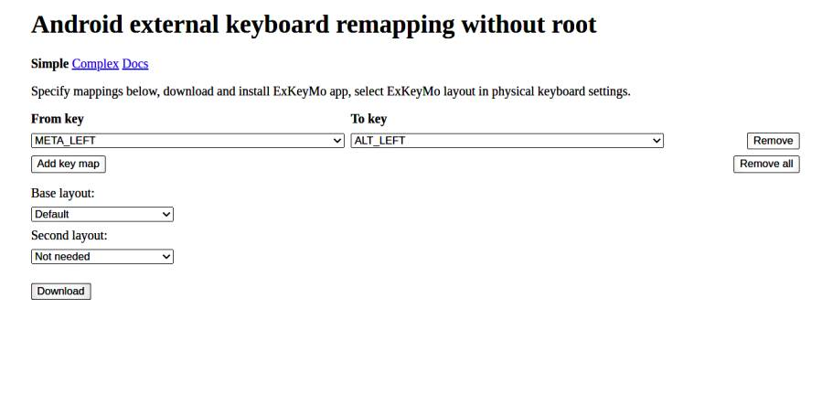
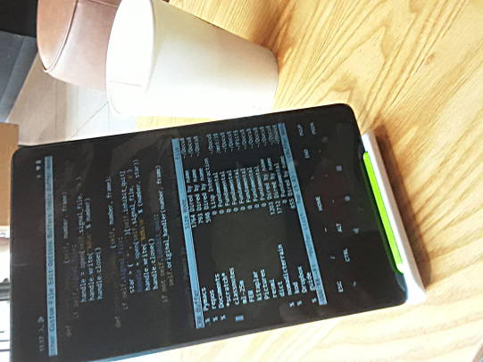

# Lenovo Tablet Üzerinde Termux

Android üzerinde tam tekmilli Unix olabilir mi? Olabilir. Termux ile
mümkün. Daha önce bir Samsung telefon üzerinde Termux nasıl kurulur
yazmıştık [1]. Şimdi aynı işlemi bir Lenovo tablet için
deneyelim. Amacımız numpy, scipy, emacs ve flask gibi programları,
paketleri işletebilmek olacak.

Termux'un Android üzerinde işlemediği hakkında bazı şikayetler var,
bunlar Android versiyon 12 için. Fakat yaygın kullanımdaki
versiyonların çoğunluğu 10 ve altında, bu sürümler için Termux problem
çıkartmamalı, problem varsa erişilemeyen dosya servisi problemi
olabilir, tekrar denemek problemi çözebilir, ya da gerektiği yerde
`LDFLAGS` kullanımı (altta), ve python paketleri sıfırdan derlemek
yerine mevcut derlenmiş programları kullanmak seçenek olabilir.

### Kuruluş

Google Play Store'daki Termux problem çıkartabilir. En iyisi [2]
adresinden apk dosyasını indirip kurmak. İndirilip ya dosyaya
tıklanır, ya da System | About Phone | Build number'a birkaç kere
tıklandıktan sonra geliştirici mod'una geçip Developer Options altında
USB Debugging hazır hale getirilir, ve Ubuntu dizüstünde

```
sudo apt install adb
```

ile Android'e USB kablosu üzerinden erişilebilen bir ortam kurmuş
oluruz ve

```
adb install com.termux_117.apk
```

ile apk kurulumu yapabilir, yani üstteki dizüstünde işletilecek ve
kurulum Android tablet üzerinde yapılacak.

Termux kurulduktan sonra Android üzerinde

```
termux-setup-storage
```

yapmak iyi olur. Bu `$HOME` altında bir `storage` dizini
oluşturuyor. Dizin içinde Android'in bildik `downloads` `dcim` gibi
dizinlerine sembolik bağlantılar var.

Dizüstünden direk USB kablosu ile dosya da gönderilebilir, mesela

```
adb push filanca.tar.gz /storage/emulated/0/Download/
```

Bazı durumlarda faydalı olabilir, bunu da paylaşalım.

Tablet üzerindeki Termux komut satırında ekran klavyesi ile komutlar
girilebilir. Bluetooth klavyesi olanlar onu da kullanabilir. Ekran
altındaki Ctrl, ESC gibi tuşların ekrandan basılmasını sağlayan kısmı
iptal etmek için Ses Açmak + q tuşları yeterli. Şimdi Termux'a
kurulabilen ek programlara gelelim.

```
pkg upgrade
```

yapmak iyidir, herşey güncellenir. Arada soru sorar, bunları ENTER ile
geçeriz.

Alttaki paketler üzerinde `pkg install`.

```
python3 git openssh build-essential python-numpy emacs libxml2 libxslt
cmake freetype binutils file libxapian recoll boost gettext
```

Bazen kurulum patlayabilir, birkaç deneme problemi çözer. Üsttekiler
tamamsa `matplotlib` üzerinde `pkg install` denenmeli. Eğer yardımcı
paketlerde problem çıkarsa bunları ayrı ayrı başına

```
LDFLAGS="-L/system/lib64" CFLAGS="-I/data/data/com.termux/files/usr/include" pip install
```

ekleyerek `pip` ile kurmayı deneyebiliriz.

Dikkat: Kurulum tüm sistem bazında yapılıyor, hala bir izole [4] ortam
yaratmadık.  Buradaki sebep ``python-numpy` kurulumunun sistem bazlı
olması, diğer baz paketler de onu temel alarak yapılırsa bazlı işler
daha rahatlaşıyor, bu durumda temel paketler sistem bazlı
oluyor. Fakat problem değil, bir kez temel paketler kurulunca, artık
izole ortamlar mevcut olan paketler için sistem bazlı olana referans
yapabilir, ek `pip install` paketleri hala ayrı izole ortamda
kalabilir. 

```
pip3 install virtualenv
```

Ve `env3` adlı ilk ortamımızı yaratalım,

```
virtualenv --system-site-packages -p /data/data/com.termux/files/usr/bin/python3 env3
```

Sistem referansı `--system-site-packages` ile yapıldı.

Artık `source env3/bin/activate` ile yeni ortama girilebilir.

Ek kurulumlar bu ortam icinde `pip` ile,

```
pip install Pillow bs4 flask folium geopy ipython 
```

### Tuş Değişimi

Control tuşu Trust Bluetooth klavyelerinde rahat erişilen yerde değil,
Vim, Emacs kullanıcıları bu tuşu çok kullanır, CAPS tuşunu CTRL
yapabiliriz, ek olarak benim tercihim SPACE yanındaki Command yazan
tuşu Left Alt yapmak. Bunun için Android seviyesinde değişiklik
lazım. Şu [3] uygulama ile web üzerinde isteğe göre üretilen bir .apk
bu değişimi yapabiliyor. APK üretimi arka planda derleme ile
üretiliyor muhakkak, bu .apk indirilip kurulunca (Android uyarılarını
dikkate almayız) tuş değişimi olur. Web sitesinde tanımları liste
bazlı seçebiliriz, bahsettiğim Command (ki sisteme Meta Left olarak
gözüküyor) Alt Left bağlantısı yapmak alttaki şekilde.



Bu tanım daha sonra yaratılacak .apk içine koyulacak, Download tuşuna
tıklayınca apk alınır. Uygulamaya güvenmeyenler aynı sayfadaki
bağlantıdan kaynak koduna gidip Android kodunu derleyebilir.

Apk kurulduktan sonra tabii klavye seçiminin yeni programı görmesi
lazım; Android'de System | Languages & Input | Physical keyboard (mesela bir
bluetooth klavye) seçtikten sonra Physical Keyboard altında bir layout seçimi
var, buraya girip listeden "ExKeyMo Layout" seçmek lazım.

### Emacs

Emacs başlatmak için `$HOME` altında `.emacs` yazılır, tabii ev dizini
Termux'ta farklı bir yerde, `/data/data/com.termux/files/home` altında,
fakat `cd` hala direk buraya gider. Benim standart `.emacs` dosyam

```
(load-file "/falan/filan/emacs-ayarlar-1.el")
```

gibi tek bir satırdan ibarettir. Tüm ayarlar `load-file` ile yüklenen
ikinci `.el` dosyasındadır.

Nihayet Termux ekranından `emacs -nw` ile favori editörümüzü başlatıyoruz,



Bazı `.bashrc` ayarları

```
alias env3='source $HOME/Documents/env3/bin/activate'
alias emnw='source $HOME/Documents/env3/bin/activate; emacs -nw '
alias gp='git push origin master'
alias ga="git add . "
```

Görüldüğü gibi `$HOME/Documents/env3` içinde bir izole Python 3 ortamı
var, editör başlatmadan önce onu başlatıyoruz, böylece orada kurulmuş
tüm paketler editör içindeki komutlar tarafından görülebiliyor.

Kaynaklar

[1] <a href="../../2018/09/android-uzerinde-linux-termux.html">Android Uzerinde Linux - Termux, Samsung J6</a>

[2] <a href="https://f-droid.org/en/packages/com.termux/">F-Droid Termux</a>

[3] <a href="https://exkeymo.herokuapp.com/">exkeymo</a>

[4] <a href="../../2018/08/virtualenv-python-izole-sanal-calsma.html">virtualenv, Python İzole, Sanal Çalışma Alanı (Python Virtual Environment)</a>

