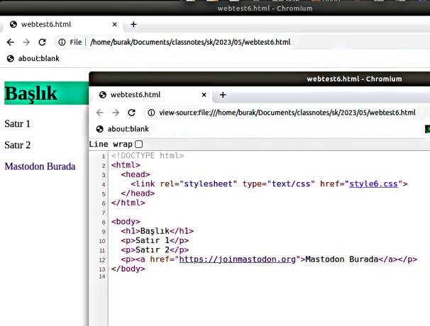
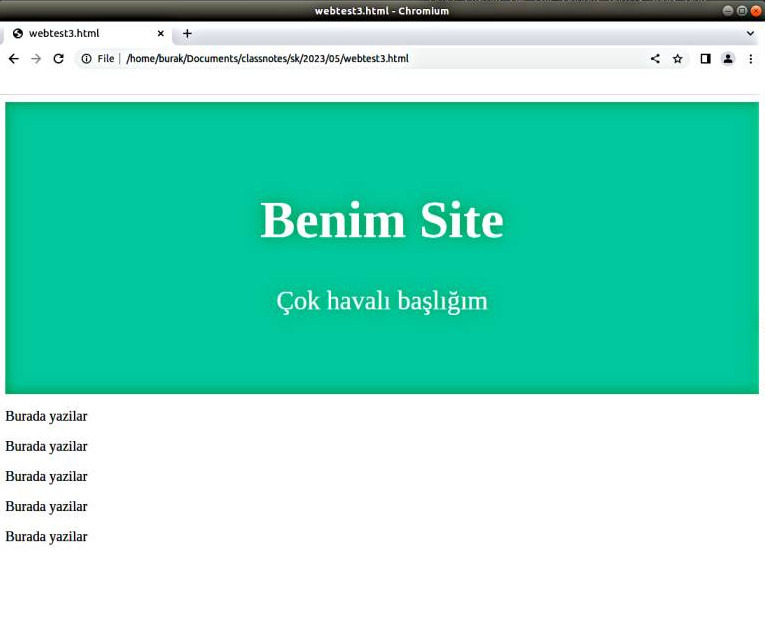

# Web Sayfaları, HTML ve CSS

Görsel HTML sayfalarının arkasında aslında pür metin bazlı bir komut
serisi var. Bu komutları düz dosyaya (text) yazabilen herkes bir
görsel Web programcısı olabilir. Mevcut sayfalarda bu kodları
görebiliriz, mesela Chrome, Firefox gibi tarayıcılarda Ctrl+U
tuşlarına basınca View Source isletilir ve HTML kaynağı burada
görülebilir. Bu blog'un ana sayfasının HTML kodları şöyle,

[Link](web1.jpg)

Sıfırdan bir HTML yaratalım;

```
<h1>Merhaba Dünya</h1>
<p>Burada bazı yazılar</p>
<p>Satır 2</p>
```

Windows üzerinde Notepad var, üsttekileri oraya yazıp `index.html`
diye bu dosyayı kaydedebiliriz ve o dosyaya tıklayınca otomatik olarak
çıktı tarayıcıyı başlatır.

Mac üzerinde TextEdit mevcut, File > New seçilir, sonra Format > Make
Plain Text. Üstteki HTML kodu buraya girilir, şimdi File > Save seçilir,
sonu .html ile biten bir dosya ismi seçilir, (mesela index.html), ve Save
tıklanır. Eğer hangi sonek (extension) kullanılacağı soruluyorsa to
“Use .html.” seçilir.

Görüntü şöyle olacak

[Link](webtest1.html)

HTML'de görüntü çıktısı etiketler ile kontrol edilir. Her etiketin bir
başlangıcı ve bitişi var, aradaki metin bu etiketin yarattığı görsel
ortamı yansıtır. Büyük harfli başlık için `<h1>` ile başlarız `</h1>`
ile bitiririz, ve aradaki tüm metin büyük harflerle gösterilir.

Benzer şekilde sırasıyla gittike daha küçük boyutlarda `<h2>`, `<h3>`
etiketleri de var.

Paragraflar `<p>`, `</p>` arasına yazılır. 

Tıklanabilir bağlantılar `<a href="">... </a>` arasında, tıklama
sonrası atlanacak adres `href=""` içinde ve bağlantının kullanıcıya
gösterdiği metin `<a href="...">` ve </a> arasına konulur.

```
<h1>Başlık</h1>
<p>Satır 1</p>
<p>Satır 2</p>
<p><a href="https://joinmastodon.org">Mastodon Burada</a></p>
```

[Link](webtest2.html)

Stiller

Web standartının (HTML, CSS bunların parçası) güzel bir tarafı
"içeriği stilden ayırma" özellikleri. Stil bir etikete uygulanan ek
komutlar olabilir, bu komutlar `style=".."` içine gider, mesela
başlığın arka plan rengini değiştirmek istiyorsam bunu `style="background: #1abc9c;"`
olarak `<h1>` etiketine ekleyebilirim. Stil pek çok özelliği kontrol edebilir,
mesela üstteki tıklanabilir bağlantıda üzerinde durunca alt çizgi gösterilmesin
istiyorsam bunu da `style="text-decoration:none;"` ile etikete söyleyebilirim.

```
<h1 style="background: #1abc9c;">Başlık</h1>
<p>Satır 1</p>
<p>Satır 2</p>
<p><a style="text-decoration:none;" href="https://joinmastodon.org">Mastodon Burada</a></p>
```

[Link](webtest4.html)

Tüm stiller ayrılıp HTML içinde ayrı bir bölüme de konabilir. Bu noktada bir HTML
sayfasının nihai formatını göstermek gerekli, bir `<head>..</head>` bölümü var,
bir de `<body>..</body>` bölümu var, bizim şimdiye kadar gördüklerimiz `<body>`
altına gidecek komutlardı. Stil komutları `<head>` altında ayrı bir `<style>`
etiketi altına konuyor. O zaman üstteki HTML şöyle değişir,

```
<!DOCTYPE html>
<html>
  <head>
    <style>
      h1 { background: #1abc9c; }
      a { text-decoration:none; }
    </style>
  </head>
</html>

<body>
  <h1>Başlık</h1>
  <p>Satır 1</p>
  <p>Satır 2</p>
  <p><a href="https://joinmastodon.org">Mastodon Burada</a></p>
</body>
```

[Link](webtest5.html)


Stil kodlarını bir CSS stil dosyası (stylesheet) olarak ayrı bir dosyaya da
yazabilirdik, bu durumda `<head>` içinde o dosyanin yüklenmesini söylemek
yeterli, stili `style6.css` içine yazalım,

```
<!DOCTYPE html>
<html>
  <head>
    <link rel="stylesheet" type="text/css" href="style6.css">
  </head>
</html>
<body>
  ...
</body>
```

[Link](webtest6.html)

Tabii her noktada üstteki çıktıları tarayıcıda gösterirken Ctrl+U ile
o sayfaya tekabül eden kodları görebiliriz,



Stil Blokları

Üstte gördüğümüz örnekte stili `h1` ya da `a` gibi tüm etiket tiplerine
uyguladık. Fakat `a`, `p` komutları HTML içinde çok yaygın uygulanan
etiketlerdir, eğer bazı `p` blokları için bir stil diğerleri için
farklı bir stil uygulamak istesek ne yapacağız?

Burada CSS sözdizimi bize bazı seçenekler sunuyor. Tekil kimlik `id`
bazlı, ya da bizim tanımladığımız bir sınıf `class` bazlı stil
uygulayabiliriz. İbare `id` özgün bir etiketi hedeflemek için
kullanılabilir, `class` tanımı ise birden fazla etikete
uygulanabilecek stiller için uygundur.  CSS içinde bu blokların tanımı
mesela bir bir `c1` için `.c1 { ... }` kimlik için ise mesela `i1`
diyelim `#i1 { .. }` ile yapılır.

Alttaki örnekte farklı `p` blokları için sınıf ve kimlik bazlı stil
uygulamasını görüyoruz. İlk iki paragrafı aynı sınıfa dahil ettik,
üçüncü ve dördüncü paragraflar ise ayrı kimliklere sahip, onları
CSS içinde teker teker hedeflemek gerekti.

```
<!DOCTYPE html>
<html>
  <head>
    <style>
      h1 { background: #1abc9c; }
      a { text-decoration:none; }
      .p_stil_a { background: lightyellow; }
      #p_stil_3 { background: lightblue; }
      #p_stil_4 { background: lightgray; }
    </style>
  </head>
</html>

<body>
  <h1>Başlık</h1>
  <p class="p_stil_a">Satır 1</p>
  <p class="p_stil_a">Satır 2</p>
  <p id="p_stil_3">Satır 3</p>
  <p id="p_stil_4">Satır 4</p>
  <p><a href="https://joinmastodon.org">Mastodon Burada</a></p>
</body>
```

[Link](webtest7.html)

`DIV` Blok Tanımı

Eğer bazı etiketlere bulundukları yere göre, hangi blok içinde
olduklarına bakarak özellikler atamak istersek `<div>` komutunu
kullanabiliriz, bu komutun görsel bir özelliği yoktur, sadece gruplamak
için kullanılır.

```
<!DOCTYPE html>
<html>
  <head>
    <style>
      h1 { background: #1abc9c; }
      a { text-decoration:none; }
      #d_1 { background: lightblue; }
      #d_2 { background: lightgray; }
    </style>
  </head>
</html>

<body>
  <h1>Başlık</h1>
  <div id="d_1">
    <p>Satır 1</p>
    <p>Satır 2</p>
    <a href="https://www.kernel.org/category/releases.html">Bağlantı</a>
  </div>
  <div id="d_2">
    <p>Satır 3</p>
    <p>Satır 4</p>
  </div>
  <p><a href="https://joinmastodon.org">Mastodon Burada</a></p>
</body>
```

[Link](webtest8.html)

Şimdi tüm üsttekileri bir araya koyalım, standart bir site görüntüsü
yaratmaya uğraşalım, en üstte geniş bir alanda site ismi, altında bir
açıklama, ve sonraki bölümde düz yazılar olsun.

Başlığı yaratmak için dikkat edersek HTML içinde ortalama, boşluk
bırakma yapmadık, tüm bu görüntüsel işler CSS içinde yapıldı. "Benim
Site" başlığı gayet basit `<h1>Benim Site</h1>` olarak gösterildi;
fakat onun etrafında `padding` ile 80 piksellik ekstra yer açtık,
yazıyı `text-align` ile ortaladık ve arka plan rengini `background`
ile tanımladık.

```
<!DOCTYPE html>
<html>
  <head>
    <style>
      .header {
      padding: 60px;
      text-align: center;
      background: #1abc9c;
      color: white;
      font-size: 30px;
      }
    </style>
  </head>
</html>

<body>
  <div class="header">
    <h1>Benim Site</h1>
    <p>Çok havalı başlığım</p>
  </div>
  <div id="main">
    <p>
      Burada yazilar
    </p>
    <p>
      Burada yazilar
    </p>
    <p>
      Burada yazilar
    </p>
    <p>
      Burada yazilar
    </p>
    <p>
      Burada yazilar
    </p>
  </div>
</body>
```

[Link](webtest3.html)



