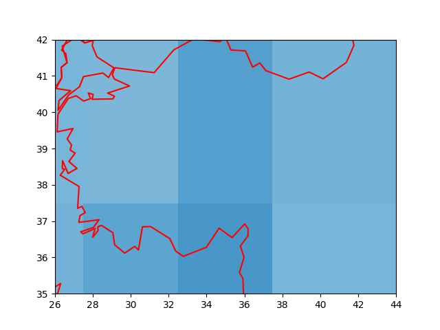
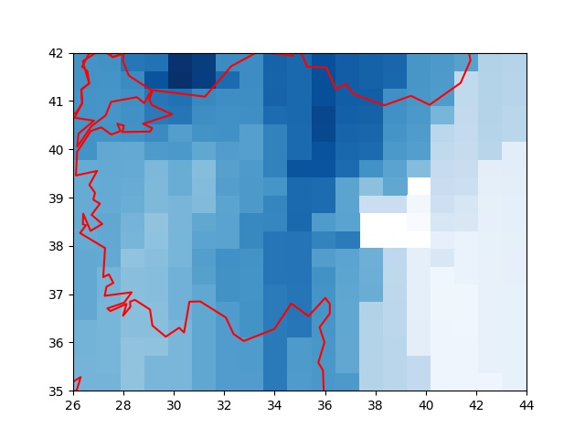
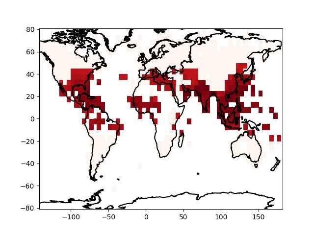

# İklim, Nem Verileri

Havanın nemlilik oranı ay bazlı tarihsel olarak [1] ya da anlık olarak [2]
bağlantısındaki metotlarla alınabilir.

Önce tarihsel verilere bakalım. [1]'den indirilebilecek bazı veriler
`HadISDH.landq` ile ya da `.landRH` ile baslayan dosyalar, bunlar
sırasıyla bir kg ıslak hava içinde ne kadar g bazında buhar olduğunu
gosteren g/kg birimindeki spesifik nemlilik `q`, ya da birim hacimdeki
buharın o sıcaklıkta tutulabilecek maksimum buhara olan yüzde olarak
oranını gosteren izafi nemlilik `rh`.

Veri indirilip `util.py` icindeki `hadisdh_process` ile
işlenebilir. Okunan dosya formatı biraz garip, tarihler ay olarak bir
blok üzerine düz tarih olarak yazılmış, ve dosyanın en sonunda her
bloğun kolonlarının ve satırlarının tekabül ettiği enlem, boylam
ızgara noktaları verilmiş. Biz Pandas gibi ürünlerle çalışmaya alışık
olduğumuz için her satırda gerekli bilgiyi içeren normalize edilmiş
verilerle iş yapmaya daha alışkınız, bizim ürettiğimiz çıktının
formatında sene/ay bilgisi ayrı kolonlarda, ve her satırda veriliyor,
tarih başlık değil ve en sondaki iki satır atlanıyor.  Böylece sene/ay
için filtreleme yapılınca gerekli veri bloğu alınır, dünyanın belli
noktalarını temsil eden bu blok 72 x 36 boyutlu bir matris
olacaktır. O matristeki hücrelerin hangi enlem/boylamlara tekabül
ettiğini kod içine sabit değerler olarak gömebiliriz, veriye dahil
etmeye gerek yok. Enlem değerleri -/+87.5 arasında eşit aralığa
bölünmüş 36 satırda, boylam değerleri ise -+177.5 arasında 72 aralığa
bölünmüş kolonlarda olacak.

Şimdi işlenmiş yeni verideki bir aya bakalım,

```python
import util 
year = 2019; month = 8
df = util.get_pd().read_csv('/tmp/q.csv',sep=';',header=None)
df = df[(df[0] == year) & (df[1] == month)]
df = df.iloc[:,2:]
x,y = np.meshgrid(np.linspace(-177.50,177.50,72),np.linspace(-87.50,87.50,36))
util.get_sm().plot_continents(0, 20, zoom=18, incolor='green', outcolor='white', fill=False)
plt.pcolormesh(x,y,df,cmap='Blues')
plt.savefig('iklim01.jpg',quality=40)
```


Fakat eldeki verininin pek detaylı olmadığını biliyoruz çünkü 72 x 36 boyutlu
bir ızgara pek çok alanı atlamış olacaktır. Mesela TR üzerinde odaklanırsak,

```python
year,month = 2019,8
df = util.get_pd().read_csv('/tmp/q.csv',sep=';',header=None)
df = df[(df[0] == year) & (df[1] == month)]
x,y = np.meshgrid(np.linspace(-177.50,177.50,72),np.linspace(-87.50,87.50,36))
df = df.iloc[:,2:]
df = np.array(df).flatten()
xx = x.flatten()[np.isnan(df)==False]
yy = y.flatten()[np.isnan(df)==False]
zz = df[np.isnan(df)==False]

q = util.get_qti()(xx,yy,zz)
interp = np.vectorize(q.interpolate,otypes=[np.float64])
zi = interp(x, y)

util.get_sm().plot_continents(40, 35, zoom=1, incolor='red', outcolor='white', fill=False)
plt.xlim(26,44)
plt.ylim(35,42)
plt.pcolormesh(y,x,zi,cmap='Blues')
plt.savefig('iklim02.jpg',quality=40)
```



gibi bir sonuç alıyoruz.

Günlük Daha Detaylı Veri

O günün verisini kullanarak daha detaylı nemlilik verisini
OpenWeatherMap ile alabiliriz [2]. Gerçi OWM'in tarihi veri servisi de
var fakat bu servis paralı, belli kota altındaki anlık veri alımı
bedava, bu yazı için onu kullanalım. Onları önceden rasgele seçilmiş
belli noktalar için alacağız, `util.coords` içinde. Bugünün verisini
alalım, erişim için OWM anahtarının alınmış olduğunu farzediyoruz,
bizimki `$HOME` altında `.nomterr.conf` adlı bir JSON dosyasında,
`weatherapi` anahtarına tekabül ediyor,

```python
base_url = 'http://api.openweathermap.org/data/2.5/weather?'

params = json.loads(open(os.environ['HOME'] + "/.nomterr.conf").read())

n = datetime.datetime.now()
ns = n.strftime("%Y-%m-%d")
hums = []
for i in range(len(coords)):
    print (i)
    payload = {'units': 'metric', 'lat': str(coords[i][0]), 'lon': str(coords[i][1]),'appid': params['weatherapi'] }
    r = requests.get(base_url, params=payload) 
    res = [json.loads(x.decode()) for x in r.iter_lines()]
    hums.append(str(res[0]['main']['humidity']))

hline = ns + "," + ",".join(hums) 
fout = open("trhumid.csv","a")
fout.write(hline)
fout.write("\n")
fout.close()
```

Üstteki çağrılar önceden seçilmiş noktalar için o günün verilerini
alıp yeni bir satır olarak çıktı CSV dosyası `trall.csv` ya ekleyecektir.
Grafiklersek,

```python
util.get_sm().plot_continents(40, 35, zoom=1, incolor='red', outcolor='white', fill=False)

df = util.get_pd().read_csv('trall.csv',header=None)
df = df.tail(1)
cs = np.array(util.coords)
x = cs[:,0]
y = cs[:,1]
z = np.array(df[list(range(1,28))])[0]

xi,yi = np.meshgrid(np.linspace(35,42,20),np.linspace(26,44,20))

q = util.get_qti()(x,y,z)
interp = np.vectorize(q.interpolate,otypes=[np.float64])
zi = interp(xi, yi)
plt.xlim(26,44)
plt.ylim(35,42)
plt.pcolormesh(yi,xi,zi,cmap='Blues')
plt.savefig('iklim04.jpg')
```



Aradeğerleme için [3]'te anlatılan bir tekniği kullandık. Aradeğerleme
gerekiyor çünkü veri için rasgele noktalar seçtik, fakat grafikleme
için daha detaylı bir ızgara bekleyen `pcolormesh` çağrısı gerekiyor.

Grafikte Kütahya, Denizli, Uşak etrafında az nemli bir bölge
görülüyor, Karadenizde yüksek nemli bazı bölgeler var, doğuda ise nem
daha az.

Islak Termometre Sıcaklığı (Wet-Bulb Temperature)

Çok yüksek derecedeki bazı sıcaklıkların mesela çöl ortamında bile
nispeten dayanilabilir olduğunu biliyoruz, daha düşük sıcaklık farklı
yerlerde dayanilmaz olabiliyor. Sebep nedir? Çöl ortamındaki kuru
iklim (nem azlığı) burada rol oynamakta. Diğer yerlerde daha düşük
sıcaklıkta yüksek nem etkili oluyor, insan bedeni yüksek sıcakta ter
atarak serinler, fakat yüksek nemli ortamda bu atış işlemez olur
(dışarıdaki hava içinde çok fazla sıvı var) ve bu sıcaklığın etkisini
arttırır.

Sıcaklık ve nem ölçülerini birleştirip tek bir ölçüt haline getiren
bir hesap ıslak termometre sıcaklığı. Bu bize irdeleme açısından tek
bir ölçüt veriyor, bilimsel makalelere göre 35 derece (Çelcius) hatta
son bazı araştırmalara göre 31 C bile ölümcül olabiliyor.

Hesabı yapmak için `MetPy` paketini kullanabiliriz,

```python
from metpy.calc import dewpoint_from_relative_humidity, wet_bulb_temperature
from metpy.units import units

dew = dewpoint_from_relative_humidity(46 * units.degC, 50 * units.percent)
wet_bulb_temperature(1000 * units.hPa, 46 * units.degC, dew)
```

```text
Out[1]: 35.12274652837743 <Unit('degree_Celsius')>
```

Yani izafi nem 50% (normal) 1000 hPa basıncında 46 derece ölümcül ıslak termometre
sıcaklığı 35 C'ye geliyor.

Dunya bazinda bu olcutu grafiklesek nasil cikardi acaba? Dosya listesi
[1]'den ASCII bazli olan `HadISDH.landRH` ve `HadISDH.landT`
dosyalarini alabiliriz. Bu dosyalar uzerinde `hadisdh_process(..,..)` isletiriz,

```python
year = 2019; month = 7

T = util.get_pd().read_csv('T.csv',sep=';',header=None)
T = T[(T[0] == year) & (T[1] == month)]
T = T.iloc[:,2:]
T = np.array(T)

Rh = util.get_pd().read_csv('Rh.csv',sep=';',header=None)
Rh = Rh[(Rh[0] == year) & (Rh[1] == month)]
Rh = Rh.iloc[:,2:]
Rh = np.array(Rh)

wet = [wet_bulb_temperature(P * units.hPa, t * units.degC, dewpoint_from_relative_humidity(t * units.degC, h * units.percent)).magnitude for t, h in np.nditer([T,Rh],order='C') ]
wet = np.array(wet).reshape(Rh.shape,order='C')

wet[wet<19] = -10

x,y = np.meshgrid(np.linspace(-177.50,177.50,72),np.linspace(-87.50,87.50,36))
util.get_sm().plot_continents(0, 20, zoom=18, incolor='black', outcolor='white', fill=False)
plt.pcolormesh(x,y,wet,shading='auto',cmap='Reds')
```



Bu kodla sadece 19 derece üstündeki İTS gösteriliyor, şahsi
gözlemlerimiz 20 C üstünün rahatsız edici olması filtrelemeyi ona gore
yaptik. Sonuca bakınca Uzakdoğu'da, Akdeniz, Karadeniz etrafında bazi
bölgeler görülüyor.


Kaynaklar

[1] <a href="https://www.metoffice.gov.uk/hadobs/hadisdh/downloadLAND.html">MetOffice</a>

[2] <a href="../../2017/09/meteoroloji-verileri-ecmwf-noaa-openweathermap.html">OWM</a>

[3] <a href="../../2012/08/aradegerleme-interpolation.html">Aradeğerleme</a>

[4] <a href="https://www.metoffice.gov.uk/hadobs/hadisdh">Hadisdh Degerler Listesi</a>

[5] <a href="https://www.metoffice.gov.uk/hadobs/hadisdh/downloadEXTREMES.html">Hadisdh Ekstrem Degerler</a>

