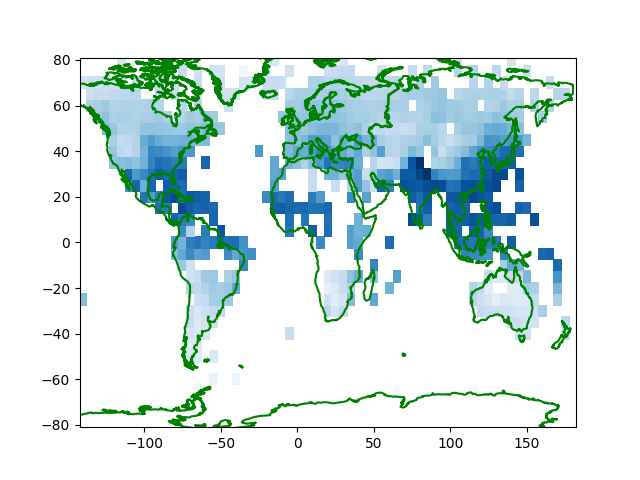
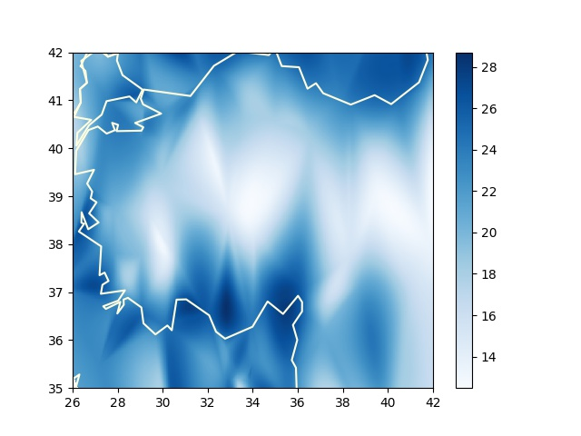

# İklim, Nem Verileri

Havanın nemlilik oranı ay bazlı tarihsel olarak [1] ya da anlık olarak [2]
bağlantısındaki metotlarla alınabilir.

Önce tarihsel verilere bakalım. [1]'den indirilebilecek bazı veriler
`HadISDH.landq` ile ya da `.landRH` ile baslayan dosyalar, bunlar
sırasıyla bir kg ıslak hava içinde ne kadar g bazında buhar olduğunu
gosteren g/kg birimindeki spesifik nemlilik `q`, ya da birim hacimdeki
buharın o sıcaklıkta tutulabilecek maksimum buhara olan yüzde olarak
oranını gosteren izafi nemlilik `rh`. Veri indirilip alttaki icindeki
`hadisdh_process` ile işlenebilir.

```python
def hadisdh_process(infile,outfile):
    fin = open(fin)
    rd = csv.reader(fin)
    fout = open(outfile,"w")
    for i in range(47*12):
        date_line = next(rd)
        date_line = date_line[0].split(" ")
        dt = date_line[1] + "-" + date_line[0]
        dt = pd.to_datetime(dt)
        for j in range(36):
            print ('j',j)
            line = next(rd)
            line = line[0]
            line = re.split('\s*',line)
            line = line[1:]
            line = [str(dt.year), str(dt.month)] + line
            res = ";".join(line)
            res = res.replace("-9999.99","")
            fout.write(res)
            fout.write("\n")
            fout.flush()
        fout.flush()
```

Okunan dosya formatı biraz garip, tarihler ay olarak bir blok üzerine
düz tarih olarak yazılmış, ve dosyanın en sonunda her bloğun
kolonlarının ve satırlarının tekabül ettiği enlem, boylam ızgara
noktaları verilmiş. Biz Pandas gibi ürünlerle çalışmaya alışık
olduğumuz için her satırda gerekli bilgiyi içeren normalize edilmiş
verilerle iş yapmaya daha alışkınız, bizim ürettiğimiz çıktının
formatında sene/ay bilgisi ayrı kolonlarda, ve her satırda veriliyor,
tarih başlık değil ve en sondaki iki satır atlanıyor.  Böylece sene/ay
için filtreleme yapılınca gerekli veri bloğu alınır, dünyanın belli
noktalarını temsil eden bu blok 72 x 36 boyutlu bir matris
olacaktır. O matristeki hücrelerin hangi enlem/boylamlara tekabül
ettiğini kod içine sabit değerler olarak gömebiliriz, veriye dahil
etmeye gerek yok. Enlem değerleri -/+87.5 arasında eşit aralığa
bölünmüş 36 satırda, boylam değerleri ise -+177.5 arasında 72 aralığa
bölünmüş kolonlarda olacak.

Şimdi işlenmiş yeni verideki bir aya bakalım,

```python
import util 
year = 2019; month = 8
df = util.get_pd().read_csv('/tmp/q.csv',sep=';',header=None)
df = df[(df[0] == year) & (df[1] == month)]
df = df.iloc[:,2:]
x,y = np.meshgrid(np.linspace(-177.50,177.50,72),np.linspace(-87.50,87.50,36))
util.get_sm().plot_continents(0, 20, zoom=18, incolor='green', outcolor='white', fill=False)
plt.pcolormesh(x,y,df,cmap='Blues')
plt.savefig('iklim01.jpg',quality=40)
```



Fakat eldeki verininin pek detaylı olmadığını biliyoruz çünkü 72 x 36 boyutlu
bir ızgara pek çok alanı atlamış olacaktır. Mesela TR üzerinde odaklanırsak,

```python
year,month = 2019,8
df = util.get_pd().read_csv('/tmp/q.csv',sep=';',header=None)
df = df[(df[0] == year) & (df[1] == month)]
x,y = np.meshgrid(np.linspace(-177.50,177.50,72),np.linspace(-87.50,87.50,36))
df = df.iloc[:,2:]
df = np.array(df).flatten()
xx = x.flatten()[np.isnan(df)==False]
yy = y.flatten()[np.isnan(df)==False]
zz = df[np.isnan(df)==False]

q = util.get_qti()(xx,yy,zz)
interp = np.vectorize(q.interpolate,otypes=[np.float64])
zi = interp(x, y)

util.get_sm().plot_continents(40, 35, zoom=1, incolor='red', outcolor='white', fill=False)
plt.xlim(26,44)
plt.ylim(35,42)
plt.pcolormesh(y,x,zi,cmap='Blues')
plt.savefig('iklim02.jpg',quality=40)
```


Islak Termometre Sıcaklığı (Wet-Bulb Temperature)

Çok yüksek derecedeki bazı sıcaklıkların mesela çöl ortamında bile
nispeten dayanilabilir olduğunu biliyoruz, daha düşük sıcaklık farklı
yerlerde dayanilmaz olabiliyor. Sebep nedir? Çöl ortamındaki kuru
iklim (nem azlığı) burada rol oynamakta. Diğer yerlerde daha düşük
sıcaklıkta yüksek nem etkili oluyor, insan bedeni yüksek sıcakta ter
atarak serinler, fakat yüksek nemli ortamda bu atış işlemez olur
(dışarıdaki hava içinde çok fazla sıvı var) ve bu sıcaklığın etkisini
arttırır.

Sıcaklık ve nemi birleştirip tek bir ölçüt haline getiren bir hesap
ıslak termometre sıcaklığı. Bu bize irdeleme açısından tek bir sayı
veriyor, bilimsel makalelere göre 35 derece (Celcius) hatta son bazı
araştırmalara göre 31 C bile ölümcül olabiliyor.

Hesabı yapmak için `MetPy` paketini kullanabiliriz,

```python
from metpy.calc import dewpoint_from_relative_humidity, wet_bulb_temperature
from metpy.units import units

dew = dewpoint_from_relative_humidity(46 * units.degC, 50 * units.percent)
wet_bulb_temperature(1000 * units.hPa, 46 * units.degC, dew)
```

```text
Out[1]: 35.12274652837743 <Unit('degree_Celsius')>
```

Yani izafi nem 50% (normal) 1000 hPa basıncında 46 derece ölümcül ıslak termometre
sıcaklığı 35 C'ye geliyor.

Alternatif bir [kod](wetbulb.py),

```python
import wetbulb

wetbulb.wet_bulb(46, 1000*100, 50.)
```

```text
Out[1]: 36.034835648928826
```

Dünya bazında bu ölçütü grafiklesek nasıl çıkardı acaba? Dosya listesi
[1]'den ASCII bazlı olan `HadISDH.landRH` ve `HadISDH.landT`
dosyalarını alabiliriz. Bu dosyalar üzerinde `hadisdh_process(..,..)`
işletiriz, sonuçlar `Rh.csv` ve `T.csv` üzerinde varsayalım,

```python
year = 2019; month = 7

T = util.get_pd().read_csv('T.csv',sep=';',header=None)
T = T[(T[0] == year) & (T[1] == month)]
T = T.iloc[:,2:]
T = np.array(T)

Rh = util.get_pd().read_csv('Rh.csv',sep=';',header=None)
Rh = Rh[(Rh[0] == year) & (Rh[1] == month)]
Rh = Rh.iloc[:,2:]
Rh = np.array(Rh)

wet = [wet_bulb_temperature(P * units.hPa, t * units.degC, dewpoint_from_relative_humidity(t * units.degC, h * units.percent)).magnitude for t, h in np.nditer([T,Rh],order='C') ]
wet = np.array(wet).reshape(Rh.shape,order='C')

wet[wet<19] = -10

x,y = np.meshgrid(np.linspace(-177.50,177.50,72),np.linspace(-87.50,87.50,36))
util.get_sm().plot_continents(0, 20, zoom=18, incolor='black', outcolor='white', fill=False)
plt.pcolormesh(x,y,wet,shading='auto',cmap='Reds')
```


Bu kodla sadece 19 derece üstündeki İTS gösterdik, şahsi gözlemlerimiz
20 C üstünün rahatsız edici olması filtreleme ona göre yapıldı. Sonuca
bakınca Uzakdoğu'da, Akdeniz, Karadeniz etrafında bazı tehlikeli
bölgeler görülüyor. Tayland, Singapur'a gidenler yüksek nemli günlerde
dışarıda durmanın zorluğunu farketmiştir. Not: Analiz 2019 yılı Temmuz
ayı için yapıldı, bu ay kuzey yarımküre için yaz sezonu, ekvator
altındaki sonuçlara bakarken bunu aklımızda tutalım.

### NOAA Verisi

[6] günlük NOAA verileri tarihi iklim üzerinde ve dünyanin herhangi
bir noktasının ıslak termometre sıcaklığı hesabı için kullanılabilir.
Herhangi bir sene için, 2022 diyelim, tüm istasyonların verisini alırız,
mesela `/tmp/data/2022`,

```python
from metpy.calc import dewpoint_from_relative_humidity, wet_bulb_temperature
from metpy.units import units
import pandas as pd, numpy as np, glob

fout = open("/tmp/data/wbt_max.csv","w")
for f in glob.glob("/tmp/data/2022/*.csv"):
    print (f)
    df = pd.read_csv(f,index_col='DATE')
    dfh = df.head(1)
    lat,lon = list(dfh.LATITUDE)[0],list(dfh.LONGITUDE)[0]
    df1 = df[(df.SLP < 9999.9) & (df.TEMP < 9999.9) & (df.DEWP < 9999.9) &
             (df.index > '2022-07-31') & (df.index < '2022-09-01')]
    if len(df1) == 0: continue
    res = df1.apply(lambda x: wet_bulb_temperature(x['SLP'] * units.hPa, x['TEMP']*units.degF, x['DEWP']*units.degF).to(units.degC).magnitude,axis=1)
    st = f.replace("2022/","").replace(".csv","")
    fout.write ("%s,%f,%f,%f" % (st,lat,lon,res.max()))
    fout.write("\n")
    fout.flush()
```

Üstteki kod 2022'deki Ağustos ayı için her istasyonun kaydetmiş olduğu
maksimum ıslak termometre sıcaklığını bir dosyaya yazıyor, işi bitince
tek bir dosya elde edilecek, bu dosyada her istasyonun kaydetmiş
olduğu ITS o istasyonun coğrafi yeri ile beraber paylaşılmış olacak.
Sonra bu dosyayı alıp herhangi bir noktaya en yakın olan istasyonları
toparlayıp renksel haritalama yapabiliriz, TR örneği,

```python
import numpy as np, glob, simplegeomap as sm, quads
import pandas as pd, os, matplotlib.pyplot as plt
from scipy.interpolate import NearestNDInterpolator

def cdist(p1,p2):    
    distances = np.linalg.norm(p1 - p2, axis=1)
    return distances

clat,clon,zoom = 39,34,2

df = pd.read_csv('/tmp/data/wbt_max.csv')

res = cdist (df[['lat','lon']],np.array([clat,clon]))
s = res.argsort()

sm.plot_continents(clat,clon,zoom=zoom,outcolor='white', fill=False)

stats = df.loc[s[:140]]

interp = NearestNDInterpolator(list(zip(stats.lon, stats.lat)), stats.wbt)

xi,yi = np.meshgrid(np.linspace(26,44,640),np.linspace(35,42,480))
zi = interp(xi, yi)

plt.xlim(26,42)
plt.ylim(35,42)
im = plt.pcolormesh(xi,yi,zi,cmap='Blues',shading='auto')
plt.colorbar(im)

plt.savefig('iklim03.jpg')
```



Tüm dünya için

```python
fig, ax = plt.subplots(figsize=(20,12))
...
stats = pd.read_csv('wbt_max.csv')
stats = stats.dropna()
interp = NearestNDInterpolator(list(zip(stats.lon, stats.lat)), stats.wbt)
xi,yi = np.meshgrid(np.linspace(-180,180,640),np.linspace(0,90,480))
zi = interp(xi, yi)
im = ax.pcolormesh(xi,yi,zi,cmap='Blues',shading='auto')
plt.colorbar(im)
plt.ylim(0,80)
plt.xlim(-180,180)
```

gibi bir kod işletilebilir.

Kaynaklar

[1] <a href="https://www.metoffice.gov.uk/hadobs/hadisdh/downloadLAND.html">MetOffice</a>

[2] <a href="../../2017/09/meteoroloji-verileri-ecmwf-noaa-openweathermap.html">OWM</a>

[3] <a href="../../2012/08/aradegerleme-interpolation.html">Aradeğerleme</a>

[4] <a href="https://www.metoffice.gov.uk/hadobs/hadisdh">Hadisdh Degerler Listesi</a>

[5] <a href="https://www.metoffice.gov.uk/hadobs/hadisdh/downloadEXTREMES.html">Hadisdh Ekstrem Degerler</a>

[6] <a href="../../2021/12/netcdf-wind-historical-noaa-iklim-veri.html">Iklim Verileri</a>

