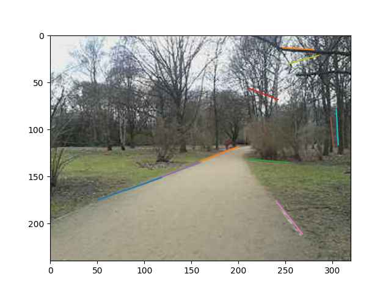

# İmaj / Görüntü İşleme Teknikleri

Standart bazı sayısal görüntü işleme tekniklerini listeleyeceğiz,
referans amaçlı, mümkün olduğu kadar yaygın bilinen kütüphaneleri
kullanarak kod örnekleri verilecek.

### Küçültmek, Büyütmek

Ünlü kameracı görüntüsü üzerinde küçültme yapalım,


```python
from PIL import Image
img = Image.open('img3.jpg')
new_img = img.resize((100,100), Image.BICUBIC)
new_img.save("img3_2.jpg", "JPEG")
```


Boyut değişimi yapılırken `ANTIALIAS`, `BICUBIC`, `BILINEAR` ve
`CUBIC` seçenekleri kullanılabilir. Küçültme, büyültme farketmez, aynı
seçenekler var, ölçü değişimi olduğunda muhakkak aradeğerleme
(interpolation) yapılması lazım, bahsedilen seçenekler bu
aradeğerlemenin nasıl yapılacağını kontrol ediyor. Aradeğerleme lazım
çünkü mesela büyütme durumunda 100x100 boyutunda bir resim 300x300
olacaksa bu 40,000 tane yeni piksel yaratılması demektir, bu
piksellere bir değer atanmalı, bu değerler mevcut değerler
kullanılarak bulunabilir, bilinen yakın olan piksellerin ortalama
değeri mesela, lineer ağırlıklı, ya da başka türlü. Üstteki seçenekler
hangi aradeğerlemenin seçileceğini kontrol ediyor.

Biraz önce küçültülen resmi şimdi geri büyültelim,

```python
new_img3 = new_img.resize((340,340), Image.BICUBIC)
new_img3.save("img3_3.jpg", "JPEG")
```


Biraz kalite kaybı oldu muhakkak bu küçültme yaparken yaşanan veri kaybı
yüzünden.

### Bölge Kesip Çıkartmak (Crop)

x=100,y=100 ile x=200,y=200 noktalarının oluşturduğu kareyi çekip çıkartmak
istersem,

```python
new_img4 = img.crop((100, 100, 200, 200))
new_img4.save("img3_4.jpg", "JPEG")
```


### Pürüzsüzleştirme (Smoothing)

Pürüzsüzleştirme, ya da bulanıklaştırma işlemi yapmak için bir `scipy` bazlı
bir de pür `numpy` bazlı bir teknik göreceğiz. İşlenecek resim demirbaş
Lena,


```python
import numpy as np
import matplotlib.pyplot as plt
import pandas as pd, imageio
import scipy.ndimage as ndimage

img = imageio.imread('../../../func_analysis/func_70_tvd/lenad0.jpg')
print (img.shape)
```

```text
(225, 225)
```

```python
img2 = ndimage.gaussian_filter(img, sigma=1)
print (img2.shape)
imageio.imwrite('img2.jpg',img2)
```

```text
(225, 225)
```


```python
def initialize_kernel(size , sigma): 
    w, h = size                                                  
    x = np.linspace(-1,1,w)                         
    y = np.linspace(-1,1, h)                         
    x_cor, y_cor  = np.meshgrid(x, y) 
    kernel = 1/(2*np.pi*np.power(sigma,2) )*\
             np.exp((- (x_cor ** 2 + y_cor ** 2) )/ 
             (2*np.power(sigma,2)))

    kernel = kernel/np.sum(kernel) # normalization
    return kernel

def conv2d(image, ftr):                           
    s = ftr.shape + tuple(np.subtract(image.shape, ftr.shape) + 1)
    sub_image = np.lib.stride_tricks.as_strided(image, shape = s,
                strides = image.strides * 2)
    return np.einsum('ij,ijkl->kl', ftr, sub_image)

img1 = conv2d(img,initialize_kernel((3,3),1))
print (img1.shape)
imageio.imwrite('img1.jpg',img1)
```

```text
(223, 223)
```


### Çizgiler

Bir imajdaki ana çizgileri bulmak artık görüntü işlem biliminde
demirbaş haline gelmiş Canny kenar bulucusu ve Hough transformu ile
yapılabilir.

```python
from PIL import Image, ImageDraw
from skimage.transform import  probabilistic_hough_line
from skimage.feature import canny
from skimage import data

im1 = Image.open('in1.jpg').convert('L')
edges1 = canny(np.array(im1), 2, 1, 25)
lines1 = probabilistic_hough_line(edges1, threshold=10, line_length=30,line_gap=3)
im1 = Image.open('in1.jpg')
for line in lines1:
    p0, p1 = line
    plt.plot((p0[0], p1[0]), (p0[1], p1[1]))
plt.imshow(im1)
plt.savefig('img4.jpg',quality=40)
```




Kaynaklar

[1] Haidar, https://medium.com/@haidarlina4/tutorial-convert-an-image-into-a-sketch-step-by-step-e00e2f312521
