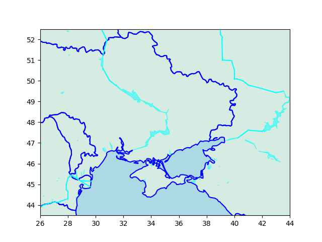
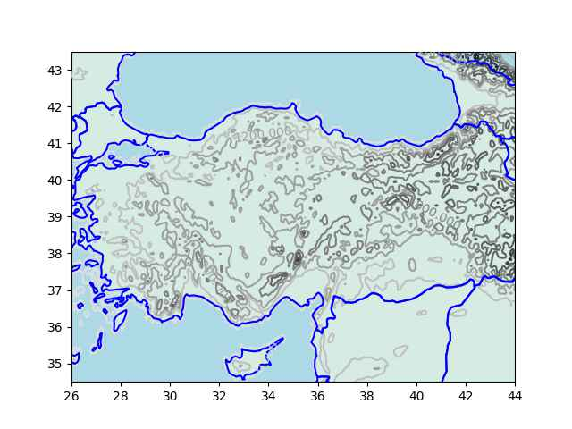

# Yeni Haritalama Paketi

İnternet bağlantısı gerektirmeyen, gerekli verisini paket kurulum
dosyalarında taşıyan haritalama paketi revaçta yoktu, yazalım dedik -
`simplegeomap`.  Açık yazılım olarak paylaşılıyor [1], ve PyPi
üzerinde kurulmaya hazır whl dosyası var, `pip install simplegeomap`
ile kurulabilir.

Simplegeomap temel ihtiyaçları basit, hızlı bir şekilde cevaplaması
için yazılmıştır, bu ihtiyaçlar en azından bizim için istenen bir
bölge içine düşen kıta, ülke sınırlarını çabuk bir şekilde çizebilmek,
sınırlar dışında kalanları (mesela denizler) belli bir renkte vermek,
çok detaylı olmasa da yükseklik (dağlar) ve su alanları (nehir, göl
gibi) haritalamanın, raporlamanın mümkün olması.

Smgm yuvarlak olan yerkürenin farklı şekildeki iki boyuta yansıtma
tekniklerini kullanmıyor, en temel yaklaşım olan boylamı x, enlemi y
kordinatı kabul edip veriyi direk kartezyen halde grafikleme tekniğini
seçiyor. Bu yaklaşım her çok uzun mesafelerde kesin olmayabilir, fakat
yakın mesafeler ve objelerin genel yerlerini göstermesi açısından
yeterlidir.

## Kıtalar, Ülkeler

En temel çizimle başlayalım. Bir kordinatı merkez alıp belli bir
odak (zoom) seviyesine göre o noktadaki kıta sınırlarını çizelim,

```python
import simplegeomap as sm

sm.plot_continents(clat=0,clon=0,zoom=20)
plt.savefig('sm_01.jpg',quality=40)
```

Bu grafikleme için gereken veri smgm içinde mevcut `continents.zip`
dosyasından geliyor, kıta sınırları bir JSON içinde, 300K
büyüklüğünde. İnternet bağlantısına gerek yok.


Farklı yerlere odaklanabiliriz, 

```python
sm.plot_continents(clat=30,clon=30,zoom=5)
plt.savefig('sm_02.jpg',quality=40)
```


Smgm üstteki türden haritalama için iç renk ve dış renk (`incolor`,
`outcolor`) kavramlarını kullanır. Sınırları olan alanlar, kıtalar, ya
da ülkelerin içi `incolor` ile dışarıda kalan herşey `outcolor` ile
renklenir. Mesela iç kahverengimsi, dış daha koyu mavi istersek bunu
yapabiliriz,

```python
sm.plot_continents(clat=30,clon=30,zoom=5,incolor='yellow',outcolor='blue')
plt.savefig('sm_03.jpg',quality=40)
```


Olağan (default) değerler iç `lightyellow` dış `lightblue`. Kullanici bu degerleri
goruldugu gibi degistirebiliyor.

Ülkeler,

```python
sm.plot_countries(clat=30,clon=30,zoom=2)
plt.savefig('sm_04.jpg',quality=40)
```


Görüldüğü gibi gösterilen bölgenin içine düşen tüm ülke sınırları
çizildi.  Tekrar belirtmek gerekirse, kıta sınırları, ülke sınırlarını
içeren veri dosyaları paketin bir parçasıdır, bu dosyalar kurulum ile
beraber gelirler ve her an erişime hazır olacaklardır. Üstteki
grafikleme `TM_WORLD_BORDERS-0.3.shp` dosyasından geldi, ki bu veri
açık olarak paylaşılan bir veridir.

Paket grafikleme yaparken temel `matplotlib` kavramlarını kullanır,
zaten enlem/boylam bilgisini boylam/enlem olarak x,y noktaları olarak
kullandığımızı söylemiştik, bu durumda, eğer ek bilgileri haritaya
konuşlandırmak istersek bunu hala `matplotlib` yapılarıyla x,y vererek
yapabiliriz. Mesela üstteki haritada Mısır'da enlem=28, boylam=30
noktasını göstermek istiyorum, oraya bir kırmızı 'elmas' şekli
koyabilirim, altına yazı yazabilirim,

```python
sm.plot_countries(clat=30,clon=30,zoom=2)
plt.plot(30,28,'rd')
plt.text(25,28.5,'Buraya dikkat')
plt.savefig('sm_05.jpg',quality=40)
```


Uzak Ülkeler

Paket verilen merkez nokta ve odak (zoom) üzerinden haritalama
yaparken verilen noktadan 'uzak' olan ülkeleri çizmemeye
uğraşıyor. Bunu odak parametresini bir uzaklığa çevirerek ve merkezi
uzaklığın dışına düşen ülkeleri atlayarak yapıyor. Fakat bazen bu
algoritma işlemeyebilir, mesela Rusya büyüklüğü sebebiyle bir ülkenin
sınırında olsa bile merkezi çok uzakta olduğu için 'dış bölge' olarak
kabul edilebilir, bu durumda `force_include=['RUS']` ile bu ülkeyi
haritaya tekrar 'dahil' edebiliriz.

Bölgeler, Çizgiler

Bir kordinat listesi ile bir eğri, çizgi göstermek mümkündür. Çizgiyi
temsil eden noktaları liste olarak smgm'e verince çizgi basılır. Eğer
kapalı bölge istersem verilen listenin son kordinatı ilk kordinatına
bağlı kabul edilecektir, ve alan kapatılacaktır.

```python
pts = np.array([[40,10],[43,10], [43,15]])
fig, ax = plt.subplots()
sm.plot_countries(clat=40,clon=10,ax=ax,zoom=1.0)
sm.plot_line(pts,ax,color='red')
plt.savefig('sm_06.jpg',quality=40)
```


```python
fig, ax = plt.subplots()
sm.plot_countries(clat=40,clon=10,ax=ax,zoom=1.0)
sm.plot_region(pts,ax,color='lightpink')
plt.savefig('sm_07.jpg',quality=40)
```


Aynı Harita İçin Birden Fazla smgm Çağrısı

Üstteki çağrıda birden fazla çağrı yaptık ama çıktı sadece bir
haritaydı.  Bu durumda grafiği temsil eden Axis, Figure objelerini
matplotlib'den alıp onları `simplegeomap` çağrılarına ek parametreler
olarak geçtik. Bu şekilde paket hangi grafik üzerine gösterim
yapacağını anlamış oldu.

Her seferinde bunu yapmak gerekli değil, bazı temel çağrılar, mesela
`plot_continents`, ya da `plot_countries` gibi, eğer ax, fig objeleri
geçilmemişse bir tane olağan obje yaratabilir, ve ardından gelecek
`plt` çağrıları bu objeleri nasıl olsa kullanacaktır.  Fakat daha
çetrefil kullanımlarda ax, fig bizim tarafımızdan yaratılmalı, ve her
arayüze geçilmeli. Mesela aynı grafik içinde birden fazla alt grafik
kullanımı bir çetrefil kullanım örneği, bu durumda gerekli alt
grafiğin ax, fig objeleri farklı çağrılara geçilebilir,

```python
fig, ax = plt.subplots(2,figsize=(4,4))
sm.plot_countries(40,20,zoom=1,ax=ax[0])
sm.plot_countries(40,30,zoom=1,ax=ax[1])
plt.savefig('sm_08.jpg',quality=40)
```


Nehirler, Göller  

Odaklanan bölge içine duen şu öbekleri için `plot_water` var,

```python
clat,clon = 48, 33
zoom = 0.5
fig, ax = plt.subplots() 
sm.plot_countries(clat,clon,zoom=zoom,ax=ax,force_include=['RUS'])
sm.plot_water(clat,clon,zoom=zoom,ax=ax)
plt.savefig('sm_09.jpg',quality=40)
```



Dağlar, Yükseklik Verisi

```python
clat,clon = 39, 43; zoom = 0.12
fig, ax = plt.subplots() 
sm.plot_countries(clat,clon,zoom=zoom,ax=ax)
sm.plot_elevation(clat,clon,zoom=zoom,ax=ax)
plt.savefig('sm_10.jpg',quality=40)
```




Kaynaklar

[1] https://github.com/burakbayramli/simplegeomap

[2] https://pypi.org/project/simplegeomap/

