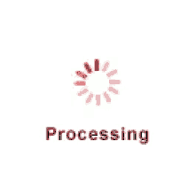

# Javascript

Tamamen istemci, tarayıcı üzerinde işleyen kodlara ihtiyaç varsa
Javascript kodlaması yaparız. Javascript kodları HTML içine bile
gömülebilir, ve bu kodlar içinde olduğu HTML öğelerine
erisebilirler. Bu sayede servis tarafında üretilmiş bir HTML
gönderilmiş olsa bile hala o HTML üzerinde değişiklik yapılabilir. Bir
girdi kutusuna girilen bilgi yeni bir liste yaratılmasını sağlayabilir
mesela, her türlü ekleme, çıkarma, düzeltme işlemi kullanıcı tarafında
halledilebilir. 

### Geliştirme Ortamı

Javascript geliştirme her zaman bir uygulama servisi gerektirmeyebilir
sonuçta bir HTML kodlanıyor ve bu kodlar tarayıcıda düz dosya olarak
yüklenebilirler, fakat biz gene de bir tane başlatalım. Python
bilenler için en iyisi Flask, bir `static` dizini yaratılabilir, ve
düz HTML dosyaları buraya koyulur, ve `http://localhost:8080/static/dosya.html`
şeklinde erişilebilir.

Javascript ne zaman, nerede yüklenir, nasıl çağrılır? 

Sablon olarak bir HTML suna benzeyebilir,

```html
<html>
  <head>
    <meta name="viewport" content="width=device-width, initial-scale=1.0"/>
  </head>  
  <script>
    function foo() {
        document.getElementById("output").innerText = "vs vs vs";
    }
  </script>    
  <body onload="foo()">
    <div id="output">
    </div>  
  </body>
  
</html>
```

Bu dosyada bir JS fonksiyonunu HTML içine gömdük, bu fonksiyon HTML
yüklenir yüklenmez çağrılacaktır. Fonksiyon `foo` yu `body onload`
çengeline takarak bunu yapmış olduk. Çengel derken İngilizce hook
kavramına atıf yapılıyor, yani beni arama ben seni ararım tekniği, biz
çağrılmasını istediğimiz fonksiyonu altyapıya veriyoruz (çengele
takıyoruz), onun ne zaman çağrılacağını biz kontrol etmiyoruz, yeri
gelince altyapı onu çağırıyor.

Kodlamayı direk sayfa içine Javascript gömerek, ya da ayrı bir `js`
dosyasını sayfaya dahil ederek yapabiliriz. İkinci yöntem kod
idaresi açısından daha rahattır. HTML içine

```
<script src="funcs.js"></script>
```

koyunca `funcs.js` otomatik olarak dahil edilecektir.  Fakat dikkat,
eğer tarayıcı önbelleklemesi (cache) açık ise, ki olağan durum budur,
js dosyasında yapılan değişiklikler HTML tarayıcıda tekrar yüklense
bile etki etmeyebilir, o zaman `Developer tools`, `Network` ve oradan
`Disable cache` seçimi yapılırsa önbelleklenme kapatılmış olur, kod
her seferinde tekrar yüklenir. Tabi Web'de her kullanıcının bunu
yapmasını bekleyemeyiz, o zaman yeni kod sürümü yapacaksak yeni kod
için yeni bir js dosya ismi kullanmak bir çözüm olabilir.

Log

Eğer kod işletimi sırasında bazı değerleri log bırakmak açısından düz metin
olarak basmak istiyorsak, bunu `console.log(..)` ile yapabiliriz. Çıktıları görmek
için Chrome içinde üst sağ köşede tıklama yapıp `More tools` ve `Developer tools`
seçimi yaparız. Bu araç tarayıcının sağ kenarında çıkar, üstteki tab içinde
`Console` seçimi yaparak log çıktılarını görmek mümkündür. 

Bir diğer mesaj basma yöntemi `alert` çağrısı, fakat bu çağrı bir
diyalog kutusu yaratır, tıklama yapıp kapatmak gerektiği için her
yerde kullanılmıyor.

Node

Görsel kodlamada ilerlemeden önemli bir konuya değinelim, çünkü
ileride JS kodlarını test etmek için faydalı olabilir. Node
teknolojisi ünlü, bu servis tarafında Javascript anlamına geliyor. V8
motoruyla beraber JS kodlarının işletimi hızlandı, ve bazıları da
düşündü ki "ben motoru alıp servis tarafında koştururum, böylece hem
görsel hem servis kodlarını aynı dilde yazabilmiş olurum". Node
buradan çıktı. Biz şu anda servis tarafı kodlamasını işlemiyoruz,
fakat pür istemci için olsa bile bazı Javascript kodları hala görsel
olmayan mantık içerebilir, ve bu kodları ayırıp, node üzerinden test
etmek mümkündür, böylece sürekli tarayıcıyı açmak gerekmez, komut
satırından Javascript test edebiliriz.

Kurmak için,

```
sudo apt install nodejs
```

Simdi mesela bir `test1.js` icinde

```javascript
function add(a, b){
    return a+b;
}

console.log(add(3,4));
```

Bu kodu

```
node test1.js
```

ile işletince `7` değeri basılacaktır. Dikkat edersek görsel kod içinde kullanılan
aynı `console.log` çağrısı var, ve bu çağrı otomatik olarak komut satırı ekranına
çıktıyı basacağını bildi.

Node kodlarından dosya yüklemek bile mümkün,

```javascript
const fs = require('fs')

file = fs.readFileSync("/home/user1/dir/dosya.json", 'utf8');
const res = JSON.parse(file);
```

Tabii üstteki kod görsel kodlama için uygun değil çünkü tarayıcı içindeki
Javascript yerel dizindeki dosyalara erisemez, İnternet üzerinden dosya
okumak için `XMLHttpRequest` gerekir, o konuya geliyoruz, fakat test
amacıyla üstteki çağrı hala faydalıdır.

Sayfa bazında Javascript'in `src include` ile yüklediği dış kütüphaneleri
Node ile `require` kullanarak alabiliriz. Mesela [2]'deki matematik kodlarını
kullanmak istiyorum, gerekli `math.js`  dosyasını indirip

```
var math = require('./math.js');
let N = 20;
A = math.round(math.random([N,N]),5);
B = math.round(math.random([N,N]),5);

C = math.multiply(A, B);
```

gibi bir kod işletebilirim. Üstte lineer cebir matris çarpım işlemi yapmış olduk.

Eğer kendim dahil edilebilir kodlar yazmak istiyorsam, mesela `util.js` içinde
bir `add` fonksiyonumun dışarıdan dahil edilebilir olmasını istiyorsam,

```javascript
function add(x,y) {
  return x+y;
}
function subtract(..,...) {
  return x-y;
}
module.exports = {
    add: add,
    subtract: subtract
};
```

Artık bu modülü üstteki tarif edildiği gibi dahil edip kullanabilirim,

```
var u = require("./util.js")
u.add(...)
```

### Çengeller

Javascript fonksiyonları her türlü kullanıcı aksiyonu sayesinde çağrılabilir.
Mesela bir URL bağlantısına tıklanınca bir fonksiyon çağrılsın istiyorsak
`a href='#' onclick='func2()`...`  diyebiliriz. Diğer pek çok çengel noktası
vardır bunlar bir HTML referansından öğrenilebilir.

### Temel Görsel İşlemler

Javascript içinden HTML sayfasının görsel öğelerine erişilebilir
demiştik, bu öğelerden bilgi alınabilir, ve geri bilgi yazılıp
görüntüde değişim yapılabilir.

HTML içinde `id=".."` ile işaretlenen etiketlerin, mesela `<div>`
etiketi olsun, ana objesini kimlik değeri geçerek
`document.getElementById(..)` ile alabiliriz, sonra bu obje üzerinde
`.innerText` ile içerik değişimi yapabiliriz. Sadece düz metin değil
HTML de geçmek mümkündür, bunun için `.innerHTML`.

Eğer bir metin giriş kutusu var ise, kimliği `myInput` olsun,

```
<form ..>
   <input id="myInput" type="text" name="myCountry" placeholder="Movie"/>
   <button onclick="func2()">Ok</button>
</form>
```

Düğmeye basılınca bir `func2()` Javascript çağrısı yapılmasını sağlarız, bu
fonksiyon içinden

```javascript
deger = document.getElementById("myInput").value;
```

ile kutudaki değeri okuyabiliriz.

### Temel Programlama Yapıları, Kapsam

Değişken tanımlarken onların kapsamını (scope) iyi bilmek lazım, yani
değişken hangi bölgelerde tanımlıdır, bir bölümde set edilince diğer
yerde görünebilir mi, değer alımı yapılabilir mi?

Javascript'in olağan davranışı eğer değişken kapsamı tanımlanmamışsa,
onun her yerde (global) kapsamı olmasıdır. Mesela

```javascript
function func1() {
    console.log('in func1');    
    var1 = "aaaaaa";
}

function func2() {
    console.log('in func2');    
    console.log(var1);
}


func1();

func2();
```

script'i işleyince `func1` içinde set edilen `var1` değeri
basılır. Bir fonksiyon içinde tanımlanan değer diğerinde
görülebilmiştir.

Diğer kapsamlar `let` ve `var` ile yapılır, bunlardan birincisi
değişkeni içinde olduğu kapsama sınırlar, diğeri içinde olduğu
fonksiyona sınırlar. Mesela üstteki kodda `func1` içinde `let var2 = "bbbbbb"`
tanımlasam ve `func2` içinden erişmeye uğraşsam hata mesajı alırım. 

Anahtar bazlı hızlı erişilebilen sözlük (dictionary) yapısı pek çok
diğer dilde olduğu gibi Javascript'te de mevcuttur. Yaratmak için
direk kod içinde

```javascript
d1 = {'a': 3, 'b': 2}
```

diyebilirdim, erişmek için `d1['a']` çağrısı 3 değerini verir. Bir
anahtarın sözlükte olup olmadığını kontrol için `hasOwnProperty`
çağrısı var.

Sözlük değeri olarak bir liste, bir başka sözlük te
kullanabilirdik. Eğer tüm anahtarları gezmek (iterate) istersem,

```javascript
Object.keys(d1).forEach(function(key) {
    console.log(key);
})
```

Bu anahtarları kullanıp değerleri de alabilirdim muhakkak.

Listeler benzer şekilde direk kod içinde yaratılabilir, bir tane yaratalım,
ve eski usul C vari bir şekilde onu gezelim,

```javascript
l1 = [2, 4, 6]

for (let i=0; i<l1.length; i++) {
    console.log(l1[i]);
}
```

Listeler de `forEach` tekniği ile gezilebilir,

```javascript
l1.forEach(function(key) {
    console.log(key);
})
```

Koşul komutları `if`, `else` tahmin edilebilecek şekilde ve C, Java da
olduğu gibi işler.

Metinler (String)

Bir metin yaratmak icin yine direk kod icinde

```javascript
s1 = "bir kelime";
```

diyebilirdik. Kelimeye ekler yapmak arti isareti kullanabilir,

```
s2 = s1 + " arti bir sey";
```

gibi. Kelimeler üzerine Python'dan tanıdık `split` çağrısı var, mesela

```javascript
console.log(s2.split(" "));
```

```
[ 'bir', 'kelime', 'arti', 'bir', 'sey' ]
```

Bir metnin diğeri içinde olup olmadığını kontrol için `includes`, mesela

```javascript
console.log("berber".includes("erb"));
```

çağrısı `true` döndürür.


Şablon kullanımı için ilginç bir sözdizimi var, 

```javascript
let header = "baslik";

let html = `<h2>${header}</h2><ul>`;

console.log(html);
```

Bu kodlar ekrana `html` içindeki değerleri basar ve oradaki
`${header}` için `header` değişkeninde görülen değer geçirilir. Yani
`html` içindeki şablonda bir değer doldurması yapıyoruz, bu doldurma
için geriye tek tırnak (backtick) içinde Javascript'teki değişken
isimlerini kullanabiliyoruz.

### JSON

Javascript'in dış dünya ile alışverisi en rahat JSON bazlı yapılır, bu
sebeple kullanımını bilmek iyi olur. JSON sonuçta bir sözlük, ya da
listenin metin halidir. Tabii sözluk içinde sözlük, onun içinde liste
gibi istenildiği kadar çetrefil yapılari taşıyabilir bu sebeple
kuvvetli bir temsil şeklidir. Dışarıdan gelen JSON formatındaki metni
Javascript'te görülebilen ona karşılık olan yapılara çevirmek için
`JSON.parse`, yapıları geri JSON metnine çevirmek için
`JSON.stringify` kullanılır.

```javascript
var json1 =  '{ "key1": "val1", "key2": "value2" }';
var json2 =  '[2,3,4,5]';

json1 = JSON.parse(json1);
json2 = JSON.parse(json2);

console.log(json1['key1']);
console.log(json2[2]);
```

### Çerez (Cookie) Kullanımı

Çerezler sitelerin kullanıcı tarayıcısına yerel bırakabildiği 'bilgi
kırıntılarıdır', bilgi notlarıdır. Çerezler sayesinde en basit statik
HTML + Javascript bile kullanıcının o siteye özel bazı bilgileri kendi
bilgisayarında depolamasını sağlayabilir. Mesela bir kullanıcı favori
filmlerini seçer, Javascript o bilgiyi alıp bir çereze koyar, sonraki
ziyaretinde kullanıcı (bizim kod üzerinden) o çereze erişir, ve
tarayıcısında o bilgiyi görür. Böylece site tarafından hatırlanmış
olur, bu arayüz tasarımı açısından iyi bir şeydir.

Javascript ile çerezlere erişim basittir, `document.cookie` ile
kodladığım, kullanıcının ziyaret etmekte olduğu tüm çerezleri
alabilirim, bu degiskene bir değer yazdığımda çerezi değiştirmiş
olurum. Tabi belli bir formatı takip etmek iyidir, metin içinde ilk
başta `isim=` tanımlarsak o çereze isim vermiş oluyoruz. Sonda bir `;`
sonrası `expires=Wed, 05 Aug 2025 23:00:00 UTC` gibi bir tarih vermek
o çereze bir zamanaşımı veriyor, bu zamandan sonra o çerez geçersiz
oluyor, ondan önce hatırlanıyor. Eğer zamanaşımı verilmezse olağan
davranış çerezin silinmesidir.

Bazı çerez kullanım kalıpları şöyle olabilir, siteyi ziyaret edenlerin
çerezi kontrol edilir, `document.cookie.length < 1` ile, eğer çerez
boş ise, hemen bir çerez atanır. Mesela alışveriş listesi (cart) için

```
empty = {"cart": {}}
document.cookie = 'bb=' + JSON.stringify(empty) + '; expires=Wed, 05 Aug 2025 23:00:00 UTC';
```

Böylece alışveriş için bir sözlük yarattım, onun JSON tanımını bir
zamanaşımı ile çereze koydum. Çerez okurken

```javascript
var elems = document.cookie.split("=");
movies = JSON.parse(elems[1]);
```

diyebilirim.

Site Çerezi

Eğer farklı sayfalardan aynı çereze erişilebilsin istiyorsam üstteki
çerez metnine zamanaşımı ibaresinden sonra bir `;path=/` ifadesi
ekleyebilirim, böylece çerez "site çerezi" haline gelir, ve her sayfa
tüm çereze erisebilir. Benim kendi kullandığım bazı yardımcı
fonksiyonlar alttaki gibidir,

```javascript
all_apps = ['sayfa1','sayfa2'];

expires_path = '; expires=Wed, 05 Aug 2025 23:00:00 UTC;path=/';

function init_cookies() {

    if (document.cookie.length < 1) {
	empty = {}
	all_apps.forEach(function(app) {
	    empty[app] = {};
	})
	document.cookie = 'bb=' + JSON.stringify(empty) + expires_path;
    } else {
	var elems = document.cookie.split("=");
	prefs = JSON.parse(elems[1]);    
	all_apps.forEach(function(app) {
	    if (! prefs.hasOwnProperty(app)) {
		prefs[app] = {}
	    }
	})
	document.cookie = 'bb=' + JSON.stringify(prefs) + expires_path;	
    }
}

function get_prefs() {
    var elems = document.cookie.split("=");
    prefs = JSON.parse(elems[1]);
    return prefs;	
}

function save_cookie(prefs) {
    document.cookie = 'bb=' + JSON.stringify(prefs) + expires_path;
}
```

Her sayfa başlangıcında `init_cookies` çağrılır, site çerezi ismi
`bb`, bu çerez içinde `all_apps` de olan bölümler yoksa hemen eklenir
(böylece yeni sayfa/uygulama ekleyince çerezlere hemen etki eder), ve
her sayfa kendine ait bilgiye bir sözlük üzerinden erişir. Çerezleri
almak için `get_prefs` geri yazmak için `save_cookie`.

### XMLHttpRequest

Statik Dosya

Uzaktaki bir JSON dosyasını alıp okumak istiyorsak,

```javascript
url = "https://www.filanca.com/dir/file1.json";
var xmlHttp = new XMLHttpRequest();
xmlHttp.open( "GET", url = url, false ); 
xmlHttp.send( null );
var res = JSON.parse(xmlHttp.responseText);
...
```

Ajax

XMLHttpRequest ile Ajax çağrısı yapmak ta mümkündür. İlk kez bu
noktada bir pür uygulama servisi özelliği kullanacağız yani işlem
kodlarının servis tarafında olduğu türden, üç katmanlı (three-tier)
mimarinin orta katmanının gerekli olduğu yapı.

Diyelim ki bir taban yarattım (üçüncü katman) ona bir servis arayüzü
üzerinden iletişim vermek istiyorum, `get` ile geçilen anahtar değeri
tabanda bakılıp döndürülecek, `set` ile verilen değer ve anahtar
tabana yazılacak.  Servis tarafını Flask ile yazalım,

```python
from flask import Flask, url_for, jsonify, request
import sys, os, sqlite3

app = Flask(__name__)

db = {"a": "ali", "v": "veli"}

@app.route('/get', methods=["PUT", "POST"])
def get():    
    data = request.get_json(force=True)   
    key = data['key']    
    return jsonify({'result': db[key]})

@app.route('/set', methods=["PUT", "POST"])
def set():    
    data = request.get_json(force=True)   
    key = data['key']
    value = data['value']
    db[key] = value
    print ("new db", db)
    return jsonify({'result': "OK"})

if __name__ == "__main__":
    app.run(host="localhost", port=8080)   
```

HTML/Javascript şöyle olabilir,

```html
<html>
  <head>
    <meta name="viewport" content="width=device-width, initial-scale=1.0"/>
  </head>
  <script>
  function set(key, val) {

    url = "http://localhost:8080/set";
    var xmlhttp = new XMLHttpRequest();   // new HttpRequest instance 
    xmlhttp.open("POST", url, false);
    xmlhttp.setRequestHeader("Content-Type", "application/json;charset=UTF-8");
    xmlhttp.send(JSON.stringify({ "key": key, "value": val }));
  }

  function get(key) {
    url = "http://localhost:8080/get";
    const xhr = new XMLHttpRequest()
    xhr.onload = () => {
      if (xhr.status >= 200 && xhr.status < 300) {
        const response = JSON.parse(xhr.responseText)
        console.log(response)
      }
    }

    xhr.open('POST', url)
    xhr.setRequestHeader('Content-Type', 'application/json')
    xhr.send(JSON.stringify({"key": key}))
  }
  
  function foo() {
      //set("ah","ahmet");
      //get("a");
      get("v");
  }

  
</script>
    
  <body onload="foo()">
  </body>
  
</html>
```

### Tarih Objeleri

Tarih objesi yaratmak için en rahat yöntem,

```javascript
dt1 = new Date("2022-03-25");
console.log(dt1);
```

```
2022-03-25T00:00:00.000Z
```

Eğer yıl, ay, gün ayrı ayrı geçmek istersek biraz takla lazım, ay
sıfır indisli, gün değil, alttaki gibi oluyor,

```javascript
dt1 = new Date(2022, 3-1, 25+1);
```

Bir tarihe gün ekleyip yeni tarih elde etmek için

```javascript
Date.prototype.addDays = function(days) {
    var date = new Date(this.valueOf());
    date.setDate(date.getDate() + days);
    return date;
}

dt2 = dt1.addDays(20);
```

İki tarih arası gün farkı

```javascript
diff = dt2.getTime() - dt1.getTime();

step = diff / (1000*60*60*24);
```

Basit bir kronometre kodlaması,

```javascript
const start = Date.now();

// burada bazi islemler...

const end = Date.now();
console.log("Islem zamani: " + (end - start)");
```

### İşlem Sırasında Animasyon Göstermek

Uzun sürebilecek işlemler sırasında bir anımasyon GİF göstermek mümkündür.
Bir teknik şudur, bir `<div>` içine koyulmuş bir anımasyon GİF var,
bu `<div>` sayfa yüklendiğinde stili `dışplay: nöne;` ile kapalı tutulur,
yani gösterilmez. İşlem için bir düğmeye basıldığında ilk önce stil
`block` haline getirilir, yani anımasyon gösterilir, işlem bitince
anımasyon yine kapatılır.

Burada tek problem üstte sıralanan tüm işlemlerin aynı iş parçacığı
(thread) içinde olacağı için kapatma/açılma işlemlerinin doğru
gösterilmemesi. Fakat eğer uzun sürecek işlemi başka bir iş parçacığı
içine asenkron olarak işletirsek [3], istenen görüntü elde
edilir. Kullanılan animasyon gif [şurada](busy.gif).

```html
<head>
  <script>
    function longLoop() {
        let count = 1000000000;
        let result = 0;
        for (let i = 1; i <= count; i++) {
          result = i;
        }
        return result;
    }

    function go() {
        let spinnerElement = document.getElementById('spinner');
        let resultElement = document.getElementById('result');
        spinnerElement.style.display = 'block';

        new Promise(resolve => setTimeout(() => {
            resolve(longLoop())
        }))
      .then((result) => {
          spinnerElement.style.display = 'none';
          resultElement.innerHTML = result;   
      })
    }
  </script>
</head>

<body>
  <button onclick="go();">Go</button>
  <span id="result"></span>
  
  </img>  
</body>
```


### Girdi Tamamlamak (Autocomplete)

Javascript'in kabiliyetlerini göstermek açısından alttaki kod faydalı olur,
giriş kutusuna girilen birkaç kelime sonrası gerisini tamamlama amaçlı seçenek
listesi veren (autocomplete) kodu altta görülüyor.

```html
<html>
<head>
<meta name="viewport" content="width=device-width, initial-scale=1.0">
</head>     
<body>

<h2>Autocomplete</h2>

<p>Start typing:</p>

<form autocomplete="off">
  <div class="autocomplete" style="width:300px;">
    <input id="myInput" type="text" name="myCountry" placeholder="Country">
  </div>
  <input type="submit">
</form>

<script src="common.js"></script>

</body>
</html>
```

Javascript kodlari `common.js` icinde

```javascript
function autocomplete(inp) {

    var arr = ['aa','bb','aaa']
    
    var currentFocus;
    inp.addEventListener("input", function(e) {
	var a, b, i, val = this.value;
	closeAllLists();
	if (!val) { return false;}
	currentFocus = -1;
	a = document.createElement("DIV");
	a.setAttribute("id", this.id + "autocomplete-list");
	a.setAttribute("class", "autocomplete-items");
	this.parentNode.appendChild(a);
	for (i = 0; i < arr.length; i++) {
            if (arr[i].substr(0, val.length).toUpperCase() == val.toUpperCase()) {
		b = document.createElement("DIV");
		b.innerHTML = "<strong>" + arr[i].substr(0, val.length) + "</strong>";
		b.innerHTML += arr[i].substr(val.length);
		b.innerHTML += "<input type='hidden' value='" + arr[i] + "'>";
		b.addEventListener("click", function(e) {
		    inp.value = this.getElementsByTagName("input")[0].value;
		    closeAllLists();
		});
		a.appendChild(b);
            }
	}
    });
    inp.addEventListener("keydown", function(e) {
	var x = document.getElementById(this.id + "autocomplete-list");
	if (x) x = x.getElementsByTagName("div");
	if (e.keyCode == 40) {
            currentFocus++;
            addActive(x);
	} else if (e.keyCode == 38) { //up
            currentFocus--;
            addActive(x);
	} else if (e.keyCode == 13) {
            e.preventDefault();
            if (currentFocus > -1) {
		if (x) x[currentFocus].click();
            }
	}
    });
    function addActive(x) {
	if (!x) return false;
	removeActive(x);
	if (currentFocus >= x.length) currentFocus = 0;
	if (currentFocus < 0) currentFocus = (x.length - 1);
	x[currentFocus].classList.add("autocomplete-active");
    }
    function removeActive(x) {
	for (var i = 0; i < x.length; i++) {
	    x[i].classList.remove("autocomplete-active");
	}
    }
    function closeAllLists(elmnt) {
	var x = document.getElementsByClassName("autocomplete-items");
	for (var i = 0; i < x.length; i++) {
	    if (elmnt != x[i] && elmnt != inp) {
		x[i].parentNode.removeChild(x[i]);
	    }
	}
    }
    document.addEventListener("click", function (e) {
	closeAllLists(e.target);
    });
}

autocomplete(document.getElementById("myInput"));
```


Kaynaklar

[1] https://www.w3schools.com/howto/howto_js_autocomplete.asp

[2] https://mathjs.org/download.html

[3] https://stackoverflow.com/questions/71943182/how-to-show-hide-animated-gif-during-the-execution-of-a-function/71944178#71944178

