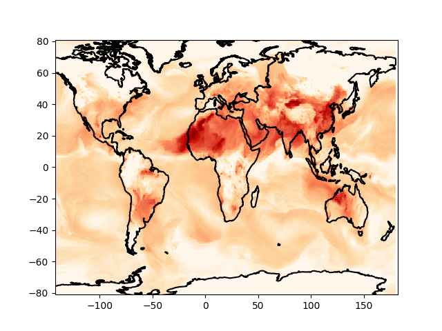

# Hava Kirliliği, SILAM, AQI

SILAM [2] adlı bir kurum hava kirlilik durumu verilerini paylaşıyor.
Bu veriler kullanılarak hava kirliliğini belirten bir özet ölçüt AQI
hesaplanabilir, bu bağlamda Ventusky uygulaması faydalı, zaten onlar da
verisini SILAM'dan alıyor.

[https://www.ventusky.com/?p=40;32;6&l=aqi](https://www.ventusky.com/?p=40;32;6&l=aqi)


OpenWeatherMap sitesinden de yeryüzündeki herhangi bir yer için anlık
hava temizlik durumu alınabilir. Verilen bilgiler yer seviyesi ozon
(O3), partikül kirliliği (PM2.5, PM10), carbon monoxide (CO), sülfür
diyoksit (s02), nitrogen diyoksit (no2). OWM sitesine bedava kayıt
olup bir anahtar almak yeterli, biz anahtarı

```
{
  "weatherapi": "[anahtar]",
  ...
}
```

bir `.conf` dosyasına yazdık, JSON formatında, anahtarla alttaki kod üzerinden
bilgiyi alıyoruz,

```python
import json, requests, os

def pollution(lat,lon):
    url = 'http://api.openweathermap.org/data/2.5/air_pollution?'
    params = json.loads(open(os.environ['HOME'] + "/.nomterr.conf").read())
    payload = { 'lat': str(lat), 'lon': str(lon), 'appid': params['weatherapi'] }
    r = requests.get(url, params=payload)
    res = [json.loads(x.decode()) for x in r.iter_lines()]
    aqi = res[0]['list'][0]['main']
    comp = res[0]['list'][0]['components']
    return aqi, comp


lat,lon = 28.667497225228697, 77.04931436061617
pollution(lat,lon)
```

```text
Out[1]: 
({'aqi': 5},
 {'co': 1642.23,
  'no': 4.81,
  'no2': 52.78,
  'o3': 151.63,
  'so2': 154.5,
  'pm2_5': 277.4,
  'pm10': 318.04,
  'nh3': 5.7})
```

Rapor Hindistan'ın başkenti Yeni Delhi için, bu sıralarda hava
kirlilik problemi var, ve AQI maksimum olan 5 seviyesinde çıktı.

SILAM ile tüm dünya için geçmiş tarihteki kirlilik verisi bulunabilir,
[1] bağlantısında dosyalar görülüyor, alttaki kodla `20231104` tarihi
için olan nc4 dosyasını alıyoruz,


```python
import requests, os


def download_silam(f, outdir):
   base_url = "https://silam.fmi.fi/thredds/fileServer/dailysilam_glob06_v5_8/files/"
   target_file = outdir + "/" + f
   url = base_url + "/" + f
   if not os.path.isfile(target_file):
       r = requests.get(url, allow_redirects=True)
       open(target_file, 'wb').write(r.content)

f = 'SILAM-AQstat-glob06_v5_8_2023110400.nc4'
outdir = "/opt/Downloads/silam"
download_silam(f, outdir)
```

Dosyada paylaşılan bilgilere bakalım,

```python
import netCDF4

sf = netCDF4.Dataset(outdir + "/" + f)

for x in sf.variables.keys(): print (x)
```

```text
air_dens
daymax_cnc_PM10
daymax_cnc_PM2_5
daymax_vmr_CO
daymax_vmr_NO
daymax_vmr_NO2
daymax_vmr_O3
daymax_vmr_SO2
daymean_cnc_PM10
daymean_cnc_PM2_5
daymean_vmr_CO
daymean_vmr_NO
daymean_vmr_NO2
daymean_vmr_O3
daymean_vmr_SO2
hybrid
lat
lon
time
```

Bunlardan mesala ortalama PM 2.5 verisi `daymean_cnc_PM2_5`

```python
sf.variables['daymean_cnc_PM2_5'].shape
```

```text
Out[1]: (7, 1, 297, 600)
```

Bu bir tensor, yani çok boyutlu matris, görülen boyutlarda, bu
boyutların ilki gün içindeki zaman kesiti en son ikisi sırasıyla enlem
ve boylam. Maksimum enlem, boylamın -180,180 ve -90,90 arasında
olduğunu biliyoruz, bunları eldeki veri noktasına bölerek bir ızgara
(grid) yaratabiliriz, ve verileri bu ızgarada basabiliriz.

```python
import simplegeomap as sm

x,y = np.meshgrid(np.linspace(-180,180,600),np.linspace(-90,90,297))
z = sf.variables['daymax_cnc_PM2_5'][4,0,:,:] 

pz = z * 1e8
z = np.log(z)

sm.plot_continents(0, 20, zoom=18, incolor='black', outcolor='white', fill=False)

plt.pcolormesh(x,y,z,cmap='OrRd')

plt.savefig('hava1.jpg',pil_kwargs={'quality':40})
```



Dikkat log ile bir işlem yapmak gerekti çünkü veri lineer olmayan bir
sürecin sonucu, çok ekstrem değerler var, çoğu yerde çok düşük
değerler var [3]. Grafikleme amaçlı olarak bu önişlemi iyi olur.

OWM bir özet AQI hesaplar, SILAM için eldeki bileşenler kullanılarak
[4] bir AQI hesabı yapılabilir.


[1] https://silam.fmi.fi/thredds/catalog/dailysilam_glob06_v5_8/files/catalog.html

[2] https://silam.fmi.fi/aqforecast.html

[3] https://github.com/fmidev/opendata-resources/blob/master/examples/python/timeseries-airquality.ipynb

[4] https://www.health.act.gov.au/about-our-health-system/population-health/environmental-monitoring/air-quality/measuring-air

