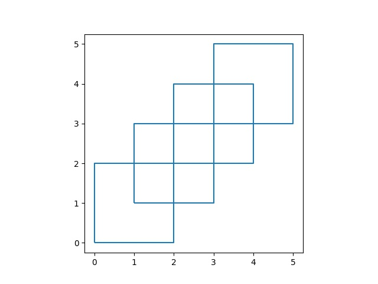
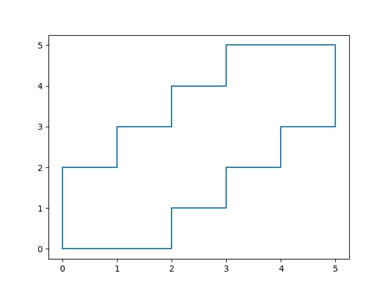

# Poligon Birleşimi, Çevreleyen Bölge

Poligon Birleşimi

Bir harita uygulaması için bir poligon grubunun dış çeperini bulmak
gerekti. Poligonların kestiği bölgeler var, bu bölgeleri dikkate almadan
tüm poligonların birleşiminin dış sınırını nasıl buluruz? Yardımcı olacak
kütüphaneler `shapely` ve `geopandas`.

```python
from matplotlib import pyplot as plt
import geopandas as gpd
from shapely.geometry import Polygon
import pandas as pd
import numpy as np

poly1 = Polygon([(0,0), (2,0), (2,2), (0,2)])
poly2 = Polygon([(2,2), (4,2), (4,4), (2,4)])
poly3 = Polygon([(1,1), (3,1), (3,3), (1,3)])
poly4 = Polygon([(3,3), (5,3), (5,5), (3,5)])
polys = [poly1, poly2, poly3, poly4]

gpd.GeoSeries(polys).boundary.plot()
plt.savefig('nokta3.jpg')
```



Birleştirmek için `unary_union` çağrısı yapılır,

```python
from shapely.ops import unary_union

mergedPolys = unary_union(polys)

res = gpd.GeoSeries([mergedPolys])
for x in res.items():
    rrr = np.array(x[1].exterior.coords)

plt.plot(rrr[:,0].T,rrr[:,1].T)
plt.savefig('nokta2.jpg')
```



Not: Çağrıdan geriye tek bir birleşmiş Polygon geliyor. Fakat eğer
çağrıdan geriye bir liste gelirse her liste içindeki Polygon
objelerine ayrı ayrı bakılabilir, uygun olanı seçilir.

Üçgenleme, Delanuay (Triangulation)

Delanuay tekniği bir nokta bulutunu veri alarak o noktaları birbiri ile
bağlantılı üçgenler haline çevirmek için kullanışlıdır; bu tür noktalar hesapsal
bilimde ortaya çıkabilir, diferansiyel denklem çözmek için sayısal hesaplara
gereken ızgaralar Delanuay ile yaratılabilir. Noktalar verilir, üçgen bazlı
ızgara ortaya çıkartılır, bu ızgara hücreleri baz alınarak hesabın gerisi
işletilir.

Kütüphane \verb!scipy! içinde Delanuay hesabı yapabilen kodlar var.

```python
from scipy.spatial import Delaunay
points = [[101, 237], [198, 207], [316, 214], [ 58, 179], [162, 138], 
          [217, 120], [310, 116], [153,  87], [257,  43]]
points = np.array(points)

tri = Delaunay(points,furthest_site=False)
plt.triplot(points[:,0], points[:,1], tri.simplices)
plt.savefig('algs_075_enc_12.png')
```

[Grafik](algs_075_enc_12.png)

Kodda \verb!tr.simplicies! icinde gorulen ucgenler kodlanmis, her kenar
\verb!points! icindeki bir indisi degerine, bir noktaya isaret ediyor.

```python
print (tri.simplices)
```

```text
[[4 0 3]
 [7 4 3]
 [5 7 8]
 [7 5 4]
 [5 6 2]
 [6 5 8]
 [1 5 2]
 [5 1 4]
 [0 1 2]
 [1 0 4]]
```

Temel olarak Delaunay ile yapılan ızgaraları oluşturan üçgenlerin açılarını
minimum tutmak, içiçe üçgen oluşturmamak ve yakın noktaların birbiri ile
bağlantılı olmasına uğraşmak [7]. Algoritma bu şartların sonucu olarak görülen
ızgaraya doğru evrilir.

Fakat bazı ilerlemeler hala mümkün; mesela bir insana sadece ham noktalar
verilse ve hangi şekilden geldiğini söylemesi istense, büyük ihtimalle en
üstteki kenarı oraya koymayacaktı. O kenar Delaunay'ın dışbükeylige meyili
sebebiyle ortaya çıkıyor. O zaman biz de bir ek işlem yaparak o kenarı
çıkartabiliriz. Görülen ek kenar aşırı büyük açısı olan bir üçgenin kenarı
(Delanuay açıları az tutmaya uğraşmasına rağmen), bir artişlem (postprocessing)
adımı içinde ``içinde çok büyük açı taşıyan'' üçgenleri çıkartabiliriz.

```python
newsimp = []
for t in tri.simplices:
  # ucgen kenar noktalari
  A,B,C = points[t[0]],points[t[1]],points[t[2]]
  # A-B ve A-C vektorunu hesapla, aradaki aciyi kosinus uzaklik uzerinden bul
  e1 = B-A; e2 = C-A
  num = np.dot(e1, e2)
  denom = np.linalg.norm(e1) * np.linalg.norm(e2)
  d1 = np.rad2deg(np.arccos(num/denom))
  # B-C ve B-A ayni sekilde
  e1 = C-B; e2 = A-B
  num = np.dot(e1, e2)
  denom = np.linalg.norm(e1) * np.linalg.norm(e2)
  d2 = np.rad2deg(np.arccos(num/denom))
  # ucuncu aciyi vektorle hesaplamaya gerek yok, toplami 180'den cikart
  d3 = 180-d1-d2
  degs = np.array([d1,d2,d3])
  # ucgenin herhangi bir acisi 110 dan buyukse o ucgeni atla
  if np.any(degs > 110): continue
  newsimp.append(t)

plt.triplot(points[:,0], points[:,1], newsimp)
plt.savefig('algs_075_enc_13.png')
```

[Grafik](algs_075_enc_13.png)

Farklı bir şekle bakalım,

```python
import pandas as pd

points = np.array(pd.read_csv('cres.csv',header=None))
plt.plot(points[:,0],points[:,1],'.')
plt.savefig('algs_075_enc_14.png')
```

[Grafik](algs_075_enc_14.png)

Bu nokta bulutu üzerinde Delanuay uygularsak,

```python
tri = Delaunay(points,furthest_site=False)
plt.triplot(points[:,0], points[:,1], tri.simplices)
plt.savefig('algs_075_enc_15.png')
```

[Grafik](algs_075_enc_15.png)

Bu veride büyük açılı üçgenleri çıkartsak bile hala geriye iç kısımdaki bazı çok
uzun çizgiler kalacak. Eğer aşırı uzun bağlantıları, çizgileri çıkartırsak belki
istenilen objeye yaklaşabiliriz. ``Çok uzun'' tanımını izafi olarak tanımlamak
lazım tabii ki, kod içine kafamıza göre gelişigüzel seçtiğimiz bir takım sihirli
sabit sayılar koymak istemiyoruz, filtreyi şöyle tanımlayalım, eğer bir çizgi
diğer tüm bağlantıların ortalamasından bir sapmadan fazla uzaktaysa o çizgiyi
içeren üçgen çok büyük olarak kabul edilir ve çıkartılır. Büyük açı mantığını
hala tutuyoruz.

```python
tri = Delaunay(points,furthest_site=False)
res = []
for t in tri.simplices:
  A,B,C = points[t[0]],points[t[1]],points[t[2]]
  e1 = B-A; e2 = C-A
  num = np.dot(e1, e2)
  n1 = np.linalg.norm(e1); n2 = np.linalg.norm(e2)
  denom =  n1 * n2
  d1 = np.rad2deg(np.arccos(num/denom))
  e1 = C-B; e2 = A-B
  num = np.dot(e1, e2)
  denom = np.linalg.norm(e1) * np.linalg.norm(e2)
  d2 = np.rad2deg(np.arccos(num/denom))
  d3 = 180-d1-d2
  res.append([n1,n2,d1,d2,d3])

res = np.array(res)
m = res[:,[0,1]].mean()*res[:,[0,1]].std()

mask = np.any(res[:,[2,3,4]] > 110) & (res[:,0] < m) & (res[:,1] < m )

plt.triplot(points[:,0], points[:,1], tri.simplices[mask])
plt.savefig('algs_075_enc_16.png')
```

[Grafik](algs_075_enc_16.png)

Bu güzel bir şekil oldu.

Alfa Şekilleri (Alpha Shapes)

Bu yaklaşım üstteki tarif edilen yöntemin literatürdeki yaygın
kullanılan bir versiyonu, yaklaşımı kodlayan bir paket `alphashapes`,

```python
import pandas as pd
import alphashape

pts=np.array(pd.read_csv("cres.csv"))

plt.plot(pts[:,0],pts[:,1],'r.')

poly = alphashape.alphashape(pts, 0.3)
    
c = np.array(poly.exterior.coords)
plt.plot(c[:,0].T,c[:,1].T)

plt.savefig('nokta4.jpg')
```

[Grafik](nokta4.jpg)

Parametre `alpha`, üstte 0.3 verildi, çevreleyen çizginin ne kadar
detaylı olacağını tanımlıyor.

Dışbükey Zarf (Convex Hull)

Verili herhangi bir boyuttaki bir nokta bulutunu düşünelim. Bu noktalar
mesela bir yapay görüş uygulamasında bir görüntüsel bölgeyi (blob) temsil
ediyor olabilir, ki gerçek dünyada o bölge bir obje olabilir. Ya da uzaklık
ölçümü yapan algılayıcıdan kordinatlar aldık, bu kordinatlar arasındaki bir
grubun etrafını tanımlayan sınırları bilmek istiyoruz. Bu bölgenin
özellikle dışbükey olmasını istiyoruz.

Dışbükeylik özellikle istenen bir özellik, çünkü gerçek dünya objelerinin
kabaca dış çeperleri dışbükey olmaya meyillidir. Ya da veri içinde dıştan
izole, dışa kapalı bölgeler dışbükey gözükebilir. Bu bölgeleri bulmak ve
dış hatlarını raporlamak faydalı.

Şöyle bir nokta bulutu olsun, 

```python
from scipy.spatial import ConvexHull
import pandas as pd

points = np.array(pd.read_csv('quadri.csv'))
plt.plot(points[:,0], points[:,1], 'o')
plt.xlim(6,12); plt.ylim(8,15)
plt.savefig('enc_09.png')
```

[Grafik](enc_09.png)

Bu noktaların dışbükey zarfını (convex hull) bulmak için pek çok algoritma
var. Mesela Quickhull [1], ya da Graham Scan adlı algoritmalar. Altta
\verb!scipy!'in çağrısını kullanıyoruz, bu çağrı içinde [2] koduna çağrı
yapıyor, QHull Quickhull kullanıyor.

```python
from scipy.spatial import ConvexHull
import pandas as pd

points = np.array(pd.read_csv('quadri.csv'))
hull = ConvexHull(points)
plt.plot(points[:,0], points[:,1], 'o')
for simplex in hull.simplices:
    plt.plot(points[simplex, 0], points[simplex, 1], 'k-')
plt.xlim(6,12); plt.ylim(8,15)
plt.savefig('enc_01.png')
```

[Grafik](enc_01.png)

3 boyutlu bir veri için,

```python
from scipy.spatial import ConvexHull
from mpl_toolkits.mplot3d import Axes3D

np.random.seed(2)

fig = plt.figure()
ax = fig.add_subplot(111, projection='3d')
points3 = np.random.rand(20,3)
hull = ConvexHull(points3)
edges= list(zip(*points3))

for i in hull.simplices:
    plt.plot(points3[i,0], points3[i,1], points3[i,2], 'r-')

ax.plot(edges[0],edges[1],edges[2],'bo')

ax.set_xlabel('x')
ax.set_ylabel('y')
ax.set_zlabel('z')

plt.savefig('enc_08.png')
```

[Grafik](enc_08.png)

Sonuçlar üstte. Piyasadaki en iyi dışbükey zarf algoritmalarının algoritmik
karmaşıklığı $O(n \log n)$ olarak biliniyor. Bu bazı uygulamalar için yavaş
gelebilir, ayrıca çoğu uygulamanın kesin bir dış çeper bilgisine
ihtiyacı yoktur, yaklaşık bir çeper, kabaca şeklin ne olduğunu bildiren bir
algoritma da kabul edilir olabilir.

Kaynaklar

[1] https://www.matecdev.com/posts/shapely-merge-polygons.html


