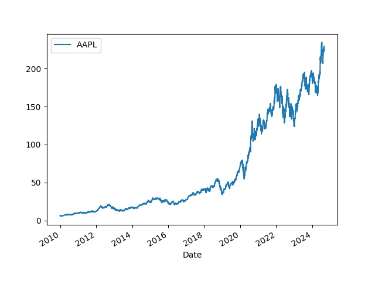

# S&P 500 Verisi

Sürekli İnternet'ten senet verisi almak istenmezse bu veri önceden
indirilip yerel veri tabanında saklanabilir.. Her günün kapanış
fiyatları bir şekilde veriyi her gün eklenirse elimizde canlı, güncel
bir veri tabanı olacaktır. Veriyi arka arka okuması gereken al/sat
stratejileri İnternet verisi yerine yerel veriyi kullanır.

ABD The Standard and Poor's 500, ya da S&P 500 bir indistir, ABD
piyasalarındaki 500 tane en büyük şirketin senet fiyatlarını yansıtır.
Bu indisin kapsadığı sembolleri almak için

```python
import pandas as pd
DATA = "/opt/Downloads/alldata/sp500"
link = ("https://en.wikipedia.org/wiki/List_of_S%26P_500_companies#S&P_500_component_stocks")
df = pd.read_html(link, header=0)[0]
df.to_csv(DATA + "/spy-tickers.csv", index=False)
```

Bir csv dosyasına bu sembolleri yazmış olduk. Üstteki `read_html` çağrısına dikkat,
Pandas bir HTML sayfasını bile okuyup `DataFrame` haline çevirebiliyor.

Tarihi veriyi bu semboller için biz daha önce Yahoo Finance sitesinden
indirdik, mesela Apple seneti için, 2010 ve 2024 Eylül arasındaki
tarihler için,

```python
import pandas as pd
df = pd.read_csv(DATA + "/2010-2024/AAPL.csv")
df.tail(5)
```

```text
Out[1]: 
            Date   Adj Close
3685  2024-08-23  226.839996
3686  2024-08-26  227.179993
3687  2024-08-27  228.029999
3688  2024-08-28  226.490005
3689  2024-08-29  229.789993
```

Bu veriler ilk indirim, yerel tabanı bu verilerle önce dolduracağız. Veri tabanını
yaratalım, SQlite tabanı olacak, başlangıç verilerinin olduğu dizindeki tüm
CSV dosyaları okunup tabana yüklenecek,

```python
import sqlite3, glob, os

def db_conn():
    db_file = DATA + "/sp500.db"
    conn = sqlite3.connect(db_file)    
    return conn

def db_create():
    conn = db_conn()
    c = conn.cursor()
    res = c.execute('''DROP TABLE IF EXISTS TICKER; ''')
    res = c.execute('''CREATE TABLE TICKER (dt INTEGER, sym TEXT, c NUMERIC, PRIMARY KEY (dt, sym)); ''')
```

Veri tabanı tasarımında tarih `dt` bir tam sayı olarak yazıldı, eğer
tarihleri 20240101 şeklinde yazarsak büyüktür, küçüktür filtreleme
operasyonu hala düzgün çalışacaktır, çünkü mesela 20240201 sayısı
20240101 sayısından büyüktür, 20250101 onlardan da büyüktür, vs.

İlk verileri yükleyelim,

```python
def db_load_2010():
    conn = db_conn()    
    cursor = conn.cursor()
    dir = "2010-2024"
    for file in glob.glob(DATA + "/" + dir + "/*"):
        print (file)
        df = pd.read_csv(file)
        sym = os.path.basename(file).replace(".csv","")
        for idx,row in df.iterrows():
            dt = int(row['Date'].replace("-",""))
            c = float(row['Adj Close'])
            cursor.execute('''INSERT INTO TICKER (dt,sym,c) VALUES (?,?,?)''', (dt,sym,c))
        conn.commit()        
```

Şimdi artıksal, güncelleme dosyalarına gelelim. Bu dosyalar farklı bir
dizinde olur, her gün için ayrı bir CSV, dosya içinde sembol, kapanış
fiyatı verisi bulunur.  Mesela Eylül 3 için,

```python
df = pd.read_csv(DATA + "/2024/09/2024-09-03.csv")
df.tail(5)
```

```text
Out[1]: 
      AJG   294.49
497   ABT   114.66
498   CNC    80.23
499   XYL   130.71
500  FICO  1688.41
501   NVR  9053.67
```

Artıksal dosyaları yüklemek için

```python
def db_load_inc(dir):
    conn = db_conn()    
    cursor = conn.cursor()
    gdir = DATA + "/" + dir + "/**/*.csv"
    for file in glob.glob(gdir,recursive=True):        
        dt = os.path.basename(file).replace(".csv","")
        dt = dt.replace("-","")
        cursor.execute('''DELETE FROM TICKER where dt = ?''', (dt,))
        conn.commit()        
        df = pd.read_csv(file,header=None)
        for idx,row in df.iterrows():
            sym, c = row[0], row[1]
            print (dt,sym,c)
            cursor.execute('''INSERT INTO TICKER (dt,sym,c) VALUES (?,?,?)''', (dt,sym,c))
        conn.commit()        

```

Parametre olarak dizin veriliyor, fonksiyon o dizin altında özyineli olarak hangi CSV
dosyasını bulursa okuyup yüklüyor, üstteki veri için

```python
db_load_inc(DIR + "/2024/09")
```

diyebilirdik. Ayrıca kod her gün dosyasını yüklemeden önce o günün
kayıtlarını bulursa siler, yani aynı artıksal dosyalar üzerinde birden
fazla yükleme çağrısı yapılabilir.

Artık veriyi okuyabiliriz. Bir sembol listesi ve başlangıç yılı kullanarak
istediğimiz SP 500 verisini bir zaman serisi olarak alabiliyoruz,

```python
def get_db_tickers(year, tickers):
    c = db_conn().cursor()
    year = int(str(year) + "0101")
    dfs = []
    for ticker in tickers:
        rows = c.execute("SELECT dt,c from TICKER where sym = ? and dt >= ?", (ticker,year))
        df = pd.DataFrame(rows.fetchall(),columns=['dt',ticker])
        df['dt'] = pd.to_datetime(df['dt'], format='%Y%m%d')
        df = df.set_index('dt')
        dfs.append(df)
    df = pd.concat(dfs,axis=1)
    return df
```

```python
df = get_db_ticker(2010, ["AAPL"])
df.plot()
```



Üstteki kodları kullanarak bizim güncel tuttuğumuz dosyalar,

[https://github.com/burakbayramli/alldata](https://github.com/burakbayramli/alldata)

adresinde, `sp500` alt dizini altında bulunabilir. Bu Github deposunu
`git clone` indirmek ve üstteki yükleme kodlarını gerekli dizine
yönlendirmek yeterli. Artıksal dosyalar yine üstteki depoda, ek
dosyalar gerektikçe `git pull` ile aynı depo altından alınabilir,
ardından `db_load_inc` işletilir.


