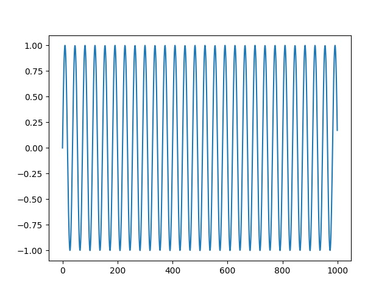

# Ses Tanima, Isleme

Veri Okuma, Yazma

Okuma islemi `scipy.io.wavfile` ile yapilabilir, tek boyutlu bir vektor
elde edilecektir. Bir ornek gorelim,

```python
import scipy.io.wavfile
tmp, wav1 = scipy.io.wavfile.read('phonemes/ow.wav')
plt.plot(wav1)
plt.savefig('ses_01.jpg')
```

Bu ses dosyasini komut satirinda calmak icin `aplay` ya da `ffmpeg`
kullanilabilir. 

Eger elde tek boyutlu bir ses verisi varsa diske yazmak icin `scipy.io.wavfile.write`,

```python
wav1tmp = wav1 + 1000
plt.plot(wav1tmp)
fs = 16000 
scipy.io.wavfile.write('/tmp/out1.wav', fs, np.array(wav1tmp))
```

Ilginc bir durum ses dosyasini yukari kaydirdik fakat ses calininca
hala ayni ses duyuluyor.

Fakat tüm ses verisini 100 ile bölersem, bu ``ses kısması'' demek, ses
azalir.

Ses Olusturma

Kendimiz sinus bazli sesler yaratabilirdik,

```python
import scipy.io.wavfile

fs = 16000 
T = 1.0    # seconds
t = np.linspace(0, T, int(T*fs), endpoint=False) 
x = np.sin(2*np.pi*440*t)
scipy.io.wavfile.write('/tmp/out2.wav', fs, x)
tmp, wav3 = scipy.io.wavfile.read('/tmp/out2.wav')
plt.plot(wav3[:1000])
plt.savefig('ses_02.jpg')
```



```python
fs = 16000 
T = 1.0  
t = np.linspace(0, T, int(T*fs), endpoint=False) 
x = np.abs(np.sin(2*np.pi*440*t))
t = np.linspace(0, T, int(T*fs), endpoint=False) 
x2 = np.abs(np.sin(2*np.pi*220*t))
xx = x+x2
scipy.io.wavfile.write('tmp2.wav', fs, xx)
tmp, wav4 = scipy.io.wavfile.read('/tmp/out3.wav')
plt.plot(wav4[:1000])
plt.savefig('ses_03.jpg')
```

Altta bir polis sireni örneği,

```python
y = sin(2*pi*1500*t - 100*sin(2*2*pi*t))
```

Ses Verisi Karsilastirmak

Tek boyutlu vektör olduğu için ses verisi bir tür zaman serisidir. Bu
zaman serisini bildik araçlarla karşılaştıramaz miyiz? Mesela basit
korelasyon, ya da basit Öklitsel uzaklık ölçütleri ile mesel?

Eğer ses tanıma için kullanacaksak, basit karşılaştırma yöntemleri
problem çıkartabilir. Gürültü konusunu bir kenara bıraksak, boyutsal,
genlik (amplitude) uyusşmazlık problemleri olabilir. Yani aynı ses
bazen daha yüksek genli, bazen faz olarak sağa, sola kaymış olabilir,
ya da ses verisi daha çok zamana yayılmış olabilir.


Fourier Analizi ile Sesi Sinüs Eğrilerine Ayırmak

```python
tmp, wav1 = scipy.io.wavfile.read('phonemes/ow.wav')
fs = 16000
w = list(np.fft.fft(wav1))
freqs = np.fft.fftfreq(len(w))
max_freqs = []
for i in range(20):
     idx = np.argmax(np.abs(np.array(w)))
     freq = freqs[idx]
     del w[idx]
     freq_in_hertz = abs(freq * fs)
     max_freqs.append(freq_in_hertz)
print (max_freqs)
```

```text
[444.2545920546775, 451.0892780862879, 539.9401964972235, 526.2708244340025, 519.4361384023921, 553.6095685604442, 396.41178983340455, 355.40367364374197, 177.70183682187098, 239.2140111063648, 505.7667663391713, 580.948312686886, 423.7505339598462, 512.6014523707817, 423.7505339598462, 526.2708244340025, 676.6339171294319, 567.2789406236651, 820.1623237932507, 950.0213583938488]
```

```python
T = 0.2
tmp = np.zeros((1,int(T*fs)))
for f in max_freqs: 
     t = np.linspace(0, T, int(T*fs), endpoint=False) 
     x = np.sin(2*np.pi*f*t)
     tmp += x
tmp = tmp * 500.
scipy.io.wavfile.write('tmp3.wav', fs, tmp[0])
import scipy.io.wavfile
tmp, wav11 = scipy.io.wavfile.read('tmp3.wav')
plt.plot(wav11)
plt.savefig('ses_04.png')
```

Sinussel Regresyon ile Ayirmak

```python
import statsmodels.api as sm
import pandas as pd

df = pd.DataFrame(wav1)
df.columns = ['wav']
tt = np.linspace(0,1,len(df))
for p in np.linspace(1,3,500):
   df['sin%f' % p] = np.sin(p*np.pi*df.index.astype(float))
   df['cos%f' % p] = np.cos(p*np.pi*df.index.astype(float))

X = sm.add_constant(np.array(df.drop(['wav'],axis=1)))
Y = df.wav.astype(float)
model = sm.OLS(Y,X)
results = model.fit()
print (results.params[:5])
print (results.pvalues[:5])
print ('R^2', results.rsquared)
print (len(df.columns[results.pvalues < 0.05]))
print (len(df))
```

```text
const   -1.746267e+00
x1      -3.873460e+13
x2       4.141772e+10
x3       8.071563e+13
x4      -9.792258e+12
dtype: float64
const    0.972714
x1       0.893328
x2       0.902068
x3       0.343704
x4       0.903365
dtype: float64
R^2 0.5121417785266622
48
2341
```


Kaynaklar

[1] https://github.com/talcs/simpledtw/

[2] https://github.com/slaypni/fastdtw

[3] https://cs.fit.edu/~pkc/papers/tdm04.pdf

[4] https://rtavenar.github.io/blog/dtw.html

[5] https://medium.com/walmartglobaltech/time-series-similarity-using-dynamic-time-warping-explained-9d09119e48ec

[6] Bayramli, Zaman Serileri, Finans, Sezonsallık, Periyotlar

[7] <a href="https://www.dropbox.com/scl/fi/7bjyicydyyurizi314qp8/google_voice_small.zip?rlkey=l5ibbx480jld79exvkwih3szr&st=ni9ibhbs&dl=1">Ufak Ses Komut Verisi</a>
    
