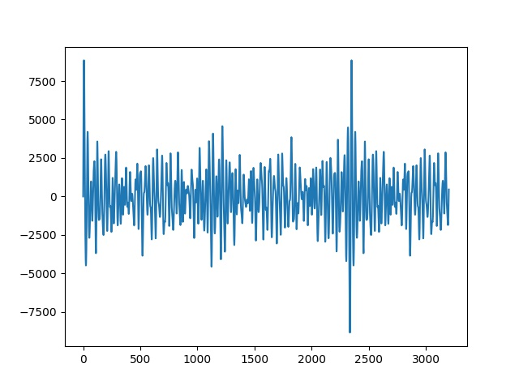

# Ses Tanıma, İşleme - 1

Veri Okuma, Yazma

Okuma işlemi `scipy.io.wavfile` ile yapılabilir, tek boyutlu bir vektör
elde edilecektir. Bir örnek görelim,

```python
import scipy.io.wavfile
tmp, wav1 = scipy.io.wavfile.read('phonemes/ow.wav')
tmp, wav2 = scipy.io.wavfile.read('phonemes/ao.wav')
fig, axs = plt.subplots(2)
axs[0].plot(wav1)
axs[1].plot(wav2)
plt.savefig('ses_01.jpg')
```


Ses verisi sonuçta bir zaman serisidir. Şekil olarak iki temel sesin
(fonem) birbirinden farkı görülebiliyor.

Bu ses dosyalarını komut satırında çalmak için `aplay` ya da `ffmpeg`
kullanılabilir.

Eğer elde tek boyutlu bir ses verisi varsa diske yazmak için
`scipy.io.wavfile.write`,

```python
fs = 16000 
wav1tmp = wav1 + 1000
scipy.io.wavfile.write('/tmp/out1.wav', fs, np.array(wav1tmp))
```

İlginç bir durum ses dosyasını yukarı kaydırdık fakat ses çalınınca
hala aynı ses duyuluyor.

Fakat tüm ses verisini 100 ile bölersem, bu ``ses kısması'' demek, ses
azalır.

Ses Oluşturma

Kendimiz sinüs bazlı sesler yaratabilirdik,

```python
import scipy.io.wavfile

fs = 16000 
T = 1.0    # seconds
t = np.linspace(0, T, int(T*fs), endpoint=False) 
x = np.sin(2*np.pi*440*t)
scipy.io.wavfile.write('/tmp/out2.wav', fs, x)
tmp, wav3 = scipy.io.wavfile.read('/tmp/out2.wav')
plt.plot(wav3[:1000])
plt.savefig('ses_02.jpg')
```


```python
fs = 16000 
T = 1.0  
t = np.linspace(0, T, int(T*fs), endpoint=False) 
x = np.abs(np.sin(2*np.pi*440*t))
t = np.linspace(0, T, int(T*fs), endpoint=False) 
x2 = np.abs(np.sin(2*np.pi*220*t))
xx = x+x2
scipy.io.wavfile.write('/tmp/out2.wav', fs, xx)
tmp, wav4 = scipy.io.wavfile.read('/tmp/out2.wav')
plt.plot(wav4[:1000])
plt.savefig('ses_03.jpg')
```


Altta bir polis sireni örneği,

```python
y = sin(2*pi*1500*t - 100*sin(2*2*pi*t))
```

Beyaz Gürültü

```
fs = 16000 
y = np.random.randn(fs*10).astype(np.float32)
scipy.io.wavfile.write('/tmp/out4.wav', fs, y)
```

Ya da

```python
from scipy import stats
sample_rate = 44100
length_in_seconds = 3
amplitude = 11
noise = stats.truncnorm(-1, 1, scale=min(2**16, 2**amplitude)).rvs(sample_rate * length_in_seconds)
scipy.io.wavfile.write('/tmp/noise.wav', sample_rate, noise.astype(np.int16))
```

Ses Verisini Karşılaştırmak

Ses verisi bir tür zaman serisi olduğuna göre bu zaman serisini bildik
araçlarla karşılaştıramaz mıyız? Mesela basit korelasyon, ya da basit
Öklitsel uzaklık ölçütleri ile bir mesafe irdelemesi kullansak olmaz
mi acaba?

Eğer amaç ses tanıma ise, basit karşılaştırma yöntemleri problem
çıkartabilir. Standart karşılaştırma metotları aynı boyutlarda ve
zaman dilimleri birbirine uyan veriyi bekler. Fakat gürültü konusunu
bir kenara bıraksak, boyutsal, genlik (amplitude) uyuşmazlık
problemleri olabilir. Yani aynı ses bazen daha yüksek genli, bazen faz
olarak sağa, sola kaymış olabilir, ya da ses verisi daha çok zamana
yayılmış olabilir. Bu tür veri durumlarında, özellikle ses
karşılaştırmasında Dinamik Zaman Eğriltmesi (Dynamic Time Warping
-DTW-) metotu var.

Dinamik Zaman Eğriltmesi


DTW ile iki zaman serisi arasında bir eşleme aranır, öyle ki optimal
eşleme üzerinden iki zaman serisi arasındaki toplam mesafe en minimal
olsun. Eğriltme metaforu niye kullanılmış resme bakınca anlıyoruz, bir
serideki her zaman dilimi birebir diğer serideki aynı zaman noktasına
eşlenmiyor, serilerin arasında kayma, büyüme, küçülme olabileceği
beklentisi ile eşleme farklı şekillerde olabiliyor, eşlemede "eğrilme"
görülebiliyor. Hatta bazen aynı zaman noktası diğer serideki birkaç
farklı noktaya bile eşlenebiliyor!

Bahsedilen eşlemenin bulunması bir arama gerektirir, pek çok seçenek
arasından arama yapılmalıdır, ve bu arama, $M$ ve $N$ büyüklüğündeki
iki zaman serisi için başlangıç DTW algoritmasında $O(M N)$
karmaşıklığına [1] sebep olur. Bu arama çok daha fazla yavaşlığa
sahip olabilirdi, fakat dinamik programlama ile bu süre biraz daha
kısaltılabiliyor. Detaylar için [1,4,5].

Standart DTW algoritması `simpledtw.py` içinde bulunabilir. Kullanım örneği,

```python
import simpledtw

series_1 = [1, 2, 3, 2, 2.13, 1]
series_2 = [1, 1, 2, 2, 2.42, 3, 2, 1]
series_3 = [4, 3, 1, 9, 9.2, 1, 1, 1]
matches, cost, mapping_1, mapping_2, matrix = simpledtw.dtw(series_1, series_2)
print (cost)
matches, cost, mapping_1, mapping_2, matrix = simpledtw.dtw(series_1, series_3)
print (cost)
```

```text
0.5499999999999998
18.94
```

Ses verileri için aynı işlemi uygulayabiliriz,

```python
import scipy.io.wavfile
tmp, wav1 = scipy.io.wavfile.read('phonemes/b.wav')
tmp, wav2 = scipy.io.wavfile.read('phonemes/d.wav')
tmp, wav3 = scipy.io.wavfile.read('phonemes/ay.wav')
```

```python
matches, cost, mapping_1, mapping_2, matrix = simpledtw.dtw(wav1, wav2)
print (cost)
matches, cost, mapping_1, mapping_2, matrix = simpledtw.dtw(wav1, wav3)
print (cost)
```

```
856568.0
3479812.0
```

Üstteki işlemin biraz yavaş işlediği farkedilebilir, bunun sebebi
karmaşıklığın $O(MN)$ ya da aşağı yukarı benzer uzunluktaki seriler
için $O(M^2)$ olması. Karesel karmaşıklık hep kaçınmaya uğraştığımız
bir durum, mümkün olduğu kadar $O(M)$'e yakın olmak isteriz.

Hızlandırma amaçlı bir algoritma FastDTW [2,3] yaklaşımı, $O(M)$
karmaşıklığına sahiptir. Kodlaması `fastdtw.py` içinde. Aynı veriler
üzerinde kullanalım,

```python
from scipy.spatial.distance import euclidean
import fastdtw

distance, path = fastdtw.fastdtw(wav1, wav2, dist=euclidean)
print (distance)
distance, path = fastdtw.fastdtw(wav1, wav3, dist=euclidean)
print (distance)
```

```text
865169.0
3619304.0
```

Bu çağrının çok daha hızlı işlediğini göreceğiz.

Ses komut örnekleri üzerinde aynı programı işletelim (diğer komut ses
dosyaları [7] zip dosyasında var). Bu komutlardan ilk ikisi farklı
konuşmacıların söylediği "bed" kelimesi, üçüncüsü "down" kelimesi.
Acaba birinci ses komut dosyası 2'inci ve 3'üncü arasından hangi ses
zaman serisine daha yakın çıkacak?

```python
tmp, wav1 = scipy.io.wavfile.read('vcommand/fb24c826_nohash_0.wav')
tmp, wav2 = scipy.io.wavfile.read('vcommand/fb7c9b3b_nohash_2.wav')
tmp, wav3 = scipy.io.wavfile.read('vcommand/fda46b78_nohash_1.wav')

distance, path = fastdtw.fastdtw(wav1, wav2, dist=euclidean)
print (distance)
distance, path = fastdtw.fastdtw(wav1, wav3, dist=euclidean)
print (distance)
```

```text
10319233.0
19032652.0
```

İkinciye daha yakın çıktı, bu iyi bir sonuç.

Javascript

JS dilinde DTW için [8] kodu faydalı olabilir, indirip üst dizin
seviyesinde

```javascript
var dtw = require('./src/dynamic-time-warping.js');

var ser1 = [ 9, 93, 15, 19, 24 ];
var ser2 = [ 31, 97, 81, 82, 39 ];
var distFunc = function( a, b ) {
    return Math.abs( a - b );
};

var dtw = new dtw.DynamicTimeWarping(ser1, ser2, distFunc);
var dist = dtw.getDistance();
console.log(dist);
```

şeklinde yazdığımız test başarılı sonuç verdi. 

Fourier Analizi ile Sesi Sinüs Eğrilerine Ayırmak

```python
tmp, wav1 = scipy.io.wavfile.read('phonemes/ow.wav')
fs = 16000
w = list(np.fft.fft(wav1))
freqs = np.fft.fftfreq(len(w))
max_freqs = []
for i in range(20):
     idx = np.argmax(np.abs(np.array(w)))
     freq = freqs[idx]
     del w[idx]
     freq_in_hertz = abs(freq * fs)
     max_freqs.append(freq_in_hertz)
print (max_freqs)
```

```text
[444.2545920546775, 451.0892780862879, 539.9401964972235, 526.2708244340025, 519.4361384023921, 553.6095685604442, 396.41178983340455, 355.40367364374197, 177.70183682187098, 239.2140111063648, 505.7667663391713, 580.948312686886, 423.7505339598462, 512.6014523707817, 423.7505339598462, 526.2708244340025, 676.6339171294319, 567.2789406236651, 820.1623237932507, 950.0213583938488]
```

```python
T = 0.2
tmp = np.zeros((1,int(T*fs)))
for f in max_freqs: 
     t = np.linspace(0, T, int(T*fs), endpoint=False) 
     x = np.sin(2*np.pi*f*t)
     tmp += x
tmp = tmp * 500.
scipy.io.wavfile.write('/tmp/out3.wav', fs, tmp[0])
import scipy.io.wavfile
tmp, wav11 = scipy.io.wavfile.read('/tmp/out3.wav')
plt.plot(wav11)
plt.savefig('ses_04.jpg')
```




Sinüssel Regresyon ile Ayırmak

```python
import statsmodels.api as sm
import pandas as pd

df = pd.DataFrame(wav1)
df.columns = ['wav']
tt = np.linspace(0,1,len(df))
for p in np.linspace(1,3,500):
   df['sin%f' % p] = np.sin(p*np.pi*df.index.astype(float))
   df['cos%f' % p] = np.cos(p*np.pi*df.index.astype(float))

X = sm.add_constant(np.array(df.drop(['wav'],axis=1)))
Y = df.wav.astype(float)
model = sm.OLS(Y,X)
results = model.fit()
print (results.params[:5])
print (results.pvalues[:5])
print ('R^2', results.rsquared)
print (len(df.columns[results.pvalues < 0.05]))
print (len(df))
```

```text
const   -1.746267e+00
x1      -3.873460e+13
x2       4.141772e+10
x3       8.071563e+13
x4      -9.792258e+12
dtype: float64
const    0.972714
x1       0.893328
x2       0.902068
x3       0.343704
x4       0.903365
dtype: float64
R^2 0.5121417785266622
48
2341
```


Kaynaklar

[1] <a href="https://github.com/talcs/simpledtw">SimpleDTW</a>

[2] <a href="https://github.com/slaypni/fastdtw">FastDTW Kod</a>

[3] <a href="https://cs.fit.edu/~pkc/papers/tdm04.pdf">FastDTW Makale</a>

[4] Tavenard, <a href="https://rtavenar.github.io/blog/dtw.html">An introduction to Dynamic Time Warping</a>
    
[5] Mishra, <a href="https://medium.com/walmartglobaltech/time-series-similarity-using-dynamic-time-warping-explained-9d09119e48ec">Time Series Similarity Using Dynamic Time Warping -Explained</a>

[6] Bayramlı, Finans ve Zaman Serileri - Sezonsallık, Periyotlar

[7] <a href="https://www.dropbox.com/scl/fi/7bjyicydyyurizi314qp8/google_voice_small.zip?rlkey=l5ibbx480jld79exvkwih3szr&st=ni9ibhbs&dl=1">Ufak Ses Komut Verisi</a>

[8] Lesti, <a href="https://github.com/GordonLesti/dynamic-time-warping">dynamic-time-warping</a>
