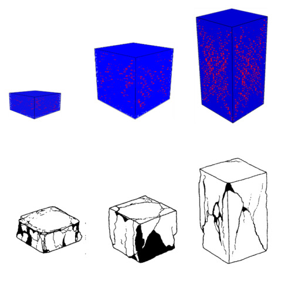
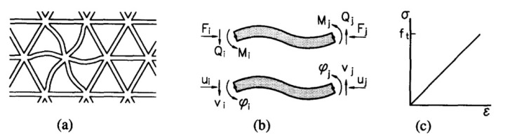
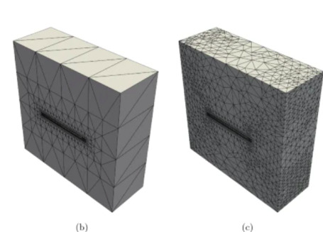

# Kırılma, Çatlama (Fracture) Analizi, FEM

Üç boyutta birbirine bağlı kirişlerin dinamiği [1] notları dersler
5-11'de incelendi. Özelde uzay çatıları / çerçeveleri (space frame)
yapılarına bakıldı, bu yapıların hissetiği kuvvetleri sonlu öğeler
metotu (finite element method) ile hesaplayabildik.

Aslında bu metotu kullanarak bütünsel, tek bir maddenin yüklenmesi
durumunda nasıl davranacağını da bulabiliriz. Araştırmacı Schlangen ve
onun grubu şöyle bir faraziye yaptılar [2,3], acaba bütünsel bir
maddeyi belli düğümler üzerinden kirişlerle bağlı bir uzay çatısı
olarak göremez miyiz?

Bu sorunun cevabı en azından kırılma, çatlama analizi bağlamında,
evet. Araştırmacılar probleme şöyle yaklaştılar; bir maddeyi al, ona
dıştan uygulanan yükün iç yansımasının hesabını o madde içinde sanki
birbirine bağlı kirişlerden oluşuyormuş gibi yap, ve sonuçları bu
şekilde bildir. Çatlama, kırılma noktalarını bulmak için kullanılan
numara şöyle, bir döngü içinde her kirişe teker teker bak, eğer o
kiriş tek başına dayanabileceği yük sınırını geçmiş ise o kirişi
sistemden çıkar. Bu hesapsal çıkartma, o noktada kırılma, çatlamayı
simüle eder, döngünün bir sonraki aşamasında hesaba bu eksik şekilde
devam edilir, ve belki de kopuş farklı öğelerde de görülecektir, amaç
çatlamanın yayılması (crack propagation) durumunu saptamaktır.

Üstteki resimlerde sanal (mavi renkli bloklar) ve gerçek çatlamalar
(alt grup) görülüyor.

İki boyutta kullanılan izgara (mesh) yapısı üstte. 

Uzay çerçevesi hesapsal amaçlı, sanal olarak yaratılıyor, bu
çerçevenin düğüm ve bağlantı yapısı herhangi bir şekilde
oluşturalabilir, ızgara yapısı programcı tarafından seçilecektir.
Fakat bilimsel hesaplama alanında ızgara kullanımı bilinmez bir şey
değil, pek çok analitik formülü gerçek dünyada çözmek için bir sanal
ızgara yaratma tekniği kullanılır. Buradaki bir ek özellik ızgara
sisteminin materyel mekaniği literatüründe direk bir karşılığının olması.

Üç boyuttaki ızgara yapısını üstteki resimde görebiliyoruz.

Hesapsal bir ek numara "kopmuş" kirişlerden sonra ortaya çıkan
sistemde hesaplara devam etmek için kullanılır. [1] derslerinde
gördüğümüz üzere bir kiriş sistemini çözmek için lineer cebir $Ax=b$
çözme yaklaşımını kullanırız. Fakat eğer bir kiriş sistemden
çıkartılırsa yeni sistemi çözmek için baştan sonra tüm $Ax=b$
sistemini çözmeye gerek yoktur, çünkü yeni sistem eskisinden çok
farklı olmayacaktır, bu sebeple özyineli bir şekilde eski değerleri
baz alarak onları yeni sistem için güncelleyen bir çözüm metotu daha
hızlı olur. [4] yazısında tarif edilen yaklaşım tam da böyle bir lineer
cebir tekniğini gösteriyor.

Kaynaklar

[1] Bayramli, Fizik, <a href="../../../phy/index.html">Fizik</a>

[2] Qian, <a href="https://www.researchgate.net/publication/254870129_Multiscale_Modeling_of_Fracture_Processes_in_Cementitious_Materials">Multiscale Modeling of Fracture Processes in Cementitious Materials</a>
    
[3] Schlangen, Garboczi, <a href="https://www.sciencedirect.com/science/article/abs/pii/S0013794497000106">Fracture simulations of concrete using lattice models: Computational aspects</a>

[4] <a href="../../2024/01/beam_lattice_superposition_cg_sparse.html">Üstdüşümlü Matris Sistemini Çözmek</a>

