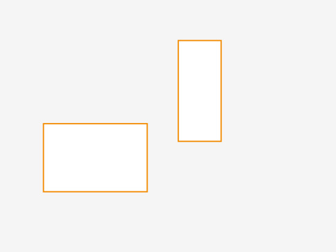
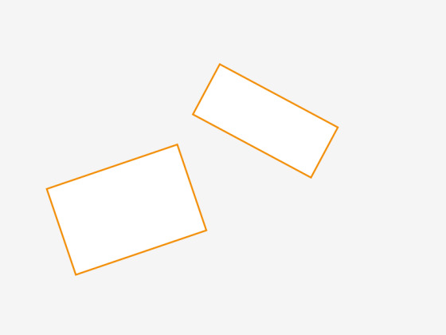
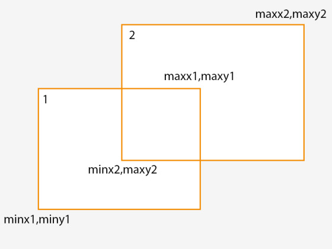
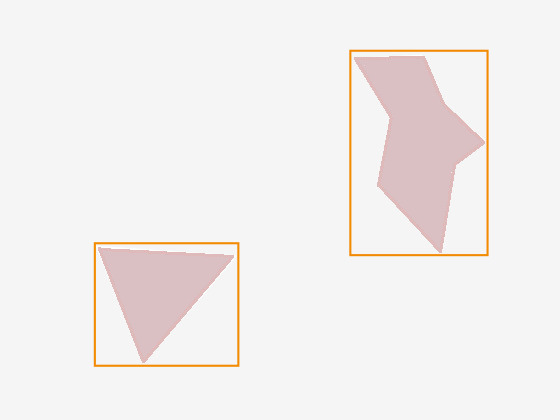

# AABB Ağaçları ile Çarpışma Saptamasına Giriş

James Randall (içerik [Wayback Machine](https://web.archive.org/web/20170821173618/https://www.azurefromthetrenches.com/introductory-guide-to-aabb-tree-collision-detection/) ile kurtarıldı, tercüme edildi)

Bir [oyun] dünyasına hareket eden obbjeler veya herhangi bir şey
eklediğiniz anda, çarpışmaları tespit etmeyi düşünmeye başlarsınız ve
bunu verimli bir şekilde yapmak, farklı yaklaşımların farklı koşullar
için az ya da çok optimal olmasıyla birlikte ilginç bir geliştirme
alanı olmaya devam eder. Bu aslında bir mekansal organizasyon
problemidir. Bu nedenle, "çarpışma tespiti, bunun bana ne faydası
var?" diye düşünebilseniz de, benzer indeksleme yaklaşımlarının
oyunları içermeyen benzer soruları yanıtlamada nasıl faydalı
olabileceğini görmek zor değildir. Benzer şekilde, örneğin A*
algoritması geleneksel olarak bir oyun algoritması olarak düşünülse
de, kendimi onu oyun dışı bazı çok ilginç alanlarda kullanırken
buldum.

Benim [motorumdaki] objeler arasındaki çarpışmalar söz konusu
olduğunda, belirsiz, ancak esasen çok büyük ve çoğunlukla seyrek, üç
boyutlu bir alana yayılmış, toplamda milyonlarca parçadan oluşan
yüzlerce nesneyi dikkate almam gerekiyor. Bu objelerin her biri
arasındaki mükemmel çakışma tespitinin çok maliyetli olacağı bellidir
ve bu yüzden çarpışma tespiti tipik olarak iki aşamaya ayrılır:

Kaba hatlı çarpışma saptamasi – muhtemel çarpışmaların kısa bir
listesini hızla çıkarmaktır. Detaylı çarpışmalar – kaba hatlı adımdan
kaynaklanan muhtemel çarpışmaları filtreleyerek gerçek piksel /
[nesne] bazında mükemmel çarpışmalara indirgemek için ek detay
kullanır. Motorumdaki kaba problemi çözmeye yönelik ilk denemem yaygın
bir yöntemdir ve iki kutunun (2D veya 3D) kesişip kesişmediğini
belirlemenin, kutuların eksenlere hızalı olmasına dayanan verimli bir
yolundan yararlanır – bu nedenle eksenlere hızalı sınırlayıcı kutu
(axis aligned bounding box) veya AABB denir. Eğer bu kulağa karmaşık
geliyorsa – endişelenmeyin, daha sonra açıklayacağım.

Bunun Internet'te birçok uygulaması ve çeşitli blog yazıları ile
eğitimleri mevcuttur ancak hepsini bir araya getiren bir şey bulamadım
ve bu nedenle aşağıda, AABB'lere ve kesişimleri hızla belirlemek için
bunların bir ağaç yapısında nasıl sıralanacağına dair adım adım bir
kılavuz yazdım. Motorumdaki C++ uygulamasında örnek kod sağlanmıştır
ve bu yazının sonunda bunu (sadece AABB ağaç uygulamasını) kendi
kodunuzda nasıl kullanabileceğinizi açıklıyorum. Ancak bu yazı daha
çok teoriyle ilgilidir ve bunu anladığınızda basit bir uygulamanın
oldukça kolay olduğunu göreceksiniz (ancak işleri karmaşıklaştırabilen
çok sayıda optimizasyon vardır; bunların bazıları örnek kodumda
mevcut, bazıları ise değildir).

Bu kılavuzu basit tutmak amacıyla, 3 boyutlu kutular yerine 2 boyutlu
kutular (dikdörtgenler) ile konuşacağım ancak 3. boyutu eklemek için
kelimenin tam anlamıyla sadece 3. boyutu eklemeniz yeterlidir. Aşağıda
x ve y'nin geçerli olduğu her yerde, x ve y için olan aynı örüntüyü
takip ederek z'yi ekleyin. Umarım bu durum örnek kodda açıktır...

### AABB'ler Nedir?

AABB'ler , göründüklerinden daha basittirler – esasen eksenleri (2D
için x,y ve 3D için x,y,z) aynı yönde hızalanan ve uzanan
kutulardır. İsimdeki "sınırlayıcı" (bounding) kısmı, çarpışma tespiti
için veya bir ağacın parçası olarak kullanıldıklarında genellikle
diğer kutuları içermelerinden veya sınırlamalarından
kaynaklanır. Aşağıdaki diyagram, iki basit ve uyumlu AABB'yi
göstermektedir:



Buna karşılık, aşağıdaki diyagramda gösterilen iki kutu, eksenleri
hizalanmadığı için AABB değildir:



Bir AABB'nin temel bir özelliği, kapladığı alanın 2 veya 3 boyutlu
uzayda olmasına bakılmaksızın 2 nokta ile tanımlanabilmesidir. 2
boyutlu bir uzayda bu 2 nokta (minx, miny) ve (maxx, maxy)'dir.

Bu, iki AABB'nin kesişip kesişmediğini çok hızlı bir şekilde kontrol
etmek için kullanılabilir. Aşağıdaki diyagramdaki iki AABB'yi ele
alalım:



Bu diyagramda, bir çift nokta ile tanımlanan iki AABB'miz var ve
aşağıdaki ifadenin sonucu, kesişip kesişmediklerini belirleyebilir:

```
maxx1 > minx2 && minx1 < maxx2 && maxy1 > miny1 && miny1 < maxy2
```

Bu ifadeyle ilgili dikkat edilmesi gereken önemli bir nokta, bir dizi
've' (and) işleminden oluşmasıdır, bu da koşullardan biri sağlanmazsa
(false olursa) değerlendirmenin hemen duracağı anlamına gelir.

Bir oyun motorunda çalıştığım için şanslıyım çünkü oyun dünyamdaki
nesneler doğal olarak eksen hizalıdır: [nesneler] esasen 3 boyutlu
pikseller veya küçük küplerdir. Ancak ya nesneleriniz doğal olarak
hizalı değilse veya kutular dışında şekillerden oluşuyorsa? İşte
burada AABB'nin sınırlayıcı kısmı devreye girer, çünkü aşağıdaki
diyagramda gösterildiği gibi karmaşık şekli kapsayan bir sınırlayıcı
kutu oluşturmanız gerekir:



Açıkçası, AABB'leri kesişim için test etmek piksel hassasiyetinde
çarpışma tespitiyle sonuçlanmayacaktır, ancak AABB kullanmanın
birincil amacının sürecin geniş kapsamlı (broad phase) kısmında
olduğunu unutmayın. Yukarıdaki diyagramdaki iki AABB'nin kesişmediğini
hızlı ve ucuza belirledikten sonra, iki karmaşık şeklin kesişip
kesişmediğini anlamaya çalışmanın hesaplama maliyetinden kendimizi
kurtarabiliriz.


