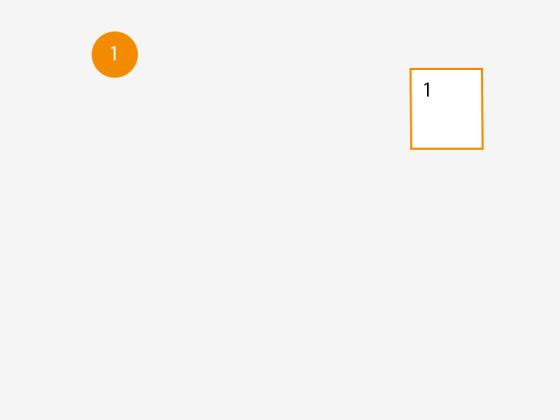
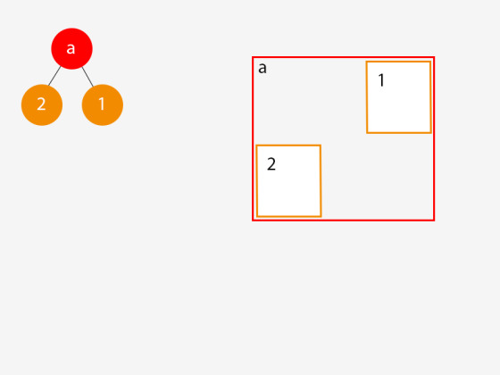
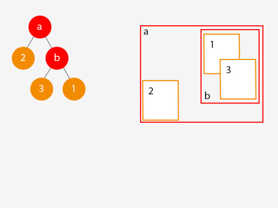
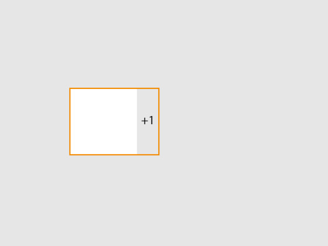

# AABB Ağaçları ile Çarpışma Saptamasına Giriş

[James Randall](aabb-randall.html) 

Bir [oyun] dünyasına hareket eden objeler veya herhangi bir şey
eklediğiniz anda, çarpışmaları tespit etmeyi düşünmeye başlarsınız ve
bunu verimli bir şekilde yapmak, farklı yaklaşımların farklı koşullar
için az ya da çok optimal olmasıyla birlikte ilginç bir geliştirme
alanı olmaya devam eder. Bu aslında bir mekansal organizasyon
problemidir. Bu nedenle, "çarpışma tespiti, bunun bana ne faydası
var?" diye düşünebilseniz de, benzer indeksleme yaklaşımlarının
oyunları içermeyen benzer soruları yanıtlamada nasıl faydalı
olabileceğini görmek zor değildir. Benzer şekilde, örneğin A*
algoritması geleneksel olarak bir oyun algoritması olarak düşünülse
de, kendimi onu oyun dışı bazı çok ilginç alanlarda kullanırken
buldum.

Benim [motorumdaki] objeler arasındaki çarpışmalar söz konusu
olduğunda, belirsiz, ancak esasen çok büyük ve çoğunlukla seyrek, üç
boyutlu bir alana yayılmış, toplamda milyonlarca parçadan oluşan
yüzlerce nesneyi dikkate almam gerekiyor. Bu objelerin her biri
arasındaki mükemmel çakışma tespitinin çok maliyetli olacağı bellidir
ve bu yüzden çarpışma tespiti tipik olarak iki aşamaya ayrılır:

Kaba hatlı çarpışma saptaması – muhtemel çarpışmaların kısa bir
listesini hızla çıkarmaktır. Detaylı çarpışmalar – kaba hatlı adımdan
kaynaklanan muhtemel çarpışmaları filtreleyerek gerçek piksel /
[nesne] bazında mükemmel çarpışmalara indirgemek için ek detay
kullanır. Motorumdaki kaba problemi çözmeye yönelik ilk denemem yaygın
bir yöntemdir ve iki kutunun (2D veya 3D) kesişip kesişmediğini
belirlemenin, kutuların eksenlere hizalı olmasına dayanan verimli bir
yolundan yararlanır – bu nedenle eksenlere hizalı sınırlayıcı kutu
(axis aligned bounding box) veya AABB denir. Eğer bu kulağa karmaşık
geliyorsa – endişelenmeyin, daha sonra açıklayacağım.

Bunun Internet'te birçok uygulaması ve çeşitli blog yazıları ile
eğitimleri mevcuttur ancak hepsini bir araya getiren bir şey bulamadım
ve bu nedenle aşağıda, AABB'lere ve kesişimleri hızla belirlemek için
bunların bir ağaç yapısında nasıl sıralanacağına dair adım adım bir
kılavuz yazdım. Motorumdaki C++ uygulamasının örnek kodu sağlanmıştır
ve bu yazının sonunda bunu (sadece AABB ağaç uygulamasını) kendi
kodunuzda nasıl kullanabileceğinizi açıklıyorum. Ancak bu yazı daha
çok teoriyle ilgilidir ve bunu anladığınızda basit bir uygulamanın
oldukça kolay olduğunu göreceksiniz (ancak işleri karmaşıklaştırabilen
çok sayıda optimizasyon vardır; bunların bazıları örnek kodumda
mevcut, bazıları ise değildir).

Bu kılavuzu basit tutmak amacıyla, 3 boyutlu kutular yerine 2 boyutlu
kutular (dikdörtgenler) ile konuşacağım ancak 3. boyutu eklemek için
kelimenin tam anlamıyla sadece 3. boyutu eklemeniz yeterlidir. Aşağıda
x ve y'nin geçerli olduğu her yerde, x ve y için olan aynı örüntüyü
takip ederek z'yi ekleyin. Umarım bu durum örnek kodda açıktır...

### AABB'ler Nedir?

AABB'ler göründüklerinden daha basittirler – esasen eksenleri (2D için
x,y ve 3D için x,y,z) aynı yönde hızalanan ve uzanan
kutulardır. İsimdeki "sınırlayıcı" (bounding) kısmı, çarpışma tespiti
için veya bir ağacın parçası olarak kullanıldıklarında genellikle
diğer kutuları içermelerinden veya sınırlamalarından
kaynaklanır. Aşağıdaki diyagram, iki basit ve uyumlu AABB'yi
göstermektedir:


Buna karşılık, aşağıdaki diyagramda gösterilen iki kutu, eksenleri
hizalanmadığı için AABB değildir:


Bir AABB'nin temel bir özelliği, kapladığı alanın 2 veya 3 boyutlu
uzayda olmasına bakılmaksızın 2 nokta ile tanımlanabilmesidir. 2
boyutlu bir uzayda bu 2 nokta (minx, miny) ve (maxx, maxy)'dir.

Bu, iki AABB'nin kesişip kesişmediğini çok hızlı bir şekilde kontrol
etmek için kullanılabilir. Aşağıdaki diyagramdaki iki AABB'yi ele
alalım:


Bu diyagramda, bir çift nokta ile tanımlanan iki AABB'miz var ve
aşağıdaki ifadenin sonucu, kesişip kesişmediklerini belirleyebilir:

```
maxx1 > minx2 && minx1 < maxx2 && maxy1 > miny1 && miny1 < maxy2
```

Bu ifadeyle ilgili dikkat edilmesi gereken önemli bir nokta, bir dizi
've' (and) işleminden oluşmasıdır, bu da koşullardan biri sağlanmazsa
(false olursa) değerlendirmenin hemen duracağı anlamına gelir [yazarın
bahsettiği "kısa-devre değerlendirmesi" (short-circuit evaluation),
eğer bir dizi VE ifadesi var ise terimlerden biri yanlış değeri
verirse geri kalan terimleri hesaplamaya ihtiyaç yoktur çünkü VE
zincirinin tamamının doğru sonucunu vermesi için tüm ifadelerin doğru
olması gerekir, o zaman ilk yanlışta zincirden çıkılabilir (kısa devre) bu
bir hızlandırıcı tekniktir, bir tür optimizasyondur].

Bir oyun motorunda çalıştığım için şanslıyım çünkü oyun dünyamdaki
nesneler doğal olarak eksen hizalıdır: [nesneler] esasen 3 boyutlu
pikseller veya küçük küplerdir. Ancak ya nesneleriniz doğal olarak
hizalı değilse veya kutular dışında şekillerden oluşuyorsa? İşte
burada AABB'nin sınırlayıcı kısmı devreye girer, çünkü aşağıdaki
diyagramda gösterildiği gibi karmaşık şekli kapsayan bir sınırlayıcı
kutu oluşturmanız gerekir:


Tabii ki AABB'yi kesişim için test etmek piksel hassasiyetinde çarpışma
tespitiyle sonuçlanmayacaktır, ancak AABB kullanmanın birincil
amacının sürecin geniş kapsamlı (broad phase) kısmında olduğunu
unutmayın. Yukarıdaki diyagramdaki iki AABB'nin kesişmediğini hızlı ve
ucuzca belirledikten sonra, iki karmaşık şeklin kesişip kesişmediğini
anlamaya çalışmanın hesaplama maliyetinden kendimizi kurtarabiliriz.

### AABB Ağacı

Yukarıdaki yaklaşımı kullanarak, dünya uzayınızdaki iki nesne
arasındaki çarpışmaları nasıl hızlı ve kolay bir şekilde test
edebileceğimizi görebilirsiniz, ancak ya 100 nesneniz varsa? Veya
1000? Bireysel testler ne kadar verimli olursa olsun, 1000 AABB'yi
birbirleriyle karşılaştırmak maliyetli ve oldukça israflı bir işlem
olacaktır.

İşte burada AABB ağacı devreye girer. Yapılması gereken AABB kesişim
testi sayısını en aza indirmek için AABB'lerimizi organize etmemizi ve
indekslemek; AABB ağacı bunu dünyayı -tahmin edin ne kullanarak- daha
fazla AABB kullanarak, dilimleyerek yapar. Yani AABB ağacı AABB'leri
indeksler, bunun kodlamasında yardımcı olarak iç yapısında aynı AABB
kavramını kullanır.

Daha önce karşılaşmadıysanız, ağaçlar inanılmaz derecede kullanışlı
hiyerarşik veri yapılarıdır ve temel kavramın birçok çeşidi vardır,
eğer bu tür şeyler ilginizi çekiyorsa, konuyla ilgili mükemmel, ancak
oldukça resmi bir kitap Cormen'in *Algoritmaya Giriş (Introduction to
Algorithms*) kitabıdır ve devam etmeden önce yapı ve terminoloji
hakkında temel bilgi edinmeye değer.

Burada sunulan AABB ağacı durumunda kök, dal ve yaprakların çok özel
özellikleri vardır:

- Dal (Branch) – Dallarımızın her zaman tam olarak iki çocuğu (sol ve
  sağ olarak bilinir) vardır ve tüm alt öğelerini (descendants)
  içerecek kadar büyük bir AABB atanır.

- Yaprak (Leaf) – Yapraklarımız bir oyun dünyası nesnesiyle
  ilişkilidir ve bu sayede bir AABB'ye sahiptir. Bir yaprağın AABB'si
  tamamen ebeveyninin AABB'sinin içine sığmalıdır ve dallarımızın
  nasıl tanımlandığı nedeniyle bu, her ata (ancestor) AABB'sinin içine
  sığdığı anlamına gelir.

- Kök (Root) – Kökümüz bir dal veya bir yaprak olabilir.

Bunun nasıl çalıştığını göstermenin en iyi yolu, onu adım adım
gösteren bir örnektir.

### Bir AABB Ağacı Oluşturma

Boş bir dünyamız olduğunu ve dolayısıyla bu noktada ağacımızın boş
olduğunu hayal edin. Bu dünyaya ilk nesnemizi ekliyoruz. Ağacımız şu
anda boş olduğundan, yeni nesnemize karşılık gelen ve onun AABB'sini
paylaşan bir yaprak düğümü oluştururuz ve bu yaprağı kök olarak
atıyoruz:



Şimdi dünyamıza ikinci bir nesne ekliyoruz, ilk düğümümüzle kesişmiyor
ve ağacımızda ilginç bir şey oluyor:




İkinci nesneyi oyun dünyasına eklediğimizde bir dizi şey meydana geldi:

1. Ağacımız için bir dal düğümü oluşturduk ve ona hem nesne (1)'i hem
de nesne (2)'yi içerecek kadar büyük bir AABB atadık.

1. Nesne (2) için yeni bir yaprak düğümü oluşturduk ve onu yeni dal
düğümümüze bağladık.

1. Nesne (1) için orijinal yaprak düğümümüzü aldık ve onu yeni dal
düğümümüze bağladık.

1. Yeni dal düğümünü ağacın kökü yaptık.

Tamam. Oyun dünyasına başka bir nesne ekleyelim ve bu sefer mevcut bir
nesneyle kesişsin:



Yine bu nesneyi eklediğimizde ağacımızda bazı ilginç şeyler oldu:

1. Yeni bir dal düğümü (b) oluşturduk ve ona nesne (1) ve (3)'ü kapsayan
bir AABB atadık.

1. Nesne (3) için yeni bir yaprak düğümü oluşturduk ve
onu dal (b)'ye atadık.

1. Yaprak düğüm (1)'i dal düğüm (b)'nin bir çocuğu olacak şekilde
taşıdık ve bu yeni dal düğümünü (b) dal düğüm (a)'ya bağladık.

1. Bu ince ama önemli bir nokta: dal düğüm (a)'ya atanan AABB'yi, yeni
yaprak düğümünü hesaba katacak şekilde ayarladık. Eğer bunu
yapmasaydık, dal düğüm a'ya atanan AABB artık alt öğelerinin
AABB'lerini içerecek kadar büyük olmazdı.

Esasen, her yeni oyun dünyası nesnesi eklediğimizde, ağacı daha önce
tanımladığım dal ve kök düğümleri kuralları hala geçerli olacak
şekilde manipüle ederiz. Durum böyle olduğuna göre, ağaca yeni bir
oyun dünyası nesnesi eklemek için genel bir süreci tanımlayabiliriz:

1. Nesne için bir yaprak düğümü oluşturun ve ona ilişkili nesneye dayalı
bir AABB atayın.

1. Ağaçta, yeni yaprağı kardeş yapmak için en iyi mevcut düğümü
(yaprak veya dal) bulun.

1. Bulunan düğüm ve yeni yaprak için yeni bir dal düğümü oluşturun ve
ona her iki düğümü de içeren bir AABB atayın (esas olarak bulunan
düğümün ve yeni yaprağın AABB'lerini birleştirin).

1. Yeni yaprağı yeni dal düğümüne bağlayın.

1. Mevcut düğümü ağaçtan kaldırın ve yeni dal düğümüne bağlayın.

1. Yeni dal düğümünü, mevcut düğümün önceki ebeveyn düğümünün bir
çocuğu olarak bağlayın.

1. Ağaçta yukarı doğru geri giderek, tüm atalarımızın AABB'lerini,
hala tüm alt öğelerinin AABB'lerini içerdiklerinden emin olmak için
ayarlayın.

Yukarıdaki 2. adım şu soruyu akla getiriyor: Yeni yaprağı kardeş
yapmak için ağaçtaki en iyi yaprağı nasıl bulursunuz? Esasen bu,
ağaçta aşağı inip geçtiğiniz her dalın soluna veya sağına bağlanmanın
olası maliyetini değerlendirmeyi içerir. Ne kadar iyi bir karar
verirseniz, ağaç o kadar dengeli olur ve sonraki sorgular o kadar ucuz
olur.

Burada kullanılan yaygın bir sezgisel yöntem (heuristic), yeni
yaprağın AABB'sinin eklenmesi için ayarlanmış olan sol ve sağ
düğümlerin yüzey alanına bir maliyet atamak ve kendinizi bir yaprakta
bulana kadar en ucuz düğüm yönünde inmektir.

### AABB Ağacını Sorgulama

İşte tüm ağır çalışmamızın karşılığını aldığımız yer – sorgulama artık
çok basit ve çok hızlı olacak. Belirli bir AABB nesnesi için tüm olası
çarpışmaları bulmak istiyorsak, ağacın kökünden başlayarak yapmamız
gereken tek şey şudur:

1. Mevcut düğümün test nesnesinin AABB'si ile kesişip kesişmediğini
kontrol edin.

1. Eğer kesişiyorsa ve bir yaprak düğümse, bu bir çarpışmadır ve bu
yüzden onu çarpışma listesine ekleyin.

1. Eğer kesişiyorsa ve bir dal düğümse, o zaman sola ve sağa inin ve
bu işlemi özyinelemeli (recursive) olarak tekrarlayın.

1. Yukarıdakilerin sonunda listeniz, test nesneniz için tüm olası
çarpışmaları içerecektir ve test AABB ağacıyla kesişemeyecek hiçbir
yola (ve dolayısıyla sonraki tüm çocuklara) inmediğimiz için yapmamız
gereken AABB kesişim kontrolü sayısını en aza indirmiş olacağız.

Uygulamada, büyük ağaçlarda maliyetli olabileceği (ve başarısız
olabileceği) için aslında özyinelemeli bir yaklaşım kullanmamak en
iyisidir. Bunun yerine, aşağıdaki gibi daha fazla araştırılacak
düğümlerin bir yığınını / listesini tutun:

1. Kök düğümü bir yığına (stack) itin (C++'da `std::stack`
kullanıyorum)

1. Yığın boş olmadığı sürece:

   	 1. Yığından bir düğüm çıkarın (pop).
	 
	 1. Düğümün test AABB nesnesiyle kesişip kesişmediğini kontrol
	 edin.
	 
	 1. Eğer kesişiyorsa, ya:
	 
	    1. Eğer bir yaprak düğümse, bu bir çarpışma
	    eşleşmesidir. Yaprak düğümü (veya referans verdiği
	    nesneyi) çarpışma listesine ekleyin.
	    
	    1. Eğer bir dal düğümse, çocukları (sol ve sağ düğümleri)
	    yığına itin (push).

Ağaçları özyinelemesiz olarak nasıl dolaşacağınızı anlamak çok faydalı
olabilir.

### AABB Ağacını Güncelleme

Çarpışma tespiti içeren çoğu (ama hepsi değil) senaryoda, dünyadaki
nesnelerin en azından bir kısmı hareket etmektedir. Nesneler hareket
ettikçe, bu durum ağacın güncellenmesini gerektirir ve bu, dünya
nesnesine karşılık gelen yaprağın kaldırılıp yeniden eklenmesiyle
gerçekleştirilir.

Bu pahalı bir işlem olabilir ve dünya nesnelerinizin hareketini bir
hız vektörü kullanarak ifade ederseniz ve bunu ağaca eklediğiniz
AABB'leri "genişletmek" (fatten) için kullanırsanız, bunu yapmanız
gereken sayıyı en aza indirebilirsiniz. Örneğin, aşağıdaki
diyagramdaki nesneyi ele alın, (1,0) (x,y) hızına sahiptir ve
sınırlayıcı AABB'si buna göre genişletilmiştir:



AABB'leri ne kadar genişleteceğiniz; güncelleme maliyeti,
öngörülebilirlik ve geniş aralık doğruluğu arasında bir denge
meselesidir ve en iyi performansı elde etmek için denemeler yapmanız
gerekebilir.

Son olarak, ağaçlar güncellendikçe dengesiz hale gelmeleri mümkündür;
bazı sorgular uygunsuz bir şekilde diğerlerinden çok daha fazla
düğümün dolaşılmasını gerektirebilir. Bunu çözmek için bir teknik, her
düğümün yüksekliğine (alttan derinlik) dayalı rotasyonlar kullanarak
ağacı yeniden dengelemektir. Bir diğeri ise, çocuk düğümlerin ebeveyn
düğümlerinin AABB'sini ne kadar eşit böldüğüne göre ağacı
dengelemektir. Bu, başlangıç seviyesi bir rehberin kapsamının biraz
dışındadır ve henüz örnek kodda kendim uygulamadım – ancak bir noktada
buna geri dönebilirim.

Örnek Kod

Son olarak, bu blog yazısıyla birlikte gelen örnek kod bulunmaktadır
ve bunu oyun motorumda bulabilirsiniz. Motorun kendisinden oldukça
bağımsızdır ve çok fazla sorun yaşamadan kendi kodunuzda
kullanabilmelisiniz. Anahtar dosyalar şunlardır:

- [AABB.h](randall/AABB.h)
- [AABBTree.h](randall/AABBTree.h)
- [AABBTree.cpp](randall/AABBTree.cpp)
- [IAABB.h](randall/IAABB.h)
- [AABB.py](randall/AABB.py) (biz ekledik, Python tercümesi, Google Gemini 2.5 ile yapıldı)

Ağacı kullanmak için üstteki dört C++ dosyasını projenize eklemeniz ve
AABBTree sınıfının bir örneğini oluşturmanız gerekecektir – yapıcısı
(constructor) çok basittir ve başlangıç boyutunu (önceden ayrılacak
ağaç düğümü sayısı) alır. Ağaca eklemek istediğiniz herhangi bir
nesnenin, istendiğinde AABB yapısını döndürmesi gereken IAABB
arayüzünü (interface) uygulaması gerekir. Bu nesneleri sırasıyla
insertObject, updateObject ve removeObject yöntemleriyle ekleyebilir,
güncelleyebilir ve kaldırabilirsiniz ve queryOverlaps yöntemiyle
çakışmaları sorgulayabilirsiniz.
