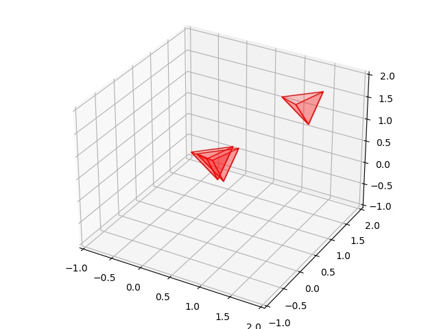

# AABB, Üçgen Kesişmesi, Hızlı Çarpışma Saptaması

```python
import sys; sys.path.append("randall")
import AABB

class Tetrahedron(AABB.IAABB):
    def __init__(self,offset):
        self.offset = offset
        self.base_tri = np.array([[ 0.2309401,  1.2309401,  0.2309401],
                                  [-0.2309401,  1.2309401, -0.2309401],
                                  [ 0.2309401,  0.7690599, -0.2309401],
                                  [-0.2309401,  0.7690599,  0.2309401]])

    def get_triangles(self):
        res = []
        res.append(self.base_tri[0:3,:] + self.offset)
        res.append(self.base_tri[1:4,:] + self.offset)
        last = np.vstack((self.base_tri[2:4,:],self.base_tri[0,:]))
        res.append(last + self.offset)
        return res

    def plot(self,ax):
        tris = self.get_triangles()
        for x in tris: 
            tri = a3.art3d.Poly3DCollection([x])
            tri.set_edgecolor('k')
            tri.set_color('red')
            tri.set_alpha(0.2)
            ax.add_collection3d(tri)

    def __repr__(self):
        return f"Tetrahedron {self.offset}"

    def get_aabb(self):
        mins = np.min(self.offset + self.base_tri,axis=0)
        maxs = np.max(self.offset + self.base_tri,axis=0)
        x,y,z,w,h,d = list(mins) + list(maxs)
        return AABB.AABB(x,y,z,w,h,d)
```

```python
tree = AABB.AABBTree(initial_size=4)

t1 = Tetrahedron(offset=np.array([0,0,0]))
tree.insert_object(t1)

t2 = Tetrahedron(offset=np.array([0.1,0,0]))
tree.insert_object(t2)

t3 = Tetrahedron(offset=np.array([1,1,1]))
tree.insert_object(t3)
```

```python
overlaps1 = tree.query_overlaps(t1)
print ('results')
for obj in overlaps1: print(f"  - Overlaps with {obj}") # Should report box2
```

```text
results
  - Overlaps with Tetrahedron [0.1 0.  0. ]
```

```python
overlaps2 = tree.query_overlaps(t1)
print ('results')
for obj in overlaps1: print(f"  - Overlaps with {obj}") # Should report box2
```

```text
results
  - Overlaps with Tetrahedron [0.1 0.  0. ]
```

```python
import mpl_toolkits.mplot3d as a3
import matplotlib.colors as colors
import pylab as pl

ax = a3.Axes3D(pl.figure())        
t1.plot(ax)
t2.plot(ax)
t3.plot(ax)

ax.set_xlim(-1,2)
ax.set_ylim(-1,2)
ax.set_zlim(-1,2)
plt.savefig('tetra_01.jpg')
```




[devam edecek]

Kaynaklar

[1] Bayramli, Green'in Teorisi, Düzlem Kesişmeleri, Eğriler,
    https://burakbayramli.github.io/dersblog/calc_multi/calc_multi_75_app/green_in_teorisi_duzlem_kesismeleri_egriler.html

[2] Randall, AABB Ağaçları ile Çarpışma Saptamasına Giriş,
    aabb-randall-tr.html


