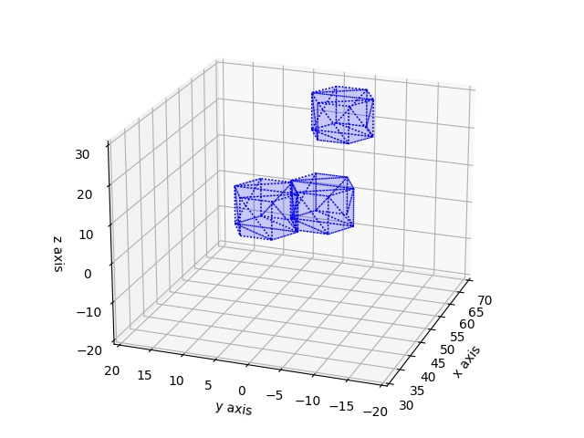

# AABB, Üçgen Kesişmesi, Hızlı Çarpışma Saptaması

Fiziksel dünyada hesaplanan bir simülasyon düşünelim, objeler var,
hareket ediyorlar, bu objelerin çarpışıp çarpışmadığını her animasyon
karesi (frame) içinde saptamamız gerekir, ki bu durumun bir sonraki
karede fiziksel sonucunu gösterelim. Çarpışan bilardo topları çarpışma
sonucu yer değiştirmelidir. Bir taşıt bir duvara çarpımışsa
durmalıdır, gibi.

İki obje arasında detaylı çarpışma hesabını yapabilen yaklaşımlar
mevcut, [1]'de bunlardan birini gördük, fakat bu hesaplar her ikili
kombinasyonuna teker teker bakmayı gerektirir, eğer irili ufaklı 1000
obje simüle ediliyorsa bu 1000 x 1000 bir milyon işlem demektir!
Çarpışmaları daha hızlı ve en detaylı şekilde acaba nasıl hesaplarız?
Burada ele alacağımız çözüm birkaç aşamadan oluşuyor olacak.

1. İlk aşama obje çiftlerinin birbirinden çarpışamayacak kadar uzak
olanları saptayarak, ya da bu objelere hiç bakmayarak, bir sonraki
fazdaki detaylı hesap yükünü azaltmak. Çarpışma saptama literatüründen
bu aşamaya genel faz (broad phase) ismi veriliyor.

1. Birbiri ile çarpışması muhtemel olan objeler bulunduktan sonra,
çarpışması muhtemel iki objenin yüzey parçalarının da birbirine uzak
olanlarını elemek.

1. İki aday obje arasındaki aday yüzey parçalarını bulduktan sonra,
artık detaylı kesişim testlerini yapabiliriz, bu testler / hesaplar
nihai kesişim noktasını bulacaktır. Bu son iki kalem literatürde
daraltılmış faz (narrow phase) olarak anılıyor.

Bu kalemlerden ilki için AABB Ağaçı yaklaşımını [2] yazısında gördük.
O yazıda verilen `AABB.py` kodunu kullanarak etrafında birer
"eksenlere hizalı sınırlayıcı kutu (axis aligned bounding box -AABB-)"
tanımlanan objeler arasında kabaca çakışma olup olmayacağını anlamak
mümkündür. AABB Ağaç yapısı içindeki AABB kutularını hızlı bir şekilde
indisleyip birbirine uzak olan objelere bakmamak için optimize
edilmiştir.

İkinci kalem için ilginç bir yaklaşım şudur, aslında AABB Ağaç
tekniğini iki aday obje arasındaki "kesişme adayı yüzey parçaları"
(çoğunlukla bu parçalar 3D üçgendir) için de kullanabiliriz.  Çünkü
aynen objeler etrafında AABB kutuları tanımlanabildiği gibi üç boyutlu
yüzey parçaları etrafında da AABB kutuları tanımlanabilir, ve mesela
bir objenin tüm yüzey parçaları bir ağaç oluşturur, ve bu ağaca artık
çarpışma adayı diğer objenin tüm yüzey parçalarını teker teker alıp
"çarpışma var mı?" diye sorabiliriz. Bu işlem de, aynen objeler
arasında olduğu gibi, birbirinden uzak olan parçalara bakmayarak
sadece aday parçalara bakarak sonuca ulaşmayı hızlandıracaktır.

Üçüncü kalemde artık uzak objeler elenmiştir, bakılan iki obje
arasında onların uzak yüzey parçaları elenmiştir, ve bakılan iki parça
arasında nihai hesap zamanı gelmiştir. Bu aşamada yüzey parçaları
üçgen ise, [1]'de görülen çizgi/üçgen kesişme hesabı kullanılabilir,
her üçgenin her kenarını bir çizgi parçası olarak alıp diğer üçgen ile
kesişmesinin testi/hesabı yapılır, bu her seferinde 6 tane işlem
demektir, hızlı bir şekilde yapılabilir.

### Objeler, AABB

Örnek obje olarak bir STL cismi [4] kullanacağız. STL cisimlerinin
yüzeyleri birbiri ile bağlı üçgen parçalarıdır, en ufak parçanın üçgen
olması çok iyi çünkü üç boyutta üçgen, çizgi kesişmeleri için elimizde
gerekli kodlar var.

Altta örnek seçilen ve yazının geri kalanında kullanılacak olan cisim
prizma heksagon'dur, [4]'teki örnek cisimler arasından
seçilmiştir. Onu grafikleyelim,

```python
from stl import mesh
from mpl_toolkits import mplot3d
figure = plt.figure()
ax = mplot3d.Axes3D(figure)
your_mesh = mesh.Mesh.from_file('../../2020/08/shapes/Prism_hexagon.stl')
obj = mplot3d.art3d.Poly3DCollection(your_mesh.vectors)
obj.set_edgecolor('k')
ax.add_collection3d(obj)
ax.set_xlim(40,60);ax.set_ylim(-5,15); ax.set_zlim(-4,20)
ax.view_init(elev=21, azim=40)
plt.savefig('coll_01.jpg')
```

```python
import pickle
print (u'dış üçgen sayısı =',len(your_mesh.vectors))
print (your_mesh.vectors.shape)
```

```text
dış üçgen sayısı = 20
(20, 3, 3)
```


Bu objenin dış yüzeyi 20 tane üçgen ile tanımlı, yani STL dosyası 20
tane üçgen kordinatı taşıyor. Bu temel objeyi birden fazla yerde
kullanmak basit, STL dosyasında tanımlı olan obje belli kordinat
sisteminde spesifik bir yerde, ama biz bir `offset` parametresi
üzerinden bu kordinata ekleme, çıkartmalar yaparak yeni bir prizmayı
herhangi bir yerde dünyaya yerleştirebiliriz. Şimdi objemizi temsil
eden sınıfı yaratalım ve üç tane farklı yerlerde cisim yaratalım,

```python
import sys; sys.path.append("randall")
import mpl_toolkits.mplot3d as a3
from stl import mesh
import AABB
        
class STLObj(AABB.IAABB):
    def __init__(self,offset):
        self.offset = offset
        self.init_triangles()

    def __repr__(self):
        return f"Obje offset {self.offset}"

    def init_triangles(self):
        m = mesh.Mesh.from_file('../../2020/08/shapes/Prism_hexagon.stl')
        self.triangles = m.vectors + self.offset
        
    def set_offset(self,offset):
        self.offset = offset
        self.init_triangles()

    def plot(self,ax):
        for x in self.triangles: 
            tri = a3.art3d.Poly3DCollection([x])
            tri.set_color('blue')
            tri.set_linestyle('dotted')
            tri.set_alpha(0.1)
            ax.add_collection3d(tri)

    def plot_aabb(self,axx):
        aabb = self.get_aabb()
        util.plot_box_imp(aabb.min_x, aabb.min_y, aabb.min_z,
                          aabb.max_x, aabb.max_y, aabb.max_z,axx)

    def get_aabb(self):
        tmp = np.vstack(self.triangles)
        mins = np.min(tmp,axis=0)
        maxs = np.max(tmp,axis=0)
        x,y,z,w,h,d = list(mins) + list(maxs)
        return AABB.AABB(x,y,z,w,h,d)
```

Dikkat edersek `STLObj` sınıfı `AABB.IAABB` arayüzünden kod mirası
yapıyor, bu miras sayesinde ve onun `get_aabb` metotunu tanımladıktan
sonra, bir `STLObj` program objesi artık AABB Ağacı ile aranabilir
hale gelir. Burada kullanılan bir nesnesel temelli çok yüzlülük
(polymorphism) [5] prensibidir, `AABB.py` kodu `AABB.IAABB`
arayüzünden miras almış objelerle ilgilenir, bu objelerin bir
`get_aabb` metotu tanımlı olduğu sürece onlar ağaç tarafından
tanınır.

```python
o1 = STLObj(offset=np.array([0,0,0]))
o2 = STLObj(offset=np.array([5,-7,0]))
o3 = STLObj(offset=np.array([20,-5,15]))

ax = a3.Axes3D(plt.figure())        
o1.plot(ax)
o2.plot(ax)
o3.plot(ax)
ax.set_xlim(30,70);ax.set_ylim(-20,20); ax.set_zlim(-20,30)
ax.set_xlabel("x axis");ax.set_ylabel("y axis");ax.set_zlabel("z axis")
ax.view_init(elev=21, azim=200)
plt.savefig('coll_02.jpg')
```



Biz kabaca bakarak iki tane obje arasında çarpışma olduğunu
görebiliyoruz.  O zaman ağaca sorduğumuzda bize bir ve ikinci objeler
arasında potansiyel (detaylı) çarpışma var demelidir.

```python
tree = AABB.AABBTree(initial_size=10)
tree.insert_object(o1)
tree.insert_object(o2)
tree.insert_object(o3)
```

```python
print (o1, u'çarpışma testi')
overlaps = tree.query_overlaps(o1)
print (u'Sonuçlar:')
for obj in overlaps: print(f"  - Çakışma {obj} ile")
```

```text
Obje offset [0 0 0] çarpışma testi
Sonuçlar:
  - Çakışma Obje offset [ 5 -7  0] ile
```

Hakikaten çarpışma bulundu. Objeler etrafındaki AABB kutularını da
grafiklersek görsel olarak durum daha açık hale gelir.

```python
ax = a3.Axes3D(plt.figure())        
o1.plot(ax); o1.plot_aabb(ax)
o2.plot(ax); o2.plot_aabb(ax)
o3.plot(ax); o3.plot_aabb(ax)
ax.set_xlim(30,70);ax.set_ylim(-20,20); ax.set_zlim(-20,30)
ax.set_xlabel("x axis");ax.set_ylabel("y axis");ax.set_zlabel("z axis")
ax.view_init(elev=21, azim=200)

plt.savefig('coll_03.jpg')
```


### Nihai Kod, Animasyon

Şimdi ikinci kalemdeki kodlamaya gelelim, ve tüm fikirleri bir araya
koyarak içinde objelerin hareket ettiği bir anımasyon
yaratalım. Objeleri hareket ettirmek kolay, her obje için bir yön
vektörü tanımlarız, ve her objenin `offset` değerine bu yön çarpı bir
sabit ekleyerek objenin o yöne gitmesini sağlarız.

```python
import sys; sys.path.append("randall")
import mpl_toolkits.mplot3d as a3, numpy as np
import os, matplotlib.pyplot as plt
from stl import mesh
import AABB, util

class Triangle(AABB.IAABB):
    def __init__(self,corners):
        self.corners = corners

    def get_aabb(self):
        mins = np.min(self.corners,axis=0)
        maxs = np.max(self.corners,axis=0)
        x,y,z,w,h,d = list(mins) + list(maxs)
        return AABB.AABB(x,y,z,w,h,d)
    
    def __repr__(self):
        aabb = self.get_aabb()
        return f"T {aabb}"
    
    def plot(self,axx):
        xs = []; ys = []; zs = []
        for fr,to in list(util.pairwise(self.corners)):
            xs.append(fr[0]); ys.append(fr[1]); zs.append(fr[2])
            xs.append(to[0]); ys.append(to[1]); zs.append(to[2])        
        axx.plot(xs, ys, zs, 'red')

    def plot_box(self,axx):
        mins = np.min(self.corners,axis=0)
        maxs = np.max(self.corners,axis=0)
        x,y,z,w,h,d = list(mins) + list(maxs)
        util.plot_box_imp(x,y,z,w,h,d,axx)
        
class STLObj(AABB.IAABB):
    def __init__(self,offset):
        self.offset = offset
        self.init_triangles()

    def get_aabb_triangles(self):
        return [Triangle(t) for t in self.triangles]
        
    def init_triangles(self):
        m = mesh.Mesh.from_file('../../2020/08/shapes/Prism_hexagon.stl')
        self.triangles = m.vectors + self.offset
        
    def set_offset(self,offset):
        self.offset = offset
        self.init_triangles()

    def plot(self,ax):
        for x in self.triangles: 
            tri = a3.art3d.Poly3DCollection([x])
            tri.set_color('blue')
            tri.set_linestyle('dotted')
            tri.set_alpha(0.1)
            ax.add_collection3d(tri)
            Triangle(x).plot_box(ax)

    def plot_aabb(self,axx):
        aabb = self.get_aabb()
        util.plot_box_imp(aabb.min_x, aabb.min_y, aabb.min_z,
                          aabb.max_x, aabb.max_y, aabb.max_z,axx)
        
    def __repr__(self):
        return f"STLObj {self.offset}"
    
    def get_aabb(self):
        tmp = np.vstack(self.triangles)
        mins = np.min(tmp,axis=0)
        maxs = np.max(tmp,axis=0)
        x,y,z,w,h,d = list(mins) + list(maxs)
        return AABB.AABB(x,y,z,w,h,d)
```

```python
if not os.path.exists("/tmp/coll"): os.mkdir ("/tmp/coll")

offsets = [[20,0,0],[-10,-10,0]] # baslangıç offset değerleri
dirs = [[-1,-2,-1],[4,2,1] # gidiş yönleri

dirs = np.array(dirs)
sobjs = [STLObj(offset=np.array(o)) for o in offsets]

tree = AABB.AABBTree(initial_size=4)    
for t in sobjs: tree.insert_object(t)

for i in range(15):
    fig = plt.figure()
    ax = a3.Axes3D(fig)
    ax.view_init(elev=21, azim=40)

    ax.set_xlim(20,60);ax.set_ylim(-20,20); ax.set_zlim(-20,30)
    olsum = 0
    
    for j in range(len(sobjs)):
        sobjs[j].set_offset(sobjs[j].offset + dirs[j]*0.5)
        tree.update_object(sobjs[j])
        sobjs[j].plot(ax)

    # kesisme olan objeler icin
    for j in range(len(sobjs)):
        overlaps = tree.query_overlaps(sobjs[j])
        for other in overlaps:
            # A-B kesismesi tahmin edilen her B objesinin ucgenleri icin bir
            # aabb agaci yarat
            narrow_tree = AABB.AABBTree(initial_size=10)
            for x in other.get_aabb_triangles(): narrow_tree.insert_object(x)
            # A objesinin ucgenlerini alip B agacina kesisip kesismedigini sor
            for a_tri in sobjs[j].get_aabb_triangles(): 
                overlaps_narrow = narrow_tree.query_overlaps(a_tri) 
                for b_tri in overlaps_narrow:
                    # burada a_tri ile b_tri arasinda nihai
                    # kesisme noktasi bulunabilir
                    b_tri.plot(ax)
                        
                    
            
        olsum += len(overlaps)
    ax.text(45, 0, 35, "Overlaps: %d" % olsum)
    ax.set_xlabel("x axis")
    ax.set_ylabel("y axis")
    ax.set_zlabel("z axis")
    plt.savefig('/tmp/coll/coll_%02d.jpg' % i)
    plt.close(fig)
    plt.clf()
    print (u'Animasyon Tamamlandı')
```

```text
Animasyon Tamamlandı
````

```python
! convert -delay 20 -loop 0 /tmp/coll/*.jpg /tmp/aabb1.gif
```


[devam edecek]

Kaynaklar

[1] Bayramlı, 
    <a href="https://burakbayramli.github.io/dersblog/calc_multi/calc_multi_75_app/green_in_teorisi_duzlem_kesismeleri_egriler.html">
    Green'in Teorisi, Düzlem Kesişmeleri, Eğriler
    </a>

[2] <a href="aabb-randall-tr.html">Randall, AABB Ağaçları ile Çarpışma Saptamasına Giriş</a>

[4] Bayramlı, <a href="../../2020/08/stl-3d-cad.html">3D Baskıya Hazır CAD Tasarım Formatı, STL</a>

[5] Bayramli, 
    <a href="../../2000/10/nesnesel-programlama.html">Nesnesel Progralama</a>

[6] Bayramli, 
    <a href="https://www.dropbox.com/scl/fi/m0x1170yc8duo80c0592k/aabb1.gif?rlkey=08gwsgwiqnk09smpe6bbz2tpi&st=2s2voz8k&raw=1">Animasyon</a>

