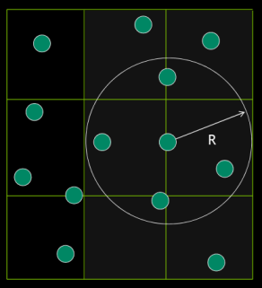
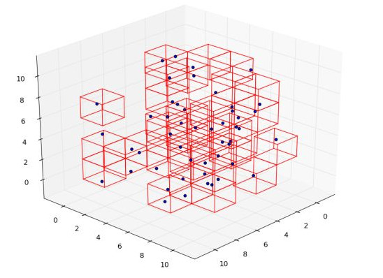
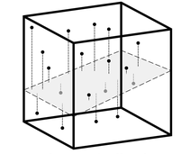
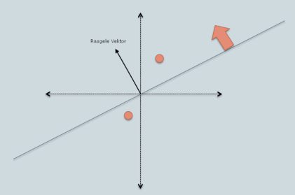

# Geometrik Anahtarlama (Spatial Hashing) ve Izgara (Grid) ile En Yakın Noktaları Bulmak

Grafik, fiziksel simülasyonlarda pek çok sayıda obje 3 boyutlu ortamda dünyaya
salınıp, ayrı ayrı onlara fiziksel kurallar uygulanır ve nereye geldiklerine
bakılır. Bu hesap sırasında objelerin birbirine çarpıp çarpmadığını hesaplamak
gerekir fakat böyle bir hesap, eğer mesela $n$ tane obje var ise, her görüntü
karesinde her $n$ tane objenin her $n-1$ diğer objenin yakınında olup olmadığı
kontrolü anlamına gelir, ki hesapsal yük $O(n^2)$ olurdu. Eğer $n$ milyonlar ise
bu ağır bir yüktür.

Benzer bir alandaki ihtiyaç sıvı akışı simülasyonlarında; bu yöntemlerin
bazıları için her parçacığın etrafındaki $R$ çapında bir daire / küre içine
düşen komşuları bulmak gerekebiliyor. Bu hesabın da hızlı bir şekilde
yapılabilmesi lazım.

Izgara (Grid) Bazlı Yöntem

İlk yöntem ızgara bazlı. Her parçacık için $R$ yakınlıktaki tüm diğer
parçacıkları bulmak istiyoruz. Bu durumda en basit, ve en etkili yollardan biri
tüm kordinat sistemini eşit parçalara, ``ızgaralara'' bölerek her parçacığı
içine düştüğü yeterince büyük bir bölüme atamak, öyle ki ızgara indisi i,j,k
üzerinden o hücrede hangi parçacıkların olduğu çok hızlı bir şekilde
bulunabilsin.





Artık bir parçacığın komşularını bulmak gerektiğinde o parçacığın hücre indisini
alıp bir yukarı, bir sağa, vs. şeklinde üç boyutta tüm 27 tane mümkün komşu
(içinde olduğumuz dahil olarak) ızgara hücresine bakarak oradaki parçacıkları
toplamak ve bunların $R$ kadar yakın olanı komşularını almak yeterli
oluyor. Altta bir örneği görüyoruz.

```python
from collections import defaultdict 
import numpy.linalg as lin, itertools

np.random.seed(0)

mmin,mmax=0,200; B = 200; R = 20
BN = int(np.abs(mmax-mmin) / R) + 1

# tum parcaciklar her parcacik indisini, hangi izgara hucresinde oldugunu, ve
# kordinatlarini bilir
balls = []

bins = np.linspace(mmin, mmax, BN)

# her izgara hucresindeki parcaciklari tuttugumuz yer, anahtar
# [i,j,k] seklinde izgara indisi, deger liste
grid_hash = defaultdict(list)

for b in range(B):
    p = np.array([np.random.uniform(mmin,mmax,1)[0],
                  np.random.uniform(mmin,mmax,1)[0],
                  np.random.uniform(mmin,mmax,1)[0] ])
    # bir kordinatin hangi izgara hucresine dustugunu hesapla 
    xi = np.digitize(p[0], bins)
    yi = np.digitize(p[1], bins)
    zi = np.digitize(p[2], bins)
    ball = {'pos':p, 'i': b, 'grid': (xi,yi,zi) }
    balls.append(ball)
    grid_hash[(xi,yi,zi)].append(ball)

# bir parcacigin tum komsularini bul, anahtari parcacik indisi degeri
# parcacik objesi olan bir esleme / sozluk icinde donduruyoruz ki
# boylece "bu komsu var mi yok mu?" sorusu hizla sorulabiliyor
# (anahtar varligini kontrol cok hizlidir)
def get_neighbors(ball):
    # komsulari sozluk olarak dondur alan hizli sekilde kontrol
    # edebilir, anahtar komsu kimligi
    neighbors = {}
    cx,cy,cz = ball['grid']
    # 3d izgara hucresinin etrafindaki tum hucrelere bak, bunlar
    # icinde oldugumuz dahil 27 tane, sag, sol, alt, ust, vs, tum
    # yonlere bakiyoruz
    for (xa,ya,za) in list(itertools.product( [-1,0,1], repeat=3  )):
        nx,ny,nz = cx+xa,cy+ya,cz+za
        if (nx,ny,nz) in grid_hash:
            tn = grid_hash[(nx,ny,nz)]
	    # bulduklarini sonuca ekle
            for n in tn: neighbors[ n['i'] ] = n
    return neighbors


tp = 0; tn = 0; fp = 0; fn = 0
for b1 in balls:
    for b2 in balls:
        if b1['i']==b2['i']: continue
        d = lin.norm(b1['pos']-b2['pos'],ord=2)
        neigh = get_neighbors(b1)
	# izgara yontemi komsu diyor ve oyle
        if d < R and (b2['i'] in neigh): tp+=1        
	# yontem komsu degil diyor ve oyle
        elif d >= R and (b2['i'] not in neigh): tn+=1
	# yontem komsu diyor ve ama oyle degil
        elif d >= R and (b2['i'] in neigh): fp+=1
	# yontem komsu degil diyor ve oyle degil
        elif d < R and (b2['i'] not in neigh): fn+=1

print ('dogru pozitif', tp)
print ('dogru negatif', tn)

print ('yanlis pozitif', fp)
print ('yanlis negatif', fn)
```

```
dogru pozitif 148
dogru negatif 38980
yanlis pozitif 672
yanlis negatif 0
```

Sonuçlara bakınca komşu değil denilen hiçbir top komşu değil, bunu görüyoruz. Bu
önemli çünkü onları elemek mümkün değil. Komşu denilenler arasında bazı
yanlışlar var ama onlar elenebilir. Komşu olmayan onbinlerce top komşu olmayacak
şekilde etiketlendi, bu güzel.

Performans bakımından iyi bir sonuç beklemek gerekir, üstteki kodda her kenarı
$R=20$ üzerinden 1000 tane hücre yaratıldı ve bunların hepsine bakmak yerine
sadece en yakın olan 27 tanesine direk sözlük erişimi üzerinden bakıyoruz.

Yanlış pozitif çıkması mümkün. Niye? Çünkü mesela iki boyutta üzerinde olduğumuz
hücreyi düşünürsek onun en sağ ucunda olsak, üst sağımızdaki komşu hücrenin yine
en üst sağında olan parçacık kenarları $R$ olan bir üçgenin hipotenüsü kadar
bizden uzaktır ki bu $R$'den büyüktür. Problem değil az sayıda olan bu noktaları
kaba kuvvet hesabı ile elemek gayet rahat.

Aynı işi yapan C++ kodunu `geogrid.cpp` içinde bulabiliriz.

Yerelliğe Hassas Böleç (Locality Sensitive Hashing, -LSH-)

Böleç tekniğini de kullanabiliriz. Öyle bir sihirli fonksiyonumuz olsun ki her
kordinat için bir anahtar değer üretsin ve birbirine yakın kordinatlar için bu
değer aynı olsun. Böylece basit eşitlik kontrolü ile iki kordinatın birbirine
yakın olup olmadığını hemen anlayabilirdik. Tabii daha detaylı kontrol için
böleçleri aynı olan kordinatları daha detaylı teste tabi tutardık, ama detaylı
kontrolün yapılacağı obje sayısını çok daha azaltmış olurduk.

Bu alandaki tekniklerden biri LSH tekniği. LSH ile çok boyutlu bir kordinat
sistemindeki noktaların yaklaşık olarak birbirine yakın olup olmadığını böleç
üzerinden hesaplayabiliyoruz. En yaygın LSH yaklaşımının temeli rasgele
izdüşümdür (random projection). [3]'te anlatıldığı gibi rasgele izdüşümün ilginç
bir özelliği mesafeleri koruması, yani orijinal kordinat sistemindeki noktalar
birbirine uzaksa yansıtıldıktan sonra da uzak kalmaya meyilliler.

Bunu herhangi bir (yani rasgele) 2 boyutlu düzlem üzerinde yansıtılan alttaki
noktalarda görebiliriz. Uzak olan noktalar düzlem uzerinde hala birbirine uzak.




Tabii ki her (rasgele) düzlem her iki orijinal nokta arasındaki uzaklığı
mükemmel olarak göstermeyebilir. Fakat, eğer birkaç tane farklı düzleme yapılan
yansımların bir birleşiminden bir ölçüt / anahtar yaratabilirsek, o zaman bu
ölçüt ile bazı hızlı sonuçlara varabiliriz.

Alttaki yaklaşımda 2 boyuta yansıtma yapılacak. Bu yansıtma yeni reel sayısal
değerler ortaya çıkartır, bölec için bize ayrıksal ``kutular'' lazım, bu
kutuları şimdi göreceğimiz yöntem 0'dan büyük olma ya da olmama üzerinden
tanımlamış.



Yani 2. boyuta indirgedikten sonra her eksen üzerinde üstteki irdeleme
yapılıyor, nokta sıfırdan büyük mü küçük mü? Bu evet / hayır sonuçlar yanyana
koyuluyor, ve 10, 01, vs şeklinde bitlerden oluşan bir sayı ortaya çıkıyor. Bu
sayıyı onluğa çevirip artık direk karşılaştırma için kullanabiliriz.

Altta üç tane örnek vektör görüyoruz. Bu vektörler bir şarkının ses
seviyelerini, bir müşterinin yer, alışveriş, gezinti bilgilerini temsil ediyor
olabilir. Acaba bu vektörler birbirine ne kadar yakın? Rasgele bir matris
\verb!projections! içinde (rasgele izdüşüm için her ögesi $N(0,1)$ dağılımından
gelen bir matris üretmek yeterlidir, gerçi altta bunu kütüphane çağrısı ile
yapmadık, [2] ile sonuçlar uysun diye direk oradan aldık),

```python
vec1 = np.array([[-0.99137472, 0.61572851, -0.37733555, 0.0363575, -0.71647706]])
vec2 = np.array([[-0.16737788, 0.83147812, -2.06947369, -0.48174425, -1.60276846]])
vec3 = np.array([[-0.9074722, 0.75953396, 1.10696926, -0.8773451, -1.11589595]])

projections = np.array([[0.58834302, 0.24020825, 2.21323827, -0.21147486, 1.18477223],\
                        [-0.31146359, -1.88214137, -0.37489443, -0.58475914, -1.57121651]])

```

Birinci vektörü rasgele düzleme yansıtıyoruz,

```python
print (vec1.shape)
print (np.dot(vec1, projections.T))
```

```
(1, 5)
[[-2.12704963  0.39583023]]
```

Her öğeyi sıfırdan büyük olma / olmama filtresinden geçiriyoruz,

```python
print (np.dot(vec1, projections.T) > 0)
print (  ''.join(((np.dot(vec1, projections.T) > 0)[0]).astype(int).astype(str))  )
```

```
[[False  True]]
01
```

Diğer vektörler için de aynı işlem,

```python
print (  ''.join(((np.dot(vec2, projections.T) > 0)[0]).astype(int).astype(str))  )
print (  ''.join(((np.dot(vec3, projections.T) > 0)[0]).astype(int).astype(str))  )
```

```
01
11
```

Üstteki sonuçlara bakarak `vec1` ve `vec2` 'nin birbirine `vec2` ve
`vec3` ün birbirine olduğundan daha yakın olacağını
kestirebiliriz. Kosinüs yakınlık hesabını bu vektörler üzerinde
uygulayınca bunun doğrulandığını görüyoruz,

```python
def cosine_sim(vec1, vec2):
   return np.dot(vec1, vec2) / (np.linalg.norm(vec1)*np.linalg.norm(vec2))

print (cosine_sim(vec1[0], vec2[0]))   
print (cosine_sim(vec1[0], vec3[0]))   
print (cosine_sim(vec2[0], vec3[0]))
```

```
0.6524342023889728
0.5610062492540248
0.1169500241078299
```

Tekniğin sezgisel temeli eğer iki nokta tamamen birbirine yakın ise, yani
orijine olan konumları mükemmel korelasyon halinde, o zaman bu teknikle aynı
kutuya düşme olasılıkları artıyor. İşin içinde rasgelelik olduğu için ve bir
noktayı pek çok farklı düzlemlere yansıttığımız için aynı kutuya düşme ihtimali
oldukca azalıyor, sadece hakikaten yakın olan noktalar aynı kutuya
düşüyorlar. Eğer o noktada hatalar ortaya çıkarsa, yaygın bir yaklaşım birden
yansıtma seçeneklerini gruplar altında toplamak ve en az bir grup aynı kutuya
düşmeyi bulmuşsa, o iki noktayı yakın olarak kabul etmek.

Notlar

0'dan küçük ya da büyük irdelemesi kutulamayı sadece iki kutu
üzerinden yapar. Fakat illa iki olması şart değil, `numpy.digitize`
ile istediğimiz kadar / genişlikte kutular yaratabilirdik.

Bir diğer konu bölecin yakın olan bazı noktalar için mükemmel olmayacağı. Bu
durumda bir çözüm ikinci, hatta üçüncü yansıtma matrisleri üzerinden ikinci,
üçüncü böleçleme grupları yaratmak, eğer böleç değerleri 1'inci ya da 2'inci ya
da 3'üncü, vs. gruplarda aynı ise iki noktayı yakın kabul etmek. Bu yöntem
yakınlık kontrolüne ek olarak yakın noktaların listesini almak için de faydalı,
bir sözlük içinde her böleç değeri için bir nokta listesi tutulur, eğer birden
fazla yansıtma yapılmışsa, bu sözlüklerden iki, hatta üç tane olabilir. Bir
noktanın komşularını almak istersek her sözlükte bu kordinatın geo böleç
değerine bakarız, ve alınan komşuları bir özgünlük filtresinden geçirerek nihai
sonucu döndürürüz. Bu yaklaşım parçacık simülasyonları ile uğraşanlar için
faydalı olabilir.

Bir diğer not, rasgele izdüşüm çoğunlukla ``boyut küçültme (dimensionality
reduction)'' konusu olarak gösterilir, fakat boyut arttırma da mümkün
olabilir. Özellikle üç boyutlu durumda iken zaten boyut sayısı azdır, fakat hala
pek çok açıdan iki noktaya bakabilmek isteriz, bu sebeple izdüşüm matrisi üçten
fazla boyut ta içerebilir.

Test

Altta üç tane farklı rasgele izdüşüm üzerinden anahtarlayan bir kod
görüyoruz. Bir 3 boyutlu kordinat sisteminde rasgele yerlerde toplar yarattık,
bunların bazıları birbirine yakın, bazıları değil, kodda LSH ile geometrik
yakınlığı gerçek yakınlık ile ne kadar benzediğini kontrol ediyoruz. LSH
anahtarı üç sözlükte kontrol ediliyor.

Önce tüm topları anahtarlıyoruz ve sözlüğe koyuyoruz. Sonra tüm topların birbiri
ile olan mesafesini ayrı ayrı teker teker külfetli yoldan yapıyoruz, ve bölecin
bu durum hakkında ne söylediğine bakıyoruz. Pozitif böleç(ler) yakın diyor,
negatif böleç uzak diyor anlamında, tabii yakınlık ve uzaklık böleç anahtar
değerinin aynı olup olmadığı ile ölçülüyor.

Kontrolün doğru pozitif bulması mesela geo anahtarın yakın dediğinin gerçekten
de yakın olması. Yanlış negatif tam tersi, anahtar uzak diyor ama aslında toplar
yakın.


```python
from collections import defaultdict 
import numpy as np, datetime
import numpy.linalg as lin

np.random.seed(0)

mmin,mmax=0,200
B = 200; R = (mmax / 10);
balls = []

geo_hash_list = defaultdict(list)
    
for b in range(B):
    p = np.array([np.random.uniform(mmin,mmax,1)[0],
                  np.random.uniform(mmin,mmax,1)[0],
                  np.random.uniform(mmin,mmax,1)[0] ])
    balls.append({'pos':p, 'i': b})

k = 9; bnum = 7
bins = np.linspace(-500.0,500.0,bnum)

P1 = np.random.normal(0,1,3*k).reshape(3,k)
def spatial_hash1(x):
    X1 = np.dot(x,P1)
    h1 = np.digitize(X1, bins)
    return int("".join([str(x) for x in h1[0]]))

P2 = np.random.normal(0,1,3*k).reshape(3,k)
def spatial_hash2(x):
    X2 = np.dot(x,P2)
    h2 = np.digitize(X2, bins)
    return int("".join([str(x) for x in h2[0]]))

P3 = np.random.normal(0,1,3*k).reshape(3,k)
def spatial_hash3(x):
    X3 = np.dot(x,P3)
    h3 = np.digitize(X3, bins)
    return int("".join([str(x) for x in h3[0]]))

tp = 0; tn = 0; fp = 0; fn = 0

for i,b1 in enumerate(balls):
    for j,b2 in enumerate(balls):
        if i==j: continue
        d = lin.norm(b1['pos']-b2['pos'])
        h11 = spatial_hash1([b1['pos']])
        h12 = spatial_hash1([b2['pos']])
        h21 = spatial_hash2([b1['pos']])
        h22 = spatial_hash2([b2['pos']])
        h31 = spatial_hash3([b1['pos']])
        h32 = spatial_hash3([b2['pos']])
        if d <= R and (h11==h12 or h21==h22 or h31==h32): tp += 1        
        elif d > R and not (h11==h12 or h21==h22 or h31==h32): tn+=1
        elif d <= R and not (h11==h12 or h21==h22 or h31==h32): fn+=1
        elif d > R and (h11==h12 or h21==h22 or h31==h32): fp+=1

print ('dogru pozitif', tp)
print ('dogru negatif', tn)

print ('yanlis pozitif', fp)
print ('yanlis negatif', fn)
```

```
dogru pozitif 128
dogru negatif 38374
yanlis pozitif 1278
yanlis negatif 20
```

Tabii ki istediğimiz doğru olan değerlerin yüksek olması. Ama yanlış pozitifin
hala çaresi var, anahtarın yakın dediklerini bir kontrolden daha geçirirsek bu
kontrol yanlış pozitifleri eleyecektir, tabii gene de yanlış pozitiflerin de
toplama kıyasla az olmasını isteriz. Tek problem yanlış negatif, topların çoğu
birbirinden uzakta olduğu için bu yanlıştan dönmek zor, fakat bu tür topların
oldukça az olduğunu görüyoruz.

Asal Sayılar ile Böleç (Hash) Tekniği

Bir diğer böleç bazlı teknik [1]'den. Teknik ile kordinat sistemini $l$
büyüklüğünde kutulara bölüyor, her eksen değerini bu büyüklük ile bölüyoruz,
bölüm sonrası elde edilen sayıyı taban (floor) tamsayıya indirgiyoruz, ardından
her eksen için farklı bir asal sayıyla çarpıp sonuçları XOR ile birleştiriyoruz
(ki XOR yaygın kullanılan bir böleç birleştirme yaklaşımı).

```python
l = 5
n = 5
p1,p2,p3 = 73856093, 19349663, 83492791

x1 = [33,4,11]
x2 = [31,1,14]
x3 = [10,44,19]

def spatial_hash(x):
    ix,iy,iz = np.floor(x[0]/l), np.floor(x[1]/l), np.floor(x[2]/l)
    return (int(ix*p1) ^ int(iy*p2) ^ int(iz*p3)) % n

print (spatial_hash(x1))
print (spatial_hash(x2))
print (spatial_hash(x3))
```

```
1
1
3
```

Görüldüğü gibi ilk iki kordinat aynı böleç anahtarına düştü, ki bu iki kordinat
birbirine yakın.

Genel algoritma şöyle olabilir. Her görüntü karesi için iki faz düşünebiliriz,
ilk fazda tüm objelerin kordinat böleçi hesaplanır, her böleç değeri altında bir
liste vardır, ve her obje anahtarının değerine tekabül eden o listeye
eklenir. İkinci fazda bir objeye bakarken onun üzerinde daha detaylı çarpışma
hesabı gerekip gerekmediğini anlamak için böleç anahtarındaki listeye bakarız,
listede sadece bir öğe var ise çarpışma yok, birden fazla ise o listedeki her
diğer obje için detaylı çarpışma hesabına devam edilebilir.

Bazı istatistikleri toplayalım. Acaba yaklaşım ne kadar başarılı?

```python
from collections import defaultdict 
import numpy as np, datetime
import numpy.linalg as lin

mmin,mmax=0,200
p1,p2,p3 = 73856093, 19349663, 83492791
B = 200; R = 20; n = B*20

def spatial_hash(x):
    ix,iy,iz = int(x[0]/R), int(x[1]/R), int(x[2]/R)
    tmp = (ix*p1) ^ (iy*p2) ^ (iz*p3)
    return tmp % n
    
balls = []
geo_hash_list = defaultdict(list)

for b in range(B):
    p = np.array([np.random.uniform(mmin,mmax,1)[0],
                  np.random.uniform(mmin,mmax,1)[0],
                  np.random.uniform(mmin,mmax,1)[0] ])
    balls.append({'pos':p, 'i': b})

for j,b in enumerate(balls):
    geo_hash_list[spatial_hash(b['pos'])].append(b)

tp = 0; tn = 0; fp = 0; fn = 0
for i,b1 in enumerate(balls):
    for j,b2 in enumerate(balls):
        if i==j: continue
        d = lin.norm(b1['pos']-b2['pos'])
        h1 = spatial_hash(b1['pos'])
        h2 = spatial_hash(b2['pos'])
        
        if d <= R and h1 == h2: tp += 1        
        elif d > R and h1 != h2: tn+=1
        elif d > R and h1 == h2: fp+=1
        elif d <= R and h1 != h2: fn+=1

print ('dogru pozitif', tp)
print ('dogru negatif', tn)

print ('yanlis pozitif', fp)
print ('yanlis negatif', fn)
```

```
dogru pozitif 38
dogru negatif 39634
yanlis pozitif 14
yanlis negatif 114
```

Kaynaklar

[1] Optimized Spatial Hashing for Collision Detection of Deformable Objects
    https://matthias-research.github.io/pages/publications/tetraederCollision.pdf

[2] Hari, Locality Sensitive Hashing for Similar Item Search,
    https://towardsdatascience.com/locality-sensitive-hashing-for-music-search-f2f1940ace23

[3] Bayramlı, Rasgele İzdüşümü (Random Projection) ile SVD

[4] Slaney, Locality-Sensitive Hashing for Finding Nearest Neighbors,
    \https://www.slaney.org/malcolm/yahoo/Slaney2008-LSHTutorial.pdf


