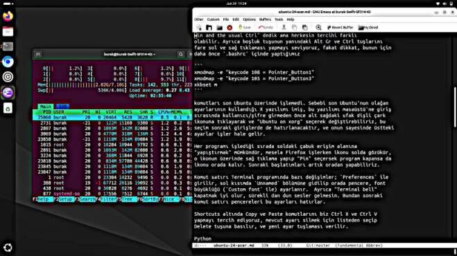

# Ubuntu 24, Acer Swift 3

Yeni dizüstü yeni Ubuntu. Swift 3 kuvvetli makina. Kurulum icin en son
Ubuntu versiyonu iso olarak alttan indirilir,

https://ubuntu.com/download/alternative-downloads

Dosya 6 GB civarı. Sonra mevcut (eski) Ubuntu üzerinde bu iso Startup
Disk Creator programı ile bir usb flash diske yazılır. Artık üzerinden
yükleme (boot) edilebilir bir diskimiz var.

Şimdi Acer'da açılış sırasında F2 basılı tutularak BIOS'a girilir
(sifre sorarsa boş ya da 0000 denenebilir). `Main` menüden `F12 Boot
Menü` seçeneği `Enable` yapılır. Kaydedilip tekrar başlatılır, bu
sırada ardı ardına F12 tuşuna basılmalı. Bu bizi yeni bir ekrana
götürür, o ekranda sadece bir yükleme seçeneği var, ama flask diski
USB porta sokar sokmaz Ubuntu seçeneği de görülecek. Bunu seçin ve
kurulumu yapın.

Makina açılınca `sudo apt install` ile kurulacak programlar,

```
gnome-tweaks python3-virtualenv git emacs texlive-latex-base net-tools
mpv emacs chromium-browser texlive-base djvulibre-bin imagemagick recoll
texlive-fonts-recommended texlive-fonts-extra python3-pandoc gimp xkbset
nodejs ccrypt htop vlc gfortran liblapack-dev libopenblas-dev cmake
```

Biz CAPS tuşunu hep CTRL yaparız, bu versiyonda bunu Gnome Tweaks ile
yapmak kolay, `gnome-tweaks` işletelim, "Keyboard | Additional Layout
Options" seçelim, orada "Caps Lock Behavior" var, değişimi oradan
yaparız.  Biz ayrıca "Alt Win behavior" seçeneğinde "Ctrl is mapped to
Win and the usual Ctrl" dedik ama herkesin tercihi farklı
olabilir. Ayrıca boşluk tuşunun yanındaki Alt Gr ve Ctrl tuşlarını
fare sol ve sağ tıklaması yapmayı seviyoruz, fakat dikkat, bunun için
daha önce `.bashrc` içinde yaptığımız

```
xmodmap -e "keycode 108 = Pointer_Button1"
xmodmap -e "keycode 105 = Pointer_Button3"
xkbset m
```

komutları son Ubuntu üzerinde işlemedi. Sebebi son Ubuntu'nun olağan
ayarlarının kullandığı X yazılımı imiş, bu yazılımı masaüstü'ne giriş
sırasında kullanıcı/şifre girmeden önce alt sağdaki ufak dişli çark
ikonuna tıklayarak ve "Ubuntu on xorg" seçerek değiştirebiliriz, bu
seçim sonraki girişlerde de hatırlanacaktır, ve onun sayesinde üstteki
ayarlar işler hale gelir.

Yine aynı Tweaks programı üzerinden arka planı düz tek renkli resim
yapabiliriz, Appearance kısmından Background alanına bakalım, orada
Default Image seçeneği var, orada siyah renkli bir JPG dosyası
verebiliriz, Web'de bu tür pek çok görüntü dosyası var.

Her programı işlediği sırada soldaki çabuk erişim alanına
"yapıştırmak" mümkündür, mesela Firefox işlerken ikonu solda gözükür,
o ikonun üzerinde sağ tıklama yapıp "Pin" seçersek program kapansa da
ikonu orada kalır. Sonraki başlatımları artık oradan yapabiliriz.

Komut satırı Terminal programında bazı değişimler; `Preferences` ile
girilir, sol kısımda `Unnamed` bölümüne gidilip orada pencere, font
büyüklüğü (`Custom font` ile) ayarlanır.  Ayrıca "Terminal bell"
kapatmak iyi olur, sürekli dan dun sesler gelmesin. Bundan sonraki
komut satırı pencereleri bu ayarları hatırlar.

Shortcuts altında Copy ve Paste komutlarını biz Ctrl X ve Ctrl V
yapmayı tercih ediyoruz, mevcut ayarı silmek için listeden seçip
Delete tuşuna basılır, ve yeni ayar tuşlaması verilir.

Python 

Sistem için bile olsa sık kullanılan Python paketleri bir sanal
ortamda kurmak iyidir,

```
virtualenv -p /usr/bin/python3 env3
```

Artık `env3` dizini altında bir Python ortamı var. Aktive etmek için
`source env3/bin/activate`.

Burada `pip install` ile

```
matplotlib pytest-shutil jupyter-notebook markdown numpy-stl
ipython zmq importlib numpy Shutil pandas feedparser Cython
pkgconfig
```



Pymacs

Emacs içinde Python işletenler için faydalı bir yazılım. Kurulum
önceden olduğu gibi, [2]'den repo alınır, ardından `make` ve `python
setup.py build` ve `install`. Fakat Ubuntu'nun olağan Python
yorumlayıcısı 3.12 üzerinde bazı farklılıklar var, alttaki değişimleri
yaparsak Pymacs [2] tekrar çalışır hale gelir, değişimler `git diff`
ile üretildi,

```
index 08e3d4d..577c151 100755
--- a/Pymacs.py.in
+++ b/Pymacs.py.in
@@ -44,7 +44,7 @@ if PYTHON3:
         return isinstance(value, collections.Callable)
 
     basestring = str
-    from imp import reload
+    from importlib import reload
 else:
     __metaclass__ = type
 
diff --git a/setup.py b/setup.py
index 36fca2e..2bc68cc 100644
--- a/setup.py
+++ b/setup.py
@@ -70,7 +70,7 @@ def cfg_to_args(path='setup.cfg'):
     config = RawConfigParser()
     f = codecs.open(path, encoding='utf-8')
     try:
-        config.readfp(f)
+        config.read_file(f)
     finally:
         f.close()
```

Tıklama ile Masaüstünü Göster (Show Desktop)

Bazen pencereler çok birikir, tek bir tuşa basıp hepsini minimize
etmek isteyebiliriz. Önce

```
sudo apt install wmctrl
```

Bu program komutu satırından herşeyi `wmctrln -k on` ile minimize edebilir.
Şimdi bir ikon yaratalım,

```
gedit ~/.local/share/applications/show-desktop.desktop
```

Dosya icine

```
[Desktop Entry]
Type=Application
Name=Show Desktop
Icon=desktop
Exec=wmctrl -k on
```

Bir uygulama yaratmış olduk, artık uygulamalar içinde "Show Desktop"
kelimesini ararsak ikonumuzu bulabiliriz, ve bulunca sağ tıklama ve
"Pin to Dash" ile programı sol taraftaki erişim bölgesine
yapıştırabiliriz.

Internet Servisi

Bu servisi bazen tekrar başlatmak gerekebilir, yeni komut

```
sudo systemctl restart NetworkManager.service
```

Kaynaklar

[1] https://www.youtube.com/watch?v=eMHr9jsbJG4

[2] https://github.com/pinard/Pymacs


