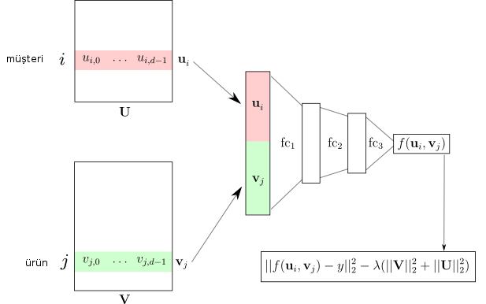
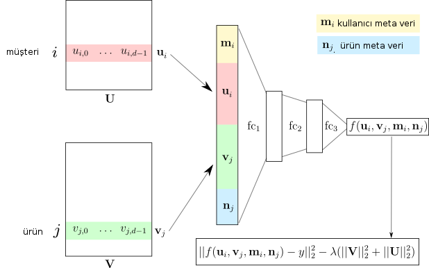

# Tavsiye Sistemleri, Derin Öğrenme (Deep Recommender Systems)

Kullanıcı $i$ için film $j$ tavsiye problemi için bir yaklaşım, eğitim
verisinde filmlere verilen beğeni notlarını (ratings) bir $i,j$ matrisinde
tutmak, SVD ile bu matris üzerinde ayrıştırma yaparak hem kullanıcı hem
film boyutlarında azaltılmış temsili vektörler elde etmek, ardından bu
vektörleri mesela kullanıcı $i$ vektörü ile tüm filmlerin azaltılmış
temsildeki vektörleri ile çarpmak suretiyle o filmlere (çoğunlukla daha
verilmemiş) notun ne olacağını tahmin etmeye uğraşmaktı.

Derin öğrenme, TensorFlow ile çözüm ne olabilir?  Aslında üstteki
ayrıştırma problemini TF ile çözmek mümkün, çünkü elde bir çarpım var,
eğitim verisi var, çarpımın (tahmin) gerçek veriden olan farkı bir hata
fonksiyonu olarak görülebilir, ve bu hatanın TF ile otomatik türevi
alınarak minimizasyon noktası aranabilir.

Fakat tavsiye üretme mekanizmasını pür derin YSA bakışıyla çözmek belki
daha iyi. Doğal dil işlemede (NLP) görülen kelime gömme (word embedding)
kavramını bu problemde de kullanabiliriz. NLP problemlerinde elde bir
doküman vardır, bir sözlükten gelen kelimeler bu belgelerde
görülebilir. Kullanıcı / film, ya da müşteri / ürün bağlamında da sanki bir
doküman vardır, ama bu dokümanda sadece tek bir beğeni için olan tek bir
müşteri / ürün ikilisi vardır. NLP'de bir belge " kedi paspasta
oturuyor'', kimlik verisi üzerinden [200, 201, 565] olabiliyordu, kullanıcı
/ film için "belgede'' mesela sadece [100, 4500] olur; kullanıcı 100 film
4500'i beğenmiş. Beğeni notunun nereye gittiğinin birazdan göreceğiz.

O zaman alttaki gibi bir ağ yapısı düşünülebilir; kullanıcı / film ikilisi
kimlik verilerine gömme transformasyonu uygulanır, ve sonuç gömme
vektörleri bu tabakada yanyana yer alırlar. Ardından gömme tabakasındaki
tüm bilgi tam bağlanmış (fully connected) iki ayrı tabaka üzerinden tahmin
üretmek için kullanılır, bu tahmin ise beğeni notunun ta kendisidir. Eldeki
eğitim verisinde gerçek verilen not olacaktır, ve bir kayıp fonksiyonu
üzerinden optimizasyon yapılır.



Meta Veri

Bu mimariye bazı ekler yapabiliriz. Mesela eğer müşteri, ürün hakkında
"meta'' bilgiler var ise, diyelim kullanıcıların yaşı, mesleği gibi, bu
bilgiler de eğitim sırasında kullanılabilir.  Kullanıcı meta bilgisi aynı
kullanıcı için bir beğeniden diğerine değişmezler, o sebeple ürünler için
ürünün hangi tarihte üretildiği, fiyatı, vs. gibi detaylar meta
olabilir. Peki bu bilgileri nasıl DYSA'ya dahil ederiz?

Meta bilgisini direk gömme tabakasında sayısal kolonların hemen yanına
koyabiliriz, mesela ürünün yapılış tarihi tek bir sayısal kolon olarak bu
tabakada yer alabilir, yaş, vs. aynı şekilde. Mimari olarak, müşteri $i$ ve
ürün $j$ için meta veri $m_i,n_j$ olsun,



şeklinde olur. 

Kodlamaya başlayabiliriz. Önce verileri okuyalım, eğitim test verisi
yaratalım (DYSA paketi olarak TensorFlow üzerinde yazılmış onu biraz daha
kolaylaştıran Keras paketi kullanıldı [1])

```python
import pandas as pd
from keras.layers import Concatenate
from pathlib import Path
from zipfile import ZipFile
from keras.layers import Input, Embedding, Flatten, Dense, Dropout
from keras.models import Model
from sklearn.metrics import mean_squared_error, mean_absolute_error
from sklearn.model_selection import train_test_split
from sklearn.preprocessing import scale

ML_100K_FOLDER = Path('ml-100k')
# Add 'item_id' to your column names list at the beginning
icols = ["item_id", "name", "date", "genre", "url"] # Added 'item_id'
icols += ["f" + str(x) for x in range(19)]  # unused feature names (assuming 19 'genre' flags or similar)
rcols  = ["user_id", "item_id", "rating", "timestamp"]

with ZipFile('ml-100k.zip', 'r') as z:
    all_ratings = pd.read_csv(z.open('ml-100k/u.data'), sep='\t', names=rcols)
    # Load items, explicitly setting 'item_id' as the index column
    # The 'item_id' is the first column in u.item, so index_col=0
    items = pd.read_csv(z.open('ml-100k/u.item'), sep='|', names=icols, encoding='latin-1', index_col=0) #
    
items.fillna(value="01-Jan-1997", inplace=True)

from sklearn.model_selection import train_test_split

ratings_train, ratings_test = train_test_split(
    all_ratings, test_size=0.2, random_state=0)

print (ratings_train.shape)
```

```text
(80000, 4)
```

Şimdi gömme tabakası kurulur, kullanıcı, film için bu 32'şer boyutlu olsun,
yani yanyana 64 öğeli bir vektör. 

```python
user_id_input = Input(shape=[1])
item_id_input = Input(shape=[1])
meta_input = Input(shape=[1])


user_id_train = ratings_train['user_id'].values.reshape(-1, 1)
item_id_train = ratings_train['item_id'].values.reshape(-1, 1)
rating_train = ratings_train['rating'] 

user_id_test = ratings_test['user_id'].values.reshape(-1, 1)
item_id_test = ratings_test['item_id'].values.reshape(-1, 1)
rating_test = ratings_test['rating']

max_user_id = all_ratings['user_id'].max()
max_item_id = all_ratings['item_id'].max()

embedding_size = 32
user_embedding = Embedding(output_dim=embedding_size, input_dim=max_user_id + 1,
                           input_length=1)(user_id_input)
item_embedding = Embedding(output_dim=embedding_size, input_dim=max_item_id + 1,
                           input_length=1)(item_id_input)

user_vecs = Flatten()(user_embedding)
item_vecs = Flatten()(item_embedding)
```

Şimdi bir meta kolonu ekleyelim, bunu sadece filmin üretim tarihi için
yapacağız, fakat diğerleri için de yapılacak ek aynen bu şekilde olurdu,

```python
parsed_dates = [int(film_date[-4:]) for film_date in items["date"].tolist()]
items['parsed_date'] = pd.Series(parsed_dates, index=items.index)

items['scaled_date'] = scale(items['parsed_date'].astype('float64'))

item_meta_train = items["scaled_date"].loc[ratings_train['item_id']].values.reshape(-1, 1)
item_meta_test = items["scaled_date"].loc[ratings_test['item_id']].values.reshape(-1, 1)

input_vecs = Concatenate()([user_vecs, item_vecs, meta_input])
```

Şimdi tam bağlanmış tabakaları ekleyelim, arada bir de veri atma (dropout)
tabakası olsun, bu tabaka içinden geçen verilerin bazılarını / rasgele bir
şekilde yoksayıyor (eğitim döngüsünün o aşaması yapılmıyor yani), bu
tekniğin aşırı uygunluk (overfitting) problemleri için faydalı olduğu
keşfedildi. 

Tabakalar hazırlanınca eğitime başlayabiliriz,

```python
x = Dense(64, activation='relu')(input_vecs)
x = Dropout(0.5)(x)
x = Dense(32, activation='relu')(x)
y = Dense(1)(x)

model = Model(inputs=[user_id_input, item_id_input, meta_input], outputs=y)
model.compile(optimizer='adam', loss='mae')

# Pass NumPy arrays for prediction
initial_train_preds = model.predict([user_id_train, item_id_train, item_meta_train])

# Pass NumPy arrays for fitting
history = model.fit([user_id_train, item_id_train, item_meta_train], rating_train,
                    batch_size=64, epochs=15, validation_split=0.1,
                    shuffle=True)

test_preds = model.predict([user_id_test, item_id_test, item_meta_test])
print("Final test Loss: %0.3f" % mean_squared_error(test_preds, rating_test))
print("Final test Loss: %0.3f" % mean_absolute_error(test_preds, rating_test))
```

```text
 [1m   1/2500 [0m  [37m-------------------- [0m  [1m3:00 [0m 72ms/step [1m  69/2500 [0m  [37m-------------------- [0m  [1m1s [0m 736us/step  [1m 144/2500 [0m  [32m- [0m [37m------------------- [0m  [1m1s [0m 705us/step [1m 239/2500 [0m  [32m- [0m [37m------------------- [0m  [1m1s [0m 635us/step [1m 337/2500 [0m  [32m-- [0m [37m------------------ [0m  [1m1s [0m 599us/step [1m 435/2500 [0m  [32m--- [0m [37m----------------- [0m  [1m1s [0m 579us/step [1m 529/2500 [0m  [32m---- [0m [37m---------------- [0m  [1m1s [0m 571us/step [1m 628/2500 [0m  [32m----- [0m [37m--------------- [0m  [1m1s [0m 562us/step [1m 722/2500 [0m  [32m----- [0m [37m--------------- [0m  [1m0s [0m 558us/step [1m 821/2500 [0m  [32m------ [0m [37m-------------- [0m  [1m0s [0m 552us/step [1m 920/2500 [0m  [32m------- [0m [37m------------- [0m  [1m0s [0m 547us/step [1m1018/2500 [0m  [32m-------- [0m [37m------------ [0m  [1m0s [0m 544us/step [1m1108/2500 [0m  [32m-------- [0m [37m------------ [0m  [1m0s [0m 545us/step [1m1204/2500 [0m  [32m--------- [0m [37m----------- [0m  [1m0s [0m 543us/step [1m1298/2500 [0m  [32m---------- [0m [37m---------- [0m  [1m0s [0m 543us/step [1m1390/2500 [0m  [32m----------- [0m [37m--------- [0m  [1m0s [0m 543us/step [1m1488/2500 [0m  [32m----------- [0m [37m--------- [0m  [1m0s [0m 541us/step [1m1579/2500 [0m  [32m------------ [0m [37m-------- [0m  [1m0s [0m 542us/step [1m1670/2500 [0m  [32m------------- [0m [37m------- [0m  [1m0s [0m 542us/step [1m1763/2500 [0m  [32m-------------- [0m [37m------ [0m  [1m0s [0m 542us/step [1m1855/2500 [0m  [32m-------------- [0m [37m------ [0m  [1m0s [0m 542us/step [1m1946/2500 [0m  [32m--------------- [0m [37m----- [0m  [1m0s [0m 543us/step [1m2040/2500 [0m  [32m---------------- [0m [37m---- [0m  [1m0s [0m 542us/step [1m2133/2500 [0m  [32m----------------- [0m [37m--- [0m  [1m0s [0m 542us/step [1m2227/2500 [0m  [32m----------------- [0m [37m--- [0m  [1m0s [0m 542us/step [1m2323/2500 [0m  [32m------------------ [0m [37m-- [0m  [1m0s [0m 541us/step [1m2423/2500 [0m  [32m------------------- [0m [37m- [0m  [1m0s [0m 540us/step [1m2500/2500 [0m  [32m-------------------- [0m [37m [0m  [1m1s [0m 545us/step
Epoch 1/15
 [1m   1/1125 [0m  [37m-------------------- [0m  [1m14:07 [0m 754ms/step - loss: 3.7447 [1m  37/1125 [0m  [37m-------------------- [0m  [1m1s [0m 1ms/step - loss: 3.3329      [1m  77/1125 [0m  [32m- [0m [37m------------------- [0m  [1m1s [0m 1ms/step - loss: 3.0075 [1m 121/1125 [0m  [32m-- [0m [37m------------------ [0m  [1m1s [0m 1ms/step - loss: 2.6643 [1m 162/1125 [0m  [32m-- [0m [37m------------------ [0m  [1m1s [0m 1ms/step - loss: 2.4315 [1m 203/1125 [0m  [32m--- [0m [37m----------------- [0m  [1m1s [0m 1ms/step - loss: 2.2575 [1m 245/1125 [0m  [32m---- [0m [37m---------------- [0m  [1m1s [0m 1ms/step - loss: 2.1194 [1m 288/1125 [0m  [32m----- [0m [37m--------------- [0m  [1m1s [0m 1ms/step - loss: 2.0072 [1m 331/1125 [0m  [32m----- [0m [37m--------------- [0m  [1m0s [0m 1ms/step - loss: 1.9152 [1m 374/1125 [0m  [32m------ [0m [37m-------------- [0m  [1m0s [0m 1ms/step - loss: 1.8384 [1m 420/1125 [0m  [32m------- [0m [37m------------- [0m  [1m0s [0m 1ms/step - loss: 1.7694 [1m 461/1125 [0m  [32m-------- [0m [37m------------ [0m  [1m0s [0m 1ms/step - loss: 1.7167 [1m 504/1125 [0m  [32m-------- [0m [37m------------ [0m  [1m0s [0m 1ms/step - loss: 1.6682 [1m 545/1125 [0m  [32m--------- [0m [37m----------- [0m  [1m0s [0m 1ms/step - loss: 1.6275 [1m 592/1125 [0m  [32m---------- [0m [37m---------- [0m  [1m0s [0m 1ms/step - loss: 1.5861 [1m 635/1125 [0m  [32m----------- [0m [37m--------- [0m  [1m0s [0m 1ms/step - loss: 1.5524 [1m 674/1125 [0m  [32m----------- [0m [37m--------- [0m  [1m0s [0m 1ms/step - loss: 1.5246 [1m 715/1125 [0m  [32m------------ [0m [37m-------- [0m  [1m0s [0m 1ms/step - loss: 1.4979 [1m 755/1125 [0m  [32m------------- [0m [37m------- [0m  [1m0s [0m 1ms/step - loss: 1.4740 [1m 797/1125 [0m  [32m-------------- [0m [37m------ [0m  [1m0s [0m 1ms/step - loss: 1.4509 [1m 839/1125 [0m  [32m-------------- [0m [37m------ [0m  [1m0s [0m 1ms/step - loss: 1.4295 [1m 880/1125 [0m  [32m--------------- [0m [37m----- [0m  [1m0s [0m 1ms/step - loss: 1.4101 [1m 923/1125 [0m  [32m---------------- [0m [37m---- [0m  [1m0s [0m 1ms/step - loss: 1.3911 [1m 965/1125 [0m  [32m----------------- [0m [37m--- [0m  [1m0s [0m 1ms/step - loss: 1.3739 [1m1007/1125 [0m  [32m----------------- [0m [37m--- [0m  [1m0s [0m 1ms/step - loss: 1.3577 [1m1051/1125 [0m  [32m------------------ [0m [37m-- [0m  [1m0s [0m 1ms/step - loss: 1.3419 [1m1098/1125 [0m  [32m------------------- [0m [37m- [0m  [1m0s [0m 1ms/step - loss: 1.3260 [1m1125/1125 [0m  [32m-------------------- [0m [37m [0m  [1m2s [0m 2ms/step - loss: 1.3171 - val_loss: 0.7724
Epoch 2/15
 [1m   1/1125 [0m  [37m-------------------- [0m  [1m20s [0m 19ms/step - loss: 0.7542 [1m  37/1125 [0m  [37m-------------------- [0m  [1m1s [0m 1ms/step - loss: 0.7812   [1m  75/1125 [0m  [32m- [0m [37m------------------- [0m  [1m1s [0m 1ms/step - loss: 0.7778 [1m 111/1125 [0m  [32m- [0m [37m------------------- [0m  [1m1s [0m 1ms/step - loss: 0.7761 [1m 150/1125 [0m  [32m-- [0m [37m------------------ [0m  [1m1s [0m 1ms/step - loss: 0.7736 [1m 189/1125 [0m  [32m--- [0m [37m----------------- [0m  [1m1s [0m 1ms/step - loss: 0.7712 [1m 231/1125 [0m  [32m---- [0m [37m---------------- [0m  [1m1s [0m 1ms/step - loss: 0.7702 [1m 274/1125 [0m  [32m---- [0m [37m---------------- [0m  [1m1s [0m 1ms/step - loss: 0.7696 [1m 315/1125 [0m  [32m----- [0m [37m--------------- [0m  [1m1s [0m 1ms/step - loss: 0.7693 [1m 356/1125 [0m  [32m------ [0m [37m-------------- [0m  [1m0s [0m 1ms/step - loss: 0.7691 [1m 396/1125 [0m  [32m------- [0m [37m------------- [0m  [1m0s [0m 1ms/step - loss: 0.7691 [1m 438/1125 [0m  [32m------- [0m [37m------------- [0m  [1m0s [0m 1ms/step - loss: 0.7691 [1m 480/1125 [0m  [32m-------- [0m [37m------------ [0m  [1m0s [0m 1ms/step - loss: 0.7691 [1m 522/1125 [0m  [32m--------- [0m [37m----------- [0m  [1m0s [0m 1ms/step - loss: 0.7690 [1m 562/1125 [0m  [32m--------- [0m [37m----------- [0m  [1m0s [0m 1ms/step - loss: 0.7689 [1m 599/1125 [0m  [32m---------- [0m [37m---------- [0m  [1m0s [0m 1ms/step - loss: 0.7688 [1m 639/1125 [0m  [32m----------- [0m [37m--------- [0m  [1m0s [0m 1ms/step - loss: 0.7686 [1m 682/1125 [0m  [32m------------ [0m [37m-------- [0m  [1m0s [0m 1ms/step - loss: 0.7684 [1m 726/1125 [0m  [32m------------ [0m [37m-------- [0m  [1m0s [0m 1ms/step - loss: 0.7682 [1m 771/1125 [0m  [32m------------- [0m [37m------- [0m  [1m0s [0m 1ms/step - loss: 0.7680 [1m 816/1125 [0m  [32m-------------- [0m [37m------ [0m  [1m0s [0m 1ms/step - loss: 0.7677 [1m 858/1125 [0m  [32m--------------- [0m [37m----- [0m  [1m0s [0m 1ms/step - loss: 0.7675 [1m 897/1125 [0m  [32m--------------- [0m [37m----- [0m  [1m0s [0m 1ms/step - loss: 0.7673 [1m 937/1125 [0m  [32m---------------- [0m [37m---- [0m  [1m0s [0m 1ms/step - loss: 0.7671 [1m 980/1125 [0m  [32m----------------- [0m [37m--- [0m  [1m0s [0m 1ms/step - loss: 0.7669 [1m1023/1125 [0m  [32m------------------ [0m [37m-- [0m  [1m0s [0m 1ms/step - loss: 0.7666 [1m1066/1125 [0m  [32m------------------ [0m [37m-- [0m  [1m0s [0m 1ms/step - loss: 0.7664 [1m1109/1125 [0m  [32m------------------- [0m [37m- [0m  [1m0s [0m 1ms/step - loss: 0.7662 [1m1125/1125 [0m  [32m-------------------- [0m [37m [0m  [1m2s [0m 1ms/step - loss: 0.7662 - val_loss: 0.7711
Epoch 3/15
 [1m   1/1125 [0m  [37m-------------------- [0m  [1m23s [0m 21ms/step - loss: 0.8475 [1m  36/1125 [0m  [37m-------------------- [0m  [1m1s [0m 1ms/step - loss: 0.7436   [1m  73/1125 [0m  [32m- [0m [37m------------------- [0m  [1m1s [0m 1ms/step - loss: 0.7358 [1m 112/1125 [0m  [32m- [0m [37m------------------- [0m  [1m1s [0m 1ms/step - loss: 0.7338 [1m 155/1125 [0m  [32m-- [0m [37m------------------ [0m  [1m1s [0m 1ms/step - loss: 0.7323 [1m 197/1125 [0m  [32m--- [0m [37m----------------- [0m  [1m1s [0m 1ms/step - loss: 0.7315 [1m 242/1125 [0m  [32m---- [0m [37m---------------- [0m  [1m1s [0m 1ms/step - loss: 0.7310 [1m 285/1125 [0m  [32m----- [0m [37m--------------- [0m  [1m1s [0m 1ms/step - loss: 0.7307 [1m 328/1125 [0m  [32m----- [0m [37m--------------- [0m  [1m0s [0m 1ms/step - loss: 0.7306 [1m 369/1125 [0m  [32m------ [0m [37m-------------- [0m  [1m0s [0m 1ms/step - loss: 0.7310 [1m 412/1125 [0m  [32m------- [0m [37m------------- [0m  [1m0s [0m 1ms/step - loss: 0.7316 [1m 450/1125 [0m  [32m-------- [0m [37m------------ [0m  [1m0s [0m 1ms/step - loss: 0.7321 [1m 489/1125 [0m  [32m-------- [0m [37m------------ [0m  [1m0s [0m 1ms/step - loss: 0.7327 [1m 527/1125 [0m  [32m--------- [0m [37m----------- [0m  [1m0s [0m 1ms/step - loss: 0.7332 [1m 567/1125 [0m  [32m---------- [0m [37m---------- [0m  [1m0s [0m 1ms/step - loss: 0.7337 [1m 608/1125 [0m  [32m---------- [0m [37m---------- [0m  [1m0s [0m 1ms/step - loss: 0.7340 [1m 649/1125 [0m  [32m----------- [0m [37m--------- [0m  [1m0s [0m 1ms/step - loss: 0.7342 [1m 686/1125 [0m  [32m------------ [0m [37m-------- [0m  [1m0s [0m 1ms/step - loss: 0.7345 [1m 726/1125 [0m  [32m------------ [0m [37m-------- [0m  [1m0s [0m 1ms/step - loss: 0.7346 [1m 768/1125 [0m  [32m------------- [0m [37m------- [0m  [1m0s [0m 1ms/step - loss: 0.7348 [1m 809/1125 [0m  [32m-------------- [0m [37m------ [0m  [1m0s [0m 1ms/step - loss: 0.7349 [1m 852/1125 [0m  [32m--------------- [0m [37m----- [0m  [1m0s [0m 1ms/step - loss: 0.7350 [1m 893/1125 [0m  [32m--------------- [0m [37m----- [0m  [1m0s [0m 1ms/step - loss: 0.7351 [1m 934/1125 [0m  [32m---------------- [0m [37m---- [0m  [1m0s [0m 1ms/step - loss: 0.7352 [1m 979/1125 [0m  [32m----------------- [0m [37m--- [0m  [1m0s [0m 1ms/step - loss: 0.7352 [1m1028/1125 [0m  [32m------------------ [0m [37m-- [0m  [1m0s [0m 1ms/step - loss: 0.7352 [1m1077/1125 [0m  [32m------------------- [0m [37m- [0m  [1m0s [0m 1ms/step - loss: 0.7353 [1m1124/1125 [0m  [32m------------------- [0m [37m- [0m  [1m0s [0m 1ms/step - loss: 0.7352 [1m1125/1125 [0m  [32m-------------------- [0m [37m [0m  [1m2s [0m 1ms/step - loss: 0.7352 - val_loss: 0.7476
Epoch 4/15
 [1m   1/1125 [0m  [37m-------------------- [0m  [1m20s [0m 18ms/step - loss: 0.7447 [1m  37/1125 [0m  [37m-------------------- [0m  [1m1s [0m 1ms/step - loss: 0.7348   [1m  73/1125 [0m  [32m- [0m [37m------------------- [0m  [1m1s [0m 1ms/step - loss: 0.7401 [1m 109/1125 [0m  [32m- [0m [37m------------------- [0m  [1m1s [0m 1ms/step - loss: 0.7394 [1m 145/1125 [0m  [32m-- [0m [37m------------------ [0m  [1m1s [0m 1ms/step - loss: 0.7353 [1m 185/1125 [0m  [32m--- [0m [37m----------------- [0m  [1m1s [0m 1ms/step - loss: 0.7319 [1m 229/1125 [0m  [32m---- [0m [37m---------------- [0m  [1m1s [0m 1ms/step - loss: 0.7295 [1m 268/1125 [0m  [32m---- [0m [37m---------------- [0m  [1m1s [0m 1ms/step - loss: 0.7280 [1m 313/1125 [0m  [32m----- [0m [37m--------------- [0m  [1m1s [0m 1ms/step - loss: 0.7269 [1m 359/1125 [0m  [32m------ [0m [37m-------------- [0m  [1m0s [0m 1ms/step - loss: 0.7258 [1m 405/1125 [0m  [32m------- [0m [37m------------- [0m  [1m0s [0m 1ms/step - loss: 0.7250 [1m 452/1125 [0m  [32m-------- [0m [37m------------ [0m  [1m0s [0m 1ms/step - loss: 0.7244 [1m 498/1125 [0m  [32m-------- [0m [37m------------ [0m  [1m0s [0m 1ms/step - loss: 0.7238 [1m 545/1125 [0m  [32m--------- [0m [37m----------- [0m  [1m0s [0m 1ms/step - loss: 0.7233 [1m 590/1125 [0m  [32m---------- [0m [37m---------- [0m  [1m0s [0m 1ms/step - loss: 0.7227 [1m 631/1125 [0m  [32m----------- [0m [37m--------- [0m  [1m0s [0m 1ms/step - loss: 0.7223 [1m 674/1125 [0m  [32m----------- [0m [37m--------- [0m  [1m0s [0m 1ms/step - loss: 0.7219 [1m 716/1125 [0m  [32m------------ [0m [37m-------- [0m  [1m0s [0m 1ms/step - loss: 0.7216 [1m 759/1125 [0m  [32m------------- [0m [37m------- [0m  [1m0s [0m 1ms/step - loss: 0.7212 [1m 803/1125 [0m  [32m-------------- [0m [37m------ [0m  [1m0s [0m 1ms/step - loss: 0.7208 [1m 846/1125 [0m  [32m--------------- [0m [37m----- [0m  [1m0s [0m 1ms/step - loss: 0.7205 [1m 891/1125 [0m  [32m--------------- [0m [37m----- [0m  [1m0s [0m 1ms/step - loss: 0.7203 [1m 931/1125 [0m  [32m---------------- [0m [37m---- [0m  [1m0s [0m 1ms/step - loss: 0.7200 [1m 975/1125 [0m  [32m----------------- [0m [37m--- [0m  [1m0s [0m 1ms/step - loss: 0.7198 [1m1024/1125 [0m  [32m------------------ [0m [37m-- [0m  [1m0s [0m 1ms/step - loss: 0.7195 [1m1072/1125 [0m  [32m------------------- [0m [37m- [0m  [1m0s [0m 1ms/step - loss: 0.7193 [1m1113/1125 [0m  [32m------------------- [0m [37m- [0m  [1m0s [0m 1ms/step - loss: 0.7191 [1m1125/1125 [0m  [32m-------------------- [0m [37m [0m  [1m1s [0m 1ms/step - loss: 0.7190 - val_loss: 0.7368
Epoch 5/15
 [1m   1/1125 [0m  [37m-------------------- [0m  [1m21s [0m 19ms/step - loss: 0.6325 [1m  38/1125 [0m  [37m-------------------- [0m  [1m1s [0m 1ms/step - loss: 0.6816   [1m  79/1125 [0m  [32m- [0m [37m------------------- [0m  [1m1s [0m 1ms/step - loss: 0.6843 [1m 118/1125 [0m  [32m-- [0m [37m------------------ [0m  [1m1s [0m 1ms/step - loss: 0.6859 [1m 158/1125 [0m  [32m-- [0m [37m------------------ [0m  [1m1s [0m 1ms/step - loss: 0.6863 [1m 196/1125 [0m  [32m--- [0m [37m----------------- [0m  [1m1s [0m 1ms/step - loss: 0.6864 [1m 235/1125 [0m  [32m---- [0m [37m---------------- [0m  [1m1s [0m 1ms/step - loss: 0.6865 [1m 273/1125 [0m  [32m---- [0m [37m---------------- [0m  [1m1s [0m 1ms/step - loss: 0.6865 [1m 312/1125 [0m  [32m----- [0m [37m--------------- [0m  [1m1s [0m 1ms/step - loss: 0.6866 [1m 353/1125 [0m  [32m------ [0m [37m-------------- [0m  [1m0s [0m 1ms/step - loss: 0.6867 [1m 395/1125 [0m  [32m------- [0m [37m------------- [0m  [1m0s [0m 1ms/step - loss: 0.6868 [1m 433/1125 [0m  [32m------- [0m [37m------------- [0m  [1m0s [0m 1ms/step - loss: 0.6870 [1m 471/1125 [0m  [32m-------- [0m [37m------------ [0m  [1m0s [0m 1ms/step - loss: 0.6872 [1m 509/1125 [0m  [32m--------- [0m [37m----------- [0m  [1m0s [0m 1ms/step - loss: 0.6874 [1m 550/1125 [0m  [32m--------- [0m [37m----------- [0m  [1m0s [0m 1ms/step - loss: 0.6877 [1m 590/1125 [0m  [32m---------- [0m [37m---------- [0m  [1m0s [0m 1ms/step - loss: 0.6880 [1m 631/1125 [0m  [32m----------- [0m [37m--------- [0m  [1m0s [0m 1ms/step - loss: 0.6882 [1m 670/1125 [0m  [32m----------- [0m [37m--------- [0m  [1m0s [0m 1ms/step - loss: 0.6885 [1m 709/1125 [0m  [32m------------ [0m [37m-------- [0m  [1m0s [0m 1ms/step - loss: 0.6887 [1m 752/1125 [0m  [32m------------- [0m [37m------- [0m  [1m0s [0m 1ms/step - loss: 0.6889 [1m 796/1125 [0m  [32m-------------- [0m [37m------ [0m  [1m0s [0m 1ms/step - loss: 0.6891 [1m 838/1125 [0m  [32m-------------- [0m [37m------ [0m  [1m0s [0m 1ms/step - loss: 0.6894 [1m 883/1125 [0m  [32m--------------- [0m [37m----- [0m  [1m0s [0m 1ms/step - loss: 0.6897 [1m 927/1125 [0m  [32m---------------- [0m [37m---- [0m  [1m0s [0m 1ms/step - loss: 0.6899 [1m 970/1125 [0m  [32m----------------- [0m [37m--- [0m  [1m0s [0m 1ms/step - loss: 0.6902 [1m1014/1125 [0m  [32m------------------ [0m [37m-- [0m  [1m0s [0m 1ms/step - loss: 0.6904 [1m1060/1125 [0m  [32m------------------ [0m [37m-- [0m  [1m0s [0m 1ms/step - loss: 0.6907 [1m1106/1125 [0m  [32m------------------- [0m [37m- [0m  [1m0s [0m 1ms/step - loss: 0.6909 [1m1125/1125 [0m  [32m-------------------- [0m [37m [0m  [1m2s [0m 1ms/step - loss: 0.6910 - val_loss: 0.7381
Epoch 6/15
 [1m   1/1125 [0m  [37m-------------------- [0m  [1m21s [0m 19ms/step - loss: 0.5890 [1m  37/1125 [0m  [37m-------------------- [0m  [1m1s [0m 1ms/step - loss: 0.6619   [1m  75/1125 [0m  [32m- [0m [37m------------------- [0m  [1m1s [0m 1ms/step - loss: 0.6606 [1m 115/1125 [0m  [32m-- [0m [37m------------------ [0m  [1m1s [0m 1ms/step - loss: 0.6606 [1m 153/1125 [0m  [32m-- [0m [37m------------------ [0m  [1m1s [0m 1ms/step - loss: 0.6603 [1m 191/1125 [0m  [32m--- [0m [37m----------------- [0m  [1m1s [0m 1ms/step - loss: 0.6607 [1m 229/1125 [0m  [32m---- [0m [37m---------------- [0m  [1m1s [0m 1ms/step - loss: 0.6611 [1m 268/1125 [0m  [32m---- [0m [37m---------------- [0m  [1m1s [0m 1ms/step - loss: 0.6613 [1m 305/1125 [0m  [32m----- [0m [37m--------------- [0m  [1m1s [0m 1ms/step - loss: 0.6615 [1m 341/1125 [0m  [32m------ [0m [37m-------------- [0m  [1m1s [0m 1ms/step - loss: 0.6619 [1m 378/1125 [0m  [32m------ [0m [37m-------------- [0m  [1m1s [0m 1ms/step - loss: 0.6623 [1m 416/1125 [0m  [32m------- [0m [37m------------- [0m  [1m0s [0m 1ms/step - loss: 0.6628 [1m 456/1125 [0m  [32m-------- [0m [37m------------ [0m  [1m0s [0m 1ms/step - loss: 0.6633 [1m 494/1125 [0m  [32m-------- [0m [37m------------ [0m  [1m0s [0m 1ms/step - loss: 0.6638 [1m 532/1125 [0m  [32m--------- [0m [37m----------- [0m  [1m0s [0m 1ms/step - loss: 0.6642 [1m 570/1125 [0m  [32m---------- [0m [37m---------- [0m  [1m0s [0m 1ms/step - loss: 0.6647 [1m 609/1125 [0m  [32m---------- [0m [37m---------- [0m  [1m0s [0m 1ms/step - loss: 0.6651 [1m 647/1125 [0m  [32m----------- [0m [37m--------- [0m  [1m0s [0m 1ms/step - loss: 0.6655 [1m 684/1125 [0m  [32m------------ [0m [37m-------- [0m  [1m0s [0m 1ms/step - loss: 0.6660 [1m 721/1125 [0m  [32m------------ [0m [37m-------- [0m  [1m0s [0m 1ms/step - loss: 0.6665 [1m 759/1125 [0m  [32m------------- [0m [37m------- [0m  [1m0s [0m 1ms/step - loss: 0.6670 [1m 797/1125 [0m  [32m-------------- [0m [37m------ [0m  [1m0s [0m 1ms/step - loss: 0.6676 [1m 838/1125 [0m  [32m-------------- [0m [37m------ [0m  [1m0s [0m 1ms/step - loss: 0.6682 [1m 877/1125 [0m  [32m--------------- [0m [37m----- [0m  [1m0s [0m 1ms/step - loss: 0.6687 [1m 920/1125 [0m  [32m---------------- [0m [37m---- [0m  [1m0s [0m 1ms/step - loss: 0.6694 [1m 962/1125 [0m  [32m----------------- [0m [37m--- [0m  [1m0s [0m 1ms/step - loss: 0.6699 [1m1000/1125 [0m  [32m----------------- [0m [37m--- [0m  [1m0s [0m 1ms/step - loss: 0.6704 [1m1036/1125 [0m  [32m------------------ [0m [37m-- [0m  [1m0s [0m 1ms/step - loss: 0.6709 [1m1072/1125 [0m  [32m------------------- [0m [37m- [0m  [1m0s [0m 1ms/step - loss: 0.6713 [1m1109/1125 [0m  [32m------------------- [0m [37m- [0m  [1m0s [0m 1ms/step - loss: 0.6717 [1m1125/1125 [0m  [32m-------------------- [0m [37m [0m  [1m2s [0m 1ms/step - loss: 0.6719 - val_loss: 0.7258
Epoch 7/15
 [1m   1/1125 [0m  [37m-------------------- [0m  [1m21s [0m 19ms/step - loss: 0.7127 [1m  35/1125 [0m  [37m-------------------- [0m  [1m1s [0m 1ms/step - loss: 0.6413   [1m  71/1125 [0m  [32m- [0m [37m------------------- [0m  [1m1s [0m 1ms/step - loss: 0.6478 [1m 109/1125 [0m  [32m- [0m [37m------------------- [0m  [1m1s [0m 1ms/step - loss: 0.6541 [1m 146/1125 [0m  [32m-- [0m [37m------------------ [0m  [1m1s [0m 1ms/step - loss: 0.6567 [1m 185/1125 [0m  [32m--- [0m [37m----------------- [0m  [1m1s [0m 1ms/step - loss: 0.6582 [1m 223/1125 [0m  [32m--- [0m [37m----------------- [0m  [1m1s [0m 1ms/step - loss: 0.6598 [1m 262/1125 [0m  [32m---- [0m [37m---------------- [0m  [1m1s [0m 1ms/step - loss: 0.6608 [1m 302/1125 [0m  [32m----- [0m [37m--------------- [0m  [1m1s [0m 1ms/step - loss: 0.6615 [1m 345/1125 [0m  [32m------ [0m [37m-------------- [0m  [1m1s [0m 1ms/step - loss: 0.6622 [1m 389/1125 [0m  [32m------ [0m [37m-------------- [0m  [1m0s [0m 1ms/step - loss: 0.6626 [1m 430/1125 [0m  [32m------- [0m [37m------------- [0m  [1m0s [0m 1ms/step - loss: 0.6630 [1m 472/1125 [0m  [32m-------- [0m [37m------------ [0m  [1m0s [0m 1ms/step - loss: 0.6634 [1m 517/1125 [0m  [32m--------- [0m [37m----------- [0m  [1m0s [0m 1ms/step - loss: 0.6639 [1m 561/1125 [0m  [32m--------- [0m [37m----------- [0m  [1m0s [0m 1ms/step - loss: 0.6643 [1m 599/1125 [0m  [32m---------- [0m [37m---------- [0m  [1m0s [0m 1ms/step - loss: 0.6647 [1m 637/1125 [0m  [32m----------- [0m [37m--------- [0m  [1m0s [0m 1ms/step - loss: 0.6650 [1m 677/1125 [0m  [32m------------ [0m [37m-------- [0m  [1m0s [0m 1ms/step - loss: 0.6654 [1m 717/1125 [0m  [32m------------ [0m [37m-------- [0m  [1m0s [0m 1ms/step - loss: 0.6657 [1m 755/1125 [0m  [32m------------- [0m [37m------- [0m  [1m0s [0m 1ms/step - loss: 0.6661 [1m 794/1125 [0m  [32m-------------- [0m [37m------ [0m  [1m0s [0m 1ms/step - loss: 0.6665 [1m 833/1125 [0m  [32m-------------- [0m [37m------ [0m  [1m0s [0m 1ms/step - loss: 0.6668 [1m 872/1125 [0m  [32m--------------- [0m [37m----- [0m  [1m0s [0m 1ms/step - loss: 0.6671 [1m 911/1125 [0m  [32m---------------- [0m [37m---- [0m  [1m0s [0m 1ms/step - loss: 0.6674 [1m 949/1125 [0m  [32m---------------- [0m [37m---- [0m  [1m0s [0m 1ms/step - loss: 0.6677 [1m 987/1125 [0m  [32m----------------- [0m [37m--- [0m  [1m0s [0m 1ms/step - loss: 0.6679 [1m1024/1125 [0m  [32m------------------ [0m [37m-- [0m  [1m0s [0m 1ms/step - loss: 0.6682 [1m1063/1125 [0m  [32m------------------ [0m [37m-- [0m  [1m0s [0m 1ms/step - loss: 0.6684 [1m1101/1125 [0m  [32m------------------- [0m [37m- [0m  [1m0s [0m 1ms/step - loss: 0.6686 [1m1125/1125 [0m  [32m-------------------- [0m [37m [0m  [1m2s [0m 1ms/step - loss: 0.6687 - val_loss: 0.7297
Epoch 8/15
 [1m   1/1125 [0m  [37m-------------------- [0m  [1m21s [0m 19ms/step - loss: 0.8105 [1m  39/1125 [0m  [37m-------------------- [0m  [1m1s [0m 1ms/step - loss: 0.6967   [1m  76/1125 [0m  [32m- [0m [37m------------------- [0m  [1m1s [0m 1ms/step - loss: 0.6795 [1m 113/1125 [0m  [32m-- [0m [37m------------------ [0m  [1m1s [0m 1ms/step - loss: 0.6704 [1m 150/1125 [0m  [32m-- [0m [37m------------------ [0m  [1m1s [0m 1ms/step - loss: 0.6645 [1m 190/1125 [0m  [32m--- [0m [37m----------------- [0m  [1m1s [0m 1ms/step - loss: 0.6622 [1m 228/1125 [0m  [32m---- [0m [37m---------------- [0m  [1m1s [0m 1ms/step - loss: 0.6613 [1m 267/1125 [0m  [32m---- [0m [37m---------------- [0m  [1m1s [0m 1ms/step - loss: 0.6607 [1m 306/1125 [0m  [32m----- [0m [37m--------------- [0m  [1m1s [0m 1ms/step - loss: 0.6604 [1m 346/1125 [0m  [32m------ [0m [37m-------------- [0m  [1m1s [0m 1ms/step - loss: 0.6602 [1m 387/1125 [0m  [32m------ [0m [37m-------------- [0m  [1m0s [0m 1ms/step - loss: 0.6600 [1m 426/1125 [0m  [32m------- [0m [37m------------- [0m  [1m0s [0m 1ms/step - loss: 0.6599 [1m 467/1125 [0m  [32m-------- [0m [37m------------ [0m  [1m0s [0m 1ms/step - loss: 0.6599 [1m 510/1125 [0m  [32m--------- [0m [37m----------- [0m  [1m0s [0m 1ms/step - loss: 0.6600 [1m 552/1125 [0m  [32m--------- [0m [37m----------- [0m  [1m0s [0m 1ms/step - loss: 0.6600 [1m 594/1125 [0m  [32m---------- [0m [37m---------- [0m  [1m0s [0m 1ms/step - loss: 0.6600 [1m 634/1125 [0m  [32m----------- [0m [37m--------- [0m  [1m0s [0m 1ms/step - loss: 0.6601 [1m 672/1125 [0m  [32m----------- [0m [37m--------- [0m  [1m0s [0m 1ms/step - loss: 0.6602 [1m 712/1125 [0m  [32m------------ [0m [37m-------- [0m  [1m0s [0m 1ms/step - loss: 0.6603 [1m 755/1125 [0m  [32m------------- [0m [37m------- [0m  [1m0s [0m 1ms/step - loss: 0.6604 [1m 791/1125 [0m  [32m-------------- [0m [37m------ [0m  [1m0s [0m 1ms/step - loss: 0.6605 [1m 828/1125 [0m  [32m-------------- [0m [37m------ [0m  [1m0s [0m 1ms/step - loss: 0.6606 [1m 869/1125 [0m  [32m--------------- [0m [37m----- [0m  [1m0s [0m 1ms/step - loss: 0.6608 [1m 907/1125 [0m  [32m---------------- [0m [37m---- [0m  [1m0s [0m 1ms/step - loss: 0.6609 [1m 948/1125 [0m  [32m---------------- [0m [37m---- [0m  [1m0s [0m 1ms/step - loss: 0.6611 [1m 989/1125 [0m  [32m----------------- [0m [37m--- [0m  [1m0s [0m 1ms/step - loss: 0.6612 [1m1030/1125 [0m  [32m------------------ [0m [37m-- [0m  [1m0s [0m 1ms/step - loss: 0.6614 [1m1071/1125 [0m  [32m------------------- [0m [37m- [0m  [1m0s [0m 1ms/step - loss: 0.6615 [1m1114/1125 [0m  [32m------------------- [0m [37m- [0m  [1m0s [0m 1ms/step - loss: 0.6617 [1m1125/1125 [0m  [32m-------------------- [0m [37m [0m  [1m2s [0m 1ms/step - loss: 0.6617 - val_loss: 0.7296
Epoch 9/15
 [1m   1/1125 [0m  [37m-------------------- [0m  [1m21s [0m 19ms/step - loss: 0.6438 [1m  41/1125 [0m  [37m-------------------- [0m  [1m1s [0m 1ms/step - loss: 0.6322   [1m  81/1125 [0m  [32m- [0m [37m------------------- [0m  [1m1s [0m 1ms/step - loss: 0.6397 [1m 121/1125 [0m  [32m-- [0m [37m------------------ [0m  [1m1s [0m 1ms/step - loss: 0.6433 [1m 162/1125 [0m  [32m-- [0m [37m------------------ [0m  [1m1s [0m 1ms/step - loss: 0.6447 [1m 203/1125 [0m  [32m--- [0m [37m----------------- [0m  [1m1s [0m 1ms/step - loss: 0.6451 [1m 242/1125 [0m  [32m---- [0m [37m---------------- [0m  [1m1s [0m 1ms/step - loss: 0.6456 [1m 283/1125 [0m  [32m----- [0m [37m--------------- [0m  [1m1s [0m 1ms/step - loss: 0.6464 [1m 327/1125 [0m  [32m----- [0m [37m--------------- [0m  [1m0s [0m 1ms/step - loss: 0.6472 [1m 370/1125 [0m  [32m------ [0m [37m-------------- [0m  [1m0s [0m 1ms/step - loss: 0.6477 [1m 411/1125 [0m  [32m------- [0m [37m------------- [0m  [1m0s [0m 1ms/step - loss: 0.6483 [1m 450/1125 [0m  [32m-------- [0m [37m------------ [0m  [1m0s [0m 1ms/step - loss: 0.6487 [1m 489/1125 [0m  [32m-------- [0m [37m------------ [0m  [1m0s [0m 1ms/step - loss: 0.6491 [1m 531/1125 [0m  [32m--------- [0m [37m----------- [0m  [1m0s [0m 1ms/step - loss: 0.6494 [1m 572/1125 [0m  [32m---------- [0m [37m---------- [0m  [1m0s [0m 1ms/step - loss: 0.6496 [1m 611/1125 [0m  [32m---------- [0m [37m---------- [0m  [1m0s [0m 1ms/step - loss: 0.6498 [1m 650/1125 [0m  [32m----------- [0m [37m--------- [0m  [1m0s [0m 1ms/step - loss: 0.6500 [1m 689/1125 [0m  [32m------------ [0m [37m-------- [0m  [1m0s [0m 1ms/step - loss: 0.6502 [1m 727/1125 [0m  [32m------------ [0m [37m-------- [0m  [1m0s [0m 1ms/step - loss: 0.6504 [1m 767/1125 [0m  [32m------------- [0m [37m------- [0m  [1m0s [0m 1ms/step - loss: 0.6507 [1m 805/1125 [0m  [32m-------------- [0m [37m------ [0m  [1m0s [0m 1ms/step - loss: 0.6509 [1m 843/1125 [0m  [32m-------------- [0m [37m------ [0m  [1m0s [0m 1ms/step - loss: 0.6511 [1m 883/1125 [0m  [32m--------------- [0m [37m----- [0m  [1m0s [0m 1ms/step - loss: 0.6514 [1m 922/1125 [0m  [32m---------------- [0m [37m---- [0m  [1m0s [0m 1ms/step - loss: 0.6516 [1m 966/1125 [0m  [32m----------------- [0m [37m--- [0m  [1m0s [0m 1ms/step - loss: 0.6519 [1m1004/1125 [0m  [32m----------------- [0m [37m--- [0m  [1m0s [0m 1ms/step - loss: 0.6521 [1m1044/1125 [0m  [32m------------------ [0m [37m-- [0m  [1m0s [0m 1ms/step - loss: 0.6524 [1m1085/1125 [0m  [32m------------------- [0m [37m- [0m  [1m0s [0m 1ms/step - loss: 0.6526 [1m1125/1125 [0m  [32m-------------------- [0m [37m [0m  [1m2s [0m 1ms/step - loss: 0.6528 - val_loss: 0.7266
Epoch 10/15
 [1m   1/1125 [0m  [37m-------------------- [0m  [1m20s [0m 18ms/step - loss: 0.6382 [1m  37/1125 [0m  [37m-------------------- [0m  [1m1s [0m 1ms/step - loss: 0.6338   [1m  73/1125 [0m  [32m- [0m [37m------------------- [0m  [1m1s [0m 1ms/step - loss: 0.6296 [1m 109/1125 [0m  [32m- [0m [37m------------------- [0m  [1m1s [0m 1ms/step - loss: 0.6265 [1m 148/1125 [0m  [32m-- [0m [37m------------------ [0m  [1m1s [0m 1ms/step - loss: 0.6269 [1m 187/1125 [0m  [32m--- [0m [37m----------------- [0m  [1m1s [0m 1ms/step - loss: 0.6284 [1m 225/1125 [0m  [32m---- [0m [37m---------------- [0m  [1m1s [0m 1ms/step - loss: 0.6303 [1m 263/1125 [0m  [32m---- [0m [37m---------------- [0m  [1m1s [0m 1ms/step - loss: 0.6321 [1m 302/1125 [0m  [32m----- [0m [37m--------------- [0m  [1m1s [0m 1ms/step - loss: 0.6333 [1m 339/1125 [0m  [32m------ [0m [37m-------------- [0m  [1m1s [0m 1ms/step - loss: 0.6342 [1m 377/1125 [0m  [32m------ [0m [37m-------------- [0m  [1m1s [0m 1ms/step - loss: 0.6351 [1m 414/1125 [0m  [32m------- [0m [37m------------- [0m  [1m0s [0m 1ms/step - loss: 0.6358 [1m 453/1125 [0m  [32m-------- [0m [37m------------ [0m  [1m0s [0m 1ms/step - loss: 0.6365 [1m 495/1125 [0m  [32m-------- [0m [37m------------ [0m  [1m0s [0m 1ms/step - loss: 0.6371 [1m 535/1125 [0m  [32m--------- [0m [37m----------- [0m  [1m0s [0m 1ms/step - loss: 0.6376 [1m 576/1125 [0m  [32m---------- [0m [37m---------- [0m  [1m0s [0m 1ms/step - loss: 0.6380 [1m 617/1125 [0m  [32m---------- [0m [37m---------- [0m  [1m0s [0m 1ms/step - loss: 0.6385 [1m 660/1125 [0m  [32m----------- [0m [37m--------- [0m  [1m0s [0m 1ms/step - loss: 0.6389 [1m 704/1125 [0m  [32m------------ [0m [37m-------- [0m  [1m0s [0m 1ms/step - loss: 0.6393 [1m 746/1125 [0m  [32m------------- [0m [37m------- [0m  [1m0s [0m 1ms/step - loss: 0.6397 [1m 790/1125 [0m  [32m-------------- [0m [37m------ [0m  [1m0s [0m 1ms/step - loss: 0.6400 [1m 831/1125 [0m  [32m-------------- [0m [37m------ [0m  [1m0s [0m 1ms/step - loss: 0.6404 [1m 873/1125 [0m  [32m--------------- [0m [37m----- [0m  [1m0s [0m 1ms/step - loss: 0.6408 [1m 915/1125 [0m  [32m---------------- [0m [37m---- [0m  [1m0s [0m 1ms/step - loss: 0.6411 [1m 957/1125 [0m  [32m----------------- [0m [37m--- [0m  [1m0s [0m 1ms/step - loss: 0.6415 [1m1001/1125 [0m  [32m----------------- [0m [37m--- [0m  [1m0s [0m 1ms/step - loss: 0.6419 [1m1047/1125 [0m  [32m------------------ [0m [37m-- [0m  [1m0s [0m 1ms/step - loss: 0.6423 [1m1092/1125 [0m  [32m------------------- [0m [37m- [0m  [1m0s [0m 1ms/step - loss: 0.6427 [1m1125/1125 [0m  [32m-------------------- [0m [37m [0m  [1m2s [0m 1ms/step - loss: 0.6430 - val_loss: 0.7293
Epoch 11/15
 [1m   1/1125 [0m  [37m-------------------- [0m  [1m21s [0m 19ms/step - loss: 0.6002 [1m  42/1125 [0m  [37m-------------------- [0m  [1m1s [0m 1ms/step - loss: 0.6190   [1m  91/1125 [0m  [32m- [0m [37m------------------- [0m  [1m1s [0m 1ms/step - loss: 0.6249 [1m 144/1125 [0m  [32m-- [0m [37m------------------ [0m  [1m1s [0m 1ms/step - loss: 0.6274 [1m 197/1125 [0m  [32m--- [0m [37m----------------- [0m  [1m0s [0m 1ms/step - loss: 0.6282 [1m 250/1125 [0m  [32m---- [0m [37m---------------- [0m  [1m0s [0m 1ms/step - loss: 0.6295 [1m 304/1125 [0m  [32m----- [0m [37m--------------- [0m  [1m0s [0m 1000us/step - loss: 0.6310 [1m 356/1125 [0m  [32m------ [0m [37m-------------- [0m  [1m0s [0m 995us/step - loss: 0.6324  [1m 411/1125 [0m  [32m------- [0m [37m------------- [0m  [1m0s [0m 986us/step - loss: 0.6337 [1m 456/1125 [0m  [32m-------- [0m [37m------------ [0m  [1m0s [0m 998us/step - loss: 0.6346 [1m 496/1125 [0m  [32m-------- [0m [37m------------ [0m  [1m0s [0m 1ms/step - loss: 0.6356   [1m 540/1125 [0m  [32m--------- [0m [37m----------- [0m  [1m0s [0m 1ms/step - loss: 0.6365 [1m 584/1125 [0m  [32m---------- [0m [37m---------- [0m  [1m0s [0m 1ms/step - loss: 0.6373 [1m 627/1125 [0m  [32m----------- [0m [37m--------- [0m  [1m0s [0m 1ms/step - loss: 0.6379 [1m 669/1125 [0m  [32m----------- [0m [37m--------- [0m  [1m0s [0m 1ms/step - loss: 0.6384 [1m 712/1125 [0m  [32m------------ [0m [37m-------- [0m  [1m0s [0m 1ms/step - loss: 0.6389 [1m 753/1125 [0m  [32m------------- [0m [37m------- [0m  [1m0s [0m 1ms/step - loss: 0.6392 [1m 792/1125 [0m  [32m-------------- [0m [37m------ [0m  [1m0s [0m 1ms/step - loss: 0.6395 [1m 832/1125 [0m  [32m-------------- [0m [37m------ [0m  [1m0s [0m 1ms/step - loss: 0.6397 [1m 871/1125 [0m  [32m--------------- [0m [37m----- [0m  [1m0s [0m 1ms/step - loss: 0.6400 [1m 910/1125 [0m  [32m---------------- [0m [37m---- [0m  [1m0s [0m 1ms/step - loss: 0.6402 [1m 949/1125 [0m  [32m---------------- [0m [37m---- [0m  [1m0s [0m 1ms/step - loss: 0.6404 [1m 986/1125 [0m  [32m----------------- [0m [37m--- [0m  [1m0s [0m 1ms/step - loss: 0.6406 [1m1024/1125 [0m  [32m------------------ [0m [37m-- [0m  [1m0s [0m 1ms/step - loss: 0.6407 [1m1064/1125 [0m  [32m------------------ [0m [37m-- [0m  [1m0s [0m 1ms/step - loss: 0.6409 [1m1104/1125 [0m  [32m------------------- [0m [37m- [0m  [1m0s [0m 1ms/step - loss: 0.6411 [1m1125/1125 [0m  [32m-------------------- [0m [37m [0m  [1m1s [0m 1ms/step - loss: 0.6413 - val_loss: 0.7222
Epoch 12/15
 [1m   1/1125 [0m  [37m-------------------- [0m  [1m20s [0m 18ms/step - loss: 0.5863 [1m  35/1125 [0m  [37m-------------------- [0m  [1m1s [0m 1ms/step - loss: 0.6016   [1m  72/1125 [0m  [32m- [0m [37m------------------- [0m  [1m1s [0m 1ms/step - loss: 0.6089 [1m 108/1125 [0m  [32m- [0m [37m------------------- [0m  [1m1s [0m 1ms/step - loss: 0.6143 [1m 147/1125 [0m  [32m-- [0m [37m------------------ [0m  [1m1s [0m 1ms/step - loss: 0.6186 [1m 186/1125 [0m  [32m--- [0m [37m----------------- [0m  [1m1s [0m 1ms/step - loss: 0.6209 [1m 226/1125 [0m  [32m---- [0m [37m---------------- [0m  [1m1s [0m 1ms/step - loss: 0.6233 [1m 264/1125 [0m  [32m---- [0m [37m---------------- [0m  [1m1s [0m 1ms/step - loss: 0.6250 [1m 304/1125 [0m  [32m----- [0m [37m--------------- [0m  [1m1s [0m 1ms/step - loss: 0.6266 [1m 343/1125 [0m  [32m------ [0m [37m-------------- [0m  [1m1s [0m 1ms/step - loss: 0.6277 [1m 382/1125 [0m  [32m------ [0m [37m-------------- [0m  [1m0s [0m 1ms/step - loss: 0.6283 [1m 419/1125 [0m  [32m------- [0m [37m------------- [0m  [1m0s [0m 1ms/step - loss: 0.6288 [1m 457/1125 [0m  [32m-------- [0m [37m------------ [0m  [1m0s [0m 1ms/step - loss: 0.6291 [1m 494/1125 [0m  [32m-------- [0m [37m------------ [0m  [1m0s [0m 1ms/step - loss: 0.6294 [1m 536/1125 [0m  [32m--------- [0m [37m----------- [0m  [1m0s [0m 1ms/step - loss: 0.6299 [1m 577/1125 [0m  [32m---------- [0m [37m---------- [0m  [1m0s [0m 1ms/step - loss: 0.6303 [1m 618/1125 [0m  [32m---------- [0m [37m---------- [0m  [1m0s [0m 1ms/step - loss: 0.6306 [1m 657/1125 [0m  [32m----------- [0m [37m--------- [0m  [1m0s [0m 1ms/step - loss: 0.6310 [1m 694/1125 [0m  [32m------------ [0m [37m-------- [0m  [1m0s [0m 1ms/step - loss: 0.6314 [1m 731/1125 [0m  [32m------------ [0m [37m-------- [0m  [1m0s [0m 1ms/step - loss: 0.6317 [1m 769/1125 [0m  [32m------------- [0m [37m------- [0m  [1m0s [0m 1ms/step - loss: 0.6320 [1m 811/1125 [0m  [32m-------------- [0m [37m------ [0m  [1m0s [0m 1ms/step - loss: 0.6323 [1m 855/1125 [0m  [32m--------------- [0m [37m----- [0m  [1m0s [0m 1ms/step - loss: 0.6327 [1m 893/1125 [0m  [32m--------------- [0m [37m----- [0m  [1m0s [0m 1ms/step - loss: 0.6329 [1m 929/1125 [0m  [32m---------------- [0m [37m---- [0m  [1m0s [0m 1ms/step - loss: 0.6332 [1m 967/1125 [0m  [32m----------------- [0m [37m--- [0m  [1m0s [0m 1ms/step - loss: 0.6335 [1m1006/1125 [0m  [32m----------------- [0m [37m--- [0m  [1m0s [0m 1ms/step - loss: 0.6338 [1m1045/1125 [0m  [32m------------------ [0m [37m-- [0m  [1m0s [0m 1ms/step - loss: 0.6341 [1m1083/1125 [0m  [32m------------------- [0m [37m- [0m  [1m0s [0m 1ms/step - loss: 0.6343 [1m1124/1125 [0m  [32m------------------- [0m [37m- [0m  [1m0s [0m 1ms/step - loss: 0.6346 [1m1125/1125 [0m  [32m-------------------- [0m [37m [0m  [1m2s [0m 1ms/step - loss: 0.6346 - val_loss: 0.7320
Epoch 13/15
 [1m   1/1125 [0m  [37m-------------------- [0m  [1m20s [0m 18ms/step - loss: 0.7768 [1m  42/1125 [0m  [37m-------------------- [0m  [1m1s [0m 1ms/step - loss: 0.6361   [1m  80/1125 [0m  [32m- [0m [37m------------------- [0m  [1m1s [0m 1ms/step - loss: 0.6281 [1m 118/1125 [0m  [32m-- [0m [37m------------------ [0m  [1m1s [0m 1ms/step - loss: 0.6259 [1m 157/1125 [0m  [32m-- [0m [37m------------------ [0m  [1m1s [0m 1ms/step - loss: 0.6257 [1m 194/1125 [0m  [32m--- [0m [37m----------------- [0m  [1m1s [0m 1ms/step - loss: 0.6255 [1m 233/1125 [0m  [32m---- [0m [37m---------------- [0m  [1m1s [0m 1ms/step - loss: 0.6250 [1m 273/1125 [0m  [32m---- [0m [37m---------------- [0m  [1m1s [0m 1ms/step - loss: 0.6250 [1m 314/1125 [0m  [32m----- [0m [37m--------------- [0m  [1m1s [0m 1ms/step - loss: 0.6252 [1m 356/1125 [0m  [32m------ [0m [37m-------------- [0m  [1m0s [0m 1ms/step - loss: 0.6255 [1m 397/1125 [0m  [32m------- [0m [37m------------- [0m  [1m0s [0m 1ms/step - loss: 0.6259 [1m 438/1125 [0m  [32m------- [0m [37m------------- [0m  [1m0s [0m 1ms/step - loss: 0.6263 [1m 477/1125 [0m  [32m-------- [0m [37m------------ [0m  [1m0s [0m 1ms/step - loss: 0.6266 [1m 518/1125 [0m  [32m--------- [0m [37m----------- [0m  [1m0s [0m 1ms/step - loss: 0.6269 [1m 559/1125 [0m  [32m--------- [0m [37m----------- [0m  [1m0s [0m 1ms/step - loss: 0.6271 [1m 599/1125 [0m  [32m---------- [0m [37m---------- [0m  [1m0s [0m 1ms/step - loss: 0.6273 [1m 637/1125 [0m  [32m----------- [0m [37m--------- [0m  [1m0s [0m 1ms/step - loss: 0.6275 [1m 675/1125 [0m  [32m------------ [0m [37m-------- [0m  [1m0s [0m 1ms/step - loss: 0.6277 [1m 714/1125 [0m  [32m------------ [0m [37m-------- [0m  [1m0s [0m 1ms/step - loss: 0.6279 [1m 754/1125 [0m  [32m------------- [0m [37m------- [0m  [1m0s [0m 1ms/step - loss: 0.6280 [1m 793/1125 [0m  [32m-------------- [0m [37m------ [0m  [1m0s [0m 1ms/step - loss: 0.6281 [1m 832/1125 [0m  [32m-------------- [0m [37m------ [0m  [1m0s [0m 1ms/step - loss: 0.6283 [1m 870/1125 [0m  [32m--------------- [0m [37m----- [0m  [1m0s [0m 1ms/step - loss: 0.6285 [1m 908/1125 [0m  [32m---------------- [0m [37m---- [0m  [1m0s [0m 1ms/step - loss: 0.6287 [1m 946/1125 [0m  [32m---------------- [0m [37m---- [0m  [1m0s [0m 1ms/step - loss: 0.6290 [1m 982/1125 [0m  [32m----------------- [0m [37m--- [0m  [1m0s [0m 1ms/step - loss: 0.6292 [1m1020/1125 [0m  [32m------------------ [0m [37m-- [0m  [1m0s [0m 1ms/step - loss: 0.6295 [1m1059/1125 [0m  [32m------------------ [0m [37m-- [0m  [1m0s [0m 1ms/step - loss: 0.6298 [1m1096/1125 [0m  [32m------------------- [0m [37m- [0m  [1m0s [0m 1ms/step - loss: 0.6300 [1m1125/1125 [0m  [32m-------------------- [0m [37m [0m  [1m2s [0m 1ms/step - loss: 0.6303 - val_loss: 0.7281
Epoch 14/15
 [1m   1/1125 [0m  [37m-------------------- [0m  [1m21s [0m 19ms/step - loss: 0.7193 [1m  42/1125 [0m  [37m-------------------- [0m  [1m1s [0m 1ms/step - loss: 0.6342   [1m  85/1125 [0m  [32m- [0m [37m------------------- [0m  [1m1s [0m 1ms/step - loss: 0.6372 [1m 126/1125 [0m  [32m-- [0m [37m------------------ [0m  [1m1s [0m 1ms/step - loss: 0.6361 [1m 168/1125 [0m  [32m-- [0m [37m------------------ [0m  [1m1s [0m 1ms/step - loss: 0.6352 [1m 208/1125 [0m  [32m--- [0m [37m----------------- [0m  [1m1s [0m 1ms/step - loss: 0.6347 [1m 251/1125 [0m  [32m---- [0m [37m---------------- [0m  [1m1s [0m 1ms/step - loss: 0.6339 [1m 294/1125 [0m  [32m----- [0m [37m--------------- [0m  [1m1s [0m 1ms/step - loss: 0.6332 [1m 336/1125 [0m  [32m----- [0m [37m--------------- [0m  [1m0s [0m 1ms/step - loss: 0.6325 [1m 377/1125 [0m  [32m------ [0m [37m-------------- [0m  [1m0s [0m 1ms/step - loss: 0.6320 [1m 419/1125 [0m  [32m------- [0m [37m------------- [0m  [1m0s [0m 1ms/step - loss: 0.6315 [1m 461/1125 [0m  [32m-------- [0m [37m------------ [0m  [1m0s [0m 1ms/step - loss: 0.6312 [1m 502/1125 [0m  [32m-------- [0m [37m------------ [0m  [1m0s [0m 1ms/step - loss: 0.6309 [1m 543/1125 [0m  [32m--------- [0m [37m----------- [0m  [1m0s [0m 1ms/step - loss: 0.6308 [1m 586/1125 [0m  [32m---------- [0m [37m---------- [0m  [1m0s [0m 1ms/step - loss: 0.6306 [1m 623/1125 [0m  [32m----------- [0m [37m--------- [0m  [1m0s [0m 1ms/step - loss: 0.6306 [1m 662/1125 [0m  [32m----------- [0m [37m--------- [0m  [1m0s [0m 1ms/step - loss: 0.6305 [1m 703/1125 [0m  [32m------------ [0m [37m-------- [0m  [1m0s [0m 1ms/step - loss: 0.6305 [1m 744/1125 [0m  [32m------------- [0m [37m------- [0m  [1m0s [0m 1ms/step - loss: 0.6306 [1m 789/1125 [0m  [32m-------------- [0m [37m------ [0m  [1m0s [0m 1ms/step - loss: 0.6307 [1m 832/1125 [0m  [32m-------------- [0m [37m------ [0m  [1m0s [0m 1ms/step - loss: 0.6307 [1m 877/1125 [0m  [32m--------------- [0m [37m----- [0m  [1m0s [0m 1ms/step - loss: 0.6308 [1m 922/1125 [0m  [32m---------------- [0m [37m---- [0m  [1m0s [0m 1ms/step - loss: 0.6308 [1m 967/1125 [0m  [32m----------------- [0m [37m--- [0m  [1m0s [0m 1ms/step - loss: 0.6309 [1m1013/1125 [0m  [32m------------------ [0m [37m-- [0m  [1m0s [0m 1ms/step - loss: 0.6310 [1m1057/1125 [0m  [32m------------------ [0m [37m-- [0m  [1m0s [0m 1ms/step - loss: 0.6311 [1m1103/1125 [0m  [32m------------------- [0m [37m- [0m  [1m0s [0m 1ms/step - loss: 0.6312 [1m1125/1125 [0m  [32m-------------------- [0m [37m [0m  [1m2s [0m 1ms/step - loss: 0.6313 - val_loss: 0.7276
Epoch 15/15
 [1m   1/1125 [0m  [37m-------------------- [0m  [1m20s [0m 18ms/step - loss: 0.7280 [1m  43/1125 [0m  [37m-------------------- [0m  [1m1s [0m 1ms/step - loss: 0.6320   [1m  85/1125 [0m  [32m- [0m [37m------------------- [0m  [1m1s [0m 1ms/step - loss: 0.6322 [1m 127/1125 [0m  [32m-- [0m [37m------------------ [0m  [1m1s [0m 1ms/step - loss: 0.6288 [1m 164/1125 [0m  [32m-- [0m [37m------------------ [0m  [1m1s [0m 1ms/step - loss: 0.6276 [1m 201/1125 [0m  [32m--- [0m [37m----------------- [0m  [1m1s [0m 1ms/step - loss: 0.6269 [1m 238/1125 [0m  [32m---- [0m [37m---------------- [0m  [1m1s [0m 1ms/step - loss: 0.6264 [1m 275/1125 [0m  [32m---- [0m [37m---------------- [0m  [1m1s [0m 1ms/step - loss: 0.6258 [1m 311/1125 [0m  [32m----- [0m [37m--------------- [0m  [1m1s [0m 1ms/step - loss: 0.6254 [1m 350/1125 [0m  [32m------ [0m [37m-------------- [0m  [1m1s [0m 1ms/step - loss: 0.6251 [1m 389/1125 [0m  [32m------ [0m [37m-------------- [0m  [1m0s [0m 1ms/step - loss: 0.6250 [1m 429/1125 [0m  [32m------- [0m [37m------------- [0m  [1m0s [0m 1ms/step - loss: 0.6250 [1m 470/1125 [0m  [32m-------- [0m [37m------------ [0m  [1m0s [0m 1ms/step - loss: 0.6252 [1m 510/1125 [0m  [32m--------- [0m [37m----------- [0m  [1m0s [0m 1ms/step - loss: 0.6253 [1m 549/1125 [0m  [32m--------- [0m [37m----------- [0m  [1m0s [0m 1ms/step - loss: 0.6255 [1m 590/1125 [0m  [32m---------- [0m [37m---------- [0m  [1m0s [0m 1ms/step - loss: 0.6256 [1m 631/1125 [0m  [32m----------- [0m [37m--------- [0m  [1m0s [0m 1ms/step - loss: 0.6256 [1m 673/1125 [0m  [32m----------- [0m [37m--------- [0m  [1m0s [0m 1ms/step - loss: 0.6257 [1m 712/1125 [0m  [32m------------ [0m [37m-------- [0m  [1m0s [0m 1ms/step - loss: 0.6258 [1m 751/1125 [0m  [32m------------- [0m [37m------- [0m  [1m0s [0m 1ms/step - loss: 0.6259 [1m 796/1125 [0m  [32m-------------- [0m [37m------ [0m  [1m0s [0m 1ms/step - loss: 0.6259 [1m 837/1125 [0m  [32m-------------- [0m [37m------ [0m  [1m0s [0m 1ms/step - loss: 0.6260 [1m 877/1125 [0m  [32m--------------- [0m [37m----- [0m  [1m0s [0m 1ms/step - loss: 0.6260 [1m 918/1125 [0m  [32m---------------- [0m [37m---- [0m  [1m0s [0m 1ms/step - loss: 0.6260 [1m 962/1125 [0m  [32m----------------- [0m [37m--- [0m  [1m0s [0m 1ms/step - loss: 0.6261 [1m1002/1125 [0m  [32m----------------- [0m [37m--- [0m  [1m0s [0m 1ms/step - loss: 0.6262 [1m1043/1125 [0m  [32m------------------ [0m [37m-- [0m  [1m0s [0m 1ms/step - loss: 0.6263 [1m1085/1125 [0m  [32m------------------- [0m [37m- [0m  [1m0s [0m 1ms/step - loss: 0.6264 [1m1125/1125 [0m  [32m-------------------- [0m [37m [0m  [1m2s [0m 1ms/step - loss: 0.6265 - val_loss: 0.7282
 [1m  1/625 [0m  [37m-------------------- [0m  [1m8s [0m 14ms/step [1m 64/625 [0m  [32m-- [0m [37m------------------ [0m  [1m0s [0m 799us/step [1m127/625 [0m  [32m---- [0m [37m---------------- [0m  [1m0s [0m 799us/step [1m197/625 [0m  [32m------ [0m [37m-------------- [0m  [1m0s [0m 771us/step [1m266/625 [0m  [32m-------- [0m [37m------------ [0m  [1m0s [0m 760us/step [1m336/625 [0m  [32m---------- [0m [37m---------- [0m  [1m0s [0m 753us/step [1m411/625 [0m  [32m------------- [0m [37m------- [0m  [1m0s [0m 737us/step [1m487/625 [0m  [32m--------------- [0m [37m----- [0m  [1m0s [0m 725us/step [1m560/625 [0m  [32m----------------- [0m [37m--- [0m  [1m0s [0m 720us/step [1m625/625 [0m  [32m-------------------- [0m [37m [0m  [1m0s [0m 736us/step
Final test Loss: 0.960
Final test Loss: 0.712
```

Test verisi üzerinde hata karelerinin ortalaması (mean squared error) ve
hata mutlak değer ortalaması (mean absolute error) görülüyor. Notların 1
ile 5 arasında olduğunu düşünürsek sonuçlar fena değil diyebiliriz.

Tavsiye Üretmek

Eğitilmiş model sayesinde artık kullanıcının hiç seyretmediği filmler için
beğeni notu üretmek mümkün, herhangi bir kullanıcı / film kimliğini DYSA'ya
soldan veriyoruz, sağdan tahmin notu çıkıyor, DYSA'nın her kullanıcı ve her
film için elinde gömme temsili vektörleri var. O zaman tavsiye üretme
amacıyla herhangi bir kullanıcı için tüm filmlerin tahmini notlarını
hesaplarsak, ve sonuç beğeni notları içinde en üst 10 filmi seçersek bu
filmler bu kullanıcının görüp beğenebileceği filmler olacaktır. Kullanıcı
100 için bu tahminleri üretelim,

```python
def recommend(user_id, top_n=10):
    all_possible_item_ids = np.arange(1, max_item_id + 1)

    seen_movies = set(all_ratings[all_ratings["user_id"] == user_id]["item_id"])
    item_ids_to_predict = np.array(list(filter(lambda x: x not in seen_movies, all_possible_item_ids)))

    if len(item_ids_to_predict) == 0:
        print(f"User {user_id} has seen all available movies or no items to recommend.")
        return []

    user_array = np.full_like(item_ids_to_predict, user_id).reshape(-1, 1) # Reshape here too
    
    items_meta = items.loc[item_ids_to_predict, "scaled_date"].values.reshape(-1, 1)

    rating_preds = model.predict([user_array, item_ids_to_predict.reshape(-1, 1), items_meta]) # Reshape item_ids_to_predict

    sorted_indices = np.argsort(rating_preds[:, 0])[::-1]

    top_n_item_ids = item_ids_to_predict[sorted_indices[:top_n]]

    recommendations = []
    for item_id in top_n_item_ids:
        movie_name = items.loc[item_id, "name"]
        original_idx_in_preds = np.where(item_ids_to_predict == item_id)[0][0]
        predicted_rating = rating_preds[original_idx_in_preds][0]
        recommendations.append((movie_name, predicted_rating))

    return recommendations
    
for x in recommend(100):
    print(x)
```

```text
 [1m 1/51 [0m  [37m-------------------- [0m  [... 
('Golden Earrings (1947)', np.float32(5.3875165))
('Delta of Venus (1994)', np.float32(5.0874066))
('Santa with Muscles (1996)', np.float32(4.9496017))
('Hugo Pool (1997)', np.float32(4.886615))
('Little City (1998)', np.float32(4.840723))
('Pather Panchali (1955)', np.float32(4.7911043))
('Mondo (1996)', np.float32(4.6946745))
('Great Day in Harlem, A (1994)', np.float32(4.651801))
('Anna (1996)', np.float32(4.6199737))
('Mina Tannenbaum (1994)', np.float32(4.6016974))
```

Bu arkadaş üstteki filmleri sevebilirmiş. 

Yakınlık

Gömme tabakasında her kullanıcı, film daha az boyutta, sayısal değerlerle
temsil edilir dedik, mesela *Toy Story* filmi için 

```python
weights = model.get_weights()

user_embeddings = weights[0]
item_embeddings = weights[1]

print("First item name from metadata:", items["name"][1])
print("Embedding vector for the first item:")
print(item_embeddings[1])
print("shape:", item_embeddings[1].shape)
```

```text
First item name from metadata: Toy Story (1995)
Embedding vector for the first item:
[ 0.19047019  0.07151242 -0.14766356  0.15161663 -0.02006965 -0.11304317
 -0.01237285 -0.03916255  0.13233434 -0.1622715   0.04152166 -0.21307035
 -0.18624651 -0.08918868  0.26397684 -0.08177959 -0.24913797  0.17463812
 -0.12850331  0.03812746  0.14893413 -0.17002341 -0.13132991  0.17275381
  0.19235374  0.10746008  0.14028865 -0.08930523 -0.23663597 -0.07991344
 -0.14265846 -0.15461077]
shape: (32,)
```

Bu sayıların yakınlık bağlamında anlamı olduğundan bahsettik. O zaman bir
filmin diğerlerine olan yakınlığını Öklitsel uzaklık ile hesaplayabiliriz,
mesela *Groundhog Day* filmine yakın filmler hangileridir?

```python
def euclidean_distances(x):
    return np.linalg.norm(item_embeddings - x, axis=1)

def most_similar(idx, top_n=10, mode='euclidean'):
    sorted_indexes=0
    dists = euclidean_distances(item_embeddings[idx])
    sorted_indexes = np.argsort(dists)
    idxs = sorted_indexes[0:top_n]
    return list(zip(items["name"][idxs], dists[idxs]))

euc_dists = euclidean_distances(item_embeddings[1])
print(euc_dists.shape)
print(euc_dists[1:5])
print()

print("Groundhog Day filmine yakin filmler:")
for title, dist in most_similar(202, mode="euclidean"):
    print(title, dist)
```

```text
(1683,)
[0.        0.9378361 1.0300627 0.6592185]

Groundhog Day filmine yakin filmler:
Kissed (1996) 0.34770346
Age of Innocence, The (1993) 0.36420903
Walk in the Clouds, A (1995) 0.364914
Don Juan DeMarco (1995) 0.37850082
While You Were Sleeping (1995) 0.3789333
Panther (1995) 0.38063824
Species (1995) 0.38847828
Mask, The (1994) 0.392206
Queen Margot (Reine Margot, La) (1994) 0.39537832
```

Pek anlamsız değil. Tabii girdi verisi ne kadar fazla olursa sonuçlar o
kadar iyi olur, kullandığımız veri Movielens 100K verisi, 100,000 tane not
var. MovieLens 1M (1 milyon not) ile daha iyi sonuçlar alınabilir (bu veri
*İstatistik, Pivotlama* yazısının dizininde). Okur için ödev olsun.

Kaynaklar

[1] Grisel, *Deep Learning, course @ Télécom ParisTech*, [https://github.com/petermartigny/Deep-Learning](https://github.com/petermartigny/Deep-Learning)

[2] [https://keras.io/examples/structured_data/collaborative_filtering_movielens/](https://keras.io/examples/structured_data/collaborative_filtering_movielens/)

[3] [https://ogrisel.github.io/decks/2017_dotai_neural_recsys/#1](https://ogrisel.github.io/decks/2017_dotai_neural_recsys/#1)


