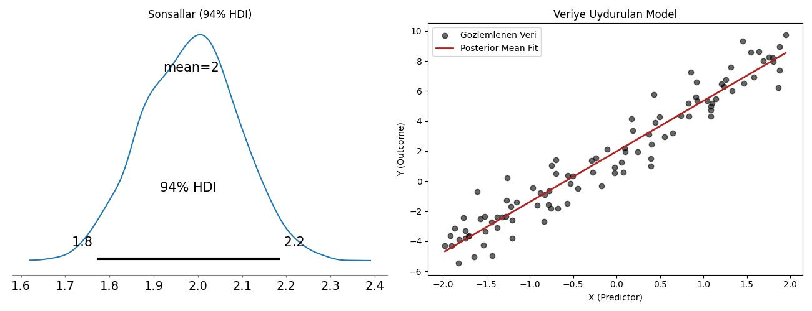

# PyMC

Olasılıksal Programlama adı verilen yaklaşımın en iyi örneği PyMC
paketidir herhalde. Bir Bayessel modelden örneklem toplamak, yani
sonsal (posterior) dağılımını bulmak için paket kullanmak istemezsek
bunu Metropolis yöntemi, ya da Gibbs örneklemesi gibi yöntemlerle
yapabilirdik, her şeyi sıfırdan kendimiz kodlardık. Fakat eğer
elimizde çetrefil bir model ise, ve/ya da pek çok farklı değişkeni,
onların ilişkilerini ardı ardına denemek istersek, PyMC gibi
"Olasılıksal Programcılık" yapmamızı sağlayan kütüphaneleri de
kullanmak mümkündür.

Temel olarak PyMC ile yapılan değişkenleri, varsa onların dağılımını
tanımlamak, veriyi sağlayıp gerisini pakete bırakmaktır.

PyMC değişkenleri deterministik olabilir, ya da olasılıksal olabilir.
Bir olasılıksal değişken, şöyle olabilir,

```python
pm.Normal("beta", mu=0, sigma=1)
```

Deterministik değişkenler düz hesaptırlar, olasılıksal ya da diğer
değişkenleri kullanarak bir hesap yaparlar, tabii ki temelleri
olasılıksal olduğu için onlar da olasılıksaldır. Bu temel olasılık
alanında rasgele değişkenlerin düz formüller ile birleştirilmesine
benzer. İki Gaussian dağılımı toplayabiliriz, log'unu alıp
çarpabiliriz, vs.

Bir model icinde kodlama suna benzer,


```python
import pymc as pm

with pm.Model() as model:
    # 1. Onseller -> Gozlemlenmiyor, sabit degerleri var
    beta = pm.Normal("beta", mu=0, sigma=1)
    sigma = pm.HalfNormal("sigma", sigma=1)

    # 2. Deterministik (Direk Hesap) -> Onsellerin fonksiyonu, her adimda guncellenir
    mu = beta * x_data

    # 3. Olurluk (Anchored) -> Gozlemlenen verinin, modeli baz alarak, olurlugunu hesapla
    y_obs = pm.Normal("y_obs", mu=mu, sigma=sigma, observed=y_data)
```


```python
import numpy as np
import pandas as pd
import pymc as pm
import arviz as az
import matplotlib.pyplot as plt

np.random.seed(42)

# Ornek veri yarat
true_intercept = 2.0
true_slope = 3.5
true_sigma = 1.2

N = 100
x_data = np.random.uniform(-2, 2, size=N)
noise = np.random.normal(0, true_sigma, size=N)
y_data = true_intercept + true_slope * x_data + noise

# Model tanimla
with pm.Model() as tutorial_model:
    
    # Onseller, baz degerleri sabit hiperparametreler (dagilimlar)
    alpha = pm.Normal("alpha", mu=0, sigma=10)       # Intercept prior
    beta = pm.Normal("beta", mu=0, sigma=10)         # Slope prior
    sigma = pm.HalfNormal("sigma", sigma=5)          # Noise scale prior
    
    # Deterministik hesap (her MCMC adiminda hesaplanir)
    # Onselleri tahmin edici parametreler ile birlestirip bir lineer tahmin yaratir
    mu = pm.Deterministic("mu", alpha + beta * x_data)
    
    # Olurluk, gozlemlenen veri burada dahil edilir, modele gore verinin olurlugu nedir
    y_obs = pm.Normal("y_obs", mu=mu, sigma=sigma, observed=y_data)

with tutorial_model:
    idata = pm.sample(
        draws=1000,
        tune=1000,
        chains=2,
        return_inferencedata=True,
        random_seed=42,
        progressbar=True
    )

print(az.summary(idata, var_names=["alpha", "beta", "sigma"]))

fig, axes = plt.subplots(1, 2, figsize=(13, 5))

az.plot_posterior(
    idata,
    var_names=["alpha", "beta", "sigma"],
    ax=axes[0]
)
axes[0].set_title("Sonsallar (94% HDI)")

axes[1].scatter(x_data, y_data, color="black", alpha=0.6, label="Gozlemlenen Veri")

post_alpha = idata.posterior["alpha"].values.flatten()
post_beta = idata.posterior["beta"].values.flatten()

x_plot = np.linspace(x_data.min(), x_data.max(), 100)

mean_alpha = post_alpha.mean()
mean_beta = post_beta.mean()
axes[1].plot(x_plot, mean_alpha + mean_beta * x_plot, color="firebrick", lw=2, label="Sonsal Ortalama Uyumu")

axes[1].set_xlabel("X (Tahminci)")
axes[1].set_ylabel("Y (Sonuc)")
axes[1].set_title("Veriye Uydurulan Model")
axes[1].legend()

plt.tight_layout()
plt.savefig("pymc_01.jpg")
```

```text
Data successfully generated.
        mean     sd  hdi_3%  hdi_97%  ...  mcse_sd  ess_bulk  ess_tail  r_hat
alpha  1.984  0.112   1.771    2.185  ...    0.003    2730.0    1388.0    1.0
beta   3.363  0.091   3.178    3.526  ...    0.002    3119.0    1368.0    1.0
sigma  1.101  0.079   0.952    1.253  ...    0.002    2778.0    1354.0    1.0

[3 rows x 9 columns]
```



MCMC Örneklem Değerlerine Erişim ve Sonsal Dağılımın Yorumlanması

PyMC ile model örneklemesi (`pm.sample`) tamamlandığında, algoritma
(varsayılan olarak NUTS/HMC) önsel dağılımlardan başlayarak verinin
olurluğu doğrultusunda parametre uzayında adımlar atar. Bu adımların
her biri `InferenceData` (`idata`) nesnesinin içindeki `posterior`
veri yapısında saklanır.

Örneklem zinciri tamamlandıktan sonra, parametrelerin adımlarını tek
tek incelemek veya her döngüdeki değerlerine erişmek
mümkündür. Örneğin ilk zincirdeki (Chain 0) ilk 5 örneklem adımına
erişmek için:

```python
# Her parametreye ait örneklem adımlarını ornekleyelim
alphas = idata.posterior["alpha"].values
betas = idata.posterior["beta"].values

# İlk 5 adımı basalım
for draw in range(5):
    print(f"Adim {draw}: alpha = {alphas[0, draw]:.4f}, beta = {betas[0, draw]:.4f}")
```

```text
Adim 0: alpha = 1.8337, beta = 3.2055
Adim 1: alpha = 1.8564, beta = 3.4190
Adim 2: alpha = 1.9959, beta = 3.2733
Adim 3: alpha = 1.9791, beta = 3.3675
Adim 4: alpha = 1.9791, beta = 3.3675
```

Grafik ve özet tablosu incelendiğinde ise:

* Sentetik Veri Üretim Parametreleri: $\alpha = 2.0$, $\beta = 3.5$,
    $\sigma = 1.2$

* Modelin Bulduğu Sonsal Ortalamalar: $\alpha \approx 1.98$, $\beta
    \approx 3.36$, $\sigma \approx 1.10$

Bayessel yaklaşım sadece nokta tahmini vermekle kalmamış, $\%94$
Yüksek Yoğunluk Aralığı (**HDI - High Density Interval**) ile gerçek
parametrelerin hangi aralıkta bulunduğuna dair belirsizliği de
başarıyla modellemiştir. Metriklerdeki $R_{hat} = 1.0$ değeri ise
Markov zincirlerinin kusursuz şekilde yakınsadığını (converge
olduğunu) teyit eder.

