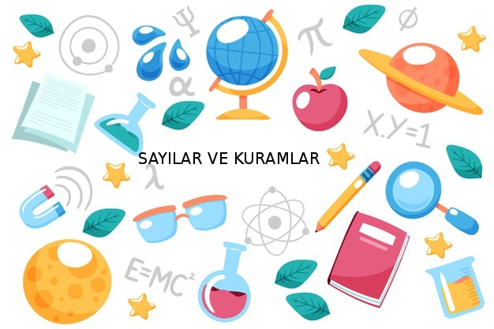

 

## En Son

6/9 - [Çok Değişkenli Calculus - Ders 29](https://burakbayramli.github.io/dersblog/calc_multi/calc_multi_29/ders_29.html)

23/8 - [Poligon, Üçgen Alanı - Ekler](https://burakbayramli.github.io/dersblog/algs/algs_075_enc/poligon_alani_nokta_bulutlari_noktalari_cevreleyen_bolgeler.html)

15/8 - [İmaj / Görüntü İşleme Teknikleri](https://burakbayramli.github.io/dersblog/sk/2023/06/imaj-isleme-teknikleri.html)

10/8 - [OSM, Şehir Ulaşım Verileri - Ekler](https://burakbayramli.github.io/dersblog/sk/2023/01/iett-ibb-otobus-verisi.html)

4/8 - [String Yapısı ve Python](https://burakbayramli.github.io/dersblog/sk/2023/08/string-python.html)

## Konular, Referans

[Python](2016/01/python.html)

[Unix](2020/07/unix.html)

[SQL](2012/03/sql.html)

[Coğrafi](2018/06/geo-cografi-enlem-boylam.html)

[Proje İdaresi](2020/07/proje-idaresi.html)

[Web, HTML](2023/04/web-html.html)

[Network, TCP/IP, Internet](2000/10/network.html)

[Android](2023/05/android.html)

[Animasyonlu Matematik](2023/02/animasyonlu-matematik-video.html)

[Elektrik, Elektronik](2020/08/elektronik.html)

[Nereden Başlarım](2019/01/nereden.html)

[Github Depoları](https://github.com/burakbayramli)

[Blog İçeriği PDF Olarak](https://drive.google.com/uc?export=view&id=1Yq6ovajFbXFWurbiFNhXOl0iN5NlkKtE)

[Tüm Matematik Içeriği](https://burakbayramli.github.io/dersblog/)

[Teknik Terimler Sözlüğü](https://burakbayramli.github.io/dersblog/algs/dict/teknik_terimler_sozlugu.html)

## Arşiv

[Sene](year.html)

[Ara](ara.html)

