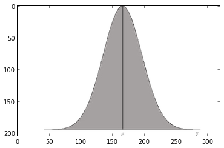
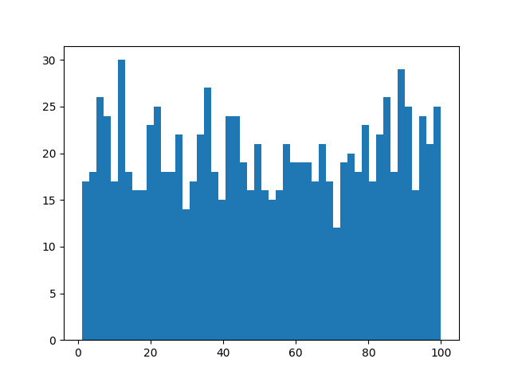
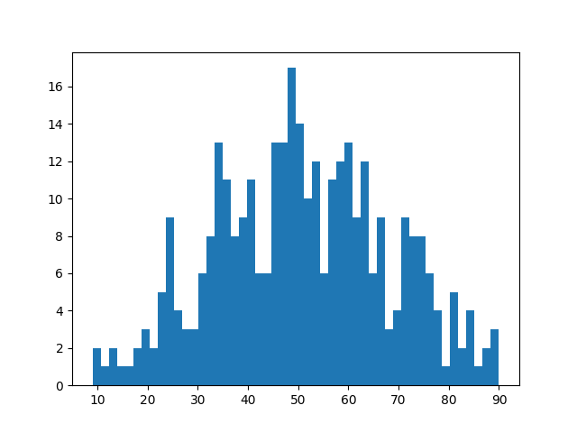
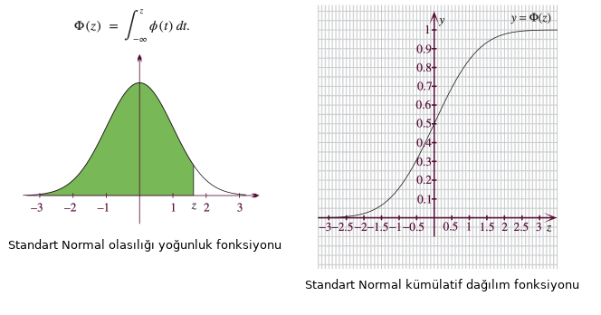
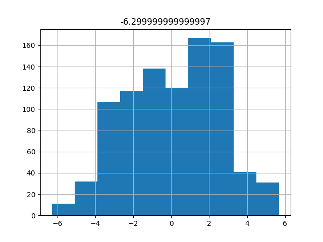
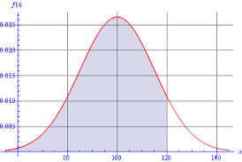
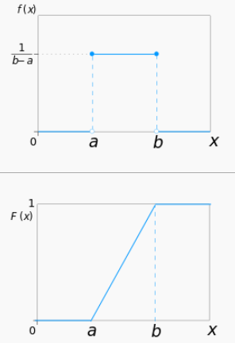
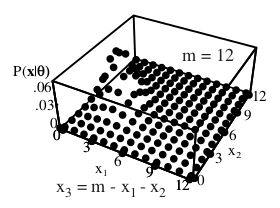
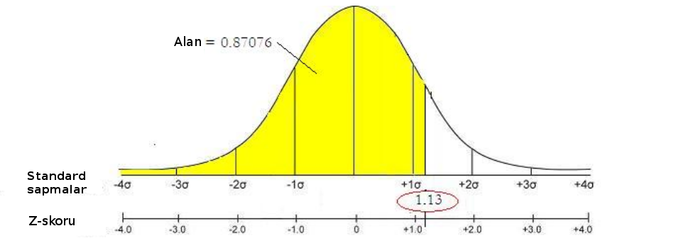
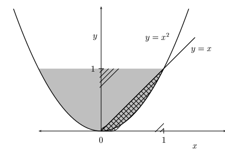

# Olasılık, Dağılımlar, Giriş

Dağılımlar

Doğada yapılan çoğu ölçümlerin sıklık / frekans grafiğini alınca sonucun
aşağıda gibi çıkması ilginçtir.



Mesela herhangi bir şehirde, ilçede 2000 yetişkinin kilosunu ölçün. Grafiğini
alın kesinlikle yukarıdaki tepe şekli çıkacak. Ya da, 1000 kişinin boyunu ölçün,
aynı tepe şekli. Keskin nişancının hedefe attığı kurşunların hedefe yakınlığını
ölçüp sıklık grafiğine bakın. Gene aynı tepe şekli!  Nasıl oluyor bu iş?
Açıklama için, normal dağılım eğrisinden bahsetmemiz gerekecek. Not: Frekans
grafiği, X sayısının ne kadar çıktığını sayıp, Y ekseni üzerinde bu sayıyı X'e
tekabül ederek kolon olarak göstermeye denir. Mesela, 60 kilo değeri 13 kere
çıktı ise, X=60, Y=13 gibi bir kolon çizilecektir.

Normal Dağılım Eğrisi

Normal dağılımın olasılık kavramı ile yakın bağları var. Bu konuda ünlü bir
deney zar atma deneyidir. Elimizde tek bir zar var, ve bu zarı arka arkaya
atalım. Sabrımız yeterse 1000 kere atalım. Sonuçta, frekans grafiği eşit bir
dağılımda olacaktır.

Bunun sebeplerini anlamak zor değil. Her zar atış olayı birbirinden bağımsız, ve
her sayının üstte gelme ihtimali birbirine eşit olduğu için (1/6), her sayıdan
eşit miktarda gelecek. Tabii bu durumu görmek için deneyin birçok kere
tekrarlanması gerekiyor.

Şimdi deneyi biraz değiştirelim, bir yerine 2 zar atalım. Hatta 4 zar atalım, ve
bu sefer sıklık grafik hanesine yazmadan çıkan sayıları önce toplayalım. Bu
çıkan toplamın sıklık grafiğini alalım.

İşte bu sıklık grafiği göreceğiz ki, üstte görülen tepe grafiğine yaklaşıyor. Ne
kadar çok zar atarsak, bu benzerlik o kadar daha fazla olacaktır.

Sebep kabaca tahmin edilebilir, 1 ile 6 arası sayıların tek bir zardan gelme
olasılığı aynı, evet. Fakat toplamlara gelince, mesela iki zarlı örnekte, 10
sayısının olasılığı 2 sayısından daha yüksek. Çünkü, 10 sayısını 5-5, 4-6 ya da
6-4 ile alabiliyoruz. 2 sayısı sadece 1-1 ile geliyor.

Buradan şu sonuç çıkabilir: Eğer doğada ölçtüğümüz bir kavramın oluşmasında
birden fazla etken var ise, o ölçümlerin sıklığı her zaman çan (bell shape)
şeklinde olacaktır. Bir kişinin boyunu, kilosunu etkileyen pek çok diğer faktör
olduğu için bu ölçütlerin dağılımlarının normal çıktığı iddia
edilebilir. Üstteki örnekteki toplamların dağılımının çan eğrisine yaklaşması
durumu istatistikte Merkezi Limit Teorisi ile ispatlanmıştır.

Bu durumu hesap yapıp kendimiz de görebiliriz. İlk önce, [random.org](random.org)
sitesinden rasgele sayı üreteceğiz. Bu site kimsenin kullanmadığı radyo
kanallarından atmosfer gürültüsü dinleyip, bu gürültüleri sayısal değere
çevirerek rasgele sayı üretiyor. Gerçek rasgele sayı üretmek pek kolay bir iş
değil. Her ne kadar bilgisayarımızda rasgele sayı üreten birçok algoritma olsa
bile, bu algoritmalar belli bir sayı üretiminden sonra kendini tekrar etmeye
başlıyorlar, bu sebeple onlara yarı-rasgele (pseudorandom) sayılar ismi
veriliyor. Gerçek rasgele sayılar için dış bir kaynağa bağlanmak bir seçenek
olabilir. Ama şunu da söylemek lazım, simulasyon tekniklerinin tamamı için
yarı-rasgele sayılar yeterlidir.

Neyse bahsedilen siteden rasgele sayıları üretip, bir veri dosyasına koyuyoruz,
kod ile bu sayıları okuyup, ilk önce teker teker sayıların sıklık grafiğini,
ondan sonra sayıları üçer üçer toplayıp, onların grafiğini alıp göstereceğiz.

```python
A = np.loadtxt('rasgele.dat')
plt.hist(A, 50)
plt.savefig('stat_intro_08.png')
```



```python
A = np.loadtxt('rasgele.dat');
B = []

i = 1;

while (i < 998):
  toplam = 0
  s = A[i]
  toplam = toplam + s
  s = A[i+1]
  toplam = toplam + s
  s = A[i+2]
  toplam = toplam + s
  B.append(toplam/3)
  i = i + 3

plt.hist(B, 50);
plt.savefig('stat_intro_09.png')
```



Dağılım normal dağılıma benziyor.

Giriş konularını teker teker işlemeden önce derinleme bir dalış yapıp tüm
kavramlara değinelim. İstatistiğin temel öğelerinden biri yoğunluk fonksiyonudur
(probability density function), mesela

$$
f(x)=N \cdot e^{-\frac{(x-\mu)^2}{2\sigma^2}}
$$

ki $N$ normalize edici bir faktör, $\frac{1}{\sqrt{2\pi\sigma^2}}$, $\sigma$,
$\mu$ dışarıdan bizim tanımladığımız parametreler. $N$ kısmı çarpılan bölümün
biri bölen entegrali aslında, ki böylece tüm yoğunluğun entegrali (yani tüm
olasılık) 1 olabilsin. Bu şekilde pek çok fonksiyon olasılık yoğunluğu haline
getirebilir.

Farklı yoğunluk fonksiyonları var, hangisinin hangi tür veriye uyacağını bulmak
istatistikçinin önemli işlerinden. Yoğunluk çok boyutlu da olabilir.

Tek boyutlu bir yoğunluk fonksiyonun x-ekseni üzerindeki alanı her zaman 1'e
eşit olmalıdır (yani yoğunluğun $-\infty,\infty$ üzerinden entegrali her zaman 1
sonucunu vermeli). Olasılık teorisinin işlemesi için bu gerekli.

Yoğunluk fonksiyonları doğadan gelen bir tek ölçümü alırlar, boy, kilo gibi, ve
onun 'olasılık yoğunluğunu' hesaplarlar. Üstteki örnek için mesela 3 ve 1
değerlerinin yoğunluğunu hesaplayalım,

```python
mu = 0
sigma = 1  
def f(x): return (1 / (np.sqrt(2 * np.pi * np.power(sigma, 2)))) * \
    (np.power(np.e, -(np.power((x - mu), 2) / (2 * np.power(sigma, 2)))))
print ('3 icin', f(3))
print ('1 icin', f(1))
```

```text
3 icin 0.004431848411938008
1 icin 0.24197072451914337
```

1 değeri 3'ten daha düşük -- çünkü bu 0 merkezli bir yoğunluk fonksiyonu, sıfıra
ne kadar yakınsa yoğunluk o kadar fazla. Bu fonksiyonun tasarlanış şekli
böyle. Eğer tüm olası değerleri $x$'e verip grafiklesek,

```python
x = np.array(np.linspace(-3,3,num=50))
y = f(x)
plt.plot(x,y)
plt.savefig('stat_intro_03.png')
```


Dikkat: yoğunluk fonksiyonu olasılık değildir; bazı yoğunluk değerleri bazı
sürekli fonksiyonlarda 1'den fazla çıkabilir! Sürekli ortamda olasılık bir
entegraldir, daha önce söylediğimiz gibi tüm fonksiyon alanı 1. Altta bir normal
dağılım yoğunluk fonksiyonu solda, onun entegrali kümülatif dağılım fonksiyonu
(CDF) sağda.



CDF bize mesela üstteki grafikte değerin 0 ila 1.5 arasında olma *olasılığını*
veriyor.

CDF hesabı için istatistik yazılım paketlerinde muhakkak bir çağrı olur, mesela
`scipy.stats` ile,

```python
import scipy.stats
print (scipy.stats.norm.cdf(1.5,0,1))
```

```text
0.9331927987311419
```

1'ye yakın oldukca büyük bir sayı, grafiğe uygun. CDF her zaman 0'dan sorulan
değere kadar olan alanı verir, tüm alanın 1 olması bilgisinden hareketle bu
öğeler biraraya koyulup ek sonuçlara varılabilir, mesela değerin 1.5'tan büyük
olma olasılığı için 1-CDF(1.5). Eğer -2 ile 2 arası olma olasılığını istiyorsak
CDF(2)-CDF(-2).

Veriden Fonksiyon

Şimdi mesela elimizde bir grup kişinin 68 kiloya ne kadar yakın / uzak
olduğunun verisi var (68'ten az olanlar eksi değerli olacak tabii). Veriyi
grafikleyelim,

```python
import pandas as pd
df = pd.read_csv('boy68.csv')
df.hist()
plt.savefig('stat_intro_04.png')
```



Dikkat veriyi grafiklemek için histogram kullandık, yani verinin
"frekansını'' bastık, bu tür grafiklere göre mesela eğer 3 değeri 10 kere
geldi, 1 değeri 2 kere geldi ise 3'un üzerindeki sütun diğerinden daha
yüksek olacaktır, çünkü onun "frekansı'' daha fazla.  

Bir histogramın aslında yoğunluk fonksiyonunun verisel / ayrıksal hali
olduğu da düşünülebilir.

Şimdi biz analizci olarak bu grafiğe bakarız, ve deriz ki acaba biraz önceki
$f(x)$ yoğunluğu bu veriye "uyar mı''? Uyar ise ne güzel, $f(x)$ bir sürekli
fonksiyon, derli toplu, onun üzerinde pek çok işlem yapabiliriz, bu veriyle
işlem yaparken o fonksiyonu kullanmak bize bazı avantajlar sağlayabilir. Eğer
temsil edemez ise hangi başka yoğunluk edebilir?  Vs..  İstatistik notlarımızda
tüm bunların cevabını bulacağız. Bazen yoğunlukların sabitleri olacak (mesela
merkez 0 yerine başka bir yerde olsun diyebilmek), ve bu sabitleri,
hiperparametreleri veriden hesaplamanın yolları var.. Veriden teoriksel
yoğunluğa, oradan başka teorilere, oradan tekrar veriye atlayabilmek
istatistiğin özü.

Diyelim ki bir şekilde verinin Normal olduğuna karar verdik (bunun testleri,
metotu var tabii) o zaman veriye uygun $\mu,\sigma$ parametrelerini nasıl
bulacağız? Veriyi kullanıp bir hesap yaparak! Tahmin ediciler burada devreye
giriyor, mesela Normal dağılım için $\mu$ tahmin edici / kestirme hesaplayıcısı
$\hat{\mu} = \sum x_i / n$, yani verinin ortalaması [5]!

Ayrıksal Dağılımlar

Normal dağılım, üstel dağılım birer sürekli fonksiyondurlar, tek boyutta $x$
bir reel sayıdır. Fakat ayrıksal olan dağılımlar da var, mesela Poisson,

$$ f(x) = e^{-\lambda}\lambda^{x} / x! $$

ki dışarıdan tanımlı parametre $\lambda$. Burada geçilen $x$ tam sayı değerler,
1,2,3 gibi.. Ayrıksal olasılık kütle fonksiyonu (süreklideki olasılık yoğunluk
yerine) sonuçları birer olasılık olarak kabul edilebilir, çünkü tam sayılar bir
nevi kutucuk, geniş alan oluştururlar.

```python
from scipy.special import factorial

def poisson_distribution(k, lam):
    return (lam ** k * np.exp(-lam)) / factorial(k)

x = np.array(range(20))
y = poisson_distribution(x,lam=5)
plt.plot(x,y)
plt.savefig('stat_intro_12.png')
```


Poisson dağılımın sola doğru meyilli olabileceğini görüyoruz üstte, demek ki
veride bu tür bir şekil görürsek onu temsil için Poisson seçebiliriz.

Şartsal Olasılık

$A$ olayının $B$ verili olduğu durumdaki şartsal olasılığı şu şekilde
tanımlanır [6, sf. 12],

$$
P(A | B) = \frac{P(A \cap B)}{P(B)}
$$

Not: Çoğu notasyonda ve ilerideki notlarımızda $P(A \cap B) = P(A,B)$
olarak gösterilir.


Toplamsal (Total) Olasılık Kanunu

$A$ bir olay olsun, ve $B_1,B_2,..,B_n$ olayları $\Omega$ bölümleri
olsun. O zaman

$$
P(A) = _{i=1}^{n} P(A|B_i) P(B_i)
$$

İspat

Toplam kuralı bize $P(A) = \sum_{i=1}^{n} P(A \cap B_i)$ verir ve çarpım
kuralı $P(A \cap B_i) = P(A|B_i) P(B_i)$. Bunun üzerinden bir $B$
toplamı almak bize $P(A)$ yi verecektir.

Bayes Kanunu

$A$ bir olay olsun ki olasiligi $P(A)$ ve diyelim ki $B_1,B_2,..,B_n$
olayları $\Omega$ uzayinin bölümleri. O zaman

$$
P(B_j | A) =
\frac {P(A | B_j) P(B_j)} {\sum_{i=1}^{n}P(A | B_j) P(B_i) }
$$

İspat

Tanım itibariyle $P(B_j | A) = P(A \cap B_j) / P(A) = P(A | B_j) P(B_j) / P(A)$.
Şimdi Toplam Olasılık Kuralını $P(A)$'ya uygulayınca ispat tamamlanır.

Rasgele Değişkenler

Rasgele değişkenler çoğunlukla büyük harfle gösterilirler, mesela $X$ ya da $Y$
gibi ve bir dağılıma / onun yoğunluk fonksiyonuna göbekten
bağlantılıdırlar. Onları formül içinde görünce sanki her bakışınızda içlerinin
başka bir rasgele sayı ile doldurulduğunu düşünebiliriz, ama tabii ki bu
"rasgelelik'' o RD'nin bağlı olduğu dağılıma göredir. Eğer $X$ üstteki $f(x)$
ile dağılmış dersek, o zaman sıfıra yakın daha çok, 5'e yakın daha az değerler
üretilir.

RD'leri formül içinde bile kullanabilirsiniz, mesela 

$$ 3X + \log X $$ 

diyebilirdim. Başka değişkenler $Y,Z$ vs formüle ekleyebilirdim. RD'lerin
bu tür işlemleri sonucu başka tür RD'ler ortaya çıkabilir (yani sonuç
RD'nin bağlı olduğu dağılım farklı bir dağılım olabilir), İstatistik ayrıca
bu sonuç dağılımlarının ne olabileceği hakkında güzel dersler içerir.

Tekrarlamak gerekirse, $f(x)$'e verilen $x$ ile $X$'in değerleri birbirine
karışmasın. İlki için bildiğimiz bir $x$'in olasılığını soruyoruz, mesela
"3'ün olasılığı ne?'' diğerinde bize $f(x)$'e göre bir sayı üret diyoruz,
ve 0.3, 0.1, 0., 0.5 gibi değerler geliyor, kırk yılda bir de bir 3 geliyor
belki.

Şimdi istatistiğin temelini oluşturan olasılık teorisinden bahsedelim.

Olasılık

Örneklem Uzayı (Sample Space)

Örneklem uzayı $\Omega$ bir deneyin mümkün tüm olasılıksal sonuçların
(outcome) kümesidir. Eğer deneyimiz ardı ardına iki kere yazı (T) tura (H)
atıp sonucu kaydetmek ise, bu deneyin mümkün tüm sonuçları şöyledir

$$\Omega = \{HH,HT,TH,TT\} $$

Sonuçlar ve Olaylar (Outcomes and Events)

$\Omega$ içindeki her nokta bir sonuçtur (outcome). Olaylar $\Omega$'nin
herhangi bir alt kümesidir ve sonuçlardan oluşurlar. Mesela üstteki
yazı-tura deneyinde "iki atışın içinden ilk atışın her zaman H gelmesi
olayı'' böyle bir alt kümedir, bu olaya $A$ diyelim, $A =
\{HH,HT\}$.

Ya da bir deneyin sonucu $\omega$ fiziksel bir ölçüm , diyelin ki sıcaklık
ölçümü. Sıcaklık $\pm$, reel bir sayı olduğuna göre, $\Omega = (-\infty,
+\infty)$, ve sıcaklık ölçümünün 10'dan büyük ama 23'ten küçük ya da eşit
olma "olayı'' $A = (10,23]$. Köşeli parantez kullanıldı çünkü sınır
değerini dahil ediyoruz. 

Örnek 

10 kere yazı-tura at. $A$ = "en az bir tura gelme'' olayı olsun. $T_j$ ise
$j$'inci yazı-tura atışında yazı gelme olayı olsun. $P(A)$ nedir? 

Bunun hesabı için en kolayı, hiç tura gelmeme, yani tamamen yazı gelme
olasılığını, $A^c$'yi hesaplamak, ve onu 1'den çıkartmaktır. $^c$ sembolü
"tamamlayıcı (complement)'' kelimesinden geliyor.

$$ P(A) = 1 - P(A^c) $$

$$ = 1 - P(\textit{hepsi yazı}) $$

$$ = 1-P(T_1)P(T_2)...P(T_{10}) $$

$$ = 1 - \bigg(\frac{1}{2}\bigg)^{10} \approx .999 $$

Rasgele Değişkenler (Random Variables)

Bir rasgele değişken $X$ bir eşlemedir, ki bu eşleme $X: \Omega \to
\mathbb{R}$ her sonuç ile bir reel sayı arasındaki eşlemedir.

Kabaca anlatmak gerekirse rasgele değişken $X$'in, bağlı olduğu dağılımın
zar atılmış değerini içerdiği, ve bu değerlerden bazılarını
filtreyebildiği, düşünülebilir. Her rasgele değişken tek bir dağılıma
bağlıdır, ve $X$'e ne zaman referens edersek onun içinin bu dağılımdan
gelen bir sayı ile doldurulduğunu hayal etmek gerekir, tabii ki çoğu
dağılımda bazı sayılar daha olasıdır, ve bu içi doldurmanın çoğunlukla bu
olası sayılardan olacağı düşünülebilir.

Olasılık derslerinde bir noktadan sonra artık örnekleme uzayından
bahsedilmez, ama bu kavramın arkalarda bir yerde her zaman devrede olduğunu
hiç aklımızdan çıkartmayalım. 

Örnek

10 kere yazı-tura attık diyelim. VE yine diyelim ki $X(\omega)$ rasgele
değişkeni her $\omega$ sıralamasında (sequence) olan tura sayısı. Mesela
eğer $\omega = HHTHHTHHTT$ ise $X(\omega) = 6$. Tura sayısı eşlemesi
$\omega$ sonucunu 6 sayısına eşledi.

Örnek

Rasgele değişken $X$ iki zar atınının toplamı olabilir. 

$$ P(X=2) = P(\textrm{iki tane 1 gelme şansı}) = 1/36 $$

$$ P(X=3) = P((1,2),(2,1)) = 2/36 $$

$$ \vdots $$

Örnek 

$\Omega = \{ (x,y); x^2+y^2 \le 1 \}$, yani küme birim çember ve içindeki
reel sayılar (unit disc). Diyelim ki bu kümeden rasgele seçim
yapıyoruz. Tipik bir sonuç $\omega = (x,y)$'dir. Tipik rasgele değişkenler
ise $X(\omega) = x$, $Y(\omega) = y$, $Z(\omega) = x+y$ olabilir. Görüldüğü
gibi bir sonuç ile reel sayı arasında eşleme var. $X$ rasgele değişkeni
bir sonucu $x$'e eşlemiş, yani $(x,y)$ içinden sadece $x$'i çekip
çıkartmış. Benzer şekilde $Y,Z$ değişkenleri var. 

Toplamsal Dağılım Fonksiyonu (Cumulative Distribution Function -CDF-)

Tanım

$X$ rasgele değişkeninin CDF'i $F_X: \mathbb{R} \to [0,1]$ tanımı

$$ F_X(x) = P(X \ge x) $$

Eğer $X$ ayrıksal ise, yani sayılabilir bir küme $\{x_1,x_2,...\}$ içinden
değerler alıyorsa olasılık fonksiyonu (probability function), ya da olasılık
kütle fonksiyonu (probability mass function -PMF-)

$$ f_X(x) = P(X = x) $$

Bazen $f_X$, ve $F_X$ yerine sadece $f$ ve $F$ yazarız.

Tanım

Eğer $X$ sürekli (continuous) ise, yani tüm $x$'ler için $f_X(x) > 0$,
$\int_{-\infty}^{+\infty}f(x) \mathrm{d} x = 1$ olacak şekilde bir $f_X$ mevcut ise, o
zaman her $a \le b$ için

$$ P(a<X<b) = \int_{a}^{b}f_X(x) \mathrm{d} x $$

Bu durumda $f_X$ olasılık yoğunluk fonksiyonudur (probability density function
-PDF-). 

$$ F_X = \int_{\infty}^{x}f_X(t) \mathrm{d} t $$

Ayrıca $F_X(x)$'in türevi alınabildiği her $x$ noktasında  $f_X(x) = F'_X(x)$
demektir. 

Dikkat! Eğer $X$ sürekli ise o zaman $P(X = x) = 0$ değerindedir. $f(x)$
fonksiyonunu $P(X=x)$ olarak görmek hatalıdır. Bu sadece ayrıksal rasgele
değişkenler için işler. Sürekli durumda olasılık hesabı için belli iki
nokta arasında entegral hesabı yapmamız gereklidir. Ek olarak PDF 1'den
büyük olabilir, ama PMF olamaz. PDF'in 1'den büyük olabilmesi entegrali
bozmaz mı? Unutmayalım, entegral hesabı yapıyoruz, noktasal değerlerin 1
olması tüm 1'lerin toplandığı anlamına gelmez. 

Olasılık *yoğunluk* fonksiyonundaki yoğunluk kelimesini tekrar
vurgulamak iyi olur. Özellikle sürekli dağılım bağlamında bu kavramı hakiki
yoğunluk gibi düşünmek iyi olur. Mesela tamamı aynı maddeden olan bir küp
düşünelim, yoğunluğu 2. Bu küpün neresine bakarsak bakalım yoğunluk hep
aynı olur, 2. Yoğunluk bir bakıma belli bir alanı temsil eden bir
*özet*. Sonra bu küpün kütlesini bulmak için habire bir sürü 2'yi üst üste
koyup toplamıyoruz; kütle hesabı için bir çarpım yapıyoruz / entegral
alıyoruz.

Örnek olarak çan eğrisi / normal dağılımdan sayılar üretelim. Bu dağılımda
"ağırlık'' ortadadır. Rasgele sayı üretip histograma bakalım,

```python
mu=10;sigma=0.1
data = np.random.normal(mu,sigma,100)
hst = plt.hist(data,bins=6,density=True)
print (hst[0])
```

```text
[0.25361812 1.9021359  3.93108086 3.29703556 2.15575402 1.14128154]
```

Görüldüğü gibi 1'den büyük değerler var, ve "yoğunluk'' ortadaki iki
kutuda. Olasılık yoğunluk hesabını formülsel yapsak, mesela 10 noktasının
ağırlığı nedir desek, 

```python
print (scipy.stats.norm.pdf(10,mu,sigma))
```

```text
3.989422804014327
```

Şimdi olasılık değerleri, $P(a < X < b)$ ifadesi, alan hesabı ve rasgele
değişkenler arasındaki bağlantıyı biraz daha detaylandırmak gerekirse; $X$
bir rasgele değişken, nokta (kesin) değeri olmasa da denklemde
kullanılabiliyor, toplanıp çıkartılabiliyor, vs. Bu değişkene "değeri
sorulduğunda'' bu değer o $X$'in bağlı olduğu dağılımın zar atması
sonucunda gelecektir. Bu zar atışı ise olasılık fonksiyonunun yüksek değer
verdiği $x$ değerlerini daha fazla üretecektir doğal olarak. Bunu kavramsal
olarak söylüyoruz tabii, istatistiki problemlerde illa bu zar atışını
yapmamız gerekmeyebilir.



Mesela üstteki dağılım için 100 ve çevresindeki değerlerinin olasılığı çok
yüksek, mesela grafiğe bakarsak, kabaca, $f_X(100) = 0.027$, ya da
$f_X(120) = 0.015$.  Demek ki bu dağılıma bağlı bir $X$, o çevreden daha
fazla değer üretir.

Rasgele değişkene bağlı olasılık hesabı için ise, mesela $P(X < 120)$
diyelim, bu ifade ile ne diyoruz? Sorduğumuz şudur, zar atışlarının belli
değer altında gelmesi olasılığı... Bu hesap tabii ki bir alan hesabıdır, x
eksenindeki belli aralıklar, bölgelerin toplam olasılığının ne olacağı o
bölgenin tam üzerindeki yoğunluğun toplamı olacaktır, aynen tek
değerlerin olasılığının o tek değerin yoğunluk değeri olması gibi. Yani
bu tür olasılık hesapları direk $f_X(x)$ üzerinden yapılacaktır. Zar
atıldığında 100'den küçük değerlerin gelme olasılığı nedir? Alana bakarsak
0.5, yani 1/2, tüm alanın yarısı. Bu normal, çünkü 100'den küçük değerler
dağılımın yarısını temsil ediyor. 200'den küçük değerler gelme olasılığı
nedir, yani $P(X < 200)$? Olasılık 1. $f_X$ alanının tamamı. Yani
kesin. Çünkü yoğunluk fonksiyonunun tamamı zaten 200'den küçük değerler
için tanımlı. "Yoğunluk orada''.

Tanım

$X$ rasgele değişkeninin CDF'i $F$ olsun. Ters CDF (inverse cdf), ya da yüzdelik
dilim fonksiyonu (quantile function)

$$ F^{-1}(q) = \inf \bigg\{ x: F(x) \le q \bigg\} $$

ki $q \in [0,1]$. Eğer $F$ kesinlikle artan ve sürekli bir fonksiyon ise
$F^{-1}(q)$ tek bir $x$ sayısı ortaya çıkarır, ki $F(x) = q$. 

Eğer $\inf$ kavramını bilmiyorsak şimdilik onu minimum olarak düşünebiliriz. 

$F^{-1}(1/4)$ birinci çeyrek

$F^{-1}(1/2)$ medyan (median, ya da ikinci çeyrek), 

$F^{-1}(3/4)$ üçüncü çeyrek 

olarak bilinir. 

İki rasgele değişken $X$ ve $Y$ dağılımsal olarak birbirine eşitliği, yani
$X \ \buildrel d \over = \ Y$ eğer $F_X(x) = F_Y(x)$, $\forall x$. Bu $X,Y$ birbirine eşit, birbirinin 
aynısı demek değildir. Bu değişkenler hakkındaki tüm olasılıksal işlemler, 
sonuçlar aynı olacak demektir.

Uyarı! "$X$'in dağılımı $F$'tır'' beyanını $X \sim F$ şeklinde yazmak bir
gelenek. Bu biraz kötü bir gelenek aslında çünkü $\sim$ sembolü aynı
zamanda yaklaşıksallık kavramını belirtmek için de kullanılıyor.


Tanım

$x_1,..,x_n$ verilerini içeren örneklemin (sample) ortalaması 

$$ \bar{x} = \frac{1}{n} \sum x_i
\qquad (1)
$$

Dikkat bu örneklemdeki verinin ortalaması. Hiçbir dağılım hakkında hiçbir
faraziye yapmadık. Ayrıca tanım kullandık, yani bu ifadenin ne olduğu
tamamen bize bağlı. 

Örneklem ortalaması sadece tek merkezi bir tepesi olan (unimodal)
dağılımlar için geçerlidir. Eğer bu temel varsayım geçerli değilse,
ortalama kullanarak yapılan hesaplar bizi yanlış yollara götürür. Ayrıca
bir dağılımı simetrik olup olmadığı da ortalama ya da medyan kullanılıp
kullanılmaması kararında önemlidir. Eğer simetrik, tek tepeli bir dağılım
var ise, ortalama ve medyan birbirine yakın olacaktır. Fakat veri başka
türde bir dağılım ise, o zaman bu iki ölçüt birbirinden çok farklı
olabilir.

Dağılımlar

Bernoulli Dağılımı

$X$'in bir yazı-tura atışını temsil ettiğini düşünelim. O zaman $P(X = 1) =p$, 
ve $P(X = 0) = 1 - p$ olacaktır, ki $p \in [0,1]$ olmak üzere. O zaman
$X$'in dağılımı Bernoulli deriz, $X \sim Bernoulli(p)$ diye
gösteririz. Olasılık fonksiyonu, $x \in \{0,1\}$.

$$ f(x;p) = p^x(1-p)^{(1-x)} $$

Yani $x$ ya 0, ya da 1. Parametre $p$, 0 ile 1 arasındaki herhangi bir reel 
sayı. 

$$ E(X) = p $$

$$ Var(X) = p(1-p) $$

Uyarı!

$X$ bir rasgele değişken; $x$ bu değişkenin alabileceği spesifik bir değer;
$p$ değeri ise bir *parametre*, yani sabit, önceden belirlenmiş reel
sayı. Tabii istatistiki problemlerde (olasılık problemlerinin tersi olarak
düşünürsek) çoğunlukla o sabit parametre bilinmez, onun veriden
hesaplanması, kestirilmesi gerekir. Her halükarda, çoğu istatistiki modelde
rasgele değişkenler vardır, ve onlardan ayrı olarak parametreler vardır. Bu
iki kavramı birbiriyle karıştırmayalım.

Binom Dağılımı (Binomial Distribution)

Her biri birbirinden bağımsız ve birbiriyle aynı Bernoulli Dağılımına sahip
deneylerden $n$ tane yapıldığını farzedelim, ki bu deneylerin sadece iki
sonucu olacak (1/0. başarı/başarısızlık, vs). Bu deneylerin $p$'sı aynı
olacak. O zaman $n$ deney içinden toplam kaç tanesinin başarılı olduğunu
gösteren $X$ rasgele değişkeni Binom Dağılımına sahiptir denir. 

Bu dağılımın yoğunluğu 

$$ f(x;p,n) = {n \choose{x}} p^x(1-p)^{n-x} $$

$$ = \frac{n!}{x!(n-x)!} p^x(1-p)^{n-x}  $$

Bu fonksiyonun parametreleri $p,n$ değerleridir. Beklenti ve varyans

$$ \mu = E(X) = np $$

$$ \sigma^2 = Var(X) = np(1-p) $$

Birörnek (Uniform) Dağılım



$X$ birörnek, $Uniform(a,b)$ olarak dağılmış deriz, ve  bu 
$X \sim Uniform(a,b)$ olarak yazılır eğer 

$$ f(x)  = 
\left\{ \begin{array}{ll}
\frac{ 1}{b-a} & x \in [a,b] \ icin \\
0 & diger
\end{array} \right.
$$

işe ve $a<b$ olacak şekilde. CDF hesabı olasılık eğrisinin entegralini
temel alır, düz dağılım bir $a,b$ arasında $1/b-a$ yüksekliğinde bir 
dikdörtgen şeklinde olacağı için, bu dikdörtgendeki herhangi bir $x$
noktasında CDF dağılımı, yani o $x$'in başlayıp sol tarafın alanının hesabı
basit bir dikdörtgensel alan hesabıdır, yani $x-a$ ile $1/b-a$'nin
çarpımıdır, o zaman 

$$ F(x) = 
\left\{ \begin{array}{ll}
0 & x < a \\
\frac{ x-a}{b-a} & x \in [a,b] \\
1 & x > b
\end{array} \right.
$$

Beklenti $E[X] = 1$. 

Multinom (Multinomial) Dağılım 

Çok boyutlu $X$ rasgele değişkeni, ki boyutu $k$ olarak tanımlayalım, 
$X \sim Mult(m,p)$ olarak dağılmıştır deriz, eğer bu dağılım $k$ sınıf, kategori
içinden birinin seçildiği durumda $m$ deney içinden kaç tanesinin hangi
kategorilerde olduğunu temsil ediyorsa, ve $p$ çok boyutludur. Multinom, 
binom dağılımının çok kategorili halidir denebilir, ya da binom, 
multinomun $k=2$ halidir. Olasılıklar,

$$ P(X_1=m_1,...,X_k=m_k) = f(x;m,p) $$

ki $m_k$, $k$'inci kategoriden kaç tane görüldüğü. Olasılık yoğunluk
fonksiyonu,

$$ f(x;m,p) = \frac{m!}{x_1! \cdot \cdot !x_k!} p_{1}^{x_1} \cdot \cdot  p_{1}^{x_k} $$

Beklenti $ E(X) = p $. Her kategori, hücre $i$ için tabii ki $ E(X_i) = p$, 
varyans ise $Var(X_i) = m p_i(1-p_i)$. Kovaryans $Covar(X_i,X_j) =
-mp_ip_j$. 
Bunun türetilmesini ilerideki bir bölümde göreceğiz. 



Poisson Dağılımı

Sayım verilerini (count data) modellemek için bu dağılım çok
kullanılır. Tanımı, 

$$ f(x) = P(X=x) = e^{-\lambda}\frac{\lambda^{x}}{x!} $$

Poisson dağılımını tanımlayan $\lambda$ sabitidir. Belli bir Poisson
yoğunluk fonksiyonu göstermek için $f(x;\lambda)$ gibi bir tanım
görebilirsiniz. Bu dağılımın önemli bir özelliği ortalama ve varyansının
aynı olmasıdır. 

Normal (Gaussian) Dağılım

$X \sim N(\mu, \sigma^2)$ ve PDF

$$ f(x) = \frac{1}{\sigma\sqrt{2\pi}} 
\exp \bigg\{ - \frac{1}{2\sigma^2}(x-\mu)^2  \bigg\}
, \ x \in \mathbb{R}
$$

ki $\mu \in \mathbb{R}$ ve $\sigma > 0$ olacak şekilde. Bazıları bu
dağılımı 

$$  
= \frac{1}{\sigma\sqrt{2\pi}} 
\exp \bigg\{ -\frac{1}{2}(x-\mu)\sigma^{-2}(x-\mu)  \bigg\}
$$

olarak gösterebiliyor, çünkü bu şekilde (birazdan göreceğimiz) çok boyutlu
Gaussian formülü ile alaka daha rahat gözüküyor. 

İleride göreceğiz ki $\mu$ bu dağılımın "ortası'', ve $\sigma$ onun
etrafa ne kadar "yayıldığı'' (spread). Normal dağılım olasılık ve
istatistikte çok önemli bir rol oynar. Doğadaki pek çok olay
yaklaşıksal olarak Normal dağılıma sahiptir. Sonra göreceğimiz üzere,
mesela bir rasgele değişkenin değerlerinin toplamı her zaman Normal
dağılıma yaklaşır (Merkezi Limit Teorisi -Central Limit Theorem-). 

Eğer $\mu = 0$ ve $\sigma = 1$ ise $X$'in standart Normal dağılım olduğunu
söyleriz. Geleneğe göre standart Normal dağılım rasgele değişkeni $Z$ ile
gösterilmelidir, PDF ve CDF $\phi(z)$ ve $\Phi(z)$ olarak gösterilir. 

$\Phi(z)$'nin kapalı form (closed-form) tanımı yoktur. Bu, matematikte
"analitik bir forma sahip değil'' demektir, formülü bulunamamaktadır,
bunun sebebi ise Normal PDF'in entegralinin analitik olarak alınamıyor
oluşudur. 

Bazı faydalı püf noktaları

1. Eğer $X \sim N(\mu, \sigma^2)$ ise, o zaman $Z = (X-\mu) / \sigma \sim N(0,1)$. 

2. Eğer $Z \sim N(0,1)$ ise, o zaman $X = \mu + \sigma Z \sim N(\mu,\sigma^2)$

3. Eğer $X_i \sim N(\mu_i, \sigma_i^2)$, $i=1,2,...$ ve her $X_i$
diğerlerinden bağımsız ise, o zaman 

$$ \sum_{i=1}^n X_i = N\bigg( \sum_{i=1}^n\mu_i, \sum_{i=1}^n\sigma^2 \bigg) $$

Tekrar $X \sim N(\mu, \sigma^2)$ alırsak ve 1. kuraldan devam edersek /
temel alırsak şu da doğru olacaktır. 

$$ P(a < X < b) = ? $$

$$ 
= P\bigg(
\frac{a-\mu}{\sigma} < 
\frac{X-\mu}{\sigma} < 
\frac{b-\mu}{\sigma}
\bigg) 
$$

$$
= P\bigg(\frac{a-\mu}{\sigma} < Z < \frac{b-\mu}{\sigma}\bigg) 
= 
\Phi\bigg(\frac{b-\mu}{\sigma}\bigg) - 
\Phi\bigg(\frac{a-\mu}{\sigma}\bigg) 
$$

İlk geçişi nasıl elde ettik? Bir olasılık ifadesi $P(\cdot)$ içinde eşitliğin iki
tarafına aynı anda aynı toplama, çıkarma operasyonlarını yapabiliriz. 

Son ifadenin anlamı şudur. Eğer standart Normal'ın CDF'ini
hesaplayabiliyorsak, istediğimiz Normal olasılık hesabını yapabiliriz
demektir, çünkü artık $X$ içeren bir hesabın $Z$'ye nasıl tercüme
edildiğini görüyoruz. 

Tüm istatistik yazılımları $\Phi(z)$ ve $\Phi(z)^{-1}$ hesabı için gerekli
rutinlere sahiptir. Tüm istatistik kitaplarında $\Phi(z)$'nin belli
değerlerini taşıyan bir tablo vardır. Ders notlarımızın sonunda da benzer
bir tabloyu bulabilirsiniz. 

Örnek 

$X \sim N(3,5)$ ise $P(X > 1)$ nedir? Cevap:

$$ 
P(X>1) = 1 - P(X < 1) = 1 - P( Z < \frac{ 1 - 3}{\sqrt{5 }}) 
$$

$$ = 1 - \Phi(-0.8944) =  1 - 0.19 = .81 $$

Soru $P(a < X < b)$ formunda $a$ kullanmadı, sadece $b$ olduğu için
yukarıdaki form ortaya çıktı. Python ile

```python
from scipy.stats.distributions import norm
print (norm.cdf(-0.8944))
print (1-norm.cdf(-0.8944))
```

```text
0.18555395623998766
0.8144460437600123
```

Soru

$\Phi(1.13)$ nedir? 



Kümülatif olasılık fonksiyonuna geçilen z değerlerinin bir diğer ismi ise
z-skoru. Bu değerleri anlamanın bir yolu (skora çevirilmiş) orijinal
değerlerin "kaç standart sapma uzakta'' olduğunu göstermesidir. Bundan
sonra ölçümüz standart sapma haline geliyor, ve bu değer sola ya da sağa
çekildikçe ona tekabül eden alan (üstte sarı renkle gösterilen kısım), yani
olasılık azalıp çoğalıyor. Grafikte mesela "1.13 standart sapma'' yani
z-skor nereyi gösteriyor deyince, görülen şekil / olasılık ortaya
çıkıyor. Tabii temel aldığımız değer baştan z-skorunun kendisi ise dağılım
standart dağılım ve standart sapma 1 olduğu için "kaç standart sapma'' ile
z-skoru birbirine eşit. z-Skorları hakkında ek bir anlatım bu bölümün
sonunda bulunabilir.

Örnek 

Şimdi öyle bir $q$ bul ki $P(X < q) = .2$ olsun. Yani $\Phi^{-1}(.2)$'yi
bul. Yine $X \sim N(3,5)$. 

Cevap 

Demek ki tablodan $.2$ değerine tekabül eden eşik değerini bulup, üstteki
formül üzerinden geriye tercüme etmemiz gerekiyor. Normal tablosunda
$\Phi(-0.8416) = .2$, 

$$ .2 = P(X<q) = P( Z < \frac{ q - \mu}{\sigma}) = \Phi(\frac{ q - \mu}{\sigma})
$$

O zaman 

$$ -0.8416 = \frac{q - \mu}{\sigma} = \frac{ q - 3}{\sqrt{ 5}} $$

$$ q = 3 - 0.8416 \sqrt{ 5} = 1.1181 $$

Entegral ile Normalize Etmek

Normal Dağılımın formülünü türetmek ve aynı anda normalize etmenin nasıl
olduğunu anlamak için alttakilere bakalım. Basit bir formülden başlayarak
türetelim. Daha önce [3]'te $e^{-x^2}$ Nasıl Entegre Edilir kısmında gördük,

$$ \int_{-\infty}^{+\infty} e^{-x^2} \mathrm{d} x= \sqrt{\pi} $$

olduğunu görmüştük. Dikkat edersek bu integral bir formülün olasılıksal dağılım
olup olmadığını kontrol etmek için kullandığımız integrale benziyor. Eğer
integral 1 çıkarsa onun olasılıksal dağılım olduğunu biliyoruz. Üstteki sonuç
$\sqrt{\pi}$, fakat iki tarafı $\sqrt{\pi}$'ye bölersek, sağ taraf 1 olur ve
böylece solda bir dağılım elde ederiz. Yani

$$ \int_{-\infty}^{+\infty} \frac{1}{\sqrt{\pi}} e^{-x^2} \mathrm{d} x = 1$$

formülünde entegralin sağındaki kısım bir dağılımdır. Bu formülü dönüştürerek
Gaussian'a erişebiliriz. Üstteki formülün orta noktası (mean) sıfır, varyansı
(variance), yani $\sigma^2 = 1/2$ (bunu da ezberlemek lazım ama o kadar dert
değil). O zaman $\sigma = 1 / \sqrt{2}$.

İlk amacımız $\sigma = 1$'e erişmek olsun (çünkü oradan herhangi bir $\sigma$'ya
atlayabiliriz), bunun için $x$'i $\sqrt{2}$'e bölmek lazım, tabii aynı anda onun
etkisini sıfırlamak için normalize eden sabiti dengelemek amacıyla $\sqrt{2}$'ye
bölmek lazım,

$$
= \int_{-\infty}^{+\infty}
\frac{1}{\sqrt{2\pi}} e^{-(\frac{x}{\sqrt{2}})^2}\mathrm{d} x
$$

$\sigma = 1$'e erişince oradan herhangi bir $\sigma$ için, $\sigma$ değişkenine
bölelim, yine hem $e$ üstüne hem sabite bu eki yapalım,

$$ = \int_{-\infty}^{+\infty} 
\frac{1}{\sigma \sqrt{2\pi}} 
e^{-(\frac{x}{\sqrt{2} \sigma })^2} dx
$$

Şimdi herhangi bir ortalama $\mu$ için bu değişkeni formüle sokalım, bunun
için $\mu$'yu $x$'den çıkarmak yeterli

$$ = \int_{-\infty}^{+\infty} 
\frac{1}{\sigma \sqrt{2\pi}} 
e^{-(\frac{x-\mu}{\sqrt{2} \sigma })^2} dx
$$

$e$ üstündeki kare alma işlemini açarsak,

$$ = \int_{-\infty}^{+\infty} 
\frac{1}{\sigma \sqrt{2\pi}} 
e^{-  \frac{(x-\mu)^2}{2 \sigma^2 }} dx
$$

Böylece integral içindeki kısım tek boyutlu Gaussian formuna erişmiş
oluyor. 

Gamma Dağılımı

$Y$ rasgele değişkeninin, verilmiş $r>0$ ve $\lambda > 0$ üzerinden Gamma
yoğunluk fonksiyonuna sahip olduğu söylenir, eğer bu fonksiyon

$$ f_{\gamma} =  \frac{\lambda^r}{\Gamma(r)}y^{r-1}e^{\lambda y}$$

$$ y>0  $$

Peki $\Gamma$ sembolü nerede geliyor? Bu bir fonksiyondur; Herhangi bir
$r>0$ için Gamma fonksiyonu $\Gamma(r)$ şu şekilde gösterilir,

$$ \Gamma(r) = \int_{0}^{\infty}y^{r-1}e^{-y} \mathrm{d} y $$

olarak tanımlı ise. 

Eğer $Y$ Gamma olarak dağılmış ise, beklenti $E(Y) = r/\lambda$, ve $Var(Y)
= r/\lambda^2$. 

İki Değişkenli Dağılımlar 

Tanim

Sürekli ortamda $(X,Y)$ rasgele değişkenleri için yoğunluk fonksiyonu $f(x,y)$
tanımlanabilir eğer i) $f(x,y) > 0, \forall (x,y)$ ise, ve ıı) $\int_{
  -\infty}^{\infty} \int_{ -\infty}^{\infty} f(x,y) \mathrm{d} x \mathrm{d} y = 1$ ise ve her
küme $A \subset \mathbb{R} \times \mathbb{R}$ için $P((X,Y) \in A) = \int \int_A
f(x,y) \mathrm{d} x \mathrm{d} y$. Hem ayrıksal hem sürekli durumda ortak (joint) CDF
$F_{X,Y}(x,y) = P (X \le x, Y \le y)$ diye gösterilir.

Bu tanımda $A$ kümesi olarak tanımlanan kavram uygulamalarda bir olaya
(event) tekabül eder. Mesela

Örnek

$(X,Y)$'in birim kare üzerinde birörnek (uniform) olsun. O zaman 

$$ 
f(x,y) =
\left\{ \begin{array}{ll}
1 & \textit{ eğer }  0 \le x \le 1, 0 \le y \le 1  \textit{ ise }\\
0 & \textit{ diğer durumlarda }
\end{array} \right.
$$

$P(X < 1/2, Y < 1/2)$'yi bul. 

Cevap

Burada verilen $A = \{ X < 1/2, Y < 1/2\}$ bir altkümedir ve bir
olaydır. Olayları böyle tanımlamamış mıydık? Örneklem uzayının bir
altkümesi olay değil midir? O zaman $f$'i verilen altküme üzerinden entegre
edersek, sonuca ulaşmış oluruz. 

Örnek 

Eğer dağılım kare olmayan bir bölge üzerinden tanımlıysa hesaplar biraz
daha zorlaşabilir. $(X,Y)$ yoğunluğu 

$$ 
f(x,y) = 
\left\{ \begin{array}{ll}
cx^2y & \textrm{eğer } x^2 \le y \le 1 \\
0 & \textrm{diğer}
\end{array} \right.
$$

Niye $c$ bilinmiyor? Belki problemin modellemesi sırasında bu bilinmez
olarak ortaya çıkmıştır. Olabilir. Bu değeri hesaplayabiliriz, çünkü
$f(x,y)$ yoğunluk olmalı, ve yoğunluk olmanın şartı $f(x,y)$ entegre
edilince sonucun 1 olması. 

Önce bir ek bilgi üretelim, eğer $x^2 \le 1$ ise, o zaman $-1 \le x \le 1$ 
demektir. Bu lazım çünkü entegrale sınır değeri olarak verilecek. 

$$ 1 = \int  \int f(x,y) \mathrm{d} y \mathrm{d} x = c \int_{ -1}^{1} \int_{ x^2}^{1}x^2y  $$

$$
=  c \int_{ -1}^{1} x^2 \int_{ x^2}^{1} y \mathrm{d} y \mathrm{d} x = 
\int_{ -1}^{1} x^2 (\frac{ 1}{2} - \frac{ x^4}{2} ) \mathrm{d} x = 1
$$

$$ = c \int_{ -1}^{1} x^2 (\frac{ 1 - x^4}{2} ) \mathrm{d} x = 1 $$

$$ = \frac{ c}{2} \int_{ -1}^{1} x^2 - x^6 \mathrm{d} x  = 1$$

Devam edersek $c = 21/4$ buluruz. 

Şimdi, diyelim ki bizden $P(X \ge Y)$'yi hesaplamamız isteniyor. Bu hangi
$A$ bölgesine tekabül eder? Elimizdekiler

$$ -1 \le x \le 1, \  x^2 \le y, \ y \le 1   $$

Şimdi bunlara bir de $y \le x$ eklememiz lazım. Yani ortadaki eşitsizliğe
bir öğe daha eklenir.

$$ -1 \le x \le 1 $$

$$  x^2 \le y \le x $$

$$  y \le 1   $$

$x^2 \le y$'yi hayal etmek için $x^2 = y$'yi düşünelim, bu bir parabol
olarak çizilebilir, ve parabolun üstünde kalanlar otomatik olarak $x^2 \le y$ 
olur, bu temel irdelemelerden biri. 



Aynı şekilde $y \le x$ için $y = x$'i düşünelim, ki bu 45 derece açıyla
çizilmiş düz bir çizgi. Çizginin altı $y \le x$ olur. Bu iki bölgenin
kesişimi yukarıdaki resimdeki gölgeli kısım. 

Ek bir bölge şartı $0 \le x \le 1$. Bu şart resimde bariz görülüyor, ama
cebirsel olarak bakarsak $y \ge x^2$ olduğunu biliyoruz, o zaman $y \ge 0$
çünkü $x^2$ muhakkak bir pozitif sayı olmalı. Diğer yandan $x \ge y$
verilmiş, tüm bunları yanyana koyarsak $x \ge 0$ şartı ortaya çıkar. 

Artık $P(X \ge Y)$ hesabı için hazırız, 

$$
P(X \ge Y) = 
\frac{ 21}{4} \int_{ 0}^{1} \int_{ x^2}^{x} x^2y \mathrm{d} y \mathrm{d} x = 
\frac{ 21}{4} \int_{ 0}^{1} x^2 \bigg[ \int_{ x^2}^{x} y \mathrm{d} y \bigg] \mathrm{d} x 
$$

$$ = \frac{21}{4} \int_{ 0}^{1} x^2 \frac{ x^2 - x^4}{2} \mathrm{d} x = \frac{3}{20} $$

"Hafızasız'' Dağılım, Üstel (Exponential) Dağılım

Üstel dağılımın hafızasız olduğu söylenir. Bunun ne anlama geldiğini
anlatmaya uğraşalım. Diyelim ki rasgele değişken $X$ bir aletin ömrünü
temsil ediyor, yani bir $p(x)$ fonksiyonuna bir zaman "sorduğumuz'' zaman
bize döndürülen olasılık, o aletin $x$ zamanı kadar daha işlemesinin
olasılığı. Eğer $p(2) = 0.2$ ise, aletin 2 yıl daha yaşamasının olasılığı
0.2. 

Bu hafızasızlığı, olasılık matematiği ile nasıl temsil ederiz?

$$ P( X>s+t \ | X>t ) =  P(X>s) , \ \forall s, \ t \ge 0 $$

Yani öyle bir dağılım var ki elimizde, $X>t$ bilgisi veriliyor, ama (kalan)
zamanı hala $P(X>s)$ olasılığı veriyor. Yani $t$ kadar zaman geçtiği 
bilgisi hiçbir şeyi değiştirmiyor. Ne kadar zaman geçmiş olursa olsun,
direk $s$ ile gidip aynı olasılık hesabını yapıyoruz. 

Şartsal (conditional) formülünü uygularsak üstteki şöyle olur

$$  \frac{P( X>s+t,  X>t )}{P(X>t)} = P(X>s)  $$

ya da

$$  P( X>s+t,  X>t ) = P(X>s)P(X>t) $$

Bu son denklemin tatmin olması için $X$ ne şekilde dağılmış olmalıdır?
Üstteki denklem sadece $X$ dağılım fonksiyonu üstel (exponential) olursa
mümkündür, çünkü sadece o zaman

$$ e^{-\lambda(s+t)}  = e^{-\lambda s} e^{-\lambda t}$$

gibi bir ilişki kurulabilir. 

Örnek

Diyelim ki bir bankadaki bekleme zamanı ortalama 10 dakika ve üstel olarak
dağılmış. Bir müşterinin i) bu bankada 15 dakika beklemesinin ihtimali
nedir? ıı) Bu müşterinin 10 dakika bekledikten sonra toplam olarak 15
dakika (ya da daha fazla) beklemesinin olasılığı nedir? 

Cevap

i) Eğer $X$ müşterinin bankada beklediği zamanı temsil ediyorsa

$$ P(X>15) = e^{-15 \cdot 1/10} = e^{-3/2} \approx 0.223 $$

ıı) Sorunun bu kısmı müşteri 10 dakika geçirdikten sonra 5 dakika daha
geçirmesinin olasılığını soruyor. Fakat üstel dağılım "hafızasız'' olduğu
için kalan zamanı alıp yine direk aynı fonksiyona geçiyoruz, 

$$ P(X>5> = e^{-5 \cdot 1/10} = e^{-1/2} \approx 0.60$$

Kısmi (Marginal) Dağılımlar 

Sürekli rasgele değişkenler için kısmı yoğunluk 

$$ f_X(x) = \int f(x,y) \mathrm{d} x $$

ve

$$ f_Y(y) = \int f(x,y) \mathrm{d} y $$


Üstteki integraller gerçek bir dağılım fonksiyonu $f(x,y)$ verilince alt ve
üst limit te tanımlamak zorundadır. Çünkü kısmı yoğunluk için bir veya
daha fazla değişkeni "integralle dışarı atmak (integrate out)'' ettiğimiz
söylenir, eğer ayrıksal (discrete) ortamda olsaydık bu atılan değişkenin
tüm değerlerini göze alarak toplama yapan bir formül yazardık. Sürekli
ortamda integral kullanıyoruz, ama tüm değerlerin üzerinden yine bir
şekilde geçmemiz gerekiyor. İşte alt ve üst limitler bunu
gerçekleştiriyor. Bu alt ve üst limitler, atılan değişkenin "tüm
değerlerine'' bakması gerektiği için $-\infty,+\infty$ olmalıdır. Eğer
problem içinde değişkenin belli değerler arasında olduğu belirtilmiş ise
(mesela alttaki örnekte $x>0$) o zaman entegral limitleri alt ve üst
sınırını buna göre değiştirebilir. 

Örnek 

$f_{X,Y}(x,y) = e^{ -(x+y)}$, olsun ki $x,y \ge 0$. O zaman $f_X(x)$

$$
f_X(x) = e^{ -x} \int_{ 0}^{\infty} e^{ -y} \mathrm{d} y = e^{ -x}  \cdot 1  = e^{-x} 
$$

Örnek 

$$ f(x,y) = 
\left\{ \begin{array}{ll}
x+y & \textrm{eğer } 0 \le x \le 1, 0 \le y \le 1 \\
0 & \textrm{diğer}
\end{array} \right.
$$

$$
f_Y(y) = \int_{0}^{1}(x+y) \mathrm{d} x = 
\int_{0}^{1}x \mathrm{d} x + \int_{0}^{1}y \mathrm{d} x  = 
\frac{ 1}{2} + y 
\qquad (1)
$$

Tanım 

İki rasgele değişken $A,B$ bağımsızdır eğer tüm $A,B$ değerleri için 

$$ P(X \in A, Y \in B) = P(X \in A)P(Y \in B) $$

eşitliği doğru ise. Bu durumda $X \amalg Y$ yazılır.

Teori 

$X,Y$'nin birleşik PDF'i $f_{X,Y}$ olsun. O zaman ve sadece 
$f_{X,Y}(x,y) = f_X(x)f_Y(y)$ ise $X \amalg Y$ doğrudur. 

Örnek 

Diyelim ki $X,Y$ bağımsız, ve ikisinin de aynı yoğunluğu var.

$$ f(x) = 
\left\{ \begin{array}{ll}
2x & \textrm{eğer } 0 \le x \le 1 \\
0 & \textrm{diğerleri}
\end{array} \right.
$$

$P(X+Y < 1)$'i hesaplayın. 

Cevap

Bağımsızlığı kullanarak birleşik dağılımı hesaplayabiliriz

$$ f(x,y) = f_X(x)f_Y(y) = 
\left\{ \begin{array}{ll}
4xy & \textrm{eğer } 0 \le x \le 1, 0 \le y \le 1 \\
0 & \textrm{diğerleri}
\end{array} \right.
$$

Şimdi bu birleşik yoğunluk üzerinden istediğimiz bölgeyi hesaplarız,
bölgeyi tanımlayan $X+Y \le 1$ ifadesi. 

$$
P(X+Y \le 1) = \int \int_{x+y \le 1} f(x,y) \mathrm{d} y \mathrm{d} x
$$

Entegralin limitinin üstteki hali sembolik, hesap için bu yeterli değil, eğer
$x+y \le 1$ ise,  $y \le 1-x$ demektir, ve bölge $y = 1-x$ çizgisinin altı
olarak kabul edilebilir. $x,y$ zaten sıfırdan büyük olmalı, yani sola doğru
yatık çizginin altı ve $y,x$ eksenlerinin üstü kısmını oluşturan bir üçgen,

$$ =
\int_{ 0}^{1} \int_{ 0}^{1-x} 4yx \mathrm{d} y \mathrm{d} x = 
4 \int \int_{ 0}^{1} x \bigg[ \int_{ 0}^{1-x} y \mathrm{d} y \bigg] \mathrm{d} x
$$

Numaraya dikkat, hangi değişken üzerinden entegral aldığımıza bakarak, onun
haricindekileri sabit kabul ederek bu "sabitleri'' entegral dışına
atıyoruz, böylece işimizi kolaylaştırıyoruz. Hesabı tamamlarsak, 

$$
4 \int_{ 0}^{1} x \frac{ (1- x)^2}{2} \mathrm{d} x = \frac{1}{6}
$$

Çok Değişkenli (Multivariate) Dağılımlar ve IID Örneklemler (Samples)

$X = (X_1,...,X_n)$ olsun, ki $(X_1,...,X_n)$'lerin herbiri bir rasgele
değişken, o zaman $X$'e rasgele vektör (random vector) ismi
verilir. $f(x_1,...,x_n)$'in PDF'i temsil ettiğini düşünelim. Bu PDF'i baz
alarak aynen iki değişkenli (bivariate) örneklerde olduğu gibi, benzer
tekniklerle kısmi olan, koşullu dağılımları, vs. hesaplamak mümkündür.

Çok Değişkenli Normal 

Tek değişkenli Normal dağılımın iki parametresi vardı, $\mu,\sigma$. Çok
değişkenli formda $\mu$ bir vektör, $\sigma$ yerine ise $\Sigma$ matrisi
var. Önce rasgele değişkeni tanımlayalım,

$$ Z = 
\left[\begin{array}{r} Z_1 \\ \vdots \\ Z_k \end{array}\right]
$$

ki $Z_1,...,Z_k \sim N(0,1)$. $Z$'nin yoğunluğu 

$$ f(z) = \prod_{ i=1}^{k}f(z_i) = 
\frac{ 1}{(2\pi)^{k/2}} \exp 
\bigg\{  -\frac{ 1}{2}\sum_{ j=1}^{k}z_j^2 \bigg\}
$$

$$ =
\frac{ 1}{(2\pi)^{k/2}} \exp 
\bigg\{  -\frac{ 1}{2}z^Tz \bigg\}
$$

Bu durumda $Z$'nin *standart* çok değişkenli Normal dağılıma sahip olduğu
söylenir, ve $Z \sim N(0,I)$ olarak gösterilir. Buradaki $0$ değeri içinde $k$
tane sıfır olan bir vektör olarak, $I$ ise $k \times k$ birim (identity) matrisi
olarak anlaşılmalıdır.

Daha genel olarak bir vektör $X$'in çok değişkenli Normal dağılımına sahip
olduğunu söyleriz, ve bunu $X \sim N(\mu,\Sigma)$ olarak gösteririz, eğer
dağılımın yoğunluğu

$$
f(x;\mu,\Sigma) = 
\frac{ 1}{(2\pi)^{k/2} \det(\Sigma)^{1/2}} \exp 
\bigg\{ 
-\frac{ 1}{2}(x-\mu)^T\Sigma^{-1}(x-\mu)
\bigg\}
$$

ki $k$ yine veri noktalarının boyutudur, 2 boyutlu bir Gaussian için
$k=2$. $\Sigma$ kesin artı (positive definite) bir matristir. Hatırlayalım, bir
matris artı kesindir eğer tüm sıfır olmayan $x$ vektörleri için $x^T\Sigma x >
0$ ise.

Not: Karekök kavramı tek sayılardan matrislere de aktarılabilir. Bir
matris $B$'nin $A$'nin karekökü olduğu söylenir, eğer $B \cdot B = A$ ise.

Devam edersek, eğer $\Sigma$ artı kesin ise bir $\Sigma^{1/2}$ matrisini olduğu
gösterilebilir, ki bu matrise $\Sigma$'nin karekökü ismi verilir, ve bu
karekökün şu özellikleri vardır, 1) $\Sigma^{1/2}$ simetriktir, 2) $\Sigma =
\Sigma^{1/2}\Sigma^{1/2} = I$ ve $\Sigma^{-1/2} = (\Sigma^{1/2})^{-1}$.

```python
import numpy.linalg as lin
def gauss(m,v,x):
    n,d = x.shape
    S = lin.inv(v)
    x = x-m
    y = np.exp(-0.5*np.diag(np.dot(x,np.dot(S,x.T))))
    return y * (2*np.pi)**(-d/2.0) / ( np.sqrt(lin.det(v)) + 1e-6)

x = np.array( [[1.,1.]] )
v = np.array( [[2.,0],[0,2.]] )
m = np.array([1.,1.])
print (gauss(m, v, x))
```

```text
[0.07957743]
```

Maksimum olurluk ile elde edilen eldeki $n$ veri noktası için $\mu,\Sigma$'nin
tahmin edicileri $\hat{\mu},\hat{\Sigma}$,

$$ \hat{\mu} = \frac{1}{n} \sum_{k=1}^{n} x_k $$

$$ \hat{\Sigma} = \frac{1}{n} \sum_{k=1}^{n} (x_k-\hat{\mu}) (x_k-\hat{\mu})^T $$

Ortalamanın maksimum olurluk kestirmesi örneklem ortalaması, aynen tek boyutlu
durumda olduğu gibi. Kovaryans matrisi $\Sigma$ için tahmin edici
$(x_k-\hat{\mu}) (x_k-\hat{\mu})^T$, yani $n$ tane matrisin aritmetik ortalaması
[4, sf. 112]. Bunlar gayet akla yatkın sonuçlar.


z-Skorları

Bu değerler bazen kafa karışıklığı yaratabiliyor, çünkü z-değeri, z-''skoru''
gibi kelimeler geçince sanki bu z büyüklükleri bir olasılık değeriymiş gibi bir
anlam çıkabiliyor. Bu doğru değil, z değerleri kümülatif fonksiyonlara {\em
  geçilen} şeyler. Yani $z=0.08$ "skorunun'' olasılığını hesaplamak için
$\phi(z) = \int_{0}^{z} p(t) \mathrm{d} t$ ile hesabını yapmak lazım. Bir diğer
karışıklık sebebi mesela $z_{0.05} = -1.64$ gibi bir ifade. Burada z-skoru
$-1.64$ değeridir, $z$ altına yazılan değer bir notasyonel püf noktadır, ve
aslında $\phi(z)$ sonucunun ta kendisi, yani $\phi(-1.64) = 0.05$, bu bazı
hesaplar için görmesi kolay olsun diye $z_{0.05}$ olarak yazılıyor.

```python
from scipy.stats.distributions import norm
print (norm.cdf(-1.64))
```

```text
0.05050258347410371
```

Bu yüzden, $P(z_1 < Z < z_2)$ gibi bir ifadede mesela, $Z$'nin iki
tarafındaki her iki değer birer z-değeri, olasılık değerleri
değil. Olasılık değeri $P(\cdot)$ hesabı sonucunda elde edilecek. 

Tabii z-skorları ile ona bağlı olasılık değeri arasında birebir bağlantı
var, fakat z-değerinin "kendisi'' olasılık değeri değildir.

Rasgele Değişkenler, Yoğunluklar

Şimdi konuların üzerinden bir daha geçelim; rasgele değişken, $X,Y$ gibi
büyük harflerle gösterilen büyüklükler "bir zar atış sonucu içleri
doldurulan'' değişkenlerdir. Bu zar atışı her zaman $X$'in, $Y$'nin bağlı
olduğu dağılıma göre olacaktır. Eğer $X \sim N(10,2)$ ise, bir formülün /
hesabın içinde $X$ gördüğümüz zaman çoğunlukla o noktaya 10'a yakın
değerler olacağını biliriz. Tabii ki "kesin'' her zaman ne olacağını
bilmeyiz, zaten bir modelde noktasal değer (tipik cebirsel değişkenler)
yerine rasgele değişken kullanmanın sebeplerinden biri budur.

Rasgele değişkenlerin matematiksel formüllerde kullanılması $C = X + Y$
şeklinde olabilir mesela. O zaman elde edilen yeni değişken de bir rasgele
değişken olur. Bu tür formüller envai şekle girebilir, hatta rasgele
değişken içeren formüllerin türevi bile alınabiliyor, tabii bunun için özel
bir Calculus gerekli, İto'nun Calculus'y bu tür işlerle uğraşıyor.

Elimizde şunlar var; olasılık fonksiyonu bir matematiksel denklem, öne
değerler geçiyoruz, ve bu değerlerin olasılıklarını gayet direk, mekanik
bir formülden cevap olarak alıyoruz. Rasgele değişkenler ise bu yoğunluk
fonksiyonlarını bir anlamda "tersten işletiyor'', o dağılıma "zar
attırıyor'' (hatta Simulasyon denen bir derste tam da bu öğretiliyor, yani
yoğunluklara yarı-rasgele sayılar üzerinden zar attırmak!), ve kümülatif
olasılık fonksiyonuna geçilen değerler bu sefer dışarı çıkıyor. Tabii
yoğunluğun ne olduğuna göre bazı değerler daha çok, bazıları daha az
çıkıyor. Hesapsal olarak bir rasgele değişkene / dağılıma zar attırmak için
özel kodlamalar, yarı-rasgele sayı üretimi gereklidir, biz kavramsal ve
cebirsel olarak onların neyi temsil ettiğinden bahsediyoruz.

İki kavramdan daha bahsetmek bu noktada faydalı. 1) Nüfus (Population) 2)
Örneklem (Sample). Nüfus, üzerinde istatistiksel analiz yaptığımız kitlenin
tamamı. Eğer insanların boyları hakkında istatistiki analiz yapıyor
olsaydık tüm insanlar nüfus olurdu. Nüfusun bazen hangi dağılımda olduğu
bilinmiyor olabilir, biliniyor olsa da bazen bu dağılımın parametreleri
bilinmiyor olabilir. Örneklem, nüfus içinden alınan rasgele ölçümlere
verilen isimdir, $X_1,..,X_n$ olarak gösterilebiliyor, bu durumda nüfusun
dağılımının "zar attığı'' ve her zar atışının rasgele değişkenlerden
birinin içini doldurduğu düşünebilir. Örneklem nüfustan geldiği için
dağılımının aynen nüfus gibi olduğu kabul edilir. Bu bağlantıdan yola
çıkılarak birçok istatistiki analiz yapmak mümkündür.

İlginç iki teori daha, hatta bu teoriler İstatistiğin belkemiğini oluşturur,
Büyük Sayılar Kanunu ve Merkezi Limit Teorisi. Diyelim ki $X_1,X_2,...,X_n$ bir
nüfustan gelen örneklem, ve her veri noktası bağımsız ve dağılımı aynı (nüfus
gibi), bu durumda basit ortalama $\bar{X} = (X_1+X_2+...+X_n) / n \to \mu$ olur,
yani basit ortalama nüfus ortalamasına yaklaşır! Burada ne söylendiğine iyi
dikkat, hakkında *hiçbir şey* bilmediğimiz nüfusun $\mu$'şu hakkında
bir analiz yapabiliyoruz. 

Merkezi Limit Teorisi biraz daha detay ekler, $\bar{X} = (X_1+X_2+...+X_n)
/ n$ ortalaması $\mu$ standart sapması $\sqrt{\sigma} / n$ olan bir Normal
dağılıma yaklaşır. Bu teoriler, özellikle ikincisi kullanılarak örneklem
(eldeki ufak veri) ve büyük nüfus arasında bağlantı kurulabilir o tam
bilinemeyen gerçek durum hakkında eldeki örnek verisi ile bir çok analiz
yapmak mümkün olur.

Kaynaklar

[1] Wikipedia, *Confidence interval*, [http://en.wikipedia.org/wiki/Confidence_interval](http://en.wikipedia.org/wiki/Confidence_interval)

[2] Janert, *Data Analysis with Open Source Tools*

[3] Bayramlı, *Çok Değişkenli Calculus Ders 18*

[4] Duda, Hart, *Pattern Clasification*

[5] Bayramlı, *Büyük Sayılar, Veri, Parametre Tahmin Ediciler (Estimators)*

[6] Kroese, Statistical Modeling and Computation