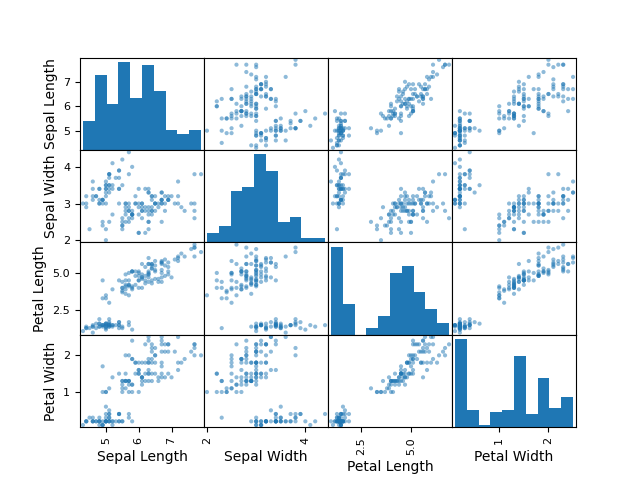
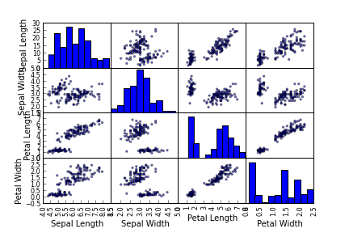
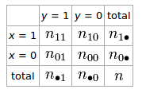
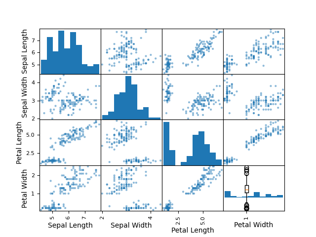

# Kovaryans ve Korelasyon - 2

Matrisler İle Kovaryans Hesabı

Eğer verinin kolonları arasındaki ilişkiyi görmek istersek, en hızlı yöntem
matristeki her kolonun (değişkenin) ortalamasını kendisinden çıkartmak,
yani onu "sıfırda ortalamak'' ve bu matrisin devriğini alarak kendisi ile
çarpmaktır. Bu işlem her kolonu kendisi ve diğer kolonlar ile noktasal
çarpımdan geçirecektir ve çarpım, toplama sonucunu nihai matrise
yazacaktır. Çarpımların bildiğimiz özelliğine göre, artı değer artı değerle
çarpılınca artı, eksi ile eksi artı, eksi ile artı eksi verir, ve bu bilgi
bize ilinti bulma hakkında güzel bir ipucu sunar. Pozitif sonucun pozitif
korelasyon, negatif ise tersi şekilde ilinti olduğu sonucuna böylece
kolayca erişebiliriz.

Tanım

$$ S = \frac{1}{n} (X-E(X))^T(X-E(X))) $$

Pandas ile `cov` çağrısı bu hesabı hızlı bir şekilde yapar,

```python
import pandas as pd
df = pd.read_csv('iris.csv')
df = df[['Sepal Length',  'Sepal Width',  'Petal Length',  'Petal Width']]
print (df.cov())
```

```
              Sepal Length  Sepal Width  Petal Length  Petal Width
Sepal Length      0.685694    -0.039268      1.273682     0.516904
Sepal Width      -0.039268     0.188004     -0.321713    -0.117981
Petal Length      1.273682    -0.321713      3.113179     1.296387
Petal Width       0.516904    -0.117981      1.296387     0.582414
```

Eger kendimiz bu hesabi yapmak istersek,

```python
means = df.mean()
n = df.shape[0]
df2 = df.apply(lambda x: x - means, axis=1)
print (np.dot(df2.T,df2) / n)
```

```
[[ 0.68112222 -0.03900667  1.26519111  0.51345778]
 [-0.03900667  0.18675067 -0.319568   -0.11719467]
 [ 1.26519111 -0.319568    3.09242489  1.28774489]
 [ 0.51345778 -0.11719467  1.28774489  0.57853156]]
```

Verisel kovaryansın sayısal gösterdiğini grafiklemek istersek, yani iki
veya daha fazla boyutun arasındaki ilişkileri grafiklemek için yöntemlerden
birisi verideki mümkün her ikili ilişkiyi grafiksel olarak
göstermektir. Pandas `scatter_matrix` bunu yapabilir. Iris veri seti
üzerinde görelim, her boyut hem y-ekseni hem x-ekseninde verilmiş, ilişkiyi
görmek için eksende o boyutu bulup kesişme noktalarındaki grafiğe bakmak
lazım.

```python
#df = df.iloc[:,0:4]
pd.plotting.scatter_matrix(df)
plt.savefig('stat_summary_01.png')
```





İlişki olduğu zaman o ilişkiye tekabül eden grafikte "düz çizgiye benzer''
bir görüntü olur, demek ki değişkenlerden biri artınca öteki de artıyor
(eğer çizgi soldan sage yukarı doğru gidiyorsa), azalınca öteki de azalıyor
demektir (eğer çizgi aşağı doğru iniyorsa). Eğer ilinti yok ise bol
gürültülü, ya da yuvarlak küreye benzer bir şekil çıkar. Üstteki grafiğe
göre yaprak genişliği (petal width) ile yaprak boyu (petal length) arasında
bir ilişki var.

Tanım

$X,Y$ rasgele değişkenlerin arasındaki kovaryans,

$$ Cov(X,Y) = E(X-E(X))(Y-E(Y)) $$

Yani hem $X$ hem $Y$'nin beklentilerinden ne kadar saptıklarını her veri
ikilisi için, çıkartarak tespit ediyoruz, daha sonra bu farkları birbiriyle
çarpıyoruz, ve beklentisini alıyoruz (yani tüm olasılık üzerinden ne
olacağını hesaplıyoruz). 

Ayrı ayrı $X,Y$ değişkenleri yerine çok boyutlu $X$ kullanırsak, ki boyutları
$m,n$ olsun yani $m$ veri noktası ve $n$ boyut (özellik, öğe) var, tanımı şöyle
ifade edebiliriz,

$$ \Sigma = Cov(X) = E((X-E(X))^T(X-E(X))) $$

Phi Korelasyon Katsayısı

Phi katsayısı iki tane ikisel değişkenin birbiriyle ne kadar alakalı,
bağlantılı olduğunu hesaplayan bir ölçüttür. Mesela $x,y$ değişkenleri için
elde olan $(x_1,y_1),(x_2,y_2),..$ verilerini kullanarak hem $x=1$ hem
$y=1$ olan verileri sayıp toplamı $n_{11}$'e yazarız, $y=1,x=0$ icin
$n_{10}$, aynı şekilde diğer kombinasyonlara bakarak alttaki tabloyu
oluştururuz [5],



Phi korelasyon katsayısı

$$ 
\phi = \frac{n_{11}n - n_{1\bullet}n_{\bullet 1}}
{\sqrt{n_{0\bullet} n_{1\bullet} n_{\bullet 0} n_{\bullet 1}}} 
\tag{6}
$$

ile hesaplanır. Bu ifadeyi türetmek için iki rasgele değişken arasındaki
korelasyonu hesaplayan formül ile başlıyoruz,

$$ Corr(X,Y) = \frac{E (x-E(X)) (y-E(Y)) }{\sqrt{Var(X) \cdot Var(Y) } } $$

$$ 
= \frac{E(XY) - E(X)E(Y)}{ \sqrt{Var(X) \cdot Var(Y)} }
$$

$X,Y$ değişkenlerinin Bernoulli dağılımına sahip olduğunu düşünelim, çünkü
0/1 değerlerine sahip olabilen ikisel değişkenler bunlar, o zaman

$$
E[X]= \frac{n_{1\bullet}}{n}, \quad
Var[X]= \frac{n_{0\bullet}n_{1\bullet}}{n^2}, \quad
E[Y]= \frac{n_{\bullet 1}}{n}, \quad
Var[Y]= \frac{n_{\bullet 0}n_{\bullet 1}}{n^2}, \quad
E[XY]= \frac{n_{11}}{n^2}
$$

olacaktır. $E(XY)$ nasıl hesaplandı? Ayrıksal dağılımlar için beklenti
formülünün iki değişken için şöyle ifade edildiğini biliyoruz,

$$  E[XY] = \sum_i\sum_j x_i\cdot y_j \cdot P\{X = x_i, Y = y_j\} $$

Bu ifadeyi tabloya uyarlarsak, ve tablodaki hesapların üstteki ifadeler
için tahmin ediciler olduğunu biliyoruz, iki üstteki sonucu elde
edebileceğimizi görürüz, çünkü tek geçerli toplam $x_i y_i$ her iki
değişken de aynı anda 1 olduğunda geçerlidir. Bu değerleri yerine geçirince
(6) elde edilir.

Phi katsayısının bir diğer ismi Matthews korelasyon katsayısı. Bu hesabı
mesela bir 0/1 tahmini üreten sınıflayıcının başarısını ölçmek için
kullanabiliriz, gerçek, test 0/1 verileri bir dizinde, üretilen tahminler
bir diğerinde olur, ve Phi katsayısı ile aradaki uyumu raporlarız. Sonuç
-1,+1 arasında olacağı için sonuca bakarak irdeleme yapmak kolaydır, bu bir
başarı raporu olarak algılanabilir. Ayrıca Phi hesabının, AUC hesabı gibi,
dengesiz veri setleri üzerinde (mesela 0'a kıyasla çok daha fazla 1 olan
veriler, ya da tam tersi) üzerinde bile hala optimal olarak çalıştığı [4]
bulunmuştur.

Bazı örnekler,

```python
from sklearn.metrics import matthews_corrcoef
y_true = [+1, +1, +1, -1]
y_pred = [+1, -1, +1, +1]
print ((matthews_corrcoef(y_true, y_pred)  ))
```

```
-0.333333333333
```

Ya da

```python
a = [[0,  0],[0,  0],[0,  0],[0,  0],[0,  0],[1,  0],\
[1,  0],[1,  0],[0,  1],[0,  1],[1,  1],[1,  1],\
[1,  1],[1,  1],[1,  1],[1,  1],[1,  1],[1,  1],\
[1,  1], [1,  1],[1,  1],[1,  1],[1,  1],[1,  1],\
[1,  1],[1,  1],[1,  1]]
a = np.array(a)
print ((matthews_corrcoef(a[:,0], a[:,1])))
```

```
0.541553390893
```

Medyan ve Yüzdelikler (Percentile)

Üstteki hesapların çoğu sayıları toplayıp, bölmek üzerinden yapıldı. Medyan
ve diğer yüzdeliklerin hesabı (ki medyan 50. yüzdeliğe tekabül eder) için
eldeki tüm değerleri "sıraya dizmemiz" ve sonra 50. yüzdelik için
ortadakine bakmamız gerekiyor. Mesela eğer ilk 5. yüzdeliği arıyorsak ve
elimizde 80 tane değer var ise, baştan 4. sayıya / vektör hücresine / öğeye
bakmamız gerekiyor. Eğer 100 eleman var ise, 5. sayıya bakmamız gerekiyor,
vs.

Bu sıraya dizme işlemi kritik. Kıyasla ortalama hesabı hangi sırada olursa
olsun, sayıları birbirine topluyor ve sonra bölüyor. Zaten ortalama ve
sapmanın istatistikte daha çok kullanılmasının tarihi sebebi de aslında bu;
bilgisayar öncesi çağda sayıları sıralamak (sorting) zor bir işti. Bu
sebeple hangi sırada olursa olsun, toplayıp, bölerek hesaplanabilecek
özetler daha makbuldü. Fakat artık sıralama işlemi kolay, ve veri setleri
her zaman tek tepeli, simetrik olmayabiliyor. Örnek veri seti olarak ünlü
`dellstore2` tabanındaki satış miktarları kullanırsak,

```python
data = np.loadtxt("glass.data",delimiter=",")
print (np.mean(data))
```

```
213.948899167
```

```python
print (np.median(data))
```

```
214.06
```

```python
print (np.std(data))
```

```
125.118481954
```

```python
print (np.mean(data)+2*np.std(data))
```

```
464.185863074
```

```python
print (np.percentile(data, 95))
```

```
410.4115
```

Görüldüğü gibi üç nokta hesabı için ortalamadan iki sapma ötesini
kullanırsak, 464.18, fakat 95. yüzdeliği kullanırsak 410.41 elde
ediyoruz. Niye? Sebep ortalamanın kendisi hesaplanırken çok üç
değerlerin toplama dahil edilmiş olması ve bu durum, ortalamanın
kendisini daha büyük seviyeye doğru itiyor. Yüzdelik hesabı ise sadece
sayıları sıralayıp belli bazı elemanları otomatik olarak üç nokta
olarak addediyor.

Grupların Ortalamalarını ve Varyanslarını Birleştirmek

Bazen elimizde bir verinin farklı parçaları üzerinde hesaplanmış ortalama,
varyans sonucu olabilir, ve bu hesapları bu parçaların toplamı için
birleştirmemiz gerekebilir. Belki paralel süreçler var, verinin parçaları
üzerinde eşzamanlı çalışıyorlar, bir ortalama, varyans hesaplıyorlar,
ve nihai sonucun bu alt sonuçlar üzerinden raporlanması lazım [3].

İşlenen veri setinin tamamı, birleşmiş (pooled) veri $D = \{ x_1, x_2,.., x_N\}$ 
olsun, ki $N$ veri noktası sayısı. Bu verinin ortalaması $a = (x_1 + x_2 + .. + x_N) / N$, 
varyansı $v = ((x_1 - a)^2 + (x_2 - a)^2 + ... + (x_N - a)^2 ) / N$.  
Standart sapma tabii ki $\sigma_N = \sqrt{v}$.

Veriyi ayrı işledik diyelim, veri şu şekilde ayrıldı $D_1 = \{ x_1, x_2,..,x_j\}$,
$D_2 = \{ x_{j+1}, x_{j+2},..,x_{j+k}\}$, $D_3 = \{ x_{j+k+1}, x_{j+k+2},..,x_{j+k+m}\}$.
Yani her veri grubunun büyüklüğü sırasıyla $j,k,m$ ve toplam veri noktaları
$n = j+k+m$.

$D_P$'nin ortalaması $a_P = \frac{1}{n} \sum_{i=1}^{n} x_i$. Her grup $D_1,D_2,D_3$'un
ortalaması $a_1,a_2,a_3$ benzer şekilde bulunabilir. Bu durumda "ortalamaların
ortalaması'', yani nihai ortalama $a_P$ şöyle bulunabilir,

$$
a_P = (j a_1 + k a_2 + m a_3 ) / n
$$

Varyansa ulaşmak için kareler toplamı, grup varyanslarına bakalım şimdi, $D_P$
için kareler toplamı

$$
S_P = \sum_{i=1}^{n} x_i^2
\tag{7}
$$

Gruplar $D_1,D_2,D_3$ için toplamlar $S_1,S_2,S_3$ benzer şekilde tanımlanıyor,
ve nihai toplam bu gruplar üzerinden $S_P = S_1 + S_2 + S_3$ olarak
tanımlanabiliyor.

Tum veri $D_P$ icin varyans

$$
v_P = \frac{1}{n} \sum_{i=1}^{n} (x_i - a_P)^2
$$

Bu ifadeyi acarsak

$$
= \frac{1}{n} \sum_{i=1}^{n} ( x_i^2 - 2 x_i a_p + a_p^2 )
$$

$$
= \frac{1}{n} \sum_{i=1}^{n}  x_i^2  - \frac{1}{n} \sum_{i=1}^{n}  2 x_i a_p + \frac{1}{n} \sum_{i=1}^{n} a_p^2
$$

$\frac{1}{n} \sum_{i=1}^{n} x_i = a_p$ olduğunu hatırlarsak, ve $\frac{1}{n} \sum_{i=1}^{n} a_p$
tabii ki yine $a_p$ o zaman 

$$
= S_p / n  - 2 a_p^2 + \frac{1}{n} \sum_{i=1}^{n} a_p^2
$$

$\frac{1}{n} \sum_{i=1}^{n} a_p^2$ benzer sekilde tekrar $a_p$, 

$$
= S_p / n  - 2 a_p^2 +  a_p^2
$$

$$
v_P = S_p / n  -  a_p^2
\tag{8}
$$

Bu durumda parçaların ayrı varyans formülleri de üstteki gibi yazılabilir,

$$
v_1 = S_1 / j  -  a_1^2, \quad
v_2 = S_2 / k  -  a_2^2, \quad
v_3 = S_3 / m  -  a_3^2
\tag{9}
$$

Amacımız $v_p$'yi ufak parçaların varyansları $v_1,v_2,v_3$ üzerinden hesaplamak.

Simdi (7,8,9) formullerini kullanarak $v_p$ su sekilde de yazilabilirdi,

$$
v_p = (S_1 + S_2 + S_3) / n
$$

Ya da

$$
n v_p = S_1 + S_2 + S_3 - n a_p^2
$$

Açarsak

$$
n v_p = j (v_1 + a_1)^2 + k (v_2 + a_2)^2 + m (v_3 + a_3)^2 - n a_p^2
\tag{10}
$$

Şu da söylenebilir,

$$
n v_p = j v_1 + k v_2 + m v_3 + j a_1^2 + k a_2^2 + m a_3^2 - n a_p^2
$$

Şimdi (10) formülüne nasıl erisebileceğimizi düşünelim. Alttaki iki kavramdan
hareketle bunu yapabilir miyiz acaba?

Varyansların ortalamasını

$$
a_v = (j v_1 + k v_2 + m v_3) / n
\tag{11}
$$

ve ortalamaların varyansını

$$
v_a = [ j(a_1-a_p)^2 + k(a_2-a_p)^2 + m(a_3-a_p)^2 ] / n
$$

diye tanımlayalım. Üstteki formülü açalım,

$$
n v_a = j(a_1-a_p)^2 + k(a_2-a_p)^2 + m(a_3-a_p)^2 
$$

$$
= j a_1^2 + k a_2^2 + m a_3^2 - 2 a_p (ja_1 + ka_2 + ma_3) + n a_p^2
$$

Ortadaki terim $n a_p = ja_1 + ka_2 + ma_3$ olduguna gore

$$
= j a_1^2 + k a_2^2 + m a_3^2 - 2 a_p (n a_p) + n a_p^2
$$

$$
= j a_1^2 + k a_2^2 + m a_3^2 - 2 n a_p^2 + n a_p^2
$$

$$
n v_a = j a_1^2 + k a_2^2 + m a_3^2 - n a_p^2 
$$

Varyansların ortalaması (11) formülünü hatırlayalım şimdi

$$
n a_v = j v_1 + k v_2 + m v_3
$$

Üstteki iki formülü toplarsak $n v_p$'ye erisebilir miyiz acaba?

$$
n v_a + n a_v = 
j a_1^2 + k a_2^2 + m a_3^2 - n a_p^2 +
j v_1 + k v_2 + m v_3
$$

$j,k,m$'nin çarptığı terimleri onların altında gruplarsak,

$$
=  j (a_1^2 + v_1) + k (a_2^2 + v_2) + m (a_3^2 + v_3) - n a_p^2 +
$$

Evet bu hakikaten mümkün, (10) formülüne erişmiş olduk. Demek ki ayrı gruplardan
elde edilen varyanslar ve ortalamarını alıp, bu varyansların ortalamasını ve
ortalamaların varyanslarını hesaplayıp birbirine toplayınca tüm verinin
nihai varyansına erişmiş oluyoruz.

Kod üzerinde görelim, [3]'teki veriyi kullandık,

```python
d1 = np.array([32, 36, 27, 28, 30, 31])
d2 = np.array([32, 34, 30, 33, 29, 36, 24])
d3 = np.array([39, 40, 42])
n1,n2,n3 = len(d1),len(d2),len(d3)
dp = np.hstack([d1,d2,d3])
m1,m2,m3,mp = d1.mean(), d2.mean(), d3.mean(),dp.mean()
v1,v2,v3,vp = d1.var(), d2.var(), d3.var(),dp.var()
print (m1,m2,m3,mp)
print (v1,v2,v3,vp)
ap = (n1*m1 + n2*m2 + n3*m3) / (n1+n2+n3) 
mean_of_var = (n1*v1 + n2*v2 + n3*v3) / (n1+n2+n3) 
var_of_means = (n1*(m1-ap)**2 + n2*(m2-ap)**2 + n3*(m3-ap)**2) / (n1+n2+n3)
print (mean_of_var)
print (var_of_means)
print (mean_of_var + var_of_means)
```

```
30.666666666666668 31.142857142857142 40.333333333333336 32.6875
8.555555555555554 13.26530612244898 1.5555555555555554 22.83984375
9.303571428571427
13.536272321428578
22.839843750000007
```

Not: Birleştirirken $n_1$,$n_2$ sayıları ile çarpım var, bu aşırı büyük sayılara
sebep olmaz mı? Olabilir doğru, ki kısmen bu sebeple artımsal hesap yapıyorduk,
fakat hala büyük sayılardan kaçmak mümkün, mesela genel ortalama hesaplarken
$n_1$,$n_2$ ile çarpıp $n_1+n2$ ile bölüyor olabiliriz, fakat bu hesapta tek
gerekli olan aslında $n_1$ ve $n_2$'nin birbirine olan izafi büyüklüğüdür. Eğer
$n_i/100$ kullansak birleştirme işlemi yine aynı çıkardı. O zaman bir teknik tüm
$n_i$'leri en büyük olan ile bölmek, böylece 1'den ufak sayılarla iş yaparız, ve
sonuç yine aynı çıkar.

Box Whisker Grafikleri

Tek boyutlu bir verinin dağılımını görmek için Box ve Whisker grafikleri
faydalı araçlardır; medyan (median), dağılımın genişliğini ve sıradışı
noktaları (outliers) açık şekilde gösterirler. İsim nereden geliyor? Box
yani kutu, dağılımın ağırlığının nerede olduğunu gösterir, medyanın
sağındada ve solunda olmak üzere iki çeyreğin arasındaki kısımdır, kutu
olarak resmedilir. Whiskers kedilerin bıyıklarına verilen isimdir, zaten
grafikte birazcık bıyık gibi duruyorlar. Bu uzantılar medyan noktasından
her iki yana kutunun iki katı kadar uzatılır sonra verideki "ondan az olan
en büyük" noktaya kadar geri çekilir. Tüm bunların dışında kalan veri ise
teker teker nokta olarak grafikte basılır. Bunlar sıradışı (outlier)
oldukları için daha az olacakları tahmin edilir.

BW grafikleri iki veriyi dağılımsal olarak karşılaştırmak için

içeren Quintus Curtius Snodgrass veri setinin değişik olduğunu
ispatlamak için bir sürü hesap yapmışlardır, bir sürü matematiksel
işleme girmişlerdir, fakat basit bir BW grafiği iki setin farklılığını
hemen gösterir.

BW grafikleri iki veriyi dağılımsal olarak karşılaştırmak için
birebirdir. Mesela Larsen and Marx adlı araştırmacılar çok az veri
içeren Quintus Curtius Snodgrass veri setinin değişik olduğunu
ispatlamak için bir sürü hesap yapmışlardır, bir sürü matematiksel
işleme girmişlerdir, fakat basit bir BW grafiği iki setin farklılığını
hemen gösterir.

Python üzerinde basit bir BW grafiği 

```python
spread= np.random.rand(50) * 100
center = np.ones(25) * 50
flier_high = np.random.rand(10) * 100 + 100
flier_low = np.random.rand(10) * -100
data2 =np.concatenate((spread, center, flier_high, flier_low), 0)
plt.boxplot(data2)
plt.savefig('stat_feat_01.png')
```



Bir diğer örnek Glass veri seti üzerinde

```python
head = data[data[:,10]==7]
tableware = data[data[:,10]==6]
containers = data[data[:,10]==5]

print (head[:,1])

data =(containers[:,1], tableware[:,1], head[:,1])

plt.yticks([1, 2, 3], ['containers', 'tableware', 'head'])

plt.boxplot(data,0,'rs',0)
plt.savefig('stat_feat_02.png')
```

```
[ 1.51131  1.51838  1.52315  1.52247  1.52365  1.51613  1.51602  1.51623
  1.51719  1.51683  1.51545  1.51556  1.51727  1.51531  1.51609  1.51508
  1.51653  1.51514  1.51658  1.51617  1.51732  1.51645  1.51831  1.5164
  1.51623  1.51685  1.52065  1.51651  1.51711]
```


Kaynaklar

[5] Cross Validated, *Relation between the phi, Matthews and Pearson correlation coefficients?*, [https://stats.stackexchange.com/questions/59343/relation-between-the-phi-matthews-and-pearson-correlation-coefficients](https://stats.stackexchange.com/questions/59343/relation-between-the-phi-matthews-and-pearson-correlation-coefficients)

[3] Rudmin, *Calculating the Exact Pooled Variance*,
    [https://arxiv.org/abs/1007.1012](https://arxiv.org/abs/1007.1012)

[4] Boughorbel, *Optimal classifier for imbalanced data using Matthews Correlation Coefficient metric*, [http://journals.plos.org/plosone/article/file?id=10.1371/journal.pone.0177678&type=printable](http://journals.plos.org/plosone/article/file?id=10.1371/journal.pone.0177678&type=printable)

