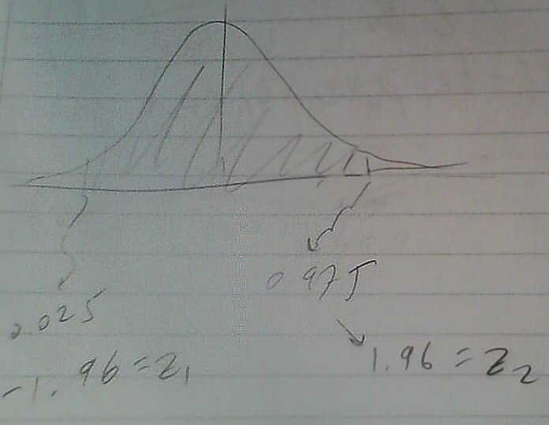
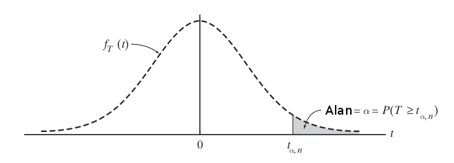
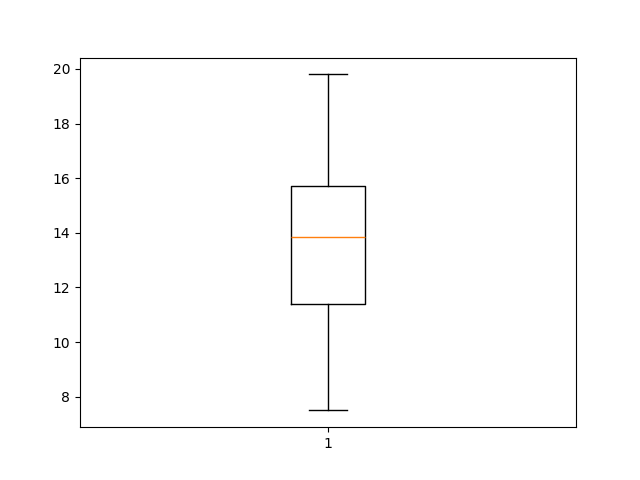
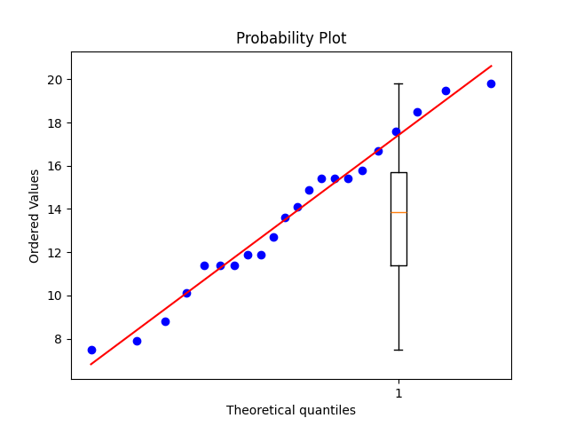
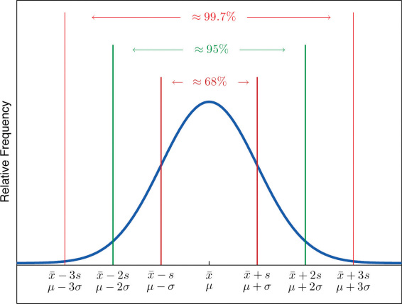
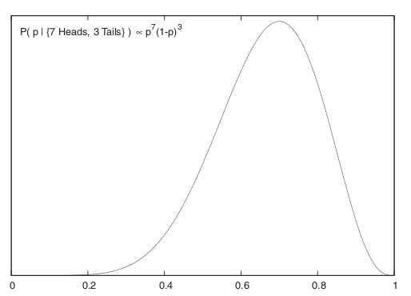

# Güven Aralıkları

Diyelim ki $X_1,..,X_i$ örneklemi birbirinden bağımsız, aynı dağılımlı ve
ortalaması $\mu$, standart sapması $\sigma$ ve yine aynı olan bir nüfus
dağılımından geliyor. O zaman biliyoruz ki, Merkezi Limit Teorisi (Central
Limit Theorem) teorisine göre, $n$ arttıkça örneklem ortalaması $\bar{X} =
\frac{1}{n} X_1+..+X_n$, ortalaması $\mu$, standart sapması $\sigma/n^2$
olan bir normal dağılıma yaklaşıyor.

Peki veriyi (yani örneklemi) ve CLT'yi kullanarak $\mu$ hakkında bir tahmin
yapabilir miyiz? Yani Büyük Sayılar Kanunua göre $\mu$ hakkında noktasal
tahmin yapabiliriz fakat, belki ondan bir adım ötesi, bir "güven aralığı''
hesaplamaktan bahsediyoruz. Bu tahmin "gerçek $\mu$, \%95 ihtimalde şu iki
değer arasındadır'' türünde bir tahmin olacak.

Dikkat: burada verinin yüzde kaçının belli bir aralıkta olup olmadığından
bahsetmiyoruz, tahminsel hesabı yapılan ortalamanın hangi güven seviyesinde
bir aralıkta olup olmadığından bahsediyoruz. Verinin güven aralığı
hakkındaki notlar bu yazının sonunda.

Bu aralığın hesabı için önce $\bar{X}$'i standardize edelim, yani $N(0,1)$
haline çevirelim,

$$ Z = \frac{\bar{X} - \mu}{\sigma / \sqrt{n}} $$

Z-skorlarını işlediğimiz yazıda 

$$
P(z_1 < Z < z_2) =  \Phi(z_1) - \Phi(z_2) 
$$

gibi bir ifade gördük. Eşitliğin sağ tarafı aslında bir alan hesabıdır,
sürekli fonksiyonlarda olasılık bir entegral, ya da iki kümülatif yoğunluk
fonksiyonunun farkı. Güven aralığı için bize lazım olan da bir olasılık,
hatta "kesin'' bir olasılık, \%95 olasılığı. Demek ki eşitliğin sağ tarafı
.95 olacak. .95 hesabı için, normal eğrisini düşünürsek, sağından ve
solundan 0.25 büyüklüğünde iki parçayı "kırpmamız'' lazım. O zaman 0.975
olasılığının z değeri ile, 0.025 olasılığının z değeri arasındaki
olasılıkta olmamız lazım. Bu hesaplarda baz alınan $z_{\alpha/2}$ değeri ve
bu $100 \cdot \alpha / 2$ üst yüzdelik kısmına, örneğimizde 0.975 kısmına
tekabül ediyor. Normal dağılımın simetrisi sebebiyle onun eksisi alınmış
hali öteki (soldaki) parçayı verir, yani $-z_{\alpha/2}$. 



Z-skoru hesaplarken tabloya danışmıştık, şimdi tabloya tersinden bakacağız,
kesişme noktasında 0.975 diyen yeri bulup kordinatları alacağız, ki bu
değer 1.96. 

```python
from scipy.stats.distributions import norm
print (norm.ppf(0.975))
```

```
1.95996398454
```

Bazı İstatistik kaynaklarında "sihirli değer'' şeklinde tarif edilen bir
değer bu, gözlerimiz kamaşmasın, geldiği yer burası işte. Şimdi formülü
buna göre değiştirelim,

$$ 
P \bigg( 
-z_{\alpha/2} \
\le \frac{\bar{X} - \mu}{\sigma / \sqrt{n}} 
\le z_{\alpha/2}
\bigg) = 1-\alpha
$$

$P(\cdot)$ içinde biraz düzenleme, tüm terimleri $\sigma / \sqrt{n}$ ile
çarpalım, $\bar{X}$ çıkartalım, ve $-1$ ile çarpalım,

$$ 
P \bigg( 
\bar{X} - z_{\alpha/2}\frac{\sigma}{\sqrt{n}}
\le \mu
\le \bar{X} + z_{\alpha/2}\frac{\sigma}{\sqrt{n}}
\bigg) = 1-\alpha
\qquad (1)
$$

Güven aralığı ifadesine aslına erişmiş olduk. Eğer \%95 kesinlikten
bahsediyor olsaydık, ve nüfusun gerçek varyansı $\sigma^2$ biliniyor
olsaydı, $P(\cdot)$ içine bu değerleri geçecektik, $\bar{X}$ zaten verinin
aritmetik ortalamasından ibarettir, bu bize $\mu$'nun solunda ve sağında
bazı değerler döndürecekti. Bu değerler bizim güven aralığımız
olacaktı. Mesela veri 64.1, 64.7, 64.5, 64.6, 64.5, 64.3, 64.6, 64.8,
64.2, 64.3 şeklinde, $n=10$ çünkü 10 nokta var, $\sigma = 1$ olarak
verilmiş.  Ortalamayı hesaplıyoruz, 64.46. $\alpha=0.05$ için

$$ 
P \bigg( 
64.46 - 1.96\frac{1}{\sqrt{10}}
\le \mu
\le 64.46 + 1.96\frac{1}{\sqrt{10}}
\bigg) = 0.95
$$

$$ P\bigg(63.84 \le \mu \le 65.08\bigg) = 0.95 $$

Yani \%95 güven aralığı $63.84 \le \mu \le 65.08$. 

Neler yaptık? CLT bilgisinden hareketle $\bar{X}$ hakkında bir şeyler
biliyorduk. Fakat $\bar{X}$'in *kesin* hangi normal dağılıma
yaklaştığını bilmek için nüfus paremetreleri $\mu,\sigma$ da
bilinmelidir. Diğer yandan eğer tek bilinmeyen $\mu$ ise, teoriyi bu
bilinmez etrafında tamamen tekrar şekillendirip / değiştirip CLT'yi
bilinmeyen $\mu$ etrafında bir güven aralığı yaratmak için kullandık.

Not: Eğer $\sigma$ bilinmiyor ise onu da veriden hesaplarız, $S^2$ tahmin
edicisi ile, yanlız bu durumda $S^2$ te bir dağılıma sahip olacaktır, $\chi^2$
dağılımı, ve üstte $P()$ içindeki bölüm bir Normal rasgele değişkeni bolu
$\chi^2$ bölümü haline gelir, ki bu bölüm Öğrenci t dağılımı adında başka bir
dağılıma sahiptir! O zaman üstteki cebirsel hareketleri bunu hesaba katarak
yapmak gerekir. Bunun detaylarını ilerideki bir bölümde göreceğiz. 

Kac Tane $n$?

Hatırlarsak güven aralığını üstteki şekilde hesaplayabilmemizin sebebi CLT
sayesinde $\bar{X}$'in normal dağılıma yaklaşıyor olmasıydı. Ve, teoriyi
tekrar düşünürsek yaklaşma $n \to \infty$ olduğu zaman oluyordu. Buradan
$\bar{X}$'in normalliğinin "büyükçe'' $n$ değerleri için daha geçerli
olacağı sonucuna varabiliriz. Peki $n$ ne kadar büyük olmalı?  Literatüre
göre CLT'nin genellikle $n \ge 30$ durumunda geçerli olduğu söylenir. Tabii
nüfus dağılımının ne olduğu da önemlidir, eğer nüfus normal ise, ya da
genel olarak simetrik tek tepeli dağılım ise örneklem daha ufak kalsa da
bazı sonuçlara varabiliriz. Eğer nüfus dağılımı çok yamuk (skewed),
etekleri geniş dağılım ise o zaman daha büyük örneklem daha iyi olur.

Soru

İÖ 800 yıllarında İtalya'da Etrusyalı (Etruscan) toplumu vardı, bilinmeyen
bir sebeple bu insanlar geldikleri gibi birdenbire ortadan
kayboluverdiler. Bilimciler bu toplumun İtalyalılar ile fizyolojik, genetik
ve kültürel olarak bağlantısı olup olmadığını hep merak etmiştir. Bazıları
hafa ölçülerine bakarak sonuçlara varmaya uğraşmıştır. Arkeolojik kazılarda
yapılan ölçümlerde 84 Etrusyalının kafası ölçülmüştür. Ayrıca bugünkü
İtalyanların kafa ölçümlerinin normal dağılımda $\mu=132.4 mm,\sigma=6.0mm$
olduğu bilinmektedir. İki toplum arasındaki bağlantı kurmak için, veriye
bakarak kafa ölçümü ortalaması için bir \%95 güvenlik aralığı
oluşturabiliriz, ve eğer bugünkü İtalyanların ölçüsü o aralığa düşmüyorsa,
Etrusyalılarla bağlantılarının olmadığını iddia edebiliriz.

```python
import pandas as pd
dfetr = pd.read_csv('../stat_035_tests/etrus.csv')
print (float(dfetr.mean()-1.96*(6.0/np.sqrt(84))))
print (float(dfetr.mean()+1.96*(6.0/np.sqrt(84))))
```

```
142.524107721075
145.09035011025028
```

Bugünkü İtalyanların kafa ortalaması $\mu=132.4$ bu aralığa düşmüyor. Diğer
bir deyişle, 84 tane örneklemden gelen örneklem ortalaması 143.8 büyük bir
ihtimalle $\mu=132.4,\sigma=6.0$ boyutlarındaki bir normal dağılımdan
gelmemiştir. Buna göre, büyük bir ihtimalle Etrusyalılar İtalyanların atası
değildir. 

Bilinmeyen $\sigma$

Güven Aralıkları bölümünden devam edelim. Bilinmeyen $\mu$ durumunu
gördük. Eğer $\sigma$ bilinmiyorsa, bu durumda $\sigma$ yerine örneklem
varyansı $S$ kullanılabilir,

$$ S^2 = \frac{1}{n} \sum (X_i - \bar{X})^2
$$

ki üstteki değerin karekökü $S$ olacaktır. $\sigma$ yerine $S$ kullanmanın 
büyük $n$ değerlerinde CLT'yi etkilemediği ispat edilmiştir [5]. Fakat daha
küçük örneklem durumunda t Dağılımı daha uygun olur. 

T Dağılımı

Daha önce Z oranını temel alarak güven aralıkları ya da hipotez testleri
oluşturmuştuk. Bu işlemler için standart normal dağılımın üst ve alt
yüzdelikleri hakkında bazı bilgiler gerekmişti. Bu bilgiler bir tablodan
bakılan değerlerdi ya da istatistik yazılımımızda gerekli bir çağrı ile
hemen bulunabiliyorlardı.



Öğrenci t'nin Z'ye göre farklı bir tarafı belli bir değeri bulmak için iki
parametreye ihtiyaç olması, bunlardan biri $\alpha$ diğeri ise serbestlik
derecesi (degree of freedom -dof-). Standart normal için tablo paylaştık,
fakat t için artık tablolarla uğraşmayacağız, bilgisayar çağındayız,
yazılım ile bu işi halledelim! 

Örnek

$T$ bir Öğrenci t dağılımı ise, ve serbestlik derecesi 3 ise, $\alpha=0.01$
için için $f_T(t)$'nin $100(1-\alpha)$ yüzdeliği nedir? Üstteki grafikteki
$t_{\alpha,n}$ notasyonundan hareketle $t_{0.01,3}$ değerini arıyoruz yani.

```python
from scipy.stats.distributions import t
df = 3
print (t.ppf(0.99,df))
print (1-t.cdf(4.541,df))
```

```
4.5407028587
0.00999823806449
```

Yani

$$ P(T_3 \ge 4.541) = 0.01 $$

$\frac{\bar{Y}-\mu}{S/\sqrt{n}}$ ifadesinin n-1 derece serbestliğe 
sahip Öğrenci t dağılımına sahip olduğunu bilmek alttaki ifadeyi mümkün kılar, 

$$ P \bigg(
-t_{\alpha/2,n-1} \le
\frac{\bar{Y}-\mu}{S/\sqrt{n}} \le 
t_{\alpha/2,n-1}
\bigg) = 1-\alpha
$$

Bu ifadeyi daha önce standart normal için yaptığımız gibi tekrar
düzenlersek,

$$ P \bigg(
\bar{Y}-t_{\alpha/2,n-1}\frac{S}{\sqrt{n}} \le
\mu \le 
\bar{Y}+t_{\alpha/2,n-1}\frac{S}{\sqrt{n}}
\bigg) = 1-\alpha
$$

Tabii, $Y_i$'ların normal dağılımdan gelmiş olması lazım. Bunun sonucunda
gerçek veri temel alınarak hesaplanacak $S$ ve $\bar{Y}$ bize $\mu$ için
bir $\%100(1-\alpha)$ güven aralığı verecektir. 


Örnek

Yapışkan elementlerin üzerinde yapılan deneyler sonucundaki ölçümler altta
verilmiştir. Acaba $\mu$ için \%95 güven aralığı nedir?

Öncelikle verinin normal dağılımdan geldiği doğru mudur? Bu faraziyeyi
kontrol etmemiz gerekir yoksa t dağılımını kullanamayız. Önce bir kutu
grafiği (boxplot) yapalım,

```python
data = np.array([19.8,10.1,14.9,7.5,15.4,15.4,15.4,18.5,7.9,12.7,
11.9,11.4,11.4,14.1,17.6,16.7,15.8,19.5,8.8,13.6,11.9,11.4])
plt.boxplot(data)
plt.savefig('stat_ci_01.png')
```



Şimdi normal olasılık grafiği (normal probability plot) yapalım, ki bu
grafik verinin normal dağılıma ne kadar uyumlu olduğunu grafik olarak
gösterir, eğer uyumlu ise veri düz çizgiye yakın çıkmalıdır,

```python
import scipy.stats as stats
res = stats.probplot(data, plot=plt)
plt.savefig('stat_ci_02.png')
```



Bu grafiklere bakınca verinin normal olduğu belli oluyor. Zaten örneklem
sayısı az, bu sebeple t dağılımı kullanmak uygun. Veri sayısal ortalaması
ve sayısal standart sapmasına bakalım, ve güven aralığını hesaplayalım, 
yani

$$ \bar{x} - t_{\alpha/2,n-1}s/\sqrt{n} \le
\mu \le
 \bar{x} + t_{\alpha/2,n-1}s/\sqrt{n}
$$

```python
from scipy.stats.distributions import t
n = len(data)
dof = len(data)-1
m = np.mean(data)
s = np.std(data)
print ('ortalama',m)
print ('sapma',s)
print (m + t.ppf(0.025,dof) * s / np.sqrt(n),\
      m - t.ppf(0.025,dof) * s / np.sqrt(n))
```

```
ortalama 13.7136363636
sapma 3.47187340764
12.174293931 15.2529787962
```

Güven aralığı oldukça geniş, çünkü (demek ki) ölçümlerde yüksek değişkenlik
var. 

Normal Nüfusun Varyansının Güvenlik Aralığı

Bazen nüfusun varyansı ya da standart sapması üzerinde bir güven aralığı
hesaplamak gerekebilir. Eğer nüfus normal olarak dağılmış ise, şimdiye
kadar gösterdiğimiz tekniklerin hepsi kullanılabilir. (1) teorisinin b
kısmındaki ifadeyi kullanırsak, nüfusu $\mu,\sigma$ parametreli bir
normalden alınan $X_1,..,X_n$ örneklemi üzerinden hesaplanan
$X^2 = \frac{(n-1)S^2}{\sigma^2}$ ifadesinin $n-1$ serbestlik derecesindeki bir
chi kare dağılımı olduğunu biliyoruz.

Chi karenin yüzdelik kısımları altta görülebilir,


```python
from scipy.stats.distributions import chi2
print (chi2.ppf(0.05,5))
print (chi2.ppf(0.99,5))
```

```
1.14547622606
15.0862724694
```

Dikkat edilmesi gereken bir konu chi karenin yamuk (skewed) olması
sebebiyle sağdaki ve soldaki alan hesaplarının arasında z skorunda olduğu
gibi her seferinde birebir geçiş yapılamayabileceği. 

Notasyonel olarak $\chi_{p,n}^2$ ifadesi, x eksenindeki bir eşik noktasını
ifade eder ki bu değerin sol tarafındaki alan büyüklüğü $p$, $n$ serbestlik
derecesindeki chi kare dağılımının alanıdır. Mesela üstte $\chi_{0.05,5}^2 =
1.145$ ve $\chi_{0.99,5}^2 = 15.086$. Olasılık ifadesi olarak 

$$ P(\chi_5^2 \le 1.145) = 0.05 $$

$$ P(\chi_5^2 \le 15.086) = 0.05 $$

Not: Bazı kaynaklar eşik değerinin sağ kısmını referans alıyor her
nedense, bu duruma dikkat.

$\sigma^2$ İçin Güvenlik Aralığı

Chi kare tanımından hareketle şu ifadeyi yazabiliriz, 

$$ P\bigg(
\chi_{\alpha/2,n-1}^2 \le
\frac{(n-1)S^2}{\sigma^2}  \le
\chi_{1-\alpha/2,n-1}^2
\bigg) = 1-\alpha
$$

Belirtildiği üzere, üstteki ifadenin $Z$'li halinde olduğu gibi, bir z
değerini alıp, eksi ile çarparak (ve çarpmayarak) hem sol hem sağda eşik
değeri olarak kullanamadık çünkü chi kare simetrik değil. Eşik değerinin
belli noktalarda ayrı ayrı hesaplanması gerekiyor.

Üstteki denklem birkaç cebirsel işlem sonrasında $\sigma^2$'yi ortada tek
başına bırakacak şekilde değiştirilebilir, önce eşitsizlikleri tersine
çeviriyoruz, aynı anda ortadaki bölüme tersine çeviriyoruz, ve yeni böleni
hem sol hem sağa çarparak taşıyoruz,

$$
P
\bigg(
\frac{(n-1)S^2}{\chi_{1-\alpha/2,n-1}^2} \le
\sigma^2  \le
\frac{(n-1)S^2}{\chi_{\alpha/2,n-1}^2} 
\bigg) = 1-\alpha
$$

Eşitsizliğin karekökünü alırsak, $\sigma$ için $\%100(1-\alpha)$ güven
aralığı

$$
\bigg(
\sqrt{\frac{(n-1)S^2}{\chi_{1-\alpha/2,n-1}^2}}
,
\sqrt{\frac{(n-1)S^2}{\chi_{\alpha/2,n-1}^2}}
\bigg) 
$$

Örnek

Bir fabrikada deterjanları doldurmak için bir makina kullanılıyor. Rasgele
seçilen bir örneklemde 20 tane deterjan plastik şişeden alınan ölçümlerde
örneklem varyansının $s^2 = 0.0153$ olduğu hesaplanıyor (birim $ons^2$). Bu
ölçümlerin standart sapması $\sigma^2$ için \%95'lik üst güven sınırı nedir? 

$$ 
\sigma^2 \le
\sqrt{\frac{(19)0.0153}{\chi_{0.05,19}^2}}
$$

```python
from scipy.stats.distributions import chi2
print (chi2.ppf(0.05,19))
```

```
10.1170130639
```

$$ 
\sigma^2 \le
\sqrt{\frac{(19)0.0153}{10.117}} = 0.0287
$$

Yani

$$ \sigma \le 0.17 $$

Demek ki nüfusun gerçek standart sapması 0.17 ons kadar büyük olabilir.

Nüfus Ortalama Farkı, $\mu_1-\mu_2$ Güven Aralığı 

İki farklı nüfusun ortalamaları $\mu_1,\mu_2$'nin birbirinden farklı olup
olmadığını, ve bu farkın istatistiki önemli olup olmadığını nasıl anlarız?
Bir yaklaşım, iki nüfusun örneklem ortalaması $\bar{X}_1,\bar{X}_2$'i
kullanmak ve farklılık $\mu_1-\mu_2$' için bir güven aralığı oluşturmak,
eğer sıfır değeri bu aralık içine düşüyorsa, farklılık vardır. Birbirinden
aynı olan şeylerin farkı sıfır olduğuna göre eğer sıfır güven aralığı
içinde ise bu iki nüfusun ortalamasının birbirine yakın olduğundan emin
olabiliriz.  

Devam edelim; Merkezi Limit Teorisi'ne göre yeterince büyük örneklemler,
yani $n_1>30,n_2>30$ için, $\bar{X}_1,\bar{X}_2$ Normal olarak dağılmaya
mecbur. 

Diğer yandan biliyoruz ki iki Normal dağılımın toplamı, ya da çıkartılması
yeni bir Normal dağılım verir. $\mu_a,\mu_b$ ve $\sigma_a,\sigma_b$ için,
toplam $N(\mu_a+\mu_b, \sigma_a+\sigma_b)$ elde edilir. Örneklem durumunda
ve çıkartma sonrası yeni ortalama ve standart sapma

$$ \mu_1-\mu_2, \qquad \frac{\sigma_1^2}{n_1} + \frac{\sigma_2^2}{n_2}$$

olacaktır [1, sf. 257].

Ayrıca $\mu$ ortalamasına, $\sigma$ varyansına sahip bir $\bar{X}$'i

$$ Z = \frac{\bar{X}-\mu}{\sigma/\sqrt{n}} $$

ile standart normal $Z = N(0,1)$'e cevirilebileceğimizi biliyoruz. 

O zaman yaklaşım şöyle olabilir; $\bar{X}_1-\bar{X}_2$'i hesaplarız, bu
dağılımın kesinlikle normal olduğunu biliyoruz; o zaman nüfus ortalama ve
standart sapması üzerinden standardizasyon ve biraz cebirsel cambazlık ile
$\mu_1-\mu_2$ için bir güven aralığı oluştururuz.

$$ 
Z =
\frac{\bar{X}_1-\bar{X}_2 - (\mu_1-\mu_2)}
{\sqrt{\sigma_1^2/n_1 + \sigma_2^2/n_2}}
$$


$$ 
P \bigg(
-z_{\alpha/2} \le 
\frac{\bar{X}_1-\bar{X}_2 - (\mu_1-\mu_2)} {\sqrt{\sigma_1^2/n_1 + \sigma_2^2/n_2}} \le
z_{\alpha/2} 
\bigg) = 1-\alpha
$$

$$ 
P[
(\bar{X}_1 - \bar{X}_2) - z_{\alpha/2}\sigma_w \le
\mu_1-\mu_2 \le
(\bar{X}_1 - \bar{X}_2) + z_{\alpha/2}\sigma_w 
] = 1-\alpha
$$

ki  $\sigma_w = \sqrt{\sigma_1^2/n_1 + \sigma_2^2/n_2}$. Eğer $\sigma$ 
bilinmiyorsa, onun yerine, yine yeterince  büyük örneklem için örneklem 
standart sapması $s$ kullanılabilir. 

$\sigma^2$ için yansız (unbiased) tahmin edici 

$$ s^2 = \sigma_i (X_i-\bar{X})^2 / (n-1) $$

Not: Kaynaklarda çoğunlukla $\sigma^2$ yerine $s^2$ kullanılırsa $Z$ yerine
$T$ yani Öğrenci T dağılımı kullanılması tavsiye edilir, fakat eğer
örneklem yeterince büyük ise $Z$ kullanımında problem yoktur [3, sf. 544].

Bir biyolog erkek ve dişi çekirgelerin uzunluk ölçümünü (ölçek milimetre)
alıyor. Bu iki ölçümlerin ortalaması birbirinden farklı mıdır?

```python
a = [5.20, 4.70, 5.75, 7.50, 6.45, 6.55, 4.70, 4.80, 5.95, \
5.20, 6.35, 6.95, 5.70, 6.20, 5.40, 6.20, 5.85, 6.80, \
5.65, 5.50, 5.65, 5.85, 5.75, 6.35, 14.1, 12.2, 14.0, 14.6, \
5.75, 5.95, 5.90, 7.00, 6.10, 5.80]

b = [8.25, 9.95, 5.90, 7.05, 8.45, 7.55,\
9.80, 10.80, 6.60, 7.55, 8.10, 9.10, \
6.10, 9.30, 8.75, 7.00, 7.80, 8.00, \
9.00, 6.30, 8.35, 8.70, 8.00, 7.50, \
9.50, 8.30, 7.05, 8.30, 7.95, 9.60 ]
a = np.array(a)
b = np.array(b)

ma = np.mean(a); sa = np.std(a,ddof=1)
mb = np.mean(b); sb = np.std(b,ddof=1)

from scipy.stats.distributions import norm
sw = np.sqrt(sa**2/len(a) - sb**2/len(b))

print ((mb-ma) + np.array([-1,1]) * norm.ppf(0.975)*sw)
```

```
[ 0.53624225  2.09983618]
```

Yüzde 95 güven aralığı 0 değerini içermediği için nüfus ortalamalarının
birbirinden farklı olduğu sonucuna varıyoruz.

Verinin Yüzde Kaçı, Ortalama

Verinin yüzde 68'inin hangi aralık olduğu hesabı biraz farklı, ve
daha basit. Mesela kafatası ölçümü için

```python
print (np.array([dfetr.mean() - dfetr.std(),
                 dfetr.mean() + dfetr.std()]).T)
```

Yani ortalam etrafında sağda ve solda tek standart sapmayla belirli bölge,
bir Normal dağılımın yüzde 68'ine tekabül eder, ve bir veri Normal şekilde
dağılmış ise, o verinin yüzde 68'inin hangi aralıkta olduğu bu şekilde
hesaplanabilir.

```
[[137.80833099 149.80612685]]
```



Yüzde 95 hesabı için sağda ve solda iki standart sapmaya bakmak gerekir,

```python
print (np.array([dfetr.mean() - 2*dfetr.std(),
                 dfetr.mean() + 2*dfetr.std()]).T)
```

```
[[131.80943306 155.80502478]]
```

Peki yüzde 68, yüzde 95, gibi değerlerin standart sapma ile bağlantısının
nereden biliyoruz? Düşünelim, her normal dağılım standart normal dağılıma
indirgenebilir, ve standart normal dağılım $N(0,1)$'dir, yani ortalaması 0
standart sapması 1. O zaman bu dağılımın, sıfır etrafında -1 ve +1
sınırları içindeki alan nedir hesabı basit kumulatif yoğunluk ile
yapılabilir, 

```python
from scipy.stats.distributions import norm
print (norm.cdf(1)-norm.cdf(-1)) # tek standart sapma
print (norm.cdf(2)-norm.cdf(-2)) # iki standart sapma
```

```
0.6826894921370859
0.9544997361036416
```

Her dağılımın tamamının alanı bilindiği gibi 1, bu sebeple üstteki rakamlar
bir yüzde olarak algılanabilir.

Bayes Usulü Güven Aralığı (Confidence Intervals) 

Bayes ile bu hesabı yapmak için bir dağılımı baz almak lazım. Eğer sonuç
olarak bir tek sayı değil, bir dağılım elde edersek bu dağılım üzerinde
güvenlik hesaplarını yaparız. Mesela sonuç, sonsal dağılım (posterior) bir
Gaussian dağılım ise, bu dağılımın yüzde 95 ağırlığının nerede olduğu, ve
nasıl hesaplandığı bellidir.

Bayes Teorisi

$$ P(A \mid B)  = \frac{P(B \mid A)P(A)}{P(B)} $$

Veri analizi bağlamında diyelim ki deneyler yaparak tahmini olarak
hesaplamak (estimate) istediğimiz bir parametre var, bu bir protonun
kütlesi ya da bir ameliyat sonrası hayatta kalma oranı olabilir. Bu
durumlarda iki ayrı "olaydan" bahsetmemiz gerekir, B olayı spesifik bazı
ölçümlerin elde edilmesi "olayıdır", mesela ölçüm üç sayıdan oluşuyorsa,
biz bir ölçümde spesifik olarak $\{0.2,4,5.4\}$ değerlerini elde
etmişiz. İkinci olay bilmediğimiz parametrenin belli bir değere sahip
olması olacak. O zaman Bayes Teorisinin şu şekilde tekrar yazabiliriz, 

$$ P(parametre \mid veri ) \propto P(veri \mid parametre)P(parametre) $$

$\propto$ işareti orantılı olmak (proportional to) anlamına geliyor. Böleni
attık çünkü o bir sabit (tamamen veriye bağlı, tahmini hesaplamak
istediğimiz parametreye bağlı değil). Tabii bu durumda sol ve sağ taraf
birbirine eşit olmaz, o yüzden eşitlik yerine orantılı olmak işaretini
kullandık. Bu çerçevede "belli bir sayısal sabit çerçevesinde birbirine
eşit (equal within a numeric constant)" gibi cümleler de görülebilir. 

Örnek

Diyelim ki bir bozuk para ile 10 kere yazı-tura attık, ve sonuç altta

T H H H H T T H H H

Bu veriye bakarak paranın hileli olup olmadığını anlamaya
çalışacağız. Bayes ifadesini bu veriye göre yazalım,

$$ P(p | \{ \textrm{T H H H H T T H H H} \} \propto 
P(\{ \textrm{T H H H H T T H H H} | p) P(p) \}
$$

$P(p)$ ifadesi ne anlama gelir? Aslında bu ifadeyi $P([Dagilim] = p)$ olarak
görmek daha iyi, artık $p$ parametresini bir dağılımdan gelen bir özgün değer
olarak gördüğümüze göre, o dağılımın belli bir $p$'ye eşit olduğu zamanı
modelliyoruz burada. Her halükarda $P(p)$ dağılımını, yani onsel (prior)
olasılığı bilmiyoruz, hesaptan önce her değerin mümkün olduğunu biliyoruz, o
zaman bu onsel dağılımı düz (flat) olarak alırız, yani $P(p) = 1$.

$P( \{\textrm{T H H H H T T H H H} \} | p)$ ifadesi göz korkutucu olabilir, ama
buradaki her öğenin bağımsız özdeşçe dağılmış (independent identically
distributed) olduğunu görürsek, ama bu ifadeyi ayrı ayrı
$P( \textrm{T} | p)$ ve $P( \textrm{H} | p)$ çarpımları olarak
görebiliriz. $P( \textrm{T} | p) = p$ ve $P(  \textrm{H} | p)=1-p$ olduğunu
biliyoruz. O zaman

$$
P(p | \{ \textrm{7 Tura, 3 Yazı} \} \propto
p^7(1-p)^3
$$

Grafiklersek, 



Böylece $p$ için bir sonsal dağılım elde ettik. Artık bu dağılımın yüzde 95
ağırlığının nerede olduğunu rahatça görebiliriz /
hesaplayabiliriz. Dağılımın tepe noktasının $p=0.7$ civarında olduğu
görülüyor. Bir dağılımla daha fazlasını yapmak ta mümkün, mesela bu
fonksiyonu $p$'ye bağlı başka bir fonksiyona karşı entegre etmek mümkün,
mesela beklentiyi bu şekilde hesaplayabiliriz.

Önsel dağılımın her noktaya eşit ağırlık veren birörnek (uniform) seçilmiş
olması, yani problemi çözmeye sıfır bilgiden başlamış olmamız, yöntemin bir
zayıflığı olarak görülmemeli. Yöntemin kuvveti elimizdeki bilgiyle başlayıp
onu net bir şekilde veri ve olurluk üzerinden sonsal tek dağılıma
götürebilmesi. Başlangıç ve sonuç arasındaki bağlantı gayet net. Fazlası da
var; ilgilendiğimiz alanı (domain) öğrendikçe, başta hiç bilmediğimiz onsel
dağılımı daha net, bilgili bir şekilde seçebiliriz ve bu sonsal dağılımı da
daha olması gereken modele daha yaklaştırabilir. 

Kaynaklar 

[1] Larsen, *Introduction to Mathematical Statistics and Its Applications*

[2] Runger, *Applied Statistics and Probability for Engineers*

[3] Dekker, *Probability and Statistical Inference*


