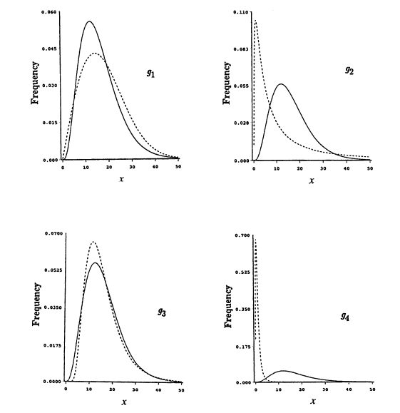
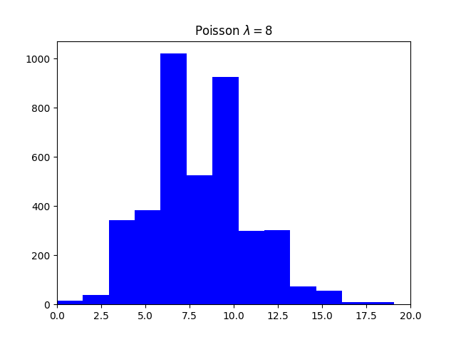
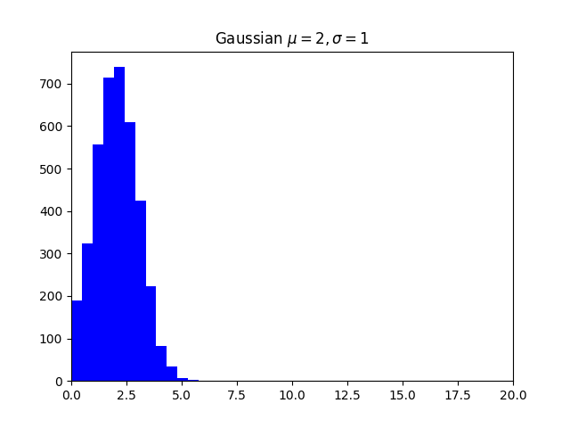
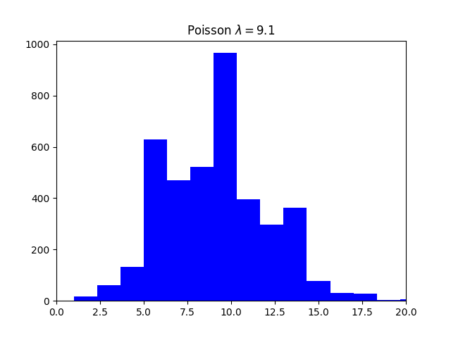
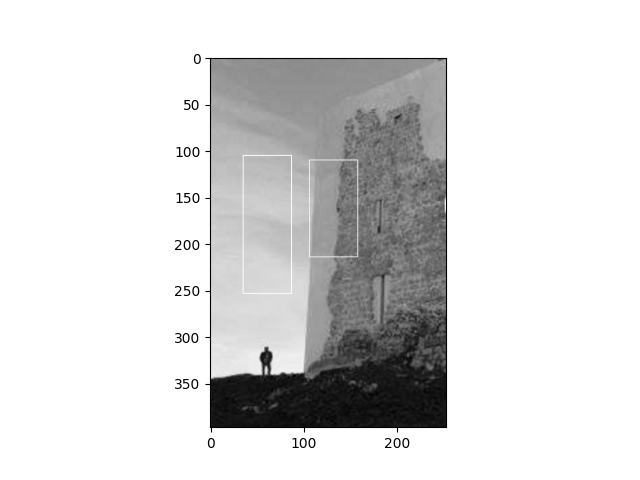

# Kullback-Leibler (KL) Mesafesi

İki olasılık dağılımının arasındaki uyumsuzluğu (discrepancy) hesaplayan
bir ölçüt KL mesafesidir. Gerçi bu ölçüt tam tanımıyla mesafe değil, $f$
ile $g$ arasındaki mesafe $g$ ile $f$ arasındaki mesafeden farklı
olabiliyor, KL mesafesi üçgen eşitsizlik (triangle inequality) kavramını
takip etmiyor. Tam tanımlamak gerekirse KL bir yönsel (directed) mesafedir [2].

Kullback-Leibler aslında 1951'de bir enformasyon ölçütü bulmuş oldular, bu
ölçüt ilginç bir şekilde fizikçi Boltzmann'ın bir sistemdeki düzensizliği
ölçen entropi kavramının negatif değerli halidir. Ayrıca KL mesafesi
Enformasyon Teorisi'ni keşfeden Shannon'un enformasyon tanımının da bir
uzantısıdır, bu sebeple bazen KL mesafesine "izafi entropi'' ismi de
veriliyor.

Tüm bu kavramların tabii ki İstatistik'teki model seçme uygulamalarıyla
yakın alakaları var. Diyelim ki elimizde iki dağılım var, $f$ yaklaşmaya
çalıştığımız bir model, $g$ ise onu yaklaşık olarak temsil etmeye uğraşan
başka bir model, $\theta$ parametreleri üzerinden tanımlı, yani
$g(x|\theta)$. $\theta$ çoğunlukla veriden kestirilmeye çalışılır,
$\hat{\theta}$ elde edilir, o zaman $g(x|\hat{\theta})$ olur. Bu iki
dağılım / model arasındaki KL mesafesi

$$ I(f,g) = \int f(x) \log \bigg( \frac{f(x)}{g(x;\theta)} \bigg) \mathrm{d} x$$

(çoğunlukla çok boyutlu) entegrali ile hesaplanır. Kullback-Leibler
$I(f,g)$ notasyonunu "$g$, $f$ yerine, onu yaklaşık olarak temsil edecek
şekilde kullanıldığına kaybedilen enformasyon'' şeklinde kullandılar. Tabii
ki uygulamalarda bu kayıbın olabildiği kadar az olmasını isteriz, yani
$I(f,g)$'i $g$ üzerinden minimize etmek önemli bir uygulama alanı.

Ayrıksal dağılımlar durumunda üstteki formül,

$$ I(f,g) = \sum_{i=1}^{k} p_i \log \bigg( \frac{p_i}{\pi_i} \bigg)  $$

Burada $k$ değişkeni rasgele değişkenin alabileceği $k$ farklı değeri
temsil eder, $i$'inci olayın olma olasılığı $p_i$'dir, $\pi_1,..,\pi_k$ ise
gerçek dağılımı yaklaşık olarak temsil etmeye uğraşan modeldir. Ayrıksal
durumda $0 < p_i < 1, 0 < \pi_i < 1$, ve $\sum p_i = 1 = \sum \pi_i = 1$. 

Formüllere yakından bakarsak onların birer beklenti hesabı olduğunu
görebiliriz, $\int f(x) ( \cdot ) \mathrm{d} x$ şablonundaki formüllerin beklenti
hesabı için kullanıldığını biliyoruz. Ayrıksal durumda
$\sum_{i=1}^{k}p_i( \cdot )$, ve bu beklenti iki dağılımın birbirine olan
oranının negatifinin beklentisi, yani bu oranın ortalaması. Bu kavramın
çıkışı çok derin ve temel, Boltzmann'ın 1877'de, Shannon'un sonra
buldukları ile derin bağlantılar var. 

Kabaca tarif etmek gerekirse, bir dağılımın içerdiği enformasyon onun
negatif log'udur, iki dağılım arasındaki mesafe için negatif log'ların
farkını alırız, ki fark cebirsel olarak bölümün log'u olarak tek bir log
altında gruplanabilir, ve mümkün tüm sayılar üzerinden bu farkların
beklentisini alırsak üstteki entegral (ya da toplam) formülünü elde etmiş
oluruz. 

KL mesafesi her zaman pozitiftir, tek bir durum haricinde, eğer $f,g$
eşitse - o zaman $I(f,g) = 0$.

Bir örnek üzerinde görmek gerekirse, diyelim ki $f$ 2 parametreli bir Gamma
dağılımı, $\alpha=4,\beta=4$. Şimdi bu modeli yaklaşık olarak temsil etmeye
uğraşan 4 tane seçeneği görelim, Weibull, lognormal, ters Gaussian, ve F
dağılımı. 

$$
\begin{array}{cc}
Yaklaşık Model & I(f,g_i) \\
\hline \\
Weibull (\alpha=2,\beta=20) & 0.04620 \\
Lognormal (\theta=2,\sigma^2=2) & 0.67235 \\ 
Ters Gaussian (\alpha=16,\beta=64) & 0.06008 \\
F dağılımı (\alpha=4,\beta=10) & 5.74555
\end{array}
$$

Görüldüğü gibi Weibull en yakın olan (yani yaklaşık temsil sırasında en az
enformasyon kaybeden o). Lognormal 3. sırada, F dağılımı en uzak olanı.



Bir başka örnek için *Testlere Devam* yazısındaki araba sayım verisine
bakalım. Şimdi ham veriye en uygun olan dağılımı bulmaya çalışacağız. 

```python
import pandas as pd
df = pd.read_csv('../stat_tests2/vehicles.csv',header=None)
df.hist(bins=13)
plt.savefig('stat_kl_02.png')
```


Veride Poisson görünümü var. Eşit aralıklarda yapılan sayımların Poisson
dağılımını takip etmeye meyilli olduğunu biliyoruz. Bu tezi kontrol
edelim. Eğer, diyelim, Possion ve Gaussian arasında seçim yapacak olsak, bu
seçimi KL mesafesi üzerinden yapabilirdik. Her iki durumda da dağılım
parametrelerini veriden tahmin ediyor olurduk,

```python
print np.float(df.mean()), np.float(df.std())
```

```
9.09433962264 3.54166574177
```

Poisson durumunda ortalama hesabı $\hat{\lambda}$ için, Gaussian'da ise
ortalama ve standart sapma $\hat{\mu},\hat{\sigma}$ için
kullanılırdı. 

Altta hem verinin hem de hipotez dağılımlardan üretilmiş rasgele sayıların
histogramlarını hesaplıyoruz. Not: Aslında ham verinin histogramından sonra
histogram kutularının (bins) sınırlarına bakarak Poisson ve Gaussian
analitik dağılımlarının oraya tekabül eden yoğunluklarını analitik çağrılar
ile bulabilirdik, fakat kolay yolu (!)  seçtik, analitik dağılımlar için de
rasgele sayı üretiyoruz, hem ham veri hem analitik durum için histogram
hesaplıyoruz.

```python
import scipy.stats
s = 4000
b = 15
r1 = scipy.stats.poisson.rvs(mu=8, size=s)
plt.hist(r1, bins=b,color='b')
plt.title('Poisson $\lambda = 8$')
plt.xlim(0,20)
plt.savefig('stat_kl_04.png')
plt.figure()
r2 = scipy.stats.norm.rvs(2, 1, size=s)
plt.hist(r2, bins=b,color='b')
plt.title('Gaussian $\mu = 2,\sigma=1$')
plt.xlim(0,20)
plt.savefig('stat_kl_06.png')
plt.figure()
r3 = scipy.stats.poisson.rvs(mu=9.0943, size=s)
plt.hist(r3, bins=b,color='b')
plt.title('Poisson $\lambda = 9.1$')
plt.xlim(0,20)
plt.savefig('stat_kl_07.png')
plt.figure()
r4 = scipy.stats.norm.rvs(9.1, 3.54, size=s)
plt.hist(r4, bins=b,color='b')
plt.title('Gaussian $\mu = 9.1,\sigma=3.54$')
plt.xlim(0,20)
plt.savefig('stat_kl_08.png')
```







Şimdi veri ve tüm müstakbel analitik yoğunluklar arasında KL mesafelerini
hesaplayalım,

```python
def kl(p, q):
    return np.sum(p * np.log(p / q))

b = range(0,30)
eps = 1e-5
dh = np.histogram(df, bins=b, density=True)[0]+eps
h1 = np.histogram(r1, bins=b, density=True)[0]+eps
h2 = np.histogram(r2, bins=b, density=True)[0]+eps
h3 = np.histogram(r3, bins=b, density=True)[0]+eps
h4 = np.histogram(r4, bins=b, density=True)[0]+eps
print 'Poisson lambda = 8', kl(h1, dh)
print 'Gaussian mu = 2,sigma=1', kl(h2, dh)
print 'Poisson lambda = 9.1', kl(h3, dh)
print 'Gaussian mu = 9.1,sigma=3.54', kl(h4, dh)
```

```
Poisson lambda = 8 0.14722344735
Gaussian mu = 2,sigma=1 6.39721632939
Poisson lambda = 9.1 0.133099166073
Gaussian mu = 9.1,sigma=3.54 0.200156046018
```

En yakın olan Poisson $\lambda=9.1$ olarak gözüküyor.

Çok Boyutlu Dağılımlar

Eğer bir dijital görüntü üzerinde çalışıyorsak, o resimdeki piksel
değerlerinin de bir "dağılımı'' olduğunu düşünebiliriz. Yani resmi, ya da
resmin bir bölgesini bir teorik dağılımdan "üretilmiş'' bir örneklem
olarak görmek mümkün. Bu dağılımı çok boyutlu histogram alarak yaklaşık
olarak hesaplayabiliriz. Eğer iki farklı resim bölgesini bu şekilde
belirtirsek, bu iki dağılımı KL mesafesiyle karşılaştırabililiriz, ve
böylece görüntüsel olarak iki bölgeyi karşılaştırabiliriz.

```python
from PIL import Image, ImageDraw

def draw_boxes_color(bs,imfile):
    im = Image.open(imfile).convert('HSV')
    arr = np.asarray(im)
    draw = ImageDraw.Draw(im)
    colors = ['magenta','green','white','red','yellow']
    for i,b in enumerate(bs):
        fr = b[0]; to = b[1]
        bnew = [(fr[0],arr.shape[0]-fr[1]),(to[0],arr.shape[0]-to[1])]
        draw.rectangle(bnew,outline=colors[i])
    plt.imshow(im)

def get_pixels(box, im):
    arr = np.array(im)
    (yw,xw,d) = arr.shape
    (bx1,by1) = box[0]; (bx2,by2) = box[1]
    by1 = yw-by1; by2 = yw-by2
    x1 = min(bx1,bx2); x2 = max(bx1,bx2)
    y1 = min(by1,by2); y2 = max(by1,by2)
    arr = arr[y1:y2, x1:x2, :]
    return arr
```


```python
box1 = [(35,144),(87,292)]
box2 = [(106,183),(158,287)]
box3 = [(117,86),(132,160)]
f = '../../vision/vision_50colreg/castle.png'
draw_boxes_color([box1,box2],f)
plt.savefig('stat_kl_03.png')
draw_boxes_color([box2,box3],f)
plt.savefig('stat_kl_05.png')
```




Renklerin HSV kodlamasını kullanalım, o zaman her piksel kordinatında 3
değer olur. Bu durumda histogram almak demek çok boyutlu histogram
demektir, üç boyut için sırasıyla 8,8,4 tane kutu tanımlarsak, 256 tane
kutu elde ederiz. Bu kutuları `numpy.histogramdd` ile hesaplarız, KL
karşılaştırması için kutuları düz vektör haline getirebiliriz -KL hesabında
her iki tarafın birbirine tekabül eden kutuları kullanıldığı sürece problem
yok- ve böylece nihai hesap yapılır.

```python
def box_kl_dist(b1,b2,im):
    im = Image.open(f).convert('HSV')
    arr1 = get_pixels(b1, im)
    r = [(0,255),(0,255),(0,255)]

    arr1 = np.reshape(arr1, (arr1.shape[0]*arr1.shape[1],3))
    H1, edges = np.histogramdd(arr1, bins=(8, 8, 4), normed=True, range=r)
    H1 = np.reshape(H1, (H1.shape[0]*H1.shape[1]*H1.shape[2], 1))

    arr2 = get_pixels(b2, im)
    arr2 = np.reshape(arr2, (arr2.shape[0]*arr2.shape[1],3))
    H2, edges = np.histogramdd(arr2, bins=(8, 8, 4), normed=True, range=r)
    H2 = np.reshape(H2, (H2.shape[0]*H2.shape[1]*H2.shape[2], 1))

    return kl(H1+eps, H2+eps)

print box_kl_dist(box1, box2, f)
print box_kl_dist(box2, box3, f)
```

```
7.55231179178e-06
7.30926985663e-07
```

İkinci karşılaştırmada mesafe daha yakın duruyor; hakikaten de resimlere
bakarsak ikinci resimdeki bölgelerin renksel olarak birbirine daha yakın
olduğunu görebiliyoruz.

Kaynaklar

[1] Cover, *Elements of Information Theory*

[2] Burnham, *Model Selection and Inference*


