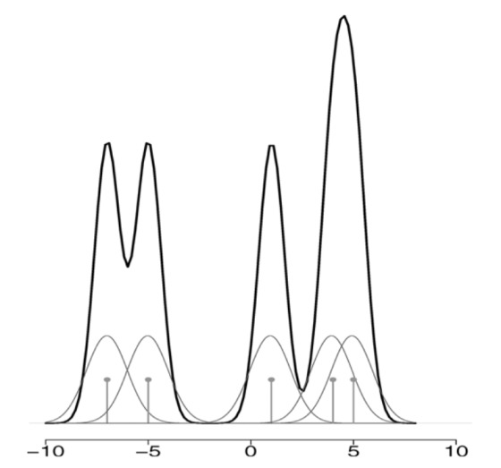

# Parametresiz İstatistik (Nonparametric Statistics)

Parametrik istatistik açıklamaya çalıştığı bir örneklemin dağılımına
ilişkin varsayımlar yapmaya uğraşır, mesela "bu veri bir Gaussian
dağılımdan geliyordur" diyebilir, bilinmeyenler bu Gaussian
dağılımının $\mu$, ve $\sigma$ değişkenleridir, *parametreleridir*. Bu
değişkenler başta bilinmiyor olabilir fakat parametre olarak
yaklaşımın bir parçasıdırlar. Parametrik olmayan istatistik ise
varsayımlara dayanmaz; veriler belirli bir dağılımı takip etmeyen bir
örneklemden toplanabilir, ya da dağılım varsa bile yaklaşım varsayım
yapmayarak belki daha kuvvetli bazı sonuçlar almaya uğraşır.

Parametresiz İstatistik yaklaşımlarını aslında pek çoğumuz belki de
ait olduğu kategoriyi bilmeden sürekli kullanıyoruz. Bir histogram
aldığımızda aslına parametresiz istatistik uygulamış oluyoruz, çünkü
histogram yaklaşımı bilindiği gibi hiçbir dağılım varsayımı yapmıyor
ve herhangi bir veriyle işleme kabiliyetine sahip. Verinin
histogramını hesapladığımızda diyelim ki $N$ tane kutucuk içine düşen
verileri sayıyoruz, onların frekansını hesaplıyoruz ve bu frekans
grafiklendiğinde bize verinin gerçek dağılımının ne olduğu hakkında
bir fikir verebiliyor.

Bir örnek üzerinde görelim, altta iki değişkenli (bivariate) Gaussian
dağılımından kendi ürettiğimiz rasgele verileri ve onun histogram
temsilini gösteriyoruz.

```python
from scipy import stats

rand_seed = 100
def make_data_binormal(data_count=100):
    alpha = 0.3
    np.random.seed(rand_seed)
    x = np.concatenate([
        np.random.normal(-1, 2, int(data_count * alpha)),
        np.random.normal(5, 1, int(data_count * (1 - alpha)))
    ])
    dist = lambda z: alpha * stats.norm(-1, 2).pdf(z) + (1 - alpha) * stats.norm(5, 1).pdf(z)
    return x, dist

data, d = make_data_binormal()
x_vals = np.linspace(np.min(data), np.max(data), 1000)
plt.hist(data, bins=20, density=True, alpha=0.6, label='Histogram')
plt.plot(x_vals, d(x_vals), color='green', lw=2, linestyle='--', label='True Distribution')
plt.savefig('stat_053_nonpar_01.png')
```


Histogram yaklaşımı gerçek dağılımın iki tepesini kabaca yakaladı, her
iki tepe de grafikte görülebiliyor.

Histogram hesabının gerçek dağılımı temsil kabiliyetinin teorik
ispatını [1, sf. 311]'de bulabiliriz.

Çekirdek Yoğunluk Tahmini (Kernel Density Estimation / KDE)

Histogram gibi parametresiz olan bir yaklaşım daha: KDE. Bu metotla
diyelim ki bir olasılık yoğunluk fonksiyonu (pdf) $f(x)$ tahmin
edilmeye, yaklaşık olarak bir $\hat{f}$ ile temsil edilmeye
uğraşılıyor, bunu

$$
\hat{f}(x) = \frac{1}{n} \sum _{i=1}^{n} \frac{1}{h} K \left( \frac{x - x_i}{h}  \right)
\qquad{1}
$$

hesabı ile gerçekleştirebiliriz. $K$ ile gösterilen çekirdek
fonksiyonlarıdır, farklı $K$ seçimleri farklı sonuçlara sonuç
verebilir, fakat genel olarak Gaussian dağılım fonksiyonları iyi sonuç
verir. $h$ değişkeni bant genişliği (bandwidth), bunu dışarıdan biz
tanımlarız, tabii formülde $1/h$ ekinin özel bir diğer önemi $\hat{f}$'nin
entegre edilince 1 sonucunu vermesi [1, sf. 313].

$K$ içeriğine gelelim, Gaussian dağılım formülünü hatırlarsak,
standart sapma $\sigma$ ortalama $\mu$ olan bir dağılım,

$$
f_g(x) = \frac{1}{\sigma \sqrt{2\pi} } e^{-\frac{1}{2}\left(\frac{x-\mu}{\sigma}\right)^2}
$$

Eğer $\sigma=1,\mu=0$ dersek *standart* normal dağılım elde ederiz,

$$
f_g(x) = \frac{1}{\sqrt{2\pi} } e^{-x^2 / 2}
$$

Bu formulu $K$ icin kullanabiliriz, 

$$
K(u) = \frac{1}{\sqrt{2\pi} } e^{-u^2 / 2}
$$

KDE formülü

$$
\hat f(x) = \frac{1}{n h} \sum_{i=1}^n K\!\left(\frac{x - x_i}{h}\right)
$$

O zaman

$$
\hat f(x) = \frac{1}{n h} \sum_{i=1}^n \frac{1}{\sqrt{2\pi}} 
\exp\!\left(-\frac{1}{2}\left(\frac{x - x_i}{h}\right)^2\right)
$$

Burada ilginç bir nokta var, çok detaya girmek istemeyenler
atlayabilir, fakat biraz cebirsel değişim sonrası farkediyoruz ki
toplam içinde yeni bir Gaussan elde etmiş oluyoruz. Yani KDE tanımı
itibariyle $h$ bölümünün dikte edilmesi bizi şöyle bir Gaussian'a
getiriyor, üstte toplam içini biraz açarsak ve dışarıdaki $h$'yi içeri
getirirsek, toplam sembolü terimleri şu hale gelir,

$$
\frac{1}{h \sqrt{2\pi}}  \exp\!\left(-\frac{(x-x_i)^2}{2 h^2}\right)
$$

Üstteki formül sonuçta bir $N(x_i, h^2)$ dağılımı degil midir?
Ortalama $x_i$ varyansı $h^2$. Yani KDE mekanizması başlangıç $N(0,1)$
çekirdeği üzerinden bizi dolaylı olarak her veri noktasında bir
$N(x_i, h^2)$ tepesi eklemeye götürmüş oluyor.

Kavramsal olarak tahmin edici $\hat{f}$ her $x$ noktasında $x_i$
verisini merkez almış çekirdek fonksiyonlarının ortalamasıdır. Yani
$x_1$'i merkez alan bir Gaussian vardır, tabii ki $K(x)$ hesabı için
$x_1$'deki çekirdeğe $x_2,x_3,..$ üzerindeki Gaussian'ların değerleri
de eklenir [2, sf. 313].



Kod ile bu hesabı görelim,

```python
def kernel(type='gaussian'):
    return lambda u: (1 / np.sqrt(2 * np.pi)) * np.exp(-0.5 * u**2)

def kde(data, k=None):
    x = np.linspace(np.min(data), np.max(data), 1000)
    k = kernel('gaussian')
    n = len(data)
    h = 0.5
    diffs = (x[:, np.newaxis] - data) / h
    print ('diffs', diffs.shape)
    kernel_values = k(diffs)
    kde = np.sum(kernel_values, axis=1) / (n * h)
    return kde

fhat_kde = kde(data)

plt.figure(figsize=(10, 6))
plt.plot(x_vals, fhat_kde, color='red', lw=2, label='KDE')
plt.plot(x_vals, d(x_vals), color='green', lw=2, linestyle='--')
plt.legend()
plt.grid(True)
plt.savefig('stat_053_nonpar_02.png')
```

```text
diffs (1000, 100)
```


Bu kod standart KDE kodlaması. Bu noktada bazı performans konularına
dikkat çekmek gerekiyor. Formül (1)'deki $K(x - x_i / h)$ hesabının
bir toplam içinde olduğuna ve her $x$ hesabi için *tüm* diğer
$x$'lerin üzerinden geçilmesi gerektiğine dikkat çekmek gerekiyor. Bu
demektir ki üstte verilen yaklaşımın hesapsal karmaşıklığı $O(n^2)$
olacaktır, ki bu hız anlık (online) işlem yapan uygulamalar için
tercih edilen bir performans olmaz. KDE'yi daha hızlandırmak için bir
yaklaşımı ileride göreceğiz.

KDE Olasılık Dağılımıdır

Çekirdek üzerinden tanımlanan fonksiyon bize bir yaklaşıksal
olasılıksal yoğunluk fonksiyonu (pdf) veriyor mu? Bunun ispatı için
$K$ seçimindeki bazı şartları tam belirleyelim. KDE matematiğine göre
çekirdek pürüzsüz bir fonksiyon olmalıdır, öyle ki $K(x) \ge 0$,
$\int K(x) \,dx = 1$, $\int x K(x) \,dx = 0$, ve $\int x^2 K(x) \,dx > 0$.

Bir fonksiyonun pdf olması için iki şart var, $\hat{f}(x) \ge 0$ olmalı,
ve $\int \hat{f}(x) \,dx = 1$ olmalı. Dikkat edersek bu iki şart $K$ için
tanımlanan şartlarla aynı. Bunun KDE formülü üzerinden yansıması şöyle olur,

$$
\int_{-\infty}^{\infty} \hat{f}(x) \,dx = \int_{-\infty}^{\infty}
\frac{1}{n} \sum_{i=1}^n K(x-x_i) \,dx
$$

Eşitliğin sağındaki sabit $1/n$ entegral dışına çıkartılabilir,

$$= \frac{1}{n} \sum_{i=1}^n \int_{-\infty}^{\infty} K(x-x_i) \,dx$$

Bir değişken değişimi yapalım, $u = \frac{x-x_i}{h}$ olsun, o zaman
$x = uh + x_i$, ve $dx = h\,du$. Entegral limitleri aynı kalıyor, demek ki

$$= \frac{1}{n} \sum_{i=1}^n \int_{-\infty}^{\infty} \frac{1}{h}K(u) (h\,du)$$

Bölüm ve bölendeki $h$ terimleri iptal olur,

$$= \frac{1}{n} \sum_{i=1}^n \int_{-\infty}^{\infty} K(u) \,du$$

Çekirdek fonksiyonu tanımına göre $K(u)$'nun tüm tanım alanı üzerinden
entegrali 1 olmak zorundaydı, $\int_{-\infty}^{\infty} K(u) \,du = 1$.
O zaman,

$$= \frac{1}{n} \sum_{i=1}^n (1) = \frac{1}{n} (n) = 1$$

Görüldüğü gibi çekirdek yoğunluk tahminsel hesap hem negatif olmama
hem de normalizasyon (entegralin 1 olması) şartlarını yerine
getiriyor, o zaman tanım itibariyle o bir pdf'tır.

KDE Ana Yoğunluğa Ne Kadar Yakındır?

KDE ile elde edilen fonksiyonun bir pdf olması yeterli değil, önemli
olan tahmin edilmeye uğraşılan ana pdf'e ne kadar yaklaştığı.

Her $x$ noktasında KDE'nin ortalama ve varyansına bakalım. Once
ortalama,

$$
E[\hat{f}(x) ] = \frac{1}{n} \sum _{i=1}^{n}
E \left[
\frac{1}{h} K \left( \frac{x - x_i}{h}  \right)
\right]
$$

$$
= \int K(u) \left[
f(x) - h u f'(x) + \frac{h^2 u^2 }{2} f''(x) + o(h^2)
\right] \,du
$$

$$
= f(x) \int K(u)\,du 
\;-\; h f'(x)\int u K(u)\,du 
\;+\; \frac{h^2 f''(x)}{2}\int u^2 K(u)\,du
\;+\; \int K(u)\,o(h^2)\,du.
$$

$K$ tanımına göre $\int K(x) \,dx = 1$, $\int x K(x) \,dx = 0$ olması gerektiğini
hatırlarsak,

$$
= f(x) + \frac{h^2 f''(x)}{2} \int K(u) u^2 \,du + o(h^2)
$$

Eğer $\int K(u) u^2 \,du = \sigma_K^2$ dersek, ve $f(x)$ ifadesini
eşitliğin soluna taşırsak,

$$
E[\hat{f}(x)] - f(x) = \frac{h^2 \sigma_K^2 f''(x)}{2} + o(h^2)
$$

Eşitliğin solundaki terim yanlılık (bias) hesabıdır. Doğal olarak
yanlılığın azalmasını isteriz, üstteki ifade diyor ki $h$ küçüldükçe
yanlılık ta sıfıra gidecek. Demek ki $h$ değerini küçültürsem
yanlılığı azaltırım.

Fakat yanlılık tek başına yeterli değil, genellikle aranan bir hata
kare ortalaması (mean square error), MSE olarak bilinen hesabın
ufalmasıdır.. MSE hesabı da yanlılık karesi artı varyanstır, burada
istatistik literatüründe bilinen yanlılık / varyans dengesi (tradeoff)
aklımıza gelebilir, yanlılığı azalttığımızda varyansta patlamaya sebep
olabiliriz, bu sebeple her iki ölçümü dengeleyen bir yaklaşım
bulunmalıdır. O zaman nihai bir optimal sonuca ulaşmak için KDE'nin
varyansını hesaplayalım.

Tüm toplamın varyansına gerek yok aslında, toplanan her terim
bağımsız, tıpatıp aynı dağılıma sahipse (i.i.d.), o zaman bazı
kolaylıklar elde ediyoruz, diyelim ki

$$
Y_i := \frac{1}{h} K\!\left(\frac{x - X_i}{h}\right), \quad
\hat f(x) = \frac{1}{n} \sum_{i=1}^n Y_i.
$$

ki $Y_1,\dots,Z_n$ i.i.d. ve her dağılımın varyansı aynı,
$\sigma^2$. Tüm toplam üzerinde varyans alırsak,

$$
Var \left[ \frac{1}{n}  \sum_{i=1}^n Y_i \right] =
\frac{1}{n^2}\, n \sigma^2 \;=\; \frac{1}{n} \sigma^2.
$$

$$
Var \left[ \hat f(x) \right] = \frac{1}{n} \, \mathrm{Var}[Y_1].
$$

$Y_1$ kullanıldı, yani herhangi bir $Y_i$ anlamında.. Üstteki diyor ki
toplam içindeki tek bir terimin varyansını hesaplayıp $n$'ye bölersek
istenilen sonuca erisebiliriz. O şekilde devam edelim o zaman,

$$
Var[\hat{f}(x)] = \frac{1}{n} Var \left[
\frac{1}{h} K(\frac{x-x_i}{h})
\right]
$$

Temel İstatistiği hatırlarsak $Var(X) = E(X^2) - E(X)^2$


$$
= \frac{1}{n} \left[
\int \frac{1}{h} K^2(u) (f(x) - h u f'(x) ) \,du - f^2(x) + O(h) 
\right]
$$

Koseli parantez icine bakalim, ilk terim

$$
\int \frac{1}{h} K^2(u) f(x)\,du = \frac{f(x)}{h} \int K^2(u)\,du
$$

Ikinci terim

$$
\int \frac{1}{h} K^2(u) f(x)\,du = \frac{f(x)}{h} \int K^2(u)\,du
$$

Bu terim yokolur çünkü $\int u K^2(u) du$ sıfırdır, $K(u)$ bir çift
fonksiyon (tek fonksiyon, çift fonksiyon kavramlarını hatırlarsak,
$K(u)=K(-u)$), ve $K^2(u)$ yine çift, fakat $u K^2(u)$ tek çünkü $u$
degiskeni, bir fonksiyon olarak düşünülürse tektir. Ve tek
fonksiyonların sıfır etrafındaki simetrik limitleri üzerinden
entegrali sıfırdır.

$$
= \frac{f(x)}{hn} \int K^2 (u) \,du + O(1/n)
$$


[devam edecek]

Kaynaklar

[1] Shalizi, *Advanced Data Analysis From An Elementary Point of View*

[2] Wasserman, *All of Statistics*