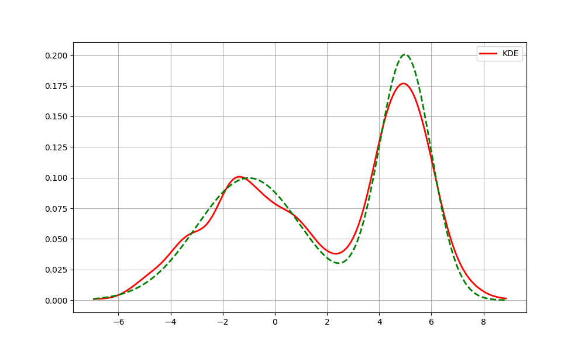

# Parametresiz İstatistik (Nonparametric Statistics)

Parametrik istatistik açıklamaya çalıştığı bir örneklemin dağılımına
ilişkin varsayımlar yapmaya uğraşır, mesela "bu veri bir Gaussian
dağılımdan geliyordur" diyebilir, bilinmeyenler bu Gaussian
dağılımının $\mu$, ve $\sigma$ değişkenleridir, *parametreleridir*. Bu
değişkenler başta bilinmiyor olabilir fakat parametre olarak
yaklaşımın bir parçasıdırlar. Parametrik olmayan istatistik ise
varsayımlara dayanmaz; veriler belirli bir dağılımı takip etmeyen bir
örneklemden toplanabilir, ya da dağılım varsa bile yaklaşım varsayım
yapmayarak belki daha kuvvetli bazı sonuçlar almaya uğraşır.

Parametresiz İstatistik yaklaşımlarını aslında pek çoğumuz belki de
ait olduğu kategoriyi bilmeden sürekli kullanıyoruz. Bir histogram
aldığımızda aslına parametresiz istatistik uygulamış oluyoruz, çünkü
histogram yaklaşımı bilindiği gibi hiçbir dağılım varsayımı yapmıyor
ve herhangi bir veriyle işleme kabiliyetine sahip. Verinin
histogramını hesapladığımızda diyelim ki $N$ tane kutucuk içine düşen
verileri sayıyoruz, onların frekansını hesaplıyoruz ve bu frekans
grafiklendiğinde bize verinin gerçek dağılımının ne olduğu hakkında
bir fikir verebiliyor.

Bir örnek üzerinde görelim, altta iki değişkenli (bivariate) Gaussian
dağılımından kendi ürettiğimiz rasgele verileri ve onun histogram
temsilini gösteriyoruz.

```python
from scipy import stats

def make_data_binormal(data_count=1000, seed=100):
    np.random.seed(seed)
    n1 = data_count // 2
    n2 = data_count - n1
    x = np.concatenate([
        np.random.normal(-1, 2, n1),
        np.random.normal(5, 1, n2)  
    ])
    def true_pdf(z):
        return 0.5 * norm(-1, 2).pdf(z) + 0.5 * norm(5, 1).pdf(z)
    np.random.shuffle(x)
    return x, true_pdf

data, d = make_data_binormal()
x_vals = np.linspace(np.min(data), np.max(data), 1000)
plt.hist(data, bins=20, density=True, alpha=0.6, label='Histogram')
plt.plot(x_vals, d(x_vals), color='green', lw=2, linestyle='--', label='True Distribution')
plt.savefig('stat_053_nonpar_01.png')
```


Histogram yaklaşımı gerçek dağılımın iki tepesini kabaca yakaladı, her
iki tepe de grafikte görülebiliyor.

Histogram hesabının gerçek dağılımı temsil kabiliyetinin teorik
ispatını [1, sf. 311]'de bulabiliriz.

Çekirdek Yoğunluk Tahmini (Kernel Density Estimation / KDE)

Histogram gibi parametresiz olan bir yaklaşım daha: KDE. Bu metotla
diyelim ki bir olasılık yoğunluk fonksiyonu (pdf) $f(x)$ tahmin
edilmeye, yaklaşık olarak bir $\hat{f}$ ile temsil edilmeye
uğraşılıyor, bunu

$$
\hat{f}(x) = \frac{1}{n} \sum _{i=1}^{n} \frac{1}{h} K \left( \frac{x - x_i}{h}  \right)
\qquad{(1)}
$$

hesabı ile gerçekleştirebiliriz. $K$ ile gösterilen çekirdek
fonksiyonlarıdır, farklı $K$ seçimleri farklı sonuçlara sonuç
verebilir, fakat genel olarak Gaussian dağılım fonksiyonları iyi sonuç
verir. $h$ değişkeni bant genişliği (bandwidth), bunu dışarıdan biz
tanımlarız, tabii formülde $1/h$ ekinin özel bir diğer önemi $\hat{f}$'nin
entegre edilince 1 sonucunu vermesi [1, sf. 313].

$K$ içeriğine gelelim, Gaussian dağılım formülünü hatırlarsak,
standart sapma $\sigma$ ortalama $\mu$ olan bir dağılım,

$$
f_g(x) = \frac{1}{\sigma \sqrt{2\pi} } e^{-\frac{1}{2}\left(\frac{x-\mu}{\sigma}\right)^2}
$$

Eğer $\sigma=1,\mu=0$ dersek *standart* normal dağılım elde ederiz,

$$
f_g(x) = \frac{1}{\sqrt{2\pi} } e^{-x^2 / 2}
$$

Bu formulu $K$ icin kullanabiliriz, 

$$
K(u) = \frac{1}{\sqrt{2\pi} } e^{-u^2 / 2}
$$

KDE formülü

$$
\hat f(x) = \frac{1}{n h} \sum_{i=1}^n K\!\left(\frac{x - x_i}{h}\right)
$$

O zaman

$$
\hat f(x) = \frac{1}{n h} \sum_{i=1}^n \frac{1}{\sqrt{2\pi}} 
\exp\!\left(-\frac{1}{2}\left(\frac{x - x_i}{h}\right)^2\right)
$$

Burada ilginç bir nokta var, çok detaya girmek istemeyenler
atlayabilir, fakat biraz cebirsel değişim sonrası farkediyoruz ki
toplam içinde yeni bir Gaussan elde etmiş oluyoruz. Yani KDE tanımı
itibariyle $h$ bölümünün dikte edilmesi bizi şöyle bir Gaussian'a
getiriyor, üstte toplam içini biraz açarsak ve dışarıdaki $h$'yi içeri
getirirsek, toplam sembolü terimleri şu hale gelir,

$$
\frac{1}{h \sqrt{2\pi}}  \exp\!\left(-\frac{(x-x_i)^2}{2 h^2}\right)
$$

Üstteki formül sonuçta bir $N(x_i, h^2)$ dağılımı degil midir?
Ortalama $x_i$ varyansı $h^2$. Yani KDE mekanizması başlangıç $N(0,1)$
çekirdeği üzerinden bizi dolaylı olarak her veri noktasında bir
$N(x_i, h^2)$ tepesi eklemeye götürmüş oluyor.

Kavramsal olarak tahmin edici $\hat{f}$ her $x$ noktasında $x_i$
verisini merkez almış çekirdek fonksiyonlarının ortalamasıdır. Yani
$x_1$'i merkez alan bir Gaussian vardır, tabii ki $K(x)$ hesabı için
$x_1$'deki çekirdeğe $x_2,x_3,..$ üzerindeki Gaussian'ların değerleri
de eklenir [2, sf. 313].


Kod ile bu hesabı görelim,

```python
def kernel(type='gaussian'):
    return lambda u: (1 / np.sqrt(2 * np.pi)) * np.exp(-0.5 * u**2)

def kde(data, k=None):
    x = np.linspace(np.min(data), np.max(data), 1000)
    k = kernel('gaussian')
    n = len(data)
    h = 0.5
    diffs = (x[:, np.newaxis] - data) / h
    print ('diffs', diffs.shape)
    kernel_values = k(diffs)
    kde = np.sum(kernel_values, axis=1) / (n * h)
    return kde

fhat_kde = kde(data)

plt.figure(figsize=(10, 6))
plt.plot(x_vals, fhat_kde, color='red', lw=2, label='KDE')
plt.plot(x_vals, d(x_vals), color='green', lw=2, linestyle='--')
plt.legend()
plt.grid(True)
plt.savefig('stat_053_nonpar_02.png')
```

```text
diffs (1000, 1000)
```



Bu kod standart KDE kodlaması. Bu noktada bazı performans konularına
dikkat çekmek gerekiyor. Formül (1)'deki $K(x - x_i / h)$ hesabının
bir toplam içinde olduğuna ve her $x$ hesabi için *tüm* diğer
$x$'lerin üzerinden geçilmesi gerektiğine dikkat çekmek gerekiyor. Bu
demektir ki üstte verilen yaklaşımın hesapsal karmaşıklığı $O(n^2)$
olacaktır, ki bu hız anlık (online) işlem yapan uygulamalar için
tercih edilen bir performans olmaz. KDE'yi daha hızlandırmak için bir
yaklaşımı ileride göreceğiz.

KDE Olasılık Dağılımıdır

Çekirdek üzerinden tanımlanan fonksiyon bize bir yaklaşıksal
olasılıksal yoğunluk fonksiyonu (pdf) veriyor mu? Bunun ispatı için
$K$ seçimindeki bazı şartları tam belirleyelim. KDE matematiğine göre
çekirdek pürüzsüz bir fonksiyon olmalıdır, öyle ki $K(x) \ge 0$,
$\int K(x) \,dx = 1$, $\int x K(x) \,dx = 0$, ve $\int x^2 K(x) \,dx > 0$.

Bir fonksiyonun pdf olması için iki şart var, $\hat{f}(x) \ge 0$ olmalı,
ve $\int \hat{f}(x) \,dx = 1$ olmalı. Dikkat edersek bu iki şart $K$ için
tanımlanan şartlarla aynı. Bunun KDE formülü üzerinden yansıması şöyle olur,

$$
\int_{-\infty}^{\infty} \hat{f}(x) \,dx = \int_{-\infty}^{\infty}
\frac{1}{n} \sum_{i=1}^n K(x-x_i) \,dx
$$

Eşitliğin sağındaki sabit $1/n$ entegral dışına çıkartılabilir,

$$= \frac{1}{n} \sum_{i=1}^n \int_{-\infty}^{\infty} K(x-x_i) \,dx$$

Bir değişken değişimi yapalım, $u = \frac{x-x_i}{h}$ olsun, o zaman
$x = uh + x_i$, ve $dx = h\,du$. Entegral limitleri aynı kalıyor, demek ki

$$= \frac{1}{n} \sum_{i=1}^n \int_{-\infty}^{\infty} \frac{1}{h}K(u) (h\,du)$$

Bölüm ve bölendeki $h$ terimleri iptal olur,

$$= \frac{1}{n} \sum_{i=1}^n \int_{-\infty}^{\infty} K(u) \,du$$

Çekirdek fonksiyonu tanımına göre $K(u)$'nun tüm tanım alanı üzerinden
entegrali 1 olmak zorundaydı, $\int_{-\infty}^{\infty} K(u) \,du = 1$.
O zaman,

$$= \frac{1}{n} \sum_{i=1}^n (1) = \frac{1}{n} (n) = 1$$

Görüldüğü gibi çekirdek yoğunluk tahminsel hesap hem negatif olmama
hem de normalizasyon (entegralin 1 olması) şartlarını yerine
getiriyor, o zaman tanım itibariyle o bir pdf'tır.

KDE Ana Yoğunluğa Ne Kadar Yakındır?

KDE ile elde edilen fonksiyonun bir pdf olması yeterli değil, önemli
olan tahmin edilmeye uğraşılan ana pdf'e ne kadar yaklaştığı.

Her $x$ noktasında KDE'nin ortalama ve varyansına bakalım. Once
ortalama,

$$
E[\hat{f}(x) ] = \frac{1}{n} \sum _{i=1}^{n}
E \left[
\frac{1}{h} K \left( \frac{x - x_i}{h}  \right)
\right]
$$

$$
= \int K(u) \left[
f(x) - h u f'(x) + \frac{h^2 u^2 }{2} f''(x) + o(h^2)
\right] \,du
$$

$$
= f(x) \int K(u)\,du 
\;-\; h f'(x)\int u K(u)\,du 
\;+\; \frac{h^2 f''(x)}{2}\int u^2 K(u)\,du
\;+\; \int K(u)\,o(h^2)\,du.
$$

$K$ tanımına göre $\int K(x) \,dx = 1$, $\int x K(x) \,dx = 0$ olması gerektiğini
hatırlarsak,

$$
= f(x) + \frac{h^2 f''(x)}{2} \int K(u) u^2 \,du + o(h^2)
$$

Eğer $\int K(u) u^2 \,du = \sigma_K^2$ dersek, ve $f(x)$ ifadesini
eşitliğin soluna taşırsak,

$$
E[\hat{f}(x)] - f(x) = \frac{h^2 \sigma_K^2 f''(x)}{2} + o(h^2)
\qquad{(3)}
$$

Eşitliğin solundaki terim yanlılık (bias) hesabıdır. Doğal olarak
yanlılığın azalmasını isteriz, üstteki ifade diyor ki $h$ küçüldükçe
yanlılık ta sıfıra gidecek. Demek ki $h$ değerini küçültürsem
yanlılığı azaltırım.

Fakat yanlılık tek başına yeterli değil, genellikle aranan bir hata
kare ortalaması (mean square error), MSE olarak bilinen hesabın
ufalmasıdır.. MSE hesabı da yanlılık karesi artı varyanstır, burada
istatistik literatüründe bilinen yanlılık / varyans dengesi (tradeoff)
aklımıza gelebilir, yanlılığı azalttığımızda varyansta patlamaya sebep
olabiliriz, bu sebeple her iki ölçümü dengeleyen bir yaklaşım
bulunmalıdır. O zaman nihai bir optimal sonuca ulaşmak için KDE'nin
varyansını hesaplayalım.

$$
Var \left[ \hat{f}(x)  \right] =
\frac{1}{n} Var \left[
  \frac{1}{h} K \left( \frac{x - X}{h}  \right)
\right]
$$

Temel İstatistiği hatırlarsak $Var(X) = E(X^2) - E(X)^2$, o zaman üstteki 

$$
= \frac{1}{n} \left[
E \left[ \frac{1}{h^2} K^2 \left( \frac{x - X}{h}  \right) \right]
\right] -
\left(
E \left[ \frac{1}{h} K \left( \frac{x - X}{h}  \right)  \right]
\right)^2
$$

olacaktır. İlk beklenti (expectation) hesabını standart beklenti
formülü ile açabiliriz, bu bir entegraldir, $X$ pdf fonksiyonu $f_X$
için bunun $\int x f_X \,dx$ olduğunu biliyoruz, bunu
uygularız. İkinci beklenti için daha önce bulduğumuz (3)'teki formülü
kullanırız, 

$$
E[\hat{f}(x)]  = \frac{h^2 \sigma_K^2 f''(x)}{2} + f(x) + o(h^2)
$$

Buradaki ilk terimi $o(h^2)$'ye dahil edebiliriz, o zaman iki üstteki,

$$
= \frac{1}{n} \left[
\int K^2 \left( \frac{x - t}{h}  \right) \,dt - [ f(x) + O(h^2)]^2
\right]
$$

olur. Eksiden sonraki kare alma işlemini açalım,

$$
[ f(x) + O(h^2)]^2 = f(x)^2 + 2f(x) O(h^2) + (O(h^2))^2 = 
$$

$f(x)$, O(h^2)'e kıyasla sabit sayılır, etkisi yoktur, $(O(h^2))^2 = O(h^4)$,

$$
= f(x)^2 + O(h^2) + O(h^4)
$$

elde ederiz. Büyük O notasyonu matematiğine göre iki farklı dereceyi
topladığımız zaman daha yavaş azalan / sönümlenen (decay) terim
tutulur, o zaman $O(h^4)$ atılır, geriye $f(x)^2 + O(h^2)$ kalır.

$$
= \frac{1}{n} \left[
\int K^2 \left( \frac{x - t}{h}  \right) \,dt - f(x) + O(h^2)]
\right]
$$

Not: Büyük O notasyonunda $-O(h^2) = O(h^2)$, negatif işaret farketmiyor.

Değişken değişimi yapıyoruz

$$
\frac{1}{n} \left[
\int \frac{1}{h} K^2(u) f(x - hu) \,du - f(x)^2 + O(h^2)
\right]
$$

Taylor açılımını tekrar uyguluyoruz,

$$
\frac{1}{n} \left[
\int \frac{1}{h} K^2(u) \big( f(x) - huf'(x) \big) \,du - f(x)^2 + O(h^2)
\right]
\qquad{(2)}
$$

Şimdi entegrali açalım, sonuç şöyle olur,

$$
= \frac{f(x)}{hn} \int K^2(u) \,du - f'(x) \int u K^2(u) \,du - ...
$$

Ilk terimde $\int K^2(u) \,du$ var, bu bir sabite esittir.

$$
K(u)^2 = \left( \frac{1}{\sqrt{2\pi}} e^{-u^2/2} \right)^2
= \frac{1}{2\pi} e^{-u^2}.
$$

$$
\int_{-\infty}^{\infty} K(u)^2 \, du
= \frac{1}{2\pi} \int_{-\infty}^{\infty} e^{-u^2} \, du.
$$

Eşitliğin sağındaki entegralin $\sqrt{\pi}$ olduğu biliniyor, o zaman

$$
\Rightarrow \frac{1}{2\pi} \cdot \sqrt{\pi} \Rightarrow
\int_{-\infty}^{\infty} K(u)^2 \, du = \frac{1}{2\sqrt{\pi}} = R(K)
$$

Üstteki sonuç literatürde $R(K)$ ile anılır.

İkinci terimde $\int u K^2(u) du$ var, bu sıfırdır, $K(u)$ bir çift
fonksiyon (tek fonksiyon, çift fonksiyon kavramlarını hatırlarsak,
$K(u)=K(-u)$), ve $K^2(u)$ yine çift, fakat $u K^2(u)$ tek çünkü $u$
değişkeni, bir fonksiyon olarak düşünülürse tektir. Ve tek
fonksiyonların sıfır etrafındaki simetrik limitleri üzerinden
entegrali sıfırdır.

Formül (2)'den geriye kalanlar

$$
= \frac{1}{n} \left[ \frac{f(x)}{h}R(K) - f(x)^2 + O(h^2)  \right]
$$

Şimdi O notasyonu bağlamında düşünürsek, ilk terimde $f(x)R(K) / nh$
var, burada $R(K)$ seçilen çekirdek $K$'ye bağlı bir sabittir, o zaman
O notasyon sonucunda $O(1/nh)$ elde ederiz. İkinci terimde $f(x)^2/n$
var, burası $O(1/n)$ oluyor, çünkü $n$ ve $h$ büyümesine göre $f(x)^2$
sabit sayılır. Üçüncü terimde $O(h^2)/n$ var, bu da $O(h^2/n)$ oluyor.
Hepsinin nihai toplamı $O(1/nh)$ olurdu. Ama birinci terimi tutalım
ve şunu gösterelim,

$$
Var \left[ \hat{f}(x)  \right] = \frac{f(x)R(K)}{nh} + O(1/n)
$$

$n \to \infty$ iken ve $nh \to \infty$ ise üstteki sıfıra gider. O
zaman yanlılık ve varyans dengesi bağlamında suna dikkat edersek
yöntem işler; $h$ sıfıra gitmelidir, ama bunu $1/n$'den daha yavaş
yapmalıdır [1, sf. 314]. 

Alttaki formülde daha açık görebiliriz, hataların kare ortalaması
(mean square error, MSE) hesabı yanlılık karesi artı varyanstır, o zaman

$$
MSE = \frac{h^4 \sigma_K^4 (f''(x))^2}{4} + \frac{f(x)}{hn} \int K^2 (u) \,du + \textrm{ufak degerler}
$$

Doğru seçilmiş $h,n$ değerleri büyürken MSE'yi minimal hale
getirebilir, ama tabii ki bölünende olan $h$ değerine dikkat
edersek. Bu iki değer, $h,n$ arasındaki denge için ek hesabı [1,
sf. 315]'te bulabiliriz, optimal oran $h_{opt} = O(n^{-1/5})$ olarak
gösterilmiş, yani en iyi bant genişliği $h$ değeri veri noktası
sayısının 1 bölü beşinci kuvvetine oranla sıfıra gitmelidir. Not:
Üstteki formül her $x$ bazındadır, [1] kaynağında optimal $h$ bulmak
için tüm $x$'ler üzerinden entegral alınarak $h$ üzerinden türev
alınmıştır, bir "hata karelerinin entegresi alınmış beklentisi"
hesaplanmıştır.

Artımsal KDE

KDE formülünü kullanarak $p_n(x)$ tanımlayalım,

$$
p_n(x) = \frac{1}{n}\sum_{i=1}^{n} K_h(x - x_i).
$$

$(n+1)$'inci veri gelince $n+1$ veri noktası içeren KDE şudur,

$$
p_{n+1}(x)
=\frac{1}{n+1}\sum_{i=1}^{n+1} K_h(x - x_i)
=\frac{1}{n+1}\Big(\sum_{i=1}^{n} K_h(x - x_i) + K_h(x - x_{n+1})\Big).
$$

Eşitliğin sağındaki ilk terimde $\sum_{i=1}^{n} K_h(x - x_i)$ ifadesi
yerine bir önceki tanımdan $n p_n(x)$ formüle sokulabilir, bu bize
$p_{n+1}(x)$ için özyineli bir güncelleme formülü verir,

$$
p_{n+1}(x) = \frac{n}{n+1}\,p_n(x) + \frac{1}{n+1}\,K_h(x - x_{n+1})
\qquad{(1)}
$$

Kodları görelim,

```python
from scipy.stats import norm

num_points = len(data)    
total_density = None
N = 0
h = 0.5
x_values = np.linspace(min(data) - 1, max(data) + 1, num_points)
current = data[0]
total_density = norm.pdf(x_values, loc=current, scale=h)
for i in range(len(data)):
    current = data[i]
    density = norm.pdf(x_values, loc=current, scale=h)
    total_density = (N/(N+1)) * total_density +  (1 / (N+1)) * density
    N += 1

x_vals = np.linspace(np.min(data), np.max(data), 1000)
plt.plot(x_vals, d(x_vals), color='green', lw=2, linestyle='-', label='Gercek Dagilim')
plt.plot(x_values, total_density, color='red', lw=2, linestyle='--', label='Artimsal KDE')
plt.legend()
plt.savefig('stat_053_nonpar_03.png')
```


EWMA Baglantisi

Önce [6] yazısında gördüğümüz basit sayılar üzerinde artımsal
(incremental) ortalama hesabı formülünü hatırlayalım,

$$
\bar{x}_n = \left(1 - \tfrac{1}{n}\right)\bar{x}_{n-1} + \tfrac{1}{n} x_n.
$$

Şimdi KDE, sayaç güncellemesinin nerede olduğuna bağlı olarak ve bir
indis kaydırması yaparak KDE özyineli formül (1) şu şekilde de
gösterilebilir,

$$
p_{n}(x) = \frac{n-1}{n}\,p_{n-1}(x) + \frac{1}{n}\,K_h(x - x_{n})
$$

Her iki form birbirinin aynısı. Tek fark güncelleme için kullanılan
"yeni veri" noktasının birinde reel sayı olması diğerinde ise $K_h(x -
x_{n})$ ile hesaplanan son noktanının olasılık değeri.

Bu form benzerliğini saptamak önemli çünkü şimdi, aynen [5]'de
gösterildiği gibi, ortalama güncellemesini üstel ağırlıklı EWMA forma
geçirebildiğimiz gibi üstteki KDE güncellemesini de EWMA formatına
geçirebiliriz. Yani, en son veriye daha ağırlık veren EWMA formundaki
KDE şu şekilde yazılabilir.

$$
p_n(x) = (1-\alpha)\,p_{n-1}(x) + \alpha\,K_h(x - x_n).
$$

Bu noktada EWMA'nın bir tür "kayan pencere ortalaması" olduğunu
hatırlayabiliriz, kabaca bu pencere büyüklüğünün $\alpha$ bazlı nasıl
saptanabildiğini [3]'te görmüştük. Yani ortalama güncellemesi, kayan
pencere ortalaması, oradan tek parametre kullanarak hızlı şekilde
pencere ortalaması EWMA ile yapmaya doğru bir geçiş mümkündür.  Bu
geçiş performans, kodlama açısından faydalı olabilir, çünkü çok uzun
süreli güncelleme alan bir sistem düşünelim, veri nokta sayısı $n$ çok
büyüyecektir, bu sayı bölüm sırasında problem çıkartabilir.  Fakat
EWMA yaklaşımının bu tür problemleri olmaz.

```python
data, d = make_data_binormal(data_count=300)
```

```python
from scipy.stats import norm

num_points = len(data)    
total_density = None
h = 0.5
alpha = 0.001
x_values = np.linspace(min(data) - 1, max(data) + 1, num_points)
current = data[0]
total_density = norm.pdf(x_values, loc=current, scale=h)
for i in range(len(data)):
    current = data[i]
    density = norm.pdf(x_values, loc=current, scale=h)
    total_density =  (1-alpha)*total_density +  (alpha)*density

data, d = make_data_binormal(data_count=10*1000)
x_vals = np.linspace(np.min(data), np.max(data), 1000)
plt.plot(x_vals, d(x_vals), color='green', lw=2, linestyle='-', label='Gercek Dagilim')
plt.plot(x_values, total_density, color='red', lw=2, linestyle='--', label='EWMA KDE')
plt.legend()
plt.savefig('stat_053_nonpar_04.png')
```


Kaynaklar

[1] Shalizi, *Advanced Data Analysis From An Elementary Point of View*

[2] Wasserman, *All of Statistics*

[3] Bayramli, *Zaman Serileri - ARIMA, ARCH, GARCH, Periyotlar, Yürüyen Ortalama*

[4] Bayramli, *Istatistik, Parametresiz İstatistik (Nonparametric Statistics)*

[5] Bayramli, *Zaman Serileri, ARIMA, ARCH, GARCH, Periyotlar, Yürüyen Ortalama*

[6] Bayramli, *Azar Azar İstatistik (Incremental Statistics)*
