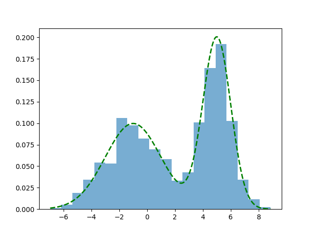

# Parametresiz İstatistik (Nonparametric Statistics)

Parametrik istatistik açıklamaya çalıştığı bir örneklemin dağılımına
ilişkin varsayımlar yapmaya uğraşır, mesela "bu veri bir Gaussian
dağılımdan geliyordur" diyebilir, bilinmeyenler bu Gaussian
dağılımının $\mu$, ve $\sigma$ değişkenleridir, *parametreleridir*. Bu
değişkenler başta bilinmiyor olabilir fakat parametre olarak
yaklaşımın bir parçasıdırlar. Parametrik olmayan istatistik ise
varsayımlara dayanmaz; veriler belirli bir dağılımı takip etmeyen bir
örneklemden toplanabilir, ya da dağılım varsa bile yaklaşım varsayım
yapmayarak belki daha kuvvetli bazı sonuçlar almaya uğraşır.

Parametresiz İstatistik yaklaşımlarını aslında pek çoğumuz belki de
ait olduğu kategoriyi bilmeden sürekli kullanıyoruz. Bir histogram
aldığımızda aslına parametresiz istatistik uygulamış oluyoruz, çünkü
histogram yaklaşımı bilindiği gibi hiçbir dağılım varsayımı yapmıyor
ve herhangi bir veriyle işleme kabiliyetine sahip. Verinin
histogramını hesapladığımızda diyelim ki $N$ tane kutucuk içine düşen
verileri sayıyoruz, onların frekansını hesaplıyoruz ve bu frekans
grafiklendiğinde bize verinin gerçek dağılımının ne olduğu hakkında
bir fikir verebiliyor.

Bir örnek üzerinde görelim, altta iki değişkenli (bivariate) Gaussian
dağılımından kendi ürettiğimiz rasgele verileri ve onun histogram
temsilini gösteriyoruz.

```python
from scipy import stats

rand_seed = 100
def make_data_binormal(data_count=100):
    alpha = 0.3
    np.random.seed(rand_seed)
    x = np.concatenate([
        np.random.normal(-1, 2, int(data_count * alpha)),
        np.random.normal(5, 1, int(data_count * (1 - alpha)))
    ])
    dist = lambda z: alpha * stats.norm(-1, 2).pdf(z) + (1 - alpha) * stats.norm(5, 1).pdf(z)
    return x, dist

data, d = make_data_binormal()
x_vals = np.linspace(np.min(data), np.max(data), 1000)
plt.hist(data, bins=20, density=True, alpha=0.6, label='Histogram')
plt.plot(x_vals, d(x_vals), color='green', lw=2, linestyle='--', label='True Distribution')
plt.savefig('stat_053_nonpar_01.png')
```



Histogram yaklaşımı gerçek dağılımın iki tepesini kabaca yakaladı, her
iki tepe de grafikte görülebiliyor.

Histogram hesabının gerçek dağılımı temsil kabiliyetinin teorik
ispatını [1, sf. 311]'de bulabiliriz.

Çekirdek Yoğunluk Tahmini (Kernel Density Estimation / KDE)

Histogram gibi parametresiz olan bir yaklaşım daha: KDE. Bu metotla
diyelim ki bir olasılık yoğunluk fonksiyonu (pdf) $f(x)$ tahmin
edilmeye, yaklaşık olarak bir $\hat{f}$ ile temsil edilmeye
uğraşılıyor, bunu

$$
\hat{f}(x) = \frac{1}{n} \sum _{i=1}^{n} \frac{1}{h} K \left( \frac{x - x_i}{h}  \right)
$$

hesabı ile gerçekleştirebiliriz. $K$ ile gösterilen çekirdek
fonksiyonlarıdır, farklı $K$ seçimleri farklı sonuçlara sonuç
verebilir, fakat genel olarak Gaussian dağılım fonksiyonları iyi sonuç
verir. $h$ değişkeni bant genişliği (bandwidth), bunu dışarıdan biz
tanımlarız, tabii formülde $1/h$ ekinin özel bir diğer önemi $\hat{f}$'nin
entegre edilince 1 sonucunu vermesi [1, sf. 313].

$K$ içeriğine gelelim, Gaussian dağılım formülünü hatırlarsak,
standart sapma $\sigma$ ortalama $\mu$ olan bir dağılım,

$$
f_g(x) = \frac{1}{\sigma \sqrt{2\pi} } e^{-\frac{1}{2}\left(\frac{x-\mu}{\sigma}\right)^2}
$$

Eğer $\sigma=1,\mu=0$ dersek *standart* normal dağılım elde ederiz,

$$
f_g(x) = \frac{1}{\sqrt{2\pi} } e^{-x^2 / 2}
$$

Bu formulu $K$ icin kullanabiliriz, 

$$
K(u) = \frac{1}{\sqrt{2\pi} } e^{-u^2 / 2}
$$

KDE formülü

$$
\hat f(x) = \frac{1}{n h} \sum_{i=1}^n K\!\left(\frac{x - x_i}{h}\right)
$$

O zaman

$$
\hat f(x) = \frac{1}{n h} \sum_{i=1}^n \frac{1}{\sqrt{2\pi}} 
\exp\!\left(-\frac{1}{2}\left(\frac{x - x_i}{h}\right)^2\right)
$$

Burada ilginç bir nokta var, çok detaya girmek istemeyenler
atlayabilir, fakat biraz cebirsel değişim sonrası farkediyoruz ki
toplam içinde yeni bir Gaussan elde etmiş oluyoruz. Yani KDE tanımı
itibariyle $h$ bölümünün dikte edilmesi bizi şöyle bir Gaussian'a
getiriyor, üstte toplam içini biraz açarsak ve dışarıdaki $h$'yi içeri
getirirsek, toplam sembolü terimleri şu hale gelir,

$$
\frac{1}{h \sqrt{2\pi}}  \exp\!\left(-\frac{(x-x_i)^2}{2 h^2}\right)
$$

Üstteki formül sonuçta bir $N(x_i, h^2)$ dağılımı degil midir?
Ortalama $x_i$ varyansı $h^2$. Yani KDE mekanizması başlangıç $N(0,1)$
çekirdeği üzerinden bizi dolaylı olarak her veri noktasında bir
$N(x_i, h^2)$ tepesi eklemeye götürmüş oluyor.

```python
def kernel(type='gaussian'):
    return lambda u: (1 / np.sqrt(2 * np.pi)) * np.exp(-0.5 * u**2)

def kde(data, k=None):
    x = np.linspace(np.min(data), np.max(data), 1000)
    k = kernel('gaussian')
    n = len(data)
    h = 0.5
    diffs = (x[:, np.newaxis] - data) / h
    kernel_values = k(diffs)
    kde = np.sum(kernel_values, axis=1) / (n * h)
    return kde

fhat_kde = kde(data)

plt.figure(figsize=(10, 6))
plt.plot(x_vals, fhat_kde, color='red', lw=2, label='KDE')
plt.plot(x_vals, d(x_vals), color='green', lw=2, linestyle='--')
plt.legend()
plt.grid(True)
plt.savefig('stat_053_nonpar_02.png')
```


[devam edecek]

Kaynaklar

[1] Shalizi, Advanced Data Analysis

