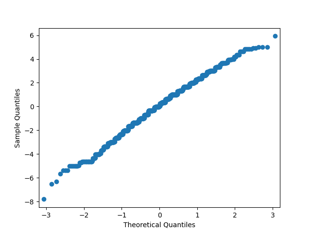

# Lineer Regresyon

Bir hedef değişkeninin bir veya daha fazla kaynak değişkenine olan
bağlantısını bulmak için en basit yöntemlerden biri bu ilişkinin lineer
olduğunu kabul etmektir, yani eldeki değişkenlerin belli ağırlıklar ile
çarpımının toplamı olarak. İlk başta bilinmeyen bu ağırlıkları, ya da
katsayıları bulmak için En Az Kareler (Least Squares) en iyi bilinen
yöntemlerden biri; En Az Kareler daha önce pek çok değişik ders notlarında,
yazıda türetildi. Mesela [7], [8], ya da [9].

Lineer Regresyonun sadece iki değişken temelli işlemek gerekirse, 

$$ Y = \beta_0 + \beta_1 x + \epsilon$$

olabilir. Eğer iki değişkenden fazlası var ise bu bir düzlem uydurulacak
demektir. Değişken $\epsilon$, $N(0,\sigma^2)$ dağılımından gelen hatadır
ve $\sigma$ bilinmez. Eğer veriyi $(x_1,y_1),...(x_n,y_n)$ ikili olarak
grafiklesek


gibi gözükebilirdi, lineer regresyon ile yapmaya çalıştığımız tüm noktalara
olabilecek en yakın düz çizgiyi (üstte görüldüğü gibi) bulmaktır. 

Bu düz çizgiyi (ki boyutlu ortamda bu çizgi bir hiper düzlem olurdu,
$\beta_2,\beta_3,..$ gibi daha fazla katsayı gerekirdi), En Az Kareler ile
bulduktan sonra elimize geçenler katsayı değerlerinin tahminidir, ki bunlar
bazı kaynaklarda $\hat{\beta}_0,\hat{\beta}_1$ olarak tanımlanır, bu
notasyon istatistikteki "tahmin edici (estimator)'' notasyon ile
uyumlu. Bu tahmin ediciler ile elde edilen $y$'nin kendisi de bir tahmin
edici haline gelir ve bir düz çizgiyi tanımlar,

$$ \hat{y} = \hat{\beta}_0 + \hat{\beta}_1x $$

Katsayıların tahmin edicilerinin de dağılımı vardır ve bu dağılım, ideal
şartlarda bir normal dağılımdır. İspat için bu yazının sonuna bakınız. 

Örnek olarak lineer regresyon için tarihte kullanılan neredeyse ilk veri
setini seçeceğim. Bu veri çocukların ve onların ebeveynlerinin boy
uzunluğunu içeren Galton'un 19. yüzyılda analiz ettiği veri setidir. Hatta
öyle ki regresyon kelimesinin bile bu problem ile alakası var, İngilizce
regress kelimesi baştaki (çoğunlukla daha iyi olmayan) bir hale dönmek
anlamında kullanılır, ve problemde çocukların boyunun ebeveyn boyuna "geri
döndüğü'' ya da ondan ne kadar etkilendiği incelenmektedir.

```python
import pandas as pd
df = pd.read_csv('galton.csv',sep=',')
print (df.head(4))
```

```text
   child  parent
0   61.7    70.5
1   61.7    68.5
2   61.7    65.5
3   61.7    64.5
```

Şimdi regresyonu işletelim, sadece bağımsız tek değişken olacak, ebeveyn
boyu `parent`, hedef değişken ise çocuk `child` içinde.

```python
import statsmodels.formula.api as smf
results = smf.ols('child ~ parent', data=df).fit()
print (results.summary())
```

```text
                            OLS Regression Results                            
==============================================================================
Dep. Variable:                  child   R-squared:                       0.210
Model:                            OLS   Adj. R-squared:                  0.210
Method:                 Least Squares   F-statistic:                     246.8
Date:                Thu, 03 Jul 2025   Prob (F-statistic):           1.73e-49
Time:                        12:11:57   Log-Likelihood:                -2063.6
No. Observations:                 928   AIC:                             4131.
Df Residuals:                     926   BIC:                             4141.
Df Model:                           1                                         
Covariance Type:            nonrobust                                         
==============================================================================
                 coef    std err          t      P>|t|      [0.025      0.975]
------------------------------------------------------------------------------
Intercept     23.9415      2.811      8.517      0.000      18.425      29.458
parent         0.6463      0.041     15.711      0.000       0.566       0.727
==============================================================================
Omnibus:                       11.057   Durbin-Watson:                   0.046
Prob(Omnibus):                  0.004   Jarque-Bera (JB):               10.944
Skew:                          -0.241   Prob(JB):                      0.00420
Kurtosis:                       2.775   Cond. No.                     2.61e+03
==============================================================================

```

```python
print (pd.Series(results.resid).describe())
```

```text
count    9.280000e+02
mean    -8.412581e-13
std      2.237339e+00
min     -7.805016e+00
25%     -1.366144e+00
50%      4.869321e-02
75%      1.633856e+00
max      5.926437e+00
dtype: float64
```

Bu çıktıda gösterilenler ne anlama gelir? 

\#1: `coef` altında görülen değerler sırasıyla $\beta_o,\beta_1$
tahminleridir, yani $\hat{\beta}_o,\hat{\beta}_1$. Bunlar bulmak
istediğimiz katsayılar.  İki boyutta olduğumuz için düz bir çizgiden
bahsediyoruz, bu çizginin $y$ eksenini kestiği yer kesi (intercept)
$\hat{\beta}_0$'da ve ebeyne (`parent`) tekabül eden katsayı
$\hat{\beta}_1$.

Teorik olarak eğer bir katsayı sıfır ise bu işe yaramaz bir katsayıdır, çünkü
modele hiçbir şey "eklemez''.  Fakat Basit En Az Kareler (ordinary least
squares -OLS-)'in hesapladığı bir tahmindir nihayetinde ve hiçbir zaman sıfır
olmayacaktır. O zaman soruyu biraz daha değiştirmek gerekir: istatistiki olarak
düşünürsek gerçek katsayının sıfır olma *olasılığı* nedir?  Katsayı yanında
görülen $t$ ve $P>|t|$ (diğer ismiyle p-değeri) bunun için kullanılır.

$t$ değeri bir katsayı için onun tahminini ve standart hatasına bölerek elde
edilir. Üstteki çıktıda mesela 23.9415/2.811=8.517. Bu değer katsayı tahmininin
veriden veriye ne kadar değişik sonuçlar verebileceğini (variability) gösterir,
ve bir bakıma bu katsayı tahmininin kesinliği (precision) hakkında bir
rapordur. Eğer bir katsayı tahmini, standart hatasına göre büyük ise (ki bölüm
bunu gösterir) bu katsayının sıfır olmadığına dair güçlü bir işaret olarak
alınabilir.

Peki ne kadar büyük bir sayı büyük sayılmalıdır? Bunun için p-değerine
başvuruyoruz. P-değerini hesaplamak için t değeri ve standart hatasının
dağılımından bahsetmek lazım.

t değeri bir rasgele değişken olduğu için bir dağılımı vardır, ve bu dağılım
Öğrenci t (Student t) dağılımıdır. Sebep şu, t değerinin kendisi de iki rasgele
değişkeninin bölümüdür, bu değişkenlerden biri katsayının kendisidir, ki bu
değer nüfustaki "gerçek'' katsayı etrafında normal olarak dağılmış bir rasgele
değişken olarak kabul edilir. Diğeri ise, yani bölen, tahmin edici $S$'tır ki
bir chi kare rasgele değişkenin kareköküdür. Bu bölümün Öğrenci t dağılımına
sahip olduğu daha önce gösterildi.

Standart hata ise, artık / kalıntı değerlerle (residuals) alakalıdır
(`results.resid` içinde), ve bu değerler model uydurulduktan sonra o modeli
kullanarak gerçek veriye ne kadar uzak düştüğümüzü gösterir. Formül olarak her
veri noktası $i$ için $r_i = y_i - \beta_1x_i - \beta_o$. Her katsayı için de
ayrı ayrı kalıntı hesaplanabilir.

İdeal durumda, yani modelin doğru, veriye uyduğu durumda artıkların
mükemmel bir Normal dağılıma sahip olması gerekir, çünkü veri içindeki tüm
örüntü, kalıp model tarafından "bulunmuştur'' ve geri kalanlar gürültüdür
(gürültü tabii ki Normal dağılımda). İdeal ortamda OLS algoritmasının,
matematiksel olarak, ortalaması (mean) sıfır olan artıklar üretmesi
garantidir. Bir diğer varsayım uyduralan değişkenlerin katsayılarının
onların "gerçek'' değerleri etrafında merkezlenen bir Normal dağılıma
sahip olduğudur (ispat için [10] yazısının sonuna bakılabilir). Bu
normallik önemli çünkü katsayı tahmini ile standart hatayı bölünce başka
bir Öğrenci t dağılımı ortaya çıkacak.

Kalıntıların normalliği QQ grafiği ile kontrol edilebilir, bkz [11],

```python
import statsmodels.api as sm
import matplotlib.pyplot as plt
sm.qqplot(results.resid)
plt.savefig('stat_linreg_01.png')
```



Oldukça düz bir çizgi, uyum başarılı demek ki..

Şimdi, katsayı için olan kalıntı değerlerinin karesini alıp toplarsak ve
karekökü alırsak, bu rasgele değişkenin Chi Kare (Chi Square) olarak
dağıldığı bilinir, ve yine bilinir ki standart normal rasgele değişken,
bolu, chi kare karekökü bize bir Öğrenci t dağılımını verir, mesela

$$ t = \frac{Z}{\sqrt{V / m}} = t_m$$

serbestlik derecesi $m$ olan bir Öğrenci t rasgele değişkenidir. 

Öğrenci t'den p-değeri üretmek için t değerinin sıfırdan ne kadar uzağa düştüğü
bir Öğrenci t olasılık hesabına dönüştürülür. Önce katsayının tam değeri
(absolute value) alınır, eksileri artı yaparız, çünkü sıfırdan uzaklık ile
ilgileniyoruz sadece ve Öğrenci t dağılımı simetriktir, sonra bu değer $t_m$
dağılımı üzerinden bir olasılık hesabına dönüştürülür. Yani "katsayı / standart
hata bir $t_m$ ile dağılmış ise, elde edilen bölümün o dağılımdan gelme
olasılığı nedir?'' gibi bir soru. Olasılık hesabı yoğunluk fonksiyonu üzerinde
bir alan hesabıdır, t değeri 2 ise ve $t_5$ için bu alan hesabı şöyle,


Ayrıca bu olasılık sonuçu sıfır ile karşılaştırmak kolay olsun diye 1'den
çıkartılır ve 2 ile çarpılır, istatistiğin böylece iki taraflı (two-sided)
olduğu belirtilir. $m$, veri nokta sayısı, eksi katsayı sayısı, artı bir olarak
hesaplanıyor. Eğer sonuç 0.05'ten küçük ise bu iyiye işarettir, 0.05'ten büyük
olan değerler iyi değildir. Galton örneğinde $\hat{\beta_0}$ için,

```python
from scipy.stats import t
import numpy as np
print (2*(1-t.cdf(np.abs(8.517), 927)))
```

```text
0.0
```

Üstteki sonuç 0.0 değeri çok iyi. Demek ki bu katsayı önemli (significant).

\#2: Artıklarda sıfırdan sapma, herhangi bir yöne doğru yamukluk
(skew) OLS uyumsuzluğunun işareti olabilir, üstte artıklar üzerinde
`describe` çağrısı ile medyanı (\%50 noktası) hesaplattık, bu değerin
0.04 ile sıfırdan çok az sağa doğru saptığını görüyoruz. \%25, \%75
bölgelerinin işaretlerine bakmadan tam (absolute) değerlerine bakalım,
1.36 ve 1.63, çok az farklılar. İdealde hiç fark olmamasını isteriz
çünkü normal dağılım simetriktir, her iki tarafında da bu bölgelerin
yakın değerde olmasını bekleriz. Fakat bu değerler alarm yaratacak
nitelikte değil.

Artıkların minimum, maksimum (`min,max`) değerleri verideki ekstrem, aykırı
değerlere (outlier) dair bir işaret olabilir.

\#3: $R^2$, ya da `R-squared`, modelin kalitesiyle alakalıdır, ne
kadar büyükse o kadar iyidir. Matematiksel olarak bu değer $y$'nin
değişiminin / varyansının oran olarak ne kadarının regresyon modeli
tarafından "açıklanabildiğini'' belirtir. Üstteki örnekte $R^2=0.21$
ise model varyansın yüzde 21'ini açıklıyor. Ya da "bir çocuğun boyunun
yüzde 21'i ebeveyn boyu ile açıklanabilir'' sözü de söylenebilir. Geri
kalan 0.75'lik yani yüzde 75'lik "açıklanamayan'' kısmın değişik
sebepleri olabilir; belki hesaba katmadığımız değişkenler vardır, ya
da örnekleme prosedüründe hatalar yapılmıştır, ya da lineerlik bu
probleme uygun değildir, vs.

Tavsiyemiz düz $R^2$ yerine OLS çıktısında görülen "düzeltilmiş $R^2$'' yani
`Adj. R-squared` bilgisinin kullanılmasıdır, çünkü bu bilgi modeldeki
değişken sayısını da hesaba katar ve daha iyi bir ölçüttür.

\#4: F istatistiği: Bu istatistik tüm modelin önemli mi önemsiz mi
olduğunu irdeler. Eğer modelde sıfır olmayan en az bir katsayı var ise
model önemlidir (herhangi bir $i$ için $\beta_i \ne 0$). Eğer tüm
katsayılar sıfır ise model önemsizdir
($\beta_0=\beta_1,\dots,\beta_n=0$). Örnekte

```text
... F-statistic:                     246.8
... Prob (F-statistic):           1.73e-49
```

`Prob (F-statistic)` bir p-değeri, ve bu değer 0.05'ten küçük ise model
büyük bir ihtimalle önemlidir, eğer 0.05'ten büyük ise büyük ihtimalle önemli
değildir. Üstteki p-değeri 1.73e-49 gösteriyor, çok ufak bir değer, yani bu iyi.

Not: Çoğu kişi OLS çıktısında ilk önce $R^2$'ye bakar, fakat bilgili
istatistikçi F'e bakar, çünkü bir model önemli değilse, geri kalan hiçbir
ölçütün önemi yoktur.

Nihai analiz olarak bu veride `parent` katsayısının pozitif olan değerine
bakarak çocuk ve ebeveyn boyu arasında bir bağlantı olduğunu söyleyebiliriz.

Basamaklı Regresyon (Stepwise Regression)

Eğer elimizde çok fazla değişken var ise, bu değişkenlerden hangilerinin en iyi
olduğunu seçmek oldukça zor olabilir. Önemlilik sayıları burada biraz yardımcı
olabilir, fakat değişkenlerin eklenip, çıkartılması regresyonun tamamını
etkilediği için deneme / yanılma ile ekleme / çıkartma işleminin yapılması
gerekebilir, ki bu işlemi elle yapmak külfetli olur. Acaba bu yöntemi otomize
edemez miyiz?

Python'da `mlxtend` kütüphanesi burada yardımcı olabilir. Önce yapay
bir veri üretelim,

```python
import pandas as pd
import numpy as np
n = 100
df = pd.DataFrame()
np.random.seed(10)
df['x1'] = np.random.normal(size=n)
df['x2'] = np.random.normal(size=n)
df['x3'] = np.random.normal(size=n)
df['x4'] = np.random.normal(size=n)
df['y'] = 10 + -100*df['x1'] +  75*df['x3'] + np.random.normal(size=n)
```

Yapay veride farkedileceği üzere `x2,x4` modele eklenmedi bile. Bu
değişkenler önemsiz, ürettiğimiz için biz bunu biliyoruz. Bakalım regresyon bunu
keşfedecek mi? Şimdi tüm değişkenlerle bir OLS yapalım,

```python
import statsmodels.formula.api as smf
results = smf.ols('y ~ x1 + x2 + x3 + x4', data=df).fit()
print(results.summary())
```

```text
                            OLS Regression Results                            
==============================================================================
Dep. Variable:                      y   R-squared:                       1.000
Model:                            OLS   Adj. R-squared:                  1.000
Method:                 Least Squares   F-statistic:                 4.230e+05
Date:                Thu, 23 Oct 2025   Prob (F-statistic):          5.97e-201
Time:                        09:46:12   Log-Likelihood:                -131.99
No. Observations:                 100   AIC:                             274.0
Df Residuals:                      95   BIC:                             287.0
Df Model:                           4                                         
Covariance Type:            nonrobust                                         
==============================================================================
                 coef    std err          t      P>|t|      [0.025      0.975]
------------------------------------------------------------------------------
Intercept      9.9495      0.094    106.098      0.000       9.763      10.136
x1           -99.9533      0.097  -1031.975      0.000    -100.146     -99.761
x2            -0.0410      0.095     -0.432      0.667      -0.230       0.148
x3            75.1472      0.102    733.851      0.000      74.944      75.350
x4             0.0486      0.100      0.486      0.628      -0.150       0.247
==============================================================================
Omnibus:                        3.126   Durbin-Watson:                   2.267
Prob(Omnibus):                  0.210   Jarque-Bera (JB):                2.795
Skew:                          -0.191   Prob(JB):                        0.247
Kurtosis:                       3.724   Cond. No.                         1.26
==============================================================================

Notes:
[1] Standard Errors assume that the covariance matrix of the errors is correctly specified.
```

Görüldüğü gibi daha baştan `x2,x4` önemsiz bulundu. Ama daha karmaşık
bir modelde bu o kadar rahat bulunmayabilirdi. Şimdi `mlxtend` ile
basamaklı regresyon uygulayalım.

Python'da basamaklı regresyon iki şekilde işler. Ya tam modelden
geriye gidersiniz yani tam modelden ise yaramayan değişkenleri
atarsınız, ya da en baz (boş) modelden başlayıp ileri gidersiniz yani
ekleye ekleye en iyi değişkenlere erişmeye uğraşırsınız. İlk önce
geriye eliminasyonu görelim,

```python
from mlxtend.feature_selection import SequentialFeatureSelector
from sklearn.linear_model import LinearRegression
from sklearn.metrics import mean_squared_error

# Özellik matrisi ve hedef değişkeni hazırlayalım
X = df[['x1', 'x2', 'x3', 'x4']]
y = df['y']

# Geriye eliminasyon (Backward Elimination)
sfs_backward = SequentialFeatureSelector(LinearRegression(),
                                         k_features='best',
                                         forward=False,  # Backward selection
                                         floating=False,
                                         scoring='r2',
                                         cv=5)
sfs_backward = sfs_backward.fit(X, y)

print('Seçilen özellikler (geriye eliminasyon):', sfs_backward.k_feature_names_)
print('R² skoru:', sfs_backward.k_score_)

# İndirgenmiş modeli oluşturalım
X_reduced = X[list(sfs_backward.k_feature_names_)]
reduced_model = LinearRegression().fit(X_reduced, y)
print('İndirgenmiş model katsayıları:', reduced_model.coef_)
```

```text
Seçilen özellikler (geriye eliminasyon): ('x1', 'x3')
R² skoru: 0.9999286630993385
İndirgenmiş model katsayıları: [-99.95180577  75.14513527]
```

Doğru sonuçlar bulundu. Bu yöntem fena değildir, ama bazen o kadar çok değişken
vardır ki tam modelle başlamak iyi bir fikir olmayabilir, o zaman boş başlayıp
ileri gitmek daha mantıklı olabilir. Boş modelde sadece sabit terim olacak.

```python
# İleri seçim (Forward Selection)
sfs_forward = SequentialFeatureSelector(LinearRegression(),
                                        k_features='best',
                                        forward=True,  # Forward selection
                                        floating=False,
                                        scoring='r2',
                                        cv=5)
sfs_forward = sfs_forward.fit(X, y)

print('Seçilen özellikler (ileri seçim):', sfs_forward.k_feature_names_)
print('R² skoru:', sfs_forward.k_score_)

# İndirgenmiş modeli oluşturalım
X_reduced_forward = X[list(sfs_forward.k_feature_names_)]
reduced_model_forward = LinearRegression().fit(X_reduced_forward, y)
print('İndirgenmiş model katsayıları:', reduced_model_forward.coef_)
```

```text
Seçilen özellikler (ileri seçim): ('x1', 'x3')
R² skoru: 0.9999286630993385
İndirgenmiş model katsayıları: [-99.95180577  75.14513527]
```

Yine aynı sonuca geldik. Tabii bu çok basit bir yapay veri, o yüzden aynı yere
gelmiş olmamız şaşırtıcı değil. Gerçek problemlerde geriye ve ileri giden
modellerin ikisini de deneyip sonuçları karşılaştırmak iyi oluyor. Sonuçlar
şaşırtıcı olabilir.

Bir diğer tavsiye basamaklı regresyonu her derda deva bir yöntem olarak
görmemek, çünkü üstteki çıktılara göre sihirli bir şekilde en kullanışlı alt
kümeyi buluveriyor, vs, fakat bu metot, değişkenleri iyi tanıyan birisi
tarafından dikkatli bir şekilde alt kümenin elenip, seçilerek bulunması yerine
geçemez.

Soru

Diyelim ki elimde bir veri seti var ve üzerinde OLS uyguladım, sonuçlara
baktım. Eğer bu veri setini alıp, kendisine eklersem, yani veriyi iki katına
çıkartırsam, ilk işlettiğim OLS'teki katsayılara, ve standart hataya ne olur?

Cevap 

Dikkat, bu soru bir mülakat sorusudur! :) Düşünelim, sezgisel bir şekilde, 2
boyutta, uydurulan tek çizginin altında ve üstünde yine aynı verilerin bir kez
daha tekrarlanacağını farkederiz, ki bu çizginin yerini değiştirmezdi. Yani
katsayılar aynı kalırdı. Fakat standart sapmaya ne olurdu? Artıklardan
başlayalım,

$$ r_i = y_i - \beta_0 + \beta_1x_i $$

Veriyi ikiye katlayınca, 

$$ 2y_i - 2\beta_0 + 2\beta_1x_i \Rightarrow 2r_i $$

Standart hata hesabı, kolaylık için $n-1$ yerine $n$, ve $C = r_i^2$,

$$ \sqrt{\frac{\sum_i (2r_i)^2}{2n}} =
\sqrt{\frac{4 \sum_i r_i^2}{2n}}  = 
\sqrt{\frac{4 C}{2n}}  
$$

Eski veri seti için aynı hesap $\sqrt{C/n}$. İki tarafta da karekök var, sadece
karekök içine bakalım,

$$  
\frac{C}{n} \quad ? \quad \frac{4 C}{2n}
$$

Aradaki ilişki nedir? Eğer veriyi ikiye katlarsak $C$ 4 katına çıkıyor, ama
herhangi bir $n > 2$ için, $2n$ bu büyümeyi geçer, ve sağdaki büyüklük soldakina
nazaran küçülür.

$$  
\frac{C}{n} \quad > \quad \frac{4 C}{2n}, \qquad n>2 \textrm{ için }
$$

Demek ki yeni veri setinde standard hata küçülür. Eğer bu değer küçülürse,
katsayılara ait olan standart hatalar da, ki onlar biraraya gelerek standart
hatayı oluşturacaklar, küçülecektir. Standart hatanın küçülmesi aslında
şaşırtıcı olmamalı, aynı yönde daha fazla veri alınca elimizdeki katsayılarından
daha "emin'' hale geldik. Bu iyi bir şey olarak görülebilirdi belki, ama bu
durumun modelin geri kalanı üzerindeki etkilerini şimdi düşünelim. Eğer katsayı
aynı kalır, hata küçülürse katsayı / hata olarak hesaplanan t değeri buyur. Daha
büyüyen t değeri daha küçülen p-değeri demektir! Yani veriyi ikiye katlayınca
birden bire önemsiz olan ($>0.05$) bir değişken, önemli hale gelebilir. Altta
örneğini görüyoruz,

```python
import statsmodels.formula.api as smf
results = smf.ols('y~x1+x2+x3+x4', data=df).fit()
print (results.summary())
```

```text
                            OLS Regression Results                            
==============================================================================
Dep. Variable:                      y   R-squared:                       1.000
Model:                            OLS   Adj. R-squared:                  1.000
Method:                 Least Squares   F-statistic:                 4.230e+05
Date:                Thu, 03 Jul 2025   Prob (F-statistic):          5.97e-201
Time:                        12:12:50   Log-Likelihood:                -131.99
No. Observations:                 100   AIC:                             274.0
Df Residuals:                      95   BIC:                             287.0
Df Model:                           4                                         
Covariance Type:            nonrobust                                         
==============================================================================
                 coef    std err          t      P>|t|      [0.025      0.975]
------------------------------------------------------------------------------
Intercept      9.9495      0.094    106.098      0.000       9.763      10.136
x1           -99.9533      0.097  -1031.975      0.000    -100.146     -99.761
x2            -0.0410      0.095     -0.432      0.667      -0.230       0.148
x3            75.1472      0.102    733.851      0.000      74.944      75.350
x4             0.0486      0.100      0.486      0.628      -0.150       0.247
==============================================================================
Omnibus:                        3.126   Durbin-Watson:                   2.267
Prob(Omnibus):                  0.210   Jarque-Bera (JB):                2.795
Skew:                          -0.191   Prob(JB):                        0.247
Kurtosis:                       3.724   Cond. No.                         1.26
==============================================================================

```

Veriyi ikiye katlayıp bir daha OLS,

```python
df2 = pd.concat((df,df))
results = smf.ols('y~x1+x2+x3+x4', data=df2).fit()
print (results.summary())
```

```text
                            OLS Regression Results                            
==============================================================================
Dep. Variable:                      y   R-squared:                       1.000
Model:                            OLS   Adj. R-squared:                  1.000
Method:                 Least Squares   F-statistic:                 8.683e+05
Date:                Thu, 03 Jul 2025   Prob (F-statistic):               0.00
Time:                        12:13:04   Log-Likelihood:                -263.98
No. Observations:                 200   AIC:                             538.0
Df Residuals:                     195   BIC:                             554.4
Df Model:                           4                                         
Covariance Type:            nonrobust                                         
==============================================================================
                 coef    std err          t      P>|t|      [0.025      0.975]
------------------------------------------------------------------------------
Intercept      9.9495      0.065    152.006      0.000       9.820      10.079
x1           -99.9533      0.068  -1478.512      0.000    -100.087     -99.820
x2            -0.0410      0.066     -0.619      0.537      -0.172       0.090
x3            75.1472      0.071   1051.389      0.000      75.006      75.288
x4             0.0486      0.070      0.696      0.487      -0.089       0.186
==============================================================================
Omnibus:                        4.922   Durbin-Watson:                   2.274
Prob(Omnibus):                  0.085   Jarque-Bera (JB):                5.589
Skew:                          -0.191   Prob(JB):                       0.0611
Kurtosis:                       3.724   Cond. No.                         1.26
==============================================================================

Notes:
[1] Standard Errors assume that the covariance matrix of the errors is correctly specified.
```

Görüldüğü gibi `x4` artık $<0.05$ altında! 

OLS'in bu tür nüanslarını bilmek iyi olur. Eğer veride tekrar varsa, herhangi
bir sebeple, tekrarlayan verileri çıkartmak belki de mantıklı olacaktır.

ABD Başkanlık Yarışını Tahmin Etmek

ABD başkanlık yarışlarının oldukça tahmin edilebilir olduğu uzunca süredir iddia
edilmektedir. Bu alanda pek çok model var, Andrew Gelman'ın oldukça çetrefil,
MCMC kullanan modelinden [4] (ki bunun için başkasının yazdığı kod [5]'te
bulunabilir), ya da daha öz, basit bir metot [3] mevcuttur. En basit ve etkili
yöntem *Değişim Zamanı* (*Time for Change*) modeli, bu modele göre
başkanlık yarışının olduğu Haziran ayı itibariyle ekonomik büyüme yüzdesi
(`gdp_growth`), mevcut başkanın net destek oranı (`net_approval`, ki
bu rakam destek yüzdesinden desteklemeyen yüzdesi çıkartılarak hesaplanır) ve o
anki başkanının partisinin, 2 dönem ya da daha fazladır Beyaz Ev'de olup
olmadığı bilgisi 1/0 değeri ile kodlanarak (`two_terms)`  lineer regresyona
verilir ve hedef değişken olarak, yönetimi elinde tutan partinin ülke genelinde
tüm oyların (popular vote) yüzde kaç alacağı tahmin edilmeye uğraşılır.

Örnek olarak Clinton ve Bush I arasındaki 1992 yarısında Cumhuriyetçi adayın
(çünkü o zamanki başkan Cumhuriyetçi) yüzde kaç oy alacağı tahmin edilecek,
`two_terms=1` çünkü iki dönem Cumhuriyetçi Reagan ardından bir dönem
Cumhuriyetçi Bush gelmiş, Cumhuriyetçiler uzun süredir baştalar.

Gore / Bush arasındaki 2000 yılı yarısında Demokratların yüzdesini tahmin etmeye
uğraşıyoruz, çünkü başta Demokrat Clinton var, ve iki dönemdir orada. Net
popülarite ve büyüme hep o anki başkan ve onun partisinin performansı ile
alakalı. Bu regresyonu işlettiğimizde, sonuçlar şöyle,

```python
import statsmodels.formula.api as smf
import pandas as pd
df = pd.read_csv('prez.csv')
print (df.head() , '\n')
regr = 'incumbent_vote ~ gdp_growth + net_approval + two_terms'
results = smf.ols(regr, data=df).fit()
print (results.summary())
```

```text
   year  gdp_growth  net_approval  two_terms  incumbent_vote
0  2016         1.2           0.0       48.6             NaN
1  2012         1.3          -0.8        0.0            52.0
2  2008         1.3         -37.0        1.0            46.3
3  2004         2.6          -0.5        0.0            51.2
4  2000         8.0          19.5        1.0            50.3 

                            OLS Regression Results                            
==============================================================================
Dep. Variable:         incumbent_vote   R-squared:                       0.901
Model:                            OLS   Adj. R-squared:                  0.878
Method:                 Least Squares   F-statistic:                     39.52
Date:                Thu, 03 Jul 2025   Prob (F-statistic):           8.50e-07
Time:                        12:13:14   Log-Likelihood:                -32.747
No. Observations:                  17   AIC:                             73.49
Df Residuals:                      13   BIC:                             76.83
Df Model:                           3                                         
Covariance Type:            nonrobust                                         
================================================================================
                   coef    std err          t      P>|t|      [0.025      0.975]
--------------------------------------------------------------------------------
Intercept       51.4363      0.811     63.409      0.000      49.684      53.189
gdp_growth       0.5799      0.118      4.903      0.000       0.324       0.835
net_approval     0.0987      0.021      4.764      0.000       0.054       0.143
two_terms       -4.2983      1.032     -4.164      0.001      -6.528      -2.069
==============================================================================
Omnibus:                        0.333   Durbin-Watson:                   1.545
Prob(Omnibus):                  0.847   Jarque-Bera (JB):                0.484
Skew:                          -0.169   Prob(JB):                        0.785
Kurtosis:                       2.246   Cond. No.                         71.4
==============================================================================

```

İnanılmaz bir başarı, `Prob (F-statistic)` değeri neredeyse sıfır,
`Adj. R-squared` değeri yüzde 80'den daha fazla, tüm değişkenler
istatistiki olarak önemli (`P>|t|` değerleri 0.05'ten küçük).

Acaba bu modeli kullanarak geçmişteki yarışları "tahmin etsek'' sonuç ne olurdu
diye merak ediyoruz, bunun için tahmin edeceğimiz senenin veri noktasını
dışarıda bırakarak (out-of-sample) regresyon işletip o seneyi bilmiyormuş gibi
yapıp tahmin ediyoruz,

```python
def out_of_sample_pred(year):
    df2 = df[df['year'] != year]
    results2 = smf.ols(regr, data=df2).fit()
    conf = results2.conf_int()
    pred = np.array(df[df['year'] == year])[0][:-1]; pred[0] = 1.
    return np.dot(pred, conf)
# o senenin verisinin disarida birakarak gecmisi tahmin et
print ('bush/clinton'); print (out_of_sample_pred(1992))
print ('gore/bush'); print (out_of_sample_pred(2000))
print ('bush/kerry'); print (out_of_sample_pred(2004))
print ('mccain/obama'); print (out_of_sample_pred(2008))
print ('obama/romney'); print (out_of_sample_pred(2012))
```

```text
bush/clinton
[43.68758927 52.47911415]
gore/bush
[48.31291287 60.68132985]
bush/kerry
[50.66667848 55.79188333]
mccain/obama
[41.05409775 46.15966954]
obama/romney
[49.81182614 54.45584122]
```

Tahmin hesabında değişken katsayılarının \%95 güven aralıklarını veren
`conf_int()` çağrısını kullandık, değişkenlerin noktasal değerlerini
kullanmadık, bu şekilde tahmine olan güvenimizi aralığın büyüklüğüne bakarak
görebilmiş olacağız. Dikkat: aslında *tahminin* güven aralığını hesaplamak
biraz daha ek iş gerektiriyor, türetilmesi [12] bölümünde.

Şimdi sonuçlara bakalım; Bush / Kerry yarışı için kesin Bush diyor (çünkü güven
aralığının iki ucu da yüzde 50 üstünde), Bush kazandı. McCain / Obama için
McCain kesin kaybedecek diyor, McCain kaybetti. Obama / Romney yarışı için Obama
(neredeyse) kesin kazanacak diyor, Obama kazandı. Tahminler iyi!

Gore / Bush ilginç bir durum, Gore çok, çok daha şanslı, ama Gore
kaybetti. Fakat bu seçimin ne kadar yakın olduğunu o zaman yarısı takip edenler
hatırlar, ayrıca, Florida'da bir takım "şaibeli'' işlerin (!)  olduğu
biliniyor, *ve* model ülke genelinde oyu tahmin etmeye uğraşıyor, ki ülke
genelinde bakılınca Gore daha fazla oy almıştı. Amerikan sistemine göre
başkanlık seçimleri de eyalet bazında hesaplanır, bir eyalette kazanan tüm
oyları alır, bu sebeple ülke geneli ile eyalet bazı arasında uyumsuzluk ortaya
çıkabiliyor.

Gore / Bush olayına bir diğer bakış açısı şöyle: oy yüzdesi tahminini
yüzdenin kendisi için değil, kazanma / kazanmama için bir sinyal olarak
kabul etmek, yani popüler oyun kime gittiğine bakmamak, o zaman modelimizin
Göre / Bush seçimini başarısız tahmin ettiğini kabul etmek lazım. Bu
şaşırtıcı değil aslında çünkü 2000'de Bush kazandığına kendisi bile
şaşırmıştı. 

2016 senesindeki yarışta kim kazanacak? Demokratların şansı şöyle (dikkat
belli bir adaydan bahsetmiyoruz bile); Haziran 2016 itibariyle büyüme 2\%,
Obama'nın net popülaritesi sıfır olduğu durumda (bu değişkenlerin ne
olduğuna o tarihte tekrar bakılmalı),

```python
conf = results.conf_int()
pred = [1., 2.0, 0.0, 1]
print (np.dot(pred, conf), np.dot(pred, results.params))
```

```text
[43.80446415 52.79105137] 48.297757758277356
```

Yani Demokrat adayın kaybetme şansı daha fazla, her ne kadar kesin bir şey
söylenemezse de, güven aralığının iki ucu da yüzde 50 altında (ya da
üstünde) değil, Hillary Clinton'un işi zor olacaktı, ki kaybetti. Trump
ülke genelinde oy çoğunluğunu kaybetti, ama eyalet bazında kazandı. Demek
ki model tahminini kazanma sinyali olarak almak daha uygun.

Analiz

Model oldukça basit, 3 değişken ile tahmin yapılıyor, fakat bu basitlik aldatıcı
olabilir. Modele neyin dahil edildiği yanında neyin dahil edilmediği de
önemlidir, mesela.. ham petrol fiyatı, işsizlik, seçim yılındaki suç oranı,
iklim vs kullanılmamış, sadece bu 3 değişken kullanılmış. Ya da model,
Cumhuriyetçiler için ayrı, Demokratlar için ayrı bir tahmin üretmiyor, {\em o an
  başta hangi parti varsa} onun başarısını tahmin etmeye uğraşıyor. Yani bir
bakıma iddiası şu, insanlar aslında başta olan partiye göre oy verirler, bir
süre sonra (2 dönem ardından) onu değiştirmeye meyilli olurlar, ve o anda başta
olan başkanın popülaritesi ve genel bir ekonomik performansını kullanarak onun
partisi hakkında bir tamam / devam kararını verirler. Bu tür modelcilik yetenek
ister. Basitlik zor iş!

Tahmin edilirliğin yüksekliği ve değişkenlerin azlığı hakkında bir diğer yorum;
bu durum aslında o kadar da şaşırtıcı olmamalı belki de, çünkü başkanlık seçimi
son derece kaba hatlı bir karar, tek bir kişi / parti hakkında karar veriliyor,
ve doğal olarak seçim için kullanılan parametreler de oldukça genel. Bir bakıma,
bu tahmin edilirlik iyi olarak ta görülebilir, stabilite, sakin ortamın işareti
olarak algılanabilir. "Vay o taraf ne dedi, bu taraf ne dedi'' gibi faktörlerle
oylar haldır huldur inip çıkmıyor, belli genel parametreler ışığında sonuç ta
dört ay önceden oldukça belli (baz veri Haziran sonu itibariyle alınır, seçim
Kasım ayında).

Model Karşılaştırmak

Bu alanda, mesela gazetelerde, yorumlara rastlanıyor. Bunlardan biri "mevcut
başkanın (incumbent) ikinci dönem için yarışa girerse avantajlı olduğu''
söylemidir, ki üstteki modelin ilk halini keşfeden Abromitz de bunu
söylemektedir. Bizim referans aldığımız model [6] o söylemi biraz değiştirmiş,
avantajlı olan yerindeki başkan değil, *dezavantajlı* olan 2 dönemden fazla
başta kalan *parti*. İnsanlar 2 veya daha dönemden fazla başta olan partiyi
görevden almaya meyilli oluyor. Tabii eğer parti yeni başa gelmişse, o zaman
dezavantaj olmadığı için bazı durumlarda "ilk dönem başkan avantajlıymış gibi''
durmuş olabilir. Şimdi bu faraziyeyi test edelim, hangi model daha doğru?  Yeni
bir veri setinde bu değişikliği test edebiliriz,

```python
import statsmodels.formula.api as smf
import pandas as pd
df = pd.read_csv('prez_incumb.csv')
regr = 'incumbent_vote ~ gdp_growth + net_approval + incumb_prez'
results = smf.ols(regr, data=df).fit()
print (results.aic)
```

```text
91.79663654753915
```

AIC sonucu arttı, bu modelin daha kötüleştiği anlamına gelir. 

Not: Gayri-safi yurtiçi hasıla (GDP) 2. çeyrekteki artışına bakılıyor. Bu
artış bir sene önceye kıyasla değil (year-over-year) bir önceki çeyreğe
göre artıştır dikkat, ve sonra bu artış, yıl ölçeğine çıkartılır, $d$
artışı diyelim $(1+\d)^4 - 1$ formülü üzerinden. Yani "her çeyrekte artış
$d$ olsaydı, tüm sene artışı nereye gelirdi?'' sorusunun cevabı.

Kaynaklar

[1] Teetor, *R Cookbook*

[2] The Yhat Blog ,*Fitting \& Interpreting Linear Models in R*, [http://blog.yhathq.com/posts/r-lm-summary.html](http://blog.yhathq.com/posts/r-lm-summary.html)

[3] Abramowitz, {\em Fasten Your Seat Belts: Polarization, Weak Economy Forecast
Very Close Election}, [http://www.centerforpolitics.org/crystalball/articles/abramowitzpolarizationmodel/](http://www.centerforpolitics.org/crystalball/articles/abramowitzpolarizationmodel/)

[4] Gelman, A., *Bayesian Data Analysis*

[5] Bayramlı, *Books Data*, [https://github.com/burakbayramli/books/tree/master/Gelman_BDA_ARM/bda/election](https://github.com/burakbayramli/books/tree/master/Gelman_BDA_ARM/bda/election)

[6] Linzer, *R Code*, [https://github.com/dlinzer/BayesBARUG/blob/master/Linzer-BayesBARUG.R](https://github.com/dlinzer/BayesBARUG/blob/master/Linzer-BayesBARUG.R)

[7] Bayramlı, Çok Değişkenli Calculus, *Ders 9*

[8] Bayramlı, Lineer Cebir, *Ders 15*

[9] Bayramlı, Bilgisayar Bilim, Yapay Zeka, *Regresyon, En Az Kareler*

[10] Bayramlı, Istatistik, *Tahmin Aralıkları*

[11] Bayramlı, Istatistik, *Güven Aralıkları, Hipotez Testleri*

[12] Bayramlı, Istatistik, *Tahmin Aralıkları (Prediction Interval)*
```

