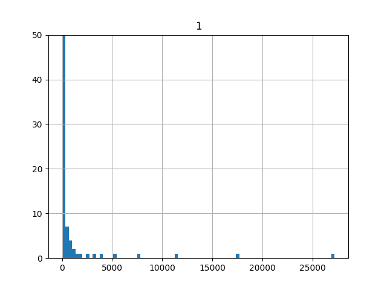
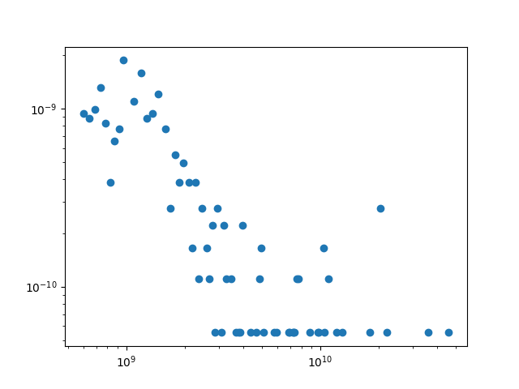
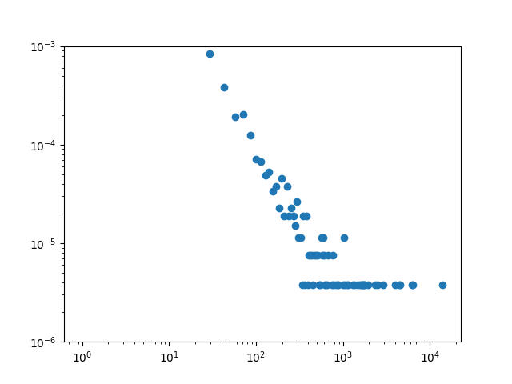
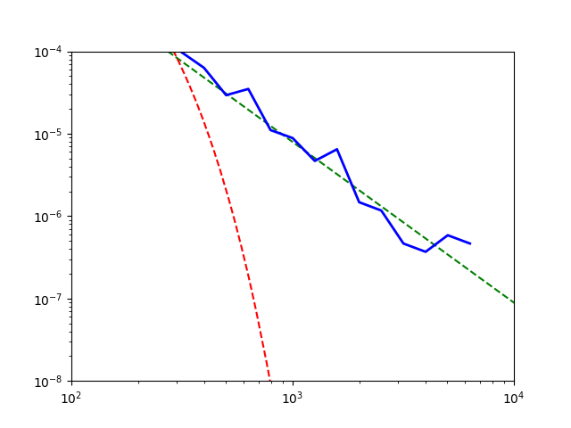

# Üstel Kanunlar (Power Laws)

Bir web sitesini bir ayda ziyaret etmiş olan özgün kullanıcı sayısı
üzerinden bir alarm programı yazmak gerekti diyelim. Eğer çok fazla
kullanıcı var ise bir admin'e bir email gönderilecek.. Akla gelen
çözümlerden aylık kullanıcı sayılarının ortalamasını alıp 2 ya da 3
standart sapma kadar olan cevapları aykırı değer (outlier) olarak kabul
etmek ve bu durumlarda alarm çalmak [1, sf. 255]. Çünkü, eh, veri
noktalarının yüzde 99.7'si 3 standart sapma içine düşer değil mi?

Burada gözardı edilen nokta şudur: verinin yüzde 99.7'si 3 standart sapma
içine düşer *eğer veri Gaussian olarak dağılmış ise*. Ayrıca ortalama
hesabı da problemli, burada ilk akla gelebilecek Merkezi Limit Teorisi
üzerinden örneklem ortalaması gerçek ortalamaya yaklaşacağı, ki bu çoğu
dağılım için doğrudur, fakat bazı dağılımlar üzerinde Merkezi Limit Teorisi
işlemez! Güç Kanunları ile istatistik biliminin sınırlarına geliyoruz -
gerçek dünyadan önümüze atılan veriler artık sıkça bir şekilde normal dışı
verileri içerebiliyor, ve bu durumlara hazır olmamız lazım.

Üstte bahsettiğimiz senaryo için aslında elimizde veri var (pek çok ay
için). Verinin histogramına bakalım,

```python
import pandas as pd
dfvis=pd.read_csv('visits.csv',header=None,sep='\t',index_col=0)
visits = np.array(dfvis[1])
```

```python
dfvis.hist(bins=80)
plt.ylim([0,50])
plt.savefig('stat_powerlaw_05.png')
```



Görüldüğü gibi bazı değerlerden aşırı çok var, bazılarından neredeyse yok.
Aşırı değerler her iki uçta da gözüküyor, büyük olanlardan daha az var,
evet, ama oradaki yoğunluk dikkate alınmaz seviyede de değil. Bu arada eğer
y eksenini ufaltmasaydık aşırı değerler haricinde kalan değerler üstteki
kadar bile gözükmeyecekti.

Olasılık yoğunluk fonksiyonu (probability density function),

$$ p(x) = C x^{-\alpha}  $$

$C$ bir normalizasyon sabiti, ki $\lambda > 0$ olmak üzere, dağılımın
parametresi. Bu dağılıma üstel kanun (power law) ismi verilir. Zıpf, ya
Pareto dağılımı üstteki formülün farklı şekilde temsilinden ibaret. 

Her özgün $\lambda$ farklı bir üstel kanuna işaret eder. Mesela $p(x) = C/
x^2$ bir ustel kanun olabilir! Bildigimiz $x^2$'yi baz alan bir dağılımdan
bahsediyoruz yani! $\alpha > 1$ olmalıdır, sebebini altta
göreceğiz. Doğadaki çoğu üstel kanun $2 < \alpha < 3$
arasındadır. Beklentiyi hesaplayalım,

$$ 
E[X] = \int_{x_{min}}^{\infty} x p(x) \mathrm{d} x  = 
C \int_{x_{min}}^{\infty} x ^{-\alpha + 1} \mathrm{d} x
$$

$$ = \frac{C}{2-\alpha} \bigg[ x ^{-\alpha+2}  \bigg]_{x_{min}}^{\infty} $$

Bu ifadenin $\alpha \le 2$ için sonsuza gittiğine dikkat edelim,
bahsettiğimiz gariplik burada... $x_{min}$'in ne olduğunu birazdan göreceğiz.

Log-Log Grafikleri

Üstel kanun dağılımlarının ilk kez histogram log-log skalasında
grafiklenince keşfedildiği düşünülmektedir, bir üstel kanun sürecinden
gelen veriyi anlamaya çalışırken hem $p(x)$ hem $x$'in log'u alınmıştır, ve
bu grafik negatif eğimli düz çizgi olarak ortaya çıkmıştır. Yani

$$ 
\ln p(x) = -\alpha \ln x + c 
\qquad (1)
$$

Üstteki yaklaşımla grafiği nasıl oluşturuz? Bunun için `hist`
çağrısından histogram grafiğini değil, histogramdaki kutucukların üç
noktalarını düz veri olarak almamız lazım, ki bu değerler $x$ değerlerimizi
oluşturacak, sonra onların normalize edilmiş değerlerini almamız gerekiyor
[4], bu değerler de $\ln p(x)$ olacak. Grafiklemeden önce elle log almamıza
gerek yok, grafik rutinine skalayı log bazında ayarlamasını söylememiz
yeterli, `xscale,yscale` çağrıları ile bunu yapabiliriz.

```python
def plot_power(data):
    hst = plt.hist(data, density=True,bins=1000)
    f=plt.figure() # histogram halinden cik
    x = hst[1][:-1]; y = hst[0]
    plt.plot(x, y,'o')
    plt.xscale('log')
    plt.yscale('log')
```

```python
plot_power(visits)
plt.title('Ziyaretler')
plt.ylim(1e-5,1e-3)
plt.savefig('stat_powerlaw_04.png')
```


Düz çizgiye benzer bir şekil ortaya çıktı, negatif eğimli, demek ki bir
üstel kanun mümkün.

Üstel kanunu yoğunluk formülüne nasıl erişiriz? Başlangıç önceden
gösterdiğimiz formül olmak üzere,

$$ \ln p(x) = -\alpha \ln x + c $$

Eger $\ln(c) = C$ dersek, 

$$ \ln p(x) = -\alpha \ln x + \ln C $$

$$  = \ln C x^{-\alpha}  $$

ve iki tarafı $e$ üzerine alırsak,

$$ p(x) = C x^{-\alpha}  $$

Olasılık yoğunluk fonksiyonuna eriştik. 

$x_{min}$ Hesabı

Dikkat edilirse $C x^{-\alpha}$ fonksiyonu $x \to 0$ iken sonsuza gidiyor
(diverge), demek ki her $x \ge 0$ için yoğunluk fonksiyonu geçerli
değildir. O zaman üstel kanunun geçerli olduğu bir alt sınır olmalı. Bu alt
sınıra $x_{min}$ diyeceğiz.

Artık normalizasyon sabiti $C$'yi hesaplayabiliriz, 

$$ \int_{x_{min}}^{\infty} C x^{-\alpha} = 1$$

$$ \frac{C}{(-\alpha+1) } \bigg[ x^{-\alpha+1} \bigg]_{x_{min}}^{\infty} = 1$$

$$ \frac{C}{(1-\alpha) } \bigg[ x^{-\alpha+1} \bigg]_{x_{min}}^{\infty} = 1$$

Görülebileceği üzere bu formül sadece $\alpha > 1$ için anlamlıdır, diğer
durumlarda sonsuzluğa gider. Demek ki üstel kanun dağılımı 
için $\alpha > 1$ şartını da getirmemiz gerekiyor. Devam edelim,

$$ \frac{C}{(-\alpha+1) }  x_{min}^{-\alpha+1} = 1$$

$$ C = (\alpha-1)x_{min}^{\alpha-1} $$

$C$ ile beraber ve bazı düzeltmeler ardından $p(x)$ bazen şöyle
gösteriliyor [5], 

$$ p(x) = \frac{\alpha-1}{x_{min}}\bigg( \frac{x}{x_{min}} \bigg)^{-\alpha}  $$

$\alpha,x_{min}$'i Kestirmek (Estimation)

(1) formülüne bakarak bazıları lineer regresyon kullanarak $x_{min}$ hesabı
yapabileceğini düşünüyor. Yani grafiğe bakılıyor, eh ortada lineer bir
durum var, regresyon ile eğim için bir tahmin elde ederim ve bu tahmini
$\alpha$ için kullanırım. 

```python
import statsmodels.formula.api as smf
hst = plt.hist(visits, density=True,bins=1000)
visitx = hst[1][:-1];visity = hst[0]
yy = np.log(visity);xx = np.log(visitx)
yy = yy[visity>0];xx = xx[visity>0]
df = pd.DataFrame([yy,xx]).T
df.columns = [['y','x']]
results = smf.ols('y ~ x', data=df).fit()
print ('alpha', -1 * results.params[1])
print ('kesi', np.exp(results.params[0]))
```

```text
alpha 0.5405514730706359
kesi 0.002415148444971534
```

Bu basit yöntemin, ne yazık ki, çok ciddi problemleri var. Bu metotun niye
kullanılmaması gerektiği [3, sf. 31]'de bulunabilir.

Alternatif yöntem şöyle; önce $\alpha$ için hızlı çalışan bir tahmin edici
mevcut, bunu görelim; Maksimum olurluk üzerinden,

$$ p(x;\alpha) = \prod_{i=1}^{n} \frac{\alpha-1}{x_{min}} \bigg( \frac{x_i}{x_{min}}\bigg)^{-\alpha}  $$

Maksimum log olurluk,

$$ \ln p(x;\alpha) = \ln \prod_{i=1}^{n} \frac{\alpha-1}{x_{min}} \bigg( \frac{x_i}{x_{min}}\bigg)^{-\alpha}  $$

$$ = \sum_{i=1}^{n} \ln \frac{\alpha-1}{x_{min}} \bigg( \frac{x_i}{x_{min}}\bigg)^{-\alpha}  $$

$$ = \sum_{i=1}^{n} \bigg[ \ln (\alpha-1) + \ln x_{min} - \alpha \ln \frac{x_i}{x_{min}} \bigg]   $$

$$ = n \ln (\alpha-1) + n \ln x_{min} - \alpha \sum_{i=1}^{n}  \ln \frac{x_i}{x_{min}}   $$

Maksimum değer için $\alpha$'ya göre türevi alıp sıfıra eşitleriz ve
çözeriz, $\ln(\alpha-1)$'in türevini hatırlayalım bu arada,

```python
import sympy
alpha = sympy.symbols('alpha')
print (sympy.diff(sympy.log(alpha-1)))
```

```text
1/(alpha - 1)
```

$$ =  \frac{n}{(\alpha - 1)} - \sum_{i=1}^{n}  \ln \frac{x_i}{x_{min}}  = 0 $$

$$  \frac{n}{(\alpha - 1)} = \sum_{i=1}^{n}  \ln \frac{x_i}{x_{min}}   $$

$$ \frac{(\alpha - 1)}{n} =  \bigg( \sum_{i=1}^{n}  \ln \frac{x_i}{x_{min}} \bigg)^{-1}  $$

$$ \hat{\alpha} =  1 + n  \bigg( \sum_{i=1}^{n}  \ln \frac{x_i}{x_{min}} \bigg)^{-1}   $$

Fakat tahmin edicinin hesabı için $x_{min}$'i bilmek gerekiyor. Bir
tavuk-yumurta problemi var, $\hat{\alpha}$ için $x_{min}$ gerekli, ama
$x_{min}$'in kendisi de bilinmiyor. 

O zaman üstteki tahmin ediciyi şöyle kullanırız; verideki her noktayı potansiyel
bir $x_{min}$'mis gibi alırız (ve bu nokta altındaki hiçbir noktayı dikkate
almayız, bu alt sınırı bunun için seçtik), ve bu nokta için yukarıdaki formül
ile $\hat{\alpha}$'yi hesaplarız, sonra elde ettiğimiz $x_{min}, \hat{\alpha}$
ikilisini kullanarak (artık özgün bir üstel kanun dağılımımız var), bu dağılım
ile veri arasındaki uyum derecesini Kolmogorov-Şmirnov testi ile
hesaplarız. Elimizdeki $n$ veri noktası için $n$ tane hesap elde ederiz, ve
raporlanan mesafeler arasından en ufak olanını seçeriz, ve bu mesafeye tekabül
eden $x_{min},\hat{\alpha}$ ikilisini optimal parametreler olarak seçeriz. Altta
örneği gösterilen `powerlaw`  adlı paket [6] tam da bunu yapıyor. Ziyaret
verisi üzerinde işletelim,

```python
import powerlaw
fitvis = powerlaw.Fit(visits, discrete=False)
print ('xmin', fitvis.xmin, 'alpha', fitvis.alpha)
```

```text
xmin 34.0 alpha 1.5706070612437522
```

Hesaplanan $\alpha$ değerinin lineer regresyondan gelen hesaptan ne kadar
farklı olduğuna dikkat! 

`powerlaw` paketine, biraz önce yaptığı tahminler üzerinden, üstel
(exponential) dağılımın mı, üstel kanun dağılımının mı (isimler birbirine
çok benziyor doğru) bu veri için daha olası olduğunu sorabiliriz, daha
doğrusu her iki dağılım için Kolmogorov-Şmirnov testini işletiriz,

```python
print (fitvis.exponential.KS())
print (fitvis.power_law.KS())
```

```text
0.4871516917125692
0.03126347917486605
```

Üstel kanun görüldüğü gibi daha olası (p-değer 0.05 altında). Bir olasılık
hesabını da elle yapalım,

```python
x0 = 1e2
p = x0**-fitvis.alpha
C = (fitvis.alpha-1) * fitvis.xmin**(fitvis.alpha-1)
print (p*C)
```

```text
0.003083157447941901
```

Bazı farklı veriler üzerinde aynı hesapları görelim. Mesela 2003
senesindeki en zengin 300 Amerikalının net varlıklarının dağılımı. 

```python
import powerlaw
dfwl=pd.read_csv('wealth.dat',header=None)
wealth=np.array(dfwl)[:,0]
fitwl = powerlaw.Fit(wealth, discrete=True)
print ('xmin', fitwl.xmin, 'alpha', fitwl.alpha)
print ('K-S testi', fitwl.power_law.KS())
```

```text
xmin 1100000000.0 alpha 2.4057530652382013
K-S testi 0.043280715107065104
```

```python
plot_power(wealth)
plt.savefig('stat_powerlaw_03.png')
```



Dikkat, çoğunlukla bu konularda araştırma yapanlar zengin, fakir herkesi
kapsayan bir ölçüm üzerinden (bu konulara ilk bakan Pareto öyle yapmıştı)
tüm kazancın üstel kanunu takip ettiğini söylerler, ki bu doğrudur. Üstteki
sonuç, bunun üstüne, en zengin 400 kişinin *kendi arasında* bile üstel
kanunun işlediğini söylemektedir. Yani zenginlik öyle dengesiz dağılan bir
şeydir ki, en zengin 400 içinde çoğunluk en tepedekilere göre daha
fakirdir!

Devam edelim: Herman Melville adlı yazarın ünlü *Moby Dick* romanındaki
özgün kelimelerin kullanılma frekansının dağılımı,

```python
import powerlaw

dfwords=pd.read_csv('words.txt',header=None)
words=np.array(dfwords)[:,0]
fitw = powerlaw.Fit(words, discrete=True)
```

```python
plot_power(words)
plt.ylim(1e-6,1e-3)
plt.savefig('stat_powerlaw_02.png')
```



Bu arada `powerlaw` paketinin bazı grafikleme özellikleri de
var. Veriyle beraber tahmin edilen $-\alpha$ (düz çizgi olarak), üstel
dağılım (kırmızı çizgi) ve üstel kanun uyumunu aynı grafikte gösterebiliriz.

```python
f = plt.figure()
fitw.power_law.plot_pdf(linestyle='--', color='g')
fitw.exponential.plot_pdf(linestyle='--', color='r')
fitw.plot_pdf(color='b', linewidth=2)
plt.xlim(1e2,1e4)
plt.ylim(1e-8,1e-4)
plt.savefig('stat_powerlaw_01.png')
```



```python
print ('Kolmogorov-Smirnov testi', fitw.power_law.KS())
```

```text
Kolmogorov-Smirnov testi 0.009228863880260563
```

Kodlar

[powerlaw.py](powerlaw.py)

Kaynaklar

[1] Janert, *Data Analysis with Open Source Tools*

[2] Shalizi, *Advanced Data Analysis from an Elementary Point of View*

[3] Causet, *Power-Law Distributions in Empirical Data*

[4] Bayramlı, 
    *Histogram Numaralari*, 
    [https://burakbayramli.github.io/dersblog/sk/2015/10/histogram-numaralari.html](https://burakbayramli.github.io/dersblog/sk/2015/10/histogram-numaralari.html)

[5] Newman, *Power laws, Pareto distributions and Zipf's law*

[6] Alstott, *powerlaw: A Python Package for Analysis of Heavy-Tailed Distributions*


