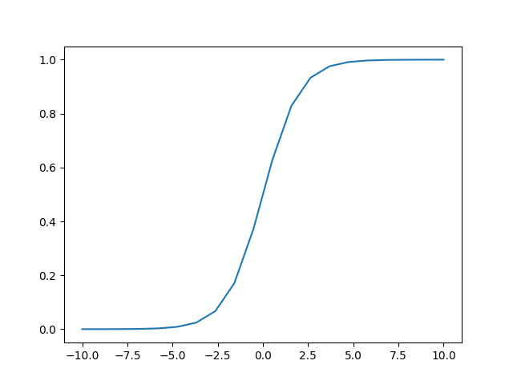
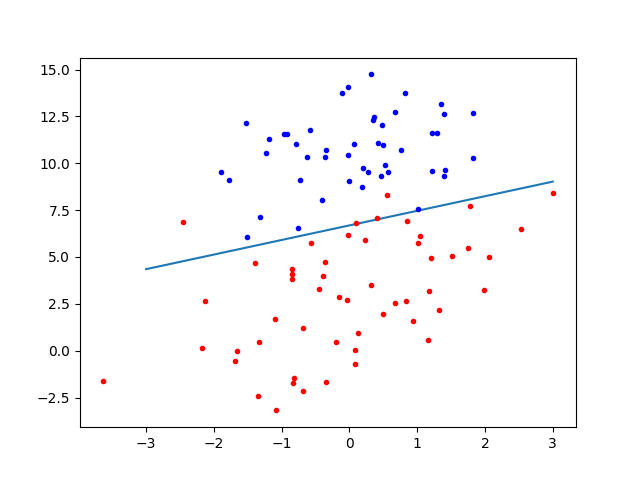
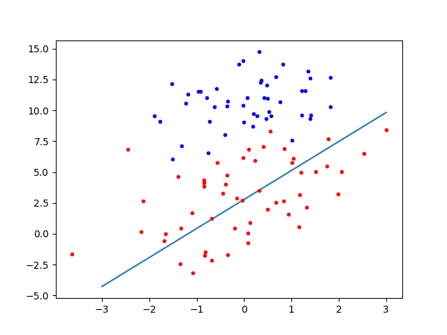
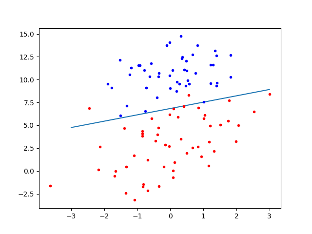
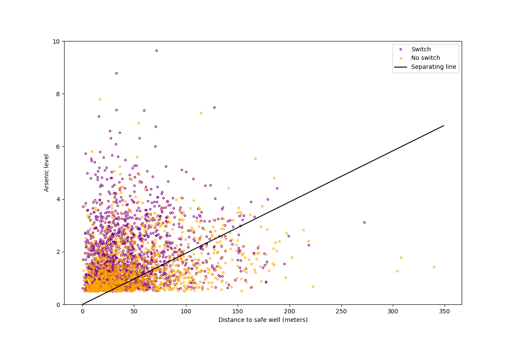
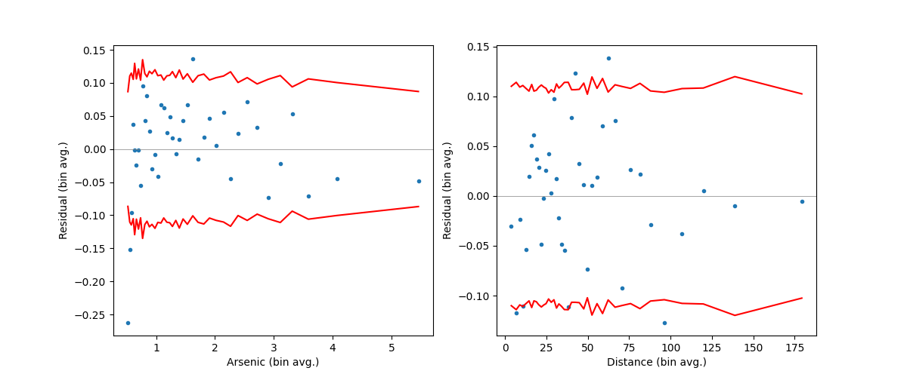
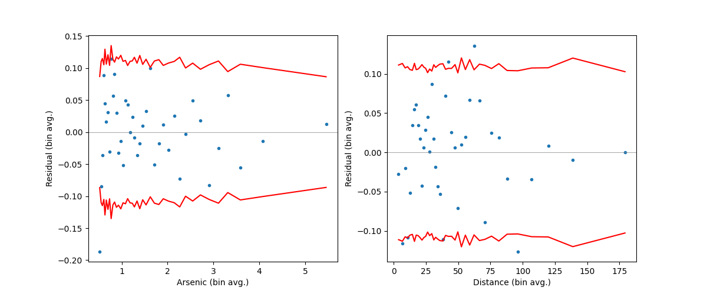
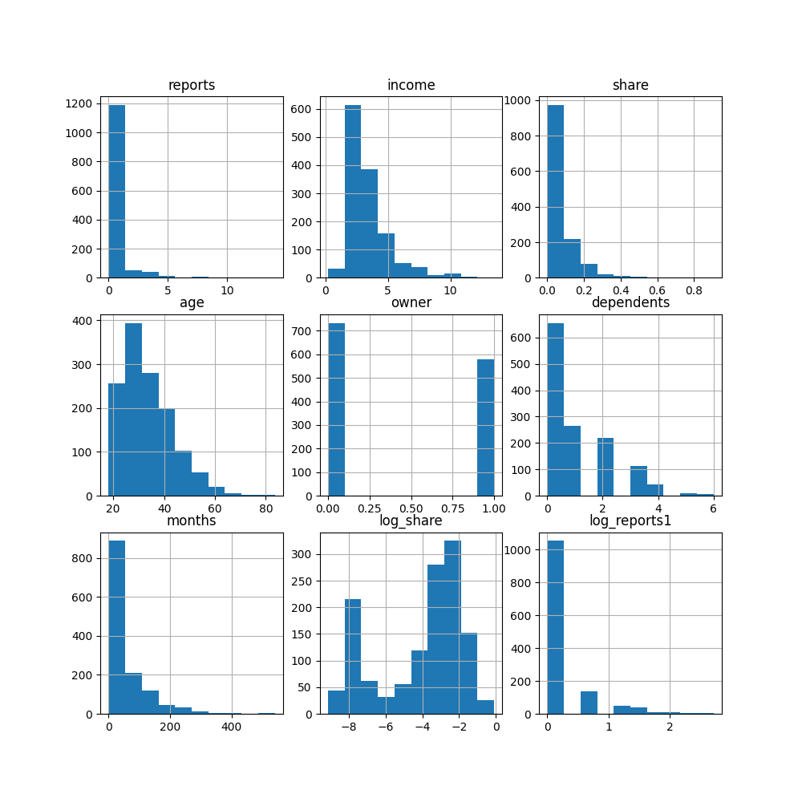

# Lojistik Regresyon (Logistic Regression)

Lojistik regresyon normal regresyonun $\theta^T x$ olarak kullandığı ağırlıklar
(katsayılar) ile verinin çarpımını alır ve ek bir filtre fonksiyonundan
geçirerek onları 0/1 değerleri bağlamında bir olasılığa eşler. Yani elimizdeki
veri çok boyutta veri noktaları ve o noktaların 0 ya da 1 olarak bir
"etiketi" olacaktır. Mesela

```python
from pandas import *
import random
df = read_csv("testSet.txt",sep='\t',names=['x','y','labels'],header=None)
df['intercept']=1.0
data = df[['intercept','x','y']]
labels = df['labels']
print (df[['x','y','labels']][:10])
```

```text
          x          y  labels
0 -0.017612  14.053064       0
1 -1.395634   4.662541       1
2 -0.752157   6.538620       0
3 -1.322371   7.152853       0
4  0.423363  11.054677       0
5  0.406704   7.067335       1
6  0.667394  12.741452       0
7 -2.460150   6.866805       1
8  0.569411   9.548755       0
9 -0.026632  10.427743       0
```

Görüldüğü gibi veride $x,y$ boyutları için etiketler (labels) verilmiş. Lojistik
regresyon bu veriyi kullanarak eğitim sonrası $\theta$'ları elde eder, bunlar
katsayılarımızdır, artık bu katsayıları hiç görmediğimiz yeni bir veri üzerinde
0/1 etiketlerinin tahminini yapmak için kullanabiliriz.

Filtre fonksiyonu için kullanılan bir fonksiyon sigmoid fonksiyonudur,
$g(x)$ ismini verelim,

$$ g(x) = \frac{e^{x}}{1+e^{x}} $$

Bu nasıl bir fonksiyondur, kabaca davranışını nasıl tarif ederiz?  Cebirsel
olarak bakarsak, fonksiyon öyle bir durumda ki ne zaman bir $x$ değeri geçersek,
bu değer ne kadar büyük olursa olsun, bölendeki değer her zaman bölünenden 1
daha fazla olacaktır bu da fonksiyonun sonucunun 1'den her zaman küçük olmasını
garantiler. Çok küçük $x$ değerleri için bölüm sonucu biraz daha büyük olacaktır
tabii, vs.

Daha temiz bir ifade için bölen ve bölüneni $e^{-x}$ ile çarpalım,

$$ g(x) = \frac{e^{x}e^{-x}}{e^{-x}+e^{x}e^{-x}} $$

$$ g(x) = \frac{1}{1+e^{-x}} $$

Sigmoid fonksiyonun "-sonsuzluk ile +sonsuzluk arasındaki değerleri 0 ve 1
arasına eşlediği / indirgediği (map)" ifadesi de litaratürde mevcuttur.

```python
def sigmoid(arr):
    return 1.0/(1+np.exp(-arr))

x = np.linspace(-10.0, 10.0, 20)
plt.plot(x,sigmoid(x))
plt.savefig('stat_logit_02.png')
```



Üstteki grafiğe bakınca katsayılarla çarpım, toplam ardından sonucun niye bu
fonksiyona verildiğini anlamak mümkün. Sigmoid'in 0 seviyesinden 1 seviyesine
zıplayısı oldukça hızlı ve $x$ kordinatı bağlamında (ve 0.5'ten küçük $y$'ye
eşlenen) sıfır öncesi bölgesi, aynı şekilde sıfır sonrası (ve 0.5'ten büyük
$y$'ye eşlenen) bölgesi oldukça büyük. Yani bu fonksiyonu seçmekle veriye
katsayılarla çarpılıp 0 ya da 1 bölgesi altına düşmesi için oldukça geniş bir
şans veriyoruz.  Böylece veriyi iki parçaya ayırmak için şansımızı arttırmış
oluyoruz.

Peki sigmoid fonksiyonu bir olasılık fonksiyonu (dağılımı) olarak kullanılabilir
mi?  Entegralini alalım, ve -/+ sonsuzluklar üzerinden alan hesabı yapalım,
sonucun 1 çıkması gerekli,

```python
import sympy
x = sympy.Symbol('x')
print (sympy.integrate('1/(1+exp(-x))'))
```

```text
x + log(1 + exp(-x))
```

Daha temizlemek için

$$ x + \ln(1 + e^{-x}) $$

$x$ ifadesi aynı zamanda suna eşittir $x=ln( e^{x} )$. Bu ifade bize
kolaylık sağlayacak böylece,

$$ \ln e^{x} + \ln(1+e^{-x})  $$

diyebiliriz. Doğal log'un (ln) çarpımları toplamlara dönüştürdüğünü biliyoruz,
bunu tersinden uygulayalım,

$$ \ln (e^{x}\cdot 1 + e^{x}e^{-x})  $$

$$ \ln (e^{x} + 1)  = \ln (1 + e^{x} )  $$

```python
print (np.log (1+np.exp(-np.inf)))
print (np.log(1+np.exp(np.inf)))
```

```text
0.0
inf
```

Demek ki fonksiyon bir olasılık dağılımı olamaz, çünkü eğri altındaki alan
sonsuz büyüklüğünde. Aslında bu fonksiyonun kümülatif dağılım fonksiyonu
(cumulative distribution function -CDF-) özellikleri vardır, yani kendisi değil
ama türevi bir olasılık fonksiyonu olarak kullanılabilir (bu konumuz
dışında). Her neyse, sigmoid'in bir CDF gibi hareket ettiğini $g$'nin 0 ile 1
arasında olmasından da anlıyoruz, sonuçta CDF alan demektir (yoğunluğun
entegrali) ve en üst değeri 1 demektir, ki bu CDF tanımına uygundur.

Şimdi elimizde olabilecek $k$ tane değişken ve bu değişkenlerin bilinmeyen
katsayıları için 0 ve 1'e eşlenecek bir regresyon oluşturalım. Diyelim ki
katsayılar $\theta_0,..,\theta_k$. Bu katsayıları değişkenler ile çarpıp
toplayarak $h(x)$'e verelim, (0/1) çıkıp çıkmayacağı katsayılara bağlı
olacak, verideki etiketler ile $h(x)$ sonucu arasında bir bağlantı
kurabilirsek, bu bize katsayıları verebilir. Bu modele göre eğer
$\theta$'yi ne kadar iyi seçersek, eldeki veri etiketlerine o kadar
yaklaşmış olacağız. Şimdi sigmoid'i katsayılarla beraber yazalım,

$$ h_\theta(x) = g(\theta^T x) = \frac{1}{1+e^{-\theta^T x}} $$

"Veriye olabildiğince yaklaşmak için en iyi $\alpha$'yi bulmak" sözü bize
maksimum olurluk (maximum likelihood) hesabını hatırlatmalı. Bu hesaba göre
içinde bilinmeyen $\alpha$'yi barındıran formülün üzerinden tüm verinin
sonuçlarının teker teker birbiri ile çarpımı olabildiğince büyük olmalıdır. Bu
ifadeyi maksimize edecek $\alpha$ veriye en uygun $\alpha$ olacaktır.

Şimdi her iki etiket için ve sigmoid'i kullanarak olasılık hesaplarını
yapalım,

$$ P(y=1 | x;\theta) = h_\theta(x) $$

$$ P(y=0 | x;\theta) = 1 - h_\theta(x) $$

Not: Olasılık değerleri (büyük $P(\cdot)$ ile) ve CDF fonksiyonları olurluk
hesabında kullanılabilir. $P(\cdot)$ ile CDF bağlantısı var, $P(X<x)$ gibi
kümülatif alansal hesapların CDF üzerinden gerçekleştirilebildiğini
hatırlayalım.

Devam edelim, hepsi bir arada olacak şekilde yanyana koyarsak ve sonuca, $y$'yi
doğru tahmin edip etmediğimizin ölçümünü de eklersek,

$$p(y | x;\theta) = (h_\theta(x))^y (1-h_\theta(x))^{1-y}$$

Olurluk için tüm veri noktalarını teker teker bu fonksiyona geçip sonuçlarını
çarpacağız (ve verilerin birinden bağımsız olarak üretildiğini farzediyoruz),
eğer $m$ tane veri noktası var ise

$$ L(\theta) = \prod_{i=1}^{m} (h_\theta(x^i))^{y^i}
(1-h_\theta(x^i))^{1-{y^i}}$$

Eğer log'unu alırsak çarpımlar toplama dönüşür, işimiz daha rahatlaşır,

$$ l(\theta) = \log L(\theta) $$

$$ = \sum_{i=1}^{m}
     y^i \log( (h_\theta(x^i)) ) +
     (1-{y^i}) \log( (1-h_\theta(x^i)) )
$$

İşte bu ifadenin maksimize edilmesi gerekiyor.

Ama daha fazla ilerlemeden önce bir eşitlik ve bir türev göstermemiz
gerekiyor.  Önce eşitlik

$$ 1-g(z) = g(-z) $$

İspat

$$ 1-\frac{1}{1+e^{-z}}  = \frac{1+e^{-z}-1}{1+e^{-z}}$$

$$ \frac{e^{-z}}{1+e^{-z}} = \frac{1}{1+e^{z}}$$

Hakikaten son eşitliğin sağ tarafına bakarsak, $g(-z)$'yi elde ettiğimizi
görüyoruz. Şimdi türeve gelelim,

$$
g'(z) = \frac{d}{dz} \frac{ 1}{1+ e^{ -z}} 
$$

Ispat

$$
= \frac{1}{(1+ e^{-z})^2} (e^{-z}) 
$$

$e^{ -z}$ türevinden bir eksi işareti geleceğini beklemiş olabiliriz, fakat
hatırlanacağı üzere

$$\frac{d}{dx} \frac{ 1}{1+x}  = \frac{-1}{(1+x)^2}$$

Yani eksiler birbirini yoketti. Şimdi iki üstteki denklemin sağ tarafını açalım

$$
 = \frac{1}{1+e^{-z}} \frac{e^{-z}}{1+e^{-z}}
$$

$$
 = \frac{1}{1+e^{-z}} \frac{1}{1+e^{z}}
$$

Çarpımda iki bölüm var, bölümler $g(z)$ ve $g(-z)$ olarak temsil edilebilir, ya
da $g(z)$ ve $1-g(z)$,

$$
 = g(z)(1-g(z))
$$

Bu bağlamda ilginç bir diğer denklem log şansı (log odds) denklemidir. Eğer ilk
baştaki denklemi düşünürsek,

$$ p = P(y=1|x;\theta) = g(z) = \frac{e^{z}}{1+e^{z}}  $$

Bu denklem 1 olma olasılığını hesaplıyor. Temiz bir denklem log şansı olabilir
ki bu denklem olma olasılığını olmama olasılığına böler ve log alır.

$$ \log \bigg( \frac{p}{1-p} \bigg)$$

olarak gösterilir. Şimdi biraz daha cambazlık, $1 - g(z) = g(-z)$ demiştik, ve
$g(-z)$'nin de ne olduğunu biliyoruz $\frac{1}{1+e^{z}}$, log şansını bu şekilde
yazalım, $\frac{1}{1+e^{z}}$ ile bölelim daha doğrusu $1+e^{z}$ ile çarpalım ve
log alalım,

$$ 
\log \bigg( \frac{e^{z}}{1+e^{z}} (1+e^{z})  \bigg) 
= \log(e^{z}) 
= z = \theta^Tx
$$

Artık olurluk denklemine dönebiliriz. Olurluğu nasıl maksimize ederiz?  Gradyan
çıkışı (gradient ascent) kullanılabilir. Eğer olurluk $l(\theta)$'nin en
maksimal olduğu noktadaki $\theta$'yi bulmak istiyorsak (dikkat sadece olurluğun
en maksimal noktasını aramıyoruz, o noktadaki $\theta$'yi arıyoruz), o zaman bir
$\theta$ ile başlarız, ve adım adım $\theta$'yi maksimal olana doğru
yaklaştırırız. Formül

$$ \theta_{yeni} = \theta_{eski} + \alpha \nabla_\theta l(\theta)$$

Üstteki formül niye işler? Çünkü gradyan $\nabla_\theta l(\theta)$, yani
$l(\theta)$'nin gradyanı her zaman fonksiyon artışının en fazla olduğu yönü
gösterir. Demek ki o yöne adım atmak, yani $l(\theta)$'a verilen $\theta$'yi o
yönde değiştirmek (değişim tabii ki $\theta$ bazında, $\theta$'nin değişimi),
bizi fonksiyonun bir sonraki noktasına yaklaştıracaktır. Sabit $\alpha$ bir tek
sayı sadece, atılan adımın (hangi yönde olursa olsun) ölçeğini azaltıp /
arttırabilmek için dışarıdan eklenir. Adım yönü vektör, bu sabit bir tek
sayı. Çarpımları vektörü azaltır ya da çoğaltır.

Not: Bu şekilde azar azar sonuca yaklaşmaya uğraşmak tabii ki her fonksiyon için
geçerli değildir, çünkü eğer fonksiyonda "yerel maksimumlar" var ise, gradyan
çıkışı bu noktalarda takılıp kalabilir (o yerel tepelerde de birinci türev
sıfırlanır, gradyanın kafası karışır). Gradyan metotunun kullanmadan önce
fonksiyonumuzun tek (global) bir maksimumu olup olmadığını düşünmemiz
gerekir. Fakat şanlıyız ki olurluk fonksiyonu tam da böyle bir fonksiyondur
(şans değil tabii, bu özelliği sebebiyle seçildi). Fonksiyon içbükeydir
(concave), yani tek bir tepe noktası vardır. Bir soru daha: olurluğun içbükey
olduğunu nasıl anladık?  Fonksiyona bakarak pat diye bunu söylemek mümkün,
değişkenlerde polinom bağlamında küpsel ve daha üstü seviyesinde üstellik yok,
ayrıca $\log$, $\exp$ içbükeyliği bozmuyor.

Simdi $\nabla_\theta l(\theta)$ turetmemiz gerekiyor.

Eğer tek bir $\frac{\partial l(\theta)}{\partial \theta_j}$'yi hesaplarsak ve
bunu her $j$ için yaparsak, bu sonuçları bir vektörde üstüste koyunca
$\nabla_\theta l(\theta)$'yi elde ederiz.

$$ 
\frac{\partial l(\theta)}{\partial \theta_j} =
y \frac{\frac{\partial }{\partial \theta_j}g(\theta^Tx) }{g(\theta^Tx)}  -
(1-y) \frac{\frac{\partial }{\partial \theta_j}g(\theta^Tx) }{1-g(\theta^Tx)} 
$$

$$ 
= \big(
y  \frac{1}{g(\theta^Tx)}  -
(1-y) 
\frac{1}{1-g(\theta^Tx)} 
\big)
\frac{\partial }{\partial \theta_j}g(\theta^Tx)
$$

Şimdi en sağdaki kısmı açalım,

$$ 
\frac{\partial }{\partial \theta_j}g(\theta^Tx) 
= g'(\theta^Tx) \frac{\partial }{\partial \theta_j} \theta^Tx 
= g'(\theta^Tx) x_j 
$$

$\frac{\partial }{\partial \theta_j} \theta^Tx$ nasıl $x_j$ haline geldi?  Çünkü
tüm $\theta$ vektörünün kısmi türevini alıyoruz fakat o kısmi türev sadece tek
bir $\theta_j$ için, o zaman vektördeki diğer tüm öğeler sıfır olacaktır, sadece
$\theta_j$ 1 olacak, ona tekabül eden $x$ öğesi, yani $x_j$ ayakta kalabilecek,
diğer $x$ öğelerinin hepsi sıfırla çarpılmış olacak.

Türevin kendisinden de kurtulabiliriz şimdi, daha önce gösterdiğimiz eşitliği
devreye sokalım,

$$ 
= g(\theta^Tx)(1-g(\theta^Tx)) x_j 
$$

Bu son formülü 3 üstteki formülün sağ tarafına geri koyarsak, ve
basitleştirirsek,

$$
\big(
y(1-g(\theta^Tx)) - (1-y)g(\theta^T x)
\big) x_j
$$

Çarpımı daha temiz görmek için sadece $y,g$ harflerini kullanırsak,

$$
\big(y(1-g) - (1-y)g \big) x_j =
(y - yg - g + yg)x_j = (y - g)x_j
$$

yani

$$
= (y - g(\theta^Tx))x_j
$$

$$
= (y - h_\theta(x))x_j
$$

İşte $\nabla_\theta l(\theta)$ için ne kullanacağımızı bulduk. O zaman

$$ \theta_{yeni} = \theta_{eski} + \alpha (y - h_\theta(x))x_j $$

Her $i$ veri noktası için

$$ \theta_{yeni} = \theta_{eski} + \alpha (y^{i} - h_\theta(x^{i}))x^{i}_j $$

Kodu işletelim,

```python
def grad_ascent(data_mat, label_mat):
    m,n = data_mat.shape
    label_mat=label_mat.reshape((m,1))
    alpha = 0.001
    iter = 500
    theta = np.ones((n,1))
    for k in range(iter):   
        h = sigmoid(np.dot(data_mat,theta))
        error = label_mat - h
        theta = theta + alpha * np.dot(data_mat.T,error) 
    return theta

theta = np.array(grad_ascent(np.array(data),np.array(labels).T ))
print (theta.T)
```

```text
[[ 4.12414349  0.48007329 -0.6168482 ]]
```

```python
def plot_theta(theta):
     x = np.linspace(-3.0, 3.0, 60)
     y = np.array((-theta[0]-theta[1]*x)/theta[2])
     plt.plot(x, y)
     class0 = data[labels==0]
     class1 = data[labels==1]
     plt.plot(class0['x'],class0['y'],'b.')
     plt.plot(class1['x'],class1['y'],'r.')

plot_theta(theta)
plt.savefig('stat_logit_03.png')
```



Üstteki kod bir döngü içinde belli bir $x$ noktasından başlayarak gradyan inişi
yaptı ve optimal $\theta$ değerlerini, yani regresyon ağırlıklarını (weights)
hesapladı. Sonra bu ağırlıkları bir ayraç olarak üstte grafikledi.  Ayracın
oldukça iyi değerler bulduğu belli oluyor.

Rasgele Gradyan Çıkışı (Stochastic Gradient Ascent)

Acaba $\theta$'yi güncellerken daha az veri kullanmak mümkün mü? Yani yön hesabı
için sürekli tüm veriyi kullanmasak olmaz mı?

Olabilir. Güncellemeyi sadece tek bir veri noktası kullanarak yapabiliriz. Yine
gradyanı değiştirmiş oluruz, sadece azar azar değişim olur, fakat belki de bu
şekilde sonuca daha çabuk ulaşmak mümkün olacaktır.

Kodlama açısından, $\theta$ güncellemesi için bulduğumuz formülü tek nokta
bazında da vermiştik.  O zaman o tek noktayı sırayla alıp güncellersek, otomatik
olarak yeni bir şekilde gradyan çıkışı yapmış oluruz.

```python
def stoc_grad_ascent0(data_mat, label_mat):
    m,n = data_mat.shape
    label_mat=label_mat.reshape((m,1))
    alpha = 0.01
    theta = np.ones((n,1))
    for i in range(m):
        h = sigmoid(sum(np.dot(data_mat[i],theta)))
        error = label_mat[i] - h
        theta = theta + alpha * data_mat[i].reshape((n,1)) * error
        theta = theta.reshape((n,1))
    return theta

theta = np.array(stoc_grad_ascent0(np.array(data),np.array(labels).T ))
print (theta.T)
```

```text
[[ 1.01702007  0.85914348 -0.36579921]]
```

```python
plot_theta(theta)
plt.savefig('stat_logit_04.png')
```



Neredeyse işimiz tamamlandı. Üstteki grafik pek iyi bir ayraç göstermedi.  Niye?
Problem çok fazla salınım (oscillation) var, yani değerler çok fazla uç noktalar
arasında gidip geliyor. Ayrıca veri noktalarını sırayla işliyoruz, veri tabii ki
rasgele bir şekilde sıralanmış olabilir, ama sıralanmamışsa, o zaman algoritmaya
raslantısal noktaları vermek için kod içinde zar atmamız lazım. Metotun ismi
"rasgele (stochastic)" gradyan çıkışı, bu rasgelelik önemli. 2. problemi
düzeltmek için yapılacak belli, 1. problem için $\alpha$ değeri her döngüde
belli oranda küçültülerek (yani $\alpha$ artık sabit değil) sonuca yaklaşırken
oradan buraya savrulmasını engellemiş olacağız. Yeni kod altta,

```python
def stoc_grad_ascent1(data_mat, label_mat):
    m,n = data_mat.shape
    iter = 150
    label_mat=label_mat.reshape((m,1))
    alpha = 0.01
    theta = np.ones((n,1))
    for j in range(iter):
        data_index = range(m)
        for i in range(m):
            alpha = 4/(1.0+j+i)+0.0001  
            rand_index = int(random.uniform(0,len(data_index)))
            h = sigmoid(sum(np.dot(data_mat[rand_index],theta)))
            error = label_mat[rand_index] - h
            theta = theta + alpha * data_mat[rand_index].reshape((n,1)) * error
            theta = theta.reshape((n,1))
    return theta

theta = np.array(stoc_grad_ascent1(np.array(data),np.array(labels).T ))
print (theta.T)
```

```text
[[14.17364891  1.43777759 -2.07314246]]
```

```python
plot_theta(theta)
plt.savefig('stat_logit_05.png')
```



Sonuç çok iyi, ayrıca daha az işlemle bu noktaya eriştik, yani daha az işlem ve
daha hızlı bir şekilde sonuca ulaşmış olduk.

Tahmin (Prediction)

Elde edilen ağırlıkları tahmin için nasıl kullanırız? Bu ağırlıkları alıp, yeni
veri noktası ile çarpıp sonuçları sigmoid'den geçirdiğimiz zaman bu noktanın "1
etiketi olma olasılığını" hesaplamış olacağız. Örnek (diyelim ki mevcut veri
noktası içinden bir veriyi, -mesela 15. nokta- sanki yeniymiş gibi seçtik)

```python
pt = df.loc[15,['intercept','x','y']]
print (sigmoid(np.dot(np.array(pt), theta)), )
print ('label =',labels[15])
```

```text
[0.99999506]
label = 1
```

Oldukça yüksek bir olasılık çıktı, ve hakikaten de o noktanın gerçek değeri 1
imiş.

Logit

İstatistik kaynaklarında genellikle "logit'' adlı bir regresyon türünden
bahsedildiğini görebilirsiniz, burada aslında lojistik regresyondan
bahsediliyor, ki bu konuyu [10] yazısında bulabiliriz. Ama istatistik
literatüründe (yapay öğrenim literatüründen farklı olarak), terminoloji
biraz kafa karıştırıcı olabiliyor. Lojistik regresyon yazısında odağımız
sigmoid fonksiyonuydu, peki logit nereden geliyor?  Logit,

$$ logit(x) = \log ( x/(1-x) ) $$

fonksiyonudur, ve bu fonksiyon (0,1) arasındaki bir sayıyı $-\infty,\infty$
arasına eşler (map). Fonksiyona verilen $x$ bir olasılık, ve bu olasılık, bir
olayın (event) olma / olmama *oranlarının* $\log$'una dönüşüyor. Ki bu
fonksiyona "log ihtimali (log odds)'' ismi de veriliyor. Hatırlamanın kolay bir
yolu belki de logit, "bir şeyi logla'' çağrışımı yapıyor, sonra "neyi
logluyoruz?'' diye düşünürüz, cevap bir olasılığı, daha detaylı olarak olma /
olmama oranını.

```python
def logit(p): return np.log(p/(1-p))
p = 0.1; print (logit(p))
p = 0.5; print (logit(p))
p = 0.7; print (logit(p))
p = 0.99999; print (logit(p))
```

```text
-2.197224577336219
0.0
0.8472978603872034
11.51291546492478
```

Sigmoid bunun tam tersidir, $-\infty,\infty$ arasındaki bir değeri (0,1) arasına
eşler, ki lojistik regresyon katsayılarından bir olasılık üretmek istiyorsak,
sigmoid lazım. Bu ters gidişi ispatlamak kolay, ki bu "ters yönde'' harekete
$logit^{-1}$ ismi de veriliyor, ters yöne doğru gidelim,

$$ 
\qquad (1)
logit(p) = \log ( \frac{p}{1-p} ) = x
$$

$$ 
\Rightarrow  \frac{p}{1-p} = \exp(x) 
\Rightarrow \frac{1}{e^x} = \frac{1}{p}-1
$$

$$ 
\Rightarrow \frac{1}{e^x} + 1 = \frac{1}{p}
\Rightarrow \frac{1+e^x}{e^x} =  \frac{1}{p}
\Rightarrow p = \frac{e^x}{1+e^x}
$$


Lojistik regresyon modeli 

$$ Pr(y_i=1) = logit^{-1}(X_i\beta) $$

ki her $X_i$ bir vektördür, veri noktalarımız $X_i,y_i$ olarak eşli olarak
gelir. Diyelim ki elimizde 1992'de ABD seçimlerinde oy vermiş insanların gelir
seviyesi (income) ve kime oy (vote) verdikleri var. Bush'a verilmiş oyu 1
verilmemişi 0 olarak işaretlersek, bu problemi lojistik regresyon problemine
çevirebiliriz,

```python
import pandas as pd
df = pd.read_csv('nes.dat',sep=r'\s+')
df = df[['presvote','year','female','income','black']]
df = df[df['presvote'] < 3] # sadece 2 partinin oylarini al
df = df.dropna()
# 1,2 oylari 1,0 yap, Cumhuriyetciye verildi mi evet/hayir 
# haline getir
df['presvote2'] = df['presvote'].map(lambda x: x-1) 
df = df.drop('presvote',axis=1)
df2 = df[df['year'] == 1992]
print (df2[:4])
```

```text
       year  female  income  black  presvote2
32093  1992     1.0     4.0    0.0        1.0
32094  1992     1.0     2.0    0.0        1.0
32096  1992     1.0     1.0    1.0        0.0
32097  1992     0.0     2.0    0.0        1.0
```

```python
import statsmodels.api as sm
import statsmodels.formula.api as smf
mdlm = smf.logit("presvote2 ~ income", df2)
mdlmf = mdlm.fit()
print(mdlmf.summary())
```

```text
Optimization terminated successfully.
         Current function value: 0.661553
         Iterations 5
                           Logit Regression Results                           
==============================================================================
Dep. Variable:              presvote2   No. Observations:                 1207
Model:                          Logit   Df Residuals:                     1205
Method:                           MLE   Df Model:                            1
Date:                Thu, 17 Jul 2025   Pseudo R-squ.:                 0.02134
Time:                        10:29:51   Log-Likelihood:                -798.49
converged:                       True   LL-Null:                       -815.91
Covariance Type:            nonrobust   LLR p-value:                 3.598e-09
==============================================================================
                 coef    std err          z      P>|z|      [0.025      0.975]
------------------------------------------------------------------------------
Intercept     -1.3863      0.187     -7.400      0.000      -1.754      -1.019
income         0.3245      0.056      5.775      0.000       0.214       0.435
==============================================================================
```

En basit haliyle bu denklem, 

$$ 
\qquad (2)
Pr(y_i=1) = logit^{-1}(\alpha + \beta x)  $$

Üstteki katsayı değerlerini baz alarak, 

$$ Pr(y_i = 1) = logit^{-1}(-1.38 + 0.32 \cdot income) $$

Katsayıları irdelemenin iyi bir yolu şudur. Logit tersinden kurtulmak
istiyorsak, (1)'e deki formülü (2)'ye uygularız, iki tarafın logit'ini alırız,
sağ taraftaki ters logit kaybolur,

$$ \log \bigg( \frac{Pr(y=1)}{Pr(y=0)} \bigg) = \alpha + \beta x$$

Bu formülün sağ tarafına göre, $x$'e 1 eklemek demek, $\beta (1+x) = \beta x +
\beta \cdot 1 = \beta x + \beta$, formüle bir bakıma $\beta$ eklemek
demektir. Bunu bir tarafa koyalım, şimdi üstteki formülün iki tarafının
$\exp$'sini alalım,

$$ \frac{Pr(y=1)}{Pr(y=0)} = \exp(\alpha + \beta x)$$

Şimdi $\exp$ içindeki $x$'e 1 eklersek, $\exp(\alpha + \beta x + \beta)$ olur,
bu da $\exp(\alpha)\exp(\beta x ) \exp (\beta)$ demektir, o zaman iki tarafı da
dengelemek için her iki tarafı da $\exp(\beta)$ ile çarpmak lazım,

$$ 
\frac{Pr(y=1)}{Pr(y=0)}\exp(\beta) = \exp(\alpha + \beta x + \beta) = 
\exp(\alpha)\exp(\beta x ) \exp (\beta)
$$

O zaman, $x$'deki bir birimlik değişimin, olma / olmama oranı olan ihtimal
(odds) üzerindeki etkisini hesaplamak istiyorsak, incelediğimiz değişkenin
katsayısını alıp mesela $\beta = 0.3$, onun $\exp$'sini hesaplarız, $\exp(0.32)
= 1.37$, ve bu değerin üstteki eşitliğin sol tarafını da çarpacağı bilgisinden
hareketle, ihtimalin o kadar artacak olduğunu rapor edebiliriz. Yani $\beta =
0.3$ için bu artış 1.37 katıdır. Yani gelirde 1 birimlik bir artış (ki gelir
veride 1,2,3,4 gibi sayısal aralıklar olarak gösterilmiş) Bush'a oy verme
şansının 1.37 kat arttırıyor. Bu aslında mantıklı, ABD'de Cumhuriyetçiler
"zenginlerin partisi'' olarak biliniyor.

İhtimal oranları (odds ratio) ile düşünmek için bazı örnekler, ihtimal oranı 1,
olasılıkların 0.5 olması demektir, yani her iki ihtimal de eşit
ağırlıktadır. İhtimal oranı 0.5, ya da 2.0 (1/3,2/3) olasılıklarına tekabül
eder, formülü hatırlayalım, $p / (1-p)$.

Katsayıları İrdelemek

Eğer bir katsayı değerinin sıfırdan uzaklığı Std. Hatanın (Error) iki katından
fazla ise katsayı istatistiki olarak anlamlı / değerli (significant) demektir ve
kullanılabilir. Tabii burada biraz daha ek irdeleme gerekebilir; mesela
kişilerin arabalarının beygir gücünü kazandıkları maaşa bağlayan bir regresyon,
beygir gücü katsayısı için beygir başına 10 Eur ve std. hata 2 Eur vermişse bu
istatistiki olarak önemli, ama pratikte önemsizdir. Benzer şekilde eğer beygir
katsayısı için 10,000 Eur ve std. hata 10,000 Eur bulmuşsak, bu istatistiki
olarak önemsiz, ama pratikte önemlidir.

İlginç Durum

Siyahi oyların bazı yıllara göre analizini yapalım,

```python
print ('coefs','error')

df2 = df[df['year'] == 1960]
mdlm = smf.logit("presvote2 ~ female + black + income", df2)
mdlmf = mdlm.fit()
print (np.vstack((mdlmf.params.index, mdlmf.params,mdlmf.bse)).T)

df2 = df[df['year'] == 1964]
mdlm = smf.logit("presvote2 ~ female + black + income", df2)
mdlmf = mdlm.fit()
print (np.vstack((mdlmf.params.index, mdlmf.params,mdlmf.bse)).T)

df2 = df[df['year'] == 1968]
mdlm = smf.logit("presvote2 ~ female + black + income", df2)
mdlmf = mdlm.fit()
print (np.vstack((mdlmf.params.index, mdlmf.params,mdlmf.bse)).T)
```

```text
coefs error
Optimization terminated successfully.
         Current function value: 0.685646
         Iterations 5
[['Intercept' -0.15937090803207044 0.2252597627422937]
 ['female' 0.23863850517270663 0.13657755697125967]
 ['black' -1.0585625868981527 0.3621668012097301]
 ['income' 0.031222756966141935 0.06237925936066139]]
Warning: Maximum number of iterations has been exceeded.
         Current function value: 0.590399
         Iterations: 35
[['Intercept' -1.1551333142403983 0.21592167898447617]
 ['female' -0.07918311120690243 0.1361066805886843]
 ['black' -26.628693255659098 93069.8895373862]
 ['income' 0.19010331602066227 0.05839253555236447]]
Optimization terminated successfully.
         Current function value: 0.626797
         Iterations 7
[['Intercept' 0.47889431087596207 0.2442742155695298]
 ['female' -0.03135633331713915 0.148129301961935]
 ['black' -3.6417024852622455 0.5946042228547077]
 ['income' -0.0261377785152334 0.06740777911367574]]
```

1964 yılında siyahi (black) seçmenlerin oylarına ne oldu? Üstteki analizde
katsayı müthiş alçak (büyük negatif değer), ve standard hata çok büyük. Eğer o
sene için veriye bakarsak neler olduğunu anlıyoruz; elimizdeki anket verisindeki
kişilerden siyahi olan kimse 1964 yılında Cumhuriyetçilere oy vermemiş. Bu
durumda katsayı tabii ki büyük negatif değer (çünkü regresyon hedefimiz
Cumhuriyetçilere oy verilip verilmeyeceği), siyahi olmak ile Cumhuriyetçilere oy
vermek arasında negatif bir korelasyon ortaya çıkmış oluyor. Büyük standart hata
iyi durmuyor tabii, ama bunun sebebi özyineli (iteratif) model uyduran (fitting)
algoritmanın bir nüansıdır. Daha ufak bir değer elde etmek için [3]'de görülen
numaralar yapılabilir, fakat pratikte bu büyük değeri görünce analizi yapan kişi
veriye bakacak, ve neler olduğunu anlayacaktır.

Bangladeş'te su kuyusu değişiminin lojistik modeli

Verimizde 3,000 haneye gidilerek anketle toplanmış veri var. Veride hanelerin
yakınlarındaki kuyudaki arsenik seviyesi toplanmış, ve paylaşılan verideki tüm
hanelerin kuyular sağlıksız seviyede arsenik içeriyor. Verideki diğer bilgiler
en yakındaki "sağlıklı" bir kuyuya yakınlık, ve o hanenin bu sağlıklı su
kuyusuna (bir sene sonra yapılan kontrole göre) geçip geçmediği.  Ayrıca hanede
fikri sorulan kişinin eğitim seviyesi ve bu hanedeki kişilerin herhangi bir
sosyal topluluğa (community assocation) ait olup olmadıkları.

Amacımız su kuyusunun değişimini modellemek. Bu eylem olup / olmama bağlamında
evet / hayır şeklinde bir değişken olduğu için ikili (binary) olarak temsil
edilebilir ve ikili cevaplar / sonuçlar lojistik regresyon ile
modellenebilirler.

Veriye bakalım.

```python
from pandas import *
from statsmodels.formula.api import logit
df = read_csv('wells.dat', sep = ' ', header = 0, index_col = 0)
print (df.head())
```

```text
   switch  arsenic       dist  assoc  educ
1       1     2.36  16.826000      0     0
2       1     0.71  47.321999      0     0
3       0     2.07  20.966999      0    10
4       1     1.15  21.486000      0    12
5       1     1.10  40.874001      1    14
```

Model 1: Güvenli su kuyusuna uzaklık

İlk önce modelde kuyu uzaklığını kullanalım. 

```python
model1 = logit("switch ~ dist", df).fit()
print (model1.summary())
```

```text
Optimization terminated successfully.
         Current function value: 0.674874
         Iterations 4
                           Logit Regression Results                           
==============================================================================
Dep. Variable:                 switch   No. Observations:                 3020
Model:                          Logit   Df Residuals:                     3018
Method:                           MLE   Df Model:                            1
Date:                Thu, 17 Jul 2025   Pseudo R-squ.:                 0.01017
Time:                        10:30:19   Log-Likelihood:                -2038.1
converged:                       True   LL-Null:                       -2059.0
Covariance Type:            nonrobust   LLR p-value:                 9.798e-11
==============================================================================
                 coef    std err          z      P>|z|      [0.025      0.975]
------------------------------------------------------------------------------
Intercept      0.6060      0.060     10.047      0.000       0.488       0.724
dist          -0.0062      0.001     -6.383      0.000      -0.008      -0.004
==============================================================================
```

Uzaklık (dist) için elde edilen katsayı -0.0062, fakat bu sayı kafa karıştırıcı
olabilir çünkü uzaklık metre olarak ölçülür, o zaman bu katsayı mesela 90 metre
ile 91 metre uzaklığın değişime olan etkisini ölçmektedir, kısacası pek faydalı
değildir. Yani uzaklık metre ile ölçüldüğü için 1 metrenin modeldeki etkisi
ufak, o yüzden bu ölçütü ölçeklersek (scale) belki regresyon katsayılarımız daha
net çıkar.

Bunu nasıl yapacağız?  Ölçeklenmiş yeni bir değişken yaratmak yerine, onu
formülün içinde tanımlayabiliriz.  Burada bir ara not: eğer formül içinde +,-
gibi operasyonları aritmetik işlem olarak kullanmak istiyorsak, o zaman 'I()'
çağrısını yapmak lazım, çünkü + operasyonu mesela statsmodels formüllerinde
başka amaçlar için kullanılıyor. 'I' harfi birim (identity) kelimesinden
geliyor, yani hiçbir şeyin değişmediğini anlatmaya uğraşıyoruz, "içinde ne varsa
onu ver" diyoruz .

```python
model1 = logit('switch ~I(dist/100.)', df).fit()
print (model1.summary())
```

```text
Optimization terminated successfully.
         Current function value: 0.674874
         Iterations 4
                           Logit Regression Results                           
==============================================================================
Dep. Variable:                 switch   No. Observations:                 3020
Model:                          Logit   Df Residuals:                     3018
Method:                           MLE   Df Model:                            1
Date:                Thu, 17 Jul 2025   Pseudo R-squ.:                 0.01017
Time:                        10:30:29   Log-Likelihood:                -2038.1
converged:                       True   LL-Null:                       -2059.0
Covariance Type:            nonrobust   LLR p-value:                 9.798e-11
==================================================================================
                     coef    std err          z      P>|z|      [0.025      0.975]
----------------------------------------------------------------------------------
Intercept          0.6060      0.060     10.047      0.000       0.488       0.724
I(dist / 100.)    -0.6219      0.097     -6.383      0.000      -0.813      -0.431
==================================================================================
```

Şimdi modelimizi grafikleyelim. Yanlız değişim (switch) verisini suni olarak
kaydırmamız / seğirtmemiz (jitter) gerekiyor, çünkü değişim 0 ve 1'den başka bir
şey olamaz ve grafik sürekli aynı iki bölgeye nokta basıp duracak.

```python
def binary_jitter(x, jitter_amount = .05):
    '''
    0/1 vektoru iceren veriye segirtme ekle
    '''
    jitters = np.random.rand(*x.shape) * jitter_amount
    x_jittered = x + np.where(x == 1, -1, 1) * jitters
    return x_jittered

plt.plot(df['dist'], binary_jitter(df['switch'], .1), '.', alpha = .1)
plt.plot(np.sort(df['dist']), model1.predict()[np.argsort(df['dist'])], lw = 2)
plt.ylabel('Switched Wells')
plt.xlabel('Distance from safe well (meters)')
plt.savefig('stat_logit_06.png')
```


Mavi noktalar gerçek veri, yeşil çizgi ise uzaklık geçilerek modelin oluşturduğu
"tahmin". Modelin gerçek veriye ne kadar uyduğunu görüyoruz böylece, yeşil
çizginin yüksek olasılık verdiği bölgelerde üst kısmın daha mavi olmasını
bekleriz mesela. Üstteki resimde aşağı yukarı bunu gösteriyor.

Bir problemin grafiklemesine başka bir yönden yaklaşalım, kuyu değiştirenlerin
değişim uzaklığının yoğunluğu, bir de kuyu değiştirmeyenlerin değişim
uzaklığının yoğunluğu. Değişimi yapanların dağılımına bakınca, kısa mesafelerde
daha fazla yoğunluk görmeyi bekliyoruz, değiştirmeyenlerin ise uzun mesafelerde
daha fazla yoğunluğu olur herhalde.

Yoğunluğu göstermek için çekirdek yoğunluk hesabı (kernel density estimation)
tekniğini kullanıyoruz. Bu teknik her veri noktasına Gaussian, kutu (box), ya da
diğer türden bir "çekirdek" fonksiyonunu koyar (ve veriyi o fonksiyona geçer,
sonucu kaydeder), ve bu iş bitince tüm çekirdekler üst üste toplanarak genel
dağılım ortaya çıkartılır. Teknik histogram tekniğiyle aynı işi yapmaya uğraşır,
bir anlamda verinin dağılımını daha pürüzsüz (smooth) hale getirir.

Bu teknik istatistikte oldukça yeni bir teknik sayılır, kullanılması için
bilgisayar hesabı gerekiyor (kıyasla histogram elle de yapılabilir), yeni
hesapsal tekniklerde olan ilerlemelerin veri analizine getirdiği bir yenilik
yani!

[KDE bölümü atlandı]

Model 2: Güvenli kuyuya olan uzaklık ve kendi kuyusunun arsenik seviyesi

Şimdi arsenik seviyesini modelimize ekleyelim. Bekleriz ki kuyusunda yüksek
arsenik miktarı olan kimselerin kuyu değiştirmesi daha çok beklenen bir şeydir.

```python
model2 = logit('switch ~ I(dist / 100.) + arsenic', df).fit()
print (model2.summary())
```

```text
Optimization terminated successfully.
         Current function value: 0.650773
         Iterations 5
                           Logit Regression Results                           
==============================================================================
Dep. Variable:                 switch   No. Observations:                 3020
Model:                          Logit   Df Residuals:                     3017
Method:                           MLE   Df Model:                            2
Date:                Thu, 17 Jul 2025   Pseudo R-squ.:                 0.04551
Time:                        10:30:45   Log-Likelihood:                -1965.3
converged:                       True   LL-Null:                       -2059.0
Covariance Type:            nonrobust   LLR p-value:                 1.995e-41
==================================================================================
                     coef    std err          z      P>|z|      [0.025      0.975]
----------------------------------------------------------------------------------
Intercept          0.0027      0.079      0.035      0.972      -0.153       0.158
I(dist / 100.)    -0.8966      0.104     -8.593      0.000      -1.101      -0.692
arsenic            0.4608      0.041     11.134      0.000       0.380       0.542
==================================================================================
```

Ki katsayılar da aynen bunu gösteriyor. Güvenli kuyuya olan uzaklık büyüdükçe
değişime negatif etki yapıyor ama kendi kuyusundaki arsenik seviyesinin artması
değişimde pozitif etki yapıyor.

Kısmi (marginal) etkiler

Tüm bu değişkenlerin değişim olasılığı üzerindeki etkilerini görmek için verinin
ortalama noktasında bir kısmi olasılık hesabı yapalım.

```python
print (model2.get_margeff(at = 'mean').summary())
```

```text
        Logit Marginal Effects       
=====================================
Dep. Variable:                 switch
Method:                          dydx
At:                              mean
==================================================================================
                    dy/dx    std err          z      P>|z|      [0.025      0.975]
----------------------------------------------------------------------------------
I(dist / 100.)    -0.2181      0.025     -8.598      0.000      -0.268      -0.168
arsenic            0.1121      0.010     11.217      0.000       0.092       0.132
==================================================================================
```

Bu sonuca göre, ankette soru sorulan ortalama kişi için en yakın kuyuya olan
uzaklıkta 100 metrelik bir değişim olasılığında \%22 düşüş anlamına
gelmektedir. Fakat kendi kuyusundaki arsenikte 1 seviyesinde bir artış değişim
olasılığını \%11 oranında arttırmaktadır.

Sınıfların ayırılabilirliği

Bu modelin kuyu değiştirenler ile değiştirmeyenleri ne kadar iyi
sınıflayabildiğini anlamak için her sınıftaki kişiyi uzaklık-arsenik uzayında
grafikleyebiliriz.

Biz pek bir iyi bir ayırım göremedik, o sebeple modelin oldukça yüksek bir hata
oranının olmasını bekliyoruz. Fakat başka bir şey farkediyoruz, grafiğin "kısa
mesafe-yüksek arsenik" bölgesinde çoğunlukla değişimciler var, ve "uzun
mesafe-düşük arsenik" bölgesinde çoğunlukla değiştirmeyenler var.

```python
logit_pars = model2.params
intercept = -logit_pars[0] / logit_pars[2]
slope = -logit_pars[1] / logit_pars[2]

dist_sw = df['dist'][df['switch'] == 1]
dist_nosw = df['dist'][df['switch'] == 0]
arsenic_sw = df['arsenic'][df['switch'] == 1]
arsenic_nosw = df['arsenic'][df['switch'] == 0]
plt.figure(figsize = (12, 8))
plt.plot(dist_sw, arsenic_sw, '.', mec = 'purple', mfc = 'None', 
         label = 'Switch')
plt.plot(dist_nosw, arsenic_nosw, '.', mec = 'orange', mfc = 'None', 
         label = 'No switch')
plt.plot(np.arange(0, 350, 1), intercept + slope * np.arange(0, 350, 1) / 100.,
         '-k', label = 'Separating line')
plt.ylim(0, 10)
plt.xlabel('Distance to safe well (meters)')
plt.ylabel('Arsenic level')
plt.legend(loc = 'best')
plt.savefig('stat_logit_07.png')
```



Model 3: Etkileşim eklemek

Arsenik seviyesi ve uzaklık değişkenlerinin modele ayrı ayrı yaptığı etkiler
yanında, beraber olarak ta bazı etkiler yapacağını düşünebiliriz.  100 metrelik
mesafenin değişim kararına olan etkisi kuyunuzdaki arsenik seviyesiyle
bağlantılı olabilmesi.. İnsanların böyle düşünmesini bekleyebiliriz, yani, bu
problem bağlamında, tipik kişi durup ta "önce arsenik yokmuş gibi düşüneyim,
sadece mesafeye bakayım", sonra "şimdi arseniği düşüneyim, mesafe yokmuş gibi
yapayım", ve bunlardan sonra "şimdi bu iki ayrı kararı üst üste koyayım"
şeklinde düşünmez.

Statsmodels'de formül arayüzü ile modele etkileşim eklemenin yolu değişkenler
arasında `:` operatörünü kullanmak ile olur.

```python
model3 = logit('switch ~ I(dist / 100.) + arsenic + I(dist / 100.):arsenic', df).fit()
print (model3.summary())
```

```text
Optimization terminated successfully.
         Current function value: 0.650270
         Iterations 5
                           Logit Regression Results                           
==============================================================================
Dep. Variable:                 switch   No. Observations:                 3020
Model:                          Logit   Df Residuals:                     3016
Method:                           MLE   Df Model:                            3
Date:                Thu, 17 Jul 2025   Pseudo R-squ.:                 0.04625
Time:                        10:31:07   Log-Likelihood:                -1963.8
converged:                       True   LL-Null:                       -2059.0
Covariance Type:            nonrobust   LLR p-value:                 4.830e-41
==========================================================================================
                             coef    std err          z      P>|z|      [0.025      0.975]
------------------------------------------------------------------------------------------
Intercept                 -0.1479      0.118     -1.258      0.208      -0.378       0.083
I(dist / 100.)            -0.5772      0.209     -2.759      0.006      -0.987      -0.167
arsenic                    0.5560      0.069      8.021      0.000       0.420       0.692
I(dist / 100.):arsenic    -0.1789      0.102     -1.748      0.080      -0.379       0.022
==========================================================================================
```

Sonuca göre etkileşimin katsayısı negatif ve istatistiki olarak anlamlı
(significant). Bu katsayının değişim üzerindeki etkisini nicesel olarak hemen
bakar bakmaz anlayamıyor olsak bile, niteliksel olarak etkisi sezgilerimiz ile
uyuşuyor. Uzaklık değişimde negatif etkili, ama bu negatif etki yüksek arsenik
seviyesi devreye girince azalıyor.  Diğer yandan arsenik seviyesinin değişimde
pozitif etkisi var, ama o etki en yakın kuyu mesafesi arttıkça azalıyor.

Model 4: Eğitim seviyesi ve ek bazı etkileşimler, ve değişkenleri ortalamak

Eğitim seviyesi kişilerin arseniğin kötü etkilerini anlamasında pozitif etki
yapması beklenir, ve bu sebeple eğitim seviyesi değişim kararına pozitif etki
yapmalıdır. Elimizdeki veride eğitim yıl bazında kayıtlanmış, biz bu veri
noktasını ölçekleyeceğiz (aynen uzaklığa yaptımız gibi, çünkü eğitimde 1 senelik
değişimin pek bir anlamı yok), bunu için 4'e böleceğiz. Ayrıca bu yeni
değişkenin diğer değişkenler ile etkileşimini devreye sokacağız.

Ek olarak tüm değişkenleri ortalayacağız ki böylece onları yorumlamamız
rahatlaşacak. Bir kez daha bu işi tamamen statsmodels sayesinde formül içinde
halledeceğiz, dışarıdan on hesap yapıp formüle geçmemiz gerekmeyecek.

```python
model_form = ('switch ~ center(I(dist / 100.)) + center(arsenic) + ' +
              'center(I(educ / 4.)) + ' +
              'center(I(dist / 100.)) : center(arsenic) + ' + 
              'center(I(dist / 100.)) : center(I(educ / 4.)) + ' + 
              'center(arsenic) : center(I(educ / 4.))'
             )
model4 = logit(model_form, df).fit()
print (model4.summary())
```

```text
Optimization terminated successfully.
         Current function value: 0.644328
         Iterations 5
                           Logit Regression Results                           
==============================================================================
Dep. Variable:                 switch   No. Observations:                 3020
Model:                          Logit   Df Residuals:                     3013
Method:                           MLE   Df Model:                            6
Date:                Thu, 17 Jul 2025   Pseudo R-squ.:                 0.05497
Time:                        10:31:20   Log-Likelihood:                -1945.9
converged:                       True   LL-Null:                       -2059.0
Covariance Type:            nonrobust   LLR p-value:                 4.588e-46
===============================================================================================================
                                                  coef    std err          z      P>|z|      [0.025      0.975]
---------------------------------------------------------------------------------------------------------------
Intercept                                       0.3563      0.040      8.844      0.000       0.277       0.435
center(I(dist / 100.))                         -0.9029      0.107     -8.414      0.000      -1.113      -0.693
center(arsenic)                                 0.4950      0.043     11.497      0.000       0.411       0.579
center(I(educ / 4.))                            0.1850      0.039      4.720      0.000       0.108       0.262
center(I(dist / 100.)):center(arsenic)         -0.1177      0.104     -1.137      0.256      -0.321       0.085
center(I(dist / 100.)):center(I(educ / 4.))     0.3227      0.107      3.026      0.002       0.114       0.532
center(arsenic):center(I(educ / 4.))            0.0722      0.044      1.647      0.100      -0.014       0.158
===============================================================================================================
```

Modelin başarısını irdelemek: Kutulanmış Kalıntı grafikleri (Binned Residual plots)

Model kalıntısının (yani model ile gerçek veri arasındaki hatalar -residual-)
ile ayrı ayrı her değişken ile grafikleri, uzaklık-kalıntı, arsenik-kalıntı
gibi, bizi modelde gayrı lineerlik olup olmadığı hakkında uyarabilir. Çünkü
kalıntının Gaussian bir dağılımda olmasını bekleriz, model hatası tam anlamıyla
bir "gürültü" halinde olmalıdır, ki doğada gürültünün tanımı Gaussian dağılımına
sahip olmaktır. Eğer bu grafikte kabaca her yere eşit şekilde dağılmış bir
görüntü görmüyorsak, o zaman modelimizde yakalayamadığımız bir gayrı lineerlik
(nonlinearity) vardır, ya da, birbirinden farklı olan kalıntı grafikleri
kalıntıları dağılımlarının birbirinden farklı olduğunun işaretidir
(heteroskedaştıcıty).

İkili bir modelde kalıntıları ham şekilde grafiklemenin pek anlamı yoktur, o
sebeple biraz pürüzsüzleştirme uygulayacağız. Altta değişkenler için
oluşturduğumuz kutucuklar (bins) içine kalıntıların ortalamasını koyacağız ve
bunları grafikleyeceğiz (lowess ya da hareketli ortalama -moving average-
tekniği de burada ise yarayabilirdi).

```python
def bin_residuals(resid, var, bins):
    '''
    Compute average residuals within bins of a variable.
    
    Returns a dataframe indexed by the bins, with the bin midpoint,
    the residual average within the bin, and the confidence interval 
    bounds.
    '''
    resid_df = DataFrame({'var': var, 'resid': resid})
    resid_df['bins'] = qcut(var, bins)
    bin_group = resid_df.groupby('bins')
    bin_df = bin_group[['var', 'resid']].mean()
    bin_df['count'] = bin_group['resid'].count()
    bin_df['lower_ci'] = -2 * (bin_group['resid'].std() / 
                               np.sqrt(bin_group['resid'].count()))
    bin_df['upper_ci'] =  2 * (bin_group['resid'].std() / 
                               np.sqrt(bin_df['count']))
    bin_df = bin_df.sort_values('var')
    return(bin_df)

def plot_binned_residuals(bin_df):
    '''
    Plotted binned residual averages and confidence intervals.
    '''
    plt.plot(bin_df['var'], bin_df['resid'], '.')
    plt.plot(bin_df['var'], bin_df['lower_ci'], '-r')
    plt.plot(bin_df['var'], bin_df['upper_ci'], '-r')
    plt.axhline(0, color = 'gray', lw = .5)
    
arsenic_resids = bin_residuals(model4.resid_generalized, df['arsenic'], 40)
dist_resids = bin_residuals(model4.resid_generalized, df['dist'], 40)
plt.figure(figsize = (12, 5))
plt.subplot(121)
plt.ylabel('Residual (bin avg.)')
plt.xlabel('Arsenic (bin avg.)')
plot_binned_residuals(arsenic_resids)
plt.subplot(122)
plot_binned_residuals(dist_resids)
plt.ylabel('Residual (bin avg.)')
plt.xlabel('Distance (bin avg.)')
plt.savefig('stat_logit_08.png')
```



Üstteki kutulama sırasında kullanılan `qcut` işlemlerin
için en altta ek bölümüne bakın

Model 5: arseniği log ölçeklemek

Kutulanmış artık grafiklerine bakınca arsenik değişkeninde biraz gayrı lineerlik
görüyoruz, çünkü noktaların dağılımı çok fazla belli bir bölgede. Dikkat edelim,
model nasıl düşük arseniği gerçekte olduğundan daha fazla olacağını tahmin etmiş
(overestimate), ayrıca yüksek arseniği gerçekte olduğundan daha az olacağını
tahmin etmiş (underestimate). Bu bize arsenik değişkeni üzerinde belki de log
transformasyonu gibi bir şeyler yapmamızın gerektiğinin işareti.

Bu değişimi de direk formül içinde yapabiliriz.

```python
model_form = ('switch ~ center(I(dist / 100.)) + center(np.log(arsenic)) + ' +
              'center(I(educ / 4.)) + ' +
              'center(I(dist / 100.)) : center(np.log(arsenic)) + ' + 
              'center(I(dist / 100.)) : center(I(educ / 4.)) + ' + 
              'center(np.log(arsenic)) : center(I(educ / 4.))'
             )

model5 = logit(model_form, df).fit()
print (model5.summary())
```

```text
Optimization terminated successfully.
         Current function value: 0.639587
         Iterations 5
                           Logit Regression Results                           
==============================================================================
Dep. Variable:                 switch   No. Observations:                 3020
Model:                          Logit   Df Residuals:                     3013
Method:                           MLE   Df Model:                            6
Date:                Thu, 17 Jul 2025   Pseudo R-squ.:                 0.06192
Time:                        10:31:40   Log-Likelihood:                -1931.6
converged:                       True   LL-Null:                       -2059.0
Covariance Type:            nonrobust   LLR p-value:                 3.517e-52
==================================================================================================================
                                                     coef    std err          z      P>|z|      [0.025      0.975]
------------------------------------------------------------------------------------------------------------------
Intercept                                          0.3452      0.040      8.528      0.000       0.266       0.425
center(I(dist / 100.))                            -0.9796      0.111     -8.809      0.000      -1.197      -0.762
center(np.log(arsenic))                            0.9036      0.070     12.999      0.000       0.767       1.040
center(I(educ / 4.))                               0.1785      0.039      4.577      0.000       0.102       0.255
center(I(dist / 100.)):center(np.log(arsenic))    -0.1567      0.185     -0.846      0.397      -0.520       0.206
center(I(dist / 100.)):center(I(educ / 4.))        0.3384      0.108      3.141      0.002       0.127       0.550
center(np.log(arsenic)):center(I(educ / 4.))       0.0601      0.070      0.855      0.393      -0.078       0.198
==================================================================================================================
```

Şimdi arsenik için kutulanmış kalıntı grafikleri daha iyi gözüküyor.

```python
arsenic_resids = bin_residuals(model5.resid_generalized, df['arsenic'], 40)
dist_resids = bin_residuals(model5.resid_generalized, df['dist'], 40)
plt.figure(figsize = (12, 5))
plt.subplot(121)
plot_binned_residuals(arsenic_resids)
plt.ylabel('Residual (bin avg.)')
plt.xlabel('Arsenic (bin avg.)')
plt.subplot(122)
plot_binned_residuals(dist_resids)
plt.ylabel('Residual (bin avg.)')
plt.xlabel('Distance (bin avg.)')
plt.savefig('stat_logit_09.png')
```



Model hata oranları

`pred_table()` çağrısı bize bu modelin "kafa karışıklığı matrisini
(confusion matrix)" veriyor. Bu matrisi kullanarak modelimizin hata oranını
hesaplayabiliriz.

Not: Kafa karışıklığı matrisi sınıflandırma hatalarını verir, ve her türlü hata
kombinasyonunu içerir, mesela iki sınıf için, gerçekte 0 ama 1 tahmin hataları,
gerçekte 1 ama 0 hataları vs. Bu matrisin satırlar gerçek veri, kolonları
tahminleri içerir. Tabii ki köşegendeki sayılar doğru tahmin oranlarıdır.

Sonra bu sonucu, en fazla verilen cevabı herkesin cevabıymış gibi farzeden daha
basit bir "sıfır (null) modelinin" hata oranı ile karşılaştırmalıyız. Mesela
burada kişilerin \%58'i kuyu değiştirmiş, bu durumda sıfır modeli "herkes kuyu
değiştiriyor" diye modeller, ve bu basit modelin hata payı 42\% olur. Bizim
model bu modelden daha iyi bir sonuç verecek midir? Sonuç altta.

```python
print (model5.pred_table())
print ('Model Error rate: {0: 3.0%}'.format(
    1 - np.diag(model5.pred_table()).sum() / model5.pred_table().sum()))
print ('Null Error Rate: {0: 3.0%}'.format(
    1 - df['switch'].mean()))
```

```text
[[ 568.  715.]
 [ 387. 1350.]]
Model Error rate:  36%
Null Error Rate:  42%
```

Ek: qcut

Yukarıdaki `qcut` kullanımını özetlemek gerekirse; arsenik değişkeni için
mesela dağılım bölgeleri (n-tile) üzerinden bir atama yapacağız, önce DataFrame
yaratalım,

```python
resid_df = DataFrame({'var': df['arsenic'], 'resid': model4.df_resid})
print (resid_df[:10])
```

```text
     var   resid
1   2.36  3013.0
2   0.71  3013.0
3   2.07  3013.0
4   1.15  3013.0
5   1.10  3013.0
6   3.90  3013.0
7   2.97  3013.0
8   3.24  3013.0
9   3.28  3013.0
10  2.52  3013.0
```

Şimdi 40 tane dağılım bölgesi yaratalım

```python
print (qcut(df['arsenic'], 40))
```

```text
1       (2.327, 2.47]
2        (0.68, 0.71]
3       (1.953, 2.07]
4         (1.1, 1.15]
5        (1.051, 1.1]
            ...      
3016    (0.509, 0.53]
3017     (1.051, 1.1]
3018    (0.509, 0.53]
3019     (0.62, 0.64]
3020     (0.64, 0.68]
Name: arsenic, Length: 3020, dtype: category
Categories (40, interval[float64, right]):
[(0.509, 0.53] < (0.53, 0.56] < (0.56, 0.59] <
(0.59, 0.62] ... (3.21, 3.42] < (3.42, 3.79] <
(3.79, 4.475] < (4.475, 9.65]]
```

Görüldüğü gibi bölgeler bir obje aslında ve içinde levels diye bir değişkeni
var. Ayrıca labels diye bir değişken de var,

```python
print (qcut(df['arsenic'], 40).index)
```

```text
Index([   1,    2,    3,    4,    5,    6,    7,    8,    9,   10,
       ...
       3011, 3012, 3013, 3014, 3015, 3016, 3017, 3018, 3019, 3020],
      dtype='int64', length=3020)
```

ki bu değişken içinde hangi noktanın hangi olasılık bölgesine ait olduğunun
ataması var. Mesela 2. nokta 6. bölgeye aitmiş, bu bölge hangisi?

```python
print (qcut(df['arsenic'], 40)[6])
```

```text
(3.79, 4.475]
```

Şimdi şöyle bir atama yaparsak, yani qcut sonucunu direk olduğu gibi
`resid_df` içine atarsak, `qcut` içindeki `levels`,
`resid_df`  üzerindeki index (sıra) ile uyumlandırılacaktır, ve her var
için doğru olan `qcut` sonucu atanmış olacaktır!

```python
resid_df['bins'] = qcut(df['arsenic'], 40)
print (resid_df[:10])
```

```text
     var   resid           bins
1   2.36  3013.0  (2.327, 2.47]
2   0.71  3013.0   (0.68, 0.71]
3   2.07  3013.0  (1.953, 2.07]
4   1.15  3013.0    (1.1, 1.15]
5   1.10  3013.0   (1.051, 1.1]
6   3.90  3013.0  (3.79, 4.475]
7   2.97  3013.0   (2.81, 2.98]
8   3.24  3013.0   (3.21, 3.42]
9   3.28  3013.0   (3.21, 3.42]
10  2.52  3013.0   (2.47, 2.61]
```

Üstte hakikaten bakıyoruz ki 2. nokta var=`0.71` doğru aralık olan
`(0.68, 0.71]` ile eşleşmiş.

Kredi Kart Analizi ve Lojistik Regresyon

Kredi Kart başvurularının kabul edilip edilmediğinin kayıtları üzerinde
başvurunun kabul edilip edilmeyeceğini tahmin etmek için bir model
kullanabiliriz. Örnek [1, sf. 390]'dan alındı. Veri

`card` = Başvuru kabul edilmiş mi? 

`reports` = Kişi hakkında kötü bir olay rapor edilmiş mi?

`income` = Yıllık gelir, birim \$10000

`age` = Yaş

`owner` = Kişi kendi evinin sahibi mi?

`dependents` = Bakılan / bağımlı kaç kişi var (çocuk, yaşlı kişi, vs)

`months` = Mevcut adreste kaç aydır yaşanıyor

`share` = Aylık kredi kart harcamalarının yıllık kazanca olan oranı

`selfemp` = Kişi kendi işinin sahibi mi?

`majorcards` = Büyük kredi kart şirketlerinden kaç tane kartı var

`active` = Kaç tane aktif kredi kart hesabı var

`expenditure` = Aylık kredi kartı harcaması

Tahmin edeceğimiz ilk değişken `card` olacak, ki bu değişken evet/hayır
bazında; ona bağlı olarak modellenecek değişkenler geri kalanları, bu
değişkenlerin kredi kart kabulünde ne kadar etkili olacağını analiz edeceğiz.

Biraz veri önişlemesi yapalım; 1'den küçük bazı yaş verileri var, onları silelim
ve değişkenlerin histogramını basalım.

```python
import pandas as pd
df = pd.read_csv('CreditCard.csv',index_col=0)

# etiketi 1/0 degerine cevir
df['card'] = (df['card']=='yes').astype(int)
df['owner'] = (df['owner']=='yes').astype(int)

# 1'den kucuk yaslari sil
df = df[df['age'] > 1]
df['log_reports1'] = np.log(df['reports']+1)
df['log_share'] = np.log(df['share'])
```

```python
fig, axes = plt.subplots(3, 3, figsize=(10, 10))

col='reports';ax=axes[0,0];ax.set_title(col)
df[col].hist(ax=ax)
col='income';ax=axes[0,1];ax.set_title(col)
df[col].hist(ax=ax)
col='share';ax=axes[0,2];ax.set_title(col)
df[col].hist(ax=ax)

col='age';ax=axes[1,0];ax.set_title(col)
df[col].hist(ax=ax)
col='owner';ax=axes[1,1];ax.set_title(col)
df[col].hist(ax=ax)
col='dependents';ax=axes[1,2];ax.set_title(col)
df[col].hist(ax=ax)

col='months';ax=axes[2,0];ax.set_title(col)
df[col].hist(ax=ax)
col='log_share';ax=axes[2,1];ax.set_title(col)
df[col].hist(ax=ax)
col='log_reports1';ax=axes[2,2];ax.set_title(col)
df[col].hist(ax=ax)

plt.savefig('stat_logit_01.png')
```



Görüldüğü gibi `share` sola doğru çok yamuk (highly skewed) duruyor, bu
değişkenin bu sebeple log'unu aldık. Değişken `reports` aynı durumda,
ayrıca bu değişkenin çoğu değeri 0 ya da 1, ama maksimum değeri 14. Bu sebeple
`log(reports+1)` kullandık ki 0'in logunu almak zorunda olmayalım, ki zaten
bu tanımsızdır. Bu transformasyonu yapıyoruz çünkü belli noktalarda aşırı yoğun
olan değişkenler (ki yamukluklarının sebebi bu) çok yüksek katsayı değerlerinin
çıkmasını tetikleyebiliyor, bu yüzden transformasyon ile onları biraz daha
yaymaya uğraşıyoruz. Alttaki regresyon transformasyon yapılmış hali, onun
altında yapılmamış hali de var.

```python
import statsmodels.formula.api as smf
import statsmodels.api as sm
model = "card ~ log_reports1 + income + log_share + age + " + \
        "owner + dependents + months "
model=smf.glm(model, data=df, family=sm.families.Binomial()).fit()
print(model.summary())
print ('BIC', model.bic)
print ('AIC', model.aic)
```

```text
                 Generalized Linear Model Regression Results                  
==============================================================================
Dep. Variable:                   card   No. Observations:                 1312
Model:                            GLM   Df Residuals:                     1304
Model Family:                Binomial   Df Model:                            7
Link Function:                  Logit   Scale:                          1.0000
Method:                          IRLS   Log-Likelihood:                -69.895
Date:                Thu, 17 Jul 2025   Deviance:                       139.79
Time:                        10:33:03   Pearson chi2:                     247.
No. Iterations:                    11   Pseudo R-squ. (CS):             0.6169
Covariance Type:            nonrobust                                         
================================================================================
                   coef    std err          z      P>|z|      [0.025      0.975]
--------------------------------------------------------------------------------
Intercept       21.4739      3.674      5.844      0.000      14.272      28.675
log_reports1    -2.9086      1.098     -2.650      0.008      -5.060      -0.757
income           0.9033      0.190      4.760      0.000       0.531       1.275
log_share        3.4230      0.530      6.452      0.000       2.383       4.463
age              0.0227      0.022      1.036      0.300      -0.020       0.066
owner            0.7052      0.533      1.323      0.186      -0.340       1.750
dependents      -0.6649      0.267     -2.487      0.013      -1.189      -0.141
months          -0.0057      0.004     -1.435      0.151      -0.014       0.002
================================================================================
BIC -9222.026620568784
AIC 155.79097166447676
```

Değişken `reports` ve `share` transforme edilmemiş hali,

```python
import statsmodels.formula.api as smf

reg2 = "card ~ reports + income + share + age + " + \
       "owner + dependents + months "
model2=smf.glm(reg2, data=df, family=sm.families.Binomial()).fit()
print(model2.summary())
print ('BIC', model2.bic)
print ('AIC', model2.aic)
```

```text
                 Generalized Linear Model Regression Results                  
==============================================================================
Dep. Variable:                   card   No. Observations:                 1312
Model:                            GLM   Df Residuals:                     1304
Model Family:                Binomial   Df Model:                            7
Link Function:                  Logit   Scale:                          1.0000
Method:                          IRLS   Log-Likelihood:                -71.440
Date:                Thu, 17 Jul 2025   Deviance:                       142.88
Time:                        10:33:12   Pearson chi2:                     229.
No. Iterations:                    16   Pseudo R-squ. (CS):             0.6160
Covariance Type:            nonrobust                                         
==============================================================================
                 coef    std err          z      P>|z|      [0.025      0.975]
------------------------------------------------------------------------------
Intercept     -4.5817      0.859     -5.334      0.000      -6.265      -2.898
reports       -2.0253      0.900     -2.249      0.024      -3.790      -0.261
income         0.3850      0.133      2.884      0.004       0.123       0.647
share       2966.3111    587.346      5.050      0.000    1815.133    4117.489
age            0.0174      0.022      0.801      0.423      -0.025       0.060
owner          0.5966      0.526      1.135      0.256      -0.434       1.627
dependents    -0.6130      0.249     -2.457      0.014      -1.102      -0.124
months        -0.0046      0.004     -1.201      0.230      -0.012       0.003
==============================================================================
BIC -9218.937773905445
AIC 158.8798183278164
```

Görüldüğü gibi `share` katsayısı oldukça büyük, ve bu modelde modelin
veriye uyum kalitesini ölçen BIC değeri aşağı yukarı 3 civarında büyüdü (daha
küçük BIC daha iyi).

Bir önceki regresyona bakarsak (ki doğru olarak onu kabul ediyoruz artık)
değişkenlerin p-değerine göre `log_reports1`, `share`, `income`,
ve `dependents` değişkenlerinin önemli (significant) olduğunu
görüyoruz. Demek ki bu değişkenlerin kredi kartı başvurusunun kabulü bağlamında
en önemli değişkenler. Sayısal olarak `income` ve `share` arttıkça
kabul şansı artıyor, `reports` ve `dependents` arttıkça şans azalıyor.

Not: Üstte AIC değeri niye `nan` oldu? Tabii ondan önce AIC ve BIC
nedir tanımlayalım. 

$$ AIC = -2\log \{ L(\hat{\theta}_{ML}) \} + 2p $$

$$ BIC = -2\log \{ L(\hat{\theta}_{ML}) \} + \log(n)p $$

AIC ve BIC bir modelin veriye ne kadar iyi uyduğunu gösteren ölçütlerdir. Log
olurluk, yani verinin bir modele göre kadar ne kadar olası olduğu AIC'in önemli
bir parçası. Fakat ek olarak modelin parametre sayısı $p$ e $2p$ olarak AIC'e
dahil edilmiş, yani olurluğu aynı olan iki modelden daha basit olanı tercih
edilecektir [8].

Ayrıca AIC ölçütünün, standart varsayımlar altında, verinin bir parçasını
dışarıda bırakarak yapılan çapraz sağlamaya (cross-validation) eşdeğer olduğu da
ispatlanmıştır [9, sf. 90]. Bu çok ciddi bir avantajdır!  Düşünürsek, yeni veri
üzerinde elde edilecek başarının ölçümü çoğunlukla ana "eğitim'' verisinin bir
kısmı dışarıda bırakılarak, yani hakikaten "yeni veri'' yaratarak hesaplanmaya
uğraşılır - AIC bu işi verinin kendisine bakarak doğal olarak yapıyor.

Bozukluğa dönelim: sebep nedir? Burada tahmin yürütmek gerekirse, AIC
hesabındaki log olurluk (likelihood) hesabı bozukluğa yol açmış olabilir, çünkü
problem log transform edilmemiş veride ortaya çıktı. Hatırlarsak
transformasyonda sıfırlara 1 eklenmişti çünkü sıfırın log'u tanımsızdır. Bu
tanımsızlık AIC hesabındaki log olurluk hesabını da bozmuş olabilir. BIC için de
aynı şey geçerli olabilirdi, fakat bu modül değişik bir şekilde bu hesabı
yapıyor herhalde (ayrı kişiler ayrı tekniklerle yazılmış olabilirler).

Kaynaklar

[1] Ruppert, *Statistics and Data Analysis for Financial Engineering*

[2] Vogel, *Logistic models of well switching in Bangladesh*, 
    [http://nbviewer.ipython.org/urls/raw.github.com/carljv/Will_it_Python/master/ARM/ch5/arsenic_wells_switching.ipynb](http://nbviewer.ipython.org/urls/raw.github.com/carljv/Will_it_Python/master/ARM/ch5/arsenic_wells_switching.ipynb)

[3] *A Weakly Informative Default Prior Distribution for Logistic and Other Regression models*, 
    [http://www.stat.columbia.edu/~gelman/research/published/priors11.pdf](http://www.stat.columbia.edu/~gelman/research/published/priors11.pdf)

[5] Harrington, P. *Machine Learning in Action*

[7] Gelman, Hill, *Data Analysis Using Regression and Multilevel/Hierarchical Models*

[8] Burnham, *Model Selection and Inference*

[9] Shalizi, *Advanced Data Analysis from an Elementary Point of View*

[10] Bayramlı, Istatistik, *Lojistik Regresyon*


