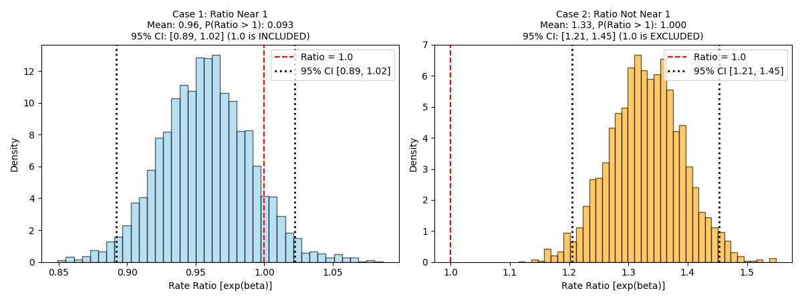

# Coğrafi İstatistiki Hesaplar, Oranlar

### Savaş Sırasında Londra

Daha önce istatistik testler konusunda gördük, bir dağılım
varlığlığını test için o dağılımın analitik yoğunluk fonksiyonunu
veriden gelen tahmin ediciler üzerinden tanımlayıp, veriyi bu
fonksiyon ile üretmeyi deneyebiliriz, ve bu sonuç ile veri arasında
uyumluluğa bakabiliriz.

Mesela olayların coğrafi olarak dağılımına bakalım..  Bu tür olayları
nasıl modelleriz? Olaylar depremler, yangınlar, ya da bir savaşta bir
alana atılan bombalar olabilir, ve bu tür sayılar Poisson dağılımı ile
modellenir. Bu dağılım ilk bölümde gördüğümüz gibi,

$$ f(x) = P(X=x) = e^{-\lambda}\frac{\lambda^{x}}{x!} $$

olay sayısı $x=1$, $x=2$, vs.. olacak şekilde, ki önceden tanımlı
belli bir zaman aralığında $x$ tane olayın olma olasılığını bu
yoğunluk veriyor. Coğrafi olay sayılarını ölçmek için biraz farklı
düşünmek gerekiyor, mesela 2'inci Dünya Savaşı sırasında Almanların
Londra'ya attıkları bombaları düşünelim, analizi [2]'de var; Merak
edilen şuydu, acaba bombalar belli bir yerde kümeleniyor muydu
(clustering)? Cevap önemli olabilirdi, belki özel bir yer vurulmak
isteniyordu? Analizde olayların doğal oluş sayısını modelleyen Poisson
varlığı ispatlanırsa, kümelenme hipotezi reddedilmiş
olacaktı. İstatistikçi Clarke Londra'yı 536 tane ızgaraya böldü, ve
her öğe içine düşen bombaları saydı. Bu bittikten sonra 1 tane bomba,
2 tane bomba, vs.. şeklinde olan hücrelerin sayısını aldı, ki
yoğunluğa $x$ ile geçilecek olan bu sayıydı.

Sonra Clarke yoğunluğu $\lambda$ tahmin edici hücre sayısı bölü bomba
sayısı üzerinden tanımladı, ve bu yoğunluktan tüm sayılar için bir
tahmini bomba sayısı ürettirdi, sonuçları gerçek bomba sayıları ile
karşılaştırdı.

```python
N = 576.
lam = 537/N
d = N*np.exp(-lam)
probs = [d*1, d*lam, d*lam**2/2, d*(lam**3)/(3*2), d*(lam**4)/(4*3*2)]
list(map(lambda x: float(np.round(x,2)), probs))
```

```text
Out[1]: [226.74, 211.39, 98.54, 30.62, 7.14]
```

Gerçek sayılar 229, 211, 93, 35, 7, .. idi, görüldüğü gibi oldukca
yakın sayılar. Bir adım daha atılıp bunun üzerinde bir istatistik
testi uygulanınca Poisson varlığı, ve dolaylı olarak kümelemenin
olmadığı ispatlanmış oldu.

### Zaman Serileri, Sayım Verisi

Üstteki örnekte tek bir Poisson dağılımı modellendi. Peki ya zamana
yayılmış (sene bazında), ve bir A grubu ile bir diğer B grubunun sayım
verisini karşılaştırmak isteseydik? Problem şu şekilde ortaya
çıkabilir:

Ülke bazında spesifik bir olaya bağlı bir sayım verisine bakıyoruz, bu
veri sene bazında toplanıyor. Bir veri mesela yıllık "dört yol
kavşaklarında olan kaza sayısı" olabilir. Kavşaklar tabii ki ülkenin
her tarafında, hepsine bakıp her sene için orada olan kazaları
topluyoruz. Sonra diyelim ki bu kazaların normal (!)  kazalardan daha
yüksek / farklı olup olmadığını merak ediyoruz, o zaman diğer bir
ölçüm sene bazlı dört yol kavşakları *dışındaki* kazalar olur.

O zaman elimizde iki zaman serisi olacak, her sene için iki tane
ölçüm. Her ölçüm rakamının, bir sayım olduğu için, Poisson
dağılımından geldiğini kabul edebiliriz. Fakat dikkat, her sene *aynı*
Poisson dağılımından mı geliyor? Büyük ihtimalle hayır çünkü kaza
sayılarında sene bazlı değişim olabilir: araç sayıları farklı
olabilir, yol şartları değişmiş olabilir. Karşılaştırma mekanizmasının
bunu hesaba katması gerekir.

Bir diğer problem ölçekleme (scaling) problemi olabilir, kavşaklar
yolların ufak bir alanını temsil eder, kıyasla yolların tamamı
fiziksel olarak daha fazla yer kaplar bu sebeple kavşak olmayan yol
bölümünde olan kazaların sayıca daha fazla olması muhtemeldir. Bu
fazlalık karşılaştırmayı yanıltabilir, elmalar ve armutları
karşılaştırmış oluruz. Eğer elmalar ile elmaları karşılaştırmak
istiyorsak kavşak dışındaki sayımları ölçekleyip diğer ölçüme
skalasına yaklaştırmamız gerekir. Bu çok zor olmasa gerek, basit bir
toplam ve bölme işlemi ile bunu başarabiliriz.

Verinin modeli ne olacak? Her sene farklı bir Poisson dağılımı olsun
demiştik, ama bu dağılımların birbirine bazı yönlerden benzerlikleri
de olmalı. Bir Poisson GLM (genel lineer model -generalized linear
model-) yaratabiliriz, her iki zaman serisindeki her sene ölçümü
farklı bir $\lambda$ ile üretiliyor olabilir, parametrelerde kavşak
için A diğeri için B dersek,

$$
\lambda_{A,t} = e^{\alpha + \beta + u_t}
$$

$$
\lambda_{B,t} = e^{\alpha + u_t}
$$

Üstteki parametreleri kullanarak $y$ verisinin şu şekilde üretildiğini
farz edebiliriz,

$$
y_{A,t} \sim Poisson(\lambda_{A,t})
$$

$$
y_{B,t} \sim Poisson(\lambda_{B,t})
$$

Denklemlerde $\beta$ dolaylı olarak $\lambda$ oranlarını hesaplayacak,
dikkat edelim bir formülde var, diğerinde yok. Bunun sebebini birazdan
göreceğiz. Peki niye üstel $e$ kullanımı var? Eğer $\log$ alsaydık
mesela ilk denklem için

$$
\log(\lambda_{A,t}) = \alpha + \beta + u_t
$$

elde ediyoruz, bu standart lineer regresyondan tanıdık bir format. Log
bağlantının sebebi (ya da dolaylı $e$ kullanımı)

$$
\lambda_{A,t} = e^{\alpha} \cdot e^{\beta} \cdot e^{u_t}
$$

yapısına izin vermek / onu aktive etmek. Böylece $\lambda$'nin pozitif
olmasını sağlıyoruz (çünkü Poisson oran $\lambda$ pozitif olmalıdır),
ayrıca oran hesapları çarpımsal parametreler içerdiği için bu
varsayımı modele dahil etmiş oluyoruz. Tıpta bir ilaç uygulaması
hastalık oranını katlayarak etkiler, hava kirliliği astim hastalığı
oranını katlayarak arttırır, vb. Bu tür faraziyeler üstel hesap
üzerinden formülasyona dahil edilmiş oldu.

Peki aradığımız oran $\beta$ nasıl hesaplanacak? Bu hesap aslında
*dolaylı* bir hesap. Biraz cebir ile $\beta$'nin neye eşit olduğunu
görünce bunu anlayacağız, $\beta$'i bir eşitliğin sağında olacak
şekilde bildiğimiz denklemleri düzenlersek,

$$
\lambda_{A,t} - \lambda_{B,t} = \alpha + \beta + u_t - (\alpha + u_t) 
$$

$$
= \alpha + \beta + u_t - \alpha - u_t = \beta
$$

Yani,

$$
\lambda_{A,t} - \lambda_{B,t} = \beta
$$

Eğer iki tarafın üstelini alırsak

$$
\frac{e^{A,t}}{e^{B,t}} = e^{\beta}
$$

Yani $\beta$ parametresi otomatik olarak A ve B farklı iki Poisson
$\lambda$ parametrelerinin oranını hesaplıyor! Dikkat bu hesabın
yapılabilmesi için GLM'in spesifik bir oran hesabı yapması gerekli
değil. Tek gereken GLM Poisson için gereken temel veri GLM
regresyonuna, ya da Bayes MCMC hesabına verilirken, tüm verinin, yani
A ve B birleşmiş olarak şu şekilde sunulması,

$$
\log(\lambda_{A,t}) = \alpha + \beta \cdot g_t + u_t
$$

Tabii üsttekinin hemen ardından $\lambda$ kullanılarak bir Poisson
üretimi yapıldığını düşünüyoruz, geri yönde ise eldeki veri üzerinden
MCMC ile sonsal -posterior- elde edip o dağılımdan örneklem
alıyoruz, bunlar standart yaklaşımlar.

Konuya dönersek $\beta \cdot g_t$ ifadesindeki $g_t$'ye dikkat, bu
parametre A grup verisi için 1, B grup verisi için 0 diyecek. Yani bu
formülasyonun doğal sonucu olarak elde ettiğimiz $\beta$ iki $\lambda$
parametresinin oranı haline gelecek. Her veri noktası $\beta$'yi kendi
tarafına doğru çekmeye uğraşacak, bu al-ver itme-çekme arasında
$\beta$'nin varacağı yer onun tüm zaman dilimleri için geçerli bir
orana ulaşmasıdır.

Senesel farklar, eğer var ise, her sene için farklı olmasına izin
verdiğimiz $u_t$ ile olabilir, bu parametre ile o farklılığı
"yakalayabiliyoruz".

Matematiksel tanımlar şöyle oluyor, sayım verisi için bir GLM
oluşturduk,

$$\log(\lambda_{i}) = \alpha + \beta \cdot \text{group}_i + u_{\text{year}[i]}$$

$$\lambda_i = \exp\left(\log(\lambda_{i})\right)$$

$$y_i \sim \text{Poisson}(\lambda_i)$$

ki,

* $u_t = \text{yearoffset}_t \times \sigma_{\text{year}}$
* $\alpha \sim \mathcal{N}(0, 2^2)$
* $\beta \sim \mathcal{N}(0, 1^2)$
* $\sigma_{\text{year}} \sim \text{HalfNormal}(1.0)$
* $\text{yearoffset}_t \sim \mathcal{N}(0, 1^2)$
* $\text{ratio} = \exp(\beta)$

Verinin nasıl oluşturulduğunu görelim, 

```python

def build_stacked_arrays(simdict):
    years = np.array(simdict["years"])
    A = np.array(simdict["A"])
    B = np.array(simdict["B"])
    n_years = len(years)
    counts = np.concatenate([A, B])
    group = np.concatenate([np.ones(n_years, dtype=int), np.zeros(n_years, dtype=int)])
    year_idx = np.concatenate([np.arange(n_years), np.arange(n_years)])
    return years, counts, group, year_idx

# Senaryo 1: Oran 1'e yakin
np.random.seed(333)
years1 = np.arange(1950, 2011)
T1 = len(years1)
u_t1 = np.random.normal(0, 0.4, size=T1)
alpha_true = 3.2
beta_true1 = 0.0
mu_B1 = np.exp(alpha_true + u_t1)
mu_A1 = np.exp(alpha_true + beta_true1 + u_t1)
A1 = np.random.poisson(mu_A1)
B1 = np.random.poisson(mu_B1)
sim1 = {"years": years1, "A": A1, "B": B1}

# Senaryo 2: Oran 1 yakininda degil (1.3 civari)
np.random.seed(42)
years2 = np.arange(1980, 2020)
T2 = len(years2)
u_t2 = np.random.normal(0, 0.4, size=T2)
beta_true2 = np.log(1.3)
mu_B2 = np.exp(alpha_true + u_t2)
mu_A2 = np.exp(alpha_true + beta_true2 + u_t2)
A2 = np.random.poisson(mu_A2)
B2 = np.random.poisson(mu_B2)
sim2 = {"years": years2, "A": A2, "B": B2}

years1, counts1, group1, year_idx1 = build_stacked_arrays(sim1)
print (group1)
years2, counts2, group2, year_idx2 = build_stacked_arrays(sim2)
print (group2)
```

```text
[1 1 1 1 1 1 1 1 1 1 1 1 1 1 1 1 1 1 1 1 1 1 1 1 1 1 1 1 1 1 1 1 1 1 1 1 1
 1 1 1 1 1 1 1 1 1 1 1 1 1 1 1 1 1 1 1 1 1 1 1 1 0 0 0 0 0 0 0 0 0 0 0 0 0
 0 0 0 0 0 0 0 0 0 0 0 0 0 0 0 0 0 0 0 0 0 0 0 0 0 0 0 0 0 0 0 0 0 0 0 0 0
 0 0 0 0 0 0 0 0 0 0 0]
[1 1 1 1 1 1 1 1 1 1 1 1 1 1 1 1 1 1 1 1 1 1 1 1 1 1 1 1 1 1 1 1 1 1 1 1 1
 1 1 1 0 0 0 0 0 0 0 0 0 0 0 0 0 0 0 0 0 0 0 0 0 0 0 0 0 0 0 0 0 0 0 0 0 0
 0 0 0 0 0 0]
```

Şimdi oranın sonsal dağılımını MCMC ile ortaya çıkartalım ve ondan
örneklem alalım. Gereken fonksiyonlar,

```python
from scipy.stats import norm, poisson

def log_posterior(params, counts, group, year_idx, n_years):
    """
    params vektor icerigi, aranan parametreler beraber bu vektor icinde:
    [alpha, beta, log_sigma_year, year_offset_0, year_offset_1, ...]
    Not: log(sigma_year)'dan orneklem aliyoruz ki pozitif degerler almak garanti olsun
    """
    alpha = params[0]
    beta = params[1]
    log_sigma = params[2]
    sigma_year = np.exp(log_sigma)
    year_offset = params[3:]

    # Priors
    log_p_alpha = norm.logpdf(alpha, 0.0, 2.0)
    log_p_beta = norm.logpdf(beta, 0.0, 1.0)
    
    # Half-Normal(1.0) prior for sigma_year with Jacobian adjustment for log-transform
    if sigma_year <= 0:
        return -np.inf
    log_p_sigma = np.log(2.0) + norm.logpdf(sigma_year, 0.0, 1.0) + log_sigma
    
    log_p_offsets = np.sum(norm.logpdf(year_offset, 0.0, 1.0))

    # Likelihood
    year_effect = year_offset * sigma_year
    log_lambda = alpha + beta * group + year_effect[year_idx]
    lam = np.exp(log_lambda)

    log_lik = np.sum(poisson.logpmf(counts, lam))

    return log_p_alpha + log_p_beta + log_p_sigma + log_p_offsets + log_lik

def run_metropolis(counts, group, year_idx, n_years, n_samples=20000, burn_in=10000):
    n_params = 3 + n_years
    
    # Initial state
    current_params = np.zeros(n_params)
    current_params[0] = 3.0           # alpha init
    current_params[1] = 0.0           # beta init
    current_params[2] = np.log(0.4)   # log_sigma init
    
    current_log_post = log_posterior(current_params, counts, group, year_idx, n_years)

    # Adaptive proposal step sizes (tuned for stability across dimensions)
    proposal_std = np.full(n_params, 0.02)
    proposal_std[0] = 0.03 # alpha
    proposal_std[1] = 0.02 # beta
    proposal_std[2] = 0.03 # log_sigma

    chain = np.zeros((n_samples, n_params))
    accepted = 0

    for i in range(n_samples):
        # Propose step
        proposal = current_params + np.random.normal(0, proposal_std, size=n_params)
        prop_log_post = log_posterior(proposal, counts, group, year_idx, n_years)

        # Metropolis acceptance probability
        log_acc_ratio = prop_log_post - current_log_post

        if np.log(np.random.uniform(0, 1)) < log_acc_ratio:
            current_params = proposal
            current_log_post = prop_log_post
            accepted += 1

        chain[i, :] = current_params

    print(f"Acceptance rate: {accepted / n_samples:.2%}")
    
    # Extract chains post burn-in
    post_chain = chain[burn_in:]
    beta_samples = post_chain[:, 1]
    rate_ratio_samples = np.exp(beta_samples)
    
    return rate_ratio_samples
```

Simülasyonları artık işletebiliriz,

```python
rr_samples1 = run_metropolis(counts1, group1, year_idx1, len(years1))

rr_samples2 = run_metropolis(counts2, group2, year_idx2, len(years2))
```

```text
Acceptance rate: 38.36%
Acceptance rate: 46.71%
```

```python
fig, axes = plt.subplots(1, 2, figsize=(12, 4.5))

for ax, samples, title, color in zip(
    axes, 
    [rr_samples1, rr_samples2], 
    ["Case 1: Ratio Near 1", "Case 2: Ratio Not Near 1"],
    ["skyblue", "orange"]
):
    mean_val = np.mean(samples)
    prob_gt_1 = np.mean(samples > 1.0)
    
    # Simple 95% Equal-Tailed Credible Interval using standard percentiles
    ci_low, ci_high = np.percentile(samples, [2.5, 97.5])
    
    # 1. Histogram
    ax.hist(samples, bins=40, density=True, alpha=0.6, color=color, edgecolor='black')
    
    # 2. Reference line for Ratio = 1.0
    ax.axvline(1.0, color='red', linestyle='--', linewidth=1.5, label='Ratio = 1.0')
    
    # 3. Two vertical lines for the 95% Credible Interval
    ax.axvline(ci_low, color='black', linestyle=':', linewidth=2, label=f'95% CI [{ci_low:.2f}, {ci_high:.2f}]')
    ax.axvline(ci_high, color='black', linestyle=':', linewidth=2)
    
    contains_one = "INCLUDED" if (ci_low <= 1.0 <= ci_high) else "EXCLUDED"
    
    ax.set_title(
        f"{title}\nMean: {mean_val:.2f}, P(Ratio > 1): {prob_gt_1:.3f}\n"
        f"95% CI: [{ci_low:.2f}, {ci_high:.2f}] (1.0 is {contains_one})",
        fontsize=10
    )
    ax.set_xlabel("Rate Ratio [exp(beta)]")
    ax.set_ylabel("Density")
    ax.legend(loc='upper right')

plt.tight_layout()
plt.savefig('stat_082_rapoi_02.jpg')
```



Görüyoruz ki ilk simülasyonda oranın dağılımı 1 etrafında kümelenmiş,
1 değeri yüzde 95 güven aralığı içinde, o zaman iki sayım zaman
serisinin birbirine yakın olduğuna karar verebiliriz çünkü oranları
1'e yakın. İkinci gruptaki zaman serileri birbirine yakın
değiller. Sonsal dağılımın kümelendiği yer 1'den çok uzakta, yüzde 95
aralığının dışında.

Kaynaklar

[1] Bayramlı, İstatistik, *Sayım, Poisson ve Negatif Binom Bazlı Genel Lineer Modelleri (GLM)*

[2] Clarke, *An application of the Poisson distribution*,
     [https://www.actuaries.org.uk/system/files/documents/pdf/0481.pdf](https://www.actuaries.org.uk/system/files/documents/pdf/0481.pdf)


