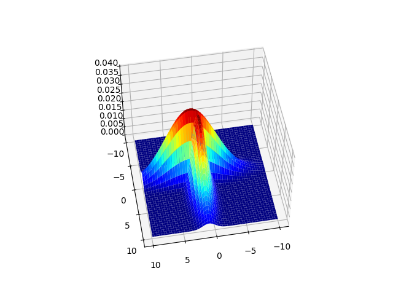
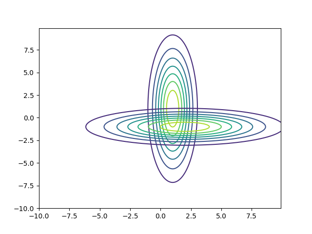

# Algılayıcı Birleştirimi, Füzyonu (Sensor Fusion)

Tek boyutlu ortamda bir büyüklüğü mesela bir lokasyon bilgisi $x$'i, iki
kere ölçüyoruz, ve bu ölçümü iki değişik algılayıcıya yaptırıyoruz, ve yine
diyelim ki iki değişik alet bir cismin olduğu uzaklığını / yerini bize geri
döndürüyor. Devam edelim, bu bilgilerde belli ölçüde gürültü var; bu
aletlerin hatalı ölçümü yüzünden olabilir, çevre şartları sebebiyle
olabilir, örnek olarak iki $z_1,z_2$ ölçümü için iki değişik belirsizlik
(uncertainty) olduğunu farzedelim, bunlar $\sigma_1,\sigma_2$. Soru şu: bu
iki ölçümü kullanarak daha iyi bir $x$ tahmini yapabilir miyiz?

Bunun için iki ölçümü bir şekilde birleştirmemiz gerekiyor. Her ölçümü
Gaussian / Normal dağılım olarak modelleyebiliriz, o zaman iki Gaussian
dağılımı bir şekilde birleştirmemiz (fusion) lazım. 

Ölçümleri temsil etmek için Gaussian biçilmiş kaftan. Ölçümdeki
belirsizliği standart sapma (standart deviation) üzerinden rahatlıkla
temsil edebiliriz. Peki birleştirimi nasıl yapalım?

Bu tür problemlerde maksimum olurluk (maximum likelihood) kullanılması
gerektiğini aşağı yukarı tahmin edebiliriz, çünkü maksimum olurluk verinin
olurluğunu (olasılığını yani) maksimize ederek bilinmeyen parametreleri
tahmin etmeye uğraşır. Çoğunlukla bu tekniği hep *tek* bir dağılım
bağlamında görürüz, bazı bilinmeyen parametreleri olan tek bir dağılıma
değişik veri noktaları verilerek olasılık sonuçları çarpılır, ve elde
edilen formül maksimize edilmeye uğraşılırken aynı anda bilinmeyen
parametrelerin optimal değerleri saptanmaya uğraşılır. Bizim bu
problemimizde iki değişik dağılım olacak, maksimum olurluk illa tek bir
dağılımla kullanılabilir diye bir kural yok.

Problemimizde iki ölçümü, iki Gaussian ile temsil edebiliriz, ve bu iki
Gaussian'a verilen iki ölçüm noktasını olurluğunu bu Gaussian'ların
sonuçlarını çarparak hesaplayabiliriz. Peki bilinmeyen parametre nedir? Onu
da *her iki Gaussian için de aynı olduğunu farzettiğimiz orta nokta*
(mean) olarak alabiliriz, ve $x$ olarak belirtiriz. Yani

$$ L(x) = p(z_1|x,\sigma_1) p(z_2|x,\sigma_2) $$

$$ L(x) \sim \exp{\frac{-(z_1-x)^2}{2\sigma_1^2} } 
\times \exp \frac{-(z_2-x)^2}{2\sigma_2^2} $$

1D Gaussian formülünü hatırlarsak, 

$$ p(z;x,\sigma) = \frac{1}{\sigma\sqrt{2\pi}} 
\exp \bigg\{ - \frac{(z-x)^2}{2\sigma^2}  \bigg\}
$$

Ders notları [1]'de iki üstteki formülün nasıl maksimize edilerek bir
$x_{MLE}$ formülüne erişildiğini görebiliriz. 

Formül başındaki sabit kısmının $L(x)$'de kullanılmadığını görüyoruz, çünkü
maksimizasyon açısından düşünürsek o kısım tekrar tekrar çarpılacak ve
hesaplamaya çalıştığımız değişkenler açısından bu sürekli tekrar bir
fark yaratmaz.

Bu metot işler. Fakat biz alternatif olarak daha temiz olacak değişik bir
yoldan gideceğiz. Elimizdeki her iki ölçümü iki farklı tek boyutlu Gaussian
yerine *2 boyutlu* tek bir Gaussian içine koyacağız, iki ölçümü tek
bir 2 boyutlu vektör içinde belirteceğiz yani, ve tek bir olasılık hesabını
$p(z;x,\Sigma)$'i baz alacağız.  Belirsizlikler ne olacak? Ölçüm
belirsizliklerini bu 2D Gaussian'ın kovaryansında çapraza (diagonal)
koyabiliriz, çapraz dişindaki matris öğeleri sıfır yapılırsa iki ölçümün
birbirinden bağımsızlığını temsil etmiş oluruz. Maksimizasyon? Tek bir
ölçümün olurluğunu maksimize edeceğiz, bu tek bir ölçümün olasılığını
hesaplamaktan ibarettir, ve bu hesap sırasında bilinmeyen değişkenleri
içeren yeni bir formül ortaya çıkacaktır. Maksimize etmeye uğraşacağımız bu
formül olur.

Çok boyutlu Gaussian'ı hatırlayalım (artık $z,x$ birer vektör),

$$ p(z;x,\Sigma) = 
\frac{ 1}{(2\pi)^{k/2} \det(\Sigma)^{1/2}} \exp 
\bigg\{ 
-\frac{ 1}{2}(z-x)^T\Sigma^{-1}(z-x)
\bigg\} $$

Kısaca,

$$ =  \frac{ 1}{C} \exp 
\bigg\{ 
-\frac{ 1}{2}(z-x)^T\Sigma^{-1}(z-x)
\bigg\} $$

Bir numara, $\exp$ ve parantez içi negatif ibareden kurtulmak için
$-\ln p$ alalım,

$$ L = -\ln p(z) = 
\frac{ 1}{2}(z-x)^T\Sigma^{-1}(z-x)
$$

Şimdi iki ölçümü, belirsizliği vektör / matris öğeleri olarak gösterelim, 

$$ = \frac{1}{2}  
\left[\begin{array}{c}
z_1-x \\ z_2-x
\end{array}\right]^T
\left[\begin{array}{cc}
\sigma_1^2 & 0 \\
0 & \sigma_2^2 
\end{array}\right]^{-1}
\left[\begin{array}{c}
z_1-x \\ z_2-x
\end{array}\right]
$$

Çapraz matrisin tersini almak için çaprazdaki öğelerin tersini almak
yeterlidir,

$$ = \frac{1}{2}  
\left[\begin{array}{c}
z_1-x \\ z_2-x
\end{array}\right]^T
\left[\begin{array}{cc}
\sigma_1^{-2} & 0 \\
0 & \sigma_2^{-2} 
\end{array}\right]
\left[\begin{array}{c}
z_1-x \\ z_2-x
\end{array}\right]
$$

$$ = \frac{1}{2}  
\left[\begin{array}{cc}
\sigma_1^{-2}(z_1-x) & \sigma_2^{-2} (z_2-x)
\end{array}\right]
\left[\begin{array}{c}
z_1-x \\ z_2-x
\end{array}\right]
$$

$$ = 
\frac{1}{2}\sigma_1^{-2}(z_1-x)^2 + \frac{1}{2}\sigma_2^{-2} (z_2-x)^2
$$

Maksimize etmek için, formül karesel olduğuna göre, bilinmeyen $x$
değişkenine göre türev alıp sıfıra eşitleyebiliriz,

$$ 
\frac{dL}{dx} = \sigma_1^{-2}z_1-\sigma_1^{-2}x + \sigma_2^{-2}z_2-\sigma_2^{-2}x = 0
$$

$x$ üzerinden gruplarsak,

$$ 
-x(\sigma_1^{-2}+\sigma_2^{-2}) + \sigma_1^{-2}z_1+ \sigma_2^{-2}z_2 = 0
$$

Gruplanan kısmı eşitliğin sağına alalım,

$$ 
\sigma_1^{-2}z_1+ \sigma_2^{-2}z_2 = x(\sigma_1^{-2}+\sigma_2^{-2}) 
$$

$$ 
\frac{\sigma_1^{-2}z_1+ \sigma_2^{-2}z_2 }{\sigma_1^{-2}+\sigma_2^{-2}}= x_{MLE}
$$

Gayet temiz bir şekilde sonuca eriştik. 

Örnek

Elimizde belirsizlikleri $\sigma_1=10,\sigma_2=20$ olan iki algılayıcı
var. Bu algılayıcılar aynı obje hakkında $z_1=130,z_2=170$ olarak iki ölçüm
gönderiyorlar. Bu ölçümleri birleştirelim. Hatırlarsak $10^{-2}$ ile
çarpmak $10^{2}$ ile bölmek aynı şey.

$$ x_{MLE} =
\frac{130/10^2 + 170/20^2}{1/10^2 + 1/20^2} = 138.0
$$

Sonuç belirsizliği daha az olan ölçüme daha yakın çıktı, bu akla yatkın
bir sonuç.

Çok Boyutlu Gaussian Füzyon

Peki ya elimizdeki ölçümlerin kendisi çok boyutlu ise? Yani $z_1,z_2$ birer
vektör ise?

Yine maksimum olurluk üzerinden bir formül türetebiliriz. Bu durumda tek
olasılık hesabı yetmez, iki ayrı dağılım olmalı,

$$ p(z_1;x,\Sigma_1) =  \frac{ 1}{C_1} \exp 
\bigg\{ 
-\frac{ 1}{2}(z_1-x)^T\Sigma_1^{-1}(z_1-x)
\bigg\} $$

$$ p(z_2;x,\Sigma_2) =  \frac{ 1}{C_2} \exp 
\bigg\{ 
-\frac{ 1}{2}(z_2-x)^T\Sigma_2^{-1}(z_2-x)
\bigg\} $$

Orta nokta $x$ her iki formülde aynı çünkü değişmeyen olan o; aynı orta
nokta için tahmin üretmeye uğraşıyoruz. Bu durum bildik maksimum olurluk
hesaplarına benziyor, fakat ilk başta belirttiğimiz gibi farklı türden
olasılık fonksiyonlarının (bu sefer çok boyutlu) farklı veri noktaları
üzerinden çarpılması.

Devam edelim. Daha önce $\ln$ alarak $\exp$'yi yoketmiştik. Bunun bir diğer
faydası $\ln$ alınınca çarpımların toplama dönüşmesidir, 

$$ L = p(z_1;x,\Sigma_1) p(z_2;x,\Sigma_2) 
$$

$$ -\ln L = -\ln p(z_1;x,\Sigma_1) -\ln p(z_2;x,\Sigma_2) 
$$

$$ 
\mathcal{L} = 
-\ln L = 
\frac{ 1}{2}(z_1-x)^T\Sigma_1^{-1}(z_1-x) + 
\frac{ 1}{2}(z_2-x)^T\Sigma_2^{-1}(z_2-x)
$$

Şimdi eşitliğin sağ tarafının $x$'e göre türevini alalım, vektör ve matris
bağlamında türev nasıl alınır? Herhangi bir $M$'in simetrik olduğu
durumlarda (ki kovaryans matrisleri her zaman simetriktir, çünkü mesela iki
değişkenli durumda $x_1,x_2$ kovaryansı -ilişkisi- $x_2,x_1$ kovaryansından
farklı olamaz),

$$ \frac{\partial}{\partial x}[x^TMx] = 2Mx $$

olduğunu biliyoruz [2]. O zaman türev sonucu şöyle olur, 

$$ 
\frac{d\mathcal{L}}{dx} = 
(z_1-x)^T\Sigma_1^{-1} +  (z_2-x)^T\Sigma_2^{-1}
$$

Sıfıra eşitleyip çözelim, 

$$ 
(z_1-x)\Sigma_1^{-1} +  (z_2-x)\Sigma_2^{-1} = 0
$$

$$ 
z_1\Sigma_1^{-1} - x\Sigma_1^{-1} + z_2\Sigma_2^{-1} - x\Sigma_2^{-1} = 0
$$

Yine $x$ altında gruplayalım,

$$ 
-x(\Sigma_1^{-1} + \Sigma_2^{-1}) + z_1\Sigma_1^{-1}  + z_2\Sigma_2^{-1}  = 0
$$

$$ 
z_1\Sigma_1^{-1}  + z_2\Sigma_2^{-1}  = x(\Sigma_1^{-1} + \Sigma_2^{-1}) 
$$

Eğer iki belirsizliğin toplamını $\Sigma_x^{-1}$ olarak özetlersek, yani 

$$ 
\Sigma_x^{-1} = \Sigma_1^{-1} + \Sigma_2^{-1}
$$

Not: Aslında $\Sigma_x$ te diyebilirdik, fakat tersi alınmış matrislerin
toplamı olduğunu temsil etmesi için "tersi alınmış bir sembol''
kullandık. Tabii diğer yandan tersin tersini alınca ele geçecek
$\Sigma_x$'in de bir anlamı olduğu iddia edilebilir, bu $\Sigma_x$ en olası
$x$ tahmininin yeni belirsizliğidir de bir bakıma. 

Simdi ana formule donelim,

$$ 
z_1\Sigma_1^{-1}  + z_2\Sigma_2^{-1}  = x\Sigma_x^{-1}
$$


$$ 
\Sigma_x (z_1\Sigma_1^{-1}  + z_2\Sigma_2^{-1}) = x_{MLE}
$$

Örnek

Elimizde iki tane iki boyutlu ölçüm var, 

$$ z_1 = \left[\begin{array}{c}
1 \\ 1
\end{array}\right], 
z_2 = \left[\begin{array}{r}
2 \\ -1
\end{array}\right] 
$$

Ölçümler iki değişik algılayıcıdan geliyor, belirsizlikleri

$$ 
\Sigma_1 = 
\left[\begin{array}{cc}
1 & 0 \\ 0 & 4
\end{array}\right], 
\Sigma_2 = 
\left[\begin{array}{cc}
4 & 0 \\ 0 & 1
\end{array}\right]
$$

Nihai ölçüm nedir? 

```python
from mpl_toolkits.mplot3d import Axes3D
from matplotlib import cm
from scipy.stats import multivariate_normal 

x = np.arange(-10.0, 10.0, 0.1)
y = np.arange(-10.0, 10.0, 0.1)

X, Y = np.meshgrid(x, y)

pos = np.dstack((X, Y))

mux = 1.0; muy = 1.0; sigmax = 1.0; sigmay = 4.0
sigmaxy = 0.0
mean = [mux, muy]
cov = [[sigmax**2, sigmaxy],
       [sigmaxy, sigmay**2]]
rv = multivariate_normal(mean, cov)
Z1 = rv.pdf(pos)

mux = 2.0; muy = -1.0; sigmax = 4.0; sigmay = 1.0
sigmaxy = 0.0
mean = [mux, muy]
cov = [[sigmax**2, sigmaxy],
       [sigmaxy, sigmay**2]]
rv = multivariate_normal(mean, cov)
Z2 = rv.pdf(pos)

# iki yuzeyi ayni grafikte birlestirmek icin herhangi iki nokta arasinda
# daha fazla (maksimum) olani al, cunku nihai yuzey olarak onu gormek 
# istiyoruz zaten
Z = np.maximum(Z1,Z2)

fig, ax = plt.subplots(1, 1, subplot_kw={'projection': '3d'})
ax.view_init(elev=50., azim=80)

ax.plot_surface(X,Y,Z,cmap=cm.jet)
plt.savefig('fusion_1.png')
```



İki ölçümü Gaussian olarak ekrana bastık, bu Gaussian'ların orta noktası
$z_1,z_2$, bu durumu maksimum olurluk için aynı olduğunu farz ettiğimiz $x$
ile karıştırmayalım; o $x$ modelleme sırasında olduğunu farzettiğimiz ideal
bir Gaussian idi. Üstte sadece veri noktalarını ekrana basıyoruz. 

Üstten bakışla kontur (contour) olarak gösterirsek 

```python
CS = plt.contour(X, Y, Z1)
CS = plt.contour(X, Y, Z2)
plt.savefig('fusion_3.png')
```



Resimde önce ilk ölçüm, sonra onunla yanyana olacak ikinci ölçüm koyulmuş. 

$$ \Sigma_x^{-1} = \Sigma_1^{-1} + \Sigma_2^{-1}  =
\left[\begin{array}{cc}
1 & 0 \\ 0 & 0.25
\end{array}\right] + 
\left[\begin{array}{cc}
0.25 & 0 \\ 0 & 1
\end{array}\right] =
\left[\begin{array}{cc}
1.25 & 0 \\ 0 & 1.25
\end{array}\right] 
$$

Tersini alalım 

$$ \Sigma_x =
\left[\begin{array}{cc}
0.8 & 0 \\ 0 & 0.8
\end{array}\right] 
$$

$$ x_{MLE} =  \Sigma_x (z_1\Sigma_1^{-1}  + z_2\Sigma_2^{-1}) $$

$$ 
x_{MLE} =
\left[\begin{array}{cc}
0.8 & 0 \\ 0 & 0.8
\end{array}\right] 
\bigg(
\left[\begin{array}{cc}
1 & 0 \\ 0 & 0.25
\end{array}\right] 
\left[\begin{array}{c}
1 \\ 1
\end{array}\right]  + 
\left[\begin{array}{cc}
0.25 & 0 \\ 0 & 1
\end{array}\right] 
\left[\begin{array}{r}
2 \\ -1
\end{array}\right]  
\bigg) = 
\left[\begin{array}{r}
1.2 \\ -0.6
\end{array}\right]  
$$

Sonuç grafiklenirse suna benzer (ki yeni belirsizlik $\Sigma_x$'i de
grafikte kullanalım),

```python
mux = 1.2; muy = -0.6; sigmax = 0.8; sigmay = 0.8
sigmaxy = 0.0
mean = [mux, muy]
cov = [[sigmax**2, sigmaxy],
       [sigmaxy, sigmay**2]]
rv = multivariate_normal(mean, cov)
Z3 = rv.pdf(pos)

fig, ax = plt.subplots(1, 1, subplot_kw={'projection': '3d'})
ax.view_init(elev=40.,azim=80)

ax.plot_surface(X,Y,Z3,cmap=cm.jet)
plt.savefig('fusion_2.png')
```


Yeni tahminimiz böyle çıktı. Çok daha emin olduğumuz bir noktada en olası ölçümü
ortaya çıkardık. Kontur olarak grafiklersek,

```python
CS = plt.contour(X, Y, Z3)
plt.savefig('fusion_4.png')
```


[1] Zisserman, *Lectures 3 \& 4: Estimators*, [www.robots.ox.ac.uk/~az/lectures/est/lect34.pdf](www.robots.ox.ac.uk/~az/lectures/est/lect34.pdf)

[2] Hart, Duda, *Pattern Classification*


