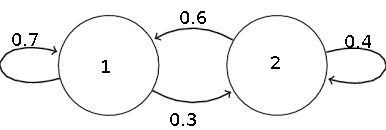
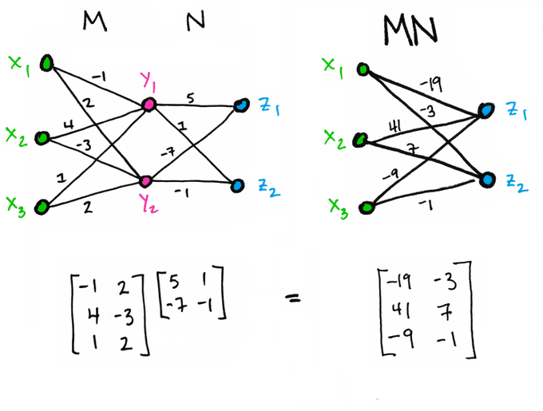

# Markov Zincirleri (Markov Chains)

Markov Zincirlerinde (MZ) $i$ konumundan $j$ konumuna geçiş olasılığını,
$P_{ij}$ gösterir. Farklı şekile $P(X_{n+1} = j | X_{n} = i)$ olarak
açılabilir. Açılımdan görüleceği üzere bir MZ sonraki adıma geçiş olasılığı için
sadece bir önceki adıma bakar. Bu tür önce/sonra yapısındaki iki boyutlu hal,
çok rahat bir şekilde matrise çevirilebilir. Önceki konum satırlar, sonraki
konum kolonlar olarak temsil edilir mesela.

Örnek

Bir sonraki günde yağmur yağmayacağını bir MZ olarak tasarlayalım [1, sf 196].
Bir sonraki günde yağmur yağmayacağını sadece bugün etkiliyor olsun. Eğer bugün
yağmur yağıyorsa yarın yağmur yağması 0.7, eğer bugün yağmıyor ise yarın
yağması 0.4. MZ şöyle

$$ 
P =
\left[\begin{array}{cc}
0.7 & 0.3 \\
0.4 & 0.6
\end{array}\right]
$$

Geçiş olasılıklarından bahsettiğimize göre ve elimizde sınırlı / belli sayıda
konum (state) olduğu için, bir MZ'nin her satırındaki olasılıkların toplamı
tabii ki 1'e eşit olmalıdır.

MZ'lerin ilginç bir özelliği $n$ adım sonra $i,j$ geçişinin $P_{i,j}^n$
hesabıyla yapılabilmesidir. Yani $P$'yi $n$ defa kendisiyle çarpıp $i,j$
indislerindeki öğeye bakarsak $n$ adım sonrasını görüyoruz. İspat altta [1, sf. 195].

Bulmak istediğimiz $n$ adım sonrası geçiş olasılıkları, yani $i$ adımında olan
sürecin $n$ adım sonra $j$ adımında olma olasılığı. Aradığımız,

$$
P_{ij}^n = P ( X_{n+k} = j | X_k = i ), \quad n \ge 0, i,j \ge 0
$$

Tabii ki $P_{ij}^1 = P_{ij}$. Chapman-Kolmogorov denklemleri bu n-adım
geçişlerini hesaplamak için bize bir yöntem sağlıyoar. Bu denklemler,

$$
P_{ij}^{n+m} = \sum_{k=0}^{\infty} P_{ik}^n P_{kj}^m,
\quad \forall n,m \ge 0, \quad \forall i,j
\qquad (1)
$$

$P_{ij}^{n+m}$ formülü şunu söylüyor, $i$'de başlayan süreç $n+m$ geçiş sonrası
$j$'e varacak, ve geçtiği yol onu $n$ anında $k$'den geçirecek. O zaman tüm bu
geçiş noktaları $k$'ler üzerinden bir toplam alırsak sürecin $n+m$ adım sonrası
$j$'de olma olasılığını elde etmiş oluyoruz.

Formel olarak 

$$
P_{ij}^{n+m} = P(X_{n+m} = j | X_0 = i )
$$

söylenmiş oluyor. Üstteki olasılık hesabına / birleşik olasılığa $k$'den geçme
aksiyonunu ekleyip aynı anda tüm $k$'ler üzerinden toplam alırsak (entegre edip
çıkartma tekniği -integrate out-) hiçbir şey değiştirmemiş oluruz,

$$
= \sum_{k=0}^{\infty} P(X_{n+m} = j, X_n = k | X_0 = i )
$$

$$
= \sum_{k=0}^{\infty} P(X_{n+m} = j, X_n = k, X_0 = i )
P(X_n=k|X_0=i)
$$

Üstteki ifade diyor ki,

$$
P_{ij}^{n+m} = \sum_{k=0}^{\infty} P_{kj}^m P_{ik}^n 
$$

Ayrıca dikkat edersek (1)'deki tarif

$$
P^{n+m} = P^n \cdot P^m
$$

işlemini ima ediyor. Nokta işareti çarpım işlemi, çünkü hatırlarsak matris
çarpımının tanımı şöyleydi; elimizde N x M boyutunda $A$ matrisi var, $B$ ise M
x K boyutunda olsun, her ikisinin $i$ satırı $j$ kolonundaki öğesi $a_{ij}$,
$b_{ij}$ ise, $A \cdot B$ çarpımı bir N x K matrisidir, bu matrisin $i,j$ öğesi
$\sum_{k=1}^{M} a_{ik}b_{kj}$ ile verilir. Toplamın üst sınırı sonsuz değil
$M$ fakat sonsuzluk üst sınırı genel bir formül için tanımlanmış zaten.


İlk örneğe dönersek, eğer bugün yağmur yağıyorsa 4 gün sonra yağmur yağma
olasılığı nedir?

```python
import numpy.linalg as lin
P = np.array([[0.7,0.3],[0.4,0.6]])
P4 = lin.matrix_power(P,4)
print P4
```

```
[[ 0.5749  0.4251]
 [ 0.5668  0.4332]]
```

Aradığımız geçiş için kordinat 0,0'a bakıyoruz ve sonuç 0.5749. Numpy
`matrix_power` bir matrisi istediğimiz kadar kendisiyle çarpmamızı
sağlıyor. 

Durağan Dağılım (Stationary Distribution)

Eğer yağmur örneğindeki matrisi çarpmaya devam edersek, mesela 8 kere
kendisiyle çarpsak sonuç ne olurdu? 

```python
import numpy.linalg as lin
P = np.array([[0.7,0.3],[0.4,0.6]])
P8 = lin.matrix_power(P,8)
print P8
```

```
[[ 0.57145669  0.42854331]
 [ 0.57139108  0.42860892]]
```

Dikkat edilirse, her satır bir değere yaklaşmaya başladı. Bu değer MZ'nin
durağan dağılımıdır, belli koşullara uyan her MZ'nin böyle bir durağan dağılımı
vardır. Bu koşullar MZ'nin periyodik olmayan (aperiodic) ve tekrar eden
(recurrent) olmasıdır. Bu şartlar çok "özel'' şartlar değildir aslında, daha
çok "normal'' bir MZ'yi tarif ediyor diyebiliriz. Tüm konumları tekrar eden
yapmak kolaydır, MZ tek bağlı (singly connected) hale getirilir, yani her
konumdan her diğer konuma bir geçiş olur, ve periyodik olmaması için ise MZ'de
olmadığı zamanlarda bir konumdan kendisine geçiş sağlanır (az bir gürültü
üzerinden).

Neyse, matematiksel olarak durağanlık şu denklemi ortaya çıkartır,

$$ \pi = \pi P $$

Burada durağan dağılım $\pi$'dir. Bu denklem tanıdık geliyor mu?  Devriğini
alarak şöyle gösterelim, belki daha iyi tanınır, 

$$ P^T\pi^T = \pi^T $$

Bir şey daha ekleyelim, 

$$ P^T\pi^T = 1 \cdot \pi^T $$

Özdeğer/vektör formuna benzemiyor mu? Evet. Bu form,

$$ Ax = \lambda x $$

MZ denklemi şunu söylüyor, 1 değerindeki özdeğere ait özvektör bir MZ'nin
durağan dağılımıdır. Bu arada, MZ geçiş matrisi $P$'nin en büyük özdeğerinin her
zaman 1 olduğunu biliyoruz (çünkü üstteki tarif ettiğimiz özel şartlara sahip
olan türden matrisler böyle özdeğerlere sahip olmalı). Bu durumda en büyük
özdeğere ait özvektörü hesaplamak yeterli olacaktır. Bunu yapmayı zaten [2]'de
öğrenmiştik, üst metot (power method) sayesinde bu hesap kolayca yapılabiliyor.

MZ kavramının ilginç bir uygulaması için [3] yazısına bakılabilir.

Çizitler ve Matrisler

Markov matrisleri kavramını biraz daha ilerletebiliriz. Üstteki Markov örneği
için mesela alttaki çizit gösterilebilir,



Örnekteki durumda 1'den başlayınca hangi olasılıkla hangi diğer düğüme atlandığı
görülebiliyor. Bu geçiş olasılıklarına göre zar atılıp geçiş yapılabilir.
Markov matrisleri bu bağlamda kendi içindeki geçişleri gösteriyor, sürekli
1,2,3,.. düğümleri arasında gidip geliyoruz. 1'den 3'e geçiş için 1'inci satır
3'üncü kolona bakıyoruz, bir sonraki geçiş için $P^2$'nin 3'üncü satırına
bakıyoruz.

Bu kavramı daha da genişletebiliriz. Bir çizitin katman katman, farklı blokları
arasındaki geçişleri de ayrı matris çarpımları olarak gösterebiliriz.



Mesela her X bölümündeki konumlardan Y bölümündeki konumlara geçişleri, oradan Z
konumlarına geçişleri matris olarak göstermek mümkün, bu durumda matris çarpımı
X ve Z arasındaki tüm geçişlerin bir toplamı haline gelir, tüm mümkün gidiş
yollarının ağırlığını bu çarpımda görebiliriz. Üstteki örnekte mesela her geçiş
bir olasılık hesabı taşıyabilirdi, o zaman $M \cdot N$ çarpımında her Z konumuna
herhangi bir X konumundan varma olasılığını taşırdı. Ya da tüm bir Z konumuna
varma olasılığı en fazla olan X başlangıcını bu matriste görebilirdik.

Bu tür bir yaklaşımın kullanma alanı geniştir. Mesela her katmanda farklı karar
seçenekleri, olasılıkları olabilir, ve ara katmanlar binlerce, milyonlarca
seçimi içerebilir. Fakat zincirleme bir matris çarpımı ile o tüm ara katmanların
toplamını almış oluyoruz, ve elimizde üstteki başlangıç ve bitiş için 3 x 2
boyutunda bir matris kalıyor.

Kaynaklar

[1] Ross, *Introduction to Probability Models, 10th Ed*

[2] Bayramlı, *Lineer Cebir, Ders 21*

[3] Bayramlı, *Lineer Cebir, Google Nasıl İşler?*

[4] Math3ma, [https://www.math3ma.com/blog/matrices-probability-graphs](https://www.math3ma.com/blog/matrices-probability-graphs)


