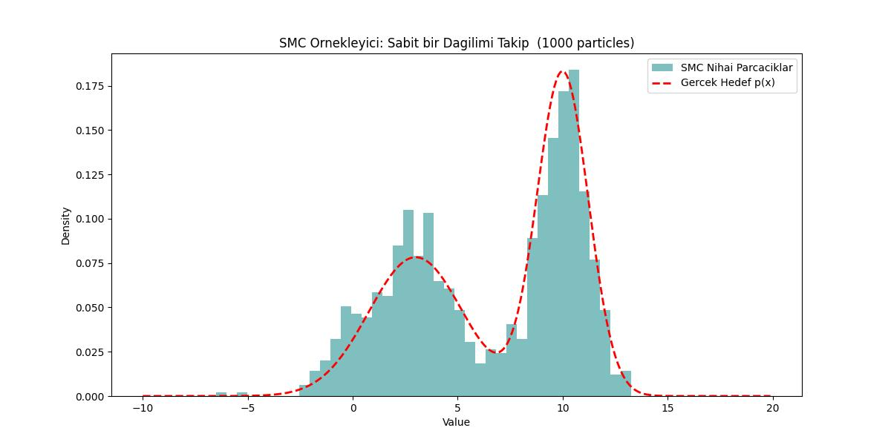

# Monte Carlo, Entegraller, Sıralı Monte Carlo

Monte Carlo entegrasyonu bir entegral mesela $f(x)$'i sayısal olarak kestirmek
(estimation), ona yakın bir sonuca sayısal olarak erişmenin
yöntemidir. Arkasında yatan teori oldukca basit, diyelim ki $f(x)$'i bir $D$
tanım bölgesi (domain) üzerinden entegre etmek istiyoruz [1].

$$
I = \int_{x \in D} f(x) \mathrm{d} x
$$

Tek değişkenli fonksiyonlar için etki tek boyutlu ve entegrasyon sınırları
basit olarak $a$ ile $b$ arasında.

Biraz cebirsel numara yaparsak, mesela üstteki formülü $p(x)$ ile çarpalım
bölelim (hiçbir değişiklik yaratmamış oluyoruz aslında)

$$
I = \int_{a}^{b} \frac{f(x)}{p(x)} p(x) \mathrm{d} x
$$

$f(x)/p(x)$ bölümüne bir isim verelim, mesela $g(x)$,

$$
I = \int_{a}^{b} g(x) p(x) \mathrm{d} x
$$

Üstteki formül bir beklenti (expectation) hesabına benzemiyor mu? Evet,
$g(x)$'in $p(x)$ yoğunluğu üzerinden beklentisi bu formüldür, 

$$
E[g(x)] = I = \int_{a}^{b} g(x) p(x) \mathrm{d} x
$$

Beklenti hesabını örneklem ortalaması ile yaklaşık hesaplayabileceğimizi
biliyoruz, etki alanından $N$ tane $x_i$ örneklemi alalım mesela, o zaman

$$
E[g(x)] \approx
\frac{1}{N} \sum_{i=1}^{N} g(x_i) =
\frac{1}{N} \sum_{i=1}^{N} \frac{f(x_i)}{g(x_i)}
$$

Diyelim ki $a,b$ arasında örneklem aldığımız sayılar birörnek (uniform)
dağılımdan geliyor, yani $p(x)$ birörnek dağılımın yoğunluğu, $p(x) = 1/(b-a)$,
bunu üstteki son formüle sokarsak,

$$
= (b-a) \frac{1}{N} \sum_{i=1}^{N} f(x_i) 
$$

Bu son formül $f(x)$'in $a,b$ arasındaki ortalamasını hesaplıyor ve onu aralığın
uzunluğu ile çarpıyor, bir anlamda bir dikdörtgen alanını hesaplıyoruz,
ki bu dikdörtgenin eni $a,b$ aralığının uzunluğu, yüksekliği ise $f(x)$'in
beklenti değeri.

Mesela $f(x) = x^2$'nin entegralini bulalım, aralık $-2,+2$ arası,

```python
def func1(x):
    return x**2

def func1_int(a, b):
    return (1/3)*(b**3-a**3)
  
def mc_integrate(func, a, b, n = 1000):
    vals = np.random.uniform(a, b, n)
    y = [func(val) for val in vals]    
    y_mean = np.sum(y)/n
    integ = (b-a) * y_mean    
    return integ

print(f"Monte Carlo çözümü: {mc_integrate(func1, -2, 2, 500000): .4f}")
print(f"Analitik çözüm: {func1_int(-2, 2): .4f}")
```

```text
Monte Carlo çözümü:  5.3323
Analitik çözüm:  5.3333
```
```
Monte Carlo çözümü:  5.3254
Analitik çözüm:  5.3333
```

Eğer boyutları arttırsak çözümün genel yapısı değişmiyor mesela üç boyuta çıktık
diyelim [3, sf. 752], entegral hesabı alttaki gibi gözükecekti,

$$
\int_{x_0}^{x_1} \int_{y_0}^{y_1} \int_{z_0}^{z_1}  f(x,y,z) \mathrm{d} x \mathrm{d} y \mathrm{d} z
$$

O zaman Monte Carlo hesabı için $X_i = (x_i,y_i,z_i)$ örneklemi almak gerekir,
çok boyutlu yine birörnek dağılımdan diyelim, ve $p(X)$ hesaplanır, ve kestirme
hesap

$$
\frac{(x_1-x_0)(y_1-y_0)(z_1-z_0)}{N} \sum_i f(X_i)
$$

Bu hesap için bir örnek, iki boyutlu bir fonksiyonun entegralini hesaplayalım,
$f(x) = 10 - x_1^2 - x_2^2$, sınırlar $-2,+2$ olsun.

```python
def func1(x):
    return 10 + np.sum(-1*np.power(x, 2), axis=1)
  
def mc_integrate(func, a, b, dim, n = 1000):
    x_list = np.random.uniform(a, b, (n, dim))
    y = func(x_list)
    y_mean =  y.sum()/len(y)
    domain = np.power(b-a, dim)
    integ = domain * y_mean
    return integ

print(f"Monte Carlo çözümü : {mc_integrate(func1, -2, 2, 2, 1000000): .3f}")
print(f"Analitik çözüm: 117.333")
```

```
Monte Carlo çözümü :  117.305
Analitik çözüm: 117.333
```

Doğru Sonuca Yakınsama

Fakat niye Monte Carlo hesaplamanın normal sayısal entegral yöntemlerinden daha
iyi olacağını motive etmedik / açıklamadık. Sonuçta $a,b$ arası birörnek
dağılımdan örneklem almak niye bu aralığı eşit parçalara bölerek dikdörtgen
alanlarını klasik şekilde toplamaktan daha iyi olsun ki?

Bu sorunun cevabı çok boyutlulukta gizli; MC tek boyutta diğer klasik yöntemlere
kıyasla aşağı yukarı aynı cevabı aynı hızda verebilir, fakat yüksek boyutlara
çıktıkça MC yöntemleri parlamaya başlıyor çünkü hataları örneklem büyüklüğü $N$
sayısına bağlı, boyut sayısına değil. Klasik sayısal yöntemlerde boyut arttıkça
hesapsal yükler katlanarak artar, MC bu tür problemlerden korunaklıdır.

İspatlamak için MC tahmin edici / kestirme hesaplayıcı (estimator) varyansını
hesaplamak bilgilendirici olur. Bu varyans bize ortalama hata hakkında ipucu
verecektir, ve hatanın azalmasında hangi faktörlerin rol oynadığını
gösterir. Biraz önce hesaplanan büyüklüğü hatırlarsak, ona $\bar{g}$
diyelim [2, sf. 455],

$$
\bar{g} = \frac{1}{N} \sum_{i=1}^{N} g(X_i)
$$

$$
Var(\bar{g}) = Var \left[ \frac{1}{N} \sum_{i=1}^{N} g(X_i)  \right]
$$

Varyans operasyonu toplamın içine nüfuz edebilir, ayrıca sabitler karesi
alınarak dışarı çıkartılabilir, o zaman

$$
= \frac{1}{N^2} \sum_{i=1}^{N} Var[ g(X_i)]  
$$

Eğer herhangi bir $X_1,X_2,..$ değişkenine $X$ dersek ve tüm $X_i$ rasgele
değişkenlerinin varyansı aynı olacağı için üstteki toplam aynı varyansı $N$
kere toplar, o zaman $N$ dışarı çıkartılıp $1/N^2$ deki bir $N$'yi iptal etmek
için kullanılabilir, yani 

$$
Var(\bar{g}) = \frac{1}{N} Var[ g(X)]  
$$

Her iki tarafın karekökünü alırsak,

$$
\sqrt{Var(\bar{g})} = \frac{1}{\sqrt{N}} \sqrt{Var[ g(X)]}
$$

Gördüğümüz gibi örneklem ortalamasının standart sapması $1/\sqrt{N}$ oranında
küçülüyor, eğer $n$'yi dört katına çıkartırsak, yani dört kat daha fazla
örneklem kullanırsak, standart sapma yarıya düşüyor. Bu düşüş yüksek boyutlarda
da geçerli oluyor, bu sebeple Monte Carlo yöntemleri yüksek boyutta klasik
sayısal entegral yöntemlerinden daha iyi performans gösteriyor.

Kıyasla eksenleri eşit parçalara bölerek entegre hesaplayan yöntemler
(quadrature) boyutlar yükseldikça problem yaşarlar. Diyelim ki tek boyutta
sayısal entegral hesap için başlangıç ve bitiş sınırları arasını 10 parçaya
bölüyoruz. Boyutlar ikiye çıkarsa ve aynı yöntemle devam edersek 10 çarpı 10 =
100 noktalı bir izgara (grid) elde ederiz. Bir sonraki boyut için benzer büyüme,
10'ar 10'ar bir artış var elimizde. Altı boyut bizi 1 milyon noktaya getirir ve
dikkat, öyle müthiş bir çözünürlülük te kullanmadık, sınırlar arasında 10 tane
nokta var sadece. Eğer çözünürlüğü arttırsak, 100 desek bunun katlanarak artması
bizi çok büyük rakamlara getirecektir, ve bu kadar fazla hesap noktası hesapsal
yükü arttırıp hesap algoritmasinin yavaşlatacaktır. Monte Carlo yaklaşımları
"boyut laneti (the curse of dimensionality)'' denen kavramdan korunaklıdır, $N$
arttıkça performansı artar, ve bu $N$ sayısı boyut $D$ ile bağlantılı değildir.

### Parçacık Filtreleri

Parçacık filtresini, ya da Sıralı Monte Carlo yaklaşımını anlamak için
statik tahmin ile dinamik durum-uzayı modelleri arasındaki boşluğu
kapatmamız gerekiyor. Gereken matematiksel işlemler alttadır.

Monte Carlo İntegrasyonu: Bu konuyu üstte işlemiştik, tekrar üzerinden
geçelim. Monte Carlo yöntemleri, karmaşık bir integrali, $p(x)$
dağılımını $N$ adet rastgele örnek (parçacık) kümesiyle
$\{x^{(i)}\}_{i=1}^N$ temsil ederek yaklaşık olarak hesaplar.

Şu formdaki bir integral için:
$$I = \int f(x) p(x) dx$$

Bunu sayısal ortalama kullanarak yaklaşık olarak hesaplayabiliriz:
$$\hat{I} \approx \frac{1}{N} \sum_{i=1}^N f(x^{(i)})$$ burada
$x^{(i)} \sim p(x)$. $N \to \infty$ iken, tahmin Büyük Sayılar Yasası
sayesinde gerçek değere yakınsar.

Önem Örneklemesi: Pek çok durumda, "hedef" dağılım $p(x)$'ten doğrudan
örnekleyemeyiz, çünkü bu dağılım bilinmiyor ya da karmaşık
olabilir. Bunun yerine, bilinen bir öneri dağılımı $q(x)$'ten
örnekleme yaparız (önem yoğunluğu olarak da adlandırılır).

İntegrali şu şekilde yeniden yazarız:

$$
I = \int f(x) \frac{p(x)}{q(x)} q(x) dx
$$

$w(x) = \frac{p(x)}{q(x)}$ terimi normalleştirilmemiş önem
ağırlığıdır. Monte Carlo tahmini şu hale gelir:

$$
\hat{I} \approx \frac{1}{N} \sum_{i=1}^N f(x^{(i)}) w(x^{(i)}) \quad
\text{burada } x^{(i)} \sim q(x)
$$

Normalleştirme

Bayesçi filtrelemede, $p(x)$'i çoğunlukla yalnızca bir normalleştirme
sabitine kadar biliriz (yani $p(x) \propto \pi(x)$). Paydayı
bilmiyorsak, Öz-Normalleştirilmiş Önem Örneklemesi kullanırız:

$$I \approx \frac{\sum_{i=1}^N f(x^{(i)}) w(x^{(i)})}{\sum_{j=1}^N w(x^{(j)})}$$

Normalleştirilmiş ağırlıkları $W^{(i)} = \frac{w(x^{(i)})}{\sum
w(x^{(j)})}$ olarak tanımlarsak şunu elde ederiz:

$$\hat{I} \approx \sum_{i=1}^N W^{(i)} f(x^{(i)})$$

Sıralı Önem Örneklemesi (SIS)

$Y_t = y_{1:t}$, $X_t = x_{0:t}$ olduğunu varsayalım.

Şimdi yukarıdakileri, $Y_t$ gözlemlerine dayanarak $X_t$ durum
dizisini tahmin etmek istediğimiz dinamik bir sisteme
uyguluyoruz. Hedef dağılım, sonsal dağılım $p(X_t | Y_t)$'dir.

Özyinelemeli Hedef

Bayes kuralını kullanarak, $t$ anındaki sonsal dağılım, $t-1$ anındaki
sonsal dağılım cinsinden şöyle ifade edilebilir:

$$
p(X_t | Y_t) \propto p(y_t | x_t) p(x_t | x_{t-1}) p(X_{t-1} |
Y_{t-1})
\tag{1}
$$

Bunu nasıl elde ettik?

Bu, türetmenin en kritik kısmıdır; çünkü o büyük ortak olasılığı küçük, yönetilebilir parçalara ayırmak için Birinci Dereceden Markov Özelliği ve Ölçüm Bağımsızlığı varsayımlarına dayanır. Bir kenara not düşelim; böyle bir çerçeve şu şekilde tanımlanır:

Evrim (veya Geçiş) Modeli:
   $p(x_t | X_{t-1}) = p(x_t | x_{t-1})$
   Bu, Markov Özelliğidir. Mevcut durumun, en son duruma koşullu olarak geçmiş durumlardan bağımsız olduğunu belirtir.

Ölçüm (veya Gözlem) Modeli:
   $p(y_t | X_t, Y_{t-1}) = p(y_t | x_t)$
   Bu, Ölçüm Bağımsızlığıdır. $t$ anındaki gözlemin, mevcut $x_t$ durumuna koşullu olarak diğer tüm değişkenlerden bağımsız olduğunu belirtir.

Devam ederek (1)'i genişletmek için, sonsal dağılımın tanımından
başlayıp Bayes Kuralı'nı kullanırız: $P(A, B | C) = P(B | A, C) P(A |
C)$.

En son ölçümü ($y_t$) ayır

$y_t$'yi "yeni kanıt" olarak, geri kalanı $(\mathbf{X}_t,
\mathbf{Y}_{t-1})$ ise bağlam olarak ele alıyoruz:

$$p(\mathbf{X}_t | \mathbf{Y}_t) = p(\mathbf{X}_t | y_t,
\mathbf{Y}_{t-1})$$

Bayes Kuralını uygula:

$$p(\mathbf{X}_t | y_t, \mathbf{Y}_{t-1}) = \frac{p(y_t |
\mathbf{X}_t, \mathbf{Y}_{t-1}) p(\mathbf{X}_t |
\mathbf{Y}_{t-1})}{p(y_t | \mathbf{Y}_{t-1})}$$

Yalnızca orantısallığa ($\propto$) ihtiyacımız olduğundan paydayı
düşürebiliriz:

$$
p(\mathbf{X}_t | \mathbf{Y}_t) \propto \underbrace{p(y_t | \mathbf{X}_t, \mathbf{Y}_{t-1})}_{\text{A Terimi}} \cdot \underbrace{p(\mathbf{X}_t | \mathbf{Y}_{t-1})}_{\text{B Terimi}}
$$

A Terimini Basitleştir (Olurluk)

A Terimi: $p(y_t | \mathbf{X}_t, \mathbf{Y}_{t-1})$

Bir GMM'de (Gizli Markov Modeli), $y_t$ ölçümü yalnızca mevcut $x_t$
durumuna bağlıdır. Geçmiş durumları ($\mathbf{X}_{t-1}$) veya geçmiş
ölçümleri ($\mathbf{Y}_{t-1}$) dikkate almaz.

Sonuç: $p(y_t | \mathbf{X}_t, \mathbf{Y}_{t-1}) = p(y_t | x_t)$

B Terimini Basitleştir (Tahmin)

B Terimi: $p(\mathbf{X}_t | \mathbf{Y}_{t-1})$

Şimdi $\mathbf{X}_t$ yolunu "mevcut durum" $x_t$ ve "önceki yol"
$\mathbf{X}_{t-1}$ olarak ayırıyoruz:

$$
p(x_t, \mathbf{X}_{t-1} | \mathbf{Y}_{t-1}) = p(x_t | \mathbf{X}_{t-1}, \mathbf{Y}_{t-1}) p(\mathbf{X}_{t-1} | \mathbf{Y}_{t-1})
$$

Bir GMM'de, $x_t$ durumu yalnızca bir önceki $x_{t-1}$ durumuna bağlıdır.
> Sonuç: $p(x_t | \mathbf{X}_{t-1}, \mathbf{Y}_{t-1}) = p(x_t | x_{t-1})$

Basitleştirilmiş terimleri denkleme geri koy:

$$
p(\mathbf{X}_t | \mathbf{Y}_t) \propto \underbrace{p(y_t | x_t)}_{\text{A Teriminden}} \cdot \underbrace{p(x_t | x_{t-1}) p(\mathbf{X}_{t-1} | \mathbf{Y}_{t-1})}_{\text{B Teriminden}}
$$

Bu neden "Özyinelemeli"dir

Son terime bakın: $p(\mathbf{X}_{t-1} | \mathbf{Y}_{t-1})$.  Bu,
başlangıç noktamızla birebir aynı formdadır; yalnızca bir zaman adımı
geriye kaydırılmıştır. Bu şu anlama gelir:

* Mevcut inanç, önceki inancın yalnızca ölçeklendirilmiş bir versiyonudur.

* Yeni inancı elde etmek için eskisini alır, "fizik" ile (geçiş)
  çarpar ve ardından "algılayıcı (sensor)" ile (olurluk) çarparsınız.

Bunu takip etmek için yalnızca iki "Markovian" kuralı kabul etmeniz gerekir:
Ölçüm Bağımsızlığı: $y_t$ yalnızca $x_t$'yi görür.
Durum Bağımsızlığı: $x_t$ yalnızca $x_{t-1}$'i hatırlar.

Bu iki kural geçerliyse, devasa ortak olasılık $p(\mathbf{X}_t |
\mathbf{Y}_t)$ o basit çarpıma kolayca indirgenebilir.

Özyinelemeli Öneri

Benzer şekilde çarpanlara ayrılan bir öneri dağılımı seçeriz:
$$q(X_t | Y_t) = q(x_t | X_{t-1}, Y_t) q(X_{t-1} | Y_{t-1})$$

Ağırlık Güncellemesi

Tam bir $X_t^{(i)}$ yörüngesi için ağırlık şudur:

$$w_t^{(i)} = \frac{p(X_t^{(i)} | Y_t)}{q(X_t^{(i)} | Y_t)}$$

Yukarıdaki özyinelemeli tanımları yerine koyarak:

$$
w_t^{(i)} \propto \frac{p(y_t | x_t^{(i)}) p(x_t^{(i)} | x_{t-1}^{(i)}) p(X_{t-1}^{(i)} | Y_{t-1})}{q(x_t^{(i)} | X_{t-1}^{(i)}, Y_t) q(X_{t-1}^{(i)} | Y_{t-1})}
$$

Bu, Sıralı Ağırlık Güncellemesine basitleşir:

$$
w_t^{(i)} \propto w_{t-1}^{(i)} \cdot \frac{p(y_t | x_t^{(i)})
p(x_t^{(i)} | x_{t-1}^{(i)})}{q(x_t^{(i)} | X_{t-1}^{(i)}, Y_t)}
$$

Not: Öneri dağılımı için en yaygın seçim, geçiş önselidir: $q(x_t |
x_{t-1}, y_t) = p(x_t | x_{t-1})$.

Bu seçim altında, ağırlık güncellemesi güzel bir biçimde olurluğa
sadeleşir:

$$
w_t^{(i)} \propto w_{t-1}^{(i)} \cdot \frac{p(y_t | x_t^{(i)})\,
\cancel{p(x_t^{(i)} | x_{t-1}^{(i)})}}{\cancel{p(x_t^{(i)} |
x_{t-1}^{(i)})}}
$$

$$
w_t^{(i)} \propto w_{t-1}^{(i)} \cdot p(y_t | x_t^{(i)})
$$

Parçacık Filtresi (SİR): Standart SİS algoritmasi bozulma problemiyle
muzdariptir: birkaç döngü sonrasında parçacıkların neredeyse tamamının
ağırlığı ihmal edilebilir düzeye düşer. Bunu çözmek için bir Yeniden
Örnekleme adımı ekliyoruz. Etkin örneklem boyutu çok düşerse, mevcut
ağırlıklı parçacık kümesini, $w_t^{(i)}$ ile orantılı olarak yerine
koyarak örnekleme yaparak elde edilen yeni bir parçacık kümesiyle
değiştiririz. Bir diğer deyişle çözüm, ağırlıkla orantılı "seçmek",
tekrar örnekleme (resampling) kullanmaktır: Parçacıklar, yeni küme
için normalleştirilmiş ağırlıklarıyla ($w_t^{(i)}$) orantılı bir
olasılıkla "seçilir". Bu süreç, düşük ağırlıklı parçacıkları eler ve
yüksek ağırlıklıları çoğaltarak "sürüyü" en olası durumlar üzerinde
yeniden odaklar.

Yani formülde görülen yeni ağırlığı eski ağırlıkla çarpmak
($w_{t-1}^{(i)}$ terimi) yerine, yeniden örnekleme
gerçekleştiririz. Parçacıkları önceki ağırlıklarına göre örnekleyerek,
"başarılı" ağırlıklar kumulatif ondalık çarpma yoluyla değil,
parçacıkların *şıklığı* aracılığıyla ileriye taşınır. Her zaman
adımında yeniden örnekleme yaparız. Bunu yaptığınızda yeniden
örneklemeden "sağ kurtulan" tüm parçacıklar bir sonraki tura eşit
ağırlıklarla ($1/L$) başlar. Dolayısıyla $w_{t-1}^{(i)}$, tüm $i$
değerleri için etkin biçimde bir sabit ($1/L$) haline gelir. Formül
$w_t^{(i)} \propto \text{sabit} \cdot p(y_t | x_t^{(i)})$ şeklinde
sadeleşir.

Bu uygulamada, $w_{t-1}^{(i)}$ terimi yeniden örnekleme adımı
tarafından hesaba katılır. Eski ağırlıklarla çarpmayız, çünkü hangi
parçacıkların tutulacağını seçmek için o ağırlıkları zaten
kullanmışızdır. Değerlendirdiğimiz her parçacık zaman adımına "temiz
bir sayfa" ile başlar ve onu yalnızca yeni olurluk $p(y_t |
x_t^{(i)})$ ile güncellememiz gerekir.

Basit bir örnek üzerinde ile düşünmek gerekirse mesela elimizde dört
parçacık olsun, sırasıyla `5`, `10`, `12`, `13` değerleri hipotezini
taşıyorlar, ve ağırlıkları `5:3`, `10:1`, `12:0.5`, `13:0.1`. Tekrar
örneklem işleminden sonra `5:0.25`, `5:0.25`, `5:0.25`, `12:0.25`
parçacıklarına sahip olabiliriz, dikkat edilirse `13` değeri tamamen
atılmıştır, `5` değerini taşıyan parçacık çoğaltılmıştır, ve ağırlık
değerleri tamamen birbirine eşittir.

Örnek

Bir grafikte "yüz takibi" problemini `face.py` içinde bulabilirsiniz,
örnek [4, sf. 613] Matlab kodundan tercüme edilmiştir.

Bir görüntüde hareket eden bir yüz şekli var. Gizli hareket bir önceki
konuma eklenen Gaussian gürültüdür, yani Brownian hareket. Bu yüz
şeklinin şablon olarak şeklini biliyoruz. Peki filtreleme için gereken
"sinyal" nedir?  Yüz şeklini arayıp buluyor muyuz?

Parcaçık yaklaşımı için bize gereken tüm pikselleri ağırlıklara
Dönüştürmek. Kod, parçacığın tahmin ettiği yüz görüntüsünü gerçek
gürültülü görüntüden çıkarır (`np.abs(v_t - v_pred)`) ve üstel
puanlama yapar, `np.exp(-0.5 * diff)`.

* Fark düşükse (parçacık yüzün üzerindeyse), ağırlık yüksektir.

* Fark yüksekse (parçacık boş alandaysa), ağırlık düşüktür.

Sonuç: Bir Olasılık Haritası. Filtre, yüzü başlangıçta tek bir nokta
olarak "bulmaz"; bir dağılım oluşturur. "Sinyal", parçacık
ağırlıklarının bütünsel kümesidir.

Özetle, yüz "bulunur"; çünkü yüz şablonunun siyah pikselleriyle
örtüşen parçacıklar $p(y_t | x_t)$ skorlarında büyük bir artış
alırken, "arka plan" gürültüsündeki parçacıklara sıfıra yakın
ağırlıklar atanır ve bu parçacıklar Yeniden Örnekleme sırasında
sonunda elenirler.

Ölçüm olurluğunu hatırlayalım, $p(y_t | x_t^{(i)})$. İşte "bulma"
işlemi `compat` ile oluyor, daha doğrusu algoritmik şekilde arayıp
bulmak yerine her parçacığa olasılıksal bir soru soruyoruz: "eğer bir
yüz tam bu parçacığın dediği yerde ($x_t^{(i)}$) olsaydı, sonuç
görüntü benim şu anda baktığım gürültülü görüntü $y_t$'ye ne kadar
benzerdi?"

Fark alma bir görüntüyü diğerinden çıkarma kafamızı karıştırmasın,
sonuçta parçacık hipotezi tek boyutlu Gaussian olsaydı ve elimize
geçen verinin olurluğunu hesaplamak gerekseydi, bu veriyi Gaussian
$\mu$ parametresinden çıkartmak gerekmez miydi, çünkü yoğunluğu
hatırlarsak $f(x) = 1/Z \exp (- (x-\mu)^2 / 2\sigma^2)$, orada bir
$x-\mu$, çıkartma işlemi var.

Örnek

```python
# Hedef dağılımınız
def p(x):
    mu1 = 3; mu2 = 10; v1 = 10; v2 = 3
    return 0.3 * np.exp(-(x - mu1)**2 / v1) + 0.7 * np.exp(-(x - mu2)**2 / v2)

# --- SMC Parametreleri ---
n_particles = 1000    # Paralel "takipçi" sayısı
n_steps = 20          # Ara "kare" sayısı (sıcaklıklar)
sigma_mcmc = 2.0      # Mutasyon adımı için "sallama" genişliği

# 1. Başlatma (Öncül)
# Parçacıkları alan üzerinde düzgün biçimde yayarak başlıyoruz
particles = np.random.uniform(-10, 20, n_particles)
weights = np.ones(n_particles) / n_particles

# Sıcaklık takvimi (0'dan 1'e doğrusal köprü)
betas = np.linspace(0, 1, n_steps)

# --- SMC Ana Döngüsü ---
for t in range(1, n_steps):
    # A. YENİDEN AĞIRLIKLAMA (Gözlem Adımı)
    # Ağırlıkları şu orana göre güncelliyoruz: p(x)^beta_yeni / p(x)^beta_eski
    # Parçacıkların dağılımın keskinleştiğini "hissettiği" yer burasıdır
    delta_beta = betas[t] - betas[t-1]
    
    # p(x) çok küçükse sıfıra bölmekten kaçınmak için küçük bir epsilon kullanıyoruz
    incremental_weights = np.power(np.maximum(p(particles), 1e-10), delta_beta)
    weights *= incremental_weights
    weights /= np.sum(weights)  # Normalleştir
    
    # B. YENİDEN ÖRNEKLEME (Hayatta Kalma Adımı)
    # Görüdeki gibi: düşük ağırlıklı parçacıklar ölür, yüksek ağırlıklılar klonlanır.
    # Yeniden örnekleyip örneklemeyeceğimize karar vermek için Etkin Örneklem Boyutu'nu (ESS) kontrol ediyoruz
    ess = 1.0 / np.sum(weights**2)
    if ess < n_particles / 2:
        indices = np.random.choice(np.arange(n_particles), size=n_particles, p=weights)
        particles = particles[indices]
        weights = np.ones(n_particles) / n_particles
        
    # C. MUTASYON ("Sallama" / MCMC Adımı)
    # Bu, "bulutun" tek bir noktaya çökmesini önler.
    # Her parçacık için birkaç Metropolis adımı çalıştırıyoruz.
    for _ in range(3):
        proposals = particles + np.random.normal(0, sigma_mcmc, n_particles)
        # Mevcut sıcaklık betas[t] için kabul oranı
        ratio = (p(proposals)**betas[t]) / (p(particles)**betas[t])
        accept = np.random.rand(n_particles) < ratio
        particles[accept] = proposals[accept]
    
# --- Görselleştirme ---
x_plot = np.arange(-10, 20, 0.1)
px_plot = p(x_plot)
px_norm = px_plot / np.trapezoid(px_plot, x_plot)
plt.figure(figsize=(12, 6))
# Nihai SMC Sonucunu Çiz
plt.hist(particles, bins=40, density=True, alpha=0.5, label='SMC Nihai Parcaciklar', color='teal')
plt.plot(x_plot, px_norm, 'r--', linewidth=2, label='Gercek Hedef p(x)')

plt.title(f"SMC Ornekleyici: Sabit bir Dagilimi Takip  ({n_particles} particles)")
plt.xlabel("Value")
plt.ylabel("Density")
plt.legend()

plt.savefig('stat_095_mcint_01.jpg')
```



Kodlar

[face.py](face.py)

Kaynaklar

[1] Zhao, *Monte Carlo integration in Python over univariate and multivariate functions*,
    [https://boyangzhao.github.io/posts/monte-carlo-integration](https://boyangzhao.github.io/posts/monte-carlo-integration)

[2] Gezerlis, *Numerical Methods in Physics with Python*
    
[3] Pharr, *Physically Based Rendering 3rd Ed*

[4] Barber, *Bayesian Reasoning and Machine Learning*